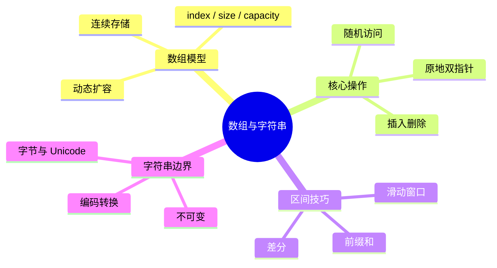

# 数组与字符串

## 本节知识地图



## 零基础先建立三个模型

### 1. 逻辑序列

读者看到的是：

```text
[a0, a1, a2, ...]
```

可以按位置读取、替换、插入和删除。

### 2. 物理布局

数组通常把元素放在连续槽位：

```text
地址： 100  104  108  112
元素：  a0   a1   a2   a3
```

如果每个元素占 `w` 字节：

```text
address(a[i]) = base + i * w
```

这就是随机访问 O(1) 的原因。

### 3. 约束边界

任何数组接口都要先确认：

- 下标从 0 还是 1 开始。
- 区间是 `[left, right]` 还是 `[left, right)`。
- 是否允许负索引。
- 修改是否原地。
- 返回长度还是新容器。

很多数组题错的不是算法，而是区间口径前后不一致。

数组和字符串是算法面试中出现频率最高的数据结构。几乎所有其他数据结构和算法都建立在它们之上。扎实掌握数组与字符串的基本操作和常见题型，是刷题之路的第一步。

## 接口契约

本节把 Python `list`、字符串和“抽象数组”分开看。下面的复杂度默认 CPython 中常见动态数组实现，其他语言或实现可能不同。

### `list` 的公开操作

| 操作 | 结果 | 是否修改 | 复杂度 | 空/非法行为 |
|---|---|---|---|---|
| `len(a)` | 元素个数 | 否 | O(1) | 空列表返回 0 |
| `a[i]` | 第 i 个元素 | 否 | O(1) | 越界抛 `IndexError`；支持负索引 |
| `a[i] = x` | 替换元素 | 是 | O(1) | 越界抛 `IndexError` |
| `a.append(x)` | 追加一个元素 | 是 | 均摊 O(1) | 总能追加，除非内存不足 |
| `a.extend(it)` | 追加可迭代对象 | 是 | O(k) | 迭代器异常会中断 |
| `a.insert(i, x)` | 在位置前插入 | 是 | O(n) | 索引会按 Python 规则截断到边界 |
| `a.pop()` | 删除并返回末尾 | 是 | O(1) | 空列表抛 `IndexError` |
| `a.pop(i)` | 删除并返回第 i 项 | 是 | O(n) | 越界抛 `IndexError` |
| `a.remove(x)` | 删除第一个等于 x 的元素 | 是 | O(n) | 不存在抛 `ValueError` |
| `x in a` | 是否存在 | 否 | O(n) | 使用 `==` 比较 |
| `a.index(x)` | 第一次出现位置 | 否 | O(n) | 不存在抛 `ValueError` |
| `a[i:j]` | 新列表副本 | 否 | O(j-i) | 左闭右开，步长可选 |
| `a.reverse()` | 原地反转 | 是 | O(n) | 返回 `None` |
| `a.sort()` | 原地排序 | 是 | O(n log n) | 返回 `None` |

### 索引和切片边界

```python
a = [10, 20, 30]

a[-1]       # 30，负索引从末尾计数
a[1:3]      # [20, 30]，左闭右开
a[10:20]    # []，切片越界通常不会抛异常
a[10]       # IndexError，单点访问会抛异常
a[::0]      # ValueError，步长不能为 0
```

单点访问和切片是两套不同的边界语义，不能混为“越界都报错”。

### 复制与别名

```python
a = [[1], [2]]
b = a              # 别名，修改 b 会影响 a
c = a.copy()       # 浅复制，外层列表独立，内层列表仍共享
d = [row[:] for row in a]  # 二维示例的深一层复制
```

函数文档应说明返回的是：

- 原对象本身。
- 新建容器。
- 共享节点/元素的浅副本。

### 动态数组扩容

`append` 平均很快，是因为容量不足时才偶尔扩容并搬迁元素。具体增长比例属于实现细节，不应把“约 1.125 倍”当成 Python 语言 API 保证；教程只承诺**均摊 O(1)**。

### 字符串接口

| 操作 | 结果 | 是否修改原字符串 | 典型边界 |
|---|---|---|---|
| `len(s)` | 字符串长度 | 否 | 空串为 0；长度口径由语言定义 |
| `s[i]` | 单个字符 | 否 | 越界抛 `IndexError` |
| `s[i:j]` | 子串 | 否 | 左闭右开 |
| `s.split(sep)` | 字符串列表 | 否 | `sep=None` 有空白折叠规则 |
| `sep.join(parts)` | 新字符串 | 否 | 元素必须是字符串 |
| `s.find(sub)` | 首次位置或 -1 | 否 | 找不到返回 -1 |
| `s.index(sub)` | 首次位置 | 否 | 找不到抛 `ValueError` |
| `s.replace(a, b)` | 新字符串 | 否 | 原串不变 |
| `s.strip(chars)` | 新字符串 | 否 | 去首尾字符集合，不是固定子串 |

字符串不可变，所以所谓“修改字符串”实际是创建新对象；`list(s)` 只是把字符复制到可变容器。

## 从数组到动态数组：自己实现一遍

### 1. 静态数组和动态数组

**静态数组**在创建时确定容量：

```text
capacity = 5
[空][空][空][空][空]
```

它适合大小已知、内存布局稳定的场景，但追加超过容量时必须创建更大的区域。

**动态数组**把两个概念分开：

```text
size     = 当前有效元素数量
capacity = 已分配槽位数量
```

例如：

```text
size=3, capacity=8
[10][20][30][空][空][空][空][空]
```

追加前三个元素只修改有效区域，不必每次申请内存。

### 2. 扩容为什么是均摊 O(1)

容量不足时：

1. 申请更大的连续区域。
2. 复制旧元素。
3. 释放旧区域。
4. 把新元素放入空槽。

单次扩容是 O(n)，但若容量按倍数增长，连续 n 次 append 的总复制次数是几何级数：

```text
1 + 2 + 4 + 8 + ... < 2n
```

因此 n 次 append 的总成本 O(n)，平均到每次是**均摊 O(1)**。均摊不是每一次都 O(1)：触发扩容的那一次仍然可能很慢。

### 3. 为什么插入和删除要移动元素

数组要求有效元素连续：

```text
原来：[A][B][C][D]
在 B 前插入 X
结果：[A][X][B][C][D]
```

C、D 必须向右移动。删除 B 时，C、D 又要向左移动填补空洞。

移动方向很重要：

- 插入时通常从后向前移动，避免覆盖还未搬走的元素。
- 删除时通常从前向后移动。

### 4. 一个最小 DynamicArray

下面的实现只使用 Python 的固定容量列表作为底层存储；对外暴露的有效元素数量由 `_size` 管理：

```python
class DynamicArray:
    def __init__(self, iterable=(), initial_capacity=4):
        if initial_capacity < 1:
            raise ValueError("initial_capacity must be positive")
        self._data = [None] * initial_capacity
        self._size = 0
        for value in iterable:
            self.append(value)

    def __len__(self):
        return self._size

    @property
    def capacity(self):
        return len(self._data)

    def _normalize_index(self, index):
        if index < 0:
            index += self._size
        if not 0 <= index < self._size:
            raise IndexError("array index out of range")
        return index

    def _check_insert_index(self, index):
        # 插入允许 index == size，表示追加到末尾
        if index < 0:
            index = max(0, index + self._size)
        return min(index, self._size)

    def _grow(self):
        new_capacity = max(1, len(self._data) * 2)
        new_data = [None] * new_capacity
        new_data[:self._size] = self._data[:self._size]
        self._data = new_data

    def __getitem__(self, index):
        return self._data[self._normalize_index(index)]

    def __setitem__(self, index, value):
        self._data[self._normalize_index(index)] = value

    def append(self, value):
        if self._size == len(self._data):
            self._grow()
        self._data[self._size] = value
        self._size += 1

    def insert(self, index, value):
        index = self._check_insert_index(index)
        if self._size == len(self._data):
            self._grow()
        for position in range(self._size, index, -1):
            self._data[position] = self._data[position - 1]
        self._data[index] = value
        self._size += 1

    def pop(self, index=-1):
        index = self._normalize_index(index)
        value = self._data[index]
        for position in range(index, self._size - 1):
            self._data[position] = self._data[position + 1]
        self._data[self._size - 1] = None
        self._size -= 1
        return value

    def remove(self, value):
        for index in range(self._size):
            if self._data[index] == value:
                self.pop(index)
                return
        raise ValueError("value is not present")

    def to_list(self):
        return self._data[:self._size]
```

### 5. 这个实现的接口契约

| 操作 | 成功结果 | 失败结果 | 复杂度 |
|---|---|---|---|
| `len(array)` | 有效元素数量 | 无 | O(1) |
| `array[i]` | 返回第 i 项 | `IndexError` | O(1) |
| `array[i] = value` | 原地替换 | `IndexError` | O(1) |
| `append(value)` | size 增一 | 内存不足 | 均摊 O(1) |
| `insert(i, value)` | 后缀右移并插入 | 索引按插入规则截断 | O(n) |
| `pop(i)` | 删除并返回值 | 空/越界 `IndexError` | O(n)，末尾 O(1) |
| `remove(value)` | 删除第一个匹配值 | `ValueError` | O(n) |
| `to_list()` | 返回新列表 | 无 | O(n) |

注意 `to_list()` 返回副本，而 `array[i]` 返回元素引用；这是两种不同的别名语义。

### 6. 什么时候缩容

只扩容不缩容会让大量删除后的数组仍占据大容量。实现可在：

```text
size / capacity < 某个下限
```

时缩容，但不能每删一个元素就缩容，否则反复增删会产生抖动。工程实现通常设置较低阈值，并保留最小容量。

### 7. 为什么不能把 capacity 当 size

```python
array = DynamicArray(initial_capacity=8)
```

此时：

```text
len(array) = 0
capacity   = 8
```

未写入槽位不是有效元素。遍历必须只遍历 `[0, size)`，不能把底层空槽也返回。

### 8. 迭代器与修改

高级容器还要定义：

- 遍历期间修改是否允许。
- 修改后迭代器是否失效。
- 是否支持 `__iter__`。
- 是否保证顺序。

简单刷题代码可以只提供 `to_list()`；通用库则应明确 fail-fast 或快照语义。

---

## 二维数组与别名陷阱

### 1. 错误初始化

```python
matrix = [[0] * cols] * rows
```

这会让每一行引用同一个列表：

```python
matrix[0][0] = 1
# 可能导致所有行的第 0 列都变成 1
```

### 2. 正确初始化

```python
matrix = [[0] * cols for _ in range(rows)]
```

每次循环创建独立的内层列表。

### 3. 二维数组接口

| 操作 | 复杂度 | 边界 |
|---|---:|---|
| `matrix[r][c]` | O(1) | 行列越界抛 `IndexError` |
| 替换单元格 | O(1) | 不改变矩阵形状 |
| 插入整行 | O(rows + cells) | 会改变行数 |
| 插入整列 | O(rows × cols) | 每行都要移动 |
| 拷贝矩阵 | O(rows × cols) | 浅/深层级要说明 |

### 4. 矩阵的形状不变量

矩阵通常要求：

```text
所有行长度相同
```

Python 的嵌套列表本身允许“锯齿数组”，但算法若假设 `matrix[r][c]` 始终存在，就必须在构造时校验每行长度。

---

## 字符串的底层与构造成本

### 1. 字符串不可变

```python
s = "abc"
s += "d"
```

表面像修改，实际通常是：

1. 分配更大的新字符串。
2. 复制旧内容。
3. 追加新内容。
4. 让变量指向新对象。

在循环中反复 `+=` 可能产生 O(n²) 总复制成本。

### 2. 正确的批量构造

```python
parts = []
for item in items:
    parts.append(format_item(item))
result = "".join(parts)
```

`join` 可以根据最终长度更高效地分配结果。

### 3. 字符串与字节

```python
text = "中"
raw = text.encode("utf-8")
```

`text` 是字符序列，`raw` 是字节序列。网络协议和文件接口通常传输 bytes，必须在边界明确编码和解码。

### 4. 不要把字符下标当字节下标

UTF-8 变长：

```python
text[0]         # 按字符语义
raw[0]          # 按字节语义
```

二者索引含义不同。截断 UTF-8 字节序列还可能产生非法编码。

### 5. 常用查找复杂度

| 操作 | 典型复杂度 | 说明 |
|---|---:|---|
| `s[i]` | O(1) 或与实现有关 | Python 按字符索引，但其他语言可能需遍历 |
| `sub in s` | O(n × m) 朴素上界 | 实现可能使用更快算法 |
| `find` | 依实现 | 不应盲背所有语言相同 |
| `split` | O(n) | 会创建多个新字符串 |
| `replace` | O(n) | 通常创建新字符串 |
| `join(parts)` | O(total output) | 需要构造结果 |

---

## 数组/字符串题的接口型解题模板

### 1. 双指针

接口问题：

- 指针表示下标还是边界。
- 区间是闭区间还是半开区间。
- 指针移动后是否仍保持不变量。
- 空数组时初始 `right` 是否为 `-1`。

### 2. 滑动窗口

窗口 API 可以抽象为：

```text
add(right)    把新元素加入状态
valid()       判断窗口是否满足约束
remove(left)  移除左端元素
answer()      更新答案
```

若 `remove` 没有同步更新计数，窗口就不再代表真实区间。

### 3. 前缀和

统一使用：

```text
prefix[0] = 0
prefix[i+1] = nums[0] + ... + nums[i]
sum(left, right) = prefix[right+1] - prefix[left]
```

接口明确为闭区间 `[left, right]`，可避免 `left=0` 的特殊分支。

### 4. 原地算法

接口必须明确：

- 返回新长度还是新数组。
- 原数组哪些位置保证有效。
- 尾部垃圾值是否有意义。
- 调用方是否必须只读取前 `new_length` 项。

`remove_element` 返回新长度后，调用者只能读取：

```python
nums[:new_length]
```

尾部内容未定义，不能继续当作结果。

---

## 面试表达：数组与字符串接口

### Q1：动态数组 append 为什么均摊 O(1)

> 动态数组维护 size 和 capacity。容量够时直接写入末尾，容量不足时按倍数申请更大连续区域并复制旧元素。单次扩容是 O(n)，但 n 次追加的总复制成本是几何级数 O(n)，平均到每次是均摊 O(1)，不是每次严格 O(1)。

### Q2：数组中间插入为什么是 O(n)

> 数组要求有效元素连续，中间插入必须把后缀元素整体右移，最坏移动 n 个元素；删除则要把后缀左移。只有末尾追加/删除不需要移动，才是 O(1) 或均摊 O(1)。

### Q3：切片和原地修改有什么区别

> Python 切片会创建新列表，复杂度与切片长度成正比；原地修改复用原数组空间，通常只返回新长度或修改指定区间。接口必须说明调用方是否还能使用原数组以及尾部内容是否有效。

### Q4：二维列表 `[[0] * m] * n` 为什么错

> 外层重复的是同一个内层列表引用，不是复制 n 份独立行。修改一行会通过别名影响其他行，应使用列表推导为每行创建新对象。

### Q5：字符串为什么不适合循环拼接

> 字符串不可变，每次拼接通常都要创建新对象并复制旧内容，循环中可能产生 O(n²) 复制；应先收集片段，再用 join 一次构造。

---

## 边界测试清单

```python
# 数组
[]、[1]、负索引、越界索引、空 pop、切片越界、步长为 0

# 动态数组
容量恰好满、扩容瞬间、连续扩容、删除全部元素、删除不存在值

# 字符串
""、单字符、多字节 UTF-8、连续分隔符、找不到子串、join 空列表
```

## 接口速记卡

```text
读：a[i]，越界 IndexError
写：a[i] = value，原地修改
尾增：append，均摊 O(1)
中插：insert，移动后缀 O(n)
尾删：pop()，O(1)
中删：pop(i)，移动后缀 O(n)
切片：新列表，左闭右开
字符串：不可变，修改会创建新对象
```

先确认这些契约，再套用双指针、窗口和前缀和模板。

## 什么是数组

数组是一块**连续的内存空间**，用于存储相同类型（或在 Python 中为任意类型）的元素。

核心特性：

- **O(1) 随机访问**：通过索引直接计算内存地址，瞬间定位元素。
- **O(n) 插入 / 删除**：在中间位置操作时，需要移动后续所有元素。
- **缓存友好**：连续内存布局使 CPU 缓存命中率高，实际性能优于链表。

Python 中的 `list` 本质上是一个**动态数组**：当容量不够时会自动扩容（通常扩为原来的约 1.125 倍），均摊 append 时间复杂度为 O(1)。

| 操作 | 时间复杂度 | 说明 |
|------|-----------|------|
| 按索引访问 `a[i]` | O(1) | 随机访问 |
| 末尾追加 `a.append(x)` | 均摊 O(1) | 可能触发扩容 |
| 中间插入 `a.insert(i, x)` | O(n) | 需要移动元素 |
| 删除元素 `a.pop(i)` | O(n) | `pop()` 末尾删除为 O(1) |
| 查找元素 `x in a` | O(n) | 线性扫描 |
| 切片 `a[i:j]` | O(j-i) | 创建新列表 |

## 数组常用操作

### 遍历

```python
nums = [1, 2, 3, 4, 5]

# 遍历值
for num in nums:
    print(num)

# 同时获取索引和值
for i, num in enumerate(nums):
    print(i, num)
```

### 切片与反转

```python
a = [1, 2, 3, 4, 5]

a[1:4]      # [2, 3, 4]  —— 左闭右开
a[::-1]     # [5, 4, 3, 2, 1]  —— 反转
a[::2]      # [1, 3, 5]  —— 步长为 2
```

### 原地操作 vs 新建数组

面试中经常要求**原地修改**（in-place），即空间复杂度 O(1)，不允许新建等长数组。关键技巧是用**指针 / 索引**标记写入位置。

```python
# 原地移除所有值为 val 的元素，返回新长度
def remove_element(nums: list[int], val: int) -> int:
    slow = 0
    for fast in range(len(nums)):
        if nums[fast] != val:
            nums[slow] = nums[fast]
            slow += 1
    return slow
```

## 字符串基础

Python 字符串是**不可变对象**：任何"修改"操作都会创建新字符串。频繁拼接时应先收集到列表，再用 `join` 合并。

### 常用方法速查

```python
s = "  hello, world  "

s.strip()             # "hello, world"       去除首尾空白
s.split(", ")         # ["hello", "world"]   按分隔符拆分
", ".join(["a","b"])  # "a, b"               用分隔符连接
s.replace("o", "0")   # "  hell0, w0rld  "   替换子串
s.find("world")       # 9                    查找子串位置，未找到返回 -1
```

### 字符串与列表互转

```python
s = "hello"
chars = list(s)        # ['h', 'e', 'l', 'l', 'o']
chars.reverse()        # 原地反转列表
result = "".join(chars) # "olleh"
```

这是面试中处理"原地修改字符串"类题目的标准做法：先转 list，操作完再转回。

## 最后一个面试陷阱

复杂度表必须绑定容器和语言：Python list 的切片复制、动态扩容和负索引语义，不能直接套到 C 数组、NumPy view 或其他语言的字符串实现上。

## 高频题型与解题模式

### 双指针

双指针是数组 / 字符串题目中最常用的技巧，核心思想是用两个指针协作遍历，将 O(n^2) 降为 O(n)。

#### 对撞指针

两个指针分别从数组两端向中间移动，常用于有序数组或需要考虑区间的场景。

```python
# 模板：对撞指针
def two_pointer(nums):
    left, right = 0, len(nums) - 1
    while left < right:
        # 根据条件移动指针
        if condition(nums[left], nums[right]):
            left += 1
        else:
            right -= 1
```

典型题目：
- **两数之和 II**（有序数组）：和太小则左指针右移，和太大则右指针左移。
- **盛最多水的容器**：每次移动较短的那一边，因为移动较长边不可能得到更大面积。

#### 快慢指针

两个指针同向移动，慢指针标记"已处理"区域的边界，快指针负责扫描。

```python
# 经典题：移动零到末尾（保持非零元素相对顺序）
def move_zeroes(nums: list[int]) -> None:
    slow = 0  # slow 指向下一个非零元素应放的位置
    for fast in range(len(nums)):
        if nums[fast] != 0:
            nums[slow], nums[fast] = nums[fast], nums[slow]
            slow += 1
```

### 滑动窗口

滑动窗口适用于**连续子数组 / 子串**问题。维护一个窗口 `[left, right)`，右端扩张探索、左端收缩维持约束。

```python
# 模板：最长满足条件的子串/子数组
def sliding_window(s):
    left = 0
    window = {}  # 窗口内的状态（如字符计数）
    result = 0

    for right in range(len(s)):
        # 1. 扩张：将 s[right] 加入窗口
        window[s[right]] = window.get(s[right], 0) + 1

        # 2. 收缩：当窗口不满足条件时，移动左端
        while not valid(window):
            window[s[left]] -= 1
            if window[s[left]] == 0:
                del window[s[left]]
            left += 1

        # 3. 更新答案
        result = max(result, right - left + 1)

    return result
```

典型题目：
- **最长无重复子串**：窗口内不允许重复字符，出现重复时收缩左端。
- **最小覆盖子串**：窗口需包含目标所有字符，满足时尝试收缩。

### 前缀和

前缀和将"区间求和"从 O(n) 降为 O(1)，是处理子数组求和问题的利器。

```python
# 构建前缀和数组
nums = [1, 2, 3, 4, 5]
prefix = [0] * (len(nums) + 1)
for i in range(len(nums)):
    prefix[i + 1] = prefix[i] + nums[i]
# prefix = [0, 1, 3, 6, 10, 15]

# 区间 [i, j] 的和 = prefix[j+1] - prefix[i]
# 例：nums[1:4] 的和 = prefix[4] - prefix[1] = 10 - 1 = 9
```

结合哈希表可以解决"和为 k 的子数组个数"等问题：遍历时记录已出现的前缀和，查找 `当前前缀和 - k` 是否存在。

## 经典题目

## 数组接口的面试追问

### Q9：负索引和越界切片为什么不同

> `a[-1]` 会把下标转换为 `len(a)-1`，转换后仍越界就抛 `IndexError`；切片描述的是一个范围，Python 会把范围裁剪到合法边界，所以 `a[100:200]` 返回空列表。两者是不同接口契约。

### Q10：`append` 的均摊 O(1) 是否适用于 `insert`

> 不适用。append 通常只写末尾空槽，扩容成本可均摊；insert 即使容量足够也要移动后缀元素，随机位置最坏 O(n)。只有在末尾插入才接近 append。

### Q11：为什么二维列表容易出现联动修改

> 外层复制可能只复制引用，多个行变量指向同一个内层列表。每行必须独立创建；返回二维切片时也要说明是浅复制还是深复制。

### Q12：如何设计可测试的数组 API

> 把状态分成 size、capacity 和有效数据区，所有下标入口统一校验；操作明确返回值和是否原地；测试空、满、扩容、缩容、负索引、越界和别名。先验证不变量，再看复杂度。

## 手算数组移动

### 中间插入

```text
原数组：[10, 20, 30, 40]
在 index=2 插入 99
```

从后向前移动：

```text
40 -> index 4
30 -> index 3
99 -> index 2
```

如果从前向后移动，先写入的位置会覆盖还没搬走的 30，导致数据丢失。

### 中间删除

```text
删除 index=1 的 20
20 <- 30
30 <- 40
size -= 1
```

最后一个槽位应清理旧引用，避免对象仍被底层数组持有。

### 扩容不变量

```text
0 <= size <= capacity
有效元素只在 [0, size)
capacity 不足时先 grow 再写入
```

任何公开操作结束后都必须满足这三条。

## 数组与字符串综合自测

```python
nums = [1, 2, 3, 4, 5]
assert nums[1:4] == [2, 3, 4]
assert nums[-1] == 5

new_length = remove_element(nums, 3)
assert nums[:new_length] == [1, 2, 4, 5]

parts = ["cpu", "cache", "memory"]
assert "/".join(parts) == "cpu/cache/memory"
assert "é".encode("utf-8") != b"e"
```

测试同时覆盖区间半开、负索引、原地压缩、字符串拼接和字节编码，不要只测普通正整数数组。

## 数组实现自测

```python
array = DynamicArray(initial_capacity=2)
assert len(array) == 0
array.append(10)
array.append(20)
array.append(30)             # 触发扩容
assert array.to_list() == [10, 20, 30]
array.insert(1, 15)
assert array.to_list() == [10, 15, 20, 30]
assert array.pop(1) == 15
array.remove(30)
assert array.to_list() == [10, 20]

try:
    array[99]
except IndexError:
    pass
else:
    raise AssertionError("out-of-range read should fail")
```

这个测试验证的是接口行为，而不是底层数组恰好使用了哪种扩容倍数。

以下是数组与字符串章节最值得练习的高频题目，按难度分组：

### Easy

| # | 题目 | 核心技巧 |
|---|------|---------|
| 283 | [移动零](https://leetcode.cn/problems/move-zeroes/) | 快慢指针、原地操作 |
| 26 | [删除有序数组中的重复项](https://leetcode.cn/problems/remove-duplicates-from-sorted-array/) | 快慢指针 |
| 88 | [合并两个有序数组](https://leetcode.cn/problems/merge-sorted-array/) | 逆向双指针 |

### Medium

| # | 题目 | 核心技巧 |
|---|------|---------|
| 11 | [盛最多水的容器](https://leetcode.cn/problems/container-with-most-water/) | 对撞指针 |
| 15 | [三数之和](https://leetcode.cn/problems/3sum/) | 排序 + 对撞指针 + 去重 |
| 3 | [无重复字符的最长子串](https://leetcode.cn/problems/longest-substring-without-repeating-characters/) | 滑动窗口 |
| 56 | [合并区间](https://leetcode.cn/problems/merge-intervals/) | 排序 + 贪心 |
| 238 | [除自身以外数组的乘积](https://leetcode.cn/problems/product-of-array-except-self/) | 前缀积 + 后缀积 |

### Hard

| # | 题目 | 核心技巧 |
|---|------|---------|
| 42 | [接雨水](https://leetcode.cn/problems/trapping-rain-water/) | 对撞指针 / 单调栈 |

建议按 Easy -> Medium -> Hard 的顺序练习。每道题先独立思考 15 分钟，想不出来再看提示。

## 小结

## 章节终局：给数组接口写说明书

一个可交付的数组 API 至少要写清：

```text
元素类型：任意对象还是同类型值
索引：0-based，是否支持负数
区间：闭区间还是左闭右开
容量：size 和 capacity 是否分离
修改：原地还是返回副本
空值：pop/访问空结构的结果
异常：越界、步长为 0、元素不存在
复杂度：最坏、平均还是均摊
```

### 面试题最后检查

1. 能否手写动态数组的扩容和中间插入。
2. 能否解释为什么 append 均摊 O(1)。
3. 能否指出 `[[0] * m] * n` 的别名问题。
4. 能否区分字符数、字节数和代码单元数。
5. 能否说明原地算法返回新长度后的有效区域。

- **数组**的核心优势是 O(1) 随机访问；面试中重点考察原地操作能力。
- **字符串**在 Python 中不可变，修改时先转 list 再转回是常见套路。
- **双指针**是数组题的第一解题直觉：对撞指针处理有序/区间问题，快慢指针处理原地操作。
- **滑动窗口**专攻连续子数组/子串的最优值问题，掌握"扩张-收缩"模板即可覆盖大部分变体。
- **前缀和**将区间求和降为 O(1)，配合哈希表可以解决更复杂的子数组求和问题。

熟练掌握以上模式后，数组与字符串类题目的解题速度会有质的提升。

## 从题面到数组实现：四步验收

遇到“实现一个列表/动态数组”时，可以按固定顺序落笔：

1. **先写状态**：`data` 保存元素，`size` 保存有效长度，`capacity` 保存已申请槽位。
2. **再写不变量**：`0 <= size <= capacity`；有效元素只在 `data[:size]`；扩容后元素相对顺序不变。
3. **再写边界**：空数组删除、下标等于 `size`、负下标、插入到尾部、容量为 0 的初始状态。
4. **最后写复杂度**：读取 O(1)，尾插均摊 O(1)，头插和中间插入 O(n)，扩容复制 O(n) 但由倍增摊还。

### 原地题的返回值约定

题目说“删除重复项并返回新长度”时，通常只保证前 `k` 个位置有效：

```text
输入: [0,0,1,1,2]
处理: [0,1,2,?,?]
返回: k=3
```

问清楚三件事：是否要求保持相对顺序、是否允许额外数组、返回后是否只检查前 `k` 个元素。不要为了“清理”尾部未知区域而增加无关遍历。

### 数组实现的最小测试矩阵

```text
空 -> 读/删/弹出
单元素 -> 头删、尾删、插入前后
容量边界 -> size=capacity 时扩容
重复值 -> 删除一个还是删除全部
负下标 -> -1、-size、-size-1
别名 -> 两个变量是否指向同一底层数组
大输入 -> 是否出现 O(n^2) 的重复搬移
```

把这张矩阵逐项跑完，再谈“实现完成”；数组题的错误大多藏在边界，而不是主循环。

数组实现还要说明是否允许调用方持有底层存储的别名。
