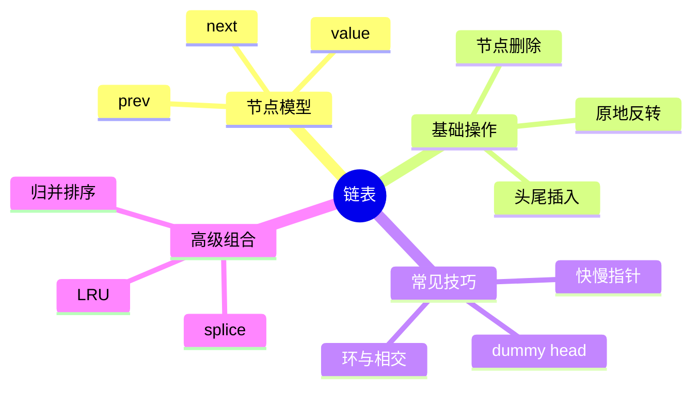

# 链表

## 本节知识地图



## 接口契约

本节先约定一个最小链表 API。链表操作的复杂度必须注明“是否已经拿到目标节点”：

| 操作 | 输入前提 | 结果 | 复杂度 |
|---|---|---|---|
| `is_empty()` | 链表对象 | 是否没有节点 | O(1) |
| `find(value)` | 任意链表 | 返回第一个匹配节点或 `None` | O(n) |
| `get(index)` | `0 <= index < size` | 返回节点/值 | O(n) |
| `push_front(value)` | 任意链表 | 新节点成为头节点 | O(1) |
| `push_back(value)` | 维护尾指针 | 新节点成为尾节点 | O(1) |
| `insert_after(node, value)` | `node` 属于当前链表 | 在 node 后插入 | O(1) |
| `remove(node)` | `node` 属于当前链表 | 摘除该节点 | O(1) |
| `remove_value(value)` | 任意链表 | 删除第一个匹配值 | O(n) |
| `reverse()` | 任意链表 | 原地反转并更新头尾 | O(n) |

### 三个容易混淆的复杂度

- “在已知节点后插入”是 O(1)。
- “在第 k 个位置插入”要先走到第 k 个节点，通常是 O(n)。
- “尾部插入”只有在维护 `tail` 指针时才是 O(1)；仅有 `head` 时要走完整条链表。

### 空结构与节点所有权

- 空链表通常用 `head = None` 表示。
- `find` 找不到返回 `None`；`get` 越界应抛 `IndexError` 或由题目保证合法。
- `pop_front/pop_back` 对空链表应统一选择返回 `None` 或抛 `IndexError`，不要在同一实现中混用。
- `insert_after` 和 `remove` 的 `node` 必须属于当前链表；把别的链表节点传进来会破坏两条链。
- 删除节点后应断开它的 `next/prev`，避免调用者继续通过旧节点访问链表。

## 手写单链表容器

只保存 `head` 的链表适合刷题；通用容器还应维护 `tail` 和 `size`，否则尾插和长度查询会反复遍历。

```python
class SinglyLinkedList:
    def __init__(self, values=()):
        self.head = None
        self.tail = None
        self.size = 0
        for value in values:
            self.append(value)

    def __len__(self):
        return self.size

    def is_empty(self):
        return self.size == 0

    def prepend(self, value):
        node = ListNode(value, self.head)
        self.head = node
        if self.tail is None:
            self.tail = node
        self.size += 1
        return node

    def append(self, value):
        node = ListNode(value)
        if self.tail is None:
            self.head = self.tail = node
        else:
            self.tail.next = node
            self.tail = node
        self.size += 1
        return node

    def get_node(self, index):
        if not 0 <= index < self.size:
            raise IndexError("linked-list index out of range")
        current = self.head
        for _ in range(index):
            current = current.next
        return current

    def insert_after(self, node, value):
        if node is None:
            raise ValueError("node cannot be None")
        new_node = ListNode(value, node.next)
        node.next = new_node
        if self.tail is node:
            self.tail = new_node
        self.size += 1
        return new_node

    def pop_front(self):
        if self.head is None:
            raise IndexError("pop from empty list")
        node = self.head
        self.head = node.next
        node.next = None
        self.size -= 1
        if self.size == 0:
            self.tail = None
        return node.val

    def remove_first(self, value):
        dummy = ListNode(next=self.head)
        previous = dummy
        current = self.head
        while current is not None:
            if current.val == value:
                previous.next = current.next
                if current is self.tail:
                    self.tail = previous if previous is not dummy else None
                current.next = None
                self.head = dummy.next
                self.size -= 1
                return True
            previous, current = current, current.next
        return False

    def reverse(self):
        previous = None
        current = self.head
        self.tail = self.head
        while current is not None:
            following = current.next
            current.next = previous
            previous, current = current, following
        self.head = previous
```

这个版本明确：

- `append`/`prepend` 返回新节点。
- `pop_front` 空表抛 `IndexError`。
- `remove_first` 找不到返回 `False`，找到返回 `True`。
- 删除最后一个节点时同步更新 `tail`。
- `reverse` 原地修改节点连接，不创建新节点。

### 单链表接口复杂度

| 操作 | 仅有 head | 有 head + tail + size |
|---|---:|---:|
| `prepend` | O(1) | O(1) |
| `append` | O(n) | O(1) |
| `len` | O(n) | O(1) |
| `get(index)` | O(n) | O(n) |
| 已知 node 后插入 | O(1) | O(1) |
| 删除值 | O(n) | O(n) |
| 反转 | O(n) | O(n) |

`tail` 只能优化尾部操作，不能让按索引访问变成 O(1)。

## 什么是链表

链表是一种线性数据结构，与数组不同，它的元素在内存中**不需要连续存储**。每个元素称为**节点（Node）**，节点包含两部分：

1. **数据域（val）**：存储实际的值
2. **指针域（next / prev）**：存储指向下一个（或上一个）节点的引用

### 单链表 vs 双链表

- **单链表**：每个节点只有一个 `next` 指针，指向下一个节点。只能从头到尾单向遍历。
- **双链表**：每个节点有 `next` 和 `prev` 两个指针，可以双向遍历。插入和删除操作更灵活，但占用更多内存。

### 与数组的对比

| 操作 | 数组 | 链表 |
|------|------|------|
| 按索引访问 | O(1) | O(n) |
| 头部插入 | O(n) | O(1) |
| 尾部插入 | O(1) 均摊 | O(n) 单链表 / O(1) 有尾指针 |
| 中间插入 | O(n) | O(1) 已知位置时 |
| 删除 | O(n) | O(1) 已知位置时 |
| 内存 | 连续，可能浪费 | 非连续，按需分配 |

**总结**：链表在频繁插入删除的场景下优于数组，但不支持随机访问。

## Python 链表定义

```python
class ListNode:
    def __init__(self, val=0, next=None):
        self.val = val
        self.next = next
```

双链表节点：

```python
class DoublyListNode:
    def __init__(self, val=0, next=None, prev=None):
        self.val = val
        self.next = next
        self.prev = prev
        self.owner = None
```

### 一个最小双链表容器

节点只是数据结构；容器还要负责维护头指针、尾指针和节点数量。

```python
class DoublyLinkedList:
    def __init__(self):
        self.head = None
        self.tail = None
        self.size = 0

    def __len__(self):
        return self.size

    def is_empty(self):
        return self.size == 0

    def append(self, value):
        node = DoublyListNode(value, prev=self.tail)
        node.owner = self
        if self.tail is None:
            self.head = self.tail = node
        else:
            self.tail.next = node
            self.tail = node
        self.size += 1
        return node

    def append_left(self, value):
        node = DoublyListNode(value, next=self.head)
        node.owner = self
        if self.head is None:
            self.head = self.tail = node
        else:
            self.head.prev = node
            self.head = node
        self.size += 1
        return node

    def remove(self, node):
        if node is None or node.owner is not self:
            raise ValueError("node does not belong to this list")
        if node.prev is None:
            self.head = node.next
        else:
            node.prev.next = node.next
        if node.next is None:
            self.tail = node.prev
        else:
            node.next.prev = node.prev
        node.prev = node.next = node.owner = None
        self.size -= 1

    def pop_left(self):
        if self.head is None:
            raise IndexError("pop from empty list")
        node = self.head
        self.remove(node)
        return node.val

    def pop(self):
        if self.tail is None:
            raise IndexError("pop from empty list")
        node = self.tail
        self.remove(node)
        return node.val
```

这个示例约定：`append`/`append_left` 返回新节点，`remove` 要求节点属于当前链表，空的两种 `pop` 都抛 `IndexError`。生产实现还可以增加 owner 标记，主动检测跨链表节点。

## 核心操作

### 遍历与查找

```python
def traverse(head: ListNode):
    """遍历链表并打印所有节点值"""
    curr = head
    while curr:
        print(curr.val)
        curr = curr.next

def search(head: ListNode, target: int) -> bool:
    """查找链表中是否存在目标值"""
    curr = head
    while curr:
        if curr.val == target:
            return True
        curr = curr.next
    return False
```

### 插入节点

**头插法** — O(1)：

```python
def insert_at_head(head: ListNode, val: int) -> ListNode:
    new_node = ListNode(val)
    new_node.next = head
    return new_node  # 新的头节点
```

**尾插法** — O(n)：

```python
def insert_at_tail(head: ListNode, val: int) -> ListNode:
    new_node = ListNode(val)
    if not head:
        return new_node
    curr = head
    while curr.next:
        curr = curr.next
    curr.next = new_node
    return head
```

**中间插入** — 在第 k 个节点后插入：

```python
def insert_after(node: ListNode, val: int):
    """在给定节点后面插入新节点"""
    new_node = ListNode(val)
    new_node.next = node.next
    node.next = new_node
```

### 删除节点

```python
def delete_node(head: ListNode, target: int) -> ListNode:
    """删除链表中第一个值为 target 的节点"""
    dummy = ListNode(0, head)
    prev = dummy
    curr = head
    while curr:
        if curr.val == target:
            prev.next = curr.next  # 跳过当前节点
            break
        prev = curr
        curr = curr.next
    return dummy.next
```

### 虚拟头节点（Dummy Node）

**为什么使用 Dummy Node？**

链表操作中，头节点的处理往往是特殊情况。例如删除头节点时，需要单独判断。引入一个虚拟头节点（dummy），让它指向真正的头节点，可以**统一所有操作的逻辑**，消除边界条件。

```python
def remove_elements(head: ListNode, val: int) -> ListNode:
    """删除链表中所有值为 val 的节点（LeetCode 203）"""
    dummy = ListNode(0, head)  # dummy.next 指向真正的头
    prev = dummy
    curr = head
    while curr:
        if curr.val == val:
            prev.next = curr.next  # 删除 curr
        else:
            prev = curr
        curr = curr.next
    return dummy.next  # 返回真正的头节点
```

使用 dummy node 后，无论删除的是头节点还是中间节点，代码逻辑完全一致。

## 高频技巧

## 双链表的完整操作

### 1. 双向连接不变量

对任意节点 `node`：

```text
node.next is None  或  node.next.prev is node
node.prev is None  或  node.prev.next is node
head.prev is None
tail.next is None
```

每次插入和删除都必须同时更新两个方向。只更新 `next` 会让正向遍历看似正常，但反向遍历立即损坏。

### 2. 在已知节点前插入

```python
def insert_before(container, node, value):
    if node is None or node.owner is not container:
        raise ValueError("node does not belong to this list")

    new_node = DoublyListNode(value)
    new_node.owner = container
    new_node.prev = node.prev
    new_node.next = node
    if node.prev is None:
        container.head = new_node
    else:
        node.prev.next = new_node
    node.prev = new_node
    container.size += 1
    return new_node
```

这里传入的是节点引用，所以插入本身 O(1)；如果只有 index，还要先走到节点。

### 3. 双链表原地反转

```python
def reverse_doubly(container):
    current = container.head
    while current is not None:
        current.prev, current.next = current.next, current.prev
        current = current.prev  # 交换后，原 next 在 prev
    container.head, container.tail = container.tail, container.head
```

反转后必须交换 head/tail；只交换每个节点的指针会让容器入口仍指向旧头。

### 4. 统一删除接口

```python
def remove_first_node(container, value):
    current = container.head
    while current is not None:
        if current.val == value:
            container.remove(current)
            return True
        current = current.next
    return False
```

返回布尔值比返回节点更适合“按值删除”的接口；如果调用方还需要被删除节点，应在断链前保存并返回它。

### 5. 节点所有权

一个节点不能同时属于两条链。可用 `owner` 字段检测：

```python
left = DoublyLinkedList()
right = DoublyLinkedList()
node = left.append(1)

# right.remove(node) 应抛 ValueError
```

竞赛代码常省略 owner 以减少字段，但工程容器不能默认调用者永远传入合法节点。

## 链表算法的接口边界

### 1. 反转

`reverse_list(head)` 原地修改 next 指针，返回新头。调用者不能继续假设旧 head 是头节点：

```text
旧 head -> None
新 head -> ...
```

### 2. 合并有序链表

要求两个输入链表：

- 每条链表按非降序排列。
- 可以为空。
- 节点是否复用由接口决定。

现有 `merge_two_lists` 复用原节点，不创建每个值的新节点；调用后原链表的连接关系已改变，不能再把 l1/l2 当作独立结构使用。

### 3. 相交链表

相交指两个链表共享同一节点对象，而不只是值相等：

```text
节点地址相同 -> 相交
node.val 相同 -> 不代表相交
```

双指针切换头部的算法依赖“按节点身份比较”，不能改成值比较。

### 4. 环检测

Floyd 算法只需要 O(1) 额外空间，但遍历和序列化接口必须承认可能没有 None 终点。需要输出有限前缀时，调用方传 `limit`。

### 5. 排序链表

链表不支持 O(1) 随机访问，因此不适合直接套数组快排。归并排序适合：

1. 快慢指针找中点。
2. 断开前后两段。
3. 递归排序。
4. 线性合并。

时间 O(n log n)，递归栈 O(log n)（平衡拆分）。

## 链表的高级实现技巧

### 1. O(1) 删除已知节点

若给的是待删除节点且它不是尾节点，可以把后继值复制过来，再跳过后继：

```python
def delete_node_without_head(node):
    if node is None or node.next is None:
        raise ValueError("node must have a successor")
    node.val = node.next.val
    node.next = node.next.next
```

它删除的是“节点位置上的值”，不是传入对象本身。调用者不能继续依赖原 node 的身份语义；如果需要真正摘除指定对象，必须拿到前驱节点。

### 2. 按位置插入

```python
def insert_at_index(head, index, value):
    if index < 0:
        raise IndexError("negative insertion index is not supported")
    dummy = ListNode(next=head)
    previous = dummy
    for _ in range(index):
        if previous.next is None:
            raise IndexError("linked-list insertion index out of range")
        previous = previous.next
    previous.next = ListNode(value, previous.next)
    return dummy.next
```

这里允许 `index == length` 追加，禁止大于 length；若要采用 Python list 的截断规则，必须另写契约。

### 3. 切分链表

```python
def split_at(head, index):
    if index < 0:
        raise IndexError("negative split index is not supported")
    if index == 0:
        return None, head

    current = head
    for _ in range(index - 1):
        if current is None:
            raise IndexError("split index out of range")
        current = current.next
    if current is None:
        raise IndexError("split index out of range")

    right = current.next
    current.next = None
    return head, right
```

切分会原地断开连接，调用方必须更新两条链的 head；这不是复制。

### 4. 拼接链表

```python
def concat(first, second):
    if first is None:
        return second
    tail = first
    while tail.next is not None:
        tail = tail.next
    tail.next = second
    return first
```

只有维护 tail 的容器才能把拼接做到 O(1)。拼接后 second 不再是独立链表，不能同时由两个容器拥有。

### 5. 复制带随机指针链表

如果节点还含 `random` 指针，不能只复制 next：

```python
class RandomNode:
    def __init__(self, value):
        self.val = value
        self.next = None
        self.random = None


def copy_random_list(head):
    mapping = {}
    current = head
    while current is not None:
        mapping[current] = RandomNode(current.val)
        current = current.next

    current = head
    while current is not None:
        clone = mapping[current]
        clone.next = mapping.get(current.next)
        clone.random = mapping.get(current.random)
        current = current.next
    return mapping.get(head)
```

这里的 key 是节点身份，不是节点值；值重复时不能用 `value -> node` 映射。

## 链表内存与性能

### 对象开销

Python 每个节点是对象，除了 `val/next` 还可能有对象头和引用开销。大量小节点可能远大于同样数据的数组。

### 分配与回收

- 频繁创建/删除节点会增加分配器压力。
- 节点不连续会降低 Cache 局部性。
- 连接复用和对象池能减少分配，但生命周期更复杂。

### 为什么实际库少用裸链表

通用库常选择动态数组或块状 deque，因为：

- 顺序访问更缓存友好。
- 随机访问或批量复制更快。
- 指针和对象开销更低。

链表适合“节点引用稳定且频繁拼接/摘除”的特定场景，不是数组的通用替代。

## 复杂度验证

```text
建立 n 个节点：O(n)
按索引 get：O(n)
已知前驱后插入：O(1)
按值查找并删除：O(n)
合并两条无尾指针链：O(n)
合并两条有尾指针链：O(1)
反转：O(n)
复制随机指针链表：O(n) 时间、O(n) 空间
```

## 链表的工程接口

### 1. 迭代器

```python
class ListIterator:
    def __init__(self, head):
        self.current = head

    def __iter__(self):
        return self

    def __next__(self):
        if self.current is None:
            raise StopIteration
        value = self.current.val
        self.current = self.current.next
        return value
```

有环链表不能直接使用这个迭代器，否则永远不会抛 `StopIteration`。通用 API 应提供 `limit` 或 cycle-aware iterator。

### 2. splice

**直译**：拼接/剪接。

把一段节点从一个链表摘下并插入另一个链表：

```text
first:  A -> B -> C -> D
剪下 B..C
first:  A -> D
second: X -> B -> C -> Y
```

接口必须说明：

- 是否复制节点。
- 源链表是否仍拥有这段节点。
- 目标链表是否允许跨 owner。
- 头尾和 size 怎样同时更新。

### 3. 维护 tail 和 size 的验证

```python
def validate_list(container):
    if container.size == 0:
        assert container.head is None
        assert container.tail is None
        return
    assert container.head is not None
    assert container.tail is not None
    assert container.head.prev is None if hasattr(container.head, "prev") else True
    current = container.head
    count = 0
    last = None
    while current:
        count += 1
        last = current
        current = current.next
    assert count == container.size
    assert last is container.tail
```

生产容器可在 debug 模式下调用验证函数，尽早发现指针错链。

## 链表排序与复杂度

### 归并排序

链表归并排序：

1. 快慢指针找到中点。
2. 断开两段。
3. 递归排序。
4. 通过指针合并。

因为不需要随机访问，合并每段 O(n)，总时间 O(n log n)。

### 稳定性

合并时使用 `<=` 让左边相等元素先接入，可以保持稳定排序；使用 `<` 可能改变相等节点的相对顺序。

### 原地与新建

- 指针重连版复用节点，额外空间 O(log n) 递归栈。
- 值复制到数组后排序再重建，会使用 O(n) 额外空间。
- 接口要明确调用后原链表节点身份是否保留。

## 链表自测矩阵

| 场景 | 需要断言 |
|---|---|
| 空链表 | head/tail/size 一致 |
| 单节点 | 头尾是同一节点 |
| 删除唯一节点 | 头尾同时变 None |
| 头尾插入 | 双向链接一致 |
| 跨 owner 节点 | 抛 ValueError |
| 反转 | 新头是旧尾，next/prev 方向正确 |
| 环链表 | 普通迭代不能无限运行 |
| 重复值 | 按接口删除一个还是全部 |
| 拼接 | 所有权和 size 是否转移 |

## 面试表达：链表高级边界

### Q4：为什么链表中间插入有时说 O(1)、有时说 O(n)

> 如果已经有目标节点或前驱节点引用，修改几个指针就是 O(1)；如果输入是下标或值，必须先遍历查找位置，整体是 O(n)。复杂度必须说明是否把定位成本算进去。

### Q5：链表和数组如何取舍

> 数组随机访问、顺序扫描和缓存局部性好，但中间插入删除要搬移元素；链表在已知节点引用时插入删除 O(1)，但节点有指针/对象开销，访问下标 O(n)，缓存局部性差。选择取决于访问模式，而不是“插入多就一定链表”。

### Q6：如何避免链表算法死循环

> 无环链表以 None 结束；可能有环时要用 visited、Floyd 或最大步数。序列化接口必须明确是否允许环，不能无条件沿 next 直到 None。

## 链表与数组的真实取舍

| 因素 | 数组 | 链表 |
|---|---|---|
| 随机访问 | O(1) | O(n) |
| 已知位置插入 | 仍需搬移后缀 | O(1) |
| 内存局部性 | 好 | 节点可能分散 |
| 额外空间 | 少 | 每节点指针/对象开销 |
| 迭代器失效 | 搬移可能影响引用 | 节点引用通常稳定 |
| 适合场景 | 批量扫描、索引访问 | 频繁已知节点拼接/删除 |

“链表插入 O(1)”只有在已知节点引用且不计查找成本时成立；面试必须说出这个前提。

## 链表面试题

### Q1：为什么需要 dummy

> dummy 是不属于结果的哨兵节点，让头部删除、头部插入和中间操作使用同一套 prev/current 逻辑。最后返回 `dummy.next`，避免为头节点单独写分支。

### Q2：为什么删除节点后要断链

> 断开 `next/prev` 能防止调用者通过旧节点继续访问已删除结构，也能让重复删除更容易被 owner 检测。若题目只关心结果可省略，但通用容器应明确节点生命周期。

### Q3：链表 O(1) 插入的前提

> 必须已经拿到插入位置的节点引用；如果输入是第 k 个下标，先遍历定位要 O(n)，总复杂度仍是 O(n)。

### Q4：链表为什么缓存不友好

> 节点通常独立分配且地址分散，顺序遍历会产生更多 Cache/TLB miss；每个节点还携带指针和对象头。它只有在避免大段搬移、且能直接拿到节点引用时才体现结构优势。

## 边界测试

```text
空链表、单节点、两个节点
头插、尾插、已知节点中间插入
删除头、尾、中间、唯一节点
删除不存在值、重复删除同一节点
两个链表节点交叉传入
反转后 head/tail 是否交换
环入口为头、尾和中间
合并一条为空、两条为空、重复值
```

## 指针操作逐步演练

### 头插

```text
原链：head -> A -> B
新节点：N
先设 N.next = head
再设 head = N
结果：head -> N -> A -> B
```

先改 head 再保存旧 head 会丢失原链入口。

### 删除中间节点

```text
prev -> curr -> next
```

执行：

```text
prev.next = curr.next
curr.next = None
```

如果需要返回被删除节点，必须在断链后仍保留 curr 引用；如果只返回新 head，则可以不暴露节点身份。

### 双链表删除

```text
prev <-> curr <-> next
```

需要同时做：

```text
prev.next = next
next.prev = prev
```

头/尾为空时用分支更新 head/tail；中间节点不能只修改一侧。

## 链表设计题接口矩阵

| 需求 | 需要的字段 | 典型复杂度 |
|---|---|---:|
| 头尾 O(1) | head + tail | O(1) |
| 长度 O(1) | size | O(1) |
| 按下标读取 | head | O(n) |
| 已知节点删除 | prev/owner | O(1) |
| 按值删除 | head 遍历 | O(n) |
| 反向遍历 | prev 或栈 | O(n) |
| 环检测 | slow/fast | O(n), O(1) 空间 |

## 链表的 30 秒背诵

> 链表用节点指针保存连接，元素不要求连续。head/tail/size 是容器状态；空链表用 None。已知前驱或节点时改几个指针是 O(1)，按索引/值要先查找是 O(n)。双链表每次插删必须同时维护 next 和 prev，反转、合并、快慢指针和环检测是面试核心。

### 链表反转

链表反转是面试中出现频率最高的链表问题，务必熟练掌握迭代和递归两种写法。

**迭代法（三指针）**：

```python
def reverse_list(head: ListNode) -> ListNode:
    """反转链表 — 迭代（LeetCode 206）"""
    prev = None
    curr = head
    while curr:
        nxt = curr.next   # 先保存下一个节点
        curr.next = prev  # 反转指针
        prev = curr       # prev 前进
        curr = nxt        # curr 前进
    return prev  # prev 就是新的头节点
```

核心思路：用 `prev`、`curr`、`nxt` 三个指针，逐个翻转每条边的方向。

**递归法**：

```python
def reverse_list_recursive(head: ListNode) -> ListNode:
    """反转链表 — 递归"""
    # base case：空链表或只有一个节点
    if not head or not head.next:
        return head
    # 递归反转后面的部分，new_head 是反转后的头
    new_head = reverse_list_recursive(head.next)
    # head.next 现在是反转后子链表的尾节点，让它指回 head
    head.next.next = head
    head.next = None  # 断开原来的正向指针
    return new_head
```

### 快慢指针

快慢指针是链表中最重要的技巧之一，核心思想：两个指针以不同速度遍历链表。

**找中间节点**：

```python
def find_middle(head: ListNode) -> ListNode:
    """找链表中间节点（LeetCode 876）"""
    slow = fast = head
    while fast and fast.next:
        slow = slow.next       # 慢指针走一步
        fast = fast.next.next  # 快指针走两步
    return slow  # 当 fast 到达末尾时，slow 正好在中间
```

**判断是否有环（Floyd 算法）**：

```python
def has_cycle(head: ListNode) -> bool:
    """判断链表是否有环（LeetCode 141）"""
    slow = fast = head
    while fast and fast.next:
        slow = slow.next
        fast = fast.next.next
        if slow == fast:  # 快慢指针相遇，说明有环
            return True
    return False
```

**找环入口**：

```python
def detect_cycle(head: ListNode) -> ListNode:
    """找到环的入口节点（LeetCode 142）"""
    slow = fast = head
    while fast and fast.next:
        slow = slow.next
        fast = fast.next.next
        if slow == fast:
            # 相遇后，一个指针回到头部，两个同速前进
            slow = head
            while slow != fast:
                slow = slow.next
                fast = fast.next
            return slow  # 再次相遇点就是环入口
    return None
```

数学证明：设头到环入口距离为 `a`，环入口到相遇点距离为 `b`，环长为 `c`。相遇时慢指针走了 `a + b`，快指针走了 `a + b + nc`。因为快指针速度是慢指针两倍，所以 `2(a + b) = a + b + nc`，即 `a = nc - b`。因此从头部和相遇点同时出发，一定在环入口相遇。

### 合并链表

```python
def merge_two_lists(l1: ListNode, l2: ListNode) -> ListNode:
    """合并两个有序链表（LeetCode 21）"""
    dummy = ListNode(0)
    curr = dummy
    while l1 and l2:
        if l1.val <= l2.val:
            curr.next = l1
            l1 = l1.next
        else:
            curr.next = l2
            l2 = l2.next
        curr = curr.next
    curr.next = l1 or l2  # 拼接剩余部分
    return dummy.next
```

## 经典题目

按难度分组的 LeetCode 高频链表题：

### Easy

| 题号 | 题目 | 关键技巧 |
|------|------|----------|
| [206](https://leetcode.com/problems/reverse-linked-list/) | 反转链表 | 迭代 / 递归 |
| [21](https://leetcode.com/problems/merge-two-sorted-lists/) | 合并两个有序链表 | dummy node + 双指针 |
| [141](https://leetcode.com/problems/linked-list-cycle/) | 环形链表 | 快慢指针 |
| [160](https://leetcode.com/problems/intersection-of-two-linked-lists/) | 相交链表 | 双指针对齐 |

### Medium

| 题号 | 题目 | 关键技巧 |
|------|------|----------|
| [19](https://leetcode.com/problems/remove-nth-node-from-end-of-list/) | 删除链表的倒数第 N 个节点 | 快慢指针间隔 N 步 |
| [24](https://leetcode.com/problems/swap-nodes-in-pairs/) | 两两交换链表中的节点 | 递归 / 迭代模拟 |
| [142](https://leetcode.com/problems/linked-list-cycle-ii/) | 环形链表 II | Floyd 算法找入口 |
| [148](https://leetcode.com/problems/sort-list/) | 排序链表 | 归并排序 + 快慢指针找中点 |

### Hard

| 题号 | 题目 | 关键技巧 |
|------|------|----------|
| [23](https://leetcode.com/problems/merge-k-sorted-lists/) | 合并 K 个升序链表 | 最小堆 / 分治合并 |
| [25](https://leetcode.com/problems/reverse-nodes-in-k-group/) | K 个一组翻转链表 | 分段反转 + 递归 |

## 链表接口自测与面试复盘

### 用状态不变量检查容器

```python
def check_singly(container):
    if container.size == 0:
        assert container.head is None
        assert container.tail is None
        return
    assert container.head is not None
    assert container.tail is not None
    count = 0
    current = container.head
    while current is not None:
        count += 1
        if current is container.tail:
            assert current.next is None
        current = current.next
    assert count == container.size
```

### 面试中的四个边界

1. 删除头节点后，新头是否正确。
2. 删除唯一节点后，head 和 tail 是否同时为空。
3. 插入尾节点后，tail 是否更新。
4. 反转后旧 head 是否变成 tail。

### 复杂度追问

> 链表按下标访问 O(n)，但已知节点后插入/删除 O(1)。如果没有 tail，尾插和长度查询都要遍历；如果节点是 Python 对象，还要计入指针和对象头的内存成本。链表的选择依赖节点引用和访问模式，而不是“插入多”这一句。

### 最小口述

> 链表由节点和指针组成，数组保存值的连续布局，链表保存节点之间的连接。接口要维护 head、tail、size 和节点所有权；空链表用 None，按值删除先查找 O(n)，已知前驱后改指针 O(1)。反转、合并和快慢指针是核心算法，但所有代码都要先处理空链表、单节点和尾部更新。

## 小结

链表的核心在于**指针操作**，写代码时需要注意：

1. **画图**：链表题一定要在纸上画出指针变化过程，避免指针丢失。
2. **Dummy Node**：涉及头节点可能变化的操作，优先使用虚拟头节点简化逻辑。
3. **快慢指针**：找中点、判环、找环入口，是链表最核心的技巧。
4. **反转操作**：迭代和递归两种写法都要熟练，很多中高难度题是反转的变体。
5. **边界检查**：空链表、单节点链表、操作最后一个节点时，都要确认逻辑正确。

掌握以上内容，足以应对绝大多数面试中的链表问题。

## 链表终局：从题目到接口

遇到链表题时按这个顺序：

```text
1. 空链表如何表示
2. 是否可能有环
3. 值相等还是节点身份相等
4. 是否要求原地修改
5. 是否维护 head/tail/size
6. 插入删除是否已知前驱/节点
7. 返回新 head、节点、布尔值还是值列表
8. 是否需要断开被删除节点
9. 递归深度是否受输入控制
10. 用空、单节点、重复值和尾节点测试
```

这份清单比记住“链表插入 O(1)”更重要，因为它决定复杂度和代码是否真的正确。

## Splice：真正的链表高级接口

### 1. 为什么需要 splice

LRU Cache、浏览器历史和任务队列经常需要把一个已知节点从链表当前位置摘下，再插入头部：

```text
old: A <-> B <-> C <-> D
move C to head
new: C <-> A <-> B <-> D
```

### 2. 操作顺序

```python
def move_to_front(container, node):
    if node is None or node.owner is not container:
        raise ValueError("node does not belong to this list")
    if node is container.head:
        return

    node.prev.next = node.next
    if node.next is not None:
        node.next.prev = node.prev
    else:
        container.tail = node.prev

    node.prev = None
    node.next = container.head
    container.head.prev = node
    container.head = node
```

这段代码不改变 size，时间 O(1)。若忘记更新 tail，移动尾节点后反向遍历会损坏。

### 3. 跨链表移动

跨容器 splice 还要：

- 从源链表 size 减一。
- 给目标链表 size 加一。
- 更新 owner。
- 处理源 head/tail 和目标 head/tail。

不能只改四个指针就宣称两个容器状态正确。

## 随机指针链表的深拷贝边界

`random` 可能为空、指向自身或指向链表外节点。拷贝接口要先约定：

- 外部节点是否允许。
- 外部节点复制还是保留原引用。
- 空 random 是否仍为空。
- 两个节点 random 互相指向时是否保持环。

映射表按“节点身份”建立：

```text
old node object -> cloned node object
```

不能按 value 建映射，因为多个节点可能值相同。

## 链表面试实战

### Q7：LRU 为什么是 HashMap + 双链表

> HashMap 根据 key O(1) 定位节点，双链表维护最近使用顺序；访问节点时从原位置摘下并移到头部，淘汰时删除尾节点。两个结构必须共享节点 owner 和生命周期，才能让 get/put/evict 都保持均摊 O(1)。

### Q8：为什么链表排序用归并

> 链表随机访问成本高，不适合按下标分区的数组快排；归并只需顺序拆分和指针拼接，时间 O(n log n)，还可以复用节点，额外空间主要是递归栈。

## 链表手写验收：先画指针再写代码

### 单链表删除一个节点

设 `prev -> cur -> next`，删除 `cur` 只需要：

```text
prev.next = cur.next
```

但 `cur` 可能是头节点，此时没有 `prev`；工程实现通常使用 dummy 节点，把“删除头”和“删除中间”统一成同一种操作。若删除的是尾节点，还要同步更新 `tail`；若链表只剩一个节点，还要同时令 `head=tail=None`。

### 双链表插入一个节点

在 `left` 和 `right=left.next` 之间插入 `node`：

```text
node.prev = left
node.next = right
left.next = node
right.prev = node       # right 可能是 None，需按哨兵设计处理
```

四条指针必须成对更新。使用头尾哨兵时，`right` 永远不是 `None`，可以显著减少分支；不使用哨兵时，必须分别测试头部、尾部和唯一节点。

### 递归与迭代的选择

- 反转、合并、快慢指针等基础操作优先迭代，避免退化链表触发递归深度限制。
- 归并排序可递归拆分，但要说明递归栈 O(log n)；如果输入规模不受控，改成自底向上的迭代归并。
- 递归函数必须明确“返回当前子链表的新头”，否则修改发生在深层却无法把入口交回上一层。

### 链表最小对拍集合

```text
[]                         # 空链表
[x]                        # 唯一节点
[x,y]                      # 头尾相邻
[x,y,z] 删除头/尾/中间
重复 value                  # 验证按身份还是按值
环                         # 先检测再执行普通遍历
两条链表相交               # 比较节点身份，不是 value
```

每个操作都同时检查 `head`、`tail`、`size` 和从头遍历得到的节点数；只检查输出值，无法发现尾指针悬空或 size 漂移。

### 面试追问：为什么不直接按下标访问

链表节点没有连续地址，按下标访问必须从头走 `k` 步，成本 O(k)。如果业务同时需要 O(1) 按 key 定位和 O(1) 顺序淘汰，就把 key 到节点的映射交给哈希表，把顺序交给双链表；不要强行让链表承担随机访问职责。

### 代码审查关键词

看到 `next`/`prev` 赋值时，逐条检查反向指针、头尾入口和 size 是否同步更新；看到 `value` 比较时，确认题目要的是节点身份还是值相等。链表 bug 通常不是算法思想错，而是少更新了一条边或一个计数器。

复述时最后补一句：链表的优势是已知节点位置修改 O(1)，代价是按位置查找 O(n)；选择结构取决于访问模式。

链表实现的验收答案还应包含所有权：一个节点只能属于一个容器，跨链表移动必须更新 owner、size、head 和 tail；否则后续删除可能同时破坏两条链。

因此写链表代码时，先画出操作前后的节点图，再把每一条箭头翻译成赋值语句。

### 一分钟复盘

空链表看 head/tail；单链表看前驱；双链表看四条指针；环链表看 visited 或快慢指针；跨容器移动看 owner 和 size。按这个顺序检查，基本覆盖手写链表的全部高频边界。

```text
每次修改后：size == 实际节点数
空时：head == None 且 tail == None
非空时：tail.next == None
```
