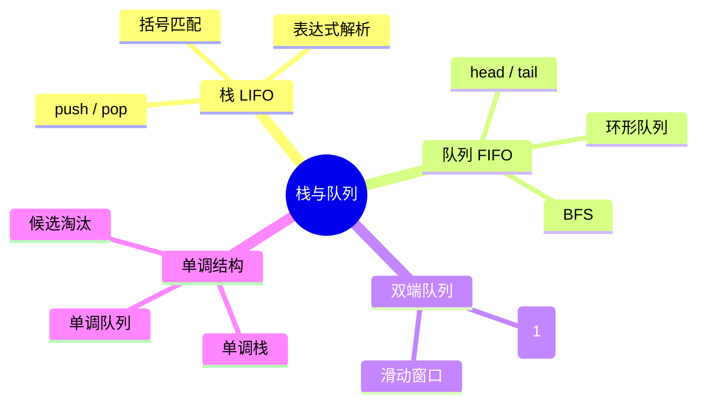

# 栈与队列

## 本节知识地图



栈和队列是两种最基础的线性数据结构，区别仅在于元素的进出顺序。它们是很多复杂题型（单调栈、BFS、滑动窗口）的底层构件。

## 接口契约

### 栈 Stack

栈只允许在一端操作，端点叫 top：

| 操作 | 结果 | 空栈行为 | 复杂度 |
|---|---|---|---:|
| `push(x)` | 把 x 放到栈顶 | 无 | O(1) 均摊 |
| `pop()` | 删除并返回栈顶 | `IndexError` 或约定返回 None | O(1) |
| `peek()` | 查看栈顶但不删除 | 应明确异常/None | O(1) |
| `is_empty()` | 是否为空 | 返回 True | O(1) |
| `size()` | 元素数量 | 返回 0 | O(1) |

栈的核心不变量：

```text
最后 push 的元素，必须是下一次 pop 返回的元素
```

### 队列 Queue

队列从一端 enqueue，从另一端 dequeue：

| 操作 | 结果 | 空队列行为 | 复杂度 |
|---|---|---|---:|
| `enqueue(x)` | 加到队尾 | 无 | O(1) |
| `dequeue()` | 删除并返回队首 | `IndexError` 或约定返回 None | O(1) |
| `front()` | 查看队首 | 应明确异常/None | O(1) |
| `is_empty()` | 是否为空 | 返回 True | O(1) |
| `size()` | 元素数量 | 返回 0 | O(1) |

队列的核心不变量：

```text
先 enqueue 的元素，必须先 dequeue
```

### `deque` 与线程安全队列

- `collections.deque` 是高效双端容器，适合算法题和单线程事件循环。
- `queue.Queue` 提供多线程生产者/消费者同步，内部有锁和条件变量，不能把二者当成同一个性能模型。
- `deque[i]` 中间随机访问不是 O(1)；它的强项是两端操作。

## 栈（Stack）

### LIFO 原理

栈遵循 **后进先出（Last In, First Out）** 原则：最后放入的元素最先被取出。

### Python 用 list 实现栈

`list` 的 `append` 和 `pop` 都是对末尾操作，时间复杂度均为 O(1)。

```python
stack = []
stack.append(1)
stack.append(2)
stack.append(3)   # stack = [1, 2, 3]，栈顶是 3
top = stack[-1]   # peek：查看栈顶，值为 3
val = stack.pop() # pop：弹出栈顶，val = 3
if not stack:     # is_empty：判空
    print("栈为空")
```

### 时间复杂度

| 操作 | 复杂度 |
|------|--------|
| push (append) | O(1) 均摊 |
| pop | O(1) |
| peek (stack[-1]) | O(1) |
| is_empty | O(1) |

## 队列（Queue）

### 用数组实现环形队列

`deque` 是工程首选；面试常要求使用固定数组自己实现队列。关键是用 head、tail 和 size 区分“空”和“满”：

```python
class CircularQueue:
    def __init__(self, capacity):
        if capacity < 1:
            raise ValueError("capacity must be positive")
        self._data = [None] * capacity
        self._capacity = capacity
        self._head = 0
        self._tail = 0
        self._size = 0

    def __len__(self):
        return self._size

    def empty(self):
        return self._size == 0

    def full(self):
        return self._size == self._capacity

    def push(self, value):
        if self.full():
            raise OverflowError("queue is full")
        self._data[self._tail] = value
        self._tail = (self._tail + 1) % self._capacity
        self._size += 1

    def pop(self):
        if self.empty():
            raise IndexError("pop from empty queue")
        value = self._data[self._head]
        self._data[self._head] = None
        self._head = (self._head + 1) % self._capacity
        self._size -= 1
        return value

    def front(self):
        if self.empty():
            raise IndexError("front from empty queue")
        return self._data[self._head]
```

只用 `head == tail` 无法区分空和满，所以需要 size，或约定浪费一个槽位。固定容量下入队和出队都是 O(1)。

### 单调队列

滑动窗口最大值的 O(n) 解法使用双端队列保存仍可能成为最大值的索引：

```python
from collections import deque

def max_sliding_window(nums, k):
    if k <= 0 or k > len(nums):
        raise ValueError("invalid window size")
    candidates = deque()
    result = []

    for right, value in enumerate(nums):
        while candidates and nums[candidates[-1]] <= value:
            candidates.pop()
        candidates.append(right)

        left = right - k + 1
        while candidates and candidates[0] < left:
            candidates.popleft()
        if right >= k - 1:
            result.append(nums[candidates[0]])
    return result
```

不变量：

- `candidates` 中索引递增。
- 对应值从队首到队尾严格递减。
- 队首永远是当前窗口最大值下标。
- 过期索引必须从队首移除。

每个下标最多入队、出队一次，因此时间 O(n)，空间 O(k)。

### `queue.Queue` 与 `deque`

```python
from queue import Queue

work = Queue(maxsize=100)
work.put(task)       # 满时可阻塞，或 put_nowait 抛 Full
task = work.get()    # 空时可阻塞，或 get_nowait 抛 Empty
work.task_done()
work.join()
```

| 特性 | `deque` | `queue.Queue` |
|---|---|---|
| 主要用途 | 算法、单线程双端操作 | 多线程生产者/消费者 |
| 自动加锁 | 否 | 是 |
| 空/满等待 | 由调用方处理 | 支持阻塞和超时 |
| 额外语义 | 容器 | 任务完成计数、条件同步 |

“deque 两端 O(1)”不能推导出 `Queue.put/get` 没有同步成本。

### FIFO 原理

队列遵循 **先进先出（First In, First Out）** 原则：最先放入的元素最先被取出。

### Python 用 collections.deque 实现队列

```python
from collections import deque
queue = deque()
queue.append(1)
queue.append(2)
queue.append(3)        # deque([1, 2, 3])
val = queue.popleft()  # val = 1, deque([2, 3])
front = queue[0]       # 查看队首：2
```

### 为什么不用 list 做队列

`list.pop(0)` 需要将后面所有元素前移一位，时间复杂度为 **O(n)**；而 `deque.popleft()` 基于双向链表实现，时间复杂度为 **O(1)**。

## 双端队列（Deque）

`deque`（double-ended queue）两端都可以高效地进出元素，是 Python 中最通用的队列实现。

### 常用方法

```python
from collections import deque
d = deque()
d.append(1)            # 右端入队
d.appendleft(0)        # 左端入队
d.pop()                # 右端出队
d.popleft()            # 左端出队
d.extend([2, 3])       # 右端批量入队
d.extendleft([-1, -2]) # 左端批量入队（顺序会反转）
d.rotate(1)            # 所有元素右移 1 位
```

`deque` 两端操作均为 O(1)，但随机访问 `d[i]` 为 O(n)，不适合频繁按索引取值。

### 空结构行为

```python
from collections import deque

stack = []
queue = deque()

# stack.pop()       -> IndexError
# queue.popleft()   -> IndexError
# stack[-1]         -> IndexError
# queue[0]          -> IndexError
```

如果业务不希望异常，可以包装成：

```python
def safe_pop(stack):
    return stack.pop() if stack else None
```

但 `None` 可能也是合法元素；此时应使用哨兵对象或显式 `try/except`，不能让“空”和“元素值为 None”混淆。

## 手写一个最小队列

### 两个栈实现 FIFO

一个输入栈负责接收新元素，一个输出栈负责提供队首：

```python
class TwoStackQueue:
    def __init__(self):
        self._in = []
        self._out = []

    def push(self, value):
        self._in.append(value)

    def _move_if_needed(self):
        if not self._out:
            while self._in:
                self._out.append(self._in.pop())

    def pop(self):
        self._move_if_needed()
        if not self._out:
            raise IndexError("pop from empty queue")
        return self._out.pop()

    def peek(self):
        self._move_if_needed()
        if not self._out:
            raise IndexError("peek from empty queue")
        return self._out[-1]

    def empty(self):
        return not self._in and not self._out

    def __len__(self):
        return len(self._in) + len(self._out)
```

### 为什么是均摊 O(1)

每个元素最多：

1. 被 push 到 `_in` 一次。
2. 从 `_in` 移到 `_out` 一次。
3. 从 `_out` pop 一次。

即使某一次 `_move_if_needed()` 搬运了很多元素，连续 m 次操作的总搬运次数仍是 O(m)，所以每次 pop 均摊 O(1)。

### 两栈队列的状态

```text
push 1,2,3:
in  = [1,2,3]
out = []

第一次 pop 前搬运:
in  = []
out = [3,2,1]

从 out 末尾弹出 1，得到 FIFO
```

只有 `_out` 为空时才搬运；如果每次 pop 都强制搬运，会失去均摊优势。

## 手写一个最小栈

```python
class SimpleStack:
    def __init__(self, values=()):
        self._items = list(values)

    def push(self, value):
        self._items.append(value)

    def pop(self):
        if not self._items:
            raise IndexError("pop from empty stack")
        return self._items.pop()

    def peek(self):
        if not self._items:
            raise IndexError("peek from empty stack")
        return self._items[-1]

    def empty(self):
        return not self._items

    def __len__(self):
        return len(self._items)
```

接口与 Python `list` 的区别在于：`SimpleStack` 不暴露任意索引和中间插入，调用者只能依赖 LIFO 契约。

## 单调栈的不变量

单调栈不是普通“排序栈”，而是维护一个关于候选答案的不变量：

- 单调递减栈：栈底到栈顶对应值递减，常寻找下一个更大元素。
- 单调递增栈：栈底到栈顶对应值递增，常寻找下一个更小元素。
- 通常存索引而不是值，因为答案还需要距离和位置。

### 下一个更大元素

```python
def next_greater_element(nums):
    result = [-1] * len(nums)
    stack = []  # 索引；对应值从栈底到栈顶递减

    for index, value in enumerate(nums):
        while stack and value > nums[stack[-1]]:
            previous = stack.pop()
            result[previous] = value
        stack.append(index)

    return result
```

每个索引最多入栈一次、出栈一次，因此总时间 O(n)，不是每次 while 都导致 O(n²)。

### 单调栈边界

- 相等值使用 `>` 还是 `>=`，决定保留左边还是右边的重复候选。
- 求“严格更大”和“更大或相等”不能混写。
- 环形数组通常遍历 `2n` 次并用 `% n` 映射下标。
- 直方图题要补哨兵 0，确保栈中剩余柱子被弹出。

## 最小栈的不变量

`min_stack[i]` 保存主栈前 i+1 个元素的最小值：

```text
主栈：  [5, 2, 4]
最小栈：[5, 2, 2]
```

因此：

- push 时同步追加当前最小值。
- pop 时两个栈同步弹出。
- `getMin` 直接读辅助栈顶。

如果只在发现更小值时入辅助栈，遇到重复最小值会在 pop 时失配；要么每层保存最小值，要么保存计数。

## 用栈/队列时的选择清单

| 问题特征 | 选择 |
|---|---|
| 只关心最近未匹配元素 | 栈 |
| 需要先进先出 | 队列 |
| 需要两端插入删除 | deque |
| 维护下一个更大/更小 | 单调栈 |
| BFS 按层推进 | deque |
| 多线程生产消费 | `queue.Queue` |
| 需要按优先级取出 | heap |

## 面试表达：栈与队列

### Q1：为什么 BFS 用 deque

> BFS 需要从队首取出当前节点，再从队尾加入新节点，正好是 FIFO。Python `deque.popleft()` 是 O(1)，而 `list.pop(0)` 要移动后续元素，是 O(n)，所以不应使用 list 头部删除实现高频队列。

### Q2：两个栈实现队列为什么均摊 O(1)

> 入队只压入输入栈；出队时如果输出栈为空，才把输入栈整体倒入输出栈。每个元素最多被搬运一次、弹出一次，所以连续操作总成本 O(m)，单次出队均摊 O(1)。

### Q3：单调栈为什么是 O(n)

> 每个元素最多入栈一次、出栈一次。虽然某次 while 会连续弹出多个元素，但所有元素的出栈次数总和不超过 n，因此总时间 O(n)。

### Q4：空栈 pop 应该返回什么

> 这是接口契约，不是算法常数。Python list/deque 默认抛 IndexError；业务容器可以约定返回 None，但必须处理 None 也是合法元素的歧义，不能在不同方法中混用。

---

## 边界测试清单

```text
栈：空 pop、一个元素反复 push/pop、重复最小值、None 元素
队列：空 popleft、in/out 栈交替搬运、FIFO 顺序
deque：两端操作、随机索引、extendleft 的顺序
单调栈：空数组、全递增、全递减、全部相等
```

## 高频题型

## 栈的高级应用

### 1. 后缀表达式求值

后缀表达式把运算符放在操作数之后：

```text
2 3 + 4 *
```

求值步骤：

1. 数字入栈。
2. 遇到二元运算符弹出右操作数。
3. 再弹出左操作数。
4. 计算后把结果入栈。
5. 最后栈中应恰好剩一个结果。

```python
def eval_postfix(tokens):
    stack = []
    for token in tokens:
        if token not in {"+", "-", "*", "/"}:
            stack.append(int(token))
            continue
        if len(stack) < 2:
            raise ValueError("invalid postfix expression")
        right = stack.pop()
        left = stack.pop()
        if token == "+":
            stack.append(left + right)
        elif token == "-":
            stack.append(left - right)
        elif token == "*":
            stack.append(left * right)
        else:
            if right == 0:
                raise ZeroDivisionError("division by zero")
            stack.append(int(left / right))

    if len(stack) != 1:
        raise ValueError("invalid postfix expression")
    return stack[0]
```

操作数弹出顺序不能反，`left - right` 与 `right - left` 不同。

### 2. 单调栈的严格/非严格比较

```text
找严格更大：通常弹出 <= 当前值
找大于等于：通常弹出 < 当前值
```

相等元素保留哪一个会影响：

- 距离计算。
- 重复最大值的归属。
- 直方图边界。

### 3. 直方图最大矩形

接口需要在数组两端补高度 0，保证栈中所有柱子最终出栈：

```python
def largest_rectangle(heights):
    stack = []
    best = 0
    for index, height in enumerate(heights + [0]):
        while stack and heights[stack[-1]] > height:
            h = heights[stack.pop()]
            left = stack[-1] + 1 if stack else 0
            best = max(best, h * (index - left))
        stack.append(index)
    return best
```

若 heights 为空，`heights + [0]` 仍安全，返回 0；若使用生成器，需要另行处理，不能直接拼接。

## 队列的高级接口

### 1. 有界队列

有界队列必须定义满时策略：

- 阻塞等待空间。
- 返回 False。
- 抛 `Full`/`OverflowError`。
- 丢弃最旧或最新元素。

不同策略会改变数据可靠性，不能只用一个 `append` 代表所有队列。

### 2. 优先队列不是 FIFO

优先队列按 priority 取出，只有优先级相等时才可额外保证 FIFO。它的接口更像：

```text
push(priority, item)
pop() -> 最小/最大 priority 的 item
```

如果业务需要取消和更新，必须设计 task identity、版本号和垃圾回收。

### 3. BFS 的 visited 时机

```text
入队时标记：每个节点最多入队一次
出队时标记：可能重复入队，队列和内存膨胀
```

对无权最短路，首次入队就是最短距离成立的时刻。

## 栈队列测试

```python
stack = SimpleStack()
try:
    stack.pop()
except IndexError:
    pass
else:
    raise AssertionError("empty stack should fail")

queue = TwoStackQueue()
for value in [1, 2, 3]:
    queue.push(value)
assert [queue.pop(), queue.pop()] == [1, 2]
queue.push(4)
assert queue.peek() == 3
assert list(queue._in) == [4]

circular = CircularQueue(2)
circular.push(1)
circular.push(2)
try:
    circular.push(3)
except OverflowError:
    pass
else:
    raise AssertionError("full queue should fail")
assert [circular.pop(), circular.pop()] == [1, 2]
```

## 用栈解析括号和运算符

### 1. 括号的接口前置条件

`isValid` 只适用于输入字符来自 `()[]{}`。如果输入允许字母和空格，应显式跳过它们；不能把所有非右括号字符都当作左括号。

```python
def is_valid_brackets(text):
    opening = set("([{")
    matching = {")": "(", "]": "[", "}": "{"}
    stack = []
    for character in text:
        if character in opening:
            stack.append(character)
        elif character in matching:
            if not stack or stack.pop() != matching[character]:
                return False
        elif not character.isspace():
            raise ValueError("unexpected character")
    return not stack
```

### 2. 中缀转后缀

运算符栈需要维护优先级和括号：

```python
def infix_to_postfix(tokens):
    priority = {"+": 1, "-": 1, "*": 2, "/": 2}
    operators = []
    output = []

    for token in tokens:
        if token.isdigit():
            output.append(token)
        elif token == "(":
            operators.append(token)
        elif token == ")":
            while operators and operators[-1] != "(":
                output.append(operators.pop())
            if not operators:
                raise ValueError("unmatched closing parenthesis")
            operators.pop()
        elif token in priority:
            while (operators and operators[-1] != "(" and
                   priority[operators[-1]] >= priority[token]):
                output.append(operators.pop())
            operators.append(token)
        else:
            raise ValueError("unknown token")

    while operators:
        if operators[-1] == "(":
            raise ValueError("unmatched opening parenthesis")
        output.append(operators.pop())
    return output
```

这是“运算符优先级”接口，不是简单把字符串字符依次入栈；负数、一元运算符和小数需要扩展 token 规则。

## 阻塞队列与背压

### 1. 为什么要有界

无界队列在生产速度长期高于消费速度时会无限增长：

```text
生产者 > 消费者
  -> queue 增长
  -> 内存增长
  -> 延迟增长
  -> 最终 OOM
```

### 2. 满队列策略

| 策略 | 优点 | 代价 |
|---|---|---|
| 阻塞生产者 | 保持数据 | 上游线程被占住 |
| 返回失败 | 延迟可控 | 调用方必须重试/丢弃 |
| 丢弃最新 | 保留旧任务 | 新任务可能丢失 |
| 丢弃最旧 | 保持新鲜 | 旧任务可能丢失 |

队列 API 应返回“成功入队/被拒绝/超时”，不要只返回 None 让调用者猜。

## 栈和队列综合面试题

### Q9：栈为什么适合 DFS

> DFS 每次扩展最近发现但尚未处理的节点，后进先出正好由栈表达。显式栈还能避免递归深度限制，但要自己维护 visited 和入栈顺序。

### Q10：队列为什么需要背压

> 生产者长期快于消费者时，无界队列只会把处理延迟和内存占用推迟到更严重的故障。有界队列通过阻塞、失败或丢弃策略把压力反馈给上游，接口必须明确数据可靠性和超时语义。

---

## 面试表达：栈与队列的边界

### Q7：为什么单调栈是线性复杂度

> 每个索引最多入栈一次、出栈一次。while 虽可能在一次循环连续弹出多个元素，但所有弹出次数总和不超过 n，所以总时间 O(n)；栈空间 O(n)。

### Q8：`queue.Queue` 与 `deque` 如何选择

> deque 是高效双端容器，不自动提供跨线程任务同步；queue.Queue 内部有锁、阻塞、超时和 task_done/join 语义，适合生产者消费者，但同步成本更高。算法题优先 deque，多线程边界优先 Queue。

### 括号匹配

遇到左括号入栈，遇到右括号弹出栈顶检查是否匹配。

**有效括号（LC 20）：**

```python
def isValid(s: str) -> bool:
    stack = []
    mapping = {')': '(', ']': '[', '}': '{'}
    for ch in s:
        if ch in mapping:
            if not stack or stack[-1] != mapping[ch]:
                return False
            stack.pop()
        else:
            stack.append(ch)
    return len(stack) == 0
```

遍历结束后栈必须为空，否则说明有多余的左括号。

### 单调栈

#### 什么是单调栈

单调栈维护栈内元素的单调递增或递减，每次入栈前先弹出所有破坏单调性的元素。核心价值：O(n) 时间找到每个元素左/右第一个更大（或更小）的元素。

#### 下一个更大元素模板

```python
def next_greater_element(nums):
    n = len(nums)
    result = [-1] * n
    stack = []  # 存索引，栈底到栈顶对应值单调递减
    for i in range(n):
        while stack and nums[i] > nums[stack[-1]]:
            idx = stack.pop()
            result[idx] = nums[i]
        stack.append(i)
    return result
```

#### 每日温度（LC 739）

```python
def dailyTemperatures(temperatures: list[int]) -> list[int]:
    n = len(temperatures)
    answer = [0] * n
    stack = []  # 存索引，栈内温度单调递减
    for i in range(n):
        while stack and temperatures[i] > temperatures[stack[-1]]:
            prev = stack.pop()
            answer[prev] = i - prev
        stack.append(i)
    return answer
```

### 用栈实现队列 / 用队列实现栈

#### LC 232 用栈实现队列

两个栈：in_stack 入队，out_stack 出队。出队时若 out_stack 为空，把 in_stack 全部倒入，顺序翻转实现 FIFO。均摊 O(1)。

```python
class MyQueue:
    def __init__(self):
        self.in_stack = []
        self.out_stack = []
    def push(self, x: int) -> None:
        self.in_stack.append(x)
    def pop(self) -> int:
        self._move()
        return self.out_stack.pop()
    def peek(self) -> int:
        self._move()
        return self.out_stack[-1]
    def empty(self) -> bool:
        return not self.in_stack and not self.out_stack
    def _move(self):
        if not self.out_stack:
            while self.in_stack:
                self.out_stack.append(self.in_stack.pop())
```

#### LC 225 用队列实现栈

每次 push 后将前面的元素依次出队再入队，保持队首始终是最后入队的元素。

```python
from collections import deque
class MyStack:
    def __init__(self):
        self.queue = deque()
    def push(self, x: int) -> None:
        self.queue.append(x)
        for _ in range(len(self.queue) - 1):
            self.queue.append(self.queue.popleft())
    def pop(self) -> int:
        return self.queue.popleft()
    def top(self) -> int:
        return self.queue[0]
    def empty(self) -> bool:
        return len(self.queue) == 0
```

### 最小栈（LC 155）

支持 O(1) 获取最小值。辅助栈同步记录每个状态下的最小值。

```python
class MinStack:
    def __init__(self):
        self.stack = []
        self.min_stack = []
    def push(self, val: int) -> None:
        self.stack.append(val)
        cur_min = min(val, self.min_stack[-1] if self.min_stack else val)
        self.min_stack.append(cur_min)
    def pop(self) -> None:
        self.stack.pop()
        self.min_stack.pop()
    def top(self) -> int:
        return self.stack[-1]
    def getMin(self) -> int:
        return self.min_stack[-1]
```

所有操作均为 O(1)，空间换时间。

## 栈队列接口复盘

```text
Stack
  push：只影响 top
  pop：删除并返回 top
  peek：只读 top
  空栈：IndexError/None 必须统一

Queue
  enqueue：只影响 tail
  dequeue：只影响 head
  front：只读 head
  空队列：IndexError/None 必须统一

Deque
  两端 O(1)
  中间随机访问不保证 O(1)

Monotonic Queue
  保存候选索引而非所有元素
  过期从头部删除
  被支配候选从尾部删除
```

### 设计题回答模板

1. 写出 LIFO/FIFO 不变量。
2. 说明空、满和重复值策略。
3. 选底层 list、deque、环形数组或 Queue。
4. 解释每个公开操作的复杂度。
5. 用最小、最大和交错操作验证状态。

### 一道栈队列题的落笔顺序

```text
1. 写 LIFO/FIFO 不变量
2. 约定空、满和异常
3. 选择 list/deque/环形数组/Queue
4. 标出 head、tail、top 和 size
5. 说明是否原地、是否线程安全
6. 写最小和极端输入测试
7. 计算最坏与均摊复杂度
```

## 栈队列设计题复盘

### 操作序列推演

```text
push(1), push(2), pop(), push(3), pop()
```

栈结果：

```text
2, 3
```

队列结果：

```text
1, 2
```

同样的操作名，底层顺序不同，不能只看函数名推断结果。

### 设计接口时要问

- 空结构是异常、None 还是特殊输出。
- 有界队列满时阻塞、失败还是丢弃。
- 是否支持 peek 而不删除。
- 是否需要线程安全和超时。
- 是否需要稳定优先级。
- 单调结构保存值还是索引。

### 30 秒总结

> 栈是 LIFO，队列是 FIFO，deque 支持两端 O(1) 操作。数组环形队列用 head、tail、size 区分空满；两个栈实现队列的连续操作均摊 O(1)；单调栈/队列通过淘汰不可能成为答案的候选，把很多题降到 O(n)。所有接口都要定义空、满、重复和线程安全语义。

## 经典题目

### 简单

| 题目 | 链接 |
|------|------|
| 有效的括号 | [LC 20](https://leetcode.com/problems/valid-parentheses/) |
| 用栈实现队列 | [LC 232](https://leetcode.com/problems/implement-queue-using-stacks/) |
| 用队列实现栈 | [LC 225](https://leetcode.com/problems/implement-stack-using-queues/) |
| 最小栈 | [LC 155](https://leetcode.com/problems/min-stack/) |

### 中等

| 题目 | 链接 |
|------|------|
| 每日温度 | [LC 739](https://leetcode.com/problems/daily-temperatures/) |
| 下一个更大元素 II | [LC 503](https://leetcode.com/problems/next-greater-element-ii/) |
| 字符串解码 | [LC 394](https://leetcode.com/problems/decode-string/) |
| 简化路径 | [LC 71](https://leetcode.com/problems/simplify-path/) |

### 困难

| 题目 | 链接 |
|------|------|
| 柱状图中最大的矩形 | [LC 84](https://leetcode.com/problems/largest-rectangle-in-histogram/) |
| 滑动窗口最大值 | [LC 239](https://leetcode.com/problems/sliding-window-maximum/) |

## 小结

- **栈**用 `list`，**队列**用 `deque`，这是 Python 的标准做法。
- 括号匹配、表达式求值、DFS 路径回溯都依赖栈。
- BFS 遍历、任务调度依赖队列。
- **单调栈**是面试高频考点，核心模板务必熟练：维护栈的单调性，在弹出时更新答案。
- 最小栈、用栈实现队列等设计题考查对数据结构的灵活组合，理解"辅助结构"和"延迟转移"的思想即可。

## 栈队列实现验收卡

### 环形队列的状态推导

固定容量为 `C` 时，推荐显式保存 `head`、`tail`、`size`：

```text
empty: size == 0
full:  size == C
读位置: head
写位置: tail
读后: head = (head + 1) % C
写后: tail = (tail + 1) % C
```

如果只保存 head 和 tail，就必须额外牺牲一个槽位或维护“是否绕圈”的标志，否则 `head == tail` 无法区分空和满。`size` 的增减必须与成功入队/出队绑定，失败操作不能改变任何指针。

### 两栈队列的摊还证明

输入栈只负责 `push`。当输出栈为空时，才把输入栈逐个弹出并压入输出栈；每个元素最多从输入栈移动一次、从输出栈弹出一次，因此连续 `n` 次操作总成本 O(n)，平均到每次是 O(1)。不能把一次转移的 O(n) 误报成每次 O(1)，应使用“摊还 O(1)”这个准确表述。

### 单调结构的索引意识

窗口题优先保存索引而不是值：索引能判断元素是否已经离开窗口，值只能判断大小。入队时先从尾部删除不可能成为答案的元素，窗口右移后从头部删除过期索引。每个索引最多入队、出队一次，所以总复杂度 O(n)。

### 空与满的测试矩阵

```text
空结构 peek/pop
容量 1 的入队、出队、再入队
连续写满后再读
读写指针同时回绕
重复值的单调队列
超时/阻塞参数为 0
线程安全队列的异常类型
```

实现通过这些用例后，再接入 BFS、表达式解析或生产者消费者场景，能更快定位是算法错误还是容器契约错误。

### 选择容器的快速规则

```text
只在尾部增删       -> list
两端都要 O(1)      -> collections.deque
需要阻塞/超时       -> queue.Queue
需要按优先级取出   -> heapq / PriorityQueue
窗口只保留候选     -> 单调 deque
```

面试中先说明抽象接口，再说明底层容器；这样即使换语言，也能证明你理解的是 LIFO/FIFO 契约，而不是只记住某个库函数名。

答题收尾要说明空结构和并发语义；没有这两句，容器实现仍缺少可交付的接口契约。

生产者消费者题还要说明背压：有界队列满时是阻塞、超时返回还是丢弃，不能默认无限增长。

这也是队列“接口契约”比单纯调用 append/pop 更重要的原因。

一句话总结：先定 LIFO/FIFO，再定空满并发，最后选 list、deque、堆或单调容器。

`peek` 只观察不删除，`pop/dequeue` 才改变 size；这两个接口不要混为一谈。
