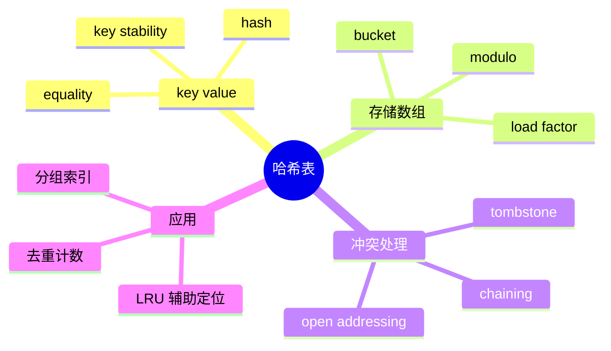

# 哈希表

## 本节知识地图



## 接口契约

哈希表（Hash Map/Hash Table）的抽象接口是“用 key 存取 value”，而不是“把 key 直接当数组下标”：

| 操作 | 结果 | 平均复杂度 | 最坏复杂度 | 关键边界 |
|---|---|---:|---:|---|
| `put(key, value)` | 新增或覆盖 key | O(1) | O(n) | key 必须可哈希且相等性稳定 |
| `get(key)` | 返回 value | O(1) | O(n) | 不存在通常抛 `KeyError` |
| `get(key, default)` | 找不到返回 default | O(1) | O(n) | 不应因为读取而插入 key |
| `remove(key)` | 删除并返回 value | O(1) | O(n) | 不存在通常抛 `KeyError` |
| `contains(key)` | 是否存在 key | O(1) | O(n) | 只检查 key，不比较 value |
| `len()` | 元素数量 | O(1) | O(1) | 只统计有效元素，不统计空槽和墓碑 |
| `items()` | 遍历 key/value | O(n) | O(n) | 顺序是否保证由实现决定 |

### key 的前置条件

- key 必须能计算 `hash(key)`。
- 如果 `a == b`，它们必须有相同 hash。
- key 放入哈希表后，不应改变参与 `__hash__`/`__eq__` 的字段。
- `list`、`dict`、`set` 等可变容器通常不可哈希；`tuple` 只有所有元素都可哈希时才可作为 key。

### 空、重复和异常

- 空表 `get` 找不到 key 时，`get(key, default)` 返回 default。
- `table[key]` 风格的严格查询通常抛 `KeyError`。
- 再次 `put` 同一个 key 是覆盖 value，不增加 size。
- `remove` 不存在的 key 应明确选择抛 `KeyError` 或返回 False；下面的自定义实现采用抛 `KeyError`。
- 传入不可哈希 key 时，Python 风格接口抛 `TypeError`。

## 什么是哈希表

哈希表（Hash Table）是一种通过**哈希函数**将键（key）映射到存储位置的数据结构，从而实现近乎 O(1) 的查找、插入和删除操作。它是算法面试中出现频率最高的数据结构之一。

### 核心原理

1. **哈希函数**：将任意键转换为数组下标。理想的哈希函数应当分布均匀、计算高效。
2. **哈希冲突**：不同的键可能映射到同一下标，必须有冲突处理策略。

常见的冲突解决方式：

| 方法 | 思路 | 优缺点 |
|------|------|--------|
| **链地址法（Chaining）** | 每个槽位维护一个链表，冲突元素追加到链表 | 实现简单；极端情况退化为 O(n) |
| **开放寻址法（Open Addressing）** | 冲突时按探测序列寻找下一个空槽 | 缓存友好；装载因子高时性能下降 |

> CPython 当前的 `dict` 实现采用开放寻址等策略，但这是具体实现细节；本节先从通用数组实现理解原理，不能把 CPython 内部布局当成 Python 语言层 API 保证。

### 时间复杂度

| 操作 | 平均 | 最坏 |
|------|------|------|
| 查找 | O(1) | O(n) |
| 插入 | O(1) | O(n) |
| 删除 | O(1) | O(n) |

最坏情况出现在所有键发生冲突时，但在合理的哈希函数下几乎不会发生。

---

## 用数组从零实现哈希表

### 1. 为什么数组不能直接存 key

如果 key 是整数且范围很小，可以直接：

```python
values[key] = value
```

但真实 key 可能是：

```text
42
\"alice\"
(2026, 9, \"shanghai\")
```

它们：

- 范围可能极大。
- 可能是负数或字符串。
- 不能直接作为连续数组下标。

哈希表的核心就是把任意可哈希 key 压缩成数组下标：

```text
index = hash(key) mod capacity
```

### 2. 数组桶

假设容量为 8：

```text
bucket[0] bucket[1] ... bucket[7]
```

多个 key 可能得到同一个 index，这就是哈希冲突。数组本身只提供 O(1) 定位候选位置，不能保证 key 一定在那里。

### 3. 哈希函数与取模

Python 可以调用对象的 `hash(key)`：

```python
index = hash(key) % capacity
```

Python 的 `%` 对正容量返回非负余数。哈希函数需要满足：

- 相等 key 的 hash 相等。
- 尽量把不同 key 均匀分布。
- 计算成本低。

哈希函数均匀只降低平均冲突，不可能从数学上消除冲突；有限数组槽位面对无限可能 key，冲突必然存在。

### 4. 冲突方案一：拉链法

**Separate Chaining 直译**：分离链接、链地址法。

每个数组槽位不只保存一个元素，而是保存一个小容器：

```text
bucket[0] -> [(key_a, value_a), (key_b, value_b)]
bucket[1] -> []
bucket[2] -> [(key_c, value_c)]
```

查找过程：

1. 对 key 计算 hash。
2. 用取模得到 bucket 下标。
3. 只在该 bucket 内逐个比较 key。
4. 找到相等 key 后返回 value。

如果 hash 分布均匀，平均每个 bucket 很短，整体平均接近 O(1)。

### 5. 拉链法完整实现

下面只使用“数组 + 每个槽位一个列表”，不使用 Python `dict` 保存主表：

```python
_MISSING = object()


class ChainedHashMap:
    def __init__(self, capacity=8, max_load_factor=0.75):
        if capacity < 1:
            raise ValueError("capacity must be positive")
        if not 0 < max_load_factor < 1:
            raise ValueError("max_load_factor must be between 0 and 1")
        self._buckets = [[] for _ in range(capacity)]
        self._size = 0
        self._max_load_factor = max_load_factor

    def __len__(self):
        return self._size

    def _index(self, key):
        # 不可哈希 key 会在这里抛 TypeError
        return hash(key) % len(self._buckets)

    def _find_in_bucket(self, bucket, key):
        for position, (stored_key, value) in enumerate(bucket):
            if stored_key == key:
                return position, value
        return None, _MISSING

    def put(self, key, value):
        bucket = self._buckets[self._index(key)]
        position, _ = self._find_in_bucket(bucket, key)

        if position is not None:
            bucket[position] = (key, value)  # 覆盖，不增加 size
            return False

        bucket.append((key, value))
        self._size += 1
        if self._size / len(self._buckets) > self._max_load_factor:
            self._resize(len(self._buckets) * 2)
        return True

    def get(self, key, default=_MISSING):
        bucket = self._buckets[self._index(key)]
        _, value = self._find_in_bucket(bucket, key)
        if value is not _MISSING:
            return value
        if default is not _MISSING:
            return default
        raise KeyError(key)

    def contains(self, key):
        bucket = self._buckets[self._index(key)]
        position, _ = self._find_in_bucket(bucket, key)
        return position is not None

    def remove(self, key):
        bucket = self._buckets[self._index(key)]
        position, value = self._find_in_bucket(bucket, key)
        if position is None:
            raise KeyError(key)
        bucket.pop(position)
        self._size -= 1
        return value

    def items(self):
        for bucket in self._buckets:
            yield from bucket

    def _resize(self, new_capacity):
        old_items = list(self.items())
        self._buckets = [[] for _ in range(new_capacity)]
        for key, value in old_items:
            bucket = self._buckets[self._index(key)]
            bucket.append((key, value))
```

### 6. 拉链法的关键不变量

- `self._size` 等于所有 bucket 中有效 `(key, value)` 对的总数。
- 同一个 bucket 中不能有两个相等 key。
- `_resize` 后每个 key 必须按新容量重新计算位置，不能直接复制原 bucket 下标。
- `put` 覆盖已有 key 时，size 不变。
- `remove` 只从对应 bucket 删除，不影响其他 bucket。

### 7. 为什么扩容后必须 rehash

原容量 8：

```text
hash(key) % 8 = 3
```

扩容到 16 后：

```text
hash(key) % 16 = 11
```

如果只把旧 bucket 原样搬到新数组，查找会去错误位置。扩容必须遍历所有有效元素，使用新容量重新计算 index，这叫 **rehash**。

### 8. 负载因子

```text
load factor = size / bucket_count
```

负载因子越高：

- 空间利用率更高。
- 冲突链更长。
- 查询平均成本上升。

负载因子越低：

- bucket 更多。
- 冲突更少。
- 空间占用更大。

拉链法可以承受大于 1 的平均负载因子，因为一个 bucket 可以存多个元素；工程上仍会设置阈值控制链长度。

### 9. 拉链法复杂度

设 n 个元素、m 个 bucket：

| 操作 | 平均 | 最坏 |
|---|---:|---:|
| `put/get/remove` | O(1) | O(n) |
| 扩容 rehash | O(n) | O(n) |
| 单次 put（含扩容） | 均摊 O(1) | O(n) |
| `items()` | O(n) | O(n) |
| 空间 | O(n + m) | O(n + m) |

最坏情况是所有 key 落到同一个 bucket，链表退化为线性查找。

---

## 冲突方案二：开放寻址法

### 1. Open Addressing

**直译**：开放寻址。

所有元素直接放在同一个数组中。发生冲突时，按照探测序列寻找其他槽位：

```text
初始位置 i
  -> i+1
  -> i+2
  -> ...
```

数组示意：

```text
slot:  0    1    2    3    4    5
       空   A    B    空   C    空
```

### 2. 线性探测

```text
probe(key, step) = (hash(key) + step) mod capacity
```

优点：

- 只使用数组。
- 连续内存，缓存友好。
- 不需要为每个 bucket 单独分配链表节点。

缺点：

- 容量不能被有效元素占满。
- 高负载下探测链变长。
- 删除不能简单置空。

### 3. 为什么删除要使用墓碑

假设插入时：

```text
key A -> slot 2
key B -> slot 3（与 A 冲突）
```

查找 B 会从 slot 2 开始探测。若删除 A 后把 slot 2 直接标为空，查找 B 看到空槽就会提前结束，错误地认为 B 不存在。

所以开放寻址需要三种状态：

```text
EMPTY    从未使用
OCCUPIED 正常 key/value
DELETED  墓碑，曾经有元素但已删除
```

查找遇到墓碑要继续探测，遇到真正 EMPTY 才能确定后面没有目标。

### 4. 线性探测完整实现

```python
_EMPTY = object()
_DELETED = object()


class ProbingHashMap:
    def __init__(self, capacity=8, max_load_factor=0.7):
        if capacity < 1:
            raise ValueError("capacity must be positive")
        if not 0 < max_load_factor < 1:
            raise ValueError("max_load_factor must be between 0 and 1")
        self._table = [_EMPTY] * capacity
        self._size = 0          # 有效 key/value 数量
        self._used = 0          # 有效元素 + 墓碑数量
        self._max_load_factor = max_load_factor

    def __len__(self):
        return self._size

    def _start(self, key):
        return hash(key) % len(self._table)

    def _locate(self, key):
        capacity = len(self._table)
        start = self._start(key)
        for step in range(capacity):
            index = (start + step) % capacity
            slot = self._table[index]
            if slot is _EMPTY:
                return None
            if slot is not _DELETED and slot[0] == key:
                return index
        return None

    def _slot_for_insert(self, key):
        capacity = len(self._table)
        start = self._start(key)
        first_deleted = None

        for step in range(capacity):
            index = (start + step) % capacity
            slot = self._table[index]
            if slot is _EMPTY:
                return first_deleted if first_deleted is not None else index
            if slot is _DELETED:
                if first_deleted is None:
                    first_deleted = index
            elif slot[0] == key:
                return index

        return first_deleted

    def put(self, key, value):
        # _used 包含墓碑，避免探测空间被墓碑耗尽
        if (self._used + 1) / len(self._table) > self._max_load_factor:
            self._resize(len(self._table) * 2)

        index = self._slot_for_insert(key)
        if index is None:
            self._resize(len(self._table) * 2)
            index = self._slot_for_insert(key)

        old_slot = self._table[index]
        is_new = old_slot is _EMPTY or old_slot is _DELETED
        if old_slot is _EMPTY:
            self._used += 1
            self._size += 1
        elif old_slot is _DELETED:
            self._size += 1

        self._table[index] = (key, value)
        return is_new

    def get(self, key, default=_MISSING):
        index = self._locate(key)
        if index is not None:
            return self._table[index][1]
        if default is not _MISSING:
            return default
        raise KeyError(key)

    def contains(self, key):
        return self._locate(key) is not None

    def remove(self, key):
        index = self._locate(key)
        if index is None:
            raise KeyError(key)
        value = self._table[index][1]
        self._table[index] = _DELETED
        self._size -= 1
        return value

    def _resize(self, new_capacity):
        old_items = [
            slot for slot in self._table
            if slot is not _EMPTY and slot is not _DELETED
        ]
        self._table = [_EMPTY] * new_capacity
        self._size = 0
        self._used = 0
        for key, value in old_items:
            self.put(key, value)

    def items(self):
        for slot in self._table:
            if slot is not _EMPTY and slot is not _DELETED:
                yield slot
```

### 5. 开放寻址实现中的三个计数

- `_size`：真正存在的 key 数量，决定 `len(table)`。
- `_used`：有效元素加墓碑，决定探测空间是否快耗尽。
- `len(_table)`：数组总槽位数。

删除后：

```text
size 减一
used 不变
```

扩容或重建时墓碑被清除，`used` 重新计算。

### 6. 为什么开放寻址要提前扩容

若数组接近满：

- 空槽越来越难找到。
- 查询失败也要探测很长一段。
- 删除留下的墓碑会进一步拖慢。

因此开放寻址通常把负载因子阈值设得低于 1，例如 0.5 到 0.8，具体取决于探测策略。

### 7. 线性探测的聚集

连续被占用的槽形成 **Primary Clustering，主聚集**：

```text
[A][B][C][D][空][空]
```

新 key 落在这段范围时要逐个探测，聚集会让更多 key 加入同一长段。

### 8. 其他探测方式

#### Quadratic Probing

```text
index = (hash(key) + c1*step + c2*step^2) mod capacity
```

减少连续聚集，但要谨慎选择容量和常数，避免探测不到空槽。

#### Double Hashing

```text
index = (h1(key) + step * h2(key)) mod capacity
```

不同 key 的探测步长不同，分布通常更好，但需要第二个合适的 hash。

### 9. 开放寻址复杂度

在负载因子受控、哈希分布合理时：

| 操作 | 平均 | 最坏 |
|---|---:|---:|
| `put/get/remove` | O(1) | O(n) |
| rehash | O(n) | O(n) |
| 单次 put（含扩容） | 均摊 O(1) | O(n) |
| 空间 | O(m) | O(m) |

这里的最坏情况既可能来自大量冲突，也可能来自恶意 key 让 hash 分布退化。

## 扩容、缩容与安全边界

### 1. 扩容与墓碑重建

- 拉链法关注平均 bucket 长度。
- 开放寻址关注 `_used / capacity`，墓碑也会占用探测空间。
- 扩容通常按倍数增长，避免每增加一个元素就搬迁。
- 墓碑过多时可以同容量 rebuild，只重新插入有效元素。

### 2. 可变 key 的失败方式

```python
class UserKey:
    def __init__(self, user_id):
        self.user_id = user_id

    def __hash__(self):
        return hash(self.user_id)

    def __eq__(self, other):
        return isinstance(other, UserKey) and self.user_id == other.user_id


key = UserKey(1)
table = ChainedHashMap()
table.put(key, "alice")
key.user_id = 2
# key 仍在旧 bucket，但查找会按新 hash 去另一个位置
```

因此 key 必须不可变，或保证参与 hash/equality 的字段放入后不变。

### 3. Hash DoS

攻击者若能构造大量冲突，平均 O(1) 可能退化为 O(n)，并把请求处理拖入 CPU 消耗。工程实现可使用随机化 hash seed、字段长度限制和冲突保护，但不能把“平均复杂度”当作无条件安全保证。

### 4. 迭代顺序

自定义数组实现的 `items()` 顺序取决于 bucket/slot，扩容后可能变化。Python `dict` 的插入顺序是语言层语义；从零实现时若要稳定顺序，需要额外维护链表或顺序数组。

### 5. value 与 key 的职责

- key 决定定位和身份。
- value 可以是可变对象，但修改 value 内部不应改变槽位。
- 覆盖 value 不增加 size。
- 删除后重新插入同 key 的顺序由实现决定。

---

## 两种数组实现如何选择

| 维度 | 拉链法 | 开放寻址 |
|---|---|---|
| 存储 | 数组 + 每桶小容器 | 单一数组 |
| 冲突 | 同桶继续比较 | 继续探测其他槽 |
| 删除 | 直接移除 | 需要墓碑或重排 |
| 缓存局部性 | 桶节点可能分散 | 通常更好 |
| 高负载容忍 | 相对高 | 必须保留空槽 |
| 实现难点 | 扩容重哈希 | 探测、墓碑、重建 |
| 适合教学 | 先学，直观 | 面试追问和底层实现 |

面试回答顺序建议：

1. 先说数组通过 hash 定位初始槽位。
2. 再说冲突不能避免。
3. 给出拉链法或开放寻址一种完整方案。
4. 解释扩容和负载因子。
5. 解释删除为什么需要特殊处理。
6. 最后说平均 O(1)、最坏 O(n)。

---

## 实现自测：刻意制造冲突

正常整数和字符串的 hash 分布不容易肉眼观察。可以定义一个所有 key 都返回同一 hash 的类型，验证冲突处理是否真的正确：

```python
class BadHash:
    def __init__(self, name):
        self.name = name

    def __hash__(self):
        return 1  # 所有 key 强制落在同一初始槽位

    def __eq__(self, other):
        return isinstance(other, BadHash) and self.name == other.name


def exercise(map_type):
    table = map_type(capacity=4)
    a, b, c = BadHash("a"), BadHash("b"), BadHash("c")

    assert table.put(a, 1) is True
    assert table.put(b, 2) is True       # 触发冲突
    assert table.put(c, 3) is True       # 继续冲突，并可能扩容
    assert table.put(b, 20) is False     # 覆盖，不增加 size
    assert len(table) == 3
    assert table.get(b) == 20

    assert table.remove(a) == 1
    assert table.get(b) == 20            # 开放寻址不能被墓碑截断
    assert table.get(BadHash("x"), "missing") == "missing"


exercise(ChainedHashMap)
exercise(ProbingHashMap)
```

这个测试同时验证：

- 相等 key 能覆盖旧 value。
- 冲突 key 不互相覆盖。
- `len` 只统计有效元素。
- 扩容后仍能找到旧 key。
- 开放寻址删除后，后续探测链没有断。
- 不存在 key 的默认值行为。

---

## 面试表达：如何用数组实现 HashMap

> 我会先准备一个数组，数组容量为 m。对 key 计算 hash，再用 `hash(key) % m` 得到初始槽位。不同 key 可能得到同一个槽位，必须处理冲突。最直观的是拉链法：每个数组元素保存一个小列表，在列表中按 key 比较；另一种是开放寻址法：发生冲突就按线性探测或其他探测序列寻找空槽。表中元素达到负载因子阈值后扩容，并把所有 key 按新容量重新 hash。拉链法删除可以直接移除；开放寻址不能把删除位置简单置空，否则会截断后续查询，通常要放墓碑。哈希分布合理时增删查平均 O(1)，最坏 O(n)，扩容单次 O(n) 但插入均摊 O(1)。\n+
### 追问一：为什么一定会冲突

> key 的可能数量通常远大于数组槽位数量。根据抽屉原理，至少两个 key 必然映射到同一个 index。哈希函数只能让分布尽量均匀，不能消除冲突。

### 追问二：扩容为什么不能只复制数组

> index 由容量参与计算。容量从 8 变成 16 后，同一个 hash 的取模结果可能改变。必须遍历有效元素，用新容量重新计算位置，这个过程叫 rehash。

### 追问三：开放寻址删除为什么需要墓碑

> 线性探测查找会沿探测序列继续。如果把冲突链中间的删除位置置为空，查找遇到空槽就会误判不存在。墓碑表示“这里以前有元素，继续探测”，只有真正从未使用的 EMPTY 才能结束查找。

### 追问四：平均 O(1) 的前提

> 需要哈希函数分布合理、负载因子受控、key 的 hash 和相等性稳定。大量碰撞、表接近满、墓碑过多或恶意构造 key 时，操作可能退化到 O(n)。

### 追问五：为什么 key 不能随意修改

> key 放入表后，如果参与 hash 或 equality 的字段改变，它可能仍在旧槽位，但再次查找会根据新 hash 去另一个槽位，导致逻辑上“插入过却找不到”。所以 key 必须是不可变或哈希相关状态稳定的对象。

---

## Python 中的哈希表

Python 提供了多种基于哈希的内置类型，面试中最常用的有四个：`dict`、`Counter`、`defaultdict` 和 `set`。

### dict

`dict` 是 Python 最基础的哈希表实现。

```python
d = {"apple": 3, "banana": 5}
d["cherry"] = 7           # 增
d["apple"] = 10           # 改（覆盖旧值）
val = d.get("grape", 0)   # 查，不存在返回默认值
del d["banana"]           # 删
val = d.pop("cherry", None)
if "apple" in d:          # 判断键是否存在
    print(d["apple"])
```

**遍历与推导式：**

```python
for k, v in d.items():    # 遍历键值对；也可用 .keys()、.values()
    print(k, v)

squared = {x: x ** 2 for x in [1, 2, 3, 4]}
# {1: 1, 2: 4, 3: 9, 4: 16}
```

### collections.Counter

`Counter` 专门用于计数，是 `dict` 的子类。

```python
from collections import Counter

cnt = Counter(["apple", "banana", "apple", "cherry", "banana", "apple"])
# Counter({'apple': 3, 'banana': 2, 'cherry': 1})

cnt["grape"]               # 不存在返回 0，不抛异常
cnt.most_common(2)         # [('apple', 3), ('banana', 2)]

freq = Counter("abracadabra")  # 字符频率统计
# Counter({'a': 5, 'b': 2, 'r': 2, 'c': 1, 'd': 1})
```

### collections.defaultdict

`defaultdict` 在访问不存在的键时自动创建默认值，避免 `KeyError`。

```python
from collections import defaultdict

# defaultdict(int)：默认值 0，适合计数
counter = defaultdict(int)
for ch in "hello":
    counter[ch] += 1  # {'h': 1, 'e': 1, 'l': 2, 'o': 1}

# defaultdict(list)：默认值空列表，适合分组
groups = defaultdict(list)
for category, item in [("fruit", "apple"), ("fruit", "banana"), ("veggie", "carrot")]:
    groups[category].append(item)

# defaultdict(set)：去重分组，常用于建图
graph = defaultdict(set)
for u, v in [(1, 2), (1, 3), (2, 3)]:
    graph[u].add(v)
    graph[v].add(u)
```

### set

`set` 是基于哈希表的无序集合，元素唯一，支持 O(1) 成员检查。

```python
s = set([1, 2, 2, 3])     # 自动去重 -> {1, 2, 3}
s.add(4)
s.discard(2)               # 不存在也不报错
if 3 in s:                 # O(1) 成员检查
    print("found")

a, b = {1, 2, 3, 4}, {3, 4, 5, 6}
a & b   # 交集 {3, 4}
a | b   # 并集 {1, 2, 3, 4, 5, 6}
a - b   # 差集 {1, 2}
a ^ b   # 对称差集 {1, 2, 5, 6}
```

> **面试提示**：当题目要求"判断是否存在"或"去重"时，优先考虑 `set`。

---

## 高频题型与解题模式

## 哈希表实现的排障顺序

出现“插入后查不到”“扩容后结果错”时，按不变量排查：

1. `hash(key)` 是否在每次调用间稳定。
2. 相等 key 是否产生相同 hash。
3. index 是否使用当前容量重新计算。
4. 冲突时是否比较真实 key，而不是只比较 hash。
5. 开放寻址遇到墓碑是否继续探测。
6. 扩容/缩容是否重新 hash 所有有效元素。
7. 覆盖 value 是否错误增加 size。
8. 删除后是否破坏探测链。

### hash 相同不代表 key 相等

`hash(a) == hash(b)` 只说明它们可能落在同一候选位置，不代表 `a == b`。反过来，若 `a == b` 却 hash 不同，会破坏哈希表正确性，是 key 类型实现错误。

### 随机化 hash 的安全意义

外部输入若能构造大量碰撞，插入和查询可能从平均 O(1) 退化为 O(n)。随机化 hash seed 能降低预先构造碰撞集合的成功率，但仍需限制 key 数量和长度。

## 手算一次哈希表操作

假设：

```text
capacity = 5
index(key) = hash(key) mod 5
```

为了便于演示，假设三个 key 的 hash 分别为：

```text
alice -> 6
bob   -> 11
carol -> 1
```

### 拉链法

```text
alice -> 1
bob   -> 1，和 alice 冲突，追加到 bucket[1]
carol -> 1，继续追加
```

表中状态：

```text
bucket[0] = []
bucket[1] = [(alice, ...), (bob, ...), (carol, ...)]
bucket[2] = []
bucket[3] = []
bucket[4] = []
```

查找 `bob` 需要比较 bucket[1] 中的 key，而不是只比较 hash。

### 线性探测

```text
alice -> slot 1
bob   -> slot 1 已占用，探测 slot 2
carol -> slot 1/2 已占用，探测 slot 3
```

删除 alice：

```text
slot 1 = DELETED
slot 2/3 不能变成 EMPTY
```

查找 bob 必须跳过墓碑继续走到 slot 2。

### 扩容后的重新定位

容量从 5 变成 10 后：

```text
alice: 6 mod 5  = 1
alice: 6 mod 10 = 6
```

旧下标 1 不能直接复制到新表，必须 rehash。

## 自定义 key 的正确性测试

```python
class StableKey:
    def __init__(self, value):
        self.value = value

    def __hash__(self):
        return hash(self.value)

    def __eq__(self, other):
        return isinstance(other, StableKey) and self.value == other.value


first = StableKey("same")
second = StableKey("same")
table = ChainedHashMap()
table.put(first, 1)
table.put(second, 2)
assert len(table) == 1
assert table.get(first) == 2
```

`first` 和 `second` 是不同对象，但 equality 相等，因此必须被视为同一个逻辑 key。

如果只比较对象身份 `is`，会错误地保留两个条目；如果 equality 相等但 hash 不同，也会让实现违反哈希表前置条件。

### 两数之和模式

**核心思路**：遍历数组时，用哈希表记录已见过的元素及其下标。对于当前元素 `num`，检查 `target - num` 是否在哈希表中。

```python
def two_sum(nums: list[int], target: int) -> list[int]:
    seen = {}  # val -> index
    for i, num in enumerate(nums):
        complement = target - num
        if complement in seen:
            return [seen[complement], i]
        seen[num] = i
    return []
```

时间 O(n)，空间 O(n)。这个"边遍历边查表"的模式非常通用，可以推广到 k 数之和、配对问题等。

### 计数问题

**字母异位词分组（LC 49）**：将每个单词排序后作为键，值为该键对应的所有原始单词。

```python
def group_anagrams(strs: list[str]) -> list[list[str]]:
    groups = defaultdict(list)
    for s in strs:
        key = tuple(sorted(s))
        groups[key].append(s)
    return list(groups.values())
```

**前缀和 + 哈希表（LC 560 和为 K 的子数组）**：维护前缀和的计数哈希表。子数组 `nums[i..j]` 的和等于 `prefix[j+1] - prefix[i]`，因此对于每个前缀和，查找 `prefix_sum - k` 出现的次数。

```python
def subarray_sum(nums: list[int], k: int) -> int:
    count = 0
    prefix_sum = 0
    prefix_count = defaultdict(int)
    prefix_count[0] = 1  # 空前缀
    for num in nums:
        prefix_sum += num
        count += prefix_count[prefix_sum - k]
        prefix_count[prefix_sum] += 1
    return count
```

### 滑动窗口 + 哈希表

**找所有字母异位词（LC 438）**：维护一个固定大小的窗口，用 `Counter` 统计窗口内字符频率，与目标频率比较。

```python
def find_anagrams(s: str, p: str) -> list[int]:
    if len(s) < len(p):
        return []
    p_count = Counter(p)
    s_count = Counter(s[:len(p)])
    result = []
    if s_count == p_count:
        result.append(0)
    for i in range(len(p), len(s)):
        # 右端加入
        s_count[s[i]] += 1
        # 左端移出
        left = s[i - len(p)]
        s_count[left] -= 1
        if s_count[left] == 0:
            del s_count[left]
        if s_count == p_count:
            result.append(i - len(p) + 1)
    return result
```

---

## 经典题目

按难度分组的高频哈希表题目：

### Easy

| # | 题目 | 关键思路 |
|---|------|----------|
| 1 | [两数之和](https://leetcode.cn/problems/two-sum/) | 哈希表存已遍历元素 |
| 217 | [存在重复元素](https://leetcode.cn/problems/contains-duplicate/) | set 判重 |
| 242 | [有效的字母异位词](https://leetcode.cn/problems/valid-anagram/) | Counter 比较频率 |

### Medium

| # | 题目 | 关键思路 |
|---|------|----------|
| 49 | [字母异位词分组](https://leetcode.cn/problems/group-anagrams/) | 排序后作键，defaultdict 分组 |
| 128 | [最长连续序列](https://leetcode.cn/problems/longest-consecutive-sequence/) | set + 只从序列起点开始计数 |
| 347 | [前 K 个高频元素](https://leetcode.cn/problems/top-k-frequent-elements/) | Counter.most_common 或桶排序 |
| 438 | [找到字符串中所有字母异位词](https://leetcode.cn/problems/find-all-anagrams-in-a-string/) | 滑动窗口 + Counter |
| 560 | [和为 K 的子数组](https://leetcode.cn/problems/subarray-sum-equals-k/) | 前缀和 + 哈希表计数 |

---

## 小结

| 要点 | 说明 |
|------|------|
| **O(1) 查找** | 哈希表的核心优势，将暴力 O(n) 查找降为 O(1) |
| **空间换时间** | 几乎所有哈希表解法都是用额外空间换取时间复杂度的降低 |
| **选对工具** | 计数用 `Counter`，分组用 `defaultdict(list)`，判重用 `set`，通用映射用 `dict` |
| **常见搭配** | 哈希表 + 前缀和、哈希表 + 滑动窗口、哈希表 + 排序 |

掌握哈希表的关键不在于记住 API，而在于识别"需要快速查找/计数/去重"的场景，并选择合适的数据结构来实现。
