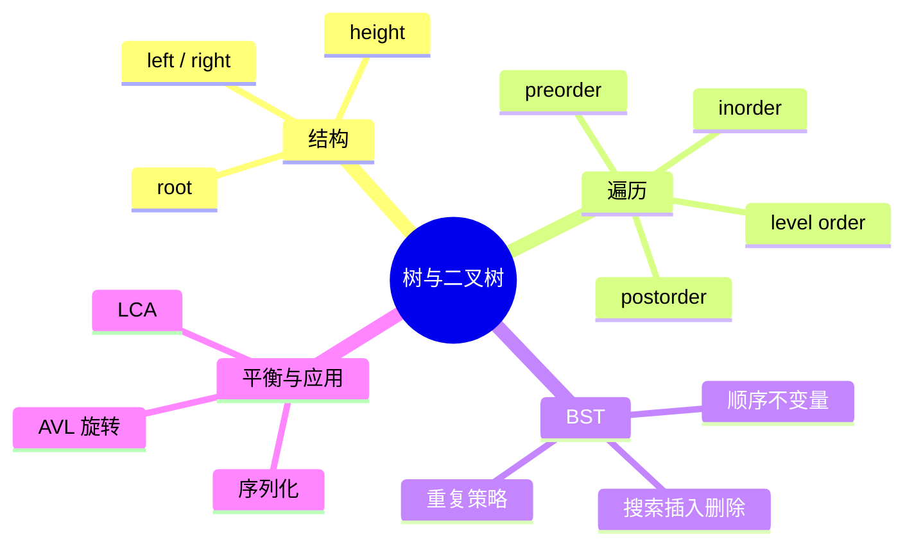

# 树与二叉树

## 本节知识地图



## 接口契约

本章区分“普通二叉树接口”和“二叉搜索树接口”。普通二叉树只保证父子关系；BST 还保证节点值的排序不变量。

| 操作 | 输入前提 | 返回/副作用 | 复杂度 |
|---|---|---|---:|
| `root = TreeNode(value)` | value 可比较或仅作标签 | 创建一个叶子节点 | O(1) |
| `traverse(root)` | root 可为 `None` | 返回值序列，不修改结构 | O(n) |
| `search_bst(root, value)` | root 满足 BST 不变量 | 节点或 `None` | O(h) |
| `insert_bst(root, value)` | 本章策略：重复值忽略 | 返回可能变化的新根 | O(h) |
| `delete_bst(root, value)` | 本章策略：不存在则原样返回 | 返回可能变化的新根 | O(h) |
| `level_order(root)` | root 可为 `None` | 按层返回值 | O(n) |

其中 `n` 是节点数，`h` 是树高。平衡树中 `h = O(log n)`；退化成链时 `h = O(n)`。

### 普通二叉树的边界

- 空树用 `root = None` 表示。
- 叶子节点的 `left/right` 都是 `None`。
- 遍历空树返回空列表。
- 递归代码的额外空间是 O(h)，不是永远 O(log n)。
- 树节点默认可被同进程其他代码直接修改，容器不自动维护 parent/size。

### 本章 BST 的重复值策略

为避免验证和插入规则冲突，本章统一采用**集合语义**：

```text
左子树 < 当前值 < 右子树
插入已存在的值：忽略，不创建重复节点
```

如果题目需要重复值，应改成“节点保存 count”或明确规定重复值放一侧，不能混用策略。

## 什么是树

树是一种**非线性**的层次数据结构，由节点和边组成。掌握以下基本概念：

| 术语 | 含义 |
|------|------|
| 节点（Node） | 树中的基本单元，存储数据 |
| 根（Root） | 树最顶层的节点，没有父节点 |
| 叶子（Leaf） | 没有子节点的节点 |
| 深度（Depth） | 从根到该节点经过的边数 |
| 高度（Height） | 从该节点到最远叶子的边数；树的高度 = 根的高度 |
| 子树（Subtree） | 以某节点为根的整棵树 |

**二叉树的特点**：每个节点最多有两个子节点——左子节点和右子节点。面试中绝大多数树的题目都围绕二叉树展开。

---

## 二叉树的类型

### 满二叉树（Full Binary Tree）

每个节点要么有 0 个子节点，要么有 2 个子节点，不存在只有 1 个子节点的情况。

### 完全二叉树（Complete Binary Tree）

除最后一层外每层都被填满，最后一层的节点全部靠左排列。堆（Heap）就是用完全二叉树实现的。

### 平衡二叉树（Balanced Binary Tree）

“平衡”在不同资料中可能有不同定义。本章把“任意节点左右子树高度差不超过 1”作为 AVL 风格的严格定义；普通工程中的红黑树使用另一种平衡条件。

### 二叉搜索树（BST）

满足以下性质：

- 左子树所有节点的值 **<** 当前节点的值
- 右子树所有节点的值 **>** 当前节点的值
- 左右子树也分别是 BST

BST 的中序遍历结果是一个**升序序列**，这是解题的核心性质。

---

## Python 节点定义

```python
class TreeNode:
    def __init__(self, val=0, left=None, right=None):
        self.val = val
        self.left = left
        self.right = right
```

LeetCode 中所有二叉树题目都使用这个定义，务必记牢。

## 树的结构与接口边界

### 二叉树不等于 BST

```text
普通二叉树：只保证每个节点最多两个孩子
BST：还保证左 < 根 < 右
堆：保证父子堆序，但不保证左子树整体小于右子树
```

不能把一个普通二叉树直接使用 BST 查找，也不能把堆当作有序数组。

### 节点数、边数与高度

对非空树：

```text
边数 = 节点数 - 1
```

若根的深度为 0：

- 叶子深度是从根到它的边数。
- 单节点树高度为 0。
- 空树高度可约定为 `-1` 或 `0`，本章递归最大深度使用节点数定义，空树返回 0。

同一术语若采用另一种高度口径，复杂度和递归 base case 都要同步修改。

### 递归函数的契约

写树递归前先说清：

```text
输入：当前节点 root
返回：当前子树的什么信息
空节点：返回什么
父节点如何使用左右返回值
```

例如最大深度：

```text
max_depth(None) = 0
max_depth(node) = 1 + max(left_depth, right_depth)
```

### 遍历复杂度

| 遍历 | 时间 | 额外空间 | 输出特点 |
|---|---:|---:|---|
| 前/中/后序递归 | O(n) | O(h) 调用栈 | 访问顺序固定 |
| 前/中/后序迭代 | O(n) | O(h) 显式栈 | 避免递归限制 |
| 层序 BFS | O(n) | O(w) 队列 | `w` 是最大层宽 |

退化链的 `h=n`，平衡树才有 `h=O(log n)`。

---

## 遍历方式

### 前序遍历（根-左-右）

**递归写法**——最直观：

```python
def preorder(root: TreeNode) -> list[int]:
    if not root:
        return []
    return [root.val] + preorder(root.left) + preorder(root.right)
```

**迭代写法**——用栈模拟递归，注意先压右再压左：

```python
def preorder_iterative(root: TreeNode) -> list[int]:
    if not root:
        return []
    stack, res = [root], []
    while stack:
        node = stack.pop()
        res.append(node.val)
        if node.right:
            stack.append(node.right)
        if node.left:
            stack.append(node.left)
    return res
```

### 中序遍历（左-根-右）

**递归写法**：

```python
def inorder(root: TreeNode) -> list[int]:
    if not root:
        return []
    return inorder(root.left) + [root.val] + inorder(root.right)
```

**迭代写法**——不断向左深入，弹出时处理节点再转向右子树：

```python
def inorder_iterative(root: TreeNode) -> list[int]:
    stack, res = [], []
    cur = root
    while cur or stack:
        while cur:
            stack.append(cur)
            cur = cur.left
        cur = stack.pop()
        res.append(cur.val)
        cur = cur.right
    return res
```

> 对 BST 执行中序遍历，得到的就是有序数组——很多 BST 题目的关键突破口。

### 后序遍历（左-右-根）

**递归写法**：

```python
def postorder(root: TreeNode) -> list[int]:
    if not root:
        return []
    return postorder(root.left) + postorder(root.right) + [root.val]
```

**迭代写法**——巧妙做法：按「根-右-左」入栈，最后反转结果：

```python
def postorder_iterative(root: TreeNode) -> list[int]:
    if not root:
        return []
    stack, res = [root], []
    while stack:
        node = stack.pop()
        res.append(node.val)
        if node.left:
            stack.append(node.left)
        if node.right:
            stack.append(node.right)
    return res[::-1]
```

### 层序遍历（BFS）

使用 `deque` 逐层处理，是 BFS 在树上的标准应用：

```python
from collections import deque

def level_order(root: TreeNode) -> list[list[int]]:
    if not root:
        return []
    queue = deque([root])
    res = []
    while queue:
        level = []
        for _ in range(len(queue)):
            node = queue.popleft()
            level.append(node.val)
            if node.left:
                queue.append(node.left)
            if node.right:
                queue.append(node.right)
        res.append(level)
    return res
```

`for _ in range(len(queue))` 这一行是层序遍历的关键——它确保每次 while 循环恰好处理一层。

---

## 高频技巧

### DFS 递归模板

大量二叉树题目都可以归结为「对每个节点，利用左右子树的结果计算当前结果」。

**求最大深度（LC 104）**：

```python
def max_depth(root: TreeNode) -> int:
    if not root:
        return 0
    return 1 + max(max_depth(root.left), max_depth(root.right))
```

**判断是否对称（LC 101）**：

```python
def is_symmetric(root: TreeNode) -> bool:
    def check(left, right):
        if not left and not right:
            return True
        if not left or not right:
            return False
        return (left.val == right.val
                and check(left.left, right.right)
                and check(left.right, right.left))
    return check(root.left, root.right) if root else True
```

**路径总和（LC 112）**：

```python
def has_path_sum(root: TreeNode, target: int) -> bool:
    if not root:
        return False
    if not root.left and not root.right:
        return root.val == target
    return (has_path_sum(root.left, target - root.val)
            or has_path_sum(root.right, target - root.val))
```

### BST 操作

**查找**——利用 BST 性质每次排除一半，时间 O(h)：

```python
def search_bst(root: TreeNode, val: int) -> TreeNode:
    if not root or root.val == val:
        return root
    if val < root.val:
        return search_bst(root.left, val)
    return search_bst(root.right, val)
```

**插入**：

```python
def insert_bst(root: TreeNode, val: int) -> TreeNode:
    if not root:
        return TreeNode(val)
    if val < root.val:
        root.left = insert_bst(root.left, val)
    elif val > root.val:
        root.right = insert_bst(root.right, val)
    # val == root.val：按本章集合语义忽略重复值
    return root
```

**删除**需要处理三种情况：

1. 没有孩子：直接删除。
2. 只有一个孩子：用孩子替代当前节点。
3. 有两个孩子：用右子树最小值（或左子树最大值）替代，再删除那个替代节点。

```python
def delete_bst(root: TreeNode, val: int) -> TreeNode:
    if root is None:
        return None

    if val < root.val:
        root.left = delete_bst(root.left, val)
    elif val > root.val:
        root.right = delete_bst(root.right, val)
    else:
        if root.left is None:
            return root.right
        if root.right is None:
            return root.left

        successor = root.right
        while successor.left is not None:
            successor = successor.left
        root.val = successor.val
        root.right = delete_bst(root.right, successor.val)
    return root
```

删除接口约定“值不存在时原样返回”，如果需要报告是否删除成功，可以额外返回 `(new_root, removed)`。

### BST 删除的为什么要找后继

删除双孩子节点不能直接把某一边丢掉。右子树最小值满足：

```text
大于当前节点左侧所有值
小于或等于右子树其他值
```

用它替换当前值后，剩余右子树仍然满足 BST 顺序，再递归删除原后继节点。

### BST 的最坏退化

按有序序列插入：

```text
1 -> 2 -> 3 -> 4 -> 5
```

会得到一条右链：

- 查找 O(n)。
- 插入 O(n)。
- 删除 O(n)。

需要稳定 O(log n) 时，应使用 AVL、红黑树或语言标准库的平衡有序映射，而不是裸 BST。

**验证 BST（LC 98）**——用上下界递归：

```python
def is_valid_bst(root: TreeNode) -> bool:
    def validate(node, lo=float('-inf'), hi=float('inf')):
        if not node:
            return True
        if node.val <= lo or node.val >= hi:
            return False
        return (validate(node.left, lo, node.val)
                and validate(node.right, node.val, hi))
    return validate(root)
```

### 从遍历序列构建树

**前序 + 中序重建二叉树（LC 105）**：

前序的第一个元素是根；在中序中找到根的位置，左侧是左子树，右侧是右子树。下面实现要求节点值**不重复**；重复值需要额外的出现次数或区间定位信息，不能直接套用。

```python
def build_tree(preorder: list[int], inorder: list[int]) -> TreeNode:
    idx_map = {val: i for i, val in enumerate(inorder)}

    def helper(pre_left, pre_right, in_left, in_right):
        if pre_left > pre_right:
            return None
        root_val = preorder[pre_left]
        root = TreeNode(root_val)
        in_root = idx_map[root_val]
        left_size = in_root - in_left

        root.left = helper(pre_left + 1, pre_left + left_size,
                           in_left, in_root - 1)
        root.right = helper(pre_left + left_size + 1, pre_right,
                            in_root + 1, in_right)
        return root

    n = len(preorder)
    return helper(0, n - 1, 0, n - 1)
```

时间复杂度 O(n)，空间复杂度 O(n)。

### 树接口的边界测试

```text
None 空树
只有根节点
只有左链或右链的退化树
重复值插入后是否保持验证规则
删除叶子、单孩子节点、双孩子节点和不存在值
重复值的遍历序列是否满足构造前置条件
```

## 树的构造和序列化约定

### 层序数组

```text
[1, 2, 3, null, 4]
```

`null` 占据一个孩子位置。序列化时可以删除末尾连续 null，但不能删除中间 null，否则父子对应关系会变化。

### 前序带空标记

```text
1 2 # # 3 # #
```

它是一个前序递归语法：

```text
读到值 -> 创建节点 -> 递归读左 -> 递归读右
读到 # -> 返回 None
```

解析函数必须返回“节点 + 下一游标”，否则嵌套递归无法知道消费了多少 token。

### 前序 + 中序

该构造要求：

- 两个序列长度相同。
- 元素集合相同。
- 节点值唯一（当前哈希索引写法）。

不满足时应抛 `ValueError`，不能让 `idx_map` 静默覆盖重复值。

## 平衡 BST：AVL 的实现轮廓

裸 BST 的问题不是接口，而是高度可能退化。AVL 在每个节点维护高度，并在插入/删除后通过旋转恢复：

```text
balance_factor = height(left) - height(right)
允许范围：-1, 0, 1
```

### 左旋和右旋

```python
class AVLNode:
    def __init__(self, key):
        self.key = key
        self.left = None
        self.right = None
        self.height = 1


def height(node):
    return node.height if node else 0


def update_height(node):
    node.height = 1 + max(height(node.left), height(node.right))


def rotate_right(root):
    pivot = root.left
    middle = pivot.right
    pivot.right = root
    root.left = middle
    update_height(root)
    update_height(pivot)
    return pivot


def rotate_left(root):
    pivot = root.right
    middle = pivot.left
    pivot.left = root
    root.right = middle
    update_height(root)
    update_height(pivot)
    return pivot
```

### 重新平衡

```python
def rebalance(root):
    update_height(root)
    balance = height(root.left) - height(root.right)

    if balance > 1:
        if height(root.left.left) < height(root.left.right):
            root.left = rotate_left(root.left)
        return rotate_right(root)

    if balance < -1:
        if height(root.right.right) < height(root.right.left):
            root.right = rotate_right(root.right)
        return rotate_left(root)

    return root
```

四种失衡：

| 类型 | 结构 | 修复 |
|---|---|---|
| LL | 左子的左侧过高 | 右旋 |
| RR | 右子的右侧过高 | 左旋 |
| LR | 左子的右侧过高 | 左旋子树，再右旋 |
| RL | 右子的左侧过高 | 右旋子树，再左旋 |

### AVL 插入

```python
def avl_insert(root, key):
    if root is None:
        return AVLNode(key)
    if key < root.key:
        root.left = avl_insert(root.left, key)
    elif key > root.key:
        root.right = avl_insert(root.right, key)
    else:
        return root
    return rebalance(root)
```

AVL 的查找、插入、删除都为 O(log n)，但旋转和高度维护使实现复杂度高于普通 BST。红黑树通常以更少旋转换取较宽松平衡，Python 标准 `dict` 并不是有序树。

### AVL 删除的实现步骤

删除和插入一样先按 BST 规则找到节点，再从递归返回路径上重新计算高度并 rebalance：

```python
def avl_delete(root, key):
    if root is None:
        return None
    if key < root.key:
        root.left = avl_delete(root.left, key)
    elif key > root.key:
        root.right = avl_delete(root.right, key)
    else:
        if root.left is None:
            return root.right
        if root.right is None:
            return root.left
        successor = root.right
        while successor.left is not None:
            successor = successor.left
        root.key = successor.key
        root.right = avl_delete(root.right, successor.key)
    return rebalance(root)
```

删除一个节点后，祖先节点的高度可能降低，失衡方向与插入不完全相同；每层都必须重新 `update_height`，不能只旋转删除点。

### AVL 的接口测试

```python
root = None
for key in [30, 20, 10, 25, 40, 50]:
    root = avl_insert(root, key)
for key in [10, 40, 999]:
    root = avl_delete(root, key)

def check_avl(node):
    if node is None:
        return 0
    left, right = check_avl(node.left), check_avl(node.right)
    assert abs(left - right) <= 1
    assert node.height == 1 + max(left, right)
    return node.height

check_avl(root)
```

## 树的可逆序列化

### 1. 为什么只输出前序不够

```text
前序 [1, 2, 3]
```

可能对应多种左右孩子结构。要可逆，需要：

- 层序中的 null。
- 前序/后序中的 null 标记。
- 或依赖 BST 有序性质。

### 2. 前序 + null 编解码

```python
def encode_preorder(root):
    result = []

    def visit(node):
        if node is None:
            result.append("#")
            return
        result.append(str(node.val))
        visit(node.left)
        visit(node.right)

    visit(root)
    return " ".join(result)

def decode_preorder(tokens):
    index = 0

    def build():
        nonlocal index
        if index >= len(tokens):
            raise ValueError("incomplete preorder encoding")
        token = tokens[index]
        index += 1
        if token == "#":
            return None
        node = TreeNode(int(token))
        node.left = build()
        node.right = build()
        return node

    root = build()
    if index != len(tokens):
        raise ValueError("extra tokens in preorder encoding")
    return root
```

### 3. 编解码的接口不变量

```text
decode(encode(tree)) 与原树的结构和值一致
编码中的每个非空节点恰好消费两个孩子位置
空树编码也必须有明确表示
```

### 4. BST 紧凑编码

BST 可只保存前序值，再利用上下界恢复结构，但前提是：

- 重复值策略固定。
- 输入确实满足 BST。
- 解析器检查所有 token 已消费。

## 最近公共祖先的两种接口

### 普通二叉树

需要递归同时搜索左右子树，时间 O(n)：

```python
def lca(root, first, second):
    if root is None or root is first or root is second:
        return root
    left = lca(root.left, first, second)
    right = lca(root.right, first, second)
    if left and right:
        return root
    return left or right
```

这个版本默认两个节点都存在；若题面不保证，需要额外返回 found 标志，避免把“只找到一个节点”误判为 LCA。

### BST

利用值范围从根向下走，时间 O(h)：

```python
def lca_bst(root, first, second):
    low = min(first, second)
    high = max(first, second)
    while root:
        if root.val > high:
            root = root.left
        elif root.val < low:
            root = root.right
        else:
            return root
    return None
```

不能把 BST 版本用于普通二叉树。

## 树接口边界复盘

```text
空树返回 0、None、[] 的选择
高度按边数还是节点数
BST 重复值策略
删除不存在值
普通树是否保证节点对象存在
序列化是否可逆
递归深度是否受输入控制
AVL/红黑树是否需要维护额外元数据
```

## 树题型接口矩阵

| 题型 | 输入 | 返回 | 主要不变量 |
|---|---|---|---|
| 最大深度 | root/None | 整数 | 空树深度口径 |
| 路径总和 | root、target | bool | 只计根到叶路径 |
| 层序遍历 | root/None | 二维值列表 | 每轮固定当前层宽度 |
| BST 查找 | BST root、key | 节点/None | 左右边界 |
| LCA | 两个节点 | 节点/None | 节点是否保证存在 |
| 序列化 | root | token 序列 | 是否可逆 |
| AVL 插入 | AVL root、key | 新根 | 高度和平衡因子 |

### 路径总和的边界

```python
def has_path_sum(root, target):
    if root is None:
        return False
    if root.left is None and root.right is None:
        return root.val == target
    return (
        has_path_sum(root.left, target - root.val)
        or has_path_sum(root.right, target - root.val)
    )
```

不能在任意中间节点返回 True；题目若要求“任意节点到任意节点”，接口和递归状态都要改变。

### LCA 的存在性

若题目不保证两个节点都存在，需要返回 `(ancestor, found_count)`：

```python
def lca_with_presence(root, first, second):
    if root is None:
        return None, 0
    left_node, left_count = lca_with_presence(root.left, first, second)
    right_node, right_count = lca_with_presence(root.right, first, second)
    count = left_count + right_count
    if root is first or root is second:
        count += 1
    if left_node and right_node:
        candidate = root
    else:
        candidate = left_node or right_node or (
            root if root is first or root is second else None
        )
    return candidate, count
```

只有 `count == 2` 时，candidate 才能确认是有效 LCA。

## 树的 30 秒背诵

> 树是节点和边组成的层级结构。普通二叉树没有排序保证，BST 维护左小右大，堆维护父子极值。遍历都要 O(n)，递归额外空间 O(h)。BST 操作是 O(h)，平衡为 O(log n)，退化为 O(n)；AVL 通过高度、平衡因子和旋转维持对数高度。构造和序列化必须明确空节点、重复值和是否可逆。

## 树的非递归接口

递归写法清楚，但输入深度来自外部时可能超过递归限制。非递归版本使用显式栈：

```python
def preorder_iterative(root):
    if root is None:
        return []
    result = []
    stack = [root]
    while stack:
        node = stack.pop()
        result.append(node.val)
        if node.right is not None:
            stack.append(node.right)
        if node.left is not None:
            stack.append(node.left)
    return result
```

### Morris 遍历的边界

Morris 遍历可把额外空间降到 O(1)，但会临时修改树中的 right 指针：

- 遍历中途如果被异常打断，树可能处于临时状态。
- 与并发读树不兼容。
- 代码更难维护。

面试可以说明原理，工程默认优先递归或显式栈的可读性。

## 从接口到实现：TreeMap 与 TreeSet

BST 常见的两个抽象接口：

| 抽象 | value 语义 | 重复 key |
|---|---|---|
| `TreeSet` | 只保存 key | 忽略或计数 |
| `TreeMap` | key -> value | 覆盖 value |

本章的 `TreeNode.val` 只保存 key。若要实现 TreeMap，应把：

```python
node.key
node.value
```

分开，比较只使用 key，更新只替换 value。

### TreeMap 操作契约

```text
get(key)       -> value 或 None/KeyError
put(key,value) -> 新增/覆盖，返回是否新增
remove(key)    -> 被删 value 或 None/KeyError
min/max        -> 最小/最大 key
floor/ceil     -> 不超过/不小于目标的 key
```

`floor/ceil` 是 BST 比较逻辑的自然扩展，但普通二叉树不支持这些 O(h) 操作。

### BST 的 floor

```python
def floor_bst(root, value):
    answer = None
    while root is not None:
        if root.val == value:
            return root
        if root.val < value:
            answer = root
            root = root.right
        else:
            root = root.left
    return answer
```

返回 None 表示不存在不超过 value 的节点；如果节点值本身允许 None，应使用显式哨兵区分。

### BST 的 ceil

```python
def ceil_bst(root, value):
    answer = None
    while root is not None:
        if root.val == value:
            return root
        if root.val > value:
            answer = root
            root = root.left
        else:
            root = root.right
    return answer
```

## 树的层序构造与验证

### 1. 形状验证

层序输入可能有非法 token：

```text
[null, 1]
```

根为空时后续节点没有父节点，应按接口拒绝或明确忽略。不能让 parser 静默生成半棵树。

### 2. 节点计数

```python
def count_nodes(root):
    if root is None:
        return 0
    return 1 + count_nodes(root.left) + count_nodes(root.right)
```

### 3. 叶子计数

```python
def count_leaves(root):
    if root is None:
        return 0
    if root.left is None and root.right is None:
        return 1
    return count_leaves(root.left) + count_leaves(root.right)
```

### 4. 是否平衡

不要为每个节点重复计算高度，否则最坏 O(n²)：

```python
def is_balanced(root):
    def height_or_fail(node):
        if node is None:
            return 0
        left = height_or_fail(node.left)
        if left == -1:
            return -1
        right = height_or_fail(node.right)
        if right == -1 or abs(left - right) > 1:
            return -1
        return 1 + max(left, right)

    return height_or_fail(root) != -1
```

后序一次返回高度并提前失败，时间 O(n)，额外空间 O(h)。

## 递归返回值设计

### 自顶向下

把路径状态传给孩子：

```python
def collect_paths(root, path, result):
    if root is None:
        return
    path.append(root.val)
    if root.left is None and root.right is None:
        result.append(path[:])
    else:
        collect_paths(root.left, path, result)
        collect_paths(root.right, path, result)
    path.pop()
```

关键是回溯 `path.pop()`；若漏掉，兄弟子树会共享错误路径。

### 自底向上

子树先返回摘要，父节点合并：

```python
def subtree_sum(root):
    if root is None:
        return 0
    return root.val + subtree_sum(root.left) + subtree_sum(root.right)
```

### 同时返回多个值

```python
def diameter_info(root):
    if root is None:
        return 0, 0  # height, diameter
    left_height, left_diameter = diameter_info(root.left)
    right_height, right_diameter = diameter_info(root.right)
    height = 1 + max(left_height, right_height)
    through = left_height + right_height
    diameter = max(left_diameter, right_diameter, through)
    return height, diameter
```

先定义返回元组的字段顺序，避免调用者误解。

## BST 接口测试

```python
root = None
for value in [5, 3, 7, 3, 6]:
    root = insert_bst(root, value)

assert inorder(root) == [3, 5, 6, 7]  # 重复 3 被忽略
assert is_valid_bst(root)
assert search_bst(root, 4) is None

root = delete_bst(root, 5)  # 删除双孩子根
assert inorder(root) == [3, 6, 7]
assert is_valid_bst(root)
```

这个测试将重复值策略和删除后的结构不变量一起验证。

## 树的性能边界

| 场景 | 递归风险 | 推荐 |
|---|---|---|
| 高度 <= 100 | 通常可读 | 递归 |
| 输入深度未知 | 可能递归溢出 | 显式栈 |
| 多线程共享只读树 | 递归可安全 | 禁止 Morris 修改 |
| 动态有序集合 | 裸 BST 可能退化 | AVL/红黑树 |
| 只做层序输入输出 | 无需对象 | 数组/队列 |

## 树的常见接口扩展

### LCA

最近公共祖先接口必须明确：

- 节点是否保证存在。
- 节点是否允许自身作为祖先。
- 找不到时返回 None 还是抛异常。

### 路径

返回值可以是：

- 节点列表。
- 值列表。
- 边数。
- 不可达返回 None。

“路径不存在”不能和“空路径”混用。

### 序列化

序列化需要可逆或明确允许信息丢失：

- 层序去掉尾部 null 通常可逆。
- 只输出前序而不带空标记通常不可唯一恢复。
- BST 可利用有序性质使用更紧凑格式。

## 面试表达：树和 BST

### Q1：普通二叉树、BST、堆的区别

> 普通二叉树只限制每个节点最多两个孩子；BST 还要求左子树值小于根、右子树值大于根，因此查找可按高度缩小范围；堆只保证父子堆序，适合取极值，不保证中序或数组整体有序。

### Q2：BST 查找为什么不是总 O(log n)

> 查找复杂度是 O(h)，其中 h 是树高。随机或平衡树中 h 约为 log n；按有序序列插入会退化成链，h=n，查找、插入和删除都变成 O(n)。

### Q3：递归树算法空间复杂度怎么写

> 时间通常按每个节点是否访问一次计算为 O(n)；额外空间取决于递归深度 h。平衡树是 O(log n)，退化树是 O(n)，不能无条件写 O(log n)。

---

---

## 经典题目

按难度分组，建议按顺序刷完：

### Easy

| # | 题目 | 关键点 |
|---|------|--------|
| 104 | [二叉树的最大深度](https://leetcode.cn/problems/maximum-depth-of-binary-tree/) | DFS 入门，递归一行解 |
| 226 | [翻转二叉树](https://leetcode.cn/problems/invert-binary-tree/) | 递归交换左右子树 |
| 101 | [对称二叉树](https://leetcode.cn/problems/symmetric-tree/) | 双指针递归比较 |
| 108 | [有序数组转 BST](https://leetcode.cn/problems/convert-sorted-array-to-binary-search-tree/) | 取中点为根，递归建树 |
| 543 | [二叉树的直径](https://leetcode.cn/problems/diameter-of-binary-tree/) | 后序遍历 + 全局变量记录最大值 |

### Medium

| # | 题目 | 关键点 |
|---|------|--------|
| 102 | [二叉树的层序遍历](https://leetcode.cn/problems/binary-tree-level-order-traversal/) | BFS 模板题 |
| 98 | [验证二叉搜索树](https://leetcode.cn/problems/validate-binary-search-tree/) | 上下界递归 / 中序遍历判递增 |
| 230 | [BST 中第 K 小的元素](https://leetcode.cn/problems/kth-smallest-element-in-a-bst/) | 中序遍历计数 |
| 105 | [从前序与中序遍历构造二叉树](https://leetcode.cn/problems/construct-binary-tree-from-preorder-and-inorder-traversal/) | 哈希 + 递归分治 |
| 236 | [二叉树的最近公共祖先](https://leetcode.cn/problems/lowest-common-ancestor-of-a-binary-tree/) | 后序遍历，左右子树分别查找 |
| 199 | [二叉树的右视图](https://leetcode.cn/problems/binary-tree-right-side-view/) | BFS 取每层最后一个 / DFS 优先访问右子树 |
| 114 | [二叉树展开为链表](https://leetcode.cn/problems/flatten-binary-tree-to-linked-list/) | 前序遍历 + 原地修改指针 |

### Hard

| # | 题目 | 关键点 |
|---|------|--------|
| 124 | [二叉树中的最大路径和](https://leetcode.cn/problems/binary-tree-maximum-path-sum/) | 后序遍历，区分「经过当前节点的路径」和「向上贡献的路径」 |

---

## 树接口自测与面试复盘

### 结构性质检查

```python
def check_bst(node, low=float("-inf"), high=float("inf")):
    if node is None:
        return 0
    assert low < node.val < high
    left_height = check_bst(node.left, low, node.val)
    right_height = check_bst(node.right, node.val, high)
    return 1 + max(left_height, right_height)
```

### 四个构造边界

1. 空 token 或根为 null。
2. 只有左链、只有右链的退化树。
3. 层序中间 null 和尾部 null。
4. 前序/中序长度不等或存在重复值。

### BST 操作口述

> BST 的查找、插入、删除都沿比较结果向一侧走，复杂度是 O(h)，h 是树高。平衡时是 O(log n)，退化时是 O(n)。本章选择重复值忽略，所以插入和验证规则一致；删除双孩子节点用右子树最小后继替换，再删除后继。

### AVL 操作口述

> AVL 在每个节点保存高度，插入/删除后计算平衡因子。LL 用右旋，RR 用左旋，LR/RL 先旋转子树再旋转根。旋转必须更新高度并返回新的子树根，否则父节点仍指向旧根。

### 最小口述

> 普通二叉树只保证父子关系，BST 额外保证排序，堆只保证父子极值。遍历时间 O(n)，递归空间 O(h)。树的接口必须明确空树、高度口径、重复值、节点是否存在和序列化是否可逆。

## 小结

- **递归是二叉树的核心思维方式**：绝大多数题目都可以用「把问题分解到左右子树」来解决。
- **四种遍历务必熟练**：前序、中序、后序（DFS）和层序（BFS），递归和迭代写法都要会。
- **BST 的中序遍历 = 有序序列**：这是 BST 类题目最常用的性质。
- **构建树的题目**：抓住「前序/后序确定根，中序确定左右子树范围」的规律。
- 刷题建议：先把 Easy 题目写到闭眼能写，再攻克 Medium，最后挑战 Hard。

## 树终局：从结构到接口

```text
普通树：父子关系
BST：排序不变量
AVL：高度与旋转
遍历：前序/中序/后序/层序
构造：层序 null、前序 null、前序中序
修改：插入、删除、旋转
返回：节点、值序列、路径或高度
边界：空树、退化树、重复值、节点不存在
```

面试回答先说不变量，再说递归返回值和复杂度，最后说明输入是否满足唯一值、平衡或节点存在等前置条件。

## AVL 删除的完整复盘

### 删除为什么比插入更容易错

插入只会让一条从叶子到根的路径变高；删除可能让路径变矮，并让祖先节点从平衡变成失衡。每层返回时都要：

```text
更新左/右子树高度
计算 balance factor
判断 LL/LR/RR/RL
旋转并返回新的子树根
```

### 旋转后的引用

```text
      z                 y
     / \               / \
    y   T4    ->       T1  z
   / \                     / \
  T1 T2                   T2 T4
```

右旋后，父节点必须把自己的 child 指针更新为 y；只修改局部节点而不返回新根，会丢失整棵子树入口。

### AVL 测试序列

```text
插入 30,20,10 -> LL -> 右旋
插入 30,40,50 -> RR -> 左旋
插入 30,10,20 -> LR -> 左旋 10，再右旋 30
插入 30,50,40 -> RL -> 右旋 50，再左旋 30
```

每组都应检查：

- 中序仍然有序。
- 节点高度正确。
- 每个平衡因子在 -1 到 1。
- 根节点可能因旋转改变。

## 序列化格式的可逆性

| 格式 | 是否可唯一恢复普通二叉树 | 额外信息 |
|---|---|---|
| 只有前序值 | 否 | 缺少空孩子位置 |
| 前序 + null | 是 | 每个空指针一个标记 |
| 中序 + 后序 | 值唯一时是 | 后序确定根 |
| 层序 + null | 是 | 保留中间空位 |
| BST 前序 | 满足 BST 且重复规则固定时是 | 利用排序边界 |

接口文档要写“序列化是否可逆”，否则读者会误以为任意遍历序列都能建回原树。

## 树题边界训练

```text
root=None
root 只有一个孩子
root 只有一个节点
重复值插入、删除和验证
节点不存在时 LCA
层序 token 根为 null
前序 token 缺少一个 null
退化树超过递归深度
AVL 旋转后新根返回
```

## 树结构的实现验收

### BST 插入与删除的决策表

|场景|动作|必须保持的条件|
|---|---|---|
|`root is None`|创建节点并返回|新节点是子树入口|
|`value < root.val`|递归/迭代进入左子树|左子树所有值小于根|
|`value > root.val`|进入右子树|右子树所有值大于根|
|`value == root.val`|按约定忽略或计数|全树重复策略一致|
|删除叶子|返回 `None`|父节点指针被更新|
|删除单孩子节点|返回孩子|子树入口不能丢失|
|删除双孩子节点|用后继/前驱替换|再删除被搬来的节点|

删除双孩子节点时，最容易犯的错是只修改节点值，却忘记处理后继原位置；正确做法是“替换值 + 在右子树删除最小节点”，这样每一步仍然遵守 BST 顺序。

### AVL 插入为什么要回溯

新节点只会影响从插入点到根的一条路径。沿路径回溯时依次：

```text
更新 height
计算 balance = height(left) - height(right)
若 balance > 1 或 < -1，判断 LL/LR/RR/RL
旋转后返回当前子树的新根
```

旋转不是“交换两个值”，而是重新连接局部子树。每次旋转后必须重新计算旧根和新根的高度，顺序通常是先更新下沉节点，再更新上升节点。删除比插入更复杂：删除点的祖先可能连续失衡，因此必须一路回溯到根，不能遇到第一次旋转就提前结束。

### 递归深度与迭代遍历

普通 BST 依次插入有序数据会退化成链表，高度从 O(log n) 变成 O(n)。此时递归遍历可能触发语言递归上限；生产代码可以：

1. 使用 AVL/红黑树等平衡树。
2. 对遍历改用显式栈。
3. 在输入约束明确较小时才接受递归。

显式栈的中序遍历模板：

```text
stack = []
cur = root
while cur or stack:
    while cur:
        stack.append(cur)
        cur = cur.left
    cur = stack.pop()
    visit(cur)
    cur = cur.right
```

它依赖的不是“树一定平衡”，而是每个节点最多入栈和出栈一次，因此时间 O(n)，额外空间 O(h)。

### 树的对拍策略

先用小规模随机数组生成普通 BST，再用排序后的去重数组作为中序 oracle；AVL 则额外检查每个节点的高度和平衡因子。序列化测试要做 round trip：

```text
tree -> serialize -> deserialize -> serialize
```

两次序列化结果一致，才说明空孩子标记、重复值策略和层序队列消费位置都没有丢信息。随机测试还要覆盖空树、单孩子、重复值、连续旋转和根节点被删除。

## 树题落地模板

### 判断题型

```text
问层数/最短边数       -> 层序 BFS
问所有路径/回溯       -> DFS + 当前路径
问有序性质/第 k 小    -> BST 中序
问最近公共祖先        -> 后序返回命中状态
问动态有序集合        -> 平衡树或库 TreeMap
问序列化/反序列化     -> 明确空节点标记
```

### 路径状态的回溯纪律

递归路径题通常把节点加入 `path`，递归孩子，返回前再 `pop`。如果把同一个可变列表直接追加到答案，后续回溯会修改已经保存的答案；保存答案时必须复制当前路径，或使用不可变元组。若题目只要路径和而不要具体路径，可以只传累计值，减少 O(h) 的复制。

最后检查根入口：任何递归插入、删除或旋转都必须接住返回的新根。只在局部节点上改指针而不回传入口，是 AVL 和删除根节点题最常见的失分点。

树的空间复杂度也要区分：遍历递归栈是 O(h)，层序队列最坏 O(n)，序列化结果本身也需要 O(n)；不要把所有辅助空间都笼统写成 O(1)。

如果题目没有平衡保证，就把 h 保留在答案中，再给出平衡和退化两种特例。

### 树的验证器应该独立存在

不要只在插入函数里“相信”自己维护了 BST。单独写 `is_bst`、`height` 和 `is_balanced` 验证器，随机生成操作后调用它们。验证器可以是 O(n) 的慢代码，换来的却是对旋转、删除和重复策略的直接证据。

对序列化器也做独立 round trip 测试：空树、单节点、只有左子树、只有右子树、重复值和连续两层空孩子都要覆盖。构造函数消费 token 的位置一旦偏移，后续所有节点都会错位。

### 旋转前后的局部检查

```text
旋转前：中序序列已排序
旋转后：中序序列完全相同
旧根：仍挂在正确子树
新根：由递归调用返回
height：先更新下沉节点，再更新新根
balance：每个节点都回到 [-1, 1]
```

这组检查比只看最终根节点更容易定位 LR/RL 旋转中的指针错误。

根节点删除、空树插入和重复值插入要单独列为测试，不要只依赖随机用例。

验证器不应修改树；它只读结构并报告第一个违反不变量的节点。

验证器的错误信息最好带节点值和违反的区间边界。

### 复杂度必须写高度 h

树算法更准确的表达是 O(n) 或 O(h)，而 BST 的查找是 O(h)：平衡时 h=O(log n)，退化时 h=O(n)。面试回答“BST 查找 O(log n)”前，先补一句“在树保持平衡的前提下”，否则忽略了普通 BST 的最坏情况。
