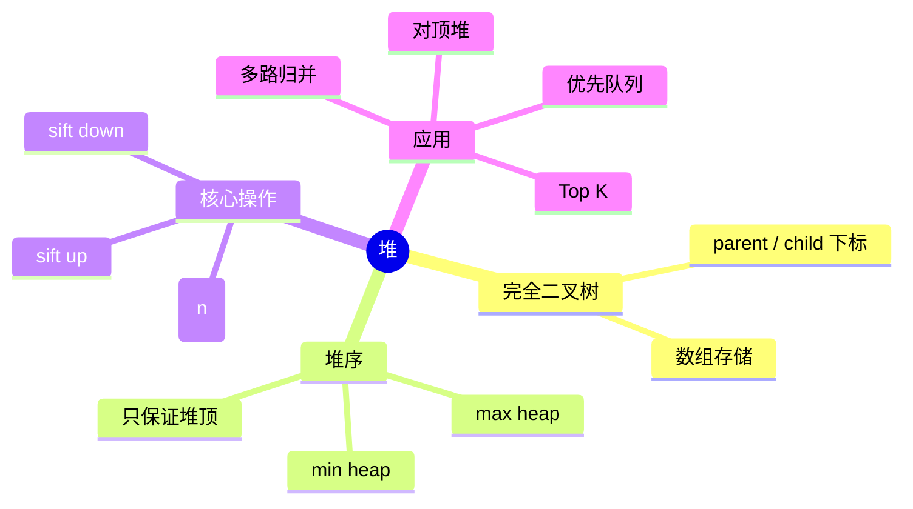

# 堆

## 本节知识地图



## 接口契约

堆不是“完全有序数组”，只保证父节点与子节点之间的堆序；因此只能稳定地提供堆顶极值。

| 操作 | 结果 | 空堆行为 | 复杂度 |
|---|---|---|---:|
| `peek()` | 查看最小/最大值 | `IndexError` 或 None | O(1) |
| `push(x)` | 插入元素并恢复堆序 | 无 | O(log n) |
| `pop()` | 删除并返回堆顶 | `IndexError` | O(log n) |
| `heapify(values)` | 原地建堆 | 空列表合法 | O(n) |
| `replace(x)` | 弹出堆顶并插入 x | 需非空 | O(log n) |
| `len(heap)` | 有效元素数量 | 0 | O(1) |

### 堆的前置条件

- 元素必须可比较，或提供统一的 key/优先级。
- 元组优先队列中，优先级相同时后续字段也必须可比较；否则加递增 counter。
- `heap[0]` 只表示极值，不表示剩余元素已排序。
- `heapq` 是最小堆；最大堆通常通过 key 取反或包装比较器实现。

## 什么是堆

堆（Heap）是一种特殊的**完全二叉树**，满足两个性质：

1. **结构性质**：除最后一层外每层都填满，最后一层从左到右连续填充。
2. **堆序性质**：每个节点的值满足与其子节点之间的大小关系。

- **最小堆（Min-Heap）**：父节点 ≤ 子节点，堆顶是最小元素。
- **最大堆（Max-Heap）**：父节点 ≥ 子节点，堆顶是最大元素。

完全二叉树可用数组紧凑存储：父节点 `(i-1)//2`，左子 `2*i+1`，右子 `2*i+2`。

### 核心操作与时间复杂度

| 操作 | 时间复杂度 | 说明 |
|------|-----------|------|
| 查看堆顶 | O(1) | 直接访问数组第一个元素 |
| 插入元素 | O(log n) | 添加到末尾，上浮调整 |
| 删除堆顶 | O(log n) | 堆顶与末尾交换，下沉调整 |
| 建堆 | O(n) | 自底向上调整，比逐个插入更快 |
| 获取前 K 个元素 | O(n log k) | 维护大小为 K 的堆 |

---

## Python heapq 模块

Python 标准库 `heapq` 提供了**最小堆**的实现，直接操作普通列表。

### `heapq` 的异常与副作用

| 调用 | 语义 |
|---|---|
| `heappop([])` | 抛 `IndexError` |
| `heap[0]`（空列表） | 抛 `IndexError` |
| `heapify(a)` | 原地修改 `a`，返回 `None` |
| `heappush(heap, x)` | 原地修改 heap，返回 `None` |
| `nlargest(k, iterable)` | 返回新列表，不修改原 iterable |

`heapq` 不封装 size、锁、重复值策略和业务错误；这些是调用者或更高层容器的责任。

## 用数组手写最小堆

### 1. 数组下标关系

对 0-based 数组：

```text
parent(i) = (i - 1) // 2
left(i)   = 2 * i + 1
right(i)  = 2 * i + 2
```

### 2. 堆序不变量

```text
heap[parent(i)] <= heap[i]
```

只要每次公开操作结束后维持这个不变量，`heap[0]` 就是最小值。

### 3. 完整实现

```python
class MinHeap:
    def __init__(self, values=()):
        self._data = list(values)
        self._heapify()

    def __len__(self):
        return len(self._data)

    def is_empty(self):
        return not self._data

    def peek(self):
        if not self._data:
            raise IndexError("peek from empty heap")
        return self._data[0]

    def push(self, value):
        self._data.append(value)
        self._sift_up(len(self._data) - 1)

    def pop(self):
        if not self._data:
            raise IndexError("pop from empty heap")
        self._data[0], last = self._data[-1], self._data[0]
        self._data.pop()
        if self._data:
            self._sift_down(0)
        return last

    def replace(self, value):
        if not self._data:
            raise IndexError("replace on empty heap")
        result = self._data[0]
        self._data[0] = value
        self._sift_down(0)
        return result

    def _heapify(self):
        for index in range(len(self._data) // 2 - 1, -1, -1):
            self._sift_down(index)

    def _sift_up(self, index):
        while index > 0:
            parent = (index - 1) // 2
            if self._data[parent] <= self._data[index]:
                break
            self._data[parent], self._data[index] = (
                self._data[index], self._data[parent]
            )
            index = parent

    def _sift_down(self, index):
        size = len(self._data)
        while True:
            smallest = index
            left = index * 2 + 1
            right = left + 1

            if left < size and self._data[left] < self._data[smallest]:
                smallest = left
            if right < size and self._data[right] < self._data[smallest]:
                smallest = right
            if smallest == index:
                return

            self._data[index], self._data[smallest] = (
                self._data[smallest], self._data[index]
            )
            index = smallest
```

### 手写实现的接口不变量

- `_data` 的长度就是堆 size。
- 根节点位于 `_data[0]`。
- 每个父节点都不大于两个子节点。
- `push` 先放末尾再上浮，`pop` 先把末尾移到根再下沉。
- `_heapify` 从最后一个非叶节点倒序处理。

### `heapify` 为什么比逐个 push 快

逐个 push 是：

```text
第 1 个元素 O(1)
第 2 个元素 O(log 2)
...
第 n 个元素 O(log n)
总计 O(n log n)
```

自底向上的 `heapify` 让大多数低层节点只下沉很短距离，总成本 O(n)。这是堆面试题中经常追问的复杂度差异。

### 删除任意位置

如果已经知道要删除的索引：

```python
def remove_at(heap, index):
    if not 0 <= index < len(heap):
        raise IndexError("heap index out of range")
    last = heap.pop()
    if index == len(heap):
        return
    heap[index] = last
    parent = (index - 1) // 2
    if index > 0 and heap[index] < heap[parent]:
        # 向上调整
        while index > 0:
            parent = (index - 1) // 2
            if heap[parent] <= heap[index]:
                break
            heap[parent], heap[index] = heap[index], heap[parent]
            index = parent
    else:
        # 向下调整
        size = len(heap)
        while True:
            child = index * 2 + 1
            if child >= size:
                break
            if child + 1 < size and heap[child + 1] < heap[child]:
                child += 1
            if heap[index] <= heap[child]:
                break
            heap[index], heap[child] = heap[child], heap[index]
            index = child
```

若只有 value 没有 index，先搜索 value 需要 O(n)，所以“堆支持任意删除 O(log n)”是不完整的说法。

### 更新优先级

更新一个元素可能变大也可能变小：

- 变小：向上调整。
- 变大：向下调整。

若需要按任务 ID 更新，通常维护：

```text
task_id -> heap index
```

每次交换元素时同步更新 index map，这就是 indexed heap；它把更新定位从 O(n) 降到 O(log n)，但实现复杂度更高。

### 自定义 key

Python `heapq` 比较元组，不接受类似 `sort(key=...)` 的直接 key 参数。通用包装方式：

```python
class Prioritized:
    def __init__(self, priority, value):
        self.priority = priority
        self.value = value

    def __lt__(self, other):
        return self.priority < other.priority
```

实际项目更常用 `(priority, counter, value)`，避免改写比较协议。

### 不稳定性

堆只保证优先级顺序，不保证同优先级元素的先后。若业务要求稳定 FIFO，必须显式加入 counter；不能依赖 Python 对象地址或字典顺序。

### 堆与排序的选择

| 需求 | 堆 | 排序 |
|---|---|---|
| 只要一个极值 | O(1) 取堆顶 | 先排序浪费 |
| 动态插入并持续取极值 | 合适 | 每次重排成本高 |
| 一次性求全部有序结果 | O(n log n) 反复 pop | 直接排序通常更简单 |
| Top K 且 K 很小 | O(n log k) | O(n log n) |
| 任意查找/删除 | 不擅长 | 也不擅长，考虑映射 |

### 4. 为什么建堆是 O(n)

不是对每个元素都调用 `push`。自底向上调整时：

- 叶子节点不需要下沉。
- 越靠近底部的节点高度越小。
- 高度为 h 的节点数量约为 `n / 2^(h+1)`。

总成本：

```text
n/4 × 1 + n/8 × 2 + n/16 × 3 + ...
= O(n)
```

### 5. `pop` 为什么要把末尾移到堆顶

删除堆顶后，若直接留下空洞，数组的完全二叉树结构被破坏。把最后一个元素移到根，再向下交换，可以同时恢复：

- 数组无空洞。
- 完全二叉树形状。
- 父子堆序。

### 6. 不支持任意删除的原因

堆只对堆顶提供直接定位。删除任意值前，通常要先 O(n) 找到它，再 O(log n) 调整；因此如果业务频繁按 key 删除，应考虑索引堆、惰性删除或其他结构。

### 7. 惰性删除

优先队列常把 `(priority, task_id, active)` 放入堆：

1. 更新任务时插入新版本。
2. 旧版本标记失效。
3. pop 时跳过失效项。

优点是更新简单；代价是堆中会积累垃圾，需要定期重建。

### 8. 稳定优先级队列

```python
import heapq
from itertools import count

counter = count()
heap = []

def push_task(priority, task):
    heapq.heappush(heap, (priority, next(counter), task))

def pop_task():
    if not heap:
        raise IndexError("pop from empty priority queue")
    priority, _, task = heapq.heappop(heap)
    return priority, task
```

## 堆排序

### 1. 思路

将数组建成堆，再不断取出堆顶：

```python
def heap_sort(values):
    heap = list(values)
    heapq.heapify(heap)
    return [heapq.heappop(heap) for _ in range(len(heap))]
```

这个版本使用 O(n) 额外空间。原地堆排序要在数组内建最大堆、交换根和末尾，再缩小有效区间：

```python
def heap_sort_in_place(values):
    def sift_down(start, end):
        root = start
        while 2 * root + 1 <= end:
            child = 2 * root + 1
            if child + 1 <= end and values[child] < values[child + 1]:
                child += 1
            if values[root] >= values[child]:
                return
            values[root], values[child] = values[child], values[root]
            root = child

    n = len(values)
    for start in range((n - 2) // 2, -1, -1):
        sift_down(start, n - 1)
    for end in range(n - 1, 0, -1):
        values[0], values[end] = values[end], values[0]
        sift_down(0, end - 1)
    return values
```

原地堆排序 O(n log n)、额外空间 O(1)，但通常不稳定，缓存和常数也可能不如 Timsort。

### 2. 什么时候不选堆排序

- Python 业务代码通常优先 `sorted`，可读性和稳定性更好。
- 需要稳定排序时不能默认使用堆排序。
- 只需 Top K 时维护大小 K 的堆更省成本。

## Top K 的两种策略

### 维护大小 K 的堆

遍历 n 个元素，堆始终不超过 K：

```text
时间 O(n log k)
空间 O(k)
```

适合 n 很大、不能保存全部排序结果。

### 全量排序

```text
时间 O(n log n)
空间依实现
```

适合需要完整有序结果或 K 接近 n。

### 频率题的 tie-break

题目常要求：

```text
频率降序，频率相同按字典序升序
```

堆中应显式编码优先级；不能只把 `(freq, word)` 放入最小堆后期待得到正确输出。

## 优先队列的生命周期

### 取消任务

`heapq` 没有高效任意删除。常见惰性删除：

```python
REMOVED = object()
counter = count()
heap = []
entry_finder = {}

def add_task(task, priority):
    if task in entry_finder:
        entry_finder[task][2] = REMOVED
    entry = [priority, next(counter), task]
    entry_finder[task] = entry
    heapq.heappush(heap, entry)

def pop_task():
    while heap:
        priority, _, task = heapq.heappop(heap)
        if task is not REMOVED:
            entry_finder.pop(task, None)
            return task
    raise KeyError("priority queue is empty")
```

这段代码的接口语义是“同一 task 只保留最新版本”，旧 entry 仍占堆空间，垃圾过多时要重建。

### 线程安全

`heapq` 的函数本身不提供并发保护。多个线程共享堆时必须：

- 用锁包围复合操作。
- 或使用 `queue.PriorityQueue`。

后者更安全，但每次操作包含同步成本，不应直接拿来和裸 `heapq` 比基准。

## 堆的验证函数

```python
def is_min_heap(values):
    for parent, value in enumerate(values):
        left = 2 * parent + 1
        right = left + 1
        if left < len(values) and value > values[left]:
            return False
        if right < len(values) and value > values[right]:
            return False
    return True
```

验证堆序不等于验证排序；例如 `[1, 5, 3, 8, 7, 4]` 可能是合法最小堆，但不是升序数组。

## 多路归并的接口

### 1. 为什么堆只放 K 个头

K 条有序序列中，下一次最小值只可能来自每条序列当前未取出的头部：

```text
list 1: 1, 7, 10
list 2: 2, 4, 12
list 3: 3, 8, 9
```

堆中只需保存 `(当前值, 序列编号, 位置)`：

```python
def merge_sorted_arrays(arrays):
    heap = []
    for array_id, array in enumerate(arrays):
        if array:
            heapq.heappush(heap, (array[0], array_id, 0))

    result = []
    while heap:
        value, array_id, index = heapq.heappop(heap)
        result.append(value)
        next_index = index + 1
        if next_index < len(arrays[array_id]):
            next_value = arrays[array_id][next_index]
            heapq.heappush(heap, (next_value, array_id, next_index))
    return result
```

若总元素数为 N、序列数为 K，时间 O(N log K)，空间 O(K)（不计结果）。

### 2. 元组 tie-break

`array_id` 不是算法数据，而是为了：

- 值相同时稳定比较。
- 避免比较不可排序的数组对象。
- 找回下一元素的来源。

类似原则适用于合并链表和优先级任务。

## 堆与其他极值结构

| 结构 | 取极值 | 插入 | 删除任意值 | 是否有序 |
|---|---:|---:|---:|---|
| 无序数组 | O(n) | O(1) | O(n) | 否 |
| 有序数组 | O(1) | O(n) | O(n) | 是 |
| 堆 | O(1) | O(log n) | O(n) 查找后 O(log n) | 只有局部序 |
| 平衡 BST | O(log n) | O(log n) | O(log n) | 是 |

若同时需要按 key 查找、按优先级取出和任意删除，单个堆往往不够，需要 HashMap + Heap 的组合。

## 堆的内部操作推演

### 上浮 sift-up

插入新值总是先放到数组末尾：

```text
[1, 4, 3, 8, 7, 2]
                 ^ 新值
```

若它小于父节点，就交换并继续向根移动：

```text
[1, 4, 2, 8, 7, 3]
[1, 3, 2, 8, 7, 4]
```

最多移动树高 h=O(log n) 层。

### 下沉 sift-down

删除根后把最后一个元素放到根，再与更小的孩子交换：

```text
[9, 4, 3, 8, 7] -> [3, 4, 9, 8, 7]
                 -> [3, 4, 7, 8, 9]
```

每层选择更小孩子，否则可能仍违反堆序。

### 为什么不能只和左孩子比较

若右孩子比左孩子更小，和左孩子交换后右侧仍可能比新父节点小。下沉必须在存在的孩子中选择极值。

## 优先队列的更新协议

### 版本号惰性删除

```python
class TaskQueue:
    def __init__(self):
        self.heap = []
        self.version = {}

    def push(self, task, priority):
        version = self.version.get(task, 0) + 1
        self.version[task] = version
        heapq.heappush(self.heap, (priority, version, task))

    def pop(self):
        while self.heap:
            priority, version, task = heapq.heappop(self.heap)
            if self.version.get(task) == version:
                del self.version[task]
                return task
        raise KeyError("empty task queue")
```

新版本覆盖旧版本的逻辑有效性，旧条目直到 pop 才物理清理。

### 更新复杂度

- 无索引：插入新条目 O(log n)，旧条目惰性失效。
- 有索引堆：定位 O(1)，调整 O(log n)，实现需要同步交换索引。
- 直接在数组中搜索：更新定位 O(n)。

## 堆的边界检查

```text
空堆 pop/peek
k=0、k>n、n=0
优先级相等且 payload 不可比较
重复值和重复任务
负数、浮点数和自定义对象比较
惰性删除垃圾条目过多
```

## 30 秒背诵

> 堆是用数组存储的完全二叉树，只保证父子堆序。push 末尾后 sift-up，pop 把末尾移到根后 sift-down，均为 O(log n)；自底向上 heapify 为 O(n)。它擅长动态取极值和 Top K，不擅长任意查找删除；优先级相同要加 counter，更新/取消可用索引堆或惰性删除。

## 堆的接口矩阵

| 需求 | 基础堆 | 需要的增强 |
|---|---|---|
| 查看极值 | `peek` | 无 |
| 动态插入 | `push` | 上浮 |
| 删除极值 | `pop` | 下沉 |
| 任意 key 更新 | 不直接支持 | index map |
| 取消任务 | 不直接支持 | 惰性删除/版本号 |
| 同优先级 FIFO | 不保证 | counter |
| 多线程共享 | 不安全 | 锁或 PriorityQueue |

“堆是有序的”只能理解为父子局部有序；要输出全序结果，应反复 pop 或直接排序，并写出 O(n log n) 成本。

## 堆接口边界测试

```python
heap = MinHeap([5, 1, 3, 1])
assert is_min_heap(heap._data)
assert heap.peek() == 1
assert heap.pop() == 1
heap.push(0)
assert heap.pop() == 0
assert heap.pop() == 1
assert heap.pop() == 3
assert heap.pop() == 5
try:
    heap.pop()
except IndexError:
    pass
else:
    raise AssertionError("empty heap should fail")
```

测试应同时验证输出顺序和每次公开操作后的堆序，不要只比较最终排序结果。

counter 保证同优先级任务按进入顺序比较，且不会比较不可排序的 task 对象。

### 基本操作

```python
import heapq

heap = []
heapq.heappush(heap, 5)
heapq.heappush(heap, 1)
heapq.heappush(heap, 3)
print(heap)             # [1, 5, 3]
print(heapq.heappop(heap))  # 1（弹出最小值）
print(heap[0])          # 3（查看堆顶）

nums = [4, 1, 7, 3, 8, 5]
heapq.heapify(nums)     # 原地建堆 O(n)
print(heapq.nsmallest(3, nums))  # [1, 3, 4]
print(heapq.nlargest(3, nums))   # [8, 7, 5]
```

> **提示**：`nsmallest`/`nlargest` 在 K 很小时效率高；K 接近 n 时直接排序更快。

### 实现最大堆

`heapq` 只支持最小堆。实现最大堆的经典技巧是**对值取反**：

```python
import heapq

max_heap = []
for val in [3, 1, 4, 1, 5, 9]:
    heapq.heappush(max_heap, -val)

print(-heapq.heappop(max_heap))  # 9（弹出最大值）
print(-max_heap[0])              # 5（查看当前最大值）
```

### 自定义排序

用**元组 `(priority, data)`** 实现优先级队列。`heapq` 会按元组的第一个元素排序：

```python
import heapq

tasks = []
heapq.heappush(tasks, (2, "写代码"))
heapq.heappush(tasks, (1, "修 Bug"))
heapq.heappush(tasks, (3, "开会"))

while tasks:
    priority, task = heapq.heappop(tasks)
    print(f"优先级 {priority}: {task}")  # 修Bug -> 写代码 -> 开会
```

> **注意**：优先级相同时 Python 会比较下一个元素。若元素不可比较，加递增计数器：`(priority, counter, data)`。

---

## 高频题型

### Top K 问题

Top K 是堆最经典的应用场景。核心思路：**维护一个大小为 K 的堆**。

#### LC 347 前 K 个高频元素

```python
from collections import Counter
import heapq

def topKFrequent(nums, k):
    count = Counter(nums)
    # 简洁写法
    return heapq.nlargest(k, count.keys(), key=count.get)

# 手动维护堆（面试更常考）
def topKFrequent_heap(nums, k):
    count = Counter(nums)
    heap = []
    for num, freq in count.items():
        heapq.heappush(heap, (freq, num))
        if len(heap) > k:
            heapq.heappop(heap)
    return [num for freq, num in heap]
```

#### LC 215 数组中的第 K 个最大元素

**思路**：维护一个大小为 K 的**最小堆**，遍历完成后堆顶就是第 K 大元素。

```python
def findKthLargest(nums, k):
    heap = []
    for num in nums:
        heapq.heappush(heap, num)
        if len(heap) > k:
            heapq.heappop(heap)
    return heap[0]
```

### 合并 K 个有序链表

#### LC 23 合并 K 个升序链表

**思路**：将每个链表头放入最小堆，每次弹出最小值，再将其 next 入堆。时间 O(N log K)。

```python
def mergeKLists(lists):
    heap = [(node.val, i, node) for i, node in enumerate(lists) if node]
    heapq.heapify(heap)
    dummy = curr = ListNode(0)
    while heap:
        val, i, node = heapq.heappop(heap)
        curr.next = node
        curr = curr.next
        if node.next:
            heapq.heappush(heap, (node.next.val, i, node.next))
    return dummy.next
```

> 元组中 `i` 用于打破值相同时的比较，避免 `ListNode` 之间无法比较。

### 数据流中位数

#### LC 295 数据流的中位数

**思路**：用两个堆维护数据流的左右两半：

- **大顶堆** `max_heap`：存较小的一半（取反模拟）
- **小顶堆** `min_heap`：存较大的一半

始终保持 `len(max_heap) == len(min_heap)` 或 `len(max_heap) == len(min_heap) + 1`。

```python
class MedianFinder:
    def __init__(self):
        self.small = []  # 大顶堆（取反）
        self.large = []  # 小顶堆

    def addNum(self, num):
        heapq.heappush(self.small, -num)
        heapq.heappush(self.large, -heapq.heappop(self.small))
        if len(self.large) > len(self.small):
            heapq.heappush(self.small, -heapq.heappop(self.large))

    def findMedian(self):
        if not self.small and not self.large:
            raise IndexError("median of empty stream")
        if len(self.small) > len(self.large):
            return -self.small[0]
        return (-self.small[0] + self.large[0]) / 2
```

### 滑动窗口最大值

#### LC 239 滑动窗口最大值

**思路**：用最大堆存储 `(-nums[i], i)`，每次取堆顶时检查索引是否在窗口内，不在则弹出。时间复杂度 O(n log n)。

```python
def maxSlidingWindow(nums, k):
    heap = []
    result = []
    for i in range(len(nums)):
        heapq.heappush(heap, (-nums[i], i))
        if i >= k - 1:
            while heap[0][1] <= i - k:
                heapq.heappop(heap)
            result.append(-heap[0][0])
    return result
```

> **补充**：此题最优解是单调队列 O(n)，但堆解法更通用，面试中两种都应掌握。

## 边界测试清单

```text
空堆 peek/pop/replace
单元素 push/pop
重复优先级和不可比较 payload
heapify 空列表和已排序列表
第 K 大的 k=1、k=n、非法 k
MedianFinder 空数据和偶数/奇数个数据
滑动窗口 k=1、k=len(nums)、k=0
惰性删除后堆中垃圾项
任意删除根、叶子和中间节点
```

## 面试表达：堆的实现

### Q1：堆为什么用数组

> 堆是完全二叉树，按层序存入数组后不需要显式指针。0-based 下父节点是 `(i-1)//2`，左右孩子是 `2i+1` 和 `2i+2`，连续内存也有更好的缓存局部性。

### Q2：建堆为什么是 O(n)

> 自底向上只对非叶子节点下沉，底层节点数量多但高度小，高层节点少但高度大，按高度求和是 O(n)。逐个插入则每次可能上浮 log n，总成本 O(n log n)。

### Q3：堆为什么不支持快速查任意值

> 堆只保证父子局部顺序，非堆顶节点之间没有全局排序。查找任意值最坏需要扫描 O(n)；知道索引后删除/更新才可 O(log n) 调整。

### Q4：优先级相同为什么要 counter

> Python 比较元组时会继续比较后续字段，payload 可能不可比较；而且业务可能要求同优先级 FIFO。加入递增 counter 同时解决可比较性和稳定性。

---

## 经典题目

### Medium

| 题号 | 题目 | 关键思路 |
|------|------|---------|
| [215](https://leetcode.com/problems/kth-largest-element-in-an-array/) | 数组中的第 K 个最大元素 | 大小为 K 的最小堆 |
| [347](https://leetcode.com/problems/top-k-frequent-elements/) | 前 K 个高频元素 | 频率统计 + 堆 |
| [692](https://leetcode.com/problems/top-k-frequent-words/) | 前 K 个高频单词 | 自定义排序的堆 |
| [378](https://leetcode.com/problems/kth-smallest-element-in-a-sorted-matrix/) | 有序矩阵中第 K 小的元素 | 多路归并 + 堆 |

### Hard

| 题号 | 题目 | 关键思路 |
|------|------|---------|
| [23](https://leetcode.com/problems/merge-k-sorted-lists/) | 合并 K 个升序链表 | 堆维护 K 个链表头 |
| [295](https://leetcode.com/problems/find-median-from-data-stream/) | 数据流的中位数 | 对顶堆（大顶堆 + 小顶堆） |
| [239](https://leetcode.com/problems/sliding-window-maximum/) | 滑动窗口最大值 | 最大堆 / 单调队列 |
| [632](https://leetcode.com/problems/smallest-range-covering-elements-from-k-lists/) | 最小区间 | 堆 + 滑动窗口 |

---

## 学习建议

1. **堆是面试高频数据结构**：几乎所有涉及"第 K 大/小"、"前 K 个"、"合并多路有序序列"的题目都可以用堆解决。
2. **熟练掌握 `heapq` API**：`heappush`、`heappop`、`heapify`、`nlargest`、`nsmallest` 是基础工具。
3. **Top K 是必考题型**：LC 215 和 LC 347 建议多写几遍，做到闭眼能写。
4. **理解取反技巧**：Python 没有内置最大堆，取反是万能方案。
5. **对顶堆是进阶技巧**：LC 295 的大顶堆 + 小顶堆模式在很多变体题中都会用到。

---

## 堆接口自测与面试复盘

### 堆序检查

```python
def validate_min_heap(heap):
    for index, value in enumerate(heap):
        left = 2 * index + 1
        right = left + 1
        if left < len(heap):
            assert value <= heap[left]
        if right < len(heap):
            assert value <= heap[right]
```

### 操作边界

1. 空堆 `peek/pop` 是否抛异常。
2. `heapify([])` 是否允许。
3. 优先级相同的 payload 是否可比较。
4. Top K 中 k=0、k=n、k>n 如何处理。
5. 惰性删除的垃圾条目何时清理。

### 最小口述

> 堆是完全二叉树的数组表示，只维护父子堆序。插入末尾后上浮，删除堆顶后末尾补根再下沉，都是 O(log n)；自底向上建堆是 O(n)。堆适合动态取极值、Top K 和多路归并，但任意查找/删除需要额外索引或退化为 O(n)。

## 小结

堆的本质是一棵用数组存储的完全二叉树，核心价值在于**高效获取极值**。在 Python 中，`heapq` 模块提供了简洁的最小堆操作，配合取反技巧和元组排序即可应对绝大多数面试场景。掌握 Top K、多路归并、对顶堆三种模式，堆相关的题目就不再是难点。

## 堆终局：接口与不变量

```text
数组形状：完全二叉树
堆序：父节点 <= 或 >= 子节点
极值：只保证堆顶
push：末尾加入后上浮
pop：末尾补根后下沉
heapify：自底向上 O(n)
任意 key：需要索引或惰性删除
同优先级：需要 counter
空堆：必须定义异常或返回值
```

只要业务需要全局有序、任意查找和任意删除，单个堆就不是完整答案。

## 堆的手写验收：下标与方向

### 下标公式必须统一

0-based 数组中，节点 `i` 的父节点是 `(i - 1) // 2`，左孩子是 `2*i + 1`，右孩子是 `2*i + 2`。1-based 写法虽然能少一次加法，但不能和 0-based 代码混用；混用会表现为某些小样例通过、大样例堆序被破坏。

### 上浮与下沉的终止条件

- 上浮：只要当前节点优于父节点就交换；到根或父节点已经满足堆序时停止。
- 下沉：先选两个孩子中更优的那个，再与当前节点比较；没有更优孩子时停止。
- 删除任意位置：用最后一个元素覆盖空洞，然后根据它与父节点的关系选择上浮或下沉，不能固定只做一种。

### `heapify` 的 O(n) 解释

从最后一个非叶节点向前下沉。底层节点数量最多但高度很小，顶部节点数量少但高度较大，所有节点的“高度总和”是线性的，因此建堆是 O(n)，不是把 n 次 push 简单相加成 O(n log n)。

### 优先队列的稳定性

业务 payload 可能不可比较，且同优先级时常要求先进先出。把条目编码为 `(priority, sequence, payload)`：先按优先级，再按递增序号比较，payload 永远不会被拿来比较。序号溢出或多线程生成时，要明确是否使用单调原子计数器。

### 堆结构测试矩阵

```text
[]、[x]
重复优先级和不可比较 payload
连续 push 后逐个 pop 是否有序
heapify 与逐个 push 的结果是否一致
remove_at(0)、remove_at(last)、越界
update 后向上和向下两种方向
Top K 的 k=0、k=1、k>=n
多路归并中的空迭代器
```

验收时不要只检查堆顶；应遍历所有父子下标验证堆序，并把 pop 序列与 `sorted` 结果对比。

### 复杂度口述的边界

`peek` 只读根节点，所以是 O(1)；`push`、`pop` 和已知下标的 `update` 是 O(log n)；`remove(value)` 若没有索引表，必须线性查找，成本 O(n)。`heapify` 是 O(n)，但复制输入数组的空间是否计入，要根据接口是原地还是返回副本来说明。

### 为什么堆不是排序数组

堆只保证父子局部有序，兄弟子树之间没有顺序。因此它能快速取最小值，却不能 O(1) 判断任意值是否存在，也不能按下标得到全局第 k 小。需要完整有序遍历时，应使用排序数组、平衡树或直接排序；需要动态极值时才选堆。

面试复述可以落到一句话：堆优化的是“取极值”，不是所有查询；任何额外能力都要靠索引表、计数器或惰性删除补上。

写比较器时先统一“更优”的方向：最小堆用小值上浮，最大堆用大值上浮；不要在 push 和 pop 中各写一套相反条件。

这条方向约定也适用于 Top K 和双堆中位数，先定义堆顶代表什么，再决定比较符号。

堆的验收器可以只依赖下标公式，不依赖 push/pop 实现本身；这样才能避免“用同一个错误验证另一个错误”。

```text
for i in range((n - 2) // 2 + 1):
    check(parent(i), left(i))
    check(parent(i), right(i))
```

叶子节点无需下沉，最后一个非叶节点是 `(n - 2) // 2`；空堆和单元素堆要避免负下标误判。

验证 pop 序列时，允许相同优先级的 payload 顺序按计数器确定，但不能拿不可比较对象直接做二次比较。

### 从数组手算建堆

```text
给定 [9, 4, 7, 1, 0, 3]
最后非叶节点 i=(n-2)//2=2
先下沉 7，再下沉 4，再下沉 9
每次只和更优孩子交换
最终逐个 pop 得到非降序序列
```

建堆过程中不能从根向下逐个插入，那是 O(n log n)；自底向上的顺序才利用了叶子已经天然成堆这一事实。

```text
父子关系决定堆序
数组位置决定完全树形
删除后必须恢复两者
```

---

[← 返回数据结构](../index.html) | [上一篇：树与二叉树](../05-binary-tree/index.html) | [下一篇：图 →](../07-graph/index.html)
