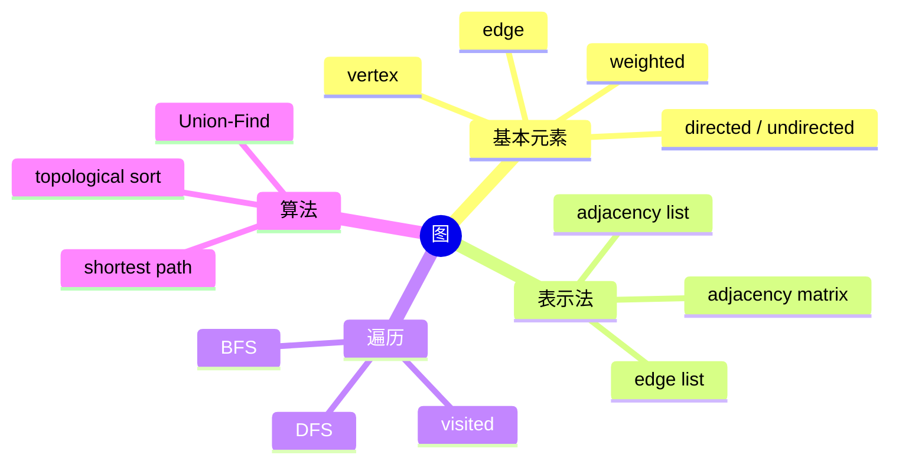

# 图：描述任意关系

## 本节知识地图



链表和树都可以看成受限制的图。图由**顶点（vertex）**和连接顶点的**边（edge）**组成，适合表示道路、社交关系、依赖、网络和网格连通性。

## 接口契约

本章默认节点是可哈希对象，允许自环，不允许平行边；重复加入同一条边会覆盖旧权重。题目若允许平行边，应使用邻接表列表而不是邻接矩阵或邻接字典。

| 操作 | 结果 | 平均复杂度 | 边界 |
|---|---|---:|---|
| `add_vertex(u)` | 添加孤立节点 | O(1) | 已存在时不重复添加 |
| `add_edge(u, v, w)` | 添加有向/无向边 | O(1) | 重复边按策略覆盖或拒绝 |
| `remove_edge(u, v)` | 删除边 | O(1) | 不存在返回 False |
| `has_edge(u, v)` | 是否直接相连 | O(1) | 不代表可达 |
| `neighbors(u)` | 枚举邻居 | O(deg(u)) | 不存在节点抛 `KeyError` |
| `degree(u)` | 出度/无向度 | O(1) | 入度需要单独维护 |
| `bfs/dfs(start)` | 遍历可达节点 | O(V+E) | 不自动覆盖其他分量 |

### 结构前置条件

- 先约定节点编号是 0-based 还是 1-based。
- 有向边 `u -> v` 不自动意味着 `v -> u`。
- 无向边要在邻接表中写入两个方向。
- `weight=0` 可能是合法权重，不能用真假判断是否有边。
- 自环会影响度数、环检测和拓扑排序。
- `V` 是顶点数，`E` 是边数，`deg(u)` 是 u 的邻居数量。

## 基本术语

- **无向图**：边没有方向，`u-v` 可以双向到达。
- **有向图**：边有方向，`u -> v` 不代表 `v -> u`。
- **带权图**：每条边带距离、费用或时间。
- **度**：无向图中与节点相连的边数。
- **入度/出度**：有向图中进入/离开节点的边数。
- **路径**：沿边经过的一串节点。
- **环**：从某节点出发能回到自己。
- **连通分量**：无向图中互相可达的一组节点。

题目中的节点编号可能从 0 开始，也可能从 1 开始。构图前先确认编号范围。

## 三种表示方式

假设无向边为 `(1,2)、(1,3)、(2,4)`。

### 边列表

```python
edges = [(1, 2), (1, 3), (2, 4)]
```

适合 Kruskal 最小生成树或只需逐条处理边的场景。查询某节点邻居需要扫描所有边。

### 邻接矩阵

```python
n = 4
matrix = [[False] * (n + 1) for _ in range(n + 1)]

for u, v in edges:
    matrix[u][v] = True
    matrix[v][u] = True
```

- 空间 O(n²)。
- 判断 `u` 与 `v` 是否直接相连是 O(1)。
- 适合节点很少、边很密的图。

### 邻接表

```python
n = 4
graph = [[] for _ in range(n + 1)]

for u, v in edges:
    graph[u].append(v)
    graph[v].append(u)       # 无向图必须加反向边
```

- 空间 O(n + m)。
- 遍历所有邻居总成本 O(n + m)。
- 竞赛中最常用。

也可以用字典：

```python
from collections import defaultdict

graph = defaultdict(list)
for u, v in edges:
    graph[u].append(v)
    graph[v].append(u)
```

节点是连续整数时，列表更快也更容易控制范围；节点是字符串或稀疏编号时，字典更方便。

### 可复用的邻接表类

算法题常用裸列表追求速度；工程代码可以封装方向、权重和删除语义：

```python
class AdjacencyListGraph:
    def __init__(self, directed=False):
        self.directed = directed
        self._adj = {}  # vertex -> {neighbor: weight}

    def add_vertex(self, vertex):
        self._adj.setdefault(vertex, {})

    def add_edge(self, source, target, weight=None):
        self.add_vertex(source)
        self.add_vertex(target)
        self._adj[source][target] = weight
        if not self.directed:
            self._adj[target][source] = weight

    def remove_edge(self, source, target):
        if source not in self._adj or target not in self._adj[source]:
            return False
        del self._adj[source][target]
        if not self.directed:
            self._adj[target].pop(source, None)
        return True

    def has_edge(self, source, target):
        return source in self._adj and target in self._adj[source]

    def neighbors(self, vertex):
        if vertex not in self._adj:
            raise KeyError(vertex)
        return self._adj[vertex].items()

    def degree(self, vertex):
        if vertex not in self._adj:
            raise KeyError(vertex)
        return len(self._adj[vertex])

    def vertices(self):
        return self._adj.keys()

    def __len__(self):
        return len(self._adj)
```

这个版本约定：

- 无向图删除一条边时，同时删除反向边。
- 重复边覆盖旧权重；需要拒绝时应先检查 `has_edge`。
- `None` 表示无权图的边；`0` 可以是合法权重。
- `neighbors` 返回 `(neighbor, weight)` 对。
- 该类不自动保证连通、不计算最短路，也不替调用者管理 visited。

### 三种表示的接口取舍

| 表示 | `has_edge` | `neighbors` | 删除边 | 适合 |
|---|---:|---:|---:|---|
| 边列表 | O(E) | O(E) | O(E) | 保留平行边、按权排序 |
| 邻接矩阵 | O(1) | O(V) | O(1) | 小而稠密的图 |
| 邻接表列表 | O(deg) | O(deg) | O(deg) | 大多数稀疏图 |
| 邻接表字典 | 平均 O(1) | O(deg) | 平均 O(1) | 动态增删和稀疏节点 |

## 有向图与入度

```python
n = 4
graph = [[] for _ in range(n)]
indegree = [0] * n

for source, target in directed_edges:
    graph[source].append(target)
    indegree[target] += 1
```

入度为 0 的节点没有前置依赖，是拓扑排序的起点。

## 带权图

输入边 `u v weight`：

```python
graph = [[] for _ in range(n + 1)]

for u, v, weight in weighted_edges:
    graph[u].append((v, weight))
    graph[v].append((u, weight))

for neighbor, weight in graph[current]:
    new_distance = distance[current] + weight
```

元组顺序要统一。推荐始终使用 `(neighbor, weight)`。

权重接口还要明确：

- 允许负权还是只允许非负权。
- `None`、`0`、`INF` 分别代表什么。
- 无向图的两个方向是否必须权重相同。
- 重复边保留全部权重，还是只保留最小权重。
- 浮点权重比较是否需要容差。

## 图的遍历

### DFS

```python
def dfs(start, graph):
    visited = set()
    stack = [start]

    while stack:
        node = stack.pop()
        if node in visited:
            continue
        visited.add(node)

        for neighbor in graph[node]:
            if neighbor not in visited:
                stack.append(neighbor)

    return visited
```

### BFS

```python
from collections import deque

def bfs(start, graph):
    visited = {start}
    queue = deque([start])
    order = []

    while queue:
        node = queue.popleft()
        order.append(node)

        for neighbor in graph[node]:
            if neighbor not in visited:
                visited.add(neighbor)       # 入队时标记
                queue.append(neighbor)

    return order
```

BFS 应在入队时标记，否则同一节点可能被重复加入很多次。

### BFS 求无权最短距离

```python
from collections import deque

def shortest_distance(start, graph):
    distance = {start: 0}
    parent = {start: None}
    queue = deque([start])

    while queue:
        node = queue.popleft()
        for neighbor in graph[node]:
            if neighbor in distance:
                continue
            distance[neighbor] = distance[node] + 1
            parent[neighbor] = node
            queue.append(neighbor)
    return distance, parent

def restore_path(parent, start, target):
    if target not in parent:
        return None
    path = []
    while target is not None:
        path.append(target)
        target = parent[target]
    path.reverse()
    return path if path[0] == start else None
```

BFS 首次访问节点时得到最少边数，但这段代码只适用于无权图或所有边权相同。不可达节点不出现在 `distance`，调用者也可以统一转成 `INF`。

### 有向图拓扑排序

拓扑排序只对 DAG（Directed Acyclic Graph，有向无环图）有完整结果：

```python
from collections import deque

def topological_order(graph, indegree):
    indegree = indegree[:]  # 不污染调用方
    queue = deque(
        node for node, degree in enumerate(indegree)
        if degree == 0
    )
    order = []

    while queue:
        node = queue.popleft()
        order.append(node)
        for neighbor in graph[node]:
            indegree[neighbor] -= 1
            if indegree[neighbor] == 0:
                queue.append(neighbor)

    return order if len(order) == len(graph) else None
```

返回 `None` 表示存在环。拓扑序通常不唯一；若要求字典序，应把零入度节点放进小根堆。

### 带权图的算法前置条件

| 算法 | 权重要求 | 典型用途 |
|---|---|---|
| BFS | 无权/等权 | 最少边数 |
| Dijkstra | 非负权 | 单源最短路 |
| Bellman-Ford | 可有负权，可检测负环 | 单源最短路 |
| Floyd-Warshall | 全源，不能有负环 | 所有点对最短路 |

“图有权”还不足以决定算法；负权边、负环和是否需要全源结果都要先问清楚。

### Dijkstra 的邻接表接口

当权重非负时，邻接表中的 `(neighbor, weight)` 可以接入最短路：

```python
import heapq

def dijkstra(start, graph):
    distance = {start: 0}
    parent = {start: None}
    heap = [(0, start)]

    while heap:
        current_distance, node = heapq.heappop(heap)
        if current_distance != distance[node]:
            continue  # 跳过旧的惰性条目

        for neighbor, weight in graph[node]:
            if weight < 0:
                raise ValueError("Dijkstra requires non-negative weights")
            candidate = current_distance + weight
            if candidate < distance.get(neighbor, float("inf")):
                distance[neighbor] = candidate
                parent[neighbor] = node
                heapq.heappush(heap, (candidate, neighbor))
    return distance, parent
```

这里没有 decrease-key，而是把新距离再次压入堆；弹出时通过旧距离检查跳过过期条目。不可达节点不出现在 `distance`，路径可通过 `parent` 恢复。

### 有向图的强弱连通

- 无向图连通：任意两点互相可达。
- 有向图弱连通：忽略方向后连通。
- 有向图强连通：任意两点按方向互相可达。

单源 DFS/BFS 不能直接回答强连通分量，需要 Kosaraju 或 Tarjan 等算法。

### 图的输入规模选型

```text
V 小且边密集 -> 邻接矩阵
E 远小于 V^2 -> 邻接表
边要排序或离线处理 -> 边列表
节点编号稀疏/动态 -> 字典邻接表
```

## 网格图的完整接口

网格题通常不显式创建边，而是提供一个邻居生成器：

```python
def valid_neighbors(row, col, grid):
    rows, cols = len(grid), len(grid[0])
    for dr, dc in [(-1, 0), (1, 0), (0, -1), (0, 1)]:
        nr, nc = row + dr, col + dc
        if 0 <= nr < rows and 0 <= nc < cols:
            if grid[nr][nc] != "#":
                yield nr, nc
```

接口前提：

- grid 不能为空，且每行长度一致。
- `#` 是否代表障碍要由题面定义。
- 坐标 `(row, col)` 是否可重复访问由 visited 决定。
- 对角线是否算邻居必须显式加入方向数组。

### 网格 BFS

```python
from collections import deque

def grid_distance(grid, start, target):
    if not grid or not grid[0]:
        return None
    queue = deque([(start[0], start[1], 0)])
    visited = {start}
    while queue:
        row, col, distance = queue.popleft()
        if (row, col) == target:
            return distance
        for neighbor in valid_neighbors(row, col, grid):
            if neighbor not in visited:
                visited.add(neighbor)
                queue.append((*neighbor, distance + 1))
    return None
```

这里返回 `None` 表示不可达，返回 0 表示起点就是目标；不要用 `-1` 与合法距离混淆，除非题面规定。

## 图接口的状态一致性

如果容器同时维护：

```text
adjacency
edge_count
indegree
components
```

每次 `add_edge/remove_edge` 都必须明确哪些字段更新。最稳妥的做法是：

- 只保存基础邻接关系。
- 派生信息按需计算。
- 或封装所有修改入口，禁止调用者直接改 `_adj`。

暴露裸邻接列表后，调用者可以绕过 `add_edge`，导致 edge_count 和实际边数不一致。

## 图实现自测

```python
graph = AdjacencyListGraph(directed=False)
graph.add_edge("a", "b", 0)
graph.add_edge("b", "c", 2)
assert graph.has_edge("a", "b")
assert graph.has_edge("b", "a")
assert graph.degree("b") == 2
assert graph.remove_edge("a", "b")
assert not graph.has_edge("a", "b")
assert not graph.remove_edge("a", "b")
```

这个测试专门覆盖无向反向边、零权边和重复删除。

## 图面试追问

### Q5：为什么图的遍历顺序不稳定

> DFS/BFS 只保证符合各自的搜索规则，具体同层/同节点先访问哪个邻居取决于邻接容器顺序。若题目要求字典序或最小编号，需要显式排序或使用堆；不能依赖 set 的遍历。

### Q6：什么时候用 Union-Find 而不是 BFS

> 若边只不断加入、反复询问是否同组，Union-Find 可把每次连通查询降到近似常数；若需要具体路径、距离、删除边或遍历顺序，仍应使用 DFS/BFS 或动态图结构。

## 多重图、带标签图与反向边

### 多重图

允许同一对节点有多条边时，字典会覆盖数据：

```python
graph[u][v] = weight
```

应改成：

```python
graph[u].append((v, weight, edge_id))
```

删除接口也要明确是删除：

- 任意一条。
- 指定 edge_id。
- 最小/最大权重边。
- 所有平行边。

### 反向图

有向图常需要同时建立 reverse graph：

```python
reverse = [[] for _ in range(n)]
for source in range(n):
    for target in graph[source]:
        reverse[target].append(source)
```

反向图不是把原图变量原地翻转，否则会破坏后续仍需要原方向的算法。

### 带标签边

状态机、依赖图和网络拓扑可能需要：

```python
graph[u].append((v, label, cost))
```

元组字段顺序必须固定，最好定义轻量数据类，避免调用方记忆位置。

## 图的空间估算

若 V=100000、E=200000：

- 邻接矩阵需要约 10^10 个单元，不可接受。
- 邻接表只保存约 2E 条无向方向记录。
- Python 对象和 tuple 还有额外开销，实际内存大于数学 O(V+E)。

因此大型 ACM 图还要考虑：

- 使用整数数组而非大量对象。
- CSR/压缩邻接表。
- 预分配边数组。
- 输入后立即转换，避免同时保留多份边列表。

## 图接口最终测试

```python
graph = AdjacencyListGraph(directed=True)
graph.add_edge("a", "b", 0)
graph.add_edge("b", "c", 2)
assert graph.has_edge("a", "b")
assert not graph.has_edge("b", "a")
assert graph.degree("b") == 1
assert list(graph.neighbors("a")) == [("b", 0)]
assert graph.remove_edge("a", "b")
assert not graph.remove_edge("a", "b")
```

测试同时覆盖方向、零权、邻居返回格式和重复删除。

### 递归 DFS 与显式栈

| 方式 | 优点 | 风险 |
|---|---|---|
| 递归 DFS | 贴近定义，代码短 | 深图可能超过 Python 递归限制 |
| 显式栈 DFS | 不依赖递归深度 | 要自己定义入栈顺序 |
| BFS | 无权最短路自然 | 队列可能保存一层大量节点 |

### DFS/BFS 的返回契约

- `visited` 表示可达集合，不等于访问顺序。
- DFS 迭代版顺序受邻接表插入顺序影响。
- BFS 顺序也受邻居排列影响；题目要求字典序时要显式排序。
- 从一个起点搜索不会自动覆盖其他分量。
- 图含环时必须有 visited，否则可能无限循环。

### BFS 求无权最短距离

```python
from collections import deque

def shortest_distance(start, graph):
    distance = {start: 0}
    queue = deque([start])

    while queue:
        node = queue.popleft()
        for neighbor in graph[node]:
            if neighbor in distance:
                continue
            distance[neighbor] = distance[node] + 1
            queue.append(neighbor)
    return distance
```

接口约定：

- 不可达节点不出现在返回字典，或由调用者转成 `INF`。
- 这段代码只计算最少边数；带权图不能直接用 BFS 求最小代价。
- 要恢复路径，还需保存 `parent[neighbor] = node`。

```python
def restore_path(parent, start, target):
    if target != start and target not in parent:
        return None
    path = []
    current = target
    while current != start:
        path.append(current)
        current = parent[current]
    path.append(start)
    path.reverse()
    return path
```

`None` 表示不可达；起点到自身的路径可以返回 `[start]`，这和空列表语义不同。

### 有向图拓扑排序

拓扑排序只对 DAG（Directed Acyclic Graph，有向无环图）有完整结果：

```python
from collections import deque

def topological_order(graph, indegree):
    indegree = indegree[:]  # 不污染调用方的原始入度
    queue = deque(node for node, degree in enumerate(indegree) if degree == 0)
    order = []

    while queue:
        node = queue.popleft()
        order.append(node)
        for neighbor in graph[node]:
            indegree[neighbor] -= 1
            if indegree[neighbor] == 0:
                queue.append(neighbor)

    return order if len(order) == len(graph) else None
```

返回 `None` 表示存在环，返回列表表示找到一个拓扑序；拓扑序通常不唯一。若要求字典序，应将零入度节点放入小根堆。

### 带权图的算法边界

| 算法 | 权重要求 | 典型复杂度 |
|---|---|---:|
| BFS | 无权或所有边权相同 | O(V+E) |
| Dijkstra | 非负权 | 依堆和表示而定 |
| Bellman-Ford | 可有负权，可检测负环 | O(VE) |
| Floyd-Warshall | 全源，能处理负边但不能有负环 | O(V^3) |

“图是带权图”还不足以决定算法，必须继续确认权重是否允许负数。

### 递归 DFS 与显式栈 DFS

| 方式 | 优点 | 风险 |
|---|---|---|
| 递归 DFS | 接近定义，代码短 | 深图可能超过 Python 递归限制 |
| 显式栈 DFS | 不依赖递归深度 | 要自己管理入栈时机 |
| BFS | 无权最短路自然 | 队列可能保存大量节点 |

入度是进入节点的边数，不是邻接表长度；邻接表通常保存出边。要 O(1) 查询入度，必须在增删边时同步维护 `indegree`。

## 连通分量

```python
def count_components(n, graph):
    visited = [False] * n
    components = 0

    for start in range(n):
        if visited[start]:
            continue
        components += 1
        stack = [start]
        visited[start] = True

        while stack:
            node = stack.pop()
            for neighbor in graph[node]:
                if not visited[neighbor]:
                    visited[neighbor] = True
                    stack.append(neighbor)

    return components
```

外层循环负责找到每个尚未访问的新起点；每启动一次搜索，就发现一个连通分量。

## 网格也是图

`(row, col)` 是节点，上下左右相邻格子是边。通常不显式构建邻接表，而是在遍历时计算邻居：

```python
directions = [(-1, 0), (1, 0), (0, -1), (0, 1)]

for dr, dc in directions:
    next_row = row + dr
    next_col = col + dc
    if 0 <= next_row < rows and 0 <= next_col < cols:
        ...
```

## 表示方式对比

| 表示 | 空间 | 判断直接相连 | 遍历邻居 | 适合 |
|------|------|--------------|----------|------|
| 边列表 | O(m) | O(m) | O(m) | 按边排序、批处理 |
| 邻接矩阵 | O(n²) | O(1) | O(n) | 稠密小图 |
| 邻接表 | O(n+m) | O(deg(u)) | O(deg(u)) | 大多数稀疏图 |

## 常见错误

- 无向图只加入一条方向，导致一半路径不可达。
- 1-based 节点却只创建长度 n 的数组。
- 在出队时才标记 BFS 节点，造成重复入队。
- 忘记图可能不连通，只从节点 0 搜一次。
- 带权图把元组顺序写乱。
- 无向图 DFS 只判断父节点却忽略其他已访问节点，无法正确检测复杂环。
- 用 `if weight` 判断边是否存在，导致权重为 0 的边被忽略。
- 邻接矩阵用 `0` 表示无边，却又允许合法的零权边。
- 修改邻接表后忘记同步入度、边数或无向反向边。
- 需要字典序时直接依赖 set/dict 的遍历顺序。

## 面试表达：图的实现

### Q1：邻接表为什么常用

> 邻接表为每个节点保存实际邻居，空间 O(V+E)，遍历所有边 O(V+E)，适合稀疏图。判断一条边通常是 O(deg(u))；如果需要动态查边，可把邻居改成集合或字典，以平均 O(1) 换取额外空间。

### Q2：直接相连、可达、最短路有什么区别

> `has_edge(u, v)` 只检查一条边；可达需要 DFS/BFS 扩展多条边；最短路还要根据边权选择算法。邻接矩阵能 O(1) 检查直接边，但不能因此把可达性也写成 O(1)。

### Q3：拓扑排序为什么可能没有结果

> Kahn 算法最终输出节点数小于 V，说明图中存在环，或者入度数组与边表不一致。拓扑序可能有多个，普通队列只保证任意一个，不保证字典序。

### Q4：图构造中 0 权边为什么危险

> 0 可能是合法权重，不能用 `if weight` 判断有无边；矩阵还要区分 0、-1、INF 或 None 的无边标记。边存在性和边权是两个字段语义。

---

## 边界测试清单

```text
空图、单节点图、孤立节点
无向边是否双向可达
有向边是否错误加入反向边
重复边、自环、零权边
节点编号从 0/1 开始
不连通图从单个起点遍历
图中存在环
拓扑序是否唯一、是否要求字典序
邻居排序是否影响题目输出
```

## 图的接口复盘

```text
顶点：节点身份
边：关系和方向
权重：关系代价，不等于边存在性
邻接表：按邻居组织，适合稀疏图
矩阵：按点对组织，适合直接查边
DFS/BFS：回答可达和遍历
Dijkstra：非负权最短路
拓扑排序：DAG 的依赖顺序
Union-Find：不断加边的连通性
```

写图代码前先把 `V/E`、编号、方向、重复边、自环和权重语义写在注释或接口文档中。

## 图的接口检查

### 设计一个图时先写

```text
节点类型：连续整数、字符串还是对象
编号范围：0..n-1 还是 1..n
边方向：有向、无向还是双向不同权重
边重复：覆盖、去重、保留全部
自环：允许还是拒绝
权重：None、0、负数、INF 的含义
遍历：是否要求稳定/字典序
修改：是否允许运行中增删
```

### 最小接口验证

```python
graph = AdjacencyListGraph(directed=False)
graph.add_vertex("isolated")
graph.add_edge("a", "b", 0)
assert graph.has_edge("a", "b")
assert graph.has_edge("b", "a")
assert graph.degree("isolated") == 0
assert graph.remove_edge("a", "b")
assert not graph.has_edge("a", "b")
```

把“直接边、可达、最短路”分成三个函数，避免一个 `find` 函数承担不同语义。

## 图的最终复盘

### 一张表记住接口

| 问题 | 数据结构/算法 | 前置条件 |
|---|---|---|
| 直接有边吗 | 邻接矩阵/集合 | 边存在性和权重分开 |
| 从起点可达吗 | DFS/BFS | visited |
| 无权最短几步 | BFS | 所有边等权 |
| 非负权最短代价 | Dijkstra | 没有负权 |
| 依赖顺序 | 拓扑排序 | 有向无环 |
| 不断加边是否连通 | Union-Find | 不需要路径 |

### 30 秒总结

> 图的接口先约定节点编号、方向、权重、重复边和自环，再选择边列表、邻接矩阵或邻接表。邻接表适合稀疏图；DFS/BFS 处理可达和无权距离；带权最短路要根据负权条件选择算法。所有遍历都要明确 visited、返回顺序和不可达表示。

### 一道图题的落笔顺序

```text
1. 写 V、E 和编号范围
2. 写 directed/weighted
3. 写重复边、自环和无边标记
4. 选表示：list/matrix/dict
5. 写邻居访问接口
6. 决定 visited/indegree/distance/parent
7. 写不可达和环的返回语义
8. 估算 O(V+E) 或 O(V^2)
```

## 30 秒背诵

> 图由顶点和边组成，先定义编号、方向、权重、重复边和自环。稀疏图用邻接表，稠密小图用矩阵；DFS/BFS 处理可达和无权距离，Dijkstra 要求非负权，拓扑排序要求 DAG，Union-Find 适合不断加边的连通性。所有返回顺序和不可达表示都必须写进接口契约。

## 学完后应该会

1. 从边列表建立无向、有向和带权邻接表。
2. 根据 n 与 m 判断使用邻接表还是矩阵。
3. 用 DFS/BFS 遍历所有可达节点。
4. 解释 visited 应在什么时候标记。
5. 把网格题翻译成隐式图。

## 图终局：实现前的契约

完成图的构造前，至少写下：

```text
V、E、节点编号
有向/无向
权重和无边标记
重复边和自环
邻接容器
visited/indegree/distance/parent
不可达、成环和多解的表示
```

缺少这些约定时，代码可能在样例上通过，却无法解释边界输入或面试追问。

## 图算法验收：先确认适用条件

### BFS、Dijkstra、拓扑排序不能互换

|算法|边权要求|解决的问题|典型状态|
|---|---|---|---|
|BFS|无权或所有边权相同|最少边数距离|`queue + visited + distance`|
|Dijkstra|所有边权非负|单源最短加权距离|`min_heap + dist`|
|拓扑排序|有向无环图|依赖顺序|`indegree + queue`|
|Bellman-Ford|可有负边|单源最短路并检测负环|重复松弛|

把带权图直接交给 BFS，得到的是最少边数而不是最小权重；把存在负边的图交给 Dijkstra，优先队列一旦弹出节点就可能被错误定型。

### visited 的时机

BFS 通常在“入队时”标记 visited，保证一个节点只入队一次；若出队时才标记，同一层的多个父节点可能重复入队，复杂度和内存都会膨胀。DFS 也应在首次发现节点时标记，递归返回后不能取消标记，除非题目明确要求枚举简单路径。

### 图的随机对拍

小图可以同时建立邻接表和邻接矩阵：

```text
随机生成边 -> 两种表示分别跑可达性/度数
无权最短路 -> 与 Floyd 或逐点 BFS 对比
非负权最短路 -> 与 Bellman-Ford 对比
拓扑排序 -> 验证每条边 u->v 在输出中 u 位于 v 之前
```

验收还要覆盖孤立点、重复边、自环、反向边、不可达点、空图和只有一个顶点的图。复杂度必须按实际表示书写：邻接表遍历 O(V+E)，矩阵扫描一个顶点的邻居是 O(V)。

### 最短路的 parent 不变量

若要恢复路径，`parent[v]` 必须记录使 `dist[v]` 变小的前驱，而不是任意访问过 `v` 的节点。得到目标后从 `target` 反向追溯到 `source`，最后反转；不可达时 parent 仍为空，不能返回一条“看起来连续”的伪路径。等距多条路径的选择顺序要由题目约定或邻接遍历顺序决定。

### 拓扑排序的失败信号

Kahn 算法处理完队列后，若输出节点数小于 V，图中必有环。不要只返回部分序列并声称成功；接口应明确返回空列表、异常或 `(success, order)`。自环会让自己的入度始终无法降为零，是最小的环测试用例。

图题的最终答案应同时报出表示法、算法适用条件和复杂度；只说“用 BFS/DFS”而不说明边权与 V、E，不能算完整方案。

还要明确图是否允许重复边：邻接表保留多条边时，度数和最短路都会按边条目计算；若业务语义是简单图，则插入时应去重。

输入协议一旦确定，所有算法都应通过同一个 neighbors 接口访问，避免表示法差异渗入业务逻辑。

这也是把邻接表换成矩阵、压缩稀疏行或云服务 API 时，算法代码仍可复用的关键。

```text
遍历前：确认 source 是否存在
遍历中：首次发现即标记
结束后：区分不可达与空答案
```

复杂度表达统一使用 `V` 表示顶点数、`E` 表示边数，并注明是单源还是全源算法。

---

[← 返回数据结构](../index.html) | [上一篇：堆](../06-heap/index.html) | [下一篇：字典树 →](../08-trie/index.html)
