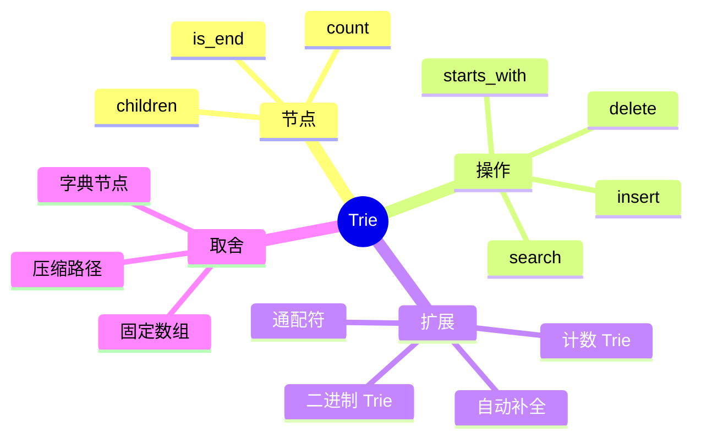

# 字典树（Trie）：按前缀组织字符串

## 本节知识地图



哈希集合可以 O(1) 平均判断完整单词是否存在，但不擅长回答“是否存在以 `app` 开头的单词”。Trie 把公共前缀合并成一条路径。

## 接口契约

本章基础 `Trie` 采用“集合语义”：

| 操作 | 结果 | 复杂度 | 边界 |
|---|---|---:|---|
| `insert(word)` | 插入完整单词 | O(L) | 重复插入不重复计数 |
| `search(word)` | 是否存在完整单词 | O(L) | 空字符串由 root 的 `is_end` 表示 |
| `starts_with(prefix)` | 是否存在此前缀 | O(L) | 空前缀总是 True |
| `delete(word)` | 删除完整单词 | O(L) | 不存在返回 False |
| `words_with_prefix(prefix)` | 返回前缀下单词 | O(P + output) | P 是遍历节点数 |

`L` 是输入字符串长度。基础 Trie 不默认支持通配符、大小写折叠和 Unicode 规范化，调用者要在接口外先统一规则。

### 重复单词与计数

- 基础 Trie 只保存 `is_end`，插入 `apple` 两次仍表示一个单词。
- 如果题目关心重复次数，应使用 `end_count` 和 `pass_count`。
- 删除一次重复单词时，要明确是全部删除还是只减少一次计数。

插入 `app`、`apple`、`apt` 后：

```text
root
 └─ a
    └─ p
       ├─ p  (app 结束)
       │  └─ l
       │     └─ e  (apple 结束)
       └─ t  (apt 结束)
```

节点本身通常不保存完整字符串，只保存：

- 指向下一字符的映射。
- 当前节点是否是某个完整单词的结尾。

## 选择节点表示

### 字典 children

```text
children = {字符: 子节点}
```

- 分支稀疏时省内存。
- 字符集可以是 Unicode。
- 每次访问有哈希查找成本。

### 固定数组 children

```text
children = [None] * alphabet_size
```

- 字符集固定且密集时常数小。
- 空槽也占指针空间。
- 非法字符必须在进入下标计算前拒绝。

### 共享前缀的空间

设所有单词总长度为 S，不重复前缀节点数为 P：

```text
Trie 节点空间 = O(P)
P <= S
```

公共前缀越多，压缩收益越大；随机字符串通常接近 O(S)。

## 节点定义

### 字典版

```python
class TrieNode:
    def __init__(self):
        self.children = {}
        self.is_end = False
```

适合字符范围不固定或分支稀疏。

### 固定 26 字母数组版

```python
class TrieNode:
    def __init__(self):
        self.children = [None] * 26
        self.is_end = False
```

数组常数更小，但只适合已知字符集。下标计算为 `ord(character) - ord("a")`。

## 完整实现

```python
class TrieNode:
    def __init__(self):
        self.children = {}
        self.is_end = False


class Trie:
    def __init__(self):
        self.root = TrieNode()

    def insert(self, word):
        node = self.root
        for character in word:
            if character not in node.children:
                node.children[character] = TrieNode()
            node = node.children[character]
        node.is_end = True

    def search(self, word):
        node = self._find_node(word)
        return node is not None and node.is_end

    def starts_with(self, prefix):
        return self._find_node(prefix) is not None

    def delete(self, word):
        path = []
        node = self.root
        for character in word:
            if character not in node.children:
                return False
            path.append((node, character))
            node = node.children[character]
        if not node.is_end:
            return False

        node.is_end = False
        for parent, character in reversed(path):
            child = parent.children[character]
            if child.is_end or child.children:
                break
            del parent.children[character]
        return True

    def _find_node(self, text):
        node = self.root
        for character in text:
            if character not in node.children:
                return None
            node = node.children[character]
        return node
```

## search 与 starts_with 的区别

插入 `apple` 后：

- `search("app")` 是 False，因为 `app` 不是完整单词。
- `starts_with("app")` 是 True，因为路径存在。
- 再插入 `app` 后，两个结果都是 True。

关键就在 `is_end`。只有走到某节点不代表这里有完整单词结束。

### 删除为什么要从后往前裁剪

删除 `apple` 时不能直接删掉 `a -> p -> p`，因为 `app` 可能仍然存在。只有当某节点：

```text
不是其他单词的结尾
并且没有其他子节点
```

才可以从叶子向根裁剪。若只是取消 `is_end` 而不裁剪，查询仍然正确，但会保留多余节点。

### 前缀下枚举单词

```python
def words_with_prefix(trie, prefix):
    start = trie._find_node(prefix)
    if start is None:
        return []

    result = []

    def dfs(node, suffix):
        if node.is_end:
            result.append(prefix + suffix)
        for character, child in node.children.items():
            dfs(child, suffix + character)

    dfs(start, "")
    return result
```

这里的 `output` 成本不能忽略：返回一万个单词时，即使找到前缀只需 O(L)，构造结果仍需输出全部字符。

## 计数 Trie：重复插入与删除一次

基础 `is_end` 只能表示“存在/不存在”。如果题目允许重复单词，需要分别记录：

- `pass_count`：有多少单词经过该节点。
- `end_count`：有多少单词在该节点结束。

```python
class MultisetTrie:
    def __init__(self):
        self.root = CountTrieNode()

    def insert(self, word):
        node = self.root
        node.pass_count += 1
        for character in word:
            node = node.children.setdefault(character, CountTrieNode())
            node.pass_count += 1
        node.end_count += 1

    def count_word(self, word):
        node = self._find_node(word)
        return 0 if node is None else node.end_count

    def count_prefix(self, prefix):
        node = self._find_node(prefix)
        return 0 if node is None else node.pass_count

    def delete_one(self, word):
        path = []
        node = self.root
        for character in word:
            if character not in node.children:
                return False
            path.append((node, character))
            node = node.children[character]
        if node.end_count == 0:
            return False

        node.end_count -= 1
        for parent, character in reversed(path):
            child = parent.children[character]
            child.pass_count -= 1
            if child.pass_count == 0:
                del parent.children[character]
        self.root.pass_count -= 1
        return True

    def _find_node(self, text):
        node = self.root
        for character in text:
            if character not in node.children:
                return None
            node = node.children[character]
        return node
```

删除一次和删除单词集合是两个不同接口。`delete_one("app")` 三次只能成功三次，第四次返回 False。

## 通配符查询

若 `?` 表示任意一个字符，查询不能只沿一条路径，需要 DFS：

```python
def wildcard_search(node, pattern, index=0):
    if index == len(pattern):
        return node.is_end

    character = pattern[index]
    if character == "?":
        return any(
            wildcard_search(child, pattern, index + 1)
            for child in node.children.values()
        )
    if character not in node.children:
        return False
    return wildcard_search(node.children[character], pattern, index + 1)
```

最坏时间与分支数和模式长度共同决定，不能继续声称所有 Trie 查询都是 O(L)。

## 二进制 Trie：最大异或

Trie 的字符不一定是文本字符，也可以按高位到低位保存整数 bit：

```python
class BinaryTrie:
    def __init__(self, bit_width=31):
        self.bit_width = bit_width
        self.root = [None, None]

    def insert(self, value):
        node = self.root
        for bit in range(self.bit_width, -1, -1):
            flag = (value >> bit) & 1
            if node[flag] is None:
                node[flag] = [None, None]
            node = node[flag]

    def max_xor(self, value):
        node = self.root
        result = 0
        for bit in range(self.bit_width, -1, -1):
            flag = (value >> bit) & 1
            preferred = flag ^ 1
            if node[preferred] is not None:
                result |= 1 << bit
                node = node[preferred]
            elif node[flag] is not None:
                node = node[flag]
            else:
                raise ValueError("trie is empty")
        return result
```

它的时间是 O(B)，其中 B 是位宽，不是输入数字数量。

## Trie 的工程边界

- 大小写是否折叠。
- Unicode 是否先做 NFC/NFKC 规范化。
- 是否允许空字符串。
- 自动补全是否按字典序、热度还是插入顺序。
- 结果数量是否有限制。
- 删除是否物理裁剪节点。
- 是否需要线程安全。

这些都不是 Trie 节点代码本身能自动决定的。

## 自动补全的实现策略

### 1. 先定位前缀节点

```text
root -> p -> r -> e
```

找到前缀末尾节点后，剩余工作是遍历它的子树，而不是重新扫描所有单词。

### 2. 字典序输出

如果接口要求字典序，不能直接依赖 Python 字典的插入顺序：

```python
def words_with_prefix_sorted(trie, prefix):
    node = trie._find_node(prefix)
    if node is None:
        return []
    result = []

    def dfs(current, suffix):
        if current.is_end:
            result.append(prefix + suffix)
        for character in sorted(current.children):
            dfs(current.children[character], suffix + character)

    dfs(node, "")
    return result
```

排序每个节点的分支会增加成本。若字符集固定且节点用数组，按下标扫描天然产生字典序，但扫描空槽也有代价。

### 3. 限制输出数量

自动补全通常只返回前 K 个结果：

```python
def suggest(trie, prefix, limit):
    if limit < 0:
        raise ValueError("limit must be non-negative")
    node = trie._find_node(prefix)
    if node is None or limit == 0:
        return []
    result = []

    def dfs(current, suffix):
        if len(result) >= limit:
            return
        if current.is_end:
            result.append(prefix + suffix)
        for character in sorted(current.children):
            dfs(current.children[character], suffix + character)

    dfs(node, "")
    return result
```

如果按热度返回，节点还要保存 top-K 候选或额外接入排序结构，不能只靠字符路径。

### 4. 删除与自动补全

删除单词后：

- `search` 不应再返回 True。
- 其他共享前缀单词仍应存在。
- 自动补全不应返回被删除单词。
- 是否立即裁剪孤立节点只影响空间，不应影响查询结果。

## Trie 的内存优化

### 字典节点

优点是只为实际分支分配映射；缺点是每个 Python dict 和节点对象都有较大对象头。

### 数组节点

优点是索引直接、常数小；缺点是每个节点都分配 alphabet_size 个槽位，稀疏前缀会浪费空间。

### 压缩 Trie / Radix Tree

把只有一个孩子的连续路径压缩成字符串片段：

```text
普通 Trie： c -> o -> m -> p -> u -> t -> e -> r
压缩 Trie： "computer"
```

查询需要比较字符串片段，插入可能拆分边。它能减少节点数量，但实现和分裂逻辑明显复杂。

### 缓存友好性

固定数组未必总快：

- 节点太大导致 Cache miss。
- 字符集大导致大量空槽。
- 字典节点虽有哈希成本，却可能更紧凑。

应按实际字符集、词典规模和查询比例测量。

## Trie 复杂度的准确写法

设：

- `L`：查询字符串长度。
- `P`：前缀节点子树规模。
- `O`：输出字符总数。
- `B`：二进制 Trie 位宽。

| 操作 | 复杂度 |
|---|---:|
| 单词插入/查询/删除 | O(L) |
| 前缀存在性 | O(L) |
| 前缀枚举 | O(P + O) |
| 通配符查询 | 最坏取决于展开分支 |
| 二进制最大异或 | O(B) |
| 字典节点空间 | O(不重复前缀总数) |

## Trie 的实现自测

```python
trie = Trie()
assert not trie.search("")
assert trie.starts_with("")

trie.insert("app")
trie.insert("apple")
assert trie.search("app")
assert trie.search("apple")
assert not trie.search("ap")
assert trie.starts_with("ap")

assert trie.delete("app")
assert not trie.search("app")
assert trie.search("apple")  # 共享前缀仍存在
assert not trie.delete("missing")
```

计数版本还要测试：

```text
重复插入三次 -> end_count=3
delete_one 两次 -> end_count=1
再次删除 -> 节点是否裁剪
第四次删除 -> False
```

## Trie 与其他索引结构

| 结构 | 完整 key 查询 | 前缀查询 | 有序遍历 | 典型内存 |
|---|---:|---:|---:|---|
| Set/HashMap | 平均 O(1) | 不自然 | 无 | 较低 |
| Trie | O(L) | O(L + output) | 容易 | 较高 |
| 排序数组 | O(log n) | 二分边界 + 输出 | 天然 | 较低 |
| Radix Tree | O(片段数) | 支持 | 容量较省 | 中等 |

字典量小且只做前缀查找时，排序数组加二分可能比 Trie 更简单；Trie 的优势是动态插入和共享前缀。

## 从字符串到节点路径

插入 `app`：

```text
root
  -> 'a'
      -> 'p'
          -> 'p'，is_end=True
```

再插入 `apple`：

```text
root -> a -> p -> p
                    -> l -> e，is_end=True
```

两个单词共享 `a-p-p`，但 `is_end` 分别决定 `app` 和 `apple` 是否是完整单词。

### 删除 app

1. 找到最后一个 p。
2. 把它的 `is_end` 改为 False。
3. 不能删除 `a-p-p`，因为它仍有子节点 l。

### 删除 apple

1. 取消 e 的 `is_end`。
2. e 无子节点，删除 e。
3. l 无子节点且不是结尾，删除 l。
4. p 仍是 app 的结尾，停止裁剪。

## Trie 的接口测试

```python
trie = Trie()
for word in ["app", "apple", "apt"]:
    trie.insert(word)

assert trie.starts_with("ap")
assert trie.search("app")
assert not trie.search("ap")
assert trie.delete("app")
assert not trie.search("app")
assert trie.search("apple")
assert trie.delete("apple")
assert trie.starts_with("ap")
assert not trie.delete("apple")
```

测试重点是共享前缀、完整词标志和重复删除，而不是只测一条没有分叉的路径。

## Trie 面试追问

### Q7：为什么 Trie 的节点不保存完整字符串

> 路径本身已经编码了前缀，节点只需保存子节点和结尾标志。保存完整字符串会重复占用前缀空间，只有在自动补全缓存或需要快速返回对象时才可能额外保存。

### Q8：Trie 和哈希表怎样组合

> Trie 负责前缀定位，节点可以保存词频、热度或完整对象 ID；哈希表负责通过完整 key 快速定位元数据。二者组合时要定义删除和缓存失效，否则 Trie 路径与哈希表记录可能不一致。

## Trie 快速复盘

```text
根节点代表空前缀
路径代表字符序列
is_end 代表完整单词
children 决定分支
insert 创建缺失节点
search 还要检查 is_end
starts_with 只需路径存在
delete 先取消结尾，再从后往前裁剪
计数 Trie 额外维护 pass/end count
```

最常见的错误是把“路径存在”误认为“完整单词存在”，或删除共享前缀时误删其他单词。

## 30 秒背诵

> Trie 用字符路径共享公共前缀，节点的 children 保存分支，is_end 标记完整单词。insert/search/delete 通常按单词长度 O(L)，starts_with 只检查路径；自动补全还要加输出成本。字典 children 适合稀疏大字符集，固定数组适合密集小字符集；删除要从叶子向根裁剪，不能破坏共享前缀。

### 章节终局

```text
完整词查询 -> search + is_end
前缀查询   -> starts_with + 路径存在
重复计数   -> pass_count/end_count
删除       -> 取消结尾并反向裁剪
自动补全   -> 子树 DFS + 输出限制
通配符     -> 分支搜索，复杂度不再只是 O(L)
二进制 Trie -> 按 bit 选择相反分支求最大异或
```

## Trie 面试追问

### Q4：空字符串能不能插入

> 可以，但要先约定。空字符串对应 root 节点，插入时把 `root.is_end` 设为 True；`starts_with("")` 通常为 True。若业务不允许空词，应在 API 入口拒绝，而不是让实现出现隐式语义。

### Q5：重复插入如何处理

> 基础 Trie 使用布尔 `is_end`，重复插入幂等；计数 Trie 使用 `end_count/pass_count`，可支持重复删除一次。两种接口不能混用，否则删除次数和前缀计数会错误。

### Q6：如何实现前缀自动补全

> 先沿字符路径定位前缀节点，再 DFS/BFS 遍历其子树并拼接后缀。若有字典序、热度或前 K 限制，应在接口中明确排序和输出成本，不能只写 O(L)。

## 复杂度

设字符串长度为 L：

| 操作 | 时间 | 额外空间 |
|------|------|----------|
| 插入 | O(L) | 最坏 O(L) 新节点 |
| 查询单词 | O(L) | O(1) |
| 查询前缀 | O(L) | O(1) |

总空间与所有不重复前缀字符节点数有关。大量字符串且公共前缀少时，Trie 可能很占内存。

## 统计前缀数量

节点可以保存经过次数：

```python
class CountTrieNode:
    def __init__(self):
        self.children = {}
        self.pass_count = 0
        self.end_count = 0


class CountTrie:
    def __init__(self):
        self.root = CountTrieNode()

    def insert(self, word):
        node = self.root
        node.pass_count += 1
        for character in word:
            node = node.children.setdefault(character, CountTrieNode())
            node.pass_count += 1
        node.end_count += 1

    def count_prefix(self, prefix):
        node = self.root
        for character in prefix:
            if character not in node.children:
                return 0
            node = node.children[character]
        return node.pass_count
```

## Trie + DFS：单词搜索

在字符网格中搜索大量单词时，为每个单词单独 DFS 会重复匹配前缀。把全部单词建成 Trie，网格 DFS 只沿存在的前缀继续。

剪枝条件：

```python
def dfs(row, col, trie_node, grid):
    character = grid[row][col]
    if character not in trie_node.children:
        return

    next_node = trie_node.children[character]
    # 从 next_node 继续搜索相邻格子
```

当当前位置前缀不在 Trie 中，后面无需继续探索。

## 什么时候使用 Trie

- 自动补全、搜索建议。
- 大量单词的前缀查询。
- 字符网格中同时搜索多个单词。
- 最大异或值（把整数按二进制位插入 Trie）。

只查询完整单词是否存在时，set 通常更简单且更省内存。

## 常见错误

- 插入后忘记设置 `is_end`。
- 把“路径存在”误认为“单词存在”。
- 每次操作错误地从上一次节点继续，而不是从 root 开始。
- 字符集很大却使用巨大固定数组。
- 删除单词时直接删除共享前缀节点，破坏其他单词。
- 空字符串、重复插入和删除不存在单词的行为没有先约定。
- 固定数组版本遇到非 `a-z` 字符却继续计算负下标或越界下标。

## 面试表达：Trie 接口

### Q1：Trie 和 set 的区别

> set 适合完整 key 的平均 O(1) 成员查询；Trie 按字符共享公共前缀，完整查询和前缀查询都是 O(L)，还能自然枚举前缀下的单词，但节点和指针开销更大。只做完整单词判定时，set 通常更简单。

### Q2：Trie 删除为什么不能直接删路径

> 多个单词共享前缀。删除一个单词时先取消末尾节点的 `is_end`，再从后往前删除“没有子节点且不是其他单词结尾”的节点，否则会破坏其他单词。

---

## 边界测试清单

```text
空 Trie、空字符串、单字符
重复插入和重复删除
插入 app 与 apple 后删除其中一个
删除不存在单词
前缀不存在、前缀本身是完整单词
非 a-z 字符的固定数组版本
大量公共前缀与完全随机前缀
自动补全结果数量和输出顺序
```

## 最后一个面试陷阱

Trie 的 O(L) 只适用于沿单一路径判断存在；通配符、自动补全和热度排序都要把分支数或输出量算进复杂度。

## 自测

1. 插入 apple、app、apt，画出共享节点。
2. 增加 `count_word(word)` 支持重复插入。
3. 实现返回指定前缀下所有单词的 DFS。
4. 比较 Trie 与 set 在完整查询和前缀查询中的差异。

## Trie 终局

```text
字符路径不是完整单词
is_end 决定词尾
children 决定分支
重复词需要计数
删除需要反向裁剪
自动补全需要输出限制
通配符会展开分支
固定数组需要校验字符集
Unicode 需要先决定规范化规则
```

## 面试表达：Trie

### Q1：Trie 为什么适合前缀查询

> Trie 按字符逐层组织单词，共享公共前缀。沿前缀走 L 步后，节点子树就是所有匹配单词；完整查询和前缀存在性通常 O(L)，枚举还要加输出成本。只做完整 key 查询时，set 平均 O(1) 往往更省内存。

### Q2：字典节点和固定数组节点如何选择

> 字典适合字符集大、分支稀疏和 Unicode；固定数组适合已知且密集的小字符集，访问常数小但每个节点都要为所有字符保留槽位，非合法字符必须先校验。

### Q3：Trie 查询为什么不总是 O(L)

> 单词存在和前缀存在只需沿一条路径，通常 O(L)；通配符会在一个节点展开多个分支，自动补全还必须支付输出所有结果的成本，复杂度要把分支和输出写出来。

### Trie 的输入规范

插入、查询和删除必须使用同一套字符规范：是否区分大小写、是否做 Unicode 规范化、空字符串是否是合法单词、字符是否限制在 `a-z`。若固定数组只支持小写字母，却让调用方传入任意 Unicode，不能把字符编码直接当数组下标；应先校验并返回明确错误。

因此 Trie 的性能结论总要带上字符长度 L、分支数和输出量，不能脱离输入规范孤立背 O(L)。

---

---

[← 返回数据结构](../index.html) | [上一篇：图](../07-graph/index.html) | [下一篇：并查集 →](../09-union-find/index.html)
