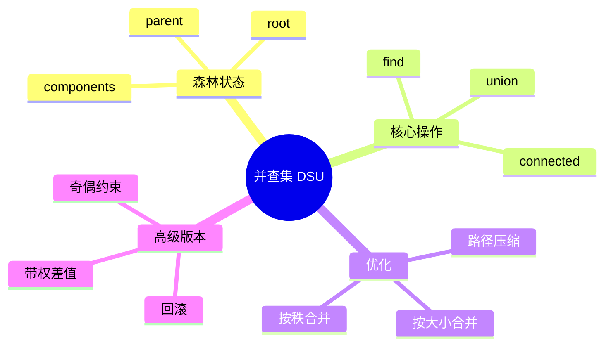

# 并查集：动态维护分组关系

## 本节知识地图



并查集（Disjoint Set Union，DSU）维护若干互不相交的集合，支持两个核心操作：

- `find(x)`：x 属于哪个集合？
- `union(a, b)`：合并 a 和 b 所在集合。

它擅长回答“两个节点是否连通”，但不负责给出两点之间的具体路径。

## 接口契约

本章 `UnionFind(n)` 约定元素编号为 `0 <= x < n`，并查集不支持普通意义上的删除：

| 操作 | 返回值 | 均摊复杂度 | 边界 |
|---|---|---:|---|
| `find(x)` | 集合代表元 | O(alpha(n)) | 越界抛 `IndexError` |
| `union(a, b)` | 是否真的合并了两组 | O(alpha(n)) | 已连通返回 False |
| `connected(a, b)` | 是否同组 | O(alpha(n)) | 不提供路径 |
| `component_size(x)` | x 所在集合大小 | O(alpha(n)) | 只读根的 size |
| `components` | 当前集合数量 | O(1) | 初始为 n |

### 代表元不是稳定 ID

按大小合并会让某个根成为代表元。后续 union 可能改变代表元，因此调用方只能依赖“是否同组”，不能把 `find(x)` 的数值当成永久身份。

### 结构不变量

```text
parent[root] == root
每个 parent 链最终到达一个根
size 只在根节点上有意义
components == 当前根节点数量
```

`find` 可以改变 parent（路径压缩），但不能改变集合划分；只有 `union` 成功时 components 才会减少。

## 用 parent 表示集合

每个集合用一棵树表示，根节点是代表。初始时每个元素自成一组：

```python
parent = list(range(n))
# parent[i] == i 表示 i 是根
```

最基础的 find：

```python
def find(x):
    while parent[x] != x:
        x = parent[x]
    return x
```

## 路径压缩

查询时让沿途节点直接指向根，后续查询会非常快。

### 递归写法

```python
def find(x):
    if parent[x] != x:
        parent[x] = find(parent[x])
    return parent[x]
```

### 迭代写法

```python
def find(x):
    root = x
    while parent[root] != root:
        root = parent[root]

    while parent[x] != x:
        next_node = parent[x]
        parent[x] = root
        x = next_node

    return root
```

## 按大小合并

总让小树挂到大树根下，避免树退化成链。

```python
class UnionFind:
    def __init__(self, n):
        if n < 0:
            raise ValueError("n must be non-negative")
        self.parent = list(range(n))
        self.size = [1] * n
        self.components = n

    def find(self, x):
        if not 0 <= x < len(self.parent):
            raise IndexError("element out of range")
        if self.parent[x] != x:
            self.parent[x] = self.find(self.parent[x])
        return self.parent[x]

    def union(self, a, b):
        root_a = self.find(a)
        root_b = self.find(b)

        if root_a == root_b:
            return False

        if self.size[root_a] < self.size[root_b]:
            root_a, root_b = root_b, root_a

        self.parent[root_b] = root_a
        self.size[root_a] += self.size[root_b]
        self.components -= 1
        return True

    def connected(self, a, b):
        return self.find(a) == self.find(b)

    def component_size(self, x):
        return self.size[self.find(x)]
```

`union` 返回 False 表示两点原本已连通，这对检测环很有用。

### 为什么并查集不支持删除

路径压缩会让许多节点直接指向根。删除一条边后，原集合可能需要拆成多个集合，而并查集只保存“合并历史”，没有足够信息恢复原图结构。

如果必须支持删除：

- 离线问题可用逆序加边。
- 时间段问题可用线段树分治 + 可回滚并查集。
- 在线动态连通可考虑 Link-Cut Tree 等更复杂结构。

### 元素动态加入

基础数组版要求构造时知道 n。若节点动态出现，可以：

```python
parent.append(new_id)
size.append(1)
components += 1
```

但要同步扩展所有数组，并定义外部 ID 到内部连续 ID 的映射。

## 按秩合并

`size` 记录集合节点数；也可以记录树高的近似 `rank`：

```python
class RankUnionFind:
    def __init__(self, n):
        self.parent = list(range(n))
        self.rank = [0] * n

    def find(self, x):
        if not 0 <= x < len(self.parent):
            raise IndexError("element out of range")
        if self.parent[x] != x:
            self.parent[x] = self.find(self.parent[x])
        return self.parent[x]

    def union(self, a, b):
        root_a, root_b = self.find(a), self.find(b)
        if root_a == root_b:
            return False
        if self.rank[root_a] < self.rank[root_b]:
            root_a, root_b = root_b, root_a
        self.parent[root_b] = root_a
        if self.rank[root_a] == self.rank[root_b]:
            self.rank[root_a] += 1
        return True
```

按秩和按大小都能限制树高；不要把非根节点的 rank/size 当作真实集合信息。

## 可回滚并查集

路径压缩会覆盖父指针，不适合需要撤销 union 的离线算法。可回滚版本不做路径压缩，只按大小合并并记录修改：

```python
class RollbackUnionFind:
    def __init__(self, n):
        self.parent = list(range(n))
        self.size = [1] * n
        self.components = n
        self.history = []

    def find(self, x):
        if not 0 <= x < len(self.parent):
            raise IndexError("element out of range")
        while self.parent[x] != x:
            x = self.parent[x]
        return x

    def snapshot(self):
        return len(self.history)

    def union(self, a, b):
        root_a, root_b = self.find(a), self.find(b)
        if root_a == root_b:
            self.history.append(None)
            return False
        if self.size[root_a] < self.size[root_b]:
            root_a, root_b = root_b, root_a
        self.history.append((root_b, root_a, self.size[root_a]))
        self.parent[root_b] = root_a
        self.size[root_a] += self.size[root_b]
        self.components -= 1
        return True

    def rollback(self, snapshot):
        if not 0 <= snapshot <= len(self.history):
            raise ValueError("invalid snapshot")
        while len(self.history) > snapshot:
            change = self.history.pop()
            if change is None:
                continue
            child, root, old_size = change
            self.parent[child] = child
            self.size[root] = old_size
            self.components += 1
```

回滚接口的契约：

- snapshot 是历史长度，不是业务时间戳。
- 只能回滚到已有 snapshot。
- 不做路径压缩，按大小合并后树高为 O(log n)。
- 适合线段树分治等离线动态连通问题，不是普通并查集的默认替代品。

## 带权并查集

普通并查集只回答是否同组；带权并查集还维护节点到父节点的关系量，例如距离差、势能差或比例。

### 差值关系

设 `weight[x]` 表示：

```text
value[x] - value[parent[x]]
```

路径压缩时要把沿途权重累加：

```python
class WeightedUnionFind:
    def __init__(self, n):
        self.parent = list(range(n))
        self.size = [1] * n
        self.weight = [0] * n

    def find(self, x):
        if not 0 <= x < len(self.parent):
            raise IndexError("element out of range")
        if self.parent[x] != x:
            parent = self.parent[x]
            root = self.find(parent)
            self.weight[x] += self.weight[parent]
            self.parent[x] = root
        return self.parent[x]

    def difference(self, x, y):
        if self.find(x) != self.find(y):
            return None
        # find 后 weight 是相对于各自根的值
        return self.weight[x] - self.weight[y]

    def union_with_difference(self, x, y, delta):
        # 约束 value[x] - value[y] = delta
        root_x = self.find(x)
        root_y = self.find(y)
        if root_x == root_y:
            return self.difference(x, y) == delta

        if self.size[root_x] < self.size[root_y]:
            root_x, root_y = root_y, root_x
            x, y = y, x
            delta = -delta

        self.parent[root_y] = root_x
        # value[root_y] - value[root_x]
        self.weight[root_y] = self.weight[x] - self.weight[y] - delta
        self.size[root_x] += self.size[root_y]
        return True
```

使用带权结构时必须明确权重方向；把 `x-y` 写成 `y-x` 会让所有约束符号反转。

### 比例关系

如果约束是 `value[x] / value[y] = ratio`，可以把加法权重换成乘法势能：

```text
potential[x] = value[x] / value[parent[x]]
```

路径压缩时沿途相乘，合并时根据比例推导根之间关系。要额外处理零值、浮点误差和不一致约束。

## 奇偶并查集

用于判断二分图或维护“两个节点距离奇偶关系”：

```python
class ParityUnionFind:
    def __init__(self, n):
        self.parent = list(range(n))
        self.parity = [0] * n  # x 到 parent[x] 的奇偶差
        self.size = [1] * n

    def find(self, x):
        if not 0 <= x < len(self.parent):
            raise IndexError("element out of range")
        if self.parent[x] == x:
            return x
        parent = self.parent[x]
        root = self.find(parent)
        self.parity[x] ^= self.parity[parent]
        self.parent[x] = root
        return root

    def union_different(self, a, b):
        # 约束 a、b 必须属于不同颜色
        root_a, root_b = self.find(a), self.find(b)
        if root_a == root_b:
            return self.parity[a] ^ self.parity[b] == 1
        if self.size[root_a] < self.size[root_b]:
            root_a, root_b = root_b, root_a
            a, b = b, a
        self.parent[root_b] = root_a
        self.parity[root_b] = self.parity[a] ^ self.parity[b] ^ 1
        self.size[root_a] += self.size[root_b]
        return True
```

如果同组节点被要求“不同颜色”却推导出相同颜色，说明约束不一致。

## 并查集的工程边界

- 根代表会变化，外部 ID 应由业务映射维护。
- 普通并查集只支持加边，不支持删除边。
- 路径压缩改变 parent 形状，不能把 parent 当原始图边。
- 递归 find 在极端数据上可能触碰递归限制；迭代版更稳。
- 并查集只适合等价关系，不适合回答路径、距离和邻居。

## 复杂度与内存

数组版保存 `parent`、`size/rank`，空间 O(n)。一次 `find` 的递归栈最坏与树高相关；使用按大小合并后树高 O(log n)，配合路径压缩得到更强的均摊界。

节点 ID 很大或是字符串时，先离散化：

```python
ids = sorted(set(raw_ids))
to_index = {value: index for index, value in enumerate(ids)}
from_index = ids
```

压缩只改变内部编号，不改变等价关系；如果输出原始 ID，需要保留反向映射。

## 并查集验证

```python
uf = UnionFind(5)
assert uf.components == 5
assert uf.union(0, 1) is True
assert uf.union(1, 0) is False
assert uf.connected(0, 1)
assert uf.component_size(0) == 2
assert uf.components == 4

try:
    uf.find(5)
except IndexError:
    pass
else:
    raise AssertionError("out-of-range element should fail")
```

测试要同时检查划分结果和派生状态 `components/size`，不能只测 `connected`。

## 复杂度

路径压缩 + 按大小合并后，单次操作的均摊复杂度是 `O(α(n))`。`α` 是反阿克曼函数，在现实数据规模下可以看作小于 5，近似常数。

空间复杂度为 O(n)。

## 应用一：统计连通分量

```python
def count_components(n, edges):
    union_find = UnionFind(n)
    for u, v in edges:
        union_find.union(u, v)
    return union_find.components
```

## 应用二：无向图检测环

逐条加入边。如果某条边两端已经连通，再加入这条边就形成环。

```python
def contains_cycle(n, edges):
    union_find = UnionFind(n)

    for u, v in edges:
        if not union_find.union(u, v):
            return True

    return False
```

## 应用三：Kruskal 最小生成树

按边权从小到大尝试加入；只有连接两个不同集合的边才加入答案。

```python
def minimum_spanning_tree(n, edges):
    # edge = (weight, u, v)
    edges.sort()
    union_find = UnionFind(n)
    total_weight = 0
    used_edges = 0

    for weight, u, v in edges:
        if union_find.union(u, v):
            total_weight += weight
            used_edges += 1

    if used_edges != n - 1:
        return None
    return total_weight
```

## 应用四：离线删除转为逆序加边

普通并查集不能删除边，但如果题目允许离线读取全部操作，可以倒过来处理：

```text
正序：加边、删边、查询
逆序：先保留最终仍存在的边
      删除在逆序变成加边
      加边在逆序变成忽略
```

每次逆序遇到“删除某条边”，等价于把这条边重新加入，正好符合 Union-Find 的单调加边能力。

### 需要额外维护什么

- 原始操作序列。
- 最终存在的边集合。
- 每个查询的时间位置。
- 逆序结果再反转回正序。

### 限制

- 不能在线即时回答删除后的状态。
- 同一条边重复添加/删除要先定义计数还是集合语义。
- 若边有编号，不能只用 `(u, v)` 判断相同边。

### 逆序处理骨架

```python
def offline_deletions(n, initial_edges, operations):
    # operations: ("remove"/"query", u, v)
    active = set(initial_edges)
    for operation, u, v in operations:
        if operation == "remove":
            active.discard((u, v))

    uf = UnionFind(n)
    for u, v in active:
        uf.union(u, v)

    answers = []
    for operation, u, v in reversed(operations):
        if operation == "query":
            answers.append(uf.connected(u, v))
        elif operation == "remove":
            uf.union(u, v)
    return list(reversed(answers))
```

这是“只有删除、没有后续加边”时的骨架：正序删除在逆序变成加边。真实题目若允许重复加边/删边，需要边计数、边编号或回滚并查集，不能直接用 set。

## 应用五：等式约束

把变量离散化后，用带权并查集维护：

```text
x - y = d
```

处理新约束时：

1. 查 x、y 所在根。
2. 不同根：合并并记录根间差值。
3. 同根：检查已有差值是否等于 d。
4. 不相等则约束冲突。

这比单纯 `connected` 多了一层“同组关系必须一致”的接口。

## 应用六：动态连通的时间复杂度

设有 n 个元素、m 次操作：

| 实现 | 总复杂度 | 适用 |
|---|---:|---|
| 朴素 parent，不优化 | 最坏 O(mn) | 只用于理解 |
| 按大小/秩合并 | O(m log n) | 已有明显改进 |
| 路径压缩 + 按大小 | O(m alpha(n)) 均摊 | 常规在线加边 |
| 回滚 + 按大小 | O(m log n) | 离线撤销 |

`alpha(n)` 增长极慢，但它是均摊上界，不应写成每次严格 O(1)。

## 回滚使用示例

```python
uf = RollbackUnionFind(4)
base = uf.snapshot()
uf.union(0, 1)
branch = uf.snapshot()
uf.union(1, 2)
assert uf.components == 2

uf.rollback(branch)
assert uf.connected(0, 1)
assert not uf.connected(0, 2)
uf.rollback(base)
assert uf.components == 4
```

回滚只能撤销 history 中最近的修改到某个 snapshot，不能像数据库一样随意跳到任意中间状态并继续复用已失效的引用。

## 带权关系自测

```python
weighted = WeightedUnionFind(3)
assert weighted.union_with_difference(0, 1, 5)
assert weighted.union_with_difference(1, 2, 3)
assert weighted.difference(0, 2) == 8
assert not weighted.union_with_difference(0, 2, 9)
```

最后一条约束与已有关系冲突，返回 False。若业务需要容忍冲突，应返回错误对象或记录冲突来源，而不是静默覆盖。

## 并查集选型清单

```text
只加边、问是否连通 -> 普通路径压缩并查集
需要集合大小/数量 -> 在根上维护 size/components
约束差值或比例 -> 带权并查集
二分/奇偶约束 -> parity 并查集
离线撤销合并 -> 回滚并查集
要路径/邻居/删除边 -> 图算法或动态连通结构
```

## 手算一次 union

初始：

```text
parent = [0, 1, 2, 3, 4]
size   = [1, 1, 1, 1, 1]
```

执行 `union(0, 1)`：

```text
parent = [0, 0, 2, 3, 4]
size   = [2, 1, 1, 1, 1]
components = 4
```

执行 `union(1, 2)`：

```text
find(1) = 0
find(2) = 2
parent = [0, 0, 0, 3, 4]
size[0] = 3
components = 3
```

执行 `find(2)` 后，2 直接指向根 0，这就是路径压缩。

## 并查集与等价关系

并查集维护的关系需要满足：

- 自反：x 与 x 同组。
- 对称：x 与 y 同组，则 y 与 x 同组。
- 传递：x 与 y、y 与 z 同组，则 x 与 z 同组。

如果业务关系不满足等价性，例如方向依赖、距离最短或可撤销边，不能强行用普通并查集。

## 面试前检查

```text
是否先 find 再合并根
size/rank 是否只更新新根
components 是否只在成功 union 时减少
find 是否做路径压缩
节点编号是否已离散化
是否误用并查集处理删除边或路径
```

## 字符串或稀疏节点

可以先离散化：

```python
names = ["alice", "bob", "carol"]
node_id = {name: index for index, name in enumerate(names)}

union_find.union(node_id["alice"], node_id["bob"])
```

也可以写 dict 版 parent，但连续整数数组通常更高效。

## 并查集与 DFS/BFS 的区别

| 需求 | 推荐 |
|------|------|
| 静态图遍历、需要具体路径 | DFS/BFS |
| 边不断加入、反复问是否连通 | 并查集 |
| 删除边后动态连通 | 普通并查集不直接支持 |
| 无权最短路径 | BFS |
| Kruskal 最小生成树 | 并查集 |

## 常见错误

- 合并 `a` 和 `b` 本身，而不是它们的根。
- `size` 更新到非根节点。
- 忘记路径压缩或按大小合并，极端情况下退化。
- 节点从 1 开始却只建立 n 个元素。
- 把有向图环检测直接套用无向图并查集方法。
- 把代表元数值当成永久 ID。
- 在路径压缩后尝试根据旧 parent 恢复历史。

## 面试表达：并查集接口

### Q1：路径压缩和按大小合并分别做什么

> 路径压缩在 find 时让沿途节点直接指向根，降低后续查询深度；按大小/按秩合并让小树挂到大树下，避免树长期退化。两者结合后，连续 m 次操作的均摊复杂度近似 O(m alpha(n))。

### Q2：union 为什么返回布尔值

> 如果两个元素已经同组，union 不会改变结构，返回 False；如果来自不同集合并成功合并，返回 True。这个结果可直接用于无向图环检测和 Kruskal 选边。

### Q3：并查集为什么不能给路径

> 它只维护集合代表和父指针，父指针表示合并树，不是原图中的真实边。要恢复两点路径，应使用 DFS/BFS、最短路或其他图结构。

### Q4：什么时候需要回滚并查集

> 普通并查集只适合不断加边。若离线处理边的生效时间、需要撤销合并，可用线段树分治把边放入时间区间，再配合不做路径压缩、记录修改的回滚并查集。在线删除边则需要更复杂的动态连通结构。

### Q5：代表元为什么不能暴露为业务 ID

> 按大小合并和路径压缩都会改变树根。代表元只表示当前集合，不是创建时的永久身份；业务层需要保留自己的节点 ID 到内部索引映射。

### Q6：为什么 path compression 不改变答案

> parent 链只表示到集合代表的路径，不是业务关系本身。把沿途节点直接改指根只缩短查询路径，不改变集合划分，因此不会改变 connected 的结果。

### Q7：为什么回滚版本不能做路径压缩

> 路径压缩一次可能修改多个 parent，若不完整记录所有修改就无法恢复。回滚并查集通常放弃压缩，只按大小合并控制树高，并把每次 parent/size 变化记录到 history。

---

## 边界测试清单

```text
n=0、n=1
find/union 越界
union(x, x)
重复 union
连续合并后路径压缩
components 是否从 n 正确递减
component_size 是否只在根上维护
字符串 ID 离散化
删除边后为何不能直接拆集合
```

## 最后一个面试陷阱

`find` 返回的是当前代表元，不是原图父节点，也不是永久业务 ID。路径压缩会改变 parent 形状；如果需要历史或撤销，必须使用回滚结构并放弃普通路径压缩。

## 自测

1. 手动执行 union(0,1)、union(1,2)，画出 parent 变化。
2. 增加返回当前集合数量的方法。
3. 用并查集判断一组等式与不等式是否冲突。
4. 解释为什么并查集不能直接回答最短路径。

## 并查集终局

```text
parent：森林
root：代表元
find：路径压缩
union：合并根
size/rank：控制高度
components：集合数量
weighted/parity：额外约束
rollback：离线撤销
不支持：路径、在线删边
```

## 30 秒背诵

> 并查集用 parent 数组把每个集合表示成一棵树，根是代表元。find 查代表，union 合并两个根；路径压缩让访问节点直接指向根，按大小/按秩合并避免树退化。两者结合后的连续操作均摊接近 O(alpha(n))。它适合不断加边的连通性，不适合路径、最短路和在线删边；需要撤销时使用回滚版本。

### 章节终局

```text
集合划分 -> parent 森林
查代表   -> find
合并     -> union 根节点
优化     -> 路径压缩 + 按大小/按秩
关系扩展 -> 带权/奇偶
撤销     -> history + rollback
不适用   -> 路径、最短路、在线删除
```

### 最小验证

```text
初始 components=n
成功 union 一次 -> components 减一
重复 union -> components 不变
find 之后 parent 链可以变短
代表元可能改变，不能当业务 ID
```

## 并查集的实现验收：每个数组存什么

### 普通版状态表

|数组/字段|含义|变化时机|
|---|---|---|
|`parent[x]`|x 当前指向的父节点|路径压缩或合并|
|`size[root]`|以根为代表的集合大小|成功合并时累加|
|`components`|当前集合数量|成功合并减一|
|`history`|回滚所需的旧状态|每次 union 记录，不能记录压缩写入|

`find` 的返回值是代表元，不是“最早加入的元素”或最小编号。按大小合并后代表元可能改变，因此业务层不能把 root 当稳定 ID 保存。

### 回滚版为什么不能路径压缩

路径压缩会一次修改很多 `parent`，如果不把每次写入都记录下来，rollback 就无法恢复原状；记录所有写入又会破坏回滚版本的简单性。回滚并查集通常只按大小/按秩合并，让树高 O(log n)，并在 union 前保存被修改根的 parent、size 和 components。

### 带权和奇偶约束的验证

给每条边构造约束后，验证三种情况：

```text
同一集合且约束已满足 -> 返回 True，不改变结构
同一集合但约束冲突 -> 返回 False，结构不应被破坏
不同集合 -> 合并并保存相对权值/奇偶关系
```

随机测试可以先生成一组真实变量，再由变量差值或颜色关系生成约束；并查集结果应与直接计算 oracle 一致。这样能同时发现权值方向写反、模运算负数和冲突后误合并的问题。

### 不适用场景的快速判断

题目若要求输出具体路径、边权和、在线删除一条边后的连通性，先停下来换图算法或动态连通性方案。并查集只维护“是否属于同一集合”这一等价关系，不能凭空恢复路径结构。

实现完成的最低标准是：成功合并只减一次 components，重复合并不改变任何集合统计。

数组下标检查应在 find 入口完成，负数和等于 n 的下标都属于非法输入，而不是让语言的负索引语义悄悄访问错误集合。

这样，非法输入不会污染 parent 森林。

---

[← 返回数据结构](../index.html) | [上一篇：字典树](../08-trie/index.html) | [下一篇：进阶结构 →](../10-advanced-structures/index.html)
