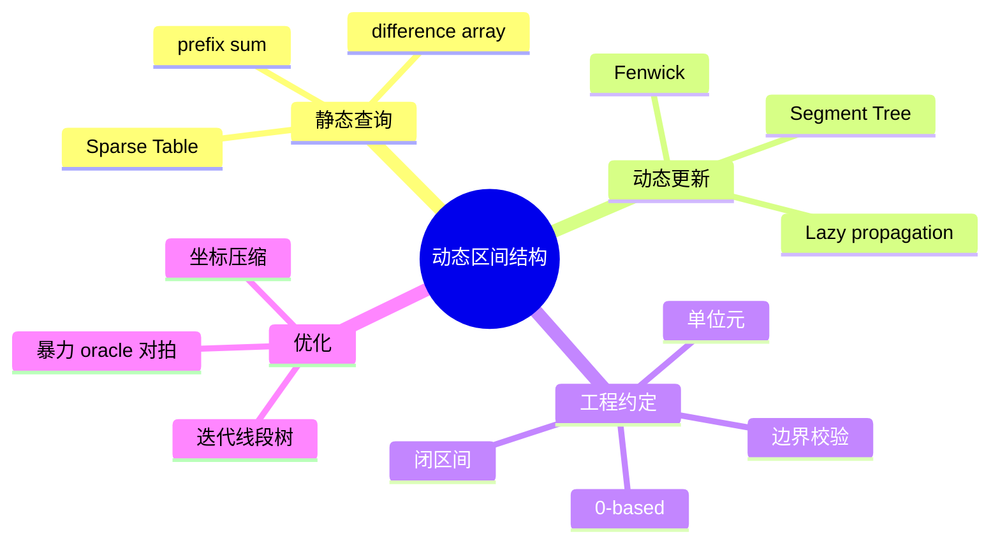

# 进阶数据结构：处理动态区间

## 本节知识地图



普通前缀和能 O(1) 查询区间和，但数组修改后需要 O(n) 重建。进阶区间结构解决“数据会修改，同时反复查询”的问题。

## 接口契约

本章统一使用**闭区间** `[left, right]`，外部下标从 0 开始；实现内部如果使用 1-based，只在边界处转换一次。

| 结构 | 修改接口 | 查询接口 | 空输入 | 关键不变量 |
|---|---|---|---|---|
| 前缀和 | 不支持在线修改 | `range_sum(l, r)` | 空数组返回 0 或空表 | `prefix[i+1]` 覆盖前 i 项 |
| 差分数组 | `add_range(l, r, delta)` | 通常最后统一还原 | 空数组无有效区间 | 变化只记录在端点 |
| Fenwick | `add(i, delta)` | 前缀/区间聚合 | size 可为 0，但不能查询元素 | 每节点负责 lowbit 长度 |
| 线段树 | 单点或区间修改 | 区间聚合 | 空树的 query/update 应拒绝 | 父节点由子节点合并 |
| 稀疏表 | 构造后只读 | 幂等区间查询 | 空表无合法查询 | 第 k 层覆盖 2^k 长度 |

### 统一边界策略

- `left > right`：抛 `ValueError`。
- 任一端点越界：抛 `IndexError`。
- 空结构查询：抛 `ValueError`，或明确返回聚合单位元。
- 所有公开下标统一 0-based，避免调用者同时记两套规则。

### 为什么稀疏表要求幂等

稀疏表的 O(1) 查询会合并两个可能重叠的区间，因此操作必须满足：

```text
min(x, x) = x
max(x, x) = x
gcd(x, x) = x
```

普通加法不是幂等的，不能直接套用同一查询公式。

## 先看选择表

| 数据结构 | 单点修改 | 区间查询 | 适合 |
|----------|----------|----------|------|
| 前缀和 | O(n) | O(1) | 静态数组 |
| 差分数组 | O(1) 区间修改 | O(n) 最终还原 | 批量修改后统一输出 |
| 树状数组 | O(log n) | O(log n) 前缀聚合 | 动态前缀和、频率 |
| 线段树 | O(log n) | O(log n) | 动态区间和/最值 |
| 稀疏表 | 不支持 | O(1) | 静态幂等查询，如最小值 |

先学前缀和与差分，再学树状数组；只有题目确实需要更灵活区间维护时再使用线段树。

## 前缀和

```python
nums = [3, 1, 4, 1, 5]
prefix = [0]

for value in nums:
    prefix.append(prefix[-1] + value)

def range_sum(left, right):
    # 闭区间 [left, right]
    return prefix[right + 1] - prefix[left]
```

额外的开头 0 可以统一边界，不必特判 left == 0。

### 二维前缀和

```python
prefix = [[0] * (cols + 1) for _ in range(rows + 1)]

for row in range(rows):
    for col in range(cols):
        prefix[row + 1][col + 1] = (
            matrix[row][col]
            + prefix[row][col + 1]
            + prefix[row + 1][col]
            - prefix[row][col]
        )

def rectangle_sum(top, left, bottom, right):
    return (
        prefix[bottom + 1][right + 1]
        - prefix[top][right + 1]
        - prefix[bottom + 1][left]
        + prefix[top][left]
    )
```

## 差分数组

要给区间 `[left, right]` 每个元素增加 delta：

```python
difference = [0] * (len(nums) + 1)

def add_range(left, right, delta):
    difference[left] += delta
    difference[right + 1] -= delta

add_range(1, 3, 5)

current = 0
result = []
for index, value in enumerate(nums):
    current += difference[index]
    result.append(value + current)
```

差分把一次区间修改变成两个端点修改。它适合“全部修改完成后统一还原”，不适合修改中间频繁查询。

## 树状数组（Fenwick Tree）

树状数组维护前缀聚合。下标通常从 1 开始，核心是：

```python
lowbit = index & -index
```

它表示当前节点负责的区间长度。

### 完整实现

```python
class FenwickTree:
    def __init__(self, size):
        self.size = size
        self.tree = [0] * (size + 1)

    def add(self, index, delta):
        # 外部使用 0-based，内部转为 1-based
        if not 0 <= index < self.size:
            raise IndexError("Fenwick index out of range")
        index += 1
        while index <= self.size:
            self.tree[index] += delta
            index += index & -index

    def prefix_sum(self, right):
        # nums[0:right+1] 的和
        if right < -1 or right >= self.size:
            raise IndexError("Fenwick prefix index out of range")
        right += 1
        total = 0
        while right > 0:
            total += self.tree[right]
            right -= right & -right
        return total

    def range_sum(self, left, right):
        if not 0 <= left <= right < self.size:
            raise IndexError("Fenwick range out of range")
        if left == 0:
            return self.prefix_sum(right)
        return self.prefix_sum(right) - self.prefix_sum(left - 1)
```

从数组构建：

```python
fenwick = FenwickTree(len(nums))
for index, value in enumerate(nums):
    fenwick.add(index, value)
```

常见应用包括动态区间和、逆序对、离散化后的频率统计。

## 线段树

线段树把区间不断二分。每个节点保存一段区间的信息，父节点由左右子节点合并。

下面实现单点修改 + 区间和：

```python
class SegmentTree:
    def __init__(self, nums):
        self.length = len(nums)
        self.tree = [0] * (4 * max(1, self.length))
        if nums:
            self._build(nums, 1, 0, self.length - 1)

    def _build(self, nums, node, left, right):
        if left == right:
            self.tree[node] = nums[left]
            return

        middle = (left + right) // 2
        self._build(nums, node * 2, left, middle)
        self._build(nums, node * 2 + 1, middle + 1, right)
        self.tree[node] = self.tree[node * 2] + self.tree[node * 2 + 1]

    def update(self, index, value):
        if self.length == 0:
            raise ValueError("cannot update an empty segment tree")
        if not 0 <= index < self.length:
            raise IndexError("segment tree index out of range")
        self._update(1, 0, self.length - 1, index, value)

    def _update(self, node, left, right, index, value):
        if left == right:
            self.tree[node] = value
            return

        middle = (left + right) // 2
        if index <= middle:
            self._update(node * 2, left, middle, index, value)
        else:
            self._update(node * 2 + 1, middle + 1, right, index, value)

        self.tree[node] = self.tree[node * 2] + self.tree[node * 2 + 1]

    def query(self, query_left, query_right):
        if self.length == 0:
            raise ValueError("cannot query an empty segment tree")
        if not 0 <= query_left <= query_right < self.length:
            raise IndexError("segment tree range out of range")
        return self._query(1, 0, self.length - 1, query_left, query_right)

    def _query(self, node, left, right, query_left, query_right):
        if query_left <= left and right <= query_right:
            return self.tree[node]

        middle = (left + right) // 2
        total = 0
        if query_left <= middle:
            total += self._query(node * 2, left, middle, query_left, query_right)
        if query_right > middle:
            total += self._query(node * 2 + 1, middle + 1, right, query_left, query_right)
        return total
```

把“加法”换成 `min` 或 `max`，就可以维护区间最值。区间修改还需要懒标记，属于进一步内容。

### 稀疏表：静态区间最小值

稀疏表适合“构造后不再修改、但查询很多次”的场景：

```python
class SparseTableMin:
    def __init__(self, values):
        if not values:
            raise ValueError("values must not be empty")
        self._n = len(values)
        self._log = [0] * (self._n + 1)
        for length in range(2, self._n + 1):
            self._log[length] = self._log[length // 2] + 1

        levels = self._log[self._n] + 1
        self._table = [list(values)]
        for power in range(1, levels):
            width = 1 << power
            half = width >> 1
            previous = self._table[-1]
            current = [
                min(previous[i], previous[i + half])
                for i in range(self._n - width + 1)
            ]
            self._table.append(current)

    def query(self, left, right):
        if not 0 <= left <= right < self._n:
            raise IndexError("sparse table range out of range")
        length = right - left + 1
        power = self._log[length]
        width = 1 << power
        return min(
            self._table[power][left],
            self._table[power][right - width + 1],
        )
```

预处理 O(n log n)，查询 O(1)，空间 O(n log n)。更新不是这个接口支持的操作；如果数据会修改，应使用 Fenwick 或线段树。

### 线段树：区间加与区间和

单点线段树每次修改一路回溯更新。要给整段区间加值，若逐元素修改会退化为 O(n log n)。**懒标记 lazy tag** 把尚未下推的整段修改暂存在节点：

```python
class LazySegmentTree:
    def __init__(self, values):
        self._n = len(values)
        if self._n == 0:
            raise ValueError("values must not be empty")
        self._sum = [0] * (4 * self._n)
        self._lazy = [0] * (4 * self._n)
        self._build(values, 1, 0, self._n - 1)

    def _build(self, values, node, left, right):
        if left == right:
            self._sum[node] = values[left]
            return
        middle = (left + right) // 2
        self._build(values, node * 2, left, middle)
        self._build(values, node * 2 + 1, middle + 1, right)
        self._pull(node)

    def _pull(self, node):
        self._sum[node] = self._sum[node * 2] + self._sum[node * 2 + 1]

    def _apply(self, node, left, right, delta):
        self._sum[node] += (right - left + 1) * delta
        self._lazy[node] += delta

    def _push(self, node, left, right):
        if self._lazy[node] == 0 or left == right:
            return
        middle = (left + right) // 2
        delta = self._lazy[node]
        self._apply(node * 2, left, middle, delta)
        self._apply(node * 2 + 1, middle + 1, right, delta)
        self._lazy[node] = 0

    def add_range(self, query_left, query_right, delta):
        self._check_range(query_left, query_right)
        self._add(1, 0, self._n - 1, query_left, query_right, delta)

    def _add(self, node, left, right, query_left, query_right, delta):
        if query_left <= left and right <= query_right:
            self._apply(node, left, right, delta)
            return
        self._push(node, left, right)
        middle = (left + right) // 2
        if query_left <= middle:
            self._add(node * 2, left, middle, query_left, query_right, delta)
        if query_right > middle:
            self._add(node * 2 + 1, middle + 1, right, query_left, query_right, delta)
        self._pull(node)

    def range_sum(self, query_left, query_right):
        self._check_range(query_left, query_right)
        return self._sum_range(1, 0, self._n - 1, query_left, query_right)

    def _sum_range(self, node, left, right, query_left, query_right):
        if query_left <= left and right <= query_right:
            return self._sum[node]
        self._push(node, left, right)
        middle = (left + right) // 2
        total = 0
        if query_left <= middle:
            total += self._sum_range(node * 2, left, middle, query_left, query_right)
        if query_right > middle:
            total += self._sum_range(node * 2 + 1, middle + 1, right, query_left, query_right)
        return total

    def _check_range(self, left, right):
        if not 0 <= left <= right < self._n:
            raise IndexError("lazy segment tree range out of range")
```

不变量：

1. `_sum[node]` 始终等于该节点区间当前总和。
2. `_lazy[node]` 是尚未下推给孩子的统一增量。
3. 完全覆盖时只更新当前节点和 lazy。
4. 部分覆盖前必须 push，返回前必须 pull。

## 位集合与位掩码

当状态只有“出现/未出现”且范围较小时，一个整数可以表示集合：

```python
mask = 0
value = 3

mask |= 1 << value              # 加入
exists = bool(mask & (1 << value))
mask &= ~(1 << value)           # 删除
mask ^= 1 << value              # 翻转
```

枚举 n 个元素的所有子集：

```python
for mask in range(1 << n):
    subset = []
    for index in range(n):
        if mask & (1 << index):
            subset.append(nums[index])
```

时间复杂度仍是 O(n * 2^n)，位运算只是更紧凑地表示状态。

## 坐标压缩

Fenwick 和线段树要求下标通常是连续整数，但题目坐标可能很大：

```text
原坐标：10, 1000000, 500000000
压缩后：0, 1, 2
```

步骤：

```python
coordinates = sorted(set(values))
rank = {value: index for index, value in enumerate(coordinates)}
compressed = [rank[value] for value in values]
```

### 坐标压缩的接口边界

- 只保留相对顺序，不保留原始距离。
- 如果区间长度/距离参与答案，不能只使用 rank 差值。
- 重复坐标应映射到同一 rank。
- 动态加入新坐标会改变已有 rank，在线场景需提前收集或使用有序结构。

### 离散化区间

如果原始区间是 `[1, 1_000_000_000]`，只出现少量端点，压缩后还要考虑端点之间的空白长度。简单把每个端点映射成一个点会丢失“覆盖了多少原坐标”的长度信息，需要插入相邻断点或使用带长度权重的线段树。

## 二维 Fenwick Tree

二维前缀更新和查询可以把 Fenwick 扩展为二维：

```python
class Fenwick2D:
    def __init__(self, rows, cols):
        if rows < 1 or cols < 1:
            raise ValueError("rows and cols must be positive")
        self.rows = rows
        self.cols = cols
        self.tree = [[0] * (cols + 1) for _ in range(rows + 1)]

    def add(self, row, col, delta):
        if not (0 <= row < self.rows and 0 <= col < self.cols):
            raise IndexError("Fenwick2D index out of range")
        i = row + 1
        while i <= self.rows:
            j = col + 1
            while j <= self.cols:
                self.tree[i][j] += delta
                j += j & -j
            i += i & -i

    def _prefix(self, row, col):
        total = 0
        i = row + 1
        while i > 0:
            j = col + 1
            while j > 0:
                total += self.tree[i][j]
                j -= j & -j
            i -= i & -i
        return total

    def rectangle_sum(self, top, left, bottom, right):
        if not (0 <= top <= bottom < self.rows and
                0 <= left <= right < self.cols):
            raise IndexError("Fenwick2D range out of range")
        return (
            self._prefix(bottom, right)
            - self._prefix(top - 1, right)
            - self._prefix(bottom, left - 1)
            + self._prefix(top - 1, left - 1)
        )
```

二维更新和矩形查询都是 O(log rows × log cols)，空间 O(rows × cols)。数据稀疏或坐标巨大时应先压缩，或改用离线扫描。

## 线段树的聚合单位元

区间查询遇到“没有覆盖”的子节点时，必须返回正确单位元：

| 聚合 | 单位元 |
|---|---|
| 求和 | 0 |
| 求最小 | `+inf` |
| 求最大 | `-inf` |
| 求最大公约数 | 0 |
| 求按位与 | 全 1 掩码 |

错误单位元会让部分覆盖查询只在边界用例中出错。

## Fenwick 的变体

### 1. 单点加、前缀和

这是本章已经实现的标准形式：

```text
add(index, delta)
prefix_sum(right)
```

### 2. 区间加、单点查询

把差分数组放进 Fenwick：

```python
class RangeAddPointQuery:
    def __init__(self, n):
        if n < 1:
            raise ValueError("n must be positive")
        self.n = n
        self.tree = [0] * (n + 1)

    def _add(self, index, delta):
        index += 1
        while index <= self.n:
            self.tree[index] += delta
            index += index & -index

    def add_range(self, left, right, delta):
        if not 0 <= left <= right < self.n:
            raise IndexError("range out of bounds")
        self._add(left, delta)
        if right + 1 < self.n:
            self._add(right + 1, -delta)

    def get(self, index):
        if not 0 <= index < self.n:
            raise IndexError("index out of bounds")
        total = 0
        index += 1
        while index:
            total += self.tree[index]
            index -= index & -index
        return total
```

区间更新和单点查询都是 O(log n)。它不是“Fenwick 自动支持所有区间操作”，而是通过差分转换得到的特定接口。

### 3. 线性时间构建

逐个 `add` 构建 Fenwick 是 O(n log n)。若初始数组已知，可以先复制到 tree，再把每个节点贡献累加给父节点，实现 O(n) 构建：

```python
def build_fenwick(values):
    tree = [0] + list(values)
    for index in range(1, len(tree)):
        parent = index + (index & -index)
        if parent < len(tree):
            tree[parent] += tree[index]
    return tree
```

## 线段树的非递归边界

迭代线段树常把叶子放在数组的后半段：

```python
class IterativeSegmentTree:
    def __init__(self, values):
        self.n = len(values)
        self.tree = [0] * (2 * self.n)
        self.tree[self.n:] = values
        for node in range(self.n - 1, 0, -1):
            self.tree[node] = self.tree[node * 2] + self.tree[node * 2 + 1]

    def update(self, index, value):
        if not 0 <= index < self.n:
            raise IndexError("index out of bounds")
        node = index + self.n
        self.tree[node] = value
        node //= 2
        while node:
            self.tree[node] = self.tree[node * 2] + self.tree[node * 2 + 1]
            node //= 2

    def range_sum(self, left, right):
        if not 0 <= left <= right < self.n:
            raise IndexError("range out of bounds")
        left += self.n
        right += self.n + 1
        result = 0
        while left < right:
            if left & 1:
                result += self.tree[left]
                left += 1
            if right & 1:
                right -= 1
                result += self.tree[right]
            left //= 2
            right //= 2
        return result
```

非递归版本常数小，但区间懒标记和复杂聚合更难表达；不要为了少几行递归就牺牲可读性。

## 区间结构的正确性检查

对小数组可以用暴力数组做 oracle：

```python
values = [3, 1, 4, 1, 5]
tree = LazySegmentTree(values)
brute = values[:]

tree.add_range(1, 3, 10)
for index in range(1, 4):
    brute[index] += 10
assert tree.range_sum(0, 4) == sum(brute)
assert tree.range_sum(2, 2) == brute[2]
```

随机生成一串 add/query 操作，与暴力结果逐次比较，是发现 push/pull 错误最有效的方法之一。

## 进阶结构的内存估算

### Fenwick

约 `(n + 1)` 个聚合值。

### 线段树

递归数组常开 `4n`，实际也可用 `2 * next_power_of_two(n)`。

### Sparse Table

约 `n log n` 个值，静态大数组上可能明显超过原数组。

### 二维结构

二维 Fenwick/线段树内存乘法增长，`rows * cols` 很大时应考虑：

- 坐标压缩。
- 离线扫描。
- 分块。
- 稀疏映射。

不要只看时间复杂度，不看内存上限。

## 区间修改的组合规则

懒标记不只可以做区间加：

### 区间赋值

需要记录：

```text
has_assign
assign_value
add_value
```

赋值会覆盖之前的加法，标记合并顺序必须明确。

### 区间加 + 区间最小值

节点同时保存 min 和 lazy_add：

```text
min[node] += delta
lazy[node] += delta
```

### 区间翻转

布尔计数需要保存：

```text
ones
zeros
lazy_flip
```

翻转标记可能与已有赋值组合，必须写出标记合并表，而不是凭直觉叠加。

## 选择复杂结构前的估算

```text
操作总量 Q
数据规模 N
朴素每次成本 C
复杂结构构造成本 B
```

只有当：

```text
Q × C 远大于 B + Q × logN
```

并且实现风险可接受时，升级结构才有意义。小数据上的线段树可能比 O(n) 扫描更慢。

## 进阶结构实现自测

### Fenwick

```python
values = [3, 1, 4, 1, 5]
fenwick = FenwickTree(len(values))
for index, value in enumerate(values):
    fenwick.add(index, value)
assert fenwick.prefix_sum(2) == 8
assert fenwick.range_sum(1, 3) == 6
fenwick.add(1, 9)
assert fenwick.range_sum(1, 1) == 10
```

### 稀疏表

```python
table = SparseTableMin([5, 2, 7, 1, 4])
assert table.query(0, 4) == 1
assert table.query(1, 2) == 2
try:
    table.query(2, 1)
except IndexError:
    pass
else:
    raise AssertionError("reversed range should fail")
```

### 懒标记线段树

```python
tree = LazySegmentTree([1, 2, 3, 4])
tree.add_range(1, 3, 10)
assert tree.range_sum(0, 3) == 40
assert tree.range_sum(2, 2) == 13
tree.add_range(0, 3, -1)
assert tree.range_sum(0, 1) == 13
```

### 暴力 oracle

对随机操作维护普通数组作为 oracle：

```python
for left, right, delta in operations:
    tree.add_range(left, right, delta)
    for index in range(left, right + 1):
        brute[index] += delta
    query_left, query_right = random_query()
    assert tree.range_sum(query_left, query_right) == sum(
        brute[query_left:query_right + 1]
    )
```

这能覆盖完全覆盖、部分覆盖、连续 push/pull 和边界区间，远比只测一个样例可靠。

## 什么时候不要使用进阶结构

- 数组完全不修改：用前缀和。
- 只有一次查询：直接遍历。
- 只要区间最大值且窗口固定移动：单调队列可能更简单。
- 节点数量很小：朴素方案更清楚。

数据结构不是越复杂越好。先根据操作次数和数据规模算出朴素复杂度，再决定是否升级。

## 常见错误

- 树状数组混用 0-based 和 1-based。
- 区间端点有时闭有时开。
- 线段树数组开得过小。
- 查询无交集时返回了错误的单位元。
- 为静态问题上复杂结构，增加 bug 风险。

## 面试表达：进阶结构怎么选

### Q1：前缀和、Fenwick、线段树如何选择

> 数组静态不修改时用前缀和，预处理 O(n)、查询 O(1)；只需要单点增量和前缀/区间聚合时用 Fenwick，修改和查询都是 O(log n)，空间 O(n)；需要区间最值、区间修改或更复杂合并时用线段树，通常修改和查询 O(log n)，实现成本更高。

### Q2：树状数组为什么从 1 开始

> Fenwick 用 `lowbit(i) = i & -i` 表示节点覆盖的最低位长度，1-based 下每个节点负责一个规则区间。对外可以继续使用 0-based，只在 `add` 和 `prefix_sum` 入口统一加一，避免内部和调用者混用。

### Q3：线段树懒标记是什么

> 当一次修改完全覆盖节点区间时，不立即递归更新所有子节点，而是更新当前聚合值并记录 lazy。以后访问子区间前再 push 给孩子。这样区间修改从逐元素的 O(n log n) 降为 O(log n)。

### Q4：稀疏表为什么查询 O(1)

> 它预处理每个起点的 2^k 长度区间。查询闭区间时取覆盖左端和右端的两个最大幂长度区间；对 min/max/gcd 等幂等操作，重叠部分重复合并不会改变结果，所以只需 O(1) 次合并。

### Q5：为什么不能对所有问题上复杂结构

> 复杂结构有构造、常数、边界和维护成本。若数据静态，前缀和或排序可能更简单；若只查询一次，线性扫描通常更快。先列出操作次数和规模，再比较朴素方案复杂度与实现风险。

### Q6：坐标压缩会不会改变距离

> 坐标压缩只保留相对顺序，rank 差不等于原始距离。若答案依赖覆盖长度或坐标差，需要保留端点间隔信息，不能直接用压缩下标相减。

### Q7：懒标记为什么容易错

> 多种区间操作的标记有覆盖和叠加关系，例如赋值会覆盖之前的加法。必须定义 push 时的传播顺序和标记合并表，并用完整覆盖、部分覆盖、连续修改和查询交错测试。

### Q8：为什么区间接口要统一闭区间

> 闭区间 `[left, right]` 与题目常见描述一致，但前缀数组通常使用 `prefix[right+1]`。只要在接口表中明确端点并在入口统一校验，就能避免 Fenwick 的 1-based 内部实现泄漏到调用方。

### Q9：线段树和 Fenwick 的本质差异

> Fenwick 用规则前缀分解，结构轻、常数小，适合可逆聚合；线段树显式保存区间节点，能表达 min/max、懒标记和更复杂合并，但空间与实现成本更高。选择取决于聚合性质和修改类型，而不是只看同样的 O(log n)。

## 30 秒背诵

> 静态区间查询先考虑前缀和或稀疏表；动态单点修改和前缀聚合用 Fenwick；动态区间修改、最值和复杂聚合用线段树。所有实现先统一 0-based 闭区间契约，再处理空、越界、单位元和懒标记，最后用暴力数组 oracle 做随机对拍。

### 章节终局

```text
静态 + 区间和       -> 前缀和
批量区间修改后还原  -> 差分数组
单点加 + 前缀聚合   -> Fenwick
静态幂等区间最值    -> Sparse Table
动态区间修改/查询   -> Segment Tree
区间操作延迟下推    -> Lazy Tag
坐标范围巨大        -> Coordinate Compression
```

如果题目只做一次查询，先用朴素扫描；如果数据会动态变化，再根据修改和查询的组合选择结构。

---

## 最后一个面试陷阱

`O(log n)` 只有在区间、单位元、下标和懒标记契约正确时才有意义。先验证空/越界和连续修改，再用暴力 oracle 对拍；复杂结构错误时通常不是复杂度错，而是状态传播错。

## 边界测试清单

```text
空数组的前缀和与差分
left=0、right=n-1、单元素区间
left > right、负下标、越界下标
Fenwick 的 0-based 外部接口
SegmentTree([]) 的 update/query
LazySegmentTree 的完整覆盖和部分覆盖
连续区间修改后再查询子区间
SparseTable 的单元素和全范围查询
min/max/gcd 的单位元选择
```

## 进阶结构终局

```text
静态和：prefix sum
静态幂等最值：Sparse Table
单点更新：Fenwick
区间更新：差分或 Lazy Segment Tree
坐标很大：coordinate compression
复杂聚合：Segment Tree
所有区间：统一闭区间与 0-based
所有实现：边界校验 + 暴力对拍
```

## 进阶结构的设计推导

### 先写“单位元素”

区间查询不是只有下标边界，还要知道空区间返回什么：

|聚合|单位元|合并|
|---|---|---|
|求和|0|`a + b`|
|最小值|正无穷|`min(a,b)`|
|最大值|负无穷|`max(a,b)`|
|最大公约数|0|`gcd(a,b)`|
|按位或|0|`a | b`|
|按位与|全 1 掩码|`a & b`|

如果递归线段树把“无交集”错误返回 0，最小值、最大值和 gcd 查询都会在边界区间产生错误。单位元必须与合并运算匹配，并在接口文档中公开。

### Fenwick 的两种视角

Fenwick 树的 `tree[i]` 不是单个原数组元素，而是一个长度为 `lowbit(i)` 的后缀块。前缀查询不断执行 `i -= lowbit(i)`，更新不断执行 `i += lowbit(i)`；因此两段循环方向相反。外部可以使用 0-based 下标，但内部通常转成 1-based，转换必须集中在一个 helper 中，不能散落在每个方法。

### Lazy 标记的传播顺序

区间更新覆盖当前节点时，只修改节点聚合值并累积 lazy；只有需要访问孩子时才下推：

```text
push(node)
  把父节点的 lazy 作用到 left/right
  更新两个孩子的聚合值
  清空父节点 lazy
```

先递归孩子再处理父节点会丢失父层更新；先下推后合并才能保证部分覆盖查询看到完整状态。多个懒标记叠加时，要明确它们是可交换的加法，还是必须按时间顺序组合的赋值/加法。

### 结构选择决策

```text
只有静态区间和             -> 前缀和
静态幂等最值               -> Sparse Table
单点更新 + 前缀/区间聚合   -> Fenwick
区间更新 + 区间查询        -> Lazy Segment Tree
值域巨大但实际坐标很少     -> 坐标压缩后再选结构
```

如果只有一次区间查询，O(n) 扫描往往比构造复杂结构更合理；进阶结构的固定成本、内存和实现风险也要纳入方案比较。

### 进阶结构对拍清单

```text
n=0、n=1
单点边界和全范围
left > right
负下标、right == n、更新空区间
连续两次重叠区间更新
更新后查询完全覆盖/部分覆盖/无交集
压缩坐标重复值和极大值
随机操作序列与朴素数组 oracle 对比
```

只有“随机操作 + 边界操作 + 单位元”都通过，才可以把线段树或懒标记代码带进面试现场。

### 线段树节点区间的统一约定

推荐所有递归函数都使用闭区间 `[left, right]`：

```text
mid = (left + right) // 2
左子树  [left, mid]
右子树  [mid+1, right]
```

这样叶子条件统一为 `left == right`，完全覆盖、无交集和部分覆盖也容易画出来。若选择半开区间 `[left, right)`，则必须把建树、查询、更新和 `mid` 的切分全部改成同一套规则，不能只改一处。

### Lazy Segment Tree 的手算样例

对数组 `[1,2,3,4]` 做 `add(1,3,+5)`：

```text
[0,3] 部分覆盖 -> 下推到 [0,1]、[2,3]
[0,1] 部分覆盖 -> 继续到 [1,1]
[1,1] 完全覆盖 -> sum += 5, lazy += 5
[2,3] 完全覆盖 -> sum += 2*5, lazy += 5
```

之后查询 `[1,2]` 时，访问 `[1,1]` 和 `[2,3]` 的部分区间；必须先把 `[2,3]` 的 lazy 下推，才能得到节点 `[2,2]` 的真实值。用这种小数组逐步手算，最容易发现区间长度乘错或忘记清 lazy 的问题。

### 何时不要上复杂结构

数据量很小、操作次数很少，或聚合运算不满足可组合性时，朴素数组和直接扫描更可维护。面试回答应同时给出基线方案与优化方案：先说明 O(qn) 为什么能过/不能过，再说明 Fenwick 或线段树把哪一维降到了 O(log n)，体现取舍而不是机械套模板。

面试落笔顺序固定为：操作类型 -> 区间约定 -> 单位元 -> 节点状态 -> 更新传播 -> 复杂度 -> 对拍方案。顺序完整，才不容易在懒标记细节中迷路。

任何区间结构都应先写一条不变量，例如“节点值等于其覆盖区间的聚合”。每次 update/query 后用这条不变量审查父子节点，定位错误会比逐行盯递归快得多。

对拍 oracle 可以很慢，但必须足够直接：用普通数组逐项执行 update，再扫描区间得到答案；oracle 的价值是正确，不是高性能。

当结构支持多种聚合时，先为每种聚合单独写 oracle，再复用树形框架；不要在一个尚未验证的懒标记模板里同时引入 sum、min 和赋值操作。

```text
先验证单点更新
再验证完整覆盖
再验证部分覆盖
最后验证重叠更新
```

每一步都记录更新前后的朴素数组，便于定位第一次分歧。

---

[← 返回数据结构](../index.html) | [上一篇：并查集](../09-union-find/index.html) | [下一篇：ACM 构造数据结构 →](../11-acm-construction/index.html)
