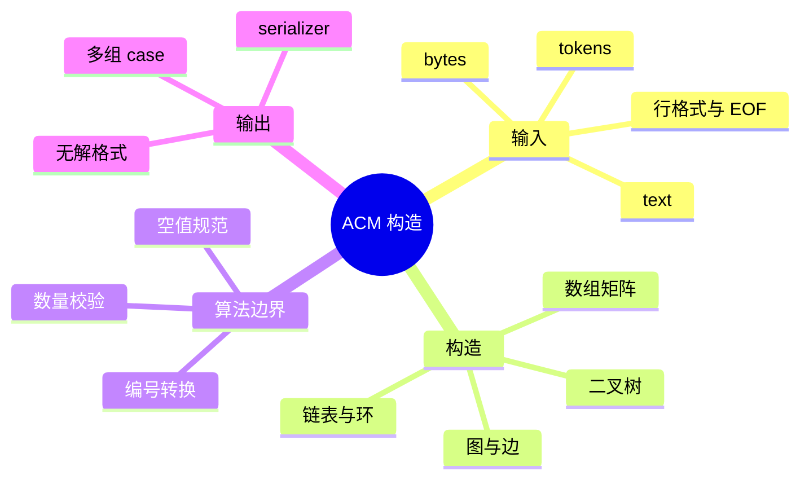

# ACM 模式如何构造数据结构

## 本节知识地图



核心代码模式会直接给你 `ListNode`、`TreeNode` 或二维数组；ACM 模式只给文本。你需要自己决定表示方式并完成转换。

通用流程：

```text
题面输入格式
  -> 读取行或 token
  -> 转成整数/字符串
  -> 选择表示方式
  -> 构造结构
  -> 调用算法
  -> 序列化答案
```

## 接口契约：输入、结构和输出三段式

ACM 程序不是“把 `input()` 写到能跑”为止，而是有三个明确边界：

```text
文本输入
  -> parser 解析并校验
  -> 内存数据结构
  -> algorithm 修改/查询
  -> serializer 序列化输出
```

### Parser 的责任

- 消费规定数量的 token 或行。
- 把字符串转换为整数、浮点或统一的空值标记。
- 校验数量、编号范围和行长度。
- 不把业务算法偷偷混进读取过程。

### 数据结构的责任

- 保持节点、边、队列或区间的不变量。
- 定义空结构和重复值。
- 提供算法需要的访问接口。

### Serializer 的责任

- 按题面要求输出顺序。
- 处理空结构。
- 删除不影响语义的尾部占位符。
- 不输出调试日志和额外空格。

### 输入元素必须先约定

| 输入元素 | 必须先约定 | 常见错误 |
|---|---|---|
| 数组 | n 是元素数还是行数 | 只读一行导致跨行输入漏读 |
| 矩阵 | rows、cols 和每行长度 | 使用共享内层列表 |
| 链表 | 空值、环入口 pos、节点编号 | 构造环后仍用普通遍历输出 |
| 树 | 层序还是边/父数组，null 写法 | 把数组下标关系误当层序语义 |
| 图 | 0/1-based、有向/无向、重复边 | 忘记无向反向边 |
| 操作序列 | 每条命令参数个数和输出时机 | pop 空结构或输出 debug |

## 输入读取的两种模式

### 按行读取

适合行本身有结构的输入：

```python
rows, cols = map(int, input().split())
matrix = [list(map(int, input().split())) for _ in range(rows)]
```

优点是直观；前提是题面保证每行正好对应一个逻辑单位。

### 按 token 读取

适合数组、树层序 token 或输入可能跨行：

```python
import sys

tokens = sys.stdin.buffer.read().split()
cursor = 0

def next_token():
    global cursor
    if cursor >= len(tokens):
        raise ValueError("unexpected end of input")
    token = tokens[cursor]
    cursor += 1
    return token

n = int(next_token())
values = [int(next_token()) for _ in range(n)]
```

显式游标可以清楚表示已消费位置，并在 token 不足时立即报错。

### 可复用 TokenReader

```python
class TokenReader:
    def __init__(self, raw):
        self.tokens = raw.split()
        self.index = 0

    def next(self):
        if self.index >= len(self.tokens):
            raise ValueError("unexpected end of input")
        token = self.tokens[self.index]
        self.index += 1
        return token

    def int(self):
        return int(self.next())

    def remaining(self):
        return len(self.tokens) - self.index
```

### 空值 token

树题常用 `null`、`None` 或 `#` 表示空节点。先统一为 Python `None`：

```python
def parse_optional_int(token):
    if token in {b"null", b"None", b"#"}:
        return None
    return int(token)
```

### 数量校验

不要只用 `assert` 做输入校验，因为优化模式可能移除 assert：

```python
if len(values) != n:
    raise ValueError(f"expected {n} values, got {len(values)}")
```

## 先判断是否真的需要“节点对象”

题目说“链表”不代表一定要创建 ListNode；题目说“树”也不代表一定要创建 TreeNode。

- 只处理节点值顺序：数组可能更简单。
- 父子关系固定且只做统计：邻接表可能比 TreeNode 更适合。
- 需要反转链表指针：创建 ListNode。
- 需要递归访问左右子树：创建 TreeNode。

表示方式应服务算法，不要为了“像题目”而增加对象。

## 一维数组

输入：

```text
5
3 1 4 1 5
```

```python
n = int(input())
nums = list(map(int, input().split()))
if len(nums) != n:
    raise ValueError("array length does not match n")
```

更可靠的版本不依赖 `assert`：

```python
n = int(input())
nums = list(map(int, input().split()))
if len(nums) != n:
    raise ValueError("array length does not match n")
```

如果数组可能跨多行，使用 token 读取：

```python
import sys

data = list(map(int, sys.stdin.buffer.read().split()))
n = data[0]
nums = data[1:1 + n]
if len(nums) != n:
    raise ValueError("not enough array values")
```

数组构造契约：

- `n=0` 时合法数组是 `[]`。
- 负数、重复值和 0 都是普通值，不能擅自当作空。
- 多出的 token 可能属于下一字段，不能静默丢弃。
- 算法原地修改后，要明确输出整个数组还是前 k 项。

### 多组数组

输入：

```text
2
3 1 2 3
2 8 9
```

```python
reader = TokenReader(sys.stdin.buffer.read())
case_count = reader.int()
cases = []
for _ in range(case_count):
    length = reader.int()
    cases.append([reader.int() for _ in range(length)])
```

每组数据必须重新创建列表、计数器和 visited，不能复用上一组的可变状态。

## 二维矩阵

```python
rows, cols = map(int, input().split())
matrix = [list(map(int, input().split())) for _ in range(rows)]
```

矩阵构造契约：

- `rows`、`cols` 是否可以为 0 要按题面处理。
- 每行必须有 `cols` 个元素。
- 坐标统一使用 `matrix[row][col]`。
- 不要使用 `[[0] * cols] * rows`，那会共享同一个内层列表。

```python
rows, cols = map(int, input().split())
matrix = []
for _ in range(rows):
    row = list(map(int, input().split()))
    if len(row) != cols:
        raise ValueError("matrix row length does not match cols")
    matrix.append(row)
```

### 网格邻居接口

```python
directions = [(-1, 0), (1, 0), (0, -1), (0, 1)]

def neighbors(row, col, rows, cols):
    for dr, dc in directions:
        next_row = row + dr
        next_col = col + dc
        if 0 <= next_row < rows and 0 <= next_col < cols:
            yield next_row, next_col
```

若空格是有效字符，不要用 `split()` 读取字符网格，因为它会丢掉连续空格。

坐标常用 `(row, col)`，访问顺序是先行后列：

```python
for row in range(rows):
    for col in range(cols):
        value = matrix[row][col]
```

## 构造单链表

### 节点定义

```python
class ListNode:
    def __init__(self, val=0, next_node=None):
        self.val = val
        self.next = next_node
```

链表构造接口：

| 函数 | 输入 | 输出 | 复杂度 |
|---|---|---|---:|
| `build_linked_list(values)` | 可迭代值 | 头节点或 `None` | O(n) |
| `linked_list_to_values(head)` | 无环链表 | 值列表 | O(n) |
| `build_cyclic_list(values, pos)` | 值列表和入口下标 | 头节点或 `None` | O(n) |

`pos=-1` 表示无环；若链表有环，序列化必须接收 `limit`，因为它没有自然 EOF。

### 数组转链表

```python
def build_linked_list(values):
    dummy = ListNode()
    tail = dummy

    for value in values:
        tail.next = ListNode(value)
        tail = tail.next

    return dummy.next
```

虚拟头节点 dummy 让空数组也能统一处理。

### 链表转数组输出

```python
def linked_list_to_values(head):
    values = []
    current = head

    while current is not None:
        values.append(current.val)
        current = current.next

    return values

values = [1, 2, 3]
head = build_linked_list(values)
print(*linked_list_to_values(head))
```

若链表可能有环，普通遍历会死循环，需要 visited 或步数限制。

### 构造带环链表

输入值数组和 `pos`，`pos = -1` 表示无环：

```python
def build_cyclic_list(values, pos):
    if not values:
        if pos != -1:
            raise ValueError("empty list cannot have a cycle entry")
        return None
    if not -1 <= pos < len(values):
        raise IndexError("cycle position out of range")

    nodes = [ListNode(value) for value in values]
    for index in range(len(nodes) - 1):
        nodes[index].next = nodes[index + 1]

    if pos != -1:
        nodes[-1].next = nodes[pos]

    return nodes[0]
```

构造后限制输出步数：

```python
def cyclic_prefix(head, limit):
    values = []
    current = head
    for _ in range(limit):
        if current is None:
            break
        values.append(current.val)
        current = current.next
    return values
```

## 构造二叉树

### 节点定义

```python
class TreeNode:
    def __init__(self, val=0, left=None, right=None):
        self.val = val
        self.left = left
        self.right = right
```

### 层序数组转树

输入：

```text
7
3 9 20 null null 15 7
```

`null` 表示缺少子节点。

```python
from collections import deque

def build_tree_level_order(tokens):
    if not tokens or tokens[0] == "null":
        return None

    root = TreeNode(int(tokens[0]))
    queue = deque([root])
    index = 1

    while queue and index < len(tokens):
        node = queue.popleft()

        if index < len(tokens) and tokens[index] != "null":
            node.left = TreeNode(int(tokens[index]))
            queue.append(node.left)
        index += 1

        if index < len(tokens) and tokens[index] != "null":
            node.right = TreeNode(int(tokens[index]))
            queue.append(node.right)
        index += 1

    return root
```

为什么要用队列？层序输入按照“当前节点的左孩子、右孩子”依次给出，队列保存下一批等待接收孩子的父节点。

树构造契约：

- 第一个 token 是 `null` 时，整棵树为空，后续 token 是否允许要按题面决定。
- `null` 只能表示缺失子节点，不能当作普通整数。
- 层序构造不是“数组下标 `2i+1`/`2i+2`”的堆语义；遇到 `null` 后仍要按队列消费后续父节点。
- 序列化时去掉末尾连续 `null` 不改变树；中间 `null` 不能删除。

### 树转层序数组

```python
def tree_to_level_order(root):
    if root is None:
        return []

    result = []
    queue = deque([root])

    while queue:
        node = queue.popleft()
        if node is None:
            result.append("null")
            continue

        result.append(str(node.val))
        queue.append(node.left)
        queue.append(node.right)

    while result and result[-1] == "null":
        result.pop()

    return result

tokens = ["3", "9", "20", "null", "null", "15", "7"]
root = build_tree_level_order(tokens)
print(" ".join(tree_to_level_order(root)))
```

末尾连续 null 不影响树结构，通常删除。

## 根据父节点数组构造树

有些题给每个节点的父节点：

```text
5
-1 0 0 1 1
```

`-1` 对应根，其他值是父节点编号。

```python
n = int(input())
parents = list(map(int, input().split()))
children = [[] for _ in range(n)]
root = -1

for node, parent in enumerate(parents):
    if parent == -1:
        root = node
    else:
        children[parent].append(node)
```

这类题通常直接用 children 邻接表，不必创建 TreeNode。

## 构造无向图

输入 n 个节点、m 条边：

```text
4 3
1 2
1 3
2 4
```

```python
n, m = map(int, input().split())
graph = [[] for _ in range(n + 1)]

for _ in range(m):
    u, v = map(int, input().split())
    if not 0 <= u <= n or not 0 <= v <= n:
        raise IndexError("vertex id out of range")
    graph[u].append(v)
    graph[v].append(u)
```

节点从 1 开始，因此分配 `n + 1` 个列表并空置下标 0。

## 构造有向图

```python
graph = [[] for _ in range(n)]
indegree = [0] * n

for _ in range(m):
    source, target = map(int, input().split())
    graph[source].append(target)
    indegree[target] += 1
```

不要加入反向边。拓扑排序需要同时记录入度。

图构造时还要提前决定：

- `n` 个节点是 `0..n-1` 还是 `1..n`。
- 是否允许自环和平行边。
- 0 权边和“无边”使用什么不同标记。
- 有向图是否需要入度数组。

## 构造带权图

```python
graph = [[] for _ in range(n + 1)]

for _ in range(m):
    u, v, weight = map(int, input().split())
    if not 0 <= u <= n or not 0 <= v <= n:
        raise IndexError("vertex id out of range")
    graph[u].append((v, weight))
    graph[v].append((u, weight))
```

统一使用 `(neighbor, weight)`，遍历时解包：

```python
for neighbor, weight in graph[node]:
    ...
```

若题面允许平行边，邻接表列表应保留所有 `(neighbor, weight)`；若题目要求只保留最小边，构造时显式比较，不能被字典覆盖的副作用带过。

## 邻接矩阵输入

输入本身就是 n 行 n 列时：

```python
n = int(input())
matrix = [list(map(int, input().split())) for _ in range(n)]
```

`matrix[u][v]` 可能表示是否有边，也可能直接表示权重。确认 0、-1 或 INF 分别代表什么。

## 操作序列构造设计类

输入：

```text
6
push 3
push 5
top
pop
empty
top
```

```python
operations = int(input())
stack = []
answers = []

for _ in range(operations):
    parts = input().split()
    operation = parts[0]

    if operation == "push":
        stack.append(int(parts[1]))
    elif operation == "pop":
        answers.append(str(stack.pop()))
    elif operation == "top":
        answers.append(str(stack[-1]))
    elif operation == "empty":
        answers.append("true" if not stack else "false")

print("\n".join(answers))
```

先读取操作名，再根据操作决定后面有几个参数。

### 操作序列的输出契约

- 只有题面要求输出的操作才写入 `answers`。
- `push/add` 通常不输出。
- `pop/top` 的空结构行为必须按题面处理。
- 多组测试用例要清空结构和答案列表。
- 最后一行是否需要换行不影响大多数评测，但不要输出额外空行和 debug 文本。

### 统一序列化

```python
def serialize_values(values):
    return " ".join(map(str, values))

def serialize_optional(value):
    return "null" if value is None else str(value)

def write_lines(lines):
    print("\n".join(lines))
```

把序列化集中到最后，避免算法内部混杂 print，便于切换输出格式。

## 一个完整示例：树的最大深度

```python
import sys
from collections import deque

class TreeNode:
    def __init__(self, val=0, left=None, right=None):
        self.val = val
        self.left = left
        self.right = right

def build_tree(tokens):
    if not tokens or tokens[0] == b"null":
        return None

    root = TreeNode(int(tokens[0]))
    queue = deque([root])
    index = 1

    while queue and index < len(tokens):
        node = queue.popleft()
        if index < len(tokens) and tokens[index] != b"null":
            node.left = TreeNode(int(tokens[index]))
            queue.append(node.left)
        index += 1
        if index < len(tokens) and tokens[index] != b"null":
            node.right = TreeNode(int(tokens[index]))
            queue.append(node.right)
        index += 1

    return root

def max_depth(root):
    if root is None:
        return 0
    return max(max_depth(root.left), max_depth(root.right)) + 1

def solve():
    tokens = sys.stdin.buffer.read().split()
    if not tokens:
        return
    count = int(tokens[0])
    root = build_tree(tokens[1:1 + count])
    print(max_depth(root))

if __name__ == "__main__":
    solve()
```

## 构造检查清单

1. 节点编号从 0 还是 1 开始？
2. 图是有向还是无向？
3. 边是否带权，元组顺序是什么？
4. 树输入是层序、父节点数组，还是边列表？
5. `null`、`-1`、`0` 各自代表什么？
6. 空结构怎样表示？
7. 输出需要值序列、层序数组还是逐行答案？

## 同一结构的不同题面格式

### 1. 链表：值序列 vs 节点边

值序列：

```text
1 2 3 4
```

默认构造为：

```text
1 -> 2 -> 3 -> 4 -> None
```

节点边格式：

```text
4
1 2
2 3
3 4
```

需要先建立节点表，再按边连接：

```python
nodes = {}
for _ in range(3):
    source, target = map(int, input().split())
    nodes.setdefault(source, ListNode(source))
    nodes.setdefault(target, ListNode(target))
    nodes[source].next = nodes[target]
head = nodes.get(1)
```

不要假定边列表第一列一定是头节点；题面可能另给 head。

### 2. 树：层序 null 格式

```text
1 2 3 null 4
```

含义是按队列给已有节点分配左右孩子，`null` 只占一个孩子位置。

### 3. 树：完全数组格式

若题面明确说是完全二叉树数组：

```text
[1, 2, 3, 4, 5]
```

才可以使用：

```python
left = 2 * index + 1
right = 2 * index + 2
```

若数组中间允许 null，这个公式仍可能成立，但必须按题面定义；不能把普通层序 token 自动当作“所有位置都存在”的完全树。

### 4. 树：前序 + null 标记

```text
1 2 null null 3 null null
```

递归消费 token：

```python
def build_preorder(tokens, index=0):
    if index >= len(tokens):
        raise ValueError("preorder tokens are incomplete")
    if tokens[index] in {"null", "#"}:
        return None, index + 1

    node = TreeNode(int(tokens[index]))
    node.left, index = build_preorder(tokens, index + 1)
    node.right, index = build_preorder(tokens, index)
    return node, index
```

调用方还应检查最终 `index == len(tokens)`，否则输入中存在未消费 token。

### 5. 树：父节点数组

```text
parent[0] = -1
parent[1] = 0
parent[2] = 0
```

这是多叉树关系，不自动提供 left/right 顺序。若题目要求二叉树，要额外规定：

- 每个父节点最多两个孩子。
- 第一个孩子放 left，第二个放 right。
- 多于两个孩子是非法输入。

### 6. 图：边列表

```text
n m
u v
```

先判断：

- 节点是否连续。
- 是否有向。
- 是否允许重复边。
- 是否允许自环。

再选择：

```python
graph = [[] for _ in range(n)]
```

还是：

```python
graph = {vertex: set() for vertex in vertices}
```

### 7. 图：有向无权

```python
graph = [[] for _ in range(n)]
indegree = [0] * n

for _ in range(m):
    source, target = map(int, input().split())
    if not 0 <= source < n or not 0 <= target < n:
        raise IndexError("vertex id out of range")
    graph[source].append(target)
    indegree[target] += 1
```

重复边是否重复增加入度，要按题面决定。若图被定义为简单图，构造时需要去重。

### 8. 图：无向带权

```python
graph = [[] for _ in range(n)]

for _ in range(m):
    u, v, weight = map(int, input().split())
    graph[u].append((v, weight))
    graph[v].append((u, weight))
```

如果权重可能为负，后续算法不能默认使用 Dijkstra；如果权重可能为 0，不能用 `if weight` 判断边存在。

### 9. 图：邻接矩阵

矩阵中：

- `0` 可能代表无边。
- `0` 也可能是合法零权边。
- `-1` 可能代表无边。
- `INF` 可能代表无边。

必须在 parser 中统一为一种内部表示：

```python
NO_EDGE = None
matrix = []
for _ in range(n):
    row = input().split()
    if len(row) != n:
        raise ValueError("matrix row length does not match n")
    matrix.append([
        NO_EDGE if token == "INF" else int(token)
        for token in row
    ])
```

### 10. 图：边编号与答案

有些题要求输出原边编号，而不是 `(u, v)`：

```python
for edge_id in range(m):
    u, v, weight = map(int, input().split())
    graph[u].append((v, weight, edge_id))
```

不要在排序或堆中丢掉 edge_id，否则无法恢复题目要求的输出。

---

## 多组测试用例

### 1. 明确 T

```text
3
2 1 2
0
3 7 8 9
```

解析：

```python
reader = TokenReader(sys.stdin.buffer.read())
test_cases = reader.int()
outputs = []

for _ in range(test_cases):
    n = reader.int()
    values = [reader.int() for _ in range(n)]
    outputs.append(str(sum(values)))

print("\n".join(outputs))
```

### 2. 没有 T 的多组数据

有些题以 EOF 结束：

```python
reader = TokenReader(sys.stdin.buffer.read())
outputs = []

while reader.remaining() > 0:
    n = reader.int()
    values = [reader.int() for _ in range(n)]
    outputs.append(solve_one(values))
```

必须确保每轮至少消费一个 token，否则会无限循环。

### 3. 每组状态隔离

下面这些对象都应在每组循环内创建：

- visited。
- graph。
- root/head。
- answer。
- 计数器。

只有只读配置和 parser 才适合跨用例共享。

---

## 操作序列：从文本模拟设计类

### 1. 先定义命令语法

```text
push x
pop
peek
size
```

接口表：

| 命令 | 参数 | 是否输出 | 空结构 |
|---|---|---|---|
| `push` | 1 个值 | 否 | 总能执行 |
| `pop` | 无 | 是 | 题面决定 |
| `peek` | 无 | 是 | 题面决定 |
| `size` | 无 | 是 | 0 |

### 2. 命令分派

```python
def execute_command(parts, structure):
    if not parts:
        raise ValueError("empty command")

    command = parts[0]
    if command == "push":
        if len(parts) != 2:
            raise ValueError("push expects one argument")
        structure.push(int(parts[1]))
        return None
    if command == "pop":
        return structure.pop()
    if command == "peek":
        return structure.peek()
    if command == "size":
        return len(structure)
    raise ValueError(f"unknown command: {command}")
```

### 3. 输出 None

如果题面规定空结果输出 `EMPTY`：

```python
result = execute_command(parts, structure)
if result is not None:
    answers.append(str(result))
```

如果 `None` 是合法数据值，就不能用 `None` 同时表示“命令不输出”；应返回 `(should_print, value)`。

### 4. LRU Cache 输入

典型命令：

```text
put key value
get key
```

需要同时维护：

- HashMap：key -> 节点。
- 双链表：最近使用顺序。

ACM 构造时要先解析命令，再调用设计类，不要把 LRU 的内部指针操作写在 parser 里。

---

## 序列化：把结构输出回题面

### 1. 链表序列化

无环链表：

```python
def serialize_list(head):
    values = []
    current = head
    while current is not None:
        values.append(str(current.val))
        current = current.next
    return " ".join(values)
```

契约：

- 空链表输出空行还是 `null`。
- 是否需要输出节点数。
- 是否允许尾部空格。

### 2. 树序列化

保留中间 null，删除末尾 null：

```python
def serialize_tree(root):
    if root is None:
        return "null"
    result = []
    queue = deque([root])
    while queue:
        node = queue.popleft()
        if node is None:
            result.append("null")
            continue
        result.append(str(node.val))
        queue.append(node.left)
        queue.append(node.right)
    while result[-1] == "null":
        result.pop()
    return " ".join(result)
```

### 3. 图序列化

图没有唯一自然输出，需要题面指定：

- 按节点输出邻居。
- 按输入边顺序输出。
- 按排序后的边输出。
- 输出邻接矩阵。

不要拿 DFS 顺序代替题目要求的边顺序。

### 4. 浮点输出

如果输出浮点数：

- 明确精度。
- 使用格式化而非直接依赖 Python 默认表示。
- 误差题按题面输出绝对/相对误差。

---

## 构造后的验证

### 链表

```python
def validate_list(head, expected_size):
    seen = set()
    current = head
    count = 0
    while current is not None:
        identity = id(current)
        if identity in seen:
            raise ValueError("unexpected cycle")
        seen.add(identity)
        count += 1
        current = current.next
    if count != expected_size:
        raise ValueError("list size mismatch")
```

### 树

验证：

- 根是否为空与输入一致。
- 节点数是否符合题面。
- 是否出现多余 token。
- BST 是否满足边界不变量。

### 图

验证：

- 每个端点都在编号范围。
- 无向边是否成对。
- 入度是否等于实际入边数量。
- 权重和无边标记没有混淆。

### 操作序列

验证：

- 每条命令参数数量。
- 未知命令。
- 空结构操作。
- 输出数量和顺序。

---

## ACM 面试表达

### Q1：为什么推荐 token reader

> ACM 输入可能跨行，按 token 读取能把空白统一处理，并通过 cursor 明确消费位置。parser 负责数量和类型校验，结构构造和算法分开，出现 WA 时能判断是读错、建错还是算错。

### Q2：层序树为什么要队列

> 层序 token 是按当前父节点的左孩子、右孩子顺序提供的。队列保存尚未填满孩子的父节点，每次弹出一个父节点消费两个 token；null 只表示该位置没有节点，但仍占一个孩子位置。

### Q3：为什么不能把树数组直接按 2i+1 建

> `2i+1/2i+2` 只适用于题面明确采用完全二叉树数组下标的表示。普通层序序列允许 null，后续 token 仍按有效父节点队列消费，不能把 token 下标当作节点下标。

### Q4：图构造最容易错什么

> 先确认 0/1-based、有向/无向、权重和重复边策略。无向边要加两个方向，有向边只加出边，入度要单独维护；0 权不能当作无边，矩阵中的无边标记也必须统一。

### Q5：环链表为什么不能普通输出

> 环没有自然结束条件，沿 next 一直走会死循环。构造接口需要 `pos`，序列化接口需要最大步数或 visited 身份集合，不能复用无环链表的 while current 逻辑。

---

## 综合构造练习

1. 写一个 token reader，解析多组数组并检查是否消费完全部 token。
2. 用同一组值序列构造无环链表和带环链表，分别安全序列化。
3. 实现层序 null、前序 null 两种树构造，并比较输出。
4. 给定父节点数组，构造多叉树并计算每个节点的孩子数。
5. 分别构造 0-based 有向图、1-based 无向图和带权图。
6. 对比重复边在列表、集合、矩阵三种表示中的不同结果。
7. 实现一个命令驱动的 MinStack，并为 pop 空栈定义输出协议。
8. 实现 LRU Cache 的 `put/get` 输入解析和逐行输出。
9. 对每种结构添加空、单元素、非法编号和多余 token 测试。
10. 把构造、算法、序列化拆成三个函数，替换其中一个而不改另外两个。

## 建议练习

## 可直接套用的 ACM 主程序骨架

### 1. 读入 -> 构造 -> 计算 -> 输出

```python
import sys

def parse(raw):
    reader = TokenReader(raw)
    n = reader.int()
    values = [reader.int() for _ in range(n)]
    if reader.remaining() != 0:
        raise ValueError("unexpected extra tokens")
    return values

def solve_one(values):
    return sum(values)

def serialize(answer):
    return str(answer)

def main():
    values = parse(sys.stdin.buffer.read())
    answer = solve_one(values)
    sys.stdout.write(serialize(answer))

if __name__ == "__main__":
    main()
```

把四个阶段拆开后：

- parser 出错时不需要检查算法。
- 算法可用手写列表直接测试。
- serializer 可以替换成层序、逐行或 JSON 风格。

### 2. 多组用例骨架

```python
def main():
    reader = TokenReader(sys.stdin.buffer.read())
    test_cases = reader.int()
    output = []
    for _ in range(test_cases):
        n = reader.int()
        values = [reader.int() for _ in range(n)]
        output.append(serialize(solve_one(values)))
    if reader.remaining() != 0:
        raise ValueError("extra input after all test cases")
    sys.stdout.write("\n".join(output))
```

如果题面以 EOF 结束，则用 `while reader.remaining() > 0`，但每一轮必须消费 token。

## 完整示例一：链表输入与反转输出

输入：

```text
5
1 2 3 4 5
```

```python
import sys

class ListNode:
    def __init__(self, value, next_node=None):
        self.value = value
        self.next = next_node

def build_list(values):
    dummy = ListNode(0)
    tail = dummy
    for value in values:
        tail.next = ListNode(value)
        tail = tail.next
    return dummy.next

def reverse(head):
    previous = None
    current = head
    while current is not None:
        following = current.next
        current.next = previous
        previous, current = current, following
    return previous

def serialize_list(head):
    values = []
    current = head
    while current is not None:
        values.append(str(current.value))
        current = current.next
    return " ".join(values)

def solve():
    tokens = sys.stdin.buffer.read().split()
    if not tokens:
        return
    n = int(tokens[0])
    if len(tokens) != n + 1:
        raise ValueError("invalid list input")
    head = build_list(map(int, tokens[1:]))
    sys.stdout.write(serialize_list(reverse(head)))

if __name__ == "__main__":
    solve()
```

构造、算法和输出互不依赖具体输入行数；测试时可直接调用 `build_list([1,2])`。

## 完整示例二：层序树输入与高度输出

输入：

```text
7
3 9 20 null null 15 7
```

推荐先把 token 数量校验完，再交给构造函数：

```python
def parse_tree_input(raw):
    tokens = raw.split()
    if not tokens:
        raise ValueError("missing tree size")
    count = int(tokens[0])
    values = tokens[1:]
    if len(values) != count:
        raise ValueError("tree token count does not match")
    return values

def tree_height(root):
    if root is None:
        return 0
    return 1 + max(tree_height(root.left), tree_height(root.right))
```

### 非法层序输入

```text
null 1
```

根为空时后续节点没有父节点。解析器应根据题面：

- 拒绝多余 token。
- 或明确忽略整棵树后的 token。

不要无提示地生成一棵与输入不一致的树。

## 完整示例三：边列表与连通分量

输入：

```text
5 3
0 1
1 2
3 4
```

```python
def read_undirected_graph(reader, n, m):
    graph = [[] for _ in range(n)]
    for _ in range(m):
        u, v = reader.int(), reader.int()
        if not 0 <= u < n or not 0 <= v < n:
            raise IndexError("vertex id out of range")
        graph[u].append(v)
        graph[v].append(u)
    return graph

def components(graph):
    visited = [False] * len(graph)
    count = 0
    for start in range(len(graph)):
        if visited[start]:
            continue
        count += 1
        stack = [start]
        visited[start] = True
        while stack:
            node = stack.pop()
            for neighbor in graph[node]:
                if not visited[neighbor]:
                    visited[neighbor] = True
                    stack.append(neighbor)
    return count
```

构造函数显式接收 n、m 和编号范围，算法只接收构造好的 graph，不再重复解释输入格式。

## ACM 中的性能边界

### 1. `input()` vs `sys.stdin.buffer`

- 少量交互式输入：`input()` 可读性好。
- 大量 token：`sys.stdin.buffer.read().split()` 通常更快。
- 使用 buffer 后 token 是 bytes，`int(bytes_token)` 可以工作，字符串比较要统一 bytes 或先 decode。

### 2. 输出缓冲

频繁 `print` 可能比先收集再一次输出慢：

```python
answers = []
for value in values:
    answers.append(str(value))
sys.stdout.write("\n".join(answers))
```

但答案非常大时也要考虑输出列表本身的内存。

### 3. 递归限制

树、图深度可能来自输入：

- 递归 DFS 在深链上可能 `RecursionError`。
- 可以改显式栈。
- 不要为了通过样例盲目 `sys.setrecursionlimit(10**7)`，过深仍可能耗尽 C 栈。

### 4. 内存估算

```text
邻接矩阵：O(n²)
邻接表：O(n + m)
TreeNode 对象：每节点还有对象和引用开销
Trie：节点数乘 children 表示成本
```

ACM 选择表示时同时看时间和内存上限。

## 输入构造的最终检查表

| 问题 | 写在代码哪里 |
|---|---|
| token 是否足够 | parser |
| 是否有多余 token | parser 末尾 |
| 编号范围 | 图构造 |
| 空节点标记 | 树 parser |
| 环入口是否合法 | 链表构造 |
| 重复边如何处理 | 图构造策略 |
| 空操作如何返回 | 设计类 |
| 输出哪些操作 | serializer |
| 多组状态是否隔离 | `solve_one` 外层 |
| 递归深度是否安全 | 算法实现选择 |

## ACM 面试表达：从零构造数据结构

### Q1：拿到一道 ACM 题先做什么

> 先把输入协议写出来：有几组、每组消费多少 token、编号从哪里开始、空值和权重如何表示。然后选择内部结构，写 parser 和构造函数，最后再写算法与 serializer。这样能把读入错误、结构错误和算法错误分开定位。

### Q2：为什么构造和算法要分开

> 同一个算法可以接受手写结构、LeetCode 节点或 ACM parser 的结果。分开后可以单独测试构造边界，也能替换输入格式而不修改核心算法，避免把题面特殊规则散落在遍历代码中。

### Q3：如何保证不会读错下一组数据

> 使用显式 TokenReader 和 cursor，每个 parser 消费规定数量并在组末检查剩余 token。多组循环内重置结构和答案；若以 EOF 结束，确保每轮至少消费一个 token，避免无限循环。

## ACM 构造的调试路径

### 1. 先打印消费位置

调试阶段可以暂时记录：

```python
print("cursor", reader.index, "remaining", reader.remaining(), file=sys.stderr)
```

提交前删除 stderr 调试输出，避免评测系统把它当成答案。

### 2. 再验证结构

```text
数组：len == n
矩阵：每行 len == cols
链表：节点数和 tail.next
树：根、孩子数和 token 是否消费完
图：端点范围、反向边、入度
操作序列：命令参数数量和输出数量
```

### 3. 最后验证算法

构造错误会让正确算法得到错误答案。要先用一个手算小样例确认内存结构，再用随机/边界样例确认算法。

## ACM 模式常见输入变化

| 变化 | 应对 |
|---|---|
| n=0 | 返回空结构，不访问 `tokens[0]` |
| 多余空格/空行 | token reader 自动忽略，行 parser 需按题面处理 |
| 负数 | 用 int 正常解析，不当作空标记 |
| null/None/# | 统一转成 None |
| 1-based 编号 | 分配 n+1 并明确 0 槽不用 |
| 大 n | 使用 buffer 读入，避免每 token 调 input |
| 多组 case | 每轮重置所有可变状态 |
| EOF 结束 | 每轮检查 remaining 并确保 cursor 前进 |

## ACM 结构构造的性能选择

### 线性数组

连续整数节点可使用列表：

```python
graph = [[] for _ in range(n)]
```

访问常数小，但需要预先知道 n，且编号不能越界。

### 字典映射

字符串或稀疏编号使用：

```python
graph = {}
graph.setdefault(source, []).append(target)
```

更灵活，但哈希和对象开销更高，遍历顺序也要显式定义。

### 对象节点

链表/树节点适合需要改指针的算法；只做值统计时，数组或邻接表通常更省内存。

## 最终 ACM 模板

```python
def parse_input(raw):
    # 只负责读取、类型转换和校验
    ...

def build_structure(parsed):
    # 只负责建立不变量
    ...

def solve(structure):
    # 只负责算法
    ...

def serialize(answer):
    # 只负责题面要求的输出格式
    ...
```

面试现场可以先写这四个函数名，再逐步填实现。这样比把所有逻辑堆进 `main` 更容易说明复杂度和边界。

## 章节终局

完成本章后，你应能拿到一份没有节点模板、只有文字输入的题目，独立完成：

1. 识别输入单位和终止条件。
2. 选择数组、节点、邻接表或字典表示。
3. 校验编号、数量、空值和权重。
4. 构造并验证结构不变量。
5. 调用与输入无关的核心算法。
6. 按题面顺序序列化答案。
7. 用空、单元素、极端规模和非法输入做自测。

## ACM 终局检查

```text
parser 是否消费正确数量
是否检查多余 token
空结构是否安全
编号是否统一
null/0/-1 是否分义
边是否有向、带权、重复
结构不变量是否验证
算法是否与输入格式解耦
输出是否只有题面要求内容
多组数据是否清空状态
```

## 混合输入的完整案例

题面可能把不同结构放在同一组输入中：

```text
3 4
1 2 3
0 1
1 2
2 0
3 4
```

解析时必须先写协议：

```text
第一行：n m
第二行：n 个权值
后 m 行：边列表
```

```python
reader = TokenReader(sys.stdin.buffer.read())
n, m = reader.int(), reader.int()
values = [reader.int() for _ in range(n)]
edges = [(reader.int(), reader.int()) for _ in range(m)]
if reader.remaining() != 0:
    raise ValueError("unexpected extra tokens")
```

不要按“读到换行”猜字段边界；token reader 只知道 token，不知道业务字段，字段数量必须由 parser 明确消费。

## ACM 输出协议示例

### 逐行输出

```python
for answer in answers:
    print(answer)
```

### 一行空格分隔

```python
sys.stdout.write(" ".join(map(str, answers)))
```

### 每组一行

```python
sys.stdout.write("\n".join(
    " ".join(map(str, answer))
    for answer in case_answers
))
```

`print(list)` 会输出 Python 方括号和逗号，通常不是题面要求的格式；序列化必须显式控制。

## ACM 最终面试题

### Q4：为什么 parser 不应该直接 print

> parser 只负责读取和校验，算法只负责转换状态，serializer 只负责输出。把 print 散落在读取和算法中会导致多组 case、条件输出和格式切换困难，也无法单独测试每一层。

### Q5：如何处理不确定的空标记

> 先把题面中的 null、None、# 等 token 统一转换成内部 None，再让结构构造函数只处理一种空值。不要让字符串、bytes、0 和 -1 在不同函数中混着表示空。

- 数组转链表，再反转并序列化。
- 层序 token 构建二叉树，再输出前序遍历。
- 边列表构建图，统计连通分量。
- 父节点数组构建多叉树，求树高。
- 操作序列模拟队列或 LRU Cache。

## ACM 构造的验收卡

### 读入层验收

```text
空输入是否允许
token 不足时是否明确报错
数量 n 是否为非负整数
声明 n 后实际是否恰好读取 n 项
行结构和纯 token 结构是否混用
多组数据结束条件是 T、EOF 还是哨兵
```

不要用 `assert` 代替输入校验：优化运行或某些评测环境会关闭断言。数量不一致时应抛出明确异常，便于在本地定位“算法错”还是“解析错”。

### 结构构造层验收

构造函数只接收已经解析好的内部类型，并验证自己的不变量：

- 链表检查索引范围，环入口必须位于节点数组中。
- 树检查空标记、子节点 token 消费位置和多余 token。
- 图检查顶点编号、边端点、方向和重复边策略。
- 堆检查数组是否需要原地 heapify，不能悄悄修改调用方仍在使用的列表。

### 算法与输出层验收

算法函数不读取 stdin、不打印调试信息，只接收结构并返回答案。输出函数再统一处理：

```text
标量       -> str(answer)
数组       -> " ".join(map(str, answer))
二维答案   -> 每行 join，再用 "\\n" 连接
无解       -> 按题面输出 -1、空行或固定字符串
```

本地测试至少准备：空 case、最小合法 case、数量多一个/少一个、重复值、负值、孤立图节点、单节点树和多组 case。最后删除调试输出，再用一次完整输入做端到端检查。

### 从零搭一个可复用主函数

```python
import sys

def solve(data: str) -> str:
    reader = TokenReader(data)
    t = reader.read_int()
    answers = []
    for _ in range(t):
        n = reader.read_int()
        values = [reader.read_int() for _ in range(n)]
        answers.append(run_algorithm(values))
    reader.ensure_exhausted()
    return "\\n".join(format_answer(x) for x in answers)

if __name__ == "__main__":
    sys.stdout.write(solve(sys.stdin.buffer.read().decode()))
```

这段骨架体现四个边界：`solve` 可单测、读取数量由题面驱动、算法不依赖全局输入、输出集中格式化。若题目用 EOF 分组，就把 `t` 换成“还有 token 时继续”；若用 `0` 哨兵，就在读取 n 后先判断终止值，不能把哨兵当成业务数据。

### 构造函数的失败语义

构造失败要区分“输入非法”和“合法但无解”：前者抛 `ValueError` 或返回解析错误，后者由算法返回空答案/`-1`。例如树的前序 token 少一个空标记属于输入非法；图没有从源到目标的路径属于合法输入下的无解。把两者混在一起，会让调试和评测输出都变得含糊。

### ACM 提交前的最后十秒

```text
删掉 print(reader)、调试日志和断言依赖
确认输出没有 []、逗号和多余标签
确认多组 case 之间只有题面要求的换行
确认递归深度、排序和内存符合 n 的上界
用最小样例手算一次 parser -> structure -> algorithm -> serializer
```

这套检查的目标不是写更多样板，而是保证同一套构造函数能被样例、单测和正式 stdin 复用。

若题面给出 1-based 编号，解析层就统一减一并在输出层加回；不要让算法内部一半使用 0-based、一半使用 1-based，这类偏移错误通常只在边界样例暴露。

编号转换也要写进接口文档，方便复查构造数据和序列化结果。

能把这条流水线独立测试，ACM 题就从“临场拼代码”变成“替换算法函数”。

```text
bytes -> text -> tokens -> structure -> answer -> text
```

---

[← 返回数据结构](../index.html) | [上一篇：进阶结构](../10-advanced-structures/index.html) | [下一章：核心算法 →]({{ '/02_algorithms/' | relative_url }})
