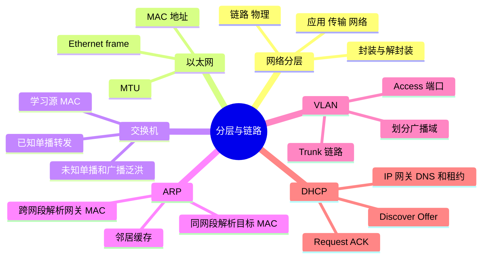
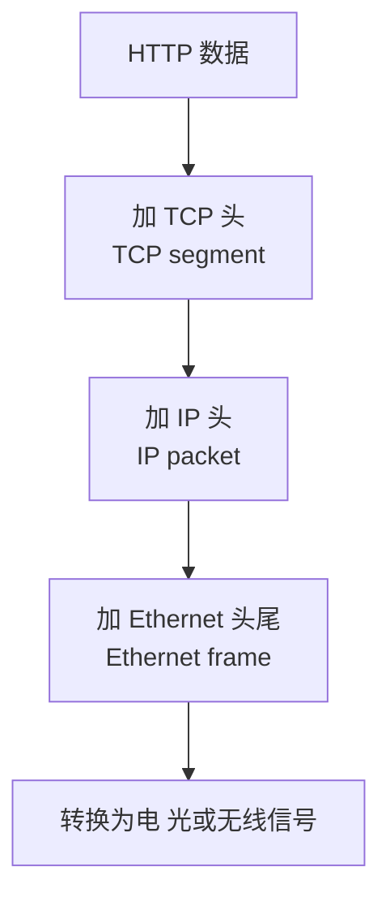
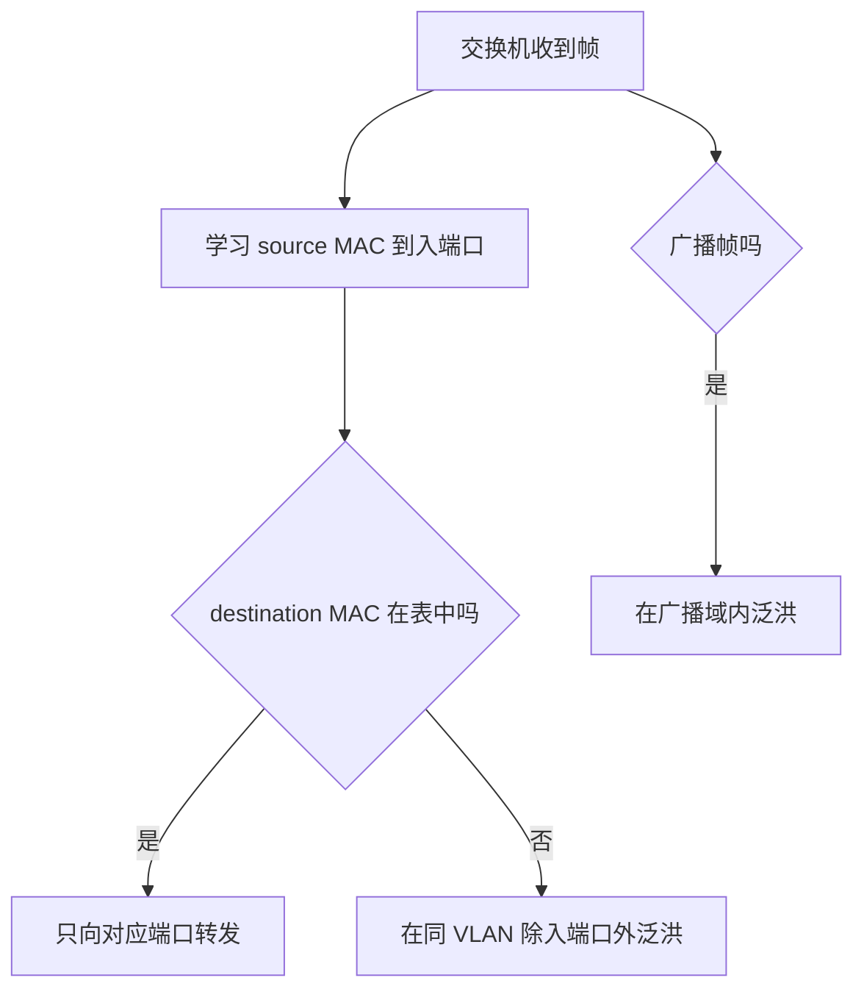
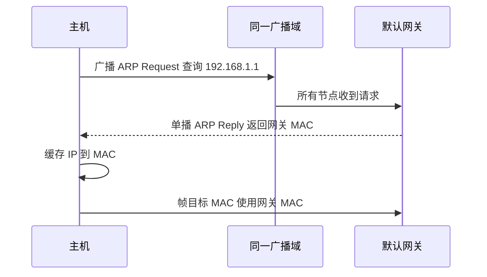

# 分层、以太网、MAC 与 ARP

## 本节知识地图



## TCP/IP 分层模型

常用四层视角：

| 层 | 主要职责 | 示例 |
|----|----------|------|
| 应用层 | 定义业务消息语义 | HTTP、DNS、SSH |
| 传输层 | 进程到进程传输 | TCP、UDP、QUIC |
| 网络层 | 跨网络寻址与路由 | IP、ICMP |
| 链路层 | 相邻链路上的帧传输 | Ethernet、Wi-Fi、ARP |

物理层处理电、光、无线信号，常在五层模型中单独列出。

## 封装与解封装

发送：



接收方根据头部的类型、地址、端口等字段逐层交给上层。

每层头部都是开销，也携带该层完成职责所需的控制信息。

## MTU

MTU 是链路层一次可承载的网络层数据包大小上限。以太网常见 MTU 为 1500 byte，但实际网络可能不同。

若路径某段 MTU 更小：

- IPv4 可能发生分片。
- 端点可通过 Path MTU Discovery 调整包大小。
- ICMP 被错误屏蔽可能造成 PMTU black hole。

传输层通常根据 MSS 避免 TCP segment 导致 IP 分片。

MTU、MSS 和应用消息长度不是同一个概念。

## 网卡与 MAC 地址

网卡负责链路层收发，并可能执行校验、分段、聚合等硬件卸载。

MAC 地址用于同一链路/二层网络中的帧传递。它不是全球路由路径，路由器转发到下一链路时会重新构造链路层头部。

## 交换机怎样转发

二层交换机学习源 MAC 所在端口：



广播帧会在广播域内转发。交换机把冲突域分开，但默认不隔离广播域。

## ARP 解决什么问题

主机知道下一跳 IP 后，需要知道同链路上的目标 MAC。

IPv4 ARP 简化过程：



关键点：

- 访问远端 IP 时，ARP 通常解析的是下一跳网关 MAC，不是远端服务器 MAC。
- ARP 只在本地二层范围传播，路由器不会把广播转发到互联网。
- 缓存有生命周期，错误或攻击可导致异常。

IPv6 使用 Neighbor Discovery，不使用 ARP。

## 同网段判断

主机用 IP 与子网掩码判断目标是否在本地网络：

- 同网段：直接解析目标链路地址。
- 不同网段：交给路由表选择的下一跳，通常是默认网关。

这需要下一课的 CIDR 和路由知识。

## VLAN

VLAN 在同一交换基础设施上划分逻辑二层网络和广播域。

- Access 端口通常属于一个 VLAN。
- Trunk 链路可携带多个带标签 VLAN。
- 不同 VLAN 通信需要三层路由。

VLAN 提供网络划分，不应单独当成完整安全边界；仍需 ACL、防火墙等策略。

## DHCP

主机可通过 DHCP 获取：

- IP 地址与子网掩码。
- 默认网关。
- DNS 服务器。
- 租约时间等配置。

经典过程常概括为 Discover、Offer、Request、ACK。初始客户端没有可用 IP，因此会使用广播等机制。

## 动手观察

下面从最基础的“网络在解决什么问题”开始，完整展开分层与链路层。

---

## 深入一：计算机网络是什么

### 1. Node

**直译**：节点。

网络中的计算设备：

- 客户端。
- 服务器。
- 交换机。
- 路由器。
- 防火墙。
- 负载均衡器。

### 2. Link

**直译**：链路。

直接连接相邻节点的通信媒介：

- 网线。
- 光纤。
- Wi-Fi 无线。
- 虚拟网卡与虚拟交换链路。

### 3. Protocol

**直译**：协议。

通信双方对消息格式、顺序和动作的共同约定。

一个协议通常规定：

- 字段如何编码。
- 谁先发送。
- 收到后如何响应。
- 出错或超时怎么办。

### 4. Packet Switching

**直译**：分组交换。

把数据拆成一个个分组，经共享网络逐跳转发：

```text
应用数据
  -> 若干网络包
  -> 经过不同设备
  -> 到达目标后重组/处理
```

优点：

- 多个通信流共享链路。
- 不必为每次通信预留完整专线。
- 路由可灵活选择。

代价：

- 排队。
- 丢包。
- 乱序。
- 延迟变化。

### 5. 网络不只是一根“透明水管”

数据会经过：

- 协议封装。
- 路由选择。
- 队列和缓冲。
- MTU 限制。
- 拥塞。
- 重传。
- 加密。

理解每一层解决什么，才能定位请求为什么慢或失败。

---

## 深入二：为什么网络要分层

### 1. 分层解决复杂度

如果应用必须同时处理：

- 电信号。
- 网卡地址。
- 路由。
- 丢包重传。
- 加密。
- 业务消息。

每个应用都将极其复杂。

分层让每一层只提供特定服务，并使用下层服务。

### 2. TCP/IP 四层

| 层 | 负责 | 常见协议/对象 |
|---|---|---|
| 应用层 | 业务消息和应用语义 | HTTP、DNS、SSH |
| 传输层 | 进程到进程 | TCP、UDP、QUIC |
| 网络层 | 跨网络寻址和转发 | IP、ICMP |
| 链路层 | 同一链路上的帧传递 | Ethernet、Wi-Fi、ARP |

### 3. 五层模型

把物理层单独列出：

| 层 | 数据单位直觉 |
|---|---|
| 应用层 | message |
| 传输层 | segment/datagram |
| 网络层 | packet |
| 链路层 | frame |
| 物理层 | bit/signal |

### 4. OSI 七层

OSI 还显式区分会话层、表示层等。现实互联网常用 TCP/IP 视角，但 OSI 有助于讨论职责。

不要纠结“TLS 必须算第几层”：

- 分层模型是理解工具。
- 真实协议可以跨越教科书边界。
- 重要的是说清它使用谁、向谁提供什么。

### 5. 每层看到什么

应用层通常关心：

- URL。
- 方法。
- JSON。

传输层关心：

- 端口。
- 序列号。
- 可靠性。

网络层关心：

- 源/目标 IP。
- 路由。
- TTL。

链路层关心：

- 源/目标 MAC。
- 帧类型。
- 校验。

---

## 深入三：封装与解封装

### 1. Encapsulation

**直译**：封装。

上层数据作为下层载荷，下层添加自己的头部：

```text
HTTP message
  -> 加 TCP 头
  -> TCP segment
  -> 加 IP 头
  -> IP packet
  -> 加 Ethernet 头尾
  -> Ethernet frame
  -> 变成物理信号
```

### 2. Decapsulation

**直译**：解封装。

接收端反向处理：

```text
物理信号
  -> 网卡得到 frame
  -> 链路层检查并去头尾
  -> IP 层检查并去 IP 头
  -> TCP 根据端口和序列处理
  -> 应用得到 HTTP 字节
```

### 3. Header

**直译**：头部。

保存该层控制信息：

- 地址。
- 类型。
- 长度。
- 序列号。
- 校验。
- 标志位。

### 4. Payload

**直译**：载荷。

该层真正承载的上层内容。

同一段字节：

- 对 TCP 是应用数据。
- 对 IP 是 TCP segment。
- 对 Ethernet 是 IP packet。

### 5. Overhead

每层头部占字节，也需要处理：

- 小消息中头部占比更高。
- 加密、隧道和多层封装还会增加额外头部。
- 这会影响有效 MTU 和吞吐。

### 6. 路由器是否处理所有层

普通路由转发主要处理到网络层：

- 去掉入链路帧。
- 查看 IP 目标和 TTL。
- 选择下一跳。
- 构造新的出链路帧。

它通常不会像目标应用一样解析完整 HTTP，但防火墙、代理和负载均衡器可能处理更高层。

---

## 深入四：以太网帧

### 1. Ethernet

**直译**：以太网。

常见局域网链路技术，规定帧格式、MAC 地址和链路传输相关规则。

### 2. 帧的概念字段

```text
Destination MAC
Source MAC
Type/Length
Payload
FCS
```

实际线上还有前导码、帧间间隔等物理/链路细节。

### 3. Destination MAC

告诉当前二层网络应该把帧交给哪个网卡或下一跳。

### 4. EtherType

指示载荷是什么：

- IPv4。
- IPv6。
- ARP。
- 其他链路上层协议。

### 5. FCS

**Frame Check Sequence。**

用于检测链路传输中的比特错误。

检测到损坏时帧通常被丢弃；以太网本身不负责像 TCP 那样端到端重传。

### 6. Unicast、Broadcast、Multicast

- 单播：一个目标 MAC。
- 广播：同一广播域所有节点。
- 多播：加入对应组的接收者。

广播太多会消耗整个广播域内设备资源。

---

## 深入五：MAC 地址

### 1. MAC

**MAC = Media Access Control。**

MAC 地址用于链路层标识接口和交付帧。

常写成 48 位十六进制：

```text
aa:bb:cc:dd:ee:ff
```

### 2. MAC 不是互联网端到端地址

跨路由器时：

```text
IP 源/目标通常保持端到端语义
MAC 源/目标在每一跳重新构造
```

客户端访问公网服务器时，不会学习公网服务器网卡 MAC，而只需知道本地下一跳网关 MAC。

### 3. MAC 是否永远全球唯一

不能绝对保证：

- 可软件修改。
- 虚拟机/容器会生成。
- 配置错误可重复。
- 隐私功能可能随机化。

链路内冲突才直接影响交付。

### 4. 网卡收帧

网卡通常检查目标 MAC：

- 是自身。
- 是广播。
- 是已加入多播。
- 或开启混杂模式。

满足条件才把帧交给主机网络栈。

---

## 深入六：交换机

### 1. Switch

**直译**：交换机。

二层交换机按 MAC 地址在端口间转发帧。

### 2. 学习源 MAC

交换机收到帧：

```text
source MAC = A
ingress port = 3
```

于是记录：

```text
A -> port 3
```

为什么学源地址：

- 来源端口是确定可观察的。
- 目标可能未知。

### 3. 已知单播

目标 MAC 在表中：

- 只向对应端口转发。
- 不必让所有端口都收到。

### 4. 未知单播

目标 MAC 不在表中：

- 在同 VLAN 除入端口外泛洪。
- 目标响应后，交换机学习其源 MAC。

未知单播不是永远广播，学习后可定向转发。

### 5. 广播帧

在同一 VLAN 广播域内泛洪。

路由器通常不会把普通二层广播跨网段转发。

### 6. MAC 表老化

设备可能移动或断开，动态表项需要超时：

- 长期没有看到源 MAC。
- 删除旧端口映射。
- 下次未知时重新学习。

### 7. 环路问题

二层帧没有像 IP TTL 那样普遍逐跳递减字段。交换网络出现环路时，广播/未知单播可能持续复制，形成广播风暴。

实际网络使用生成树、链路聚合和现代控制机制避免环路。

### 8. 冲突域与广播域

- 每个交换机端口通常分隔冲突域。
- 默认同 VLAN 仍属于一个广播域。
- 路由/VLAN 边界分隔广播域。

现代全双工交换以太网中，传统共享介质冲突已不常见，但概念仍用于理解演进。

---

## 深入七：ARP

### 1. ARP

**Address Resolution Protocol，地址解析协议。**

把同一二层范围内的 IPv4 下一跳地址解析为 MAC。

### 2. 为什么知道 IP 还不够

IP 层决定下一跳是谁，但网卡发以太网帧需要目标 MAC：

```text
下一跳 IP
  -> ARP
  -> 下一跳 MAC
```

### 3. 同网段目标

主机 A 访问同网段 B：

1. 路由判断 B 直连。
2. 查询邻居缓存。
3. 无记录则广播 ARP Request。
4. B 识别自己的 IP。
5. B 通常单播 ARP Reply。
6. A 缓存 IP -> MAC。
7. A 发目标 MAC 为 B 的帧。

### 4. 远端目标

A 访问公网服务器：

1. 路由判断目标不直连。
2. 选择默认网关作为下一跳。
3. ARP 查询网关 IP。
4. 得到网关 MAC。
5. Ethernet 目标 MAC = 网关。
6. IP 目标地址仍是远端服务器。

### 5. ARP Request 为什么广播

发送方正是因为不知道目标 MAC，无法定向发送，只能在本广播域询问所有节点。

### 6. ARP Reply 为什么通常单播

请求中已有发送方 MAC，响应者可直接回给请求方，减少其他节点处理。

### 7. 邻居缓存

ARP 结果会缓存：

- 避免每个包都广播。
- 条目有状态和生命周期。
- 失效后重新探测。

### 8. Gratuitous ARP

主机可主动通告自己的 IP/MAC 映射：

- 更新其他节点缓存。
- 检测地址冲突。
- 主备切换后宣告新位置。

### 9. ARP 欺骗

ARP 本身缺少强身份认证。攻击者可能发送伪造映射：

- 流量被错误转发。
- 中间人攻击。
- 连接中断。

可结合交换机安全功能、静态配置、加密协议等降低风险。

---

## 深入八：同网段判断与默认网关

### 1. 子网掩码

主机用：

```text
IP AND mask = network prefix
```

判断目标是否直连。

### 2. 同网段

```text
直接把目标作为下一跳
ARP 目标 IP
```

### 3. 不同网段

```text
查路由表
选择网关
ARP 网关 IP
```

### 4. 默认网关

没有更具体路由时使用的下一跳。

默认网关不是所有流量都必须经过：

- 同网段可直达。
- 回环流量不出主机。
- 更具体静态路由可能选其他网关。

### 5. 二层地址与三层地址同时存在

发送到远端：

```text
Ethernet destination = 下一跳网关 MAC
IP destination       = 最终服务器 IP
```

这是一道最重要的零基础理解题。

---

## 深入九：VLAN

### 1. Virtual LAN

**直译**：虚拟局域网。

在同一物理交换基础设施上划分多个逻辑二层广播域。

### 2. 为什么需要 VLAN

没有划分的大二层网络：

- 广播影响范围大。
- 故障和环路影响面大。
- 部门/租户难隔离。
- 地址与管理边界混乱。

### 3. Access Port

通常面向终端：

- 端口属于一个 VLAN。
- 终端帧通常不带 VLAN tag。
- 交换机内部按端口归属处理。

### 4. Trunk Port

交换机之间或连接支持多 VLAN 的设备：

- 一条链路承载多个 VLAN。
- 帧使用 802.1Q tag 标识 VLAN。

### 5. 不同 VLAN 如何通信

它们是不同二层广播域，需要三层设备：

```text
VLAN 10
  -> 路由器/三层交换
  -> VLAN 20
```

### 6. VLAN 与子网

工程上通常一个 VLAN 对应一个或多个明确三层子网，但：

- VLAN 是二层划分。
- IP 子网是三层寻址概念。
- 二者不是同一个字段或协议。

### 7. VLAN 不是完整安全边界

仍需：

- ACL。
- 防火墙。
- 认证授权。
- 安全配置。

错误 trunk/access 配置也可能造成越权或环路。

---

## 深入十：DHCP

### 1. Dynamic Host Configuration Protocol

**直译**：动态主机配置协议。

自动给主机提供：

- IP 地址。
- 子网掩码/前缀。
- 默认网关。
- DNS 服务器。
- 租约时间。
- 其他网络参数。

### 2. 为什么初始要广播

客户端刚接入时：

- 不一定有可用 IP。
- 不知道 DHCP 服务器地址。
- 因此使用特殊源/目标和广播完成发现。

### 3. DORA

#### Discover

客户端寻找 DHCP 服务器。

#### Offer

服务器提出地址与配置。

#### Request

客户端选择并请求某个 offer。

#### ACK

服务器确认租约。

### 4. Lease

**直译**：租约。

地址不是永久归客户端：

- 有有效期。
- 客户端需要续租。
- 离线后可回收再分配。

### 5. DHCP Relay

广播通常不跨路由器。企业网络可使用 relay：

- 接收本地客户端请求。
- 转发给远端 DHCP 服务器。
- 带上来源网络信息。

### 6. 常见问题

- 地址池耗尽。
- 重复地址。
- 错误网关或 DNS。
- VLAN/relay 配置错误。
- 租约续期失败。

---

## 深入十一：MTU 与 MSS

### 1. MTU

**Maximum Transmission Unit，最大传输单元。**

表示一段链路帧可承载的网络层包大小上限。以太网常见 1500 字节，但：

- VPN/隧道会占额外头部。
- 云网络与特殊链路不同。
- Jumbo Frame 可更大。

### 2. MSS

**Maximum Segment Size，最大报文段数据大小。**

TCP 在握手中通告愿意接收的 TCP payload 上限。

常见直觉：

```text
MSS ≈ MTU - IP header - TCP header
```

选项和隧道会改变实际头部。

### 3. 应用消息大小

一个 1 MiB HTTP body：

- 不是一个以太网帧。
- 不是一个 IP packet。
- TCP 会把字节流分成多个 segment。
- 网卡卸载会让本机抓包看到不同聚合形态。

### 4. 分片为何不理想

- 任一片丢失会影响整个原始包。
- 中间设备处理更复杂。
- 防火墙和 NAT 处理可能有困难。
- 重组消耗目标资源。

### 5. PMTUD

**Path MTU Discovery，路径 MTU 发现。**

端点尝试发现整条路径可承载的最大 IP 包，避免中间分片。

### 6. PMTU Black Hole

包过大又不允许分片，中间设备需要通过 ICMP 告知发送方。若 ICMP 被错误屏蔽：

- 小包成功。
- 大包静默丢弃。
- 连接建立但传大数据卡住。

这就是典型 PMTU black hole。

---

## 深入十二：一台主机发包到网关

假设：

```text
主机 IP：192.168.1.10/24
网关 IP：192.168.1.1
目标 IP：203.0.113.20
```

完整过程：

1. 应用产生数据。
2. 传输层添加端口等头部。
3. IP 层设置最终目标 `203.0.113.20`。
4. 主机用 `/24` 判断目标不直连。
5. 路由表选择网关 `192.168.1.1`。
6. 查询邻居缓存。
7. 若无记录，广播 ARP 查询网关 MAC。
8. 网关响应自己的 MAC。
9. 主机创建以太网帧。
10. 目标 MAC 填网关 MAC。
11. 目标 IP 仍填远端服务器 IP。
12. 交换机学习主机源 MAC。
13. 交换机按网关 MAC 转发。
14. 网关解开入站链路帧。
15. 网关继续执行 IP 路由。

这条链路必须能够不看答案口述。

---

## 补充面试题：直接背诵

### Q1：为什么要分层

> 分层把复杂通信拆成职责稳定的模块：链路层负责相邻传输，网络层负责跨网路由，传输层负责进程通信，应用层定义业务语义。每层使用下层并向上层提供接口，便于替换、演进和排障；代价是头部与层间处理开销。

### Q2：封装是什么

> 上层数据作为下层 payload，下层添加完成自身职责所需的 header。HTTP 数据加 TCP 头成为 segment，加 IP 头成为 packet，再加以太网头尾成为 frame；接收端按类型、地址和端口反向解封装。

### Q3：交换机如何转发

> 交换机根据收到帧的源 MAC 学习它位于哪个端口，再查目标 MAC。已知单播只发对应端口，未知单播在同 VLAN 泛洪，广播也在广播域内转发。动态表项会老化，二层环路还需专门机制避免。

### Q4：为什么知道 IP 还需要 ARP

> IP 地址用于网络层寻址和路由，而当前以太网链路发帧需要下一跳 MAC。主机先查路由：目标同网段就 ARP 目标，不同网段就 ARP 网关。ARP 只解决本地下一跳，远端服务器 MAC 不会穿越路由器。

### Q5：VLAN 与子网区别

> VLAN 在二层划分广播域，IP 子网在三层定义地址前缀。工程上常把一个 VLAN 对应一个子网，但它们属于不同层；不同 VLAN 通信需要三层路由，安全隔离还要配合 ACL 和防火墙。

### Q6：DHCP 做什么

> DHCP 自动分配 IP、前缀、网关、DNS 和租约。经典 DORA 是 Discover、Offer、Request、ACK。客户端初始没有完整配置，因此常通过广播发现；跨网段部署通常使用 DHCP relay。

### Q7：MTU 与 MSS 区别

> MTU 是链路能承载的网络层包上限，MSS 是 TCP 通告的单段应用数据上限，通常由 MTU 减去 IP/TCP 头得到。应用消息可以远大于二者，由 TCP 字节流拆成多个段。

### Q8：为什么小包通、大包不通

> 典型原因之一是路径 MTU 黑洞：某段链路 MTU 更小，过大包不能分片，设备发送的 ICMP Packet Too Big/Fragmentation Needed 又被屏蔽，发送端无法降低包大小。还要结合抓包和路径测试排除应用与防火墙问题。

---

## 补充理解检查

### 判断题

1. 网络分层表示每个设备都必须完整处理所有层。
2. 路由器每跳都保留原以太网源/目标 MAC。
3. 交换机只会广播所有帧。
4. ARP 用于查询远端公网服务器 MAC。
5. 同网段通信通常不需要默认网关。
6. VLAN 与 IP 子网是完全相同的概念。
7. DHCP 地址一定永久属于客户端。
8. 一个应用消息一定对应一个 TCP segment。
9. MSS 与 MTU 是同一个值。
10. ICMP 被屏蔽可能导致 PMTU black hole。

答案：1 错，2 错，3 错，4 错，5 对，6 错，7 错，8 错，9 错，10 对。

### 讲解题

1. 画出应用数据的五层封装。
2. 解释交换机为什么学习源 MAC 而不是目标 MAC。
3. 推演未知单播第一次与第二次传输。
4. 分别推演访问同网段和远端 IP 的 ARP 目标。
5. 画出 access、trunk 与跨 VLAN 路由。
6. 解释 DORA 每一步的目的。
7. 区分 MTU、MSS、TCP segment 与应用消息。

```bash
ip link
ip addr
ip neigh
ip route
tcpdump -n -e arp
```

清理或等待邻居缓存后访问同网段/远端地址，观察 ARP 请求的目标差异。

## 常见误区

- MAC 地址不负责互联网端到端路由。
- 远端服务器的 MAC 不会穿过多个路由器传到客户端。
- 交换机不是只会广播，它会学习 MAC 表。
- MTU、MSS 和应用消息长度不同。
- VLAN 划分广播域，不等于无需安全策略。

## 面试表达

**已知服务器 IP，为什么还需要 ARP？**

> IP 决定网络层目标和路由，实际在当前以太网链路发送帧还需要下一跳 MAC。主机先根据路由判断目标是否同网段；同网段解析目标 MAC，不同网段解析网关 MAC。ARP 映射只在本地广播域有效，路由器转发时会重写链路层头部。

**追问链**

1. 交换机怎样学习 MAC？
2. 未知单播怎样处理？
3. ARP 请求为什么是广播、响应通常是单播？
4. VLAN 与子网有什么关系？
5. MTU 太小会发生什么？

## 理解检查

1. 画出 HTTP 数据的封装顺序。
2. 解释访问公网 IP 时 ARP 查询谁。
3. 区分交换机、路由器和默认网关。
4. 说明 VLAN 为什么能缩小广播域。

---

[返回网络导学](../index.html) | [下一课：IP 与路由 →](../02-ip-routing/index.html)
