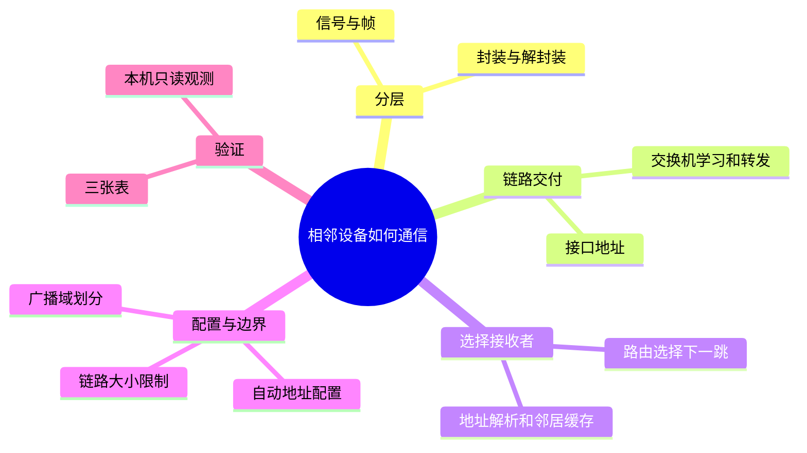
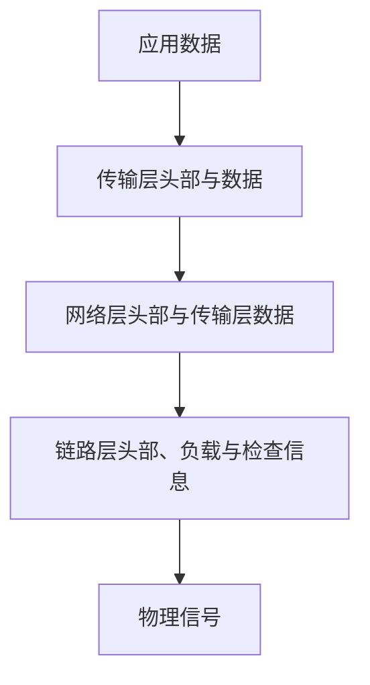
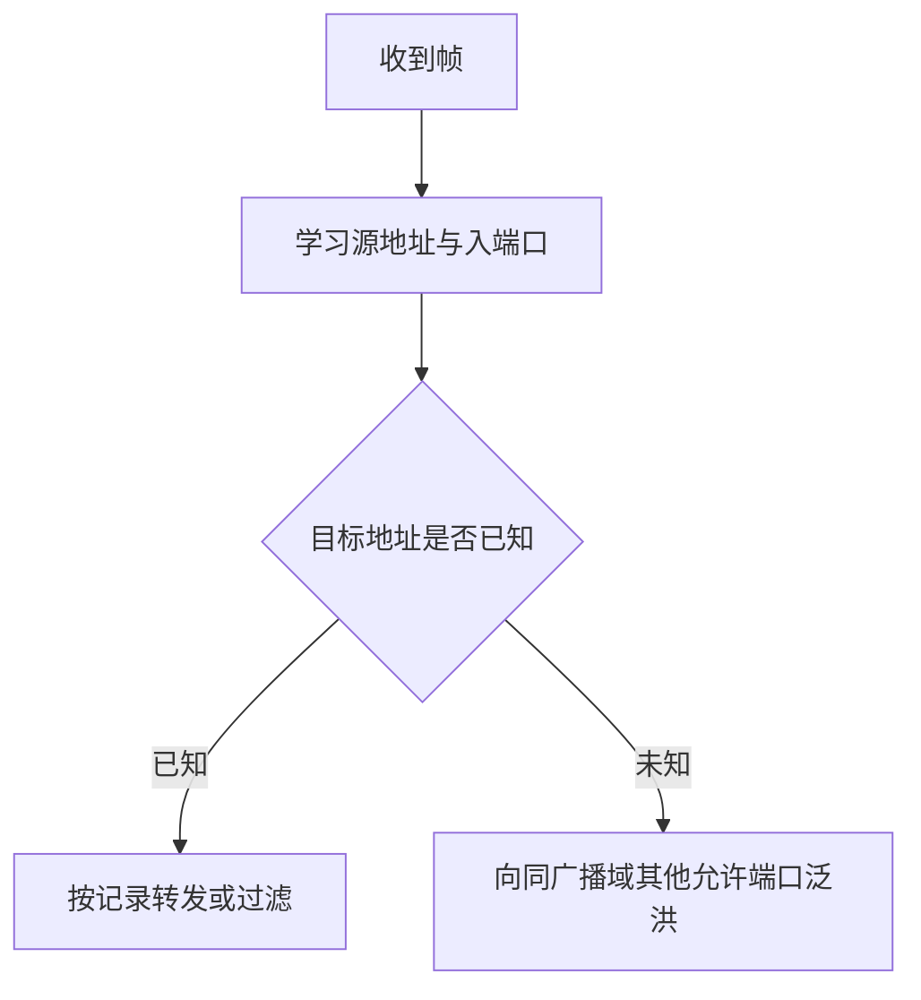
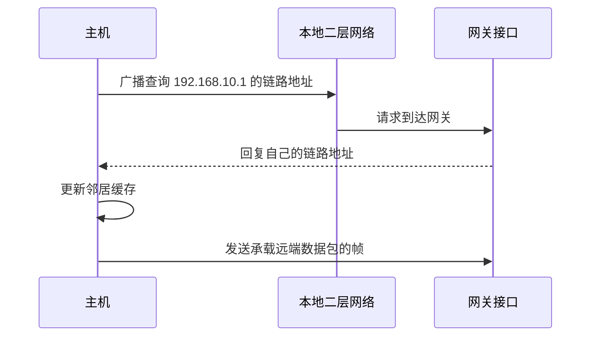

# 分层、以太网、MAC 与 ARP

你把电脑接到交换机上，想把一段文字交给另一台电脑。电缆能够传送信号，但它不知道文字从哪里开始、应该交给谁，更不知道对方是否理解这些信号。网络协议就是通信双方共同遵守的规则：约定数据格式、地址含义和收到消息之后的动作。

这一章从最小的通信场景出发：先让相邻设备交换数据，再解释怎样把数据交给通往远方的网关。学习前只需要知道程序能够产生字节序列。这里的字节（byte）是数据大小单位，在现代通用计算机中由八个二进制位（bit，每位只能为 0 或 1）组成。

[返回网络导学](../index.html)。下一章是 [IP、子网与路由](../02-ip-routing/index.html)，会进一步解释网关如何选择远端路径。

## 本节知识地图

先从能看懂的中文职责建立轮廓，图中的机制名称会在对应正文首次出现时展开。



## 一、从信号到可以识别的数据

把一台参与通信的设备称为节点（node），把两个节点之间能够传输信号的连接称为链路（link）。链路可以使用电缆、光纤或无线信号。物理连接只解决信号的传送，接收方还需要从连续信号中辨认出一份完整数据。

以太网（Ethernet）是局域网中常见的一组通信标准。局域网（Local Area Network，LAN）连接相对有限范围内的设备。以太网把要发送的内容放进帧（frame）：一份有边界、有发送者和接收者信息、能够检查传输错误的数据单元。帧里的业务内容叫负载（payload），用来说明怎样处理负载的控制信息放在头部（header）等位置。

这和直接发送一串字符不同。接收方先识别帧的结构，再决定是否接收负载、把负载交给哪个处理程序。帧的边界也不等于应用消息的边界：一条应用消息可能拆进多个帧，同一个帧也可能承载应用数据的一部分。

网络通常使用分组交换（packet switching）：把数据分成较小单元，让来自多个发送者的单元共享链路。共享提高了利用率，但也引入排队。当发送速度持续高于出口链路速度，设备缓冲区会逐渐填满，之后的数据可能被丢弃。因此，接通链路并不意味着数据必然立即到达。

## 二、为什么需要分层

假设程序既要理解消息内容，又要管理电信号、选择跨城路径、处理丢失重发，那么更换一种网卡都可能迫使应用重新实现整套通信逻辑。分层把这些变化分开：每层向上提供服务，并使用下一层完成更局部的工作。

网络层常用的 IP（Internet Protocol，互联网协议）给接口提供逻辑地址，并支持跨网络转发。传输层的 TCP（Transmission Control Protocol，传输控制协议）在此基础上向应用提供有序、可靠的字节流；UDP（User Datagram Protocol，用户数据报协议）则提供数据报传输，不自行保证重传和排序。端口是传输层用于区分通信端点的编号，让同一台机器上的多个应用能够同时使用网络。

这些名字现在只需要对应到职责，后续章节再展开内部机制。用一个五层视角看，数据依次经过：

| 层次 | 本层要回答的问题 | 本章需要掌握的边界 |
|------|------------------|--------------------|
| 应用层 | 这条消息是什么意思？ | 消息语义由应用协议约定 |
| 传输层 | 数据交给哪个通信端点，提供什么交付服务？ | 端口和传输状态属于这一层 |
| 网络层 | 目标地址在哪里，下一跳是谁？ | IP 地址支持跨网络寻址 |
| 链路层 | 在当前链路上把帧交给谁？ | 使用本地链路地址 |
| 物理层 | 怎样把比特变成信号？ | 负责电、光或无线信号 |

常见的 TCP/IP 四层模型把物理层并入链路层讨论。OSI（Open Systems Interconnection，开放系统互连）七层参考模型则进一步区分会话层、表示层等职责。模型帮助划分问题，不要求每个真实协议或设备都只对应一个格子。

### 封装是逐层添加处理说明

应用把数据交给传输层，传输层添加端口等信息；网络层再添加源、目标 IP 地址；链路层最后添加当前这一跳需要的地址和检查信息。这个过程叫封装（encapsulation）。接收方根据各层头部的类型字段，把负载交给对应的上层处理，称为解封装（decapsulation）。



头部占用的字节是协议开销（overhead）。它虽然不直接承载用户内容，却提供交付所需的信息。通常路由器不必理解完整应用消息就能转发数据，因为它主要依据网络层地址作决定；具有过滤、代理等功能的设备可能检查更多层次。

## 三、一帧怎样说明“交给谁”

网卡是主机收发链路数据的接口。MAC（Media Access Control，介质访问控制）地址是以太网用于识别链路接口的地址，常见长度为 48 位，写成六组十六进制数，例如 `02:00:00:00:00:10`。它用于当前二层网络中的帧交付，不能单独告诉路由器怎样走到远方的主机。

常见以太网帧含有以下信息。理解字段的作用，比先记所有字节数更有帮助：

| 字段 | 接收或转发时的作用 |
|------|------------------|
| 目标 MAC 地址 | 指定本次链路交付的接收者 |
| 源 MAC 地址 | 说明帧来自哪个链路接口 |
| EtherType（以太网类型字段） | 标识负载协议，帮助接收方分派处理 |
| 负载 | 承载网络层数据或其他协议内容 |
| FCS（Frame Check Sequence，帧校验序列） | 检查帧在传输中是否发生比特错误 |

校验失败通常导致帧被丢弃。检查错误不等于自动修复，也不保证整条端到端路径可靠。网卡可能承担部分检查、分段等工作，称为硬件卸载；观察抓包时，应考虑抓取位置是否在这些处理之前。

单播（unicast）面向一个接收者；广播（broadcast）面向同一广播域内的设备；组播（multicast）面向一个接收组。广播域是广播帧能够传播到的二层范围。网卡通常接收发给自身、广播以及所订阅组播的帧；混杂模式允许软件观察更多经过接口的帧，但不会让交换机凭空把所有其他端口的数据送来。

MAC 地址也不是永远不变、绝无重复的身份证。虚拟接口、随机化和软件配置都可能改变它。网络需要保证当前范围内的地址使用合理，而不能把地址本身当成可靠身份认证。

## 四、交换机靠学习建立转发表

交换机（switch）连接多个二层接口。假设电脑 A 接在端口 1，电脑 B 接在端口 2。交换机第一次收到 A 发出的帧时，即使不知道 B 在哪里，也已经获得一条证据：从端口 1 收到的帧，其源地址属于 A。它由此记录“源 MAC → 入端口”，并刷新这条记录的有效时间。

然后交换机查看目标 MAC。如果已有 B 对应端口的记录，就把帧转向该端口；如果目标就在入端口后方，通常无需再向别的端口转发。如果目标未知，交换机会把帧复制到同一广播域内允许转发的其他端口，这叫泛洪（flooding）。B 回复之后，交换机也能从回复的源地址学到 B 的位置。



广播帧本来就是发给整个广播域的，因此也会被传播到相关端口。交换表中的动态记录会老化，否则设备换端口后，陈旧记录可能长期影响转发。学习表回答的是“某个 MAC 在哪里”，它与主机稍后使用的“某个 IP 对应哪个 MAC”的表不同。

二层环路会让泛洪帧反复传播，还可能让同一个源地址在多个端口间来回出现，造成转发表抖动。网络需要生成树等机制阻断冗余转发路径。历史共享以太网中的冲突域描述可能发生发送冲突的范围；现代交换式全双工链路不再以碰撞作为正常介质访问方式，不能把冲突域和广播域混为一谈。

## 五、先决定下一跳，再解析链路地址

给接口配置 IP 地址时，还会指定网络前缀，用来表示哪些地址属于同一网络范围。子网掩码是表达这一范围的一种方式。例如 `192.168.10.20/24` 的 `/24` 表示前 24 位是网络部分，对应掩码 `255.255.255.0`。

在这个简单配置中，`192.168.10.30` 与本机处在相同前缀内，可以作为直接交付的目标；`203.0.113.8` 不在这个范围内，就需要查路由表选择下一跳。默认网关是没有更具体路由时使用的路由器接口，并不是所有数据都必须经过它。真实系统可能还有更具体的路由和策略，所以实际出口以路由查询为准。

决定下一跳后，主机还有一个缺口：知道它的 IP 地址，但以太网帧要求填目标 MAC。这就是 ARP（Address Resolution Protocol，地址解析协议）处理的问题：在本地链路上查询 IP 地址与链路地址之间的对应关系。

### 一次地址解析的先后顺序

假设下一跳是 `192.168.10.1`。主机先检查邻居缓存，看看是否已有可用映射；如果没有，就广播查询“谁使用这个地址”。拥有该地址的设备通常向查询者单播回复自己的链路地址。主机缓存映射，再用它构造要发送的帧。ARP 请求中本来就携带查询者的地址，因此被查询者通常知道回复交给谁。协议字段和接收流程见 [RFC 826](https://www.rfc-editor.org/rfc/rfc826)。



访问本地另一台主机时，解析的是该主机的地址；访问远端服务器时，通常解析的是本地下一跳网关的地址。**目标 IP 仍是远端服务器，目标 MAC 则是当前下一跳。**路由器收到帧后，会去掉当前链路封装，并按下一个出口重新构造链路封装。

邻居缓存会更新和失效，不能永久信任一次查询结果。主动发送地址公告的 Gratuitous ARP（免费 ARP，指无需对端先查询的地址公告报文）可用于帮助更新邻居状态、支持地址切换等场景。由于传统 ARP 缺乏内建的强身份验证，伪造映射可能干扰交付；静态配置或交换侧检查等防护需要结合网络实际部署。

这里讨论的是 IPv4（Internet Protocol version 4，互联网协议第四版）。IPv6（Internet Protocol version 6，互联网协议第六版）使用邻居发现协议处理相应问题，不使用 ARP。

## 六、同一台交换机上也能隔开广播

如果把所有设备放在同一个广播域，一台主机的广播会到达大量无关设备。VLAN（Virtual Local Area Network，虚拟局域网）让交换网络按逻辑划分二层范围：帧的学习和转发也要结合所属 VLAN，而不是只看地址。

接终端的 Access 端口通常把无标签流量归入配置好的一个 VLAN。连接交换机的 Trunk 链路可以同时携带多个 VLAN 的流量，通过标签区分所属网络；某些配置还允许特定 VLAN 使用无标签形式。这样两台交换机可以用同一条物理链路延伸多个逻辑网络。

VLAN 与子网不是同一概念：前者限定二层广播范围，后者描述三层地址前缀。工程中经常让一个 VLAN 对应一个子网，但这是设计选择。不同 VLAN 之间需要三层转发；若还要限制哪些服务能够互访，必须配置防火墙或 ACL（Access Control List，访问控制列表，即按规则允许或拒绝流量的机制），不能认为划分 VLAN 就完成了全部安全策略。

## 七、电脑刚接入时，地址从哪里来

前面的例子假定地址、前缀和网关已经配置好。DHCP（Dynamic Host Configuration Protocol，动态主机配置协议）负责自动提供这类配置。它可以分配地址，并通过选项提供子网掩码、网关和 DNS（Domain Name System，域名系统，负责域名解析）服务器等信息。

初次接入的客户端通常还没有可用地址，也不知道服务器在哪里，因此需要发现服务。典型交换可以用四个报文理解：Discover 发现服务，Offer 提供配置，Request 请求采用选中的配置，ACK（Acknowledgment，确认，在此表示服务器确认配置分配）完成确认。这四个步骤的首字母常被合称为 DORA（Discover、Offer、Request、Acknowledgment，发现、提供、请求、确认）。

地址是有租期的。客户端需要续租，并在无法继续合法使用地址时重新处理配置。并非每次续租都完整重复首次发现过程，也并非所有交换一律广播。服务器若在另一网络，DHCP Relay（DHCP 中继）可以转发客户端与服务器之间的消息。分配、租期和消息状态详见 [RFC 2131](https://www.rfc-editor.org/rfc/rfc2131)。

如果一台主机“连上网线但不能通信”，先检查它是否获得地址、前缀、网关，再检查本地链路解析。缺少网关通常影响远端访问；缺少可用的域名解析配置，则可能表现为直接访问地址可行而域名失败。这些不同现象不应统一归为交换机坏了。

## 八、帧能装多少：大小限制怎样影响应用

MTU（Maximum Transmission Unit，最大传输单元）是链路一次可承载的网络层数据包大小上限。常见以太网接口使用 1500 字节，但并非所有路径都相同；这里不包含整个以太网帧的全部头尾开销。

TCP 使用 MSS（Maximum Segment Size，最大报文段长度）描述单个报文段可承载的 TCP 数据大小。假设网络层和 TCP 头部均为 20 字节，而且没有其他额外头部，在 1500 字节 MTU 上，数据部分可以是 `1500 - 20 - 20 = 1460` 字节。这只是带明确假设的计算；加入选项或隧道后，可用大小会改变。

应用写入一条 10,000 字节的消息，不要求链路支持同样大的帧。传输过程可以把它分段。反过来，应用消息边界也不会由以太网帧自动保留给应用。区分应用消息、传输数据和链路负载，才能正确判断某个“长度”到底限制了哪一部分。

路径上最小的 MTU 决定不分片时能通过的包大小。IPv4 在条件允许时可以分片；如果禁止分片，大包遇到较小出口就不能照原样转发。PMTUD（Path MTU Discovery，路径最大传输单元发现）让端点根据路径反馈调整发送大小。经典方法使用 ICMP（Internet Control Message Protocol，互联网控制报文协议，承担差错通知等职责）返回的提示，见 [RFC 1191](https://www.rfc-editor.org/rfc/rfc1191)。

当大包被丢弃而必要反馈又不可达，就可能出现路径 MTU 黑洞：小请求能通过，较大的数据传输却停住。不过“小包通、大包不通”只是线索，也要检查过滤规则、封装和链路状态，不能仅凭一次失败便确认根因。

## 九、把完整路径走一遍

主机地址为 `192.168.10.20/24`，默认网关为 `192.168.10.1`，现在要把数据交给远端 `203.0.113.8`。先查路由，得到出接口和下一跳网关；再查邻居表，缺少映射时执行地址解析。两次查询解决不同问题：第一次选方向，第二次得到当前链路交付所需的地址。

主机构造的网络层数据包以远端地址为目标，而外层帧以网关的 MAC 为目标。交换机按地址学习和转发表把帧交给网关；网关再选择后续路径。每一跳都可能排队、丢弃或因为大小限制无法继续，可靠传输需要由后续章节介绍的机制进一步承担。

| 当前设备保存的状态 | 回答的问题 |
|--------------------|------------|
| 主机路由表 | 从哪个接口、经由哪个下一跳发送？ |
| 主机邻居表 | 这个下一跳在本地链路上的地址是什么？ |
| 交换机转发表 | 指定 VLAN 内的目标 MAC 位于哪个端口？ |

这三张表是本章的核心。它们都有“查不到”或“记录过时”的情况，但后续处理完全不同：路由缺失可能直接失败，邻居缺失可能触发查询，交换表缺失可能触发泛洪。

## 十、动手观察：先读表，再解释结果

下面使用 Linux 的 `ip` 命令查看本机状态。命令属于 `iproute2` 工具集；macOS 等系统的工具和输出不同。先执行只读查询，不需要更改网络配置：

```sh
ip -brief address
ip route
ip neigh
ip link
```

第一条帮助找到实际接口和地址，第二条显示路由，第三条显示邻居，第四条包含接口状态和 MTU。查看邻居表中的 `REACHABLE` 可理解为近期已确认可达，`STALE` 表示需要按后续使用重新确认，而不是立即断网；`FAILED` 表示解析或可达性探测失败。

再用 `ip route get <目标地址>` 查询系统如何选择出口，把占位符换成你有权访问的实际地址。对比本地目标和远端目标：直接连接的目标通常不用网关，远端目标可能显示 `via` 后的下一跳。命令显示的是路由选择结果，不证明远端应用一定可用。

如果需要主动验证，可向自己的网关发送少量 `ping` 探测，然后再次查看邻居表。这里的 `ping` 是诊断程序名称，使用控制报文探测往返；不回复可能来自过滤策略，不能单凭它断定设备不存在。本课没有在你的网络环境执行这些实验，输出应以实际机器为准。

## 常见误区

“知道 IP 就不需要 MAC”忽略了协议层次。在以太网中，路由决定下一跳后，仍需要链路地址完成本次交付；但这个地址通常不是远端服务器的 MAC。

“交换机向所有端口复制所有帧”也不准确。已知单播通常有定向转发路径；广播和未知单播需要按相应范围传播，而 VLAN、端口状态及规则会进一步约束这个范围。

“CRC 检查保证可靠”混淆了检测和恢复。CRC（Cyclic Redundancy Check，循环冗余校验）是计算帧检查值所使用的一类错误检测方法，检测出错后丢弃帧，并不自动让应用最终收到正确内容。

“同一个交换机就是同一个子网”则混淆了物理设备、二层范围和三层配置。判断通信路径要同时看端口所属网络、接口地址和路由，不能只看网线插在哪里。

## 面试表达

可以围绕一个具体发包场景回答：主机先根据目标 IP 查路由，确定出接口和下一跳；在以太网中再通过邻居表或 ARP 得到下一跳 MAC。交换机通过源地址学习建立转发表，按目标地址定向转发，或在相应广播域泛洪。远端目标的 IP 与当前帧的目标 MAC 属于不同层，网关转发时会重新构造链路层封装。

若继续追问大小限制，再说明 MTU 约束链路负载、MSS 约束 TCP 数据大小，并给出带头部长度假设的计算。这样能把地址、转发和性能问题串成同一个过程。

## 理解检查

1. 主机能访问同网段电脑，却不能访问远端地址。优先检查哪些状态？
2. 交换机没有目标 MAC 记录时，为什么仍可能把数据交给目标？
3. 主机第一次访问远端服务器，ARP 查询的是谁？目标 IP 会因此变成网关地址吗？
4. 1500 字节 MTU 是否表示应用只能发送不超过 1500 字节的消息？
5. 一个 DHCP ACK 能否直接证明远端服务可用？

第一题先区分是否缺少可用远端路由或网关、网关是否可达以及后续过滤问题，不必先怀疑本地链路全部失效。第二题依靠同广播域内的未知单播泛洪，回复后还可以学习源地址。第三题通常查询下一跳网关，网络层目标仍是远端服务器。

第四题不成立，应用消息可以经传输分段承载；第五题也不成立，配置分配成功只完成了接入流程的一部分，后续还需要地址交付、路由和应用处理正常。

下一章继续看：[IP、子网、路由、ICMP 与 NAT](../02-ip-routing/index.html)。其中 ICMP 已在本章解释；NAT（Network Address Translation，网络地址转换）是在转发中按规则修改地址等信息的机制，下一章会具体展开。

## 可观察实验

使用 `ip route`、`ip neigh` 和 `ip link` 查看本机路由、邻居和链路状态，再对比同网段与远端目标的下一跳。

## 术语卡片

| 缩写 | 全称 | 作用 |
|------|------|------|
| MAC | Media Access Control | 标识当前链路接口 |
| ARP | Address Resolution Protocol | 查询 IP 到链路地址的映射 |