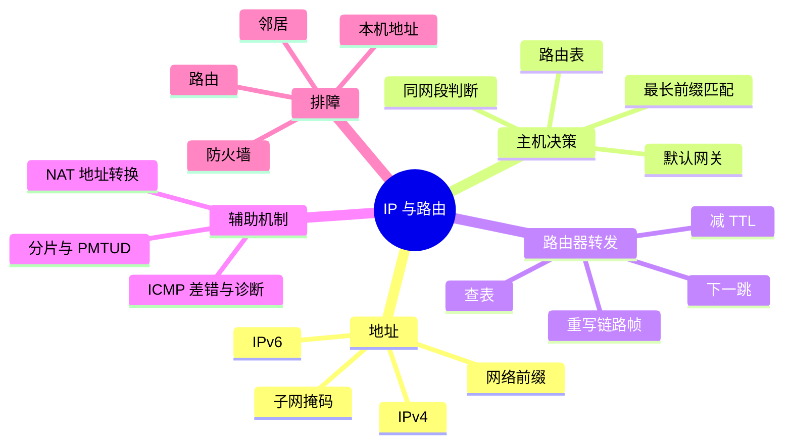
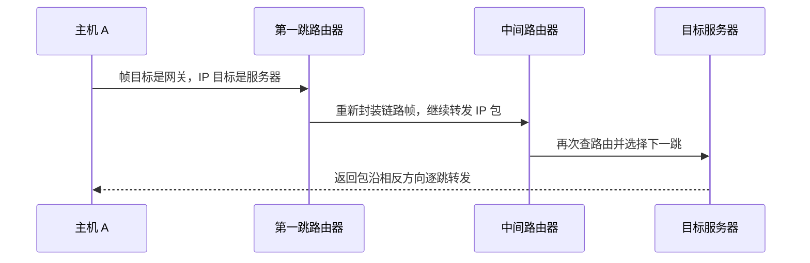

# IP、子网、路由、ICMP 与 NAT

上一章解决了“当前链路上交给哪个接口”。本章继续追问：目标不在本地网络时，主机怎样选择下一跳？数据包经过多个路由器时，每一跳到底改变什么？

`IP（Internet Protocol，互联网协议）`提供跨网络寻址和转发。它尽力把数据包送到目标 IP 地址，但不保证一定送达、按顺序送达或只送达一次。可靠性、排序和应用语义由更高层协议承担。

## 本章知识地图



## 一、IP 地址描述“哪一个网络中的哪一台接口”

IPv4（Internet Protocol version 4，互联网协议第四版）地址由 32 个二进制位组成，通常写成四个十进制字节。地址本身没有把“网络部分”和“主机部分”永久切开；前缀长度决定哪些位共同表示一个网络。

例如 `192.168.10.20/24` 中 `/24` 表示前 24 位是网络前缀。把地址与前缀按位相与，得到网络地址 `192.168.10.0`。`192.168.10.30/24` 与它共享同一网络前缀，所以在最简单的局域网配置中可直接交付；`192.168.11.30/24` 则需要通过路由器。

这只是主机作出“直接发送还是交给网关”决定的第一步。实际系统还会检查更具体的路由、策略路由、接口状态和邻居状态，不能只凭第三个或第四个地址数字猜测路径。

CIDR（Classless Inter-Domain Routing，无类别域间路由）用前缀长度表示网络范围，例如 `/16`、`/24` 和 `/32`。前缀越长，匹配范围通常越小、越具体。路由器可以同时保存一条大范围的汇总路由和一条只针对单个地址的主机路由。

## 二、路由表回答“下一跳从哪里走”

路由表的每条记录至少包含目标前缀、下一跳、出接口和度量等信息。主机发包时先查找所有能够覆盖目标 IP 的记录，再选择匹配最具体的那一条，这个规则叫**最长前缀匹配**。它比较的是前缀长度，不是字符串长度，也不是简单选择数值最大的网关。

假设路由表有：

```text
10.0.0.0/8      via 192.168.1.1
10.20.0.0/16    via 192.168.1.2
10.20.3.0/24    via 192.168.1.3
0.0.0.0/0       via 192.168.1.254
```

目标 `10.20.3.42` 同时匹配四条记录，但 `/24` 最长，因此选择 `192.168.1.3`。目标 `10.30.1.8` 匹配 `/8` 和默认路由，选择 `/8`。目标 `8.8.8.8` 只匹配默认路由，于是交给 `192.168.1.254`。

默认路由是“没有更具体记录时怎么办”，不是“所有数据永远发送到这里”。如果没有任何匹配记录，主机通常直接报告网络不可达；如果有匹配记录但下一跳解析失败，失败位置又不同。

路由器收到数据包后也按类似方式查表。它通常不关心完整的 HTTP 内容，只需根据目标 IP、接口状态、策略和路由协议结果选择下一跳。路由器不会把一条 IP 数据包原封不动地当作同一个以太网帧搬到远端；当前链路的帧被拆掉，下一条链路的帧会重新构造。

## 三、一次跨网段转发发生什么

假设主机 A 为 `192.168.10.20/24`，网关接口为 `192.168.10.1`，目标服务器为 `203.0.113.8`。主机先判断目标不在本地前缀内，于是查路由表得到网关作为下一跳。随后它通过 ARP（Address Resolution Protocol，地址解析协议）找到 `192.168.10.1` 对应的本地链路地址。

主机发送的 IP 数据包具有：

```text
源 IP：192.168.10.20
目标 IP：203.0.113.8
```

但当前以太网帧具有：

```text
源 MAC：主机 A 的接口地址
目标 MAC：网关接口的地址
```

网关收到帧后检查目标 IP，减小 TTL（Time To Live，生存时间，表示数据包允许经过的最大跳数），查下一张路由表，并在新出口上用新的链路层源、目标地址封装。源 IP 和目标 IP 通常仍表示端到端两端，链路地址则每一跳变化。



每个转发节点都可能排队、丢弃、过滤或因没有路由而失败。IP 层不会把这些失败自动变成应用可理解的重试；ICMP 有时会提供差错反馈，TCP 或应用也可能通过超时发现问题。

## 四、ICMP 是控制和差错反馈通道

ICMP（Internet Control Message Protocol，互联网控制报文协议）用于报告网络层观察到的差错和诊断信息。它不是 TCP 的替代品，也不是所有故障都必须返回 ICMP。

常见信息包括目标不可达、TTL 超时和需要分片但禁止分片。`ping` 使用回显请求和回显应答测试某个地址是否愿意响应；`traceroute` 则利用 TTL 逐步增加，让中间路由器返回超时信息，从而推测路径上的节点。

“没有 ping 回复”不能直接推出“主机不存在”：防火墙可以丢弃回显请求，路径可能只允许业务端口，或者返回报文在另一方向被过滤。诊断命令提供证据，不自动给出根因。

当路由器发现目标网络不可达，它可以返回目标不可达；当 TTL 归零，它可以返回超时。应用看到的最终现象可能只是连接超时，因此排障需要把应用错误、传输状态和 ICMP 反馈结合起来。

## 五、IP 分片和路径大小限制

不同链路的 MTU（Maximum Transmission Unit，最大传输单元）可能不同。发送方产生的 IP 数据包如果超过后续链路能够承载的大小，就必须分片、调整发送大小或失败。IPv4 分片会把一个数据包拆成多个片段，接收方再按标识和偏移重组；任何片段缺失，都可能导致整个原始数据包无法交给上层。

分片增加了状态和丢失影响，通常更希望端点提前发现路径的最小 MTU。PMTUD（Path MTU Discovery，路径最大传输单元发现）根据反馈调整包大小。若中间设备丢弃“需要分片”的 ICMP，又没有其他反馈，可能出现小包正常、大包卡住的 PMTU 黑洞。

传输层的 MSS（Maximum Segment Size，最大报文段长度）是另一层的大小约束。TCP 可以根据连接两端协商的 MSS 避免生成过大的 IP 包，但隧道、VPN 和额外头部仍可能让实际路径更小。不要把 MTU、MSS、TCP 数据长度和应用消息长度混成一个数字。

## 六、NAT 改写地址并维护映射

私有地址只在指定网络范围内有意义，不能直接作为互联网中的全局源地址。NAT（Network Address Translation，网络地址转换）设备在报文经过时按规则改写地址，有时还改写端口，并保存映射状态。

最常见的端口地址转换场景中，多台内网主机共享一个公网地址：

```text
内网 192.168.1.20:53000
        ↓ 映射
公网 198.51.100.5:41001
```

返回流量到达 `198.51.100.5:41001` 时，NAT 根据映射表还原到内网主机。映射需要超时和资源管理，因此长时间空闲的连接可能失效；同一个公网端口是否能复用，也取决于协议和实现。

NAT 不是单纯的“安全墙”。它会阻止没有匹配映射的入站连接，这带来一定隐藏效果，但真正的访问控制应由防火墙策略明确表达。NAT 还会破坏端到端可达性，使协议需要额外的打洞、中继或显式端口映射机制。

应用层携带地址时，NAT 可能无法自动修改所有内容；协议若包含校验和、加密或嵌入式地址，就需要专门的辅助机制。IPv6 不等于绝对不使用地址转换，是否部署取决于网络设计，但地址转换不应被当作解决所有寻址问题的默认答案。

## 七、排障：沿决策链逐层缩小范围

遇到“某个地址访问不了”，建议按下面的因果顺序检查：

1. 本机接口是否有正确 IP、前缀和状态。
2. 路由表是否存在覆盖目标的记录，最长前缀选择是否符合预期。
3. 下一跳是否在本地链路可解析，邻居表是否失败或过期。
4. 本机和网关是否允许该类型的 ICMP 或业务流量。
5. 路径中是否存在错误路由、MTU 黑洞、NAT 映射失效或 ACL（Access Control List，访问控制列表）阻断。
6. 目标主机是否收到数据，传输层端口和应用服务是否真正监听。

Linux 上可以用以下只读命令观察前三步：

```sh
ip -brief address
ip route get 203.0.113.8
ip neigh
traceroute 203.0.113.8
```

命令输出要结合执行时间和目标环境解释。`traceroute` 的某一跳不回复，不代表后续业务一定经过该跳失败；有些路由器只过滤诊断报文，仍会转发普通业务包。

## 常见误区

“路由器修改目标 IP 才能逐跳转发”混淆了 IP 地址和链路地址。通常每一跳重新构造链路帧，而目标 IP 仍然是最终目标；NAT 等特殊功能才会按规则改写 IP。

“默认网关就是所有数据的唯一出口”忽略了最长前缀匹配。只要存在更具体的路由，系统就会选择它。

“ICMP 被禁用就没有网络”也不准确。ICMP 影响诊断和部分差错反馈，业务是否可用还取决于具体协议、端口和过滤规则。

“NAT 提供了可靠安全边界”则把地址映射和访问控制混为一谈。NAT 的核心是改写和映射，安全策略需要防火墙明确配置。

## 面试表达

可以从跨网段发包完整回答：主机用本地前缀判断目标不在同网段，查路由表并按最长前缀匹配选择下一跳；再用 ARP 得到网关的链路地址。IP 数据包携带端到端地址，当前链路帧携带本跳地址，路由器每一跳减 TTL、查表并重新封装。ICMP 提供差错和诊断反馈，NAT 则按映射规则改写地址和端口并维护状态。

## 理解检查

1. 为什么目标 IP 是远端服务器，但第一跳帧的目标 MAC 是网关？
2. 两条路由同时匹配时，为什么选择最长前缀？
3. `ping` 失败能否证明目标主机宕机？为什么？
4. 为什么 MTU、MSS 和应用消息长度不是同一个概念？
5. NAT 映射为什么需要超时和状态表？

## 可观察实验

先用 `ip route get` 比较同网段和远端地址的下一跳，再查看 `ip neigh` 是否出现网关映射。用 `tracepath` 或 `traceroute` 观察路径时，记录每一跳的响应差异，并区分“路由器不回复诊断报文”和“业务数据无法继续转发”。

## 术语卡片

| 缩写 | 英文全称 | 中文名称 | 本章作用 |
|------|----------|----------|----------|
| IP | Internet Protocol | 互联网协议 | 跨网络寻址和转发 |
| CIDR | Classless Inter-Domain Routing | 无类别域间路由 | 用前缀长度描述网络范围 |
| ICMP | Internet Control Message Protocol | 互联网控制报文协议 | 报告差错并提供诊断 |
| NAT | Network Address Translation | 网络地址转换 | 改写地址或端口并维护映射 |
| MTU | Maximum Transmission Unit | 最大传输单元 | 限制链路可承载的 IP 包大小 |
| TTL | Time To Live | 生存时间 | 限制数据包可经过的跳数 |
