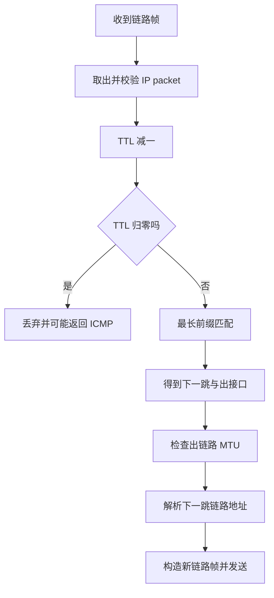
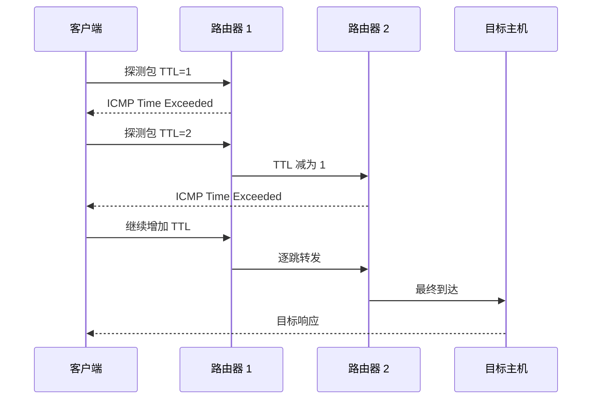

# IP、子网、路由、ICMP 与 NAT

## IP 层解决什么问题

链路层负责相邻网络，IP 提供跨多段网络的寻址和尽力转发。

“尽力”意味着 IP 本身不保证：

- 一定送达。
- 按序到达。
- 不重复。
- 固定延迟。

可靠性由需要它的上层协议和应用补充。

## IPv4 与 CIDR

IPv4 地址是 32 bit。CIDR 写法：

```text
192.168.1.34/24
```

`/24` 表示前 24 bit 是网络前缀，剩余 8 bit 是主机部分。

该地址所在网络通常是：

```text
192.168.1.0/24
```

包含 256 个地址，但传统子网中网络地址、广播地址等会影响可分配主机数。

## 子网判断

概念计算：

```text
IP AND 子网掩码 = 网络前缀
```

两个地址与同一掩码计算后前缀相同，就在该子网。

不要用字符串前三段相同来判断，只有 /24 时才碰巧类似。

## 路由表

路由项通常包含：

- 目标前缀。
- 下一跳。
- 出接口。
- metric/优先级。

选择使用最长前缀匹配：

```text
10.0.0.0/8
10.1.0.0/16
10.1.2.0/24

目标 10.1.2.9 选择 /24
```

更长前缀表示更具体的路由。

默认路由 `0.0.0.0/0` 在没有更具体项时匹配。

## 路由器转发

简化步骤：



1. 校验并读取目标 IP。
2. TTL 减一，若归零则丢弃并可能返回 ICMP。
3. 查路由表选择下一跳和出接口。
4. 根据出链路 MTU 处理。
5. 解析下一跳链路地址。
6. 构造新的链路层帧发送。

路由器不会修改普通转发包的端到端目标 IP；NAT 是额外转换机制。

## TTL

TTL 防止路由环路中的包无限循环。每经过一个三层转发节点通常减一，归零后丢弃。

traceroute 利用逐渐增加 TTL，并观察中间路由器返回的 ICMP 超时消息来推断路径。



## ICMP

ICMP 用于网络层控制和错误报告，例如：

- Echo Request/Reply：ping。
- Time Exceeded：traceroute。
- Destination Unreachable。
- Packet Too Big / Fragmentation Needed：路径 MTU。

ping 不通可能只是 ICMP 被过滤；ping 通也不代表目标应用端口开放。

## NAT

NAT 修改地址，NAPT/PAT 还会修改端口，让多个内网连接共享公网地址。


设备维护连接映射，返回包根据映射还原。

影响：

- 破坏端到端可达性。
- 入站连接需要端口映射或穿透。
- 状态超时会影响长时间空闲连接。
- 不能把 NAT 等同防火墙，安全策略仍需明确。

## 公网、私网与回环

常见特殊范围：

- 私有地址用于内部网络，不能直接在公网路由。
- 127.0.0.0/8 用于本机回环。
- 链路本地等其他特殊用途范围。

面试不必死背所有网段，但应知道地址可能有特殊语义。

## IPv6 为什么出现

IPv6 提供更大地址空间，并重新设计头部、邻居发现和自动配置等机制。

关键区别不应简化成“地址更长”：

- 128 bit 地址。
- 不使用广播和 ARP，使用多播与 Neighbor Discovery。
- 路由器不进行 IPv4 式分片。
- 扩展头承载可选功能。

## 分片与 Path MTU

IP 包大于出链路 MTU 时：

- IPv4 路由器在允许时可能分片。
- 设置 DF 时返回需要分片/包过大信息。
- IPv6 由发送端处理分片。

分片中任一片丢失可能导致整包无法重组，因此 TCP 通常根据 MSS 和 PMTU 避免。

## 动手观察

下面从 IPv4 二进制和子网计算开始，把跨网络转发逐步展开。

---

## 深入一：IP 层为什么存在

### 1. 链路层的范围

Ethernet/Wi-Fi 主要解决一个本地链路或广播域内的交付。

互联网由大量不同链路组成：

```text
客户端局域网
  -> 运营商网络
  -> 骨干网络
  -> 云数据中心
  -> 服务器子网
```

需要一种跨越不同链路的统一寻址和逐跳转发协议。

### 2. Internet Protocol

**直译**：网际协议。

IP 提供：

- 全局层次化地址。
- 数据报格式。
- 逐跳路由。
- TTL/Hop Limit。
- 尽力交付。

### 3. Best Effort

**直译**：尽力而为。

IP 本身不承诺：

- 一定送达。
- 按发送顺序到达。
- 不重复。
- 固定时延。
- 端到端加密。

可靠、有序和加密由 TCP、QUIC、TLS 或应用按需补充。

### 4. Datagram

每个 IP 数据报包含独立目标地址，路由器通常逐包查表转发。

不同包可能：

- 走不同路径。
- 经历不同排队。
- 乱序到达。

### 5. 为什么地址要分层

若每台路由器都为互联网上每个主机保存一条独立路由，表规模和更新成本巨大。

CIDR 前缀允许聚合：

```text
大量连续地址
  -> 用一个前缀表示
```

这是 IP 可扩展路由的重要基础。

---

## 深入二：IPv4 地址

### 1. 32 位

IPv4 地址共 32 bit，常写成四个十进制八位组：

```text
192.168.1.34
```

每段 0 到 255。

### 2. 点分十进制只是表示

```text
192      168      1        34
11000000 10101000 00000001 00100010
```

路由和子网计算实际基于 bit 前缀，不是字符串。

### 3. 网络部分与主机部分

CIDR：

```text
192.168.1.34/24
```

表示：

- 前 24 位是网络前缀。
- 后 8 位是该前缀内地址编号部分。

### 4. Prefix Length

**直译**：前缀长度。

常见：

```text
/8  -> 8 个网络位
/16 -> 16 个网络位
/24 -> 24 个网络位
/32 -> 单个 IPv4 地址
/0  -> 匹配所有 IPv4 地址
```

前缀越长，匹配范围越小、越具体。

### 5. 子网掩码

前缀位为 1，主机位为 0：

```text
/24 = 255.255.255.0
/26 = 255.255.255.192
```

`/26` 最后一个八位组：

```text
11000000 = 192
```

---

## 深入三：子网手算

### 1. 网络地址

```text
network = IP AND mask
```

例：

```text
IP   192.168.1.70
mask 255.255.255.192 (/26)
```

最后一段：

```text
70  = 01000110
192 = 11000000
AND = 01000000 = 64
```

网络前缀：

```text
192.168.1.64/26
```

### 2. 子网大小

主机位数：

```text
32 - 26 = 6
```

地址总数：

```text
2^6 = 64
```

范围：

```text
192.168.1.64
到
192.168.1.127
```

### 3. 网络地址与广播地址

传统 IPv4 子网：

- 主机位全 0：网络地址 `.64`。
- 主机位全 1：定向广播地址 `.127`。
- 常规可分配范围 `.65` 到 `.126`。

可分配数量常写：

```text
2^host_bits - 2
```

但 `/31` 点对点链路和 `/32` 主机路由有特殊用途，不能把减 2 当所有前缀绝对规则。

### 4. 快速块大小法

`/26` 掩码最后段 192：

```text
块大小 = 256 - 192 = 64
```

网络边界：

```text
0, 64, 128, 192
```

70 落在 64 到 127。

### 5. 判断同网段

两端各自用本地配置前缀计算。不能只看前三段：

- `/24` 时前三段相同通常同网段。
- `/20` 会跨多个第三段。
- `/26` 即使前三段相同也可能不同子网。

### 6. 配置不一致

主机 A 和 B 若掩码配置不同：

- A 认为 B 直连并 ARP。
- B 可能认为 A 需要走网关。
- 出现单向、非对称或诡异连通问题。

---

## 深入四：路由表

### 1. Route

**直译**：路由。

路由项通常包含：

- 目标前缀。
- 下一跳。
- 出接口。
- metric/优先级。
- 来源或协议。
- 可能的策略属性。

### 2. Directly Connected Route

接口配置地址后，系统通常得到直连前缀：

```text
192.168.1.0/24 dev eth0
```

目标在该前缀时，下一跳就是目标本身。

### 3. Gateway Route

```text
10.0.0.0/8 via 192.168.1.1 dev eth0
```

目标属于 `10.0.0.0/8` 时，把包交给网关 `192.168.1.1`。

### 4. Default Route

```text
0.0.0.0/0 via 192.168.1.1
```

匹配所有 IPv4 地址，但最不具体，仅在没有更长匹配时使用。

### 5. Host Route

`/32` 精确匹配一个地址：

```text
203.0.113.9/32
```

常用于特定主机覆盖、隧道和策略。

---

## 深入五：最长前缀匹配

### 1. Longest Prefix Match

**直译**：最长前缀匹配。

目标可能同时匹配多条路由：

```text
0.0.0.0/0
10.0.0.0/8
10.1.0.0/16
10.1.2.0/24
```

目标 `10.1.2.9` 选择 `/24`，因为它最具体。

### 2. 为什么不是只看 metric

通常先比较前缀长度：

1. 选择最长匹配前缀。
2. 在同等具体候选中再按 metric、协议优先级等规则选择。

一个低 metric 默认路由不会覆盖更具体的 `/24`。

### 3. 为什么合理

路由聚合与例外可以同时存在：

```text
大范围走默认路径
更具体子网走特殊路径
单个主机再走另一条路径
```

### 4. ECMP

存在多个等价下一跳时，可使用等价多路径：

- 按流哈希分担。
- 提高带宽和冗余。

逐包随机可能造成乱序，因此常按五元组等保持同流路径稳定。

### 5. Policy Routing

普通路由按目标地址选择。策略路由还可结合：

- 源地址。
- 入接口。
- 标记。
- 其他策略。

面试基础先掌握最长前缀，工程排障要知道实际选择可能还有策略层。

---

## 深入六：路由器转发一跳

### 1. 收帧

网卡接收目标 MAC 为本接口的链路帧。

### 2. 去链路头

校验帧后取出 IP packet。

### 3. 检查 IP

- 头部是否合法。
- 目标是否本机。
- TTL/Hop Limit。
- 策略和防火墙。

### 4. TTL 减一

若减到 0：

- 丢弃。
- 可能发送 ICMP Time Exceeded。

### 5. 查路由

对目标 IP 执行最长前缀匹配，得到：

- 出接口。
- 下一跳。

### 6. 检查 MTU

包超过出链路能力时：

- IPv4 视 DF 和配置决定分片或报错。
- IPv6 路由器不执行这种中间分片。

### 7. 解析下一跳链路地址

IPv4 Ethernet 中通过 ARP/邻居表得到下一跳 MAC。

### 8. 新链路封装

```text
新 source MAC = 路由器出接口 MAC
新 destination MAC = 下一跳 MAC
IP source/destination 通常仍是端到端地址
```

### 9. 排队发送

出接口可能：

- 立即发送。
- 在队列等待。
- 队列满时丢包。

### 10. 普通路由与 NAT

普通路由不修改端到端 IP 地址，除 TTL 和必要头部校验等。

NAT 是额外功能，会改源/目标地址或端口。

---

## 深入七：TTL 与 traceroute

### 1. Time To Live

**直译**：生存时间。

IPv4 中实际按跳数递减：

- 每经过路由器减 1。
- 归零丢弃。

防止错误路由环路让包无限转发。

### 2. Hop Limit

IPv6 使用 Hop Limit，更直接表达逐跳限制。

### 3. traceroute 原理

发送探测包：

```text
TTL=1 -> 第一跳丢弃并回 ICMP Time Exceeded
TTL=2 -> 第二跳响应
TTL=3 -> 第三跳响应
...
```

逐步得到路径上的响应节点。

### 4. 为什么某一跳显示星号

可能：

- 路由器不响应。
- ICMP 被过滤或限速。
- 返回路径丢失。
- 探测超时。

不一定表示这一跳无法继续转发业务流量。

### 5. 路径为什么变化

- ECMP。
- 动态路由收敛。
- 负载均衡。
- 去程与回程非对称。
- 网络策略变化。

traceroute 是探测结果，不是永久固定地图。

---

## 深入八：ICMP

### 1. Internet Control Message Protocol

**直译**：网际控制报文协议。

用于 IP 层错误和控制信息。

### 2. Echo

ping 使用：

- Echo Request。
- Echo Reply。

可验证：

- 目标/中间路径是否允许 ICMP。
- 往返时延。
- 丢包线索。

不能验证：

- TCP 端口开放。
- HTTP 正常。
- 数据库成功。

### 3. Destination Unreachable

可能表示：

- 网络不可达。
- 主机不可达。
- 端口不可达。
- 需要分片但 DF 设置。

不同代码提供不同故障线索。

### 4. Time Exceeded

- TTL 归零。
- 分片重组超时等。

traceroute 利用前者。

### 5. Packet Too Big

IPv6 PMTUD 依赖此类 ICMPv6 消息告诉发送端路径 MTU。

### 6. 为什么不能屏蔽所有 ICMP

出于安全直接丢弃所有 ICMP 可能破坏：

- PMTUD。
- 错误反馈。
- 网络诊断。

更合理的是按类型、方向和速率实施策略。

---

## 深入九：NAT 与 PAT

### 1. Network Address Translation

**直译**：网络地址转换。

修改 IP 地址，使不同地址域之间通信。

### 2. SNAT

**Source NAT，源地址转换。**

出站时修改源地址：

```text
10.0.0.2 -> 203.0.113.5
```

返回包再反向还原。

### 3. DNAT

**Destination NAT，目标地址转换。**

入站时修改目标地址：

```text
203.0.113.5:443 -> 10.0.0.20:8443
```

端口转发和某些负载均衡使用类似思想。

### 4. PAT/NAPT

同时转换端口，让多个内网连接共享一个公网地址：

```text
10.0.0.2:50000 -> 203.0.113.5:62001
10.0.0.3:50000 -> 203.0.113.5:62002
```

### 5. 状态表

NAT 设备维护映射：

```text
内部四元组
  <-> 外部地址端口
```

返回包根据映射还原并转发。

### 6. 映射超时

长时间无流量：

- NAT 状态可能过期。
- 后续包无法匹配。
- 长连接表现为“空闲后断开”。

应用可使用合理 keepalive，但也会增加网络和设备状态。

### 7. 端口耗尽

一个公网 IP 可用端口有限：

- 大量短连接。
- 映射长期不释放。
- 多租户共享出口。

都可能使新连接无法分配映射。

### 8. NAT 穿透

外部默认不知道怎样映射到内网主机。P2P 通信可能使用：

- 显式端口转发。
- STUN 类地址发现。
- 打洞。
- 中继。

成功取决于 NAT 类型和网络策略。

### 9. NAT 不是防火墙

NAT 因状态和地址隐藏可能阻止某些意外入站，但：

- 安全策略不是其核心定义。
- 已有映射和错误配置仍可暴露服务。
- 出站与应用层攻击仍存在。

应使用明确防火墙/ACL。

---

## 深入十：特殊 IPv4 地址

### 1. Private Address

常见私有范围：

```text
10.0.0.0/8
172.16.0.0/12
192.168.0.0/16
```

用于内部网络，不在公共互联网直接路由。

### 2. Loopback

```text
127.0.0.0/8
```

本机回环：

- 不经过外部网卡链路。
- 常用 `127.0.0.1`。
- 只绑定回环地址的服务不能直接被远端访问。

### 3. Unspecified

```text
0.0.0.0
```

具体语境可表示未指定地址。服务绑定 `0.0.0.0` 常表示监听本机所有适用 IPv4 接口，不是让客户端连接“互联网所有地址”。

### 4. Link-local

用于本地链路范围，不由路由器普通转发。自动配置失败时出现特定链路本地地址可能提示 DHCP 等问题。

### 5. Multicast

一个发送者面向加入组的多个接收者。不是普通广播，也不是给每个目标单独维护一份应用发送。

### 6. 文档地址

教程示例应优先使用专门保留的文档地址范围，避免误用真实公网地址。

---

## 深入十一：IPv6

### 1. 为什么不只说地址更长

IPv6 的首要动机包括地址空间，但还重构：

- 基础头部。
- 邻居发现。
- 自动配置。
- 分片职责。
- 多播使用。

### 2. 128 位地址

写成八组十六进制：

```text
2001:0db8:0000:0000:0000:0000:0000:0001
```

可压缩为：

```text
2001:db8::1
```

一条地址中 `::` 通常只能使用一次，代表连续零组。

### 3. Prefix

IPv6 同样使用 CIDR 前缀：

```text
2001:db8:1234::/64
```

### 4. 不使用广播

IPv6 主要使用：

- 单播。
- 多播。
- 任播。

没有 IPv4 式广播。

### 5. Neighbor Discovery

IPv6 使用 ICMPv6 Neighbor Discovery：

- 地址解析。
- 路由器发现。
- 邻居可达性检测。
- 地址自动配置相关功能。

不是 ARP。

### 6. Link-local

IPv6 接口通常有链路本地地址，用于本地邻居和控制协议。

### 7. SLAAC 与 DHCPv6

- SLAAC 可根据路由器通告自动配置地址。
- DHCPv6 可提供有状态地址或其他参数。
- DNS 等配置来源取决于网络设计。

### 8. IPv6 分片

路由器不执行 IPv4 式中间分片：

- 过大时返回 Packet Too Big。
- 发送端调整大小。
- 需要时由发送端使用分片扩展头。

### 9. IPv4/IPv6 共存

过渡方式包括：

- 双栈。
- 隧道。
- 地址/协议转换。

真实连接选择还会受 DNS、路由和 Happy Eyeballs 类策略影响。

---

## 深入十二：IPv4 分片

### 1. 何时分片

IPv4 包大于出接口 MTU：

- DF 未设置且路由器允许：可能分片。
- DF 设置：丢弃并返回需要分片信息。

### 2. 分片字段直觉

每个分片需要知道：

- 属于哪个原始包。
- 在原包中的偏移。
- 后面是否还有分片。

### 3. 在目标重组

普通转发路由器不会每跳重组再分片，通常由最终接收端重组。

### 4. 任一片丢失

原始上层包无法完整重组：

- TCP 最终可能重传相关数据。
- UDP 应用可能直接丢失整个数据报。

### 5. 分片的代价

- 额外头部。
- 丢失放大。
- 重组内存与状态。
- 中间安全设备处理困难。
- 路径变化造成不稳定。

---

## 深入十三：PMTUD

### 1. 目标

让发送端使用不超过整条路径最小 MTU 的包，避免中间分片。

### 2. IPv4 思路

- 设置 DF。
- 过大设备丢弃。
- 返回 ICMP Fragmentation Needed。
- 发送端降低包大小。

### 3. IPv6 思路

- 路由器不分片。
- 返回 ICMPv6 Packet Too Big。
- 发送端调整。

### 4. Black Hole

若必要 ICMP 被丢弃：

```text
小握手包可通过
大数据包过大被丢
发送端收不到调整信息
持续重传或超时
```

### 5. TCP MSS

握手通告 MSS 帮助对端选择 TCP payload 大小。隧道、VPN 和额外封装会降低有效 MTU，需要相应调整。

---

## 深入十四：一次跨网转发

客户端：

```text
192.168.1.10/24
gateway 192.168.1.1
```

目标：

```text
203.0.113.20
```

步骤：

1. 客户端按 `/24` 判断目标不直连。
2. 路由表选择默认网关。
3. ARP 获得网关 MAC。
4. IP 目标设为服务器。
5. Ethernet 目标设为网关。
6. 网关收到帧并取出 IP 包。
7. TTL 减 1。
8. 最长前缀匹配选择下一跳。
9. 检查出链路 MTU。
10. 获取下一跳链路地址。
11. 用新的 MAC 头发出。
12. 后续路由器重复。
13. 最后一跳路由器发现目标子网直连。
14. 解析服务器 MAC。
15. 把仍以服务器 IP 为目标的包交付服务器。

若经过 NAT：

- 某一跳还会改写地址/端口。
- 更新校验相关字段。
- 建立状态映射供返回流量。

---

## 补充面试题：直接背诵

### Q1：IP 为什么是尽力交付

> IP 提供跨异构网络的统一数据报和逐跳路由，但不承诺送达、顺序、去重和固定延迟。这样网络核心保持相对通用，可靠性和拥塞控制由 TCP、QUIC 或应用按需求实现。

### Q2：如何计算子网

> 把 IP 与掩码按位 AND 得到网络地址。前缀 `/n` 表示前 n 位固定，地址总数为 2^(32-n)。传统子网主机范围通常排除全零网络地址和全一广播地址，但 `/31`、`/32` 有特殊用途，不能机械减二。

### Q3：最长前缀匹配是什么

> 目标同时匹配多条路由时，优先选择前缀位数最多、范围最具体的一条。默认路由 `/0` 能匹配所有地址，但只在没有更具体路由时使用；metric 通常在同等候选之间继续决策。

### Q4：路由器收到包做什么

> 路由器去掉入链路封装，检查 IP 头，把 TTL 减一，按目标地址做最长前缀匹配，检查 MTU并解析下一跳链路地址，再构造新的链路帧发送。普通路由通常不改变端到端源/目标 IP，NAT 才额外改写。

### Q5：traceroute 原理

> 它发送 TTL/Hop Limit 逐步增加的探测包。每个值对应的中间路由器在计数归零时丢包并通常返回 ICMP Time Exceeded，从而暴露一跳。星号可能只是 ICMP 过滤或限速，不一定表示业务转发中断。

### Q6：NAT 如何让多个主机共享公网 IP

> PAT/NAPT 同时转换源地址和端口，为每条连接分配不同公网端口，并维护内部连接到外部地址端口的状态映射。返回包按映射还原。状态超时和端口数量会影响长连接和大规模短连接。

### Q7：NAT 为什么不是防火墙

> NAT 的核心职责是地址/端口转换，不是完整安全策略。虽然没有映射时部分入站流量无法直接到达，但已有映射、端口转发和配置错误仍可暴露服务，出站与应用层攻击也不受其自动阻止。

### Q8：IPv6 与 IPv4 关键区别

> IPv6 使用 128 位地址，简化基础头部，不使用广播和 ARP，而用多播与 ICMPv6 Neighbor Discovery；路由器不做 IPv4 式中间分片，过大时通知发送端。实际部署还涉及双栈、自动配置和过渡。

### Q9：ping 通为什么服务仍可能不通

> ping 测试的是 ICMP Echo 路径和响应，不验证目标 TCP/UDP 端口、TLS、应用进程和后端依赖。反过来 ICMP 被过滤时 ping 失败，HTTP 仍可能正常。应按 DNS、路由、端口、握手和应用逐层检查。

### Q10：PMTU black hole 是什么

> 路径中某段 MTU 较小，过大且不可分片的包被丢弃，设备返回的 ICMP 过大通知又被过滤，发送端无法降低包大小。常表现为连接和小包正常、大请求卡住或重传超时。

---

## 补充理解检查

### 子网计算

1. 计算 `192.168.1.70/26` 的网络地址、广播地址和常规主机范围。
2. 判断 `192.168.1.63/26` 与 `192.168.1.65/26` 是否同网段。
3. 计算 `/20` 的掩码和地址数量。
4. 从 `/8`、`/16`、`/24`、`/32` 中为目标选择最长匹配。
5. 解释为什么 metric 更低的 `/0` 不覆盖 `/24`。

### 判断题

1. IP 保证包按序送达。
2. `/24` 地址总数为 256。
3. 判断同网段只需比较前三段。
4. 默认网关处理所有本机流量。
5. 路由器转发时每跳都重写 IP 目标。
6. TTL 用于防止包在环路中无限存在。
7. ping 通说明 HTTPS 一定正常。
8. NAT 状态永远不会过期。
9. IPv6 使用 ARP 获取邻居 MAC。
10. IPv6 路由器会像 IPv4 一样中途分片。

答案：1 错，2 对，3 错，4 错，5 错，6 对，7 错，8 错，9 错，10 错。

### 讲解题

1. 画出一跳路由转发中 IP 头与 Ethernet 头的变化。
2. 解释最长前缀匹配如何同时支持聚合和例外。
3. 用 TTL 推演 traceroute 前三跳。
4. 画出两个内网连接共享公网地址的 PAT 表。
5. 比较 SNAT、DNAT 和普通路由。
6. 说明 ICMP 为什么不能全部粗暴屏蔽。
7. 画出 PMTUD 成功与黑洞两条路径。

```bash
ip addr
ip route get 8.8.8.8
ping -c 3 8.8.8.8
traceroute 8.8.8.8
tracepath 8.8.8.8
```

用 `ip route get` 查看内核为具体目标选择的源地址、下一跳和接口。

## 常见误区

- IP 提供尽力交付，不保证可靠。
- 同网段判断不能只看地址字符串。
- 默认网关不是所有包都必须经过，同网段通信可直接发送。
- traceroute 显示的是探测响应路径信息，不保证每次完全相同。
- NAT 不是完整防火墙。
- ping 通不代表 TCP 端口和服务正常。

## 面试表达

**路由器收到 IP 包后做什么？**

> 路由器检查目标地址和头部，将 TTL 减一，根据最长前缀匹配选择下一跳与出接口，处理 MTU/必要的 ICMP，再解析下一跳链路地址并封装成新链路帧发送。普通路由不改变端到端目标 IP，NAT 才会额外改写地址或端口。

**追问链**

1. 最长前缀匹配为什么合理？
2. 默认路由怎样参与选择？
3. traceroute 怎样利用 TTL？
4. NAT 如何区分多个内网连接？
5. PMTU black hole 怎样形成？

## 理解检查

1. 计算两个 /26 地址是否同网段。
2. 从多条路由中选择目标使用的项。
3. 画出 NAT 连接映射。
4. 解释 ping 与应用端口探测的差异。

---

[上一课：链路层](../01-layers-link/index.html) | [下一课：UDP 与 TCP →](../03-transport-tcp/index.html)
