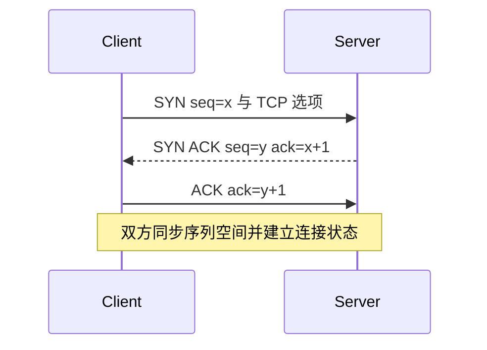
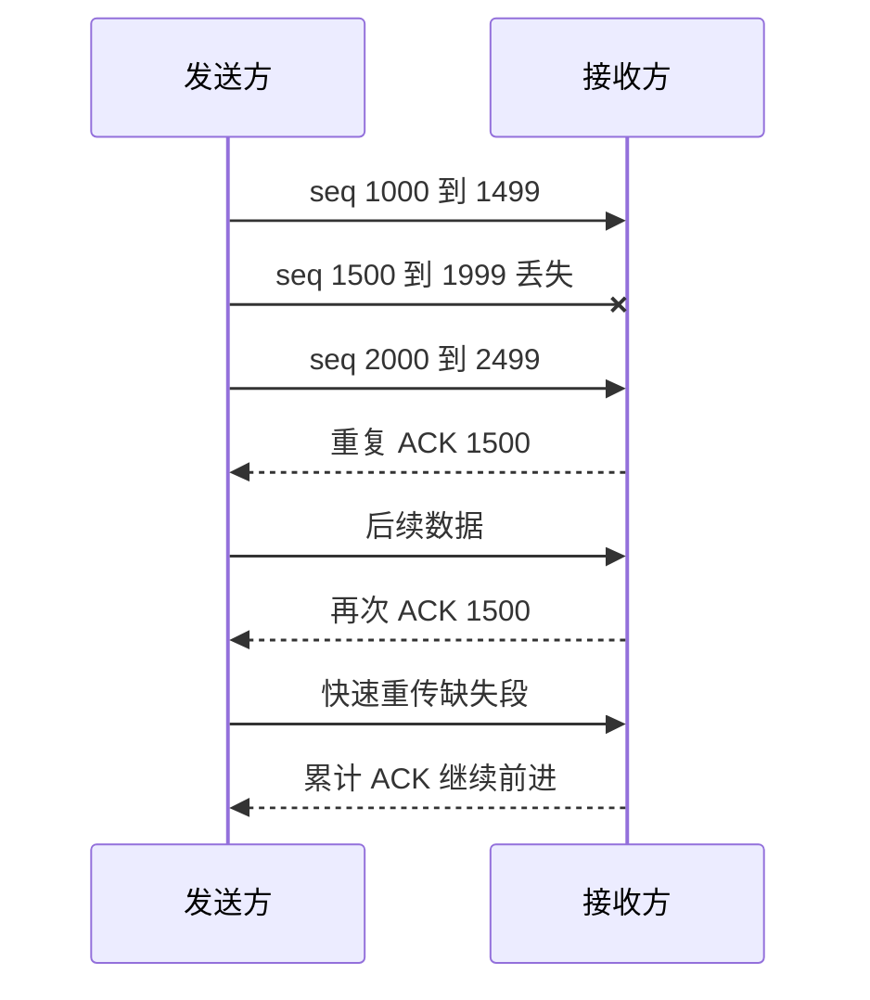
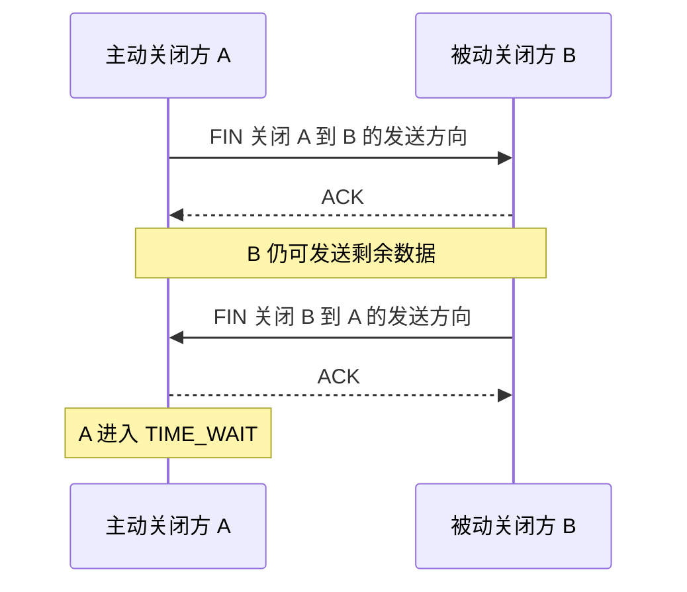

# UDP、TCP 与可靠传输

## 传输层连接进程

IP 把包送到主机，端口把数据交给主机上的进程/Socket。

TCP 连接通常由四元组标识：

```text
源 IP、源端口、目标 IP、目标端口
```

同一服务端口可以同时服务大量不同客户端连接。

## Socket 是什么

Socket 是应用与内核网络栈之间的接口和内核对象。应用通过系统调用：

- 创建 Socket。
- bind/listen/accept。
- connect。
- send/recv。
- close。

Socket 不等于 TCP；它也可承载 UDP、Unix domain 等协议。

## UDP

UDP 提供无连接、面向数据报的传输：

- 保留消息边界。
- 头部简单。
- 不提供重传、排序、流量控制和拥塞控制。
- 校验发现损坏，但通常不会自动恢复。

“不可靠”表示协议不承诺，不等于 UDP 包一定丢；需要可靠性的应用可以在 UDP 之上实现。

适合：

- DNS 等短请求。
- 实时音视频和游戏的特定数据。
- QUIC 的底层承载。
- 应用自定义传输策略。

UDP 应用仍需考虑 MTU、丢包、乱序、重复和拥塞友好。

## TCP 是字节流

TCP 提供有序可靠字节流，不保留应用 write 的消息边界。

```text
发送方 write("hello")
发送方 write("world")

接收方可能：
recv -> "helloworld"
或 recv -> "hel", "lowo", "rld"
```

所谓“粘包/拆包”本质是应用协议没有正确处理字节流边界。解决方式：

- 固定长度。
- 长度前缀。
- 分隔符。
- 自描述协议。

## 三次握手

简化过程：



握手完成：

- 双方确认彼此收发路径基本可用。
- 同步初始序列号。
- 协商 MSS、窗口扩展、SACK 等选项。
- 建立连接状态。

第三次不是为了“多确认一次”这么简单，它让服务端知道客户端收到了服务端初始序列号与响应，避免仅凭旧 SYN 就把双方都视为已建立。

## 序列号与确认

TCP 序列号按字节编号。ACK 通常表示“下一个期望收到的字节序号”。

若已连续收到 0–999：

```text
ACK = 1000
```

累计确认表示此前连续字节已收到。SACK 可额外报告不连续块，帮助发送方只重传缺失部分。

## 重传

### 超时重传

发送后在 RTO 内未得到确认则重传。RTO 根据 RTT 及其波动动态估计，不能固定为一个常数。

### 快速重传

多个重复 ACK 暗示中间某段丢失，可不等超时提前重传。



重传保证“尽力恢复”，但持续断网、超时或进程崩溃仍会导致连接失败。

## 接收窗口与流量控制

接收方通过 advertised window 告诉发送方自己还能接收多少，避免发送速度超过接收缓冲和应用消费能力。

```text
可发送量受到 rwnd 限制
```

窗口为零时，发送方暂停大部分数据，并通过探测了解窗口何时恢复。

## 拥塞控制

流量控制保护接收方；拥塞控制保护网络。

发送方还受 congestion window（cwnd）限制：

```text
实际在途上限约受 min(rwnd, cwnd) 约束
```

经典思想：

- Slow Start：从较小窗口快速探测容量。
- Congestion Avoidance：更谨慎增长。
- 丢包/ECN 等信号出现时降低发送。
- Fast Recovery：从部分丢包恢复。

现代算法可能基于丢包、延迟或带宽模型，具体行为不同。

## 带宽时延积

```text
BDP = 带宽 × RTT
```

它表示填满路径管道所需的在途数据量。高带宽、高 RTT 链路需要足够窗口，否则无法跑满带宽。

## 四次挥手

TCP 是全双工，两方向独立关闭：



ACK 和 FIN 有时可合并，抓包不一定机械显示四个独立包；“四次”描述逻辑阶段。

## TIME_WAIT

主动关闭方通常进入 TIME_WAIT，作用包括：

- 让最后 ACK 丢失时能再次响应重传 FIN。
- 让旧连接延迟报文在网络中消失，避免污染相同四元组的新连接。

大量 TIME_WAIT 要先分析连接创建模式、端口范围、负载均衡和复用策略，不应直接粗暴缩短时间。

## CLOSE_WAIT

收到对端 FIN 后，本地应用尚未 close，连接处于 CLOSE_WAIT。大量积累通常说明应用没有及时关闭资源或仍在处理。

## 半连接队列与 accept 队列

服务端 listen 后，连接建立涉及内核队列。队列满、SYN flood、应用 accept 太慢都可能影响建立，但具体队列和参数依内核实现。

不要把 backlog 简化成只有一个固定队列长度。

## TCP 可靠性的边界

TCP 确认数据到达对端内核协议栈，不等于：

- 对端业务已经处理。
- 数据已经提交数据库。
- 响应不会丢失。
- 应用请求恰好执行一次。

业务幂等、事务和应用层确认仍然需要。

## 动手观察

下面从端口和 Socket 开始，把 UDP 与 TCP 的状态、可靠性和性能完整展开。

---

## 深入一：传输层为什么存在

### 1. IP 只能定位主机

一个服务器可能同时运行：

- Web 服务。
- SSH。
- 数据库。
- DNS。

IP 地址把包送到主机，但还需要端口把数据交给正确通信端点。

### 2. Port

**直译**：端口。

传输层端口是协议字段中的数字标识，不是物理插口。

16 位端口范围：

```text
0 到 65535
```

不同范围有约定用途，但是否能绑定还受操作系统权限和配置影响。

### 3. Multiplexing

**直译**：复用。

多个应用共享同一个主机 IP：

```text
目标 IP + 目标端口 + 协议
  -> 内核选择 Socket
```

### 4. Demultiplexing

**直译**：分用。

接收端根据协议和连接标识，把数据交给正确 Socket。

### 5. TCP 四元组

TCP 连接通常由：

```text
源 IP
源端口
目标 IP
目标端口
```

共同区分。

同一服务端口 443 可同时接收大量客户端，因为源 IP/源端口不同。

### 6. 五元组

网络设备常加上传输协议：

```text
源 IP、源端口、目标 IP、目标端口、协议
```

用于流分类、ECMP 哈希、防火墙状态等。

---

## 深入二：Socket

### 1. Socket 是什么

Socket 既可指：

- 应用编程接口。
- 内核中的通信端点对象。
- 一个文件描述符所引用的网络对象。

### 2. 客户端调用链

```text
socket
  -> connect
  -> send/write
  -> recv/read
  -> close
```

### 3. 服务端调用链

```text
socket
  -> bind
  -> listen
  -> accept
  -> recv/send
  -> close
```

### 4. bind

为 Socket 关联本地地址和端口。

绑定：

- `127.0.0.1`：通常只允许本机回环访问。
- 某接口地址：只接收该本地地址相关流量。
- `0.0.0.0`：常表示所有适用 IPv4 本地接口。

### 5. listen

把 TCP Socket 变为监听端点：

- 内核接受传入握手。
- 维护连接建立相关队列。
- 等待应用 accept。

### 6. accept

监听 Socket 本身继续监听；每次 accept 返回一个新的已连接 Socket：

```text
listen fd
  -> accept
  -> connected fd A
  -> accept
  -> connected fd B
```

### 7. connect

对 TCP：

- 选择本地地址和临时端口。
- 发起握手。
- 成功后建立连接状态。

对 UDP，`connect` 可设置默认对端和过滤接收来源，但不建立 TCP 式可靠连接。

### 8. Socket 不等于 TCP

Socket API 可用于：

- TCP。
- UDP。
- Unix Domain Socket。
- 原始协议等。

---

## 深入三：UDP

### 1. User Datagram Protocol

**直译**：用户数据报协议。

核心语义：

- 无连接。
- 面向数据报。
- 头部简单。
- 不提供协议内重传和排序。

### 2. 数据报边界

发送方一次发送一个 UDP datagram，接收方按数据报接收：

- 不会把两个数据报自动合成一个逻辑数据报。
- 接收缓冲太小可能截断或丢弃多余部分，依 API 语义。

这与 TCP 字节流不同。

### 3. UDP 头部直觉

主要字段：

- 源端口。
- 目标端口。
- 长度。
- 校验和。

### 4. “无连接”是什么意思

发送前没有 TCP 三次握手和连接状态机。

不代表：

- 不知道目标地址。
- 网络设备不维护任何状态。
- 应用不能建立会话概念。

NAT、防火墙和应用仍可能维护 UDP 流状态。

### 5. “不可靠”是什么意思

UDP 协议不承诺：

- 送达。
- 顺序。
- 去重。
- 重传。
- 拥塞控制。

不表示每个 UDP 包都会丢。

### 6. 校验和

用于检测传输损坏。检测到错误通常丢弃，不自动恢复。

### 7. UDP 与 MTU

过大数据报可能：

- 发生 IP 分片。
- 某些路径直接失败。
- 任一分片丢失导致整个数据报无法重组。

应用常控制数据报大小，并实现分块或路径 MTU 策略。

### 8. UDP 适用场景

- DNS 短查询。
- 实时音视频。
- 游戏位置更新。
- 监控/日志的特定低成本场景。
- QUIC 底层承载。

### 9. UDP 应用仍要拥塞友好

没有内置拥塞控制不等于可以无限发包。应用需要：

- 限速。
- 丢包反馈。
- 自适应码率。
- 重试退避。
- 公平使用网络。

---

## 深入四：TCP 字节流与消息边界

### 1. Byte Stream

**直译**：字节流。

TCP 向应用提供有序字节序列，不保留每次 write 边界。

### 2. 为什么 write 与 recv 不对应

发送端：

```text
write 5 bytes
write 5 bytes
```

TCP 可根据：

- MSS。
- 缓冲。
- 拥塞窗口。
- Nagle。
- 网卡卸载。

决定怎样分段。

接收端可能：

```text
recv 10
```

或多次得到任意连续部分。

### 3. 粘包不是 TCP 错误

所谓“粘包”只是应用把字节流错误当消息流。必须自行定义 framing。

### 4. 固定长度

每条消息固定 N 字节：

- 解析简单。
- 浪费空间。
- 不适合长度差异大。

### 5. 长度前缀

```text
[4-byte length][payload]
```

接收方：

1. 先循环读满长度字段。
2. 校验长度上限。
3. 再循环读满 payload。

必须防止恶意超大长度导致内存问题。

### 6. 分隔符

```text
line1\n
line2\n
```

需要处理：

- 分隔符转义。
- 单条消息大小上限。
- 跨 recv 的分隔符。

### 7. 自描述协议

格式本身包含边界，例如某些结构化编码，但仍需按规范增量解析。

### 8. 半包

一次 recv 只得到一部分消息是正常情况。正确网络程序必须保存未完成解析状态。

---

## 深入五：三次握手

### 1. 第一次 SYN

客户端发送：

```text
SYN=1
seq=x
```

表达：

- 希望建立连接。
- 客户端初始序列号。
- TCP 选项。

### 2. 第二次 SYN+ACK

服务端返回：

```text
SYN=1
ACK=1
seq=y
ack=x+1
```

表达：

- 已收到客户端 SYN。
- 服务端也给出初始序列号。
- 服务端方向愿意建立。

### 3. 第三次 ACK

客户端发送：

```text
ACK=1
ack=y+1
```

服务端由此知道客户端收到了服务端 SYN 和初始序列号。

### 4. 为什么 SYN 消耗一个序列号

SYN/FIN 虽不一定携带普通应用字节，也占用序列空间，便于确认连接控制事件。

### 5. 握手协商什么

常见：

- MSS。
- Window Scale。
- SACK Permitted。
- 时间戳等。

不是协商 HTTP、TLS 版本；那些属于更高层。

### 6. 为什么不是两次

若服务端收到 SYN 并回复后就完全认为双方连接已建立：

- 它不知道自己的 SYN+ACK 是否到达客户端。
- 旧重复 SYN 可能让服务端建立无效状态。

第三次 ACK 确认客户端已看到服务端序列空间和响应。

### 7. 为什么不需要四次

第二步可把：

- 对客户端 SYN 的 ACK。
- 服务端自己的 SYN。

合并为一个 SYN+ACK。

### 8. 握手与数据

传统 TCP 通常握手后再交付普通数据；某些扩展允许早期数据，但有兼容性和安全语义，需要单独分析。

### 9. 握手超时

SYN 或 SYN+ACK 丢失：

- 定时重传。
- 重试间隔通常退避。
- 超过限制后 connect 失败。

---

## 深入六：序列号、ACK 与乱序

### 1. Sequence Number

**直译**：序列号。

TCP 给字节流中的每个字节编号。

若 segment：

```text
seq=1000
payload length=500
```

它覆盖字节：

```text
1000 到 1499
```

下一连续字节是 1500。

### 2. ACK

**Acknowledgment，确认。**

```text
ack=1500
```

表示此前连续字节已收到，下一步期望 1500。

### 3. 累计确认

一个 ACK 可确认前面连续范围，不必每个 segment 单独永久对应一个 ACK。

### 4. 乱序

若收到：

```text
1000-1499
2000-2499
缺 1500-1999
```

接收方：

- 可缓存后到段。
- ACK 仍指向 1500。
- 等缺口补齐后向应用交付连续字节。

### 5. 重复包

序列号让接收端识别已经收到的范围，避免向应用重复交付相同字节。

### 6. ACK 也会丢

累计确认意味着某个 ACK 丢失不一定触发数据重传，后续更大的 ACK 可以覆盖此前连续字节。

### 7. SACK

**Selective Acknowledgment，选择确认。**

接收方额外告诉发送方：

- 哪些不连续范围已经收到。
- 发送方可更精准重传缺口。

---

## 深入七：RTT、RTO 与重传

### 1. RTT

**Round-Trip Time，往返时间。**

数据/探测从发送到获得响应经历的往返时间。

RTT 会波动：

- 排队。
- 路由变化。
- 无线质量。
- 对端处理。

### 2. RTO

**Retransmission Timeout，重传超时。**

若确认在 RTO 内未到，发送方认为可能丢失并重传。

### 3. RTO 不能固定

固定过短：

- 网络只是暂时慢。
- 发送方误判丢包。
- 重复发送加重拥塞。

固定过长：

- 真丢包恢复太慢。

所以 TCP 根据平滑 RTT 和波动动态估计。

### 4. 超时退避

连续超时可能说明网络严重拥塞或中断，RTO 通常指数退避，避免持续猛烈重传。

### 5. Duplicate ACK

中间缺口存在而后续段到达时，接收方反复确认同一个下一期望序号，产生重复 ACK。

### 6. Fast Retransmit

发送方收到足够重复 ACK，可推断某段丢失，在 RTO 到期前重传。

### 7. Spurious Retransmission

网络严重乱序或延迟突增可能造成不必要重传。现代 TCP 有更多算法减轻误判。

### 8. 重传不是无限可靠

以下仍会失败：

- 网络长期中断。
- 对端崩溃。
- 超时达到上限。
- 中间状态设备丢映射。
- 应用主动关闭。

---

## 深入八：接收缓冲与流量控制

### 1. Receive Buffer

内核暂存已经收到但应用尚未读取的数据。

若应用消费慢：

- 缓冲逐步占满。
- 接收方需要限制发送方。

### 2. rwnd

**Receive Window，接收窗口。**

接收方通告还能接收多少字节。

### 3. 发送约束

发送方不能让未确认在途数据超过接收方允许范围。

```text
flight size <= rwnd
```

实际还受 cwnd 限制。

### 4. Window Scaling

原始窗口字段宽度有限。握手中可协商缩放，以支持高 BDP 网络更大窗口。

### 5. Zero Window

接收缓冲满时通告零窗口：

- 发送方暂停大部分新数据。
- 定期探测窗口是否恢复。

### 6. 应用消费速度

流量控制最终保护接收应用：

```text
应用读得慢
  -> 接收缓冲满
  -> rwnd 变小
  -> 发送方减慢
```

### 7. Silly Window Syndrome

频繁通告或发送极小窗口/小段会降低效率。发送端和接收端可用算法避免过小更新。

---

## 深入九：发送缓冲、Nagle 与延迟 ACK

### 1. send 成功的含义

通常表示数据已被复制或接受进本地内核发送路径，不表示：

- 已到达对端。
- 对端应用已读取。
- 业务已完成。

### 2. Nagle

目标是减少大量小 segment：

- 有未确认小数据时，暂存后续小写。
- 等 ACK 或凑够更大段再发。

### 3. Delayed ACK

接收方可能短暂延迟 ACK：

- 等待是否有反向数据可一起确认。
- 减少纯 ACK 数量。

### 4. 交互影响

Nagle 与延迟 ACK 某些组合可能增加小请求延迟。低延迟应用可能选择禁用 Nagle，但会增加小包和协议开销。

### 5. 不要盲目 TCP_NODELAY

先判断：

- 请求是否小且延迟敏感。
- 应用是否能批量写。
- 小包比例。
- 带宽和包速率成本。

---

## 深入十：拥塞控制

### 1. 为什么需要拥塞控制

多个发送者共享链路：

```text
发送总速率 > 路径可处理能力
  -> 队列增长
  -> 延迟上升
  -> 丢包
  -> 重传更多
  -> 可能拥塞崩溃
```

### 2. cwnd

**Congestion Window，拥塞窗口。**

发送方根据网络反馈限制在途数据。

### 3. 实际上限

简化：

```text
可在途数据 <= min(rwnd, cwnd)
```

- rwnd 保护接收方。
- cwnd 保护网络。

### 4. Slow Start

名字叫“慢启动”，但窗口通常按每 RTT 快速增长：

- 从相对保守窗口开始。
- 每收到确认增加可发送量。
- 迅速探测路径容量。

它“慢”是相对于一开始就全速发送。

### 5. Congestion Avoidance

接近容量后更谨慎增长，经典思想是加性增大。

### 6. Multiplicative Decrease

检测到拥塞信号后显著减小窗口，降低网络注入。

### 7. 丢包作为信号

传统算法通过：

- 超时。
- 重复 ACK。

推断拥塞。

无线错误等非拥塞丢包也可能被当成拥塞，影响吞吐。

### 8. ECN

**Explicit Congestion Notification。**

中间设备在队列拥塞时标记而非直接丢包，端点据此降低发送速率，前提是路径和双方支持。

### 9. Bufferbloat

缓冲过大时：

- 丢包可能减少。
- 队列却积累很深。
- RTT 和交互延迟非常高。

高吞吐与低延迟需要合适队列管理，不是缓冲越大越好。

### 10. 不同拥塞算法

现代算法可能根据：

- 丢包。
- RTT。
- 带宽估计。
- 交付速率模型。

做决策。面试基础先掌握 cwnd、慢启动、避免和拥塞信号，不要断言所有系统只用一种经典算法。

---

## 深入十一：BDP

### 1. Bandwidth-Delay Product

**直译**：带宽时延积。

```text
BDP = bandwidth × RTT
```

表示填满路径“管道”大约需要多少在途数据。

### 2. 示例

带宽：

```text
100 Mbps
```

RTT：

```text
100 ms = 0.1 s
```

BDP：

```text
100 Mb/s × 0.1 s = 10 Mb
= 1.25 MB
```

窗口若远小于 1.25 MB，就难以跑满这条路径。

### 3. 为什么高带宽高延迟更需要大窗口

等待 ACK 期间，链路上可以容纳大量数据。窗口太小：

- 发送完窗口就停。
- 等 ACK 才继续。
- 链路部分时间空闲。

### 4. BDP 不是缓冲越大越好

过大缓冲会：

- 增加排队。
- 放大延迟。
- 消耗内存。

需要窗口、拥塞算法和队列共同控制。

---

## 深入十二：四次挥手

### 1. TCP 全双工

两个方向字节流独立：

```text
A -> B
B -> A
```

关闭一个方向不自动说明另一个方向立刻关闭。

### 2. 第一个 FIN

A 表示自己不再发送新字节：

```text
A FIN -> B
```

B 仍可继续向 A 发送剩余数据。

### 3. ACK

B 确认 A 的 FIN。

### 4. B 的 FIN

B 完成自身发送后也发 FIN。

### 5. 最后 ACK

A 确认 B 的 FIN。

### 6. 为什么 ACK 与 FIN 可能合并

如果 B 收到 A FIN 时也已准备关闭自己的发送方向，可以把 ACK 和 FIN 合并。四次挥手是逻辑阶段，不保证抓包中固定四个包。

### 7. Half-close

应用可关闭发送方向但继续接收：

- 协议可用 EOF 表示请求发送结束。
- 对端仍返回响应。

### 8. RST

**Reset，重置。**

用于异常终止连接：

- 连接状态不存在。
- 应用以特定方式关闭仍有未读数据。
- 端口未监听等。

RST 与正常 FIN 优雅关闭语义不同。

---

## 深入十三：TCP 状态

### 1. LISTEN

服务端等待连接。

### 2. SYN-SENT

客户端已发 SYN，等待 SYN+ACK。

### 3. SYN-RECEIVED

服务端已收 SYN 并发 SYN+ACK，等待最终 ACK。

### 4. ESTABLISHED

连接建立，可双向传输。

### 5. FIN-WAIT

主动关闭方已发 FIN，等待确认和对端关闭。

### 6. CLOSE-WAIT

被动关闭方已收到 FIN，内核已告诉应用对端不再发送，但本地应用尚未 close。

大量长期 CLOSE_WAIT 常说明：

- 应用未关闭连接。
- 处理逻辑卡住。
- 资源释放路径遗漏。

### 7. LAST-ACK

被动关闭方发出自己的 FIN，等待最后 ACK。

### 8. TIME-WAIT

主动关闭方完成逻辑关闭后保留一段时间。

### 9. 为什么 TIME_WAIT 通常在主动关闭方

主动关闭方发送最后 ACK，需要：

- 对端 FIN 重传时重新发送 ACK。
- 等旧连接延迟报文消失。

### 10. TIME_WAIT 不是连接泄漏的直接证据

大量 TIME_WAIT 可能只是大量短连接正常结果。应检查：

- 请求量。
- 是否缺少连接复用。
- 临时端口范围。
- NAT 状态。
- 谁主动关闭。

不要粗暴缩短时间破坏协议保护。

---

## 深入十四：监听队列与 SYN Flood

### 1. 握手中的状态

服务端收到 SYN 后，需要保存一定连接建立状态，直到：

- 最终 ACK 到达。
- 超时。
- 失败。

### 2. 已完成连接等待 accept

握手完成后，连接可能先在内核队列等待应用调用 accept。

### 3. backlog

用户传入的 backlog 与内核最终队列能力还受：

- 系统参数。
- 内核实现。
- 队列类型。
- 资源压力。

影响。不能简单说“只有一个 backlog 队列”。

### 4. 应用 accept 太慢

原因：

- 单线程忙于业务。
- CPU 饱和。
- 锁竞争。
- 事件循环阻塞。

队列满后新连接可能延迟、重传或失败。

### 5. SYN Flood

攻击者大量发 SYN，却不完成握手：

- 消耗半连接状态。
- 填满队列。
- 影响正常客户端。

### 6. SYN Cookies

服务端在压力下可把部分状态编码进 SYN+ACK 序列相关信息，先不分配完整状态，最终 ACK 返回后再验证创建。

它是抗压机制之一，也有选项和能力上的权衡。

---

## 深入十五：Keepalive、心跳与连接池

### 1. TCP Keepalive

内核在长时间空闲后发送探测，判断对端是否仍可达。

特点：

- 默认时间可能很长。
- 参数依操作系统。
- 只能说明传输连接状态，不能证明业务健康。

### 2. 应用心跳

应用层发送有业务语义的 ping/pong：

- 可更快检测。
- 可验证协议处理线程仍工作。
- 增加流量和状态。

### 3. HTTP Keep-Alive

表示复用连接处理多个请求，与 TCP keepalive 探测不是同一概念。

### 4. 连接池

复用已建立连接：

- 减少握手。
- 减少临时端口与 TIME_WAIT。
- 降低 TLS 开销。

需要管理：

- 最大连接数。
- 空闲超时。
- 连接健康。
- 排队与获取超时。
- 失效连接重建。

---

## 深入十六：TCP 可靠性的业务边界

### 1. ACK 到底确认到哪里

TCP ACK 通常确认字节已到达对端内核 TCP 接收路径并满足协议状态，不保证：

- 对端应用已经 read。
- 应用已经解析。
- 数据库已经提交。
- 响应一定返回。

### 2. send 成功也不是业务成功

本地 send 成功通常表示内核接受数据，不表示远端处理。

### 3. 模糊失败

客户端请求已到服务端并执行成功，但响应在返回时丢失：

```text
客户端看到超时
服务端实际已完成
```

客户端无法仅凭超时判断“请求一定没执行”。

### 4. At-most-once、At-least-once、Exactly-once

重试可实现至少一次尝试，但可能重复。

业务常用：

- 幂等键。
- 唯一约束。
- 去重表。
- 事务。
- 状态查询。

构建可接受的“效果一次”语义。

### 5. TCP 与消息完整性

TCP 提供字节流校验与可靠交付机制，但应用仍要验证：

- 消息格式。
- 长度。
- 业务字段。
- 身份权限。
- 端到端校验需求。

---

## 深入十七：TCP 性能排查

### 1. connect 慢

可能：

- DNS 慢。
- 路由问题。
- SYN/SYN+ACK 丢包。
- 防火墙静默丢弃。
- 服务队列满。
- 服务器 CPU 忙。

### 2. 建连快但首字节慢

可能：

- TLS。
- 服务端排队。
- 应用处理。
- 下游依赖。

### 3. 吞吐低

检查：

- RTT。
- cwnd。
- rwnd。
- 丢包重传。
- BDP 与缓冲。
- 应用读写速度。
- CPU 和网卡。

### 4. CLOSE_WAIT 多

重点查本地应用 close 路径，而不是调整 TIME_WAIT 参数。

### 5. TIME_WAIT 多

先确认：

- 是否大量短连接。
- 是否可连接复用。
- 谁主动关闭。
- 是否临时端口耗尽。

### 6. retrans 高

需要区分：

- 网络拥塞。
- 无线错误。
- 路径丢包。
- 网卡/队列丢包。
- 抓包点和硬件卸载导致的观察差异。

---

## 补充面试题：直接背诵

### Q1：Socket 与 TCP 什么关系

> Socket 是应用与内核通信栈之间的接口和内核端点对象，TCP 是一种传输协议。Socket API 也可使用 UDP、Unix Domain Socket 等。TCP 服务端监听 Socket 通过 accept 产生多个已连接 Socket。

### Q2：UDP 为什么叫不可靠

> UDP 不在协议内承诺送达、顺序、去重、重传、流量和拥塞控制；它保留数据报边界且头部简单。不可靠不表示必然丢包，需要这些能力的应用可以在 UDP 之上实现，例如 QUIC。

### Q3：TCP 为什么会粘包

> TCP 提供的是有序字节流，不保留 write 调用边界。发送端可合并或拆分数据，接收端 recv 也按当前可得字节返回。应用必须使用固定长度、长度前缀、分隔符或自描述格式建立消息边界。

### Q4：三次握手为什么不是两次

> 双方都要同步初始序列号并确认双向基本收发能力。第三次 ACK 让服务端知道客户端已经收到服务端的 SYN 和初始序列号，避免服务端仅凭旧或重复 SYN 就把双方都视为完全建立。

### Q5：ACK 表示什么

> TCP 序列号按字节编号，累计 ACK 表示下一个期望收到的连续字节序号。例如 ACK=1500 表示 1500 之前连续范围已收到。SACK 还可报告不连续已收区间，帮助精准重传缺口。

### Q6：RTO 为什么动态估计

> RTT 会随路径和排队波动。RTO 太短会把正常延迟误判为丢包、产生多余重传，太长又让真丢包恢复慢，因此 TCP 根据平滑 RTT 和波动估计，并在连续超时时退避。

### Q7：流量控制与拥塞控制

> 流量控制用接收窗口 rwnd 防止发送方压垮接收缓冲和应用；拥塞控制用 cwnd 限制对共享网络的注入。发送方实际在途量同时受二者较小值约束。

### Q8：慢启动为什么不慢

> 它不是线性慢慢加，而是从较保守窗口开始，在每个 RTT 根据 ACK 快速增加，尽快探测路径容量。名字中的慢是相对于一开始就按任意大速率发送。

### Q9：TIME_WAIT 为什么存在

> 主动关闭方保留状态，以便最后 ACK 丢失时重新响应对端 FIN，并让旧连接延迟报文在网络中消失，避免污染相同四元组的新连接。大量 TIME_WAIT 应先分析短连接和复用，不应盲目缩短。

### Q10：TCP 可靠为什么还要业务幂等

> TCP 只保证连接字节流语义，不保证对端业务处理和响应。请求可能已成功执行但响应丢失，客户端超时重试就会重复副作用。应用需要幂等键、唯一约束、事务或状态查询处理模糊失败。

---

## 补充理解检查

### 计算题

1. 给定 seq=1000、payload=500，下一 ACK 应是多少。
2. 100 Mbps、RTT 100 ms 的 BDP 是多少字节。
3. rwnd=2 MB、cwnd=800 KB 时最大在途受谁限制。
4. 为长度前缀协议设计最大消息校验。

### 判断题

1. 端口是网卡上的物理接口。
2. 同一服务端口只能有一个 TCP 连接。
3. UDP connect 会执行 TCP 三次握手。
4. TCP 保留每次 write 的边界。
5. 收到 ACK 说明远端业务已提交数据库。
6. RTO 应固定为一个较小常数。
7. rwnd 保护网络，cwnd 保护接收方。
8. 四次挥手在抓包中必然是四个独立包。
9. 大量 CLOSE_WAIT 常要检查应用 close。
10. TIME_WAIT 一定是内存泄漏。

答案：1 错，2 错，3 错，4 错，5 错，6 错，7 错，8 错，9 对，10 错。

### 讲解题

1. 画出客户端和服务端 Socket API 调用顺序。
2. 设计一个能跨多次 recv 正确解析的 framing 状态机。
3. 为三次握手每个包解释 seq/ack。
4. 推演中间一个 segment 丢失后的重复 ACK、快速重传和 SACK。
5. 用应用消费慢解释 rwnd 变为零。
6. 用共享链路解释 cwnd 为什么必要。
7. 画出主动关闭和被动关闭的关键状态。
8. 举例解释请求超时但服务端已成功的模糊失败。

```bash
ss -tanp
ss -ti dst <server-ip>
tcpdump -nn -i any 'tcp port 443'
```

观察 SYN、ACK、窗口、重传以及连接状态。抓包需要合适权限，并注意硬件卸载可能让本机抓包形态与线上包不同。

## 常见误区

- TCP 有连接状态，IP 路由本身通常无连接。
- TCP 是字节流，不保留 write 边界。
- 可靠传输不等于业务 exactly-once。
- 流量控制和拥塞控制保护对象不同。
- 四次挥手是逻辑过程，ACK/FIN 可能合并。
- UDP 不保证可靠，也不代表无需考虑拥塞。

## 面试表达

**TCP 如何保证可靠性？**

> TCP 用校验、序列号、累计 ACK/SACK、超时和快速重传处理损坏、丢失、重复与乱序；接收窗口做流量控制，拥塞窗口限制对网络的注入。接收端按序重组后向应用提供字节流。但它只保证连接语义内的数据交付，不保证对端业务已经成功处理。

**追问链**

1. 为什么握手需要同步初始序列号？
2. RTO 为什么不能固定？
3. rwnd 与 cwnd 有什么区别？
4. TCP 为什么会粘包？
5. TIME_WAIT 为什么在主动关闭方？
6. TCP 成功返回为什么还需要业务幂等？

## 理解检查

1. 用四元组解释同端口多连接。
2. 为字节流设计长度前缀协议。
3. 解释 ACK=1000 的含义。
4. 计算一个链路的 BDP。

---

[上一课：IP 与路由](../02-ip-routing/index.html) | [下一课：DNS 与 HTTP →](../04-dns-http/index.html)
