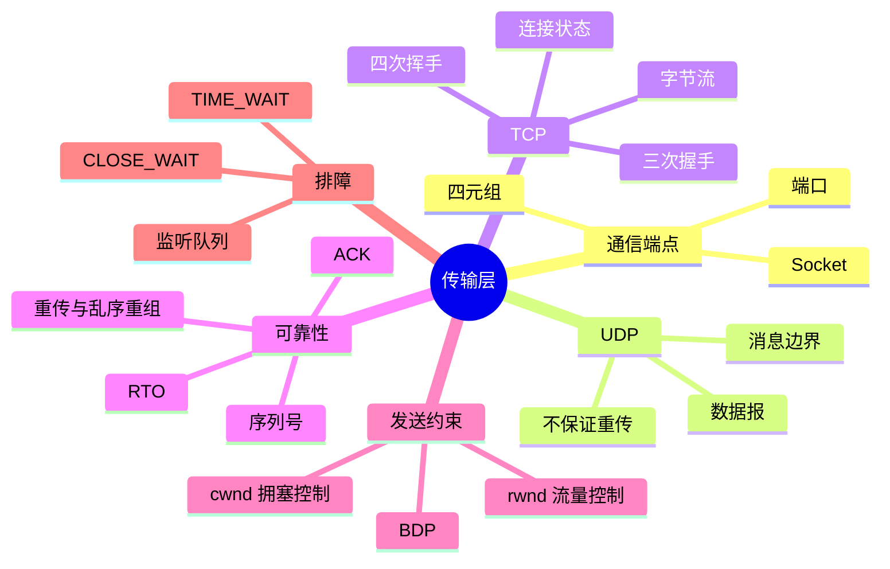
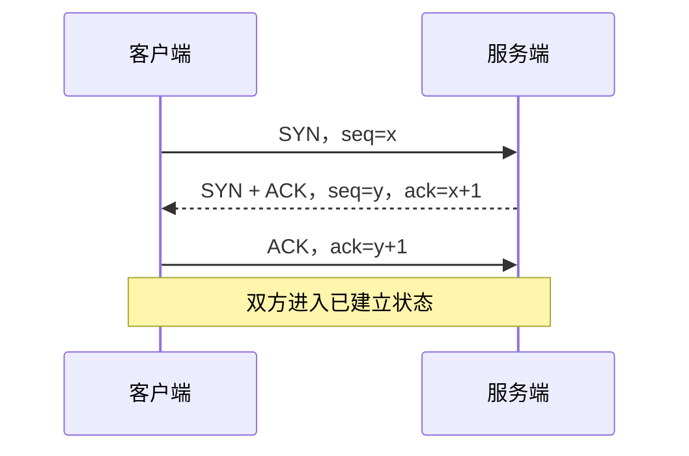
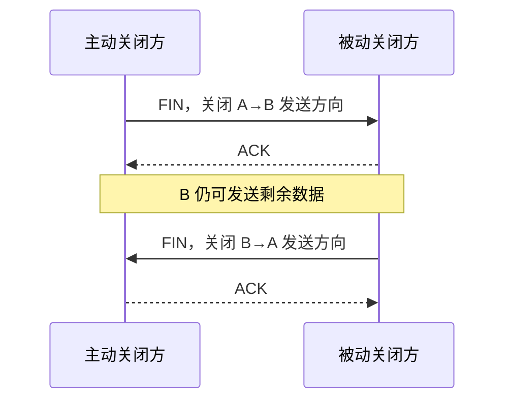

# UDP、TCP 与可靠传输

IP 只能把数据包尽力送到一台主机。应用还需要知道数据交给哪个进程、消息是否完整、丢失后如何恢复，以及发送速度是否超过接收方和网络的承受能力。传输层正是为这些端到端问题提供服务的层。

本章从 Socket 开始，先理解应用如何找到通信端点，再比较 UDP 和 TCP 的取舍。最后沿 TCP 连接的生命周期，解释握手、字节流、序列号、重传、流量控制与拥塞控制。TCP 的基本规范可参考 [RFC 9293](https://www.rfc-editor.org/rfc/rfc9293)，拥塞控制的经典算法可参考 [RFC 5681](https://www.rfc-editor.org/rfc/rfc5681)。

## 本章知识地图



## 一、Socket 把应用连接到内核网络栈

Socket（套接字）是应用使用网络服务时面对的接口和内核对象。应用通过创建 Socket、绑定或连接地址、发送和接收字节与内核交互；Socket 本身不是 TCP，它也可以承载 UDP 或 Unix domain 等通信。

端口是主机内用于区分通信端点的编号。一个 TCP 连接通常由四元组唯一标识：源 IP、源端口、目标 IP、目标端口。服务器可以让多个客户端共享同一个监听端口，因为每条已建立连接的源地址和源端口不同。

```text
客户端 192.0.2.10:53000
        → 服务端 198.51.100.8:443
```

监听 Socket 等待新的连接；已连接 Socket 保存某一对端点的状态和收发缓冲。应用调用 `send` 或 `recv` 时，数据并不一定立即越过网卡：内核可能先放入发送缓冲，接收数据也可能先停留在接收缓冲。

## 二、UDP 保留消息边界，但把责任交给应用

UDP（User Datagram Protocol，用户数据报协议）面向数据报。应用每次发送一份数据报，接收方通常以一份数据报为单位读取；如果数据报太大、损坏或丢失，UDP 本身不负责重传、排序、流量控制或拥塞控制。

“无连接”表示发送前不需要建立类似 TCP 的连接状态，不表示网络路径上没有设备状态，也不表示数据一定不经过握手。UDP 适合 DNS（Domain Name System，域名系统）等短请求、实时音视频和应用自定义可靠性策略。应用选择 UDP 后，必须自行考虑丢包、乱序、重复、大小限制和拥塞友好。

UDP 的校验和可以发现部分传输错误，但检测到错误通常只会丢弃数据报，不会自动恢复。QUIC（Quick UDP Internet Connections，基于 UDP 的快速网络连接协议）就是在 UDP 之上实现可靠传输、安全握手和多路复用的例子。

## 三、TCP 把应用消息变成有序字节流

TCP（Transmission Control Protocol，传输控制协议）面向连接，为应用提供双向、有序、可靠的字节流。它不保存应用 `write` 调用的消息边界：发送方连续写入 `hello` 和 `world`，接收方可能一次读到 `helloworld`，也可能先读到 `hel`，再读到剩余字节。

因此，应用协议必须自己定义消息边界，常用方式是固定长度、长度前缀、分隔符或自描述格式。所谓“TCP 粘包/拆包”通常是应用没有正确处理字节流边界，而不是 TCP 把两条业务消息错误地合并了。

TCP 的可靠性来自一组协作机制：序列号标记字节位置，确认号说明接收方下一步期待哪个字节，校验和检测部分错误，重传恢复推测丢失的数据，接收方缓存帮助乱序重组。可靠意味着协议尽力恢复，不意味着断网或对端崩溃时连接永远不失败。

## 四、三次握手建立双方都认可的状态

建立连接前，双方需要同步初始序列号，并确认对方能收到自己的控制报文。SYN（Synchronize，连接同步标志）表示发起或同步序列空间，ACK（Acknowledgment，确认标志）表示确认收到某个序列号之前的内容。



第一条报文让服务端知道客户端想建立连接；第二条同时表达服务端愿意建立连接，并把服务端的初始序列号告诉客户端；第三条让服务端确认客户端确实收到了第二条报文。若只有两次，服务端无法区分客户端是否收到了自己的序列号，旧的延迟报文可能造成错误状态。

握手还可以协商 MSS（Maximum Segment Size，最大报文段长度）、窗口扩大和 SACK（Selective Acknowledgment，选择性确认）等选项。握手成功不等于应用已经处理请求，只代表传输层连接状态建立。

## 五、序列号和确认号如何描述进度

TCP 序列号按字节编号。假设接收方已经连续收到编号 0 到 999 的字节，它发送 ACK=1000，表示下一个希望收到 1000。累计确认可以一次确认之前连续到达的多个字节。

如果字节 1500 到 1999 丢失，但 2000 到 2499 已到达，接收方仍可能重复确认 1500，并暂存后面的乱序数据。发送方观察到重复 ACK 或超时后，重传缺失部分；启用 SACK 时，接收方还可以报告已经收到的非连续块，帮助发送方减少无谓重传。

确认不是业务成功回执。TCP ACK 只说明字节被接收方 TCP 栈接收，应用是否读取、是否完成事务、是否持久化数据，都需要应用协议自己的响应和幂等设计。

## 六、丢包后的两类重传

发送方为未确认数据维护计时和状态。若在 RTO（Retransmission Timeout，重传超时时间）内没有得到足够确认，就触发超时重传。RTO 会根据 RTT（Round-Trip Time，往返时间）及其波动估计，不能固定套用一个常数。

当接收方连续收到后续数据却反复确认同一个缺口时，多个重复 ACK 暗示中间数据可能丢失。发送方可以触发快速重传，不必等完整超时。快速重传减少恢复等待，但它仍然需要结合拥塞控制降低发送压力。

重传可能造成重复到达，因此应用不能把“收到一次 TCP 数据”直接等价于“业务只执行一次”。支付、写入和消息消费仍需使用请求 ID、唯一约束或幂等处理。

## 七、流量控制保护接收方

接收方有有限的接收缓冲和应用消费速度。它通过接收窗口 `rwnd`（receive window，接收窗口）告诉发送方自己还能接收多少未确认数据。发送方不能无限填满接收方缓冲，否则即使网络没有拥塞，接收方也会被压垮。

窗口为零时，发送方暂停发送大部分数据，并通过窗口探测确认接收方何时恢复。窗口扩大选项允许高带宽、高 RTT 链路使用更大的窗口，但它只解决单条连接的接收能力，不代表网络中途一定能承受同样的数据量。

## 八、拥塞控制保护网络

流量控制回答“接收方还能收多少”；拥塞控制回答“路径目前还能承受多少”。发送方维护 `cwnd`（congestion window，拥塞窗口），实际在途数据量大致受 `min(rwnd, cwnd)` 限制。

经典 TCP 拥塞控制包含慢启动和拥塞避免：连接开始时逐渐探测可用容量，稳定后更谨慎地增长；丢包、ECN（Explicit Congestion Notification，显式拥塞通知）或延迟变化等信号出现时降低发送速率。具体算法可能不同，但共同目标是避免所有发送方同时把网络队列填爆。

BDP（Bandwidth-Delay Product，带宽时延积）等于带宽乘以 RTT，表示填满路径管道所需的在途数据量。高带宽、高 RTT 场景如果窗口过小，即使端点 CPU 空闲也跑不满链路。

## 九、四次挥手和连接状态

TCP 是全双工连接，两个方向可以分别关闭。主动关闭方发送 FIN（Finish，结束发送方向），对方先确认，再在自己的数据发送完后发送 FIN；最后由主动关闭方确认。



ACK 和 FIN 在某些时刻可以合并，所以抓包不一定看到四个独立报文。“四次”描述两个方向的逻辑关闭阶段。主动关闭方通常进入 TIME_WAIT，以便最后 ACK 丢失时响应重传 FIN，并让旧连接的延迟报文退出网络。

CLOSE_WAIT 表示本地已经收到对方 FIN，但应用还没有关闭自己的发送方向。大量 CLOSE_WAIT 往往提示应用没有及时释放连接；大量 TIME_WAIT 则应结合连接创建模式、端口范围和负载均衡分析，不能直接粗暴缩短超时时间。

## 十、监听队列与常见排障

服务端 `listen` 后，内核需要保存尚未完成握手和已经完成握手、等待应用 `accept` 的连接状态。队列过小、SYN flood、应用接受连接太慢或服务线程耗尽，都可能让连接建立变慢。不要把 `backlog` 简化成一个在所有内核上含义完全相同的数字。

可以按下面的顺序排查“TCP 连接慢或失败”：先检查 DNS 和路由，再观察 SYN 是否发出、SYN-ACK 是否返回，然后确认握手完成后服务端是否及时 `accept`，最后区分应用处理慢、接收窗口受限、拥塞丢包和服务端资源不足。

```sh
ss -s
ss -tan state syn-recv
ss -tan state time-wait
curl -v --connect-timeout 3 https://example.com/
```

这些命令展示当前机器的观测结果，不能替代对具体路径的抓包和服务端日志分析。

## 常见误区

TCP 可靠的是字节流交付，不是业务事务；ACK 不代表业务已经提交。流量控制和拥塞控制也不是同一个窗口，前者保护接收方，后者保护网络。

UDP 无连接不代表没有任何状态，也不代表天然更快。它减少了协议责任，应用可能因此需要自己实现重传、排序、限速和安全握手。

TIME_WAIT 和 CLOSE_WAIT 的含义相反：前者通常是主动关闭方等待旧报文消失，后者说明本地应用尚未完成关闭。看到数量上升时，先确认是谁创建、谁关闭以及连接生命周期在哪里停住。

## 面试表达

回答 TCP 时，先说它为应用提供有序可靠的字节流，再解释序列号、ACK、重传和乱序重组怎样恢复丢包。接着区分 `rwnd` 和 `cwnd`：一个限制接收方缓冲，一个限制网络拥塞。最后结合握手、挥手、TIME_WAIT 和 CLOSE_WAIT 说明连接状态，而不是只背三次握手报文。

## 理解检查

1. 为什么 TCP 不保留应用消息边界？
2. ACK=1000 表示确认了哪些字节？
3. 接收窗口和拥塞窗口分别保护谁？
4. 为什么只有两次握手不能可靠同步双方状态？
5. 大量 CLOSE_WAIT 和大量 TIME_WAIT 分别优先怀疑什么？

## 术语卡片

| 缩写 | 英文全称 | 中文名称 | 本章作用 |
|------|----------|----------|----------|
| TCP | Transmission Control Protocol | 传输控制协议 | 提供有序可靠字节流 |
| UDP | User Datagram Protocol | 用户数据报协议 | 提供无连接数据报 |
| ACK | Acknowledgment | 确认 | 表示接收进度 |
| SYN | Synchronize | 同步标志 | 建立连接并同步序列空间 |
| RTO | Retransmission Timeout | 重传超时时间 | 触发超时重传 |
| RTT | Round-Trip Time | 往返时间 | 估计确认往返延迟 |
| rwnd | receive window | 接收窗口 | 保护接收方缓冲 |
| cwnd | congestion window | 拥塞窗口 | 保护网络路径 |
| SACK | Selective Acknowledgment | 选择性确认 | 描述非连续已收数据 |
| BDP | Bandwidth-Delay Product | 带宽时延积 | 估计填满链路所需在途量 |

## 可观察实验

用 `ss -tin` 和 `tcpdump` 在本机测试连接建立、重传和关闭状态；比较冷连接与复用连接，并把观察结果对应到握手、窗口和状态机。
