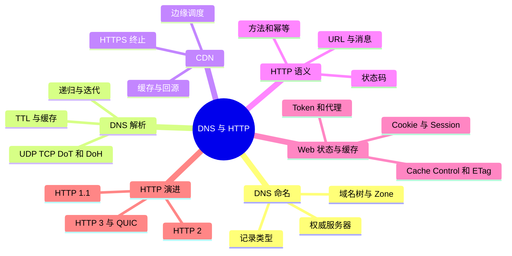
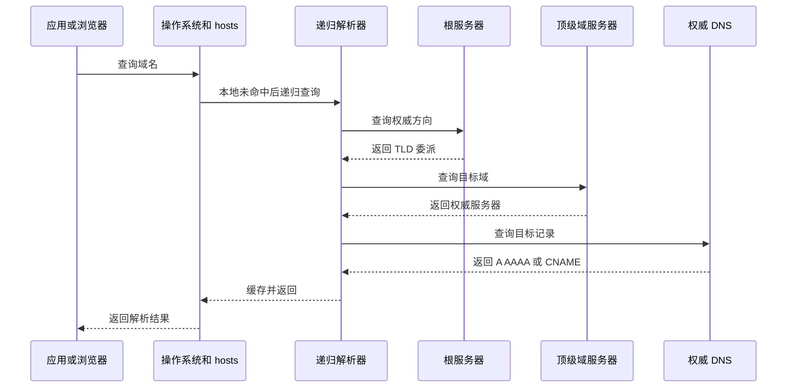
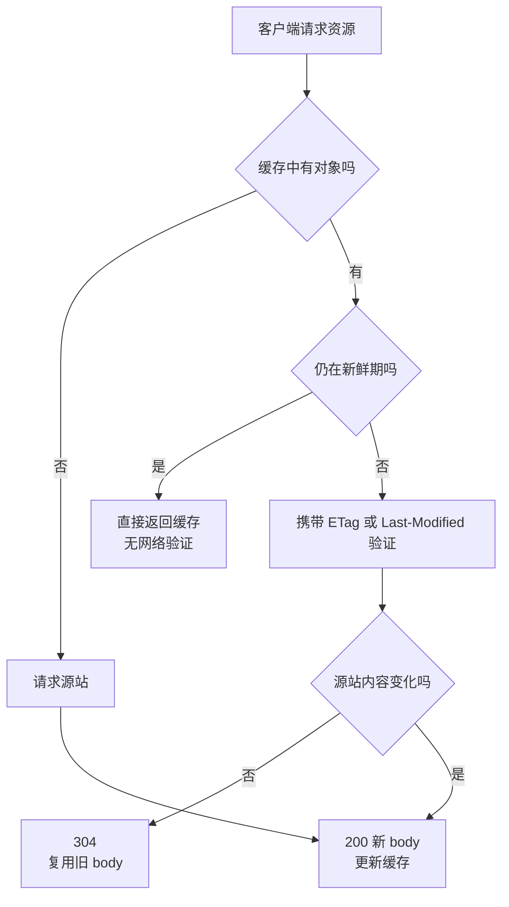
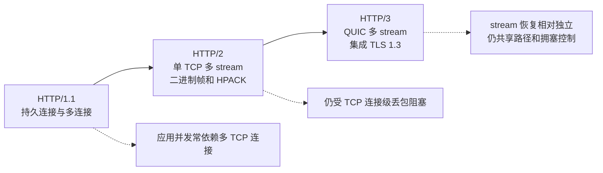

# DNS、HTTP、缓存与连接演进

## 本节知识地图



## DNS 解决什么问题

应用使用域名，人和服务不应依赖固定 IP。DNS 是分层、分布式命名系统，把域名解析为地址或其他记录。

常见记录：

- A：IPv4 地址。
- AAAA：IPv6 地址。
- CNAME：别名。
- MX：邮件服务器。
- TXT：文本验证和策略。
- NS：权威服务器。

## 解析过程

简化：



客户端通常向递归解析器发起递归请求；解析器代表客户端执行迭代查询。

实际还可能有本地代理、企业 DNS、DoH/DoT 和多级缓存。

## TTL 与缓存

DNS 记录 TTL 指示缓存时长。权衡：

- TTL 长：查询少、切换生效慢。
- TTL 短：切换更快、查询压力和依赖更高。

缓存不是保证严格在某时刻同时过期，递归器和客户端实现会影响观察。

## DNS 使用 UDP 还是 TCP

传统 DNS 常先用 UDP 53，响应截断、区域传送或其他需要时使用 TCP。现代还可能使用 DoT、DoH，或基于新传输。

不要回答“DNS 只使用 UDP”。

## CDN

CDN 把内容和计算部署到靠近用户的边缘节点。调度可能结合：

- DNS。
- Anycast。
- 用户网络和地理位置。
- 节点健康与负载。
- 内容缓存状态。

CDN 缓存命中能减少回源延迟与带宽；动态请求仍可能回源或在边缘执行。

## HTTP 是应用层协议

HTTP 定义请求与响应语义：

```text
请求：
method path version
headers

body

响应：
version status
headers

body
```

HTTP 可运行在 TCP+TLS 或 QUIC+TLS 等传输之上。

## 方法语义

| 方法 | 常见语义 | Safe | Idempotent |
|------|----------|------|------------|
| GET | 获取表示 | 是 | 是 |
| HEAD | 只取响应元数据 | 是 | 是 |
| POST | 提交处理/创建子资源 | 否 | 通常否 |
| PUT | 用完整表示创建或替换目标 | 否 | 是 |
| PATCH | 部分修改 | 否 | 不一定 |
| DELETE | 删除目标 | 否 | 语义上是 |

幂等表示执行一次或多次的预期资源效果相同，不代表每次响应码、日志和副作用完全相同。

GET 参数在 URL、POST body 不在地址栏，不构成安全边界；两者都应使用 HTTPS 保护传输。

## 状态码按职责理解

- 1xx：过程信息。
- 2xx：请求成功处理。
- 3xx：重定向或缓存协商。
- 4xx：客户端请求、认证或权限问题。
- 5xx：服务端处理或上游问题。

典型区别：

- 401：缺少/无效认证。
- 403：服务器理解身份但拒绝权限。
- 404：资源不可见或不存在。
- 429：请求过多。
- 502：网关从上游得到无效响应。
- 503：暂不可用。
- 504：网关等待上游超时。

## HTTP 缓存

### 新鲜度

`Cache-Control: max-age` 等指示响应在一定时间内可直接复用。

### 条件请求

缓存过期后可带：

- If-None-Match / ETag。
- If-Modified-Since / Last-Modified。

服务器确认未改变时返回 304，无需传完整 body。

### 缓存键与 Vary

不同请求头可能得到不同表示。`Vary` 告诉缓存哪些请求头参与区分。



错误缓存可能泄漏用户数据，认证响应和共享缓存需谨慎。

## Cookie 与 Session

Cookie 是浏览器按域、路径等规则保存并随请求发送的小数据。

常见属性：

- Secure：只通过安全连接发送。
- HttpOnly：JavaScript 不可读取。
- SameSite：限制跨站发送。
- Max-Age/Expires。

Session 通常指服务端会话状态，Cookie 可保存 session id。两者不是互斥概念。

分布式部署需考虑 session 共享、粘性路由或无状态 token 的权衡。

## HTTP/1.1

主要能力：

- 持久连接。
- Host 支持虚拟主机。
- 分块传输。
- 缓存控制。

可使用流水线，但浏览器支持和队头阻塞限制使其实际使用有限；通常通过多个 TCP 连接提高并发。

## HTTP/2

- 二进制帧。
- 一个连接上多路复用多个 stream。
- HPACK 头部压缩。
- stream 优先级/流控等机制。

它解决应用层请求串行问题，但多个 stream 仍共享一个 TCP 字节流；底层丢包恢复期间可能影响连接上的多个 stream。

## HTTP/3

HTTP/3 基于 QUIC（通常承载于 UDP）：

- 传输层提供独立 stream。
- TLS 1.3 集成。
- 连接迁移。
- 用户态更易演进。

某个 stream 丢包通常不会像 TCP 字节流那样阻塞其他已完整 stream，但共享拥塞控制和网络资源仍会互相影响。



## Keep-Alive 的两个含义

- HTTP persistent connection：多个 HTTP 请求复用连接。
- TCP keepalive：内核在长时间空闲后探测连接是否还活着。

目的、配置和时间尺度不同。

## 动手观察

下面先把 DNS 命名体系和 HTTP 消息语义完整展开，再进入观察。

---

## 深入一：域名为什么存在

### 1. IP 不适合直接写进所有配置

服务器地址会变化：

- 扩容和迁移。
- 多地域部署。
- CDN 调度。
- 容灾切换。
- IPv4/IPv6 共存。

如果客户端硬编码 IP：

- 变更困难。
- 无法按用户位置调度。
- 运维与证书语义混乱。

### 2. Domain Name

**直译**：域名。

为服务提供层次化、可读的名字，例如：

```text
api.example.com
```

DNS 不只把域名变 IP，还能发布邮件、权威服务器、验证文本和服务相关信息。

### 3. DNS

**Domain Name System，域名系统。**

它是一套：

- 分层命名空间。
- 分布式数据库。
- 查询协议。
- 缓存体系。

### 4. DNS 不是什么

- 不是一个全球只有一台的服务器。
- 不是所有结果永久固定。
- 不是每次请求都从根开始。
- 不是只返回 IPv4。
- 不是只使用 UDP。

---

## 深入二：域名树与权威

### 1. Root

域名树根写作末尾的点：

```text
www.example.com.
```

日常常省略最后的点。

### 2. TLD

**Top-Level Domain，顶级域。**

例如：

- `.com`
- `.org`
- `.cn`

### 3. Registrable Domain

用户可注册和管理的域名边界受公共后缀规则影响，不能一律只取最后两段。

### 4. Subdomain

在管理域下继续划分：

```text
api.example.com
static.example.com
```

### 5. Zone

**直译**：区域。

DNS 管理可把某个子树委派给另一组权威服务器。Zone 不必等于整个域名树的直觉边界。

### 6. Authoritative Server

**直译**：权威服务器。

对某个 Zone 的记录提供权威答案。

它不是替客户端递归查询全世界，而是回答自己负责区域的信息。

### 7. Delegation

父区域通过 NS 等记录告诉查询者：

```text
这个子区域应去问哪些权威服务器
```

这让 DNS 管理可以分布式扩展。

---

## 深入三：常见记录类型

### 1. A

域名到 IPv4：

```text
example.com -> 192.0.2.10
```

### 2. AAAA

域名到 IPv6。

### 3. CNAME

**Canonical Name，规范名称。**

把一个名字指向另一个名字：

```text
www.example.com -> edge.example-cdn.net
```

解析器还需继续查询目标名称对应地址。

### 4. NS

指定某区域的权威 DNS 服务器。

### 5. MX

指定域名的邮件交换服务器，并可带优先级。

### 6. TXT

文本记录，常用于：

- 域名所有权验证。
- 邮件 SPF/DKIM/DMARC 相关策略。
- 服务配置。

不是普通大文本存储系统。

### 7. PTR

反向解析：

```text
IP -> 域名
```

需要相应反向区域配置，不是把 A 记录自动倒过来。

### 8. SOA

**Start of Authority。**

描述区域的权威起始信息、序列号和一些计时参数。

### 9. SRV

可描述某服务：

- 目标主机。
- 端口。
- 优先级。
- 权重。

客户端必须显式支持相应发现规则。

---

## 深入四：递归解析与迭代查询

### 1. Stub Resolver

应用/操作系统中的轻量解析客户端，通常把完整问题交给配置的递归解析器。

### 2. Recursive Resolver

**直译**：递归解析器。

代表客户端完成查询并缓存结果。

来源可能是：

- 家庭路由器/运营商。
- 企业 DNS。
- 公共 DNS。
- 本地系统服务。

### 3. Recursive Query

客户端希望解析器给最终答案或错误，而不是只给下一个该问谁。

### 4. Iterative Query

递归解析器逐步查询：

```text
根：去问 .com
.com：去问 example.com 权威
权威：目标记录是 ...
```

### 5. 完整冷查询

```text
应用
  -> 浏览器/应用缓存
  -> 操作系统缓存与 hosts
  -> 递归解析器缓存
  -> 根服务器
  -> TLD 服务器
  -> 权威服务器
  -> 递归器缓存
  -> 返回应用
```

### 6. 缓存命中

任意较前层已有有效结果：

- 不必走完整链路。
- 延迟更低。
- 权威压力更小。

### 7. CNAME 链

若答案是 CNAME：

- 还需解析规范名称。
- 可能跨另一个权威区域。
- 链过长会增加查询和故障点。

### 8. hosts 文件

本地静态名称映射可优先参与解析。具体顺序受系统名称服务配置影响。

---

## 深入五：TTL、缓存与一致性

### 1. TTL

**Time To Live，生存时间。**

DNS 响应中的 TTL 指示缓存结果可保留多久。

### 2. 长 TTL

优点：

- 查询少。
- 解析快。
- 权威压力低。
- 上游故障时已有缓存可继续一段时间。

缺点：

- IP 变更传播慢。
- 故障切换不能立即覆盖旧缓存。

### 3. 短 TTL

优点：

- 调度和切换更快生效。

缺点：

- 查询频率高。
- 更依赖解析器与权威可用性。
- 客户端实现可能设置自己的最小/最大策略。

### 4. TTL 不代表全球同时更新

不同缓存项创建时间不同：

```text
解析器 A 在 10:00 缓存
解析器 B 在 10:04 缓存
```

即使 TTL 相同，过期时间也不同。

### 5. Negative Caching

**直译**：负缓存。

不存在域名等否定结果也可缓存：

- 减少重复无效查询。
- 新增记录后可能仍受旧负缓存影响。

### 6. 发布变更策略

计划切换前：

1. 提前降低 TTL。
2. 等旧长 TTL 大部分过期。
3. 修改记录。
4. 保持旧目标一段兼容期。
5. 稳定后再提高 TTL。

仅在切换瞬间降低 TTL 对已缓存旧值的解析器无效。

---

## 深入六：DNS 传输

### 1. UDP 53

传统普通查询常使用 UDP：

- 无连接开销。
- 一问一答简单。
- 延迟低。

### 2. 截断与 TCP

响应太大时可能设置截断标志，客户端改用 TCP 重试。

### 3. TCP 53

还可用于：

- 大响应。
- 区域传送。
- 特定安全/部署需求。

### 4. EDNS

扩展 DNS 能力和 UDP 报文大小等信息，但过大 UDP 响应会增加：

- 分片风险。
- 放大攻击风险。
- 中间设备兼容问题。

### 5. DoT

**DNS over TLS。**

把 DNS 查询放在 TLS 连接中，保护客户端到解析器这一段的内容与完整性。

### 6. DoH

**DNS over HTTPS。**

通过 HTTPS 传输 DNS。

优点：

- 加密客户端到解析器。
- 可复用 Web 传输基础设施。

权衡：

- 运维可见性变化。
- 企业策略和解析路径更复杂。
- 解析器本身仍能看到查询。

### 7. 加密 DNS 不隐藏所有元数据

目标 IP、连接对象、流量时序以及后续访问仍可能暴露信息。

---

## 深入七：DNS 故障

### 1. NXDOMAIN

域名不存在的权威否定答案。

### 2. SERVFAIL

解析器未能完成查询：

- 权威不可达。
- DNSSEC 验证失败。
- 上游错误。
- 内部故障。

### 3. Timeout

没有及时收到答案：

- 网络丢包。
- 解析器过载。
- 防火墙。
- TCP 回退失败。

### 4. 返回错误地址

查询成功但连接到错误/旧地址：

- 记录配置错误。
- 缓存旧值。
- 分地域调度。
- split-horizon DNS。

### 5. Split-horizon

同一名称在不同网络返回不同结果：

- 内网地址。
- 公网地址。
- 地域/租户定制。

排障必须记录“从哪个解析器、哪个网络查询”。

---

## 深入八：CDN

### 1. Content Delivery Network

**直译**：内容分发网络。

把内容和部分计算部署到靠近用户的边缘节点。

### 2. 调度

可能结合：

- DNS 返回不同地址。
- Anycast。
- 用户网络和地域。
- 节点健康。
- 容量与成本。

### 3. Edge

**直译**：边缘节点。

直接面向用户连接：

- 终止 TCP/TLS。
- 缓存静态内容。
- 执行 WAF、压缩、图片处理。
- 回源获取未命中内容。

### 4. Origin

**直译**：源站。

保存原始内容或处理动态业务。

### 5. Cache Hit

边缘已有可用响应：

- 减少回源。
- 降低延迟。
- 节省源站带宽。

### 6. Cache Miss

边缘需向源站获取：

- 首个请求更慢。
- 源站压力增加。
- 可回填边缘缓存。

### 7. CDN 不是只复制静态文件

现代 CDN 还可能：

- 动态加速。
- 边缘计算。
- DDoS 防护。
- TLS 管理。
- 路由优化。

### 8. HTTPS 与 CDN

若 CDN 需要读取并缓存 HTTP 内容，通常：

- 客户端与 CDN 建 TLS。
- CDN 持有目标域名证书或被授权证书。
- CDN 到源站再建立独立安全连接。

它不是“在完全看不懂密文时直接缓存任意 HTTP 语义”。

---

## 深入九：URL

### 1. Uniform Resource Locator

**直译**：统一资源定位符。

示例：

```text
https://example.com:8443/docs?id=10#part
```

### 2. 组成

- scheme：`https`。
- host：`example.com`。
- port：`8443`。
- path：`/docs`。
- query：`id=10`。
- fragment：`part`。

### 3. Fragment

通常由客户端处理，不随普通 HTTP 请求发送给服务器。

### 4. Percent-Encoding

URL 中某些字节需百分号编码：

```text
space -> %20
```

字符先按编码变成字节，再进行 URL 规则处理。不能随意多次编码/解码。

### 5. Host 与连接地址

DNS 把 host 解析为 IP，HTTP 仍保留 Host/:authority 语义：

- 同一 IP 可托管多个站点。
- 服务器/代理按主机名路由。
- TLS SNI 也帮助选择证书。

---

## 深入十：HTTP 请求与响应

### 1. HTTP 语义

HTTP 定义：

- 对哪个资源。
- 执行什么方法。
- 带哪些元数据。
- 结果状态是什么。
- 内容怎样表示和缓存。

### 2. HTTP/1.1 请求

概念形式：

```text
GET /items/42 HTTP/1.1
Host: api.example.com
Accept: application/json

```

若有 body，头部空行后继续。

### 3. 响应

```text
HTTP/1.1 200 OK
Content-Type: application/json
Content-Length: ...

{...}
```

### 4. Header

承载元数据：

- 内容类型。
- 长度。
- 缓存。
- 认证。
- Cookie。
- 压缩。
- Trace。

### 5. Body

可以是：

- JSON。
- HTML。
- 图片。
- 二进制。
- 流式内容。

HTTP 不要求 body 一定是文本。

### 6. Content-Type

告诉接收方媒体类型和可能的字符编码。

仅看文件后缀或内容猜测可能产生安全和兼容问题。

### 7. Content-Encoding

表示内容经过 gzip、br 等编码压缩。

与字符编码不是一回事。

### 8. Transfer Framing

HTTP 版本需要明确一条消息 body 在哪里结束：

- Content-Length。
- chunked（HTTP/1.1）。
- 连接关闭。
- HTTP/2/3 帧和 stream 结束。

---

## 深入十一：方法、安全与幂等

### 1. Safe

**直译**：安全方法。

按协议预期不应修改服务器资源状态，例如 GET、HEAD。

不代表：

- 没有日志。
- 没有计费。
- 没有缓存更新。
- 传输内容天然安全。

### 2. Idempotent

**直译**：幂等。

相同请求执行一次或多次，对目标资源的预期效果相同。

不要求：

- 每次响应码相同。
- 日志条数相同。
- 时间戳完全相同。

### 3. GET

获取资源表示：

- safe。
- idempotent。
- 可按规则缓存。

不应把敏感信息放 URL，不是因为 GET 比 POST 加密弱，而是 URL 更容易进入日志、历史和引用。

### 4. POST

通常用于：

- 提交处理。
- 创建子资源。
- 非幂等操作。

也可通过幂等键设计安全重试。

### 5. PUT

通常表达用给定完整表示创建或替换已知目标 URI：

- 语义上幂等。
- 多次相同 PUT 最终资源状态相同。

### 6. PATCH

部分修改：

- 是否幂等取决于补丁语义。
- “设置值为 10”可幂等。
- “增加 1”通常不幂等。

### 7. DELETE

语义上幂等：

- 第一次删除成功。
- 后续可能返回 404。
- 最终资源仍是不存在。

### 8. 幂等与重试

网络超时造成模糊失败。客户端重试前要考虑：

- 方法语义。
- 幂等键。
- 服务端去重。
- 事务和唯一约束。

---

## 深入十二：状态码

### 1. 1xx

请求处理中的临时信息。

### 2. 2xx

- 200：成功并有一般响应。
- 201：资源创建成功。
- 202：已接受，处理可能尚未完成。
- 204：成功但无响应 body。

### 3. 3xx

- 301/308：永久重定向语义。
- 302/303/307：临时或方法处理语义有差异。
- 304：缓存验证后未修改，不是普通完整成功 body。

重定向是否保留方法需要按具体状态码规则。

### 4. 4xx

- 400：请求格式/参数无效。
- 401：缺少或无效认证，需要认证。
- 403：理解请求但拒绝授权。
- 404：不存在或不愿暴露。
- 409：资源状态冲突。
- 412：前置条件失败。
- 413：请求体过大。
- 429：请求过多。

### 5. 5xx

- 500：服务内部错误。
- 502：网关从上游获得无效响应。
- 503：服务暂不可用。
- 504：网关等待上游超时。

### 6. 502、503、504

| 状态 | 直觉 |
|---|---|
| 502 | 上游响应坏或连接异常 |
| 503 | 当前服务不可用/过载/维护 |
| 504 | 代理等待上游超时 |

实际网关产品的映射细节不同，需结合日志。

---

## 深入十三：HTTP 缓存

### 1. 缓存目标

- 降低延迟。
- 减少带宽。
- 降低源站压力。
- 在一定条件下提高可用性。

### 2. Private 与 Shared Cache

- 浏览器缓存：面向单用户。
- CDN/代理共享缓存：可能服务多个用户。

共享缓存必须谨慎处理认证和个性化内容。

### 3. Freshness

响应在新鲜期内可直接复用：

```text
Cache-Control: max-age=60
```

共享缓存还可能使用 `s-maxage` 等指令。

### 4. no-cache

常见误解是“完全不缓存”。

它通常表示可存储，但再次使用前必须向源站验证。

### 5. no-store

指示不应存储响应，适合敏感内容等场景。

### 6. ETag

资源表示的验证标识：

```text
ETag: "abc123"
```

过期后客户端：

```text
If-None-Match: "abc123"
```

未改变时：

```text
304 Not Modified
```

### 7. Last-Modified

时间验证：

```text
Last-Modified
If-Modified-Since
```

精度和语义可能不如实体标识适合所有场景。

### 8. 304 与本地新鲜命中

**Fresh cache hit：**

- 不发网络请求。
- 直接使用缓存。

**304 validation：**

- 发送条件请求。
- 服务端确认未修改。
- 节省 body，但仍有网络往返。

### 9. Vary

告诉缓存哪些请求头决定响应表示：

```text
Vary: Accept-Encoding
```

不同压缩能力需不同缓存对象。

### 10. Cache Key

通常包含 URI 和按 Vary 指定的请求维度。CDN 还可能自定义：

- Query 参数。
- Header。
- Cookie。

错误 key 会：

- 命中率差。
- 把一个用户内容返回给另一个用户。

### 11. 缓存失效

最难问题之一：

- TTL 到期。
- 版本化 URL。
- 主动 purge。
- 内容变更事件。

静态资源常用内容哈希文件名配长缓存。

---

## 深入十四：Cookie、Session 与 Token

### 1. Cookie

浏览器保存的小型键值数据，按域、路径、安全属性等决定何时发送。

### 2. Domain 与 Path

限制 Cookie 对哪些主机和路径生效。

范围设置过宽会增加暴露和意外发送。

### 3. Secure

只在安全连接上发送。

### 4. HttpOnly

阻止普通 JavaScript API 读取，降低某些 XSS 窃取风险，但 Cookie 仍可能随请求发送。

### 5. SameSite

限制跨站请求时是否发送，帮助降低 CSRF 风险。

### 6. Expires/Max-Age

控制持久时间。无持久期限的 Cookie 常按会话 Cookie 处理，具体生命周期受浏览器影响。

### 7. Session

服务端保存会话状态：

```text
Cookie: session_id=...
  -> 服务端查 session
  -> 得到用户状态
```

### 8. 分布式 Session

多实例部署选择：

- 共享 Session 存储。
- 粘性会话。
- 把可验证状态放 Token。

各有一致性、扩展性和失效权衡。

### 9. Token

客户端携带可验证凭据不代表服务端绝对无状态：

- 吊销。
- 权限变化。
- 密钥轮换。
- 刷新状态。

仍可能需要服务端数据。

### 10. Cookie 与 Session 不是二选一

Cookie 是客户端存储和自动发送机制，Session 是服务端状态概念。常用 Cookie 保存 Session ID。

---

## 深入十五：代理、网关与负载均衡

### 1. Forward Proxy

代表客户端访问外部：

- 客户端显式或透明使用。
- 代理知道目标。
- 可做访问控制、缓存和审计。

### 2. Reverse Proxy

代表服务端接收客户端：

- TLS 终止。
- 路由。
- 负载均衡。
- 缓存。
- 限流。

### 3. Host 与 X-Forwarded

经过代理后需要传递：

- 原始主机。
- 客户端地址。
- 协议。
- Trace 信息。

这些头部不能无条件信任外部客户端，应由可信代理覆盖/追加并建立信任边界。

### 4. Gateway Timeout

504 通常由代理报告其等待上游超时。真正慢点可能是：

- 上游排队。
- 数据库。
- 网络。
- 超时层级不一致。

---

## 深入十六：HTTP/1.1

### 1. Persistent Connection

同一 TCP 连接处理多个请求：

- 减少 TCP/TLS 握手。
- 减少临时端口和 TIME_WAIT。
- 保留拥塞窗口等连接状态。

### 2. Host

允许同一 IP/端口托管多个虚拟主机。

### 3. Content-Length

明确 body 长度。

### 4. Chunked Transfer

发送方不知道完整长度时，可分块传输并用结束块表示完成。

### 5. Pipelining

客户端可连续发送多个请求，不等前一个响应。

限制：

- 响应仍按请求顺序。
- 前一个响应慢会阻塞后面。
- 中间设备和错误处理复杂。
- 浏览器实践中使用有限。

### 6. 多连接

浏览器常为同一来源建立多个 TCP 连接提高并发，但：

- 每条都要握手。
- 各有拥塞状态。
- 占连接资源。

---

## 深入十七：HTTP/2

### 1. Binary Framing

把 HTTP 消息拆成二进制 frame，不再只靠文本行解析传输结构。

### 2. Stream

一个连接中有多个逻辑 stream：

```text
TCP connection
  ├── stream 1
  ├── stream 3
  └── stream 5
```

### 3. Multiplexing

不同 stream 的帧可交错传输：

- 不必等一个完整响应结束再传另一个。
- 减少应用层 HTTP/1.1 队头阻塞。

### 4. HPACK

压缩重复 HTTP 头部：

- 静态表。
- 动态表。
- 索引表示。

状态压缩也带来实现和安全复杂性。

### 5. Stream Flow Control

HTTP/2 有连接级和 stream 级流控：

- 防止一个接收方被数据淹没。
- 配置不当会限制吞吐。

### 6. TCP 队头阻塞

所有 stream 最终共享一条 TCP 有序字节流：

- 底层某段丢失。
- TCP 必须补齐缺口。
- 后续已到达字节不能越过缺口交给上层。
- 多个 stream 可能共同等待。

### 7. 一个连接也不是永远最佳

- 单连接丢包影响多个 stream。
- 单连接拥塞窗口共享。
- 连接可能有单点故障。
- 实际客户端和服务端可按策略使用多个连接。

---

## 深入十八：HTTP/3 与 QUIC

### 1. QUIC

基于 UDP 承载的用户态传输协议：

- 自己实现可靠性和拥塞控制。
- 集成 TLS 1.3。
- 提供多 stream。
- 使用 Connection ID。

### 2. 为什么使用 UDP

不是为了放弃可靠性，而是：

- 在用户态更快演进。
- 避免部署新 IP 传输协议的中间设备兼容障碍。
- 由 QUIC 自己提供可靠 stream。

### 3. 独立 stream

某个 stream 丢失数据：

- 该 stream 等待重传。
- 其他已完整 stream 通常可以继续交付。

减少 TCP 连接级队头阻塞。

### 4. TLS 集成

QUIC 握手与 TLS 1.3 更紧密结合，减少建立传输与安全连接的重复往返。

### 5. Connection ID

连接不只绑定传统四元组，可在客户端网络地址变化时继续识别连接，例如 Wi-Fi 切换蜂窝网络。

### 6. 仍然共享什么

多个 stream 仍共享：

- 连接拥塞控制。
- 路径带宽。
- CPU。
- 连接级流控等资源。

所以不是完全互不影响。

### 7. HTTP/3 不保证任何网络都更快

受：

- UDP 是否被限制。
- 实现质量。
- RTT 与丢包。
- 连接复用。
- CPU 和加密。

影响。客户端常需要回退策略。

---

## 深入十九：Keep-Alive 三个概念

### 1. HTTP Persistent Connection

多个 HTTP 请求复用同一传输连接。

### 2. TCP Keepalive

内核在连接长期空闲后发送探测，判断对端是否仍可达。

### 3. Application Heartbeat

应用协议主动发送 ping/pong：

- 检测业务处理链。
- 更灵活的时间配置。
- 增加流量和状态。

三者目的和时间尺度不同，不能只说“开 keepalive”。

---

## 深入二十：一次 HTTP 缓存请求

首次：

```text
客户端无缓存
  -> GET
  -> 200 + body
  -> Cache-Control max-age=60
  -> ETag "v1"
  -> 保存
```

60 秒内：

```text
直接使用本地缓存
  -> 无网络请求
```

过期后：

```text
GET + If-None-Match: "v1"
  -> 未修改
  -> 304
  -> 客户端复用旧 body
```

内容已更新：

```text
GET + If-None-Match: "v1"
  -> 200 + 新 body + ETag "v2"
```

---

## 补充面试题：直接背诵

### Q1：DNS 解析过程

> 应用先查自身缓存，再经过系统缓存、hosts 和配置的递归解析器。递归器命中缓存就直接返回，否则代表客户端依次向根、TLD 和权威服务器做迭代查询，缓存 TTL 后返回。CNAME 可能引出额外名称查询，实际还可能使用企业代理、DoH 或分地域解析。

### Q2：递归与迭代区别

> 递归查询要求被询问者给最终答案或错误，客户端通常向递归解析器这样请求；迭代查询返回当前已知答案或下一步该问的权威，递归解析器通常用它逐级查询根、TLD 和权威服务器。

### Q3：DNS TTL 如何权衡

> 长 TTL 减少查询、降低延迟和权威压力，但记录变更与故障切换传播慢；短 TTL 切换快但增加查询和依赖。变更前应提前降低 TTL 并等待旧缓存过期，不能在切换瞬间降低就期待全球立即生效。

### Q4：DNS 使用 UDP 还是 TCP

> 传统普通查询常先用 UDP 53；响应截断、大响应、区域传送等会使用 TCP。现代还有 DoT 和 DoH。因此不能回答 DNS 只使用 UDP，具体取决于响应大小、操作类型和部署。

### Q5：HTTP 幂等是什么意思

> 相同请求执行一次或多次，对目标资源的预期效果相同，不要求每次响应码、日志或时间戳完全一致。GET、PUT、DELETE 语义上通常幂等，POST 通常不是，但可通过幂等键和服务端去重支持安全重试。

### Q6：401 与 403

> 401 通常表示缺少或无效认证，需要提供有效身份凭据；403 表示服务器理解请求和身份但拒绝授权。实际系统也可能用 404 隐藏敏感资源存在性。

### Q7：no-cache 与 no-store

> no-cache 通常允许存储，但每次复用前必须向源站验证；no-store 表示不应存储响应。名字容易误导，缓存行为还要结合 private/public、max-age 和客户端实现。

### Q8：304 与浏览器直接命中区别

> 新鲜缓存可直接使用，不产生网络往返；304 表示缓存已需要验证，客户端发条件请求，服务端确认未修改后只返回元数据，客户端复用已有 body。304 省带宽但仍有网络延迟。

### Q9：HTTP/1.1、2、3 演进

> HTTP/1.1 用持久连接并常借多 TCP 连接提高并发；HTTP/2 用二进制帧和 stream 在单 TCP 连接多路复用并压缩头部，但仍受 TCP 连接级丢包阻塞；HTTP/3 基于 QUIC，集成 TLS 1.3，让 stream 丢包恢复相对独立并支持连接迁移。

### Q10：HTTP keep-alive 与 TCP keepalive

> HTTP persistent connection 是多个请求复用连接，减少握手；TCP keepalive 是内核在长时间空闲后探测连接是否仍可达；应用心跳又能验证更高层业务状态。三者目的、配置和时间尺度不同。

---

## 补充理解检查

### 判断题

1. DNS 是全球一台中心服务器。
2. 递归解析器每次都必须从根查询。
3. CNAME 直接保存目标 IP。
4. TTL 到期时全球缓存同时失效。
5. DNS 只使用 UDP。
6. URL fragment 通常随 HTTP 请求发送。
7. POST body 因不在地址栏所以无需 HTTPS。
8. DELETE 语义幂等表示每次响应必须完全相同。
9. no-cache 表示绝对不能存储。
10. 304 响应通常需要一次网络验证。
11. Cookie 和 Session 是互斥方案。
12. HTTP/2 多路复用消除了 TCP 层队头阻塞。
13. QUIC 基于 UDP 所以不可靠。

答案：1 错，2 错，3 错，4 错，5 错，6 错，7 错，8 错，9 错，10 对，11 错，12 错，13 错。

### 讲解题

1. 画出根、TLD、权威和递归器。
2. 解释 DNS 变更前为什么要提前降 TTL。
3. 比较 A、AAAA、CNAME、NS 和 MX。
4. 拆解一个完整 URL。
5. 为创建订单接口设计幂等重试。
6. 画出 max-age + ETag 的三次请求。
7. 解释 Vary 配置错误怎样泄漏内容。
8. 比较浏览器 Cookie、服务端 Session 和 Token。
9. 画出 HTTP/2 stream 如何映射到一个 TCP 字节流。
10. 解释 QUIC 为什么仍需要拥塞控制。

```bash
dig example.com
dig +trace example.com
curl -v https://example.com/
curl -I https://example.com/
curl --http2 -I https://example.com/
```

观察 DNS 记录、响应头、缓存字段、连接复用和协议版本。

## 常见误区

- DNS 不只使用 UDP。
- POST 不因参数在 body 就更安全。
- HTTP 幂等不等于每次响应完全相同。
- Cookie 在客户端，Session 状态通常在服务端，两者可配合。
- HTTP/2 多路复用没有消除 TCP 层丢包影响。
- CDN 不只是“复制静态文件”，也包含调度、回源和边缘能力。

## 面试表达

**HTTP/1.1、HTTP/2、HTTP/3 怎样演进？**

> HTTP/1.1 通过持久连接等改进复用，但并发常依赖多连接；HTTP/2 用二进制帧和 stream 在单 TCP 连接多路复用，并压缩头部，但仍受 TCP 连接级丢包恢复影响；HTTP/3 基于 QUIC，把 stream、TLS 1.3 和连接迁移整合到用户态传输，减少跨 stream 队头阻塞并便于演进。

**追问链**

1. 递归 DNS 和迭代查询分别是谁做？
2. TTL 长短怎样权衡？
3. 304 与 200 from cache 有什么差异？
4. 幂等与重试有什么关系？
5. HTTP keep-alive 与 TCP keepalive 有什么区别？

## 理解检查

1. 画出递归解析器查询权威 DNS 的过程。
2. 判断一组方法的 safe/idempotent 属性。
3. 设计带 ETag 的条件请求。
4. 解释 HTTP/2 stream 与 TCP 字节流的关系。

---

[上一课：UDP 与 TCP](../03-transport-tcp/index.html) | [下一课：TLS 与排障 →](../05-tls-debugging/index.html)
