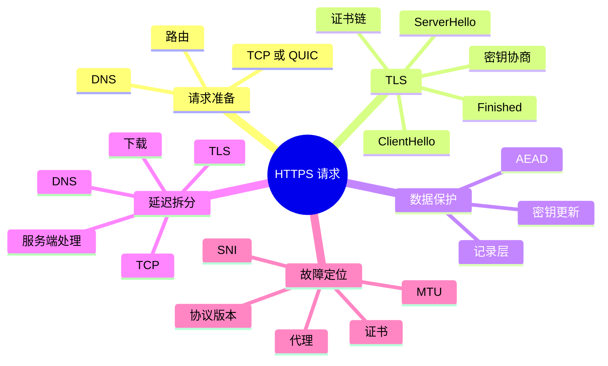
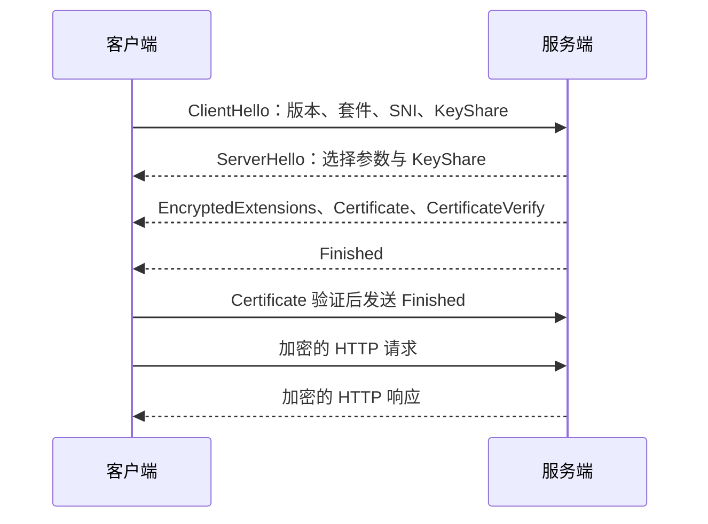

# TLS、完整请求链路与网络排障

前几章分别解释了名称解析、路由和传输。真实应用通常把它们连成一次 HTTPS 请求：用户输入域名，客户端找到地址，建立连接，验证服务器身份，协商密钥，发送 HTTP 请求，再等待服务端响应。任何一步都可能失败或变慢。

TLS（Transport Layer Security，传输层安全协议）解决的是不可信网络上的三个问题：旁观者不能读懂内容，攻击者不能悄悄修改内容，客户端能够验证自己连接的是哪个服务。TLS 保护通信通道，不会自动保证服务器业务逻辑正确，也不会隐藏所有流量特征。

## 本章知识地图



## 一、HTTPS 不只是“加一个锁”

HTTP 定义请求方法、目标资源、头部和响应状态；HTTPS 表示 HTTP 数据通过 TLS 通道传输。先有网络可达性，再有 TLS 握手，握手成功后才开始保护应用数据。把 HTTPS 当作独立的“更安全协议”会掩盖它与 DNS、TCP、证书和应用层的依赖关系。

一次首次访问通常包含以下等待：

```text
域名解析 → TCP 三次握手 → TLS 握手 → 发送 HTTP 请求 → 服务端处理 → 接收响应
```

连接复用、缓存和会话恢复可以跳过其中部分步骤。排障时要记录每个阶段的开始和结束时间，不要只看浏览器显示的总耗时。

## 二、TLS 先协商能力，再证明身份

TLS 连接两端先交换支持的协议版本、密码套件、扩展和随机数。客户端的 ClientHello 会携带目标名称等信息，服务端据此选择参数并返回 ServerHello。双方随后进行密钥交换，得到只有通信两端能够计算出的共享秘密。

证书解决的是身份问题，不是直接拿来加密所有业务数据。服务器证书由证书颁发机构签名，客户端验证证书链是否可信、主机名是否匹配、有效期是否正确以及是否被撤销或被策略禁止。证书验证失败时，即使网络和服务端端口都可达，TLS 也不应继续发送普通 HTTP 内容。

TLS 1.3 的握手和记录保护规范见 [RFC 8446](https://www.rfc-editor.org/rfc/rfc8446)。实际实现可能启用会话恢复和 0-RTT，但 0-RTT 数据存在重放风险，只适合明确幂等的请求，不能把它当成无条件降低延迟的开关。

## 三、TLS 1.3 握手的状态变化

用简化流程看，客户端先表达能力并提供密钥交换材料；服务端选择参数、发送证书和证明自己持有私钥的签名；双方验证握手 transcript（握手消息记录）并发送 Finished，之后使用派生出的流量密钥保护应用数据。



这里有三条不同的证明链：协商参数说明双方如何通信，证书和签名说明服务端拥有对应身份密钥，Finished 说明双方对之前握手消息的理解一致。密码算法失败、证书不可信和 Finished 校验失败，代表不同阶段的问题。

## 四、密钥和记录层怎样保护数据

握手得到的共享秘密不会直接作为所有数据的单一密钥。TLS 使用密钥派生过程，为握手、应用数据和后续更新产生不同的 traffic secret（流量秘密）及密钥。记录层把应用数据分成记录，附带类型和长度等信息，再使用 AEAD（Authenticated Encryption with Associated Data，带附加数据认证的加密）同时提供机密性和完整性。

完整性校验能发现数据被修改，但不能修复网络丢包；传输层仍需负责交付和重传。TLS 记录也可能被分片或合并，应用看到的 HTTP 消息边界不能由一次 TLS `read` 调用直接推断。

密钥更新允许长连接定期切换流量密钥，降低单个密钥长期使用的影响。密钥更新不会重新验证服务器身份，也不等于重新建立 TCP 连接。

## 五、证书链到底验证什么

客户端收到服务器证书后，通常从服务器证书向上构造一条链，直到本地信任库中的根证书。它会检查每张证书的签名、用途、有效期和名称约束，并把目标主机名与证书中的 SAN（Subject Alternative Name，主题备用名称）匹配。

常见失败包括：证书过期、本机时钟错误、缺少中间证书、主机名不匹配、信任库过旧、代理替换证书但客户端不信任代理根证书。关闭证书验证可以暂时绕过报错，却删除了身份认证，不应作为正常修复。

服务器发送证书链时通常不需要发送根证书；客户端能否构造可信链取决于本地信任库和服务器提供的中间证书。不同客户端环境的结果可能不同，所以排障要记录客户端版本、系统和代理路径。

## 六、把一次请求拆成可测量阶段

可以用浏览器开发者工具、`curl` 或应用埋点把总耗时分段：DNS 查询、建立 TCP、TLS 握手、发送请求、等待首字节和下载响应。首字节等待长可能是服务端排队或上游依赖，下载阶段长可能是响应体大、带宽不足或丢包重传。

```sh
curl -sS -o /dev/null \
  -w 'dns=%{time_namelookup} connect=%{time_connect} tls=%{time_appconnect} start=%{time_starttransfer} total=%{time_total}\n' \
  https://example.com/
```

这些字段是客户端观察到的阶段时间，不是服务端内部精确耗时。若复用连接，DNS、TCP 和 TLS 可能显示为零或极小值；应先明确是否为冷连接。

命令行还可以检查证书和协商过程：

```sh
openssl s_client -connect example.com:443 -servername example.com -showcerts
curl -v --http1.1 https://example.com/
curl -v --http2 https://example.com/
```

输出中的证书链、协议版本和 ALPN（Application-Layer Protocol Negotiation，应用层协议协商）能帮助区分证书问题、HTTP 版本协商问题和服务端处理问题。不要把测试域名或生产敏感信息写入公开日志。

## 七、按症状定位网络与 TLS 故障

如果域名解析失败，先检查 DNS 服务器、缓存和权威记录；如果有 IP 却无法连接，检查路由、下一跳、端口监听、防火墙和 NAT；如果 TCP 成功但 TLS 失败，优先检查 SNI、证书链、主机名、时钟、协议版本和代理；如果 TLS 成功但首字节慢，再看服务端队列、数据库和上游依赖。

“浏览器提示证书错误”通常已经说明 TCP 和部分 TLS 消息可达，但不能据此判断应用服务健康。“小响应能返回，大响应卡住”则还要检查 MTU、分片、代理缓冲和流控，不要只重装证书。

HTTP/2 多路复用可以减少连接数量，但 TCP 丢包可能阻塞同一连接上的多个流；HTTP/3 把 HTTP 语义映射到 QUIC（Quick UDP Internet Connections，基于 UDP 的快速网络连接协议），由 QUIC 提供按流的复用和流控，规范见 [RFC 9114](https://www.rfc-editor.org/rfc/rfc9114)。升级协议不等于所有延迟问题自动消失。

## 常见误区

TLS 加密不能替代身份验证；不验证证书的“加密连接”可能连接到了攻击者。证书有效也不等于应用接口授权正确，身份、权限和业务签名属于不同层次。

TCP 建连成功不等于 HTTPS 可用。TLS 还要协商参数、验证证书和完成 Finished；TLS 成功也不等于服务端已经快速处理业务。

0-RTT 减少等待是以重放约束为代价的。创建订单、扣款等非幂等操作不应仅因为延迟而启用早期数据。

`curl -k` 能帮助确认“是不是证书校验导致失败”，但不能作为生产修复；它只是暂时关闭了重要安全检查。

## 面试表达

回答 HTTPS 时，先把 DNS、TCP、TLS 和 HTTP 分层。TLS 握手协商版本和密码套件，通过证书链与主机名验证服务端身份，再用密钥派生和 AEAD 记录保护应用数据。排障时按照 DNS、连接、证书协商、首字节和下载阶段分别测量；看到失败现象，先定位阶段，再选择对应工具。

## 理解检查

1. 证书验证解决身份问题，密钥协商解决什么问题？
2. TLS 握手成功后，为什么仍可能出现应用请求超时？
3. `curl` 的 `time_connect` 和 `time_appconnect` 分别覆盖哪些阶段？
4. 为什么关闭证书校验不是正常修复？
5. HTTP/3 与 HTTP/2 的多路复用分别位于什么传输基础上？

## 可观察实验

使用 `curl -w` 分别记录 DNS、TCP、TLS、首字节和下载阶段的时间；再用 `openssl s_client` 查看证书链、主机名和协商协议。比较冷连接与复用连接，解释哪些阶段被跳过。实验只针对自己有权限访问的站点，不关闭证书校验。

## 术语卡片

| 缩写 | 英文全称 | 中文名称 | 本章作用 |
|------|----------|----------|----------|
| TLS | Transport Layer Security | 传输层安全协议 | 认证并保护通信通道 |
| HTTPS | HTTP over TLS | 基于 TLS 的 HTTP | 在加密通道中传输 HTTP |
| AEAD | Authenticated Encryption with Associated Data | 带附加数据认证的加密 | 同时提供机密性和完整性 |
| SNI | Server Name Indication | 服务器名称指示 | 在握手中表达目标主机名 |
| ALPN | Application-Layer Protocol Negotiation | 应用层协议协商 | 协商 HTTP/1.1、HTTP/2 等 |
| QUIC | Quick UDP Internet Connections | 基于 UDP 的快速网络连接协议 | 为 HTTP/3 提供传输能力 |
| DNS | Domain Name System | 域名系统 | 在请求准备阶段解析名称 |
