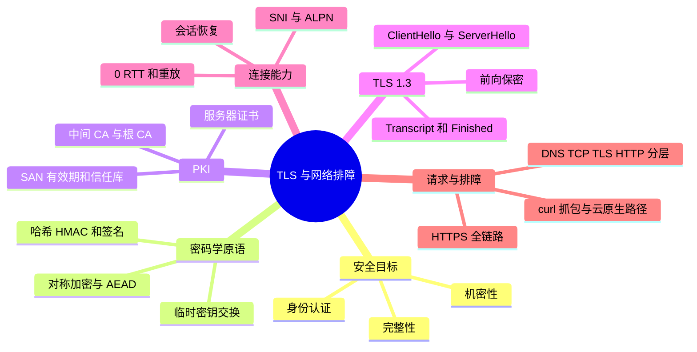
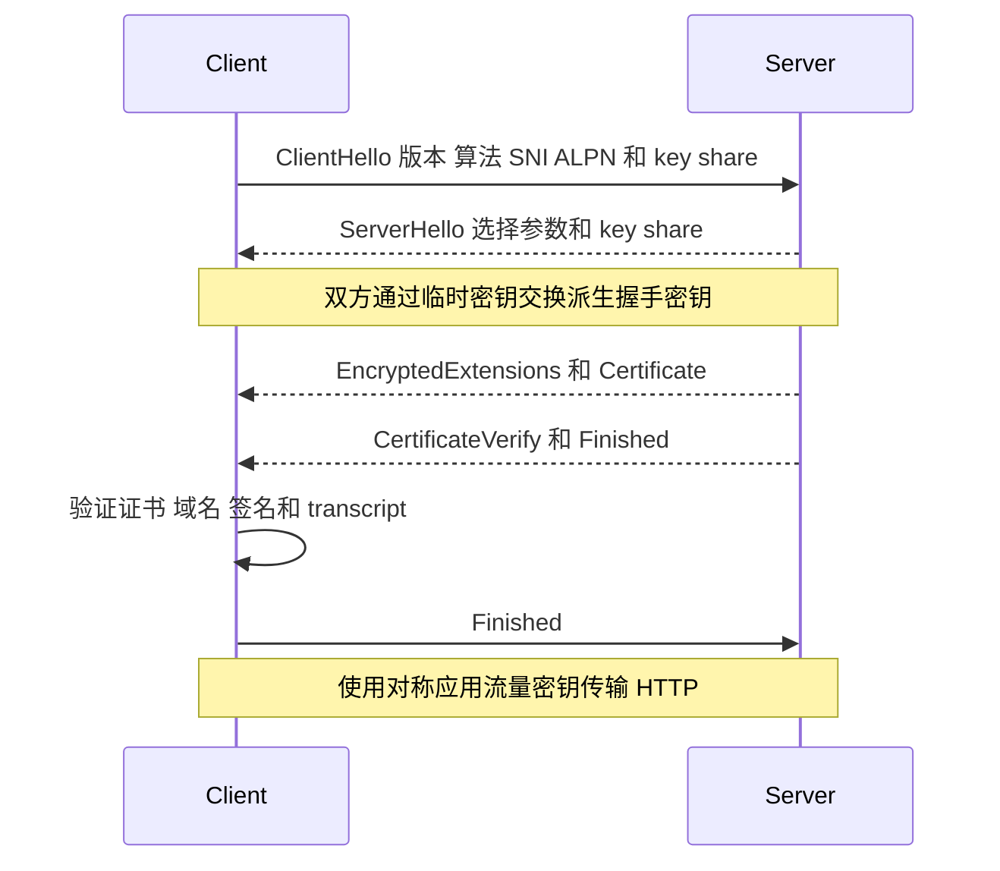
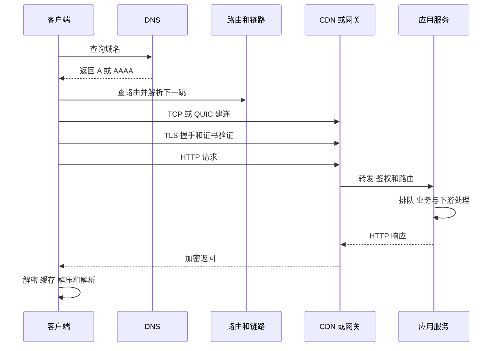
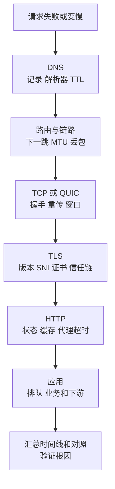

# TLS、完整请求链路与网络排障

## 本节知识地图



## TLS 解决什么问题

在不可信网络上传输，需要：

- 机密性：第三方不能读懂内容。
- 完整性：篡改能被发现。
- 身份认证：客户端确认连接的是目标服务。

TLS 不自动保证服务端业务没有漏洞，也不隐藏所有元数据，例如 IP、流量大小和时序仍可能可见。

## 对称与非对称密码各做什么

### 对称加密

双方共享密钥，速度快，适合大量应用数据。

### 非对称密码

公钥和私钥成对，用于签名、认证和密钥协商等，计算成本更高。

### 哈希与 MAC

- 哈希把任意数据映射成固定长度摘要。
- MAC 用共享密钥验证完整性和来源。
- 数字签名用私钥签名、公钥验证。

TLS 组合多种原语，不是“用公钥加密全部 HTTP 内容”。

## 证书链

服务器证书通常包含：

- 域名信息。
- 公钥。
- 有效期。
- 签发者。
- 数字签名。

客户端验证：

1. 域名是否匹配。
2. 时间是否有效。
3. 证书用途是否允许。
4. 从服务器证书到受信任根 CA 的签名链。
5. 吊销等策略（行为依客户端）。

根证书通常预置在操作系统、浏览器或运行环境信任库。

## TLS 1.3 握手主线

简化：



密钥交换使用临时密钥时提供前向保密：未来服务器长期私钥泄漏，不应直接解密过去抓到的会话。

实际消息组合和加密边界以协议版本为准，不要把 TLS 1.2 的固定流程套到 TLS 1.3。

## SNI 与虚拟主机

同一 IP 可托管多个域名。客户端在握手中提供目标服务器名称，服务端据此选择证书和配置。

传统 SNI 本身可能明文可见；新机制试图进一步保护 ClientHello 中的敏感元数据，但部署支持需要具体确认。

## 会话恢复与 0-RTT

恢复可减少重复握手成本。0-RTT 允许客户端更早发送部分应用数据，但存在重放风险，只适合应用明确允许重放的幂等操作，并需要服务端防护。

“TLS 更快”不能只看握手 RTT，还要看证书验证、CPU、网络、连接复用和恢复命中。

## 一次 HTTPS 请求全过程



### 1. 解析 URL

得到 scheme、host、port、path 等。

### 2. DNS

查缓存和递归解析器，获得一个或多个地址。

### 3. 路由与链路

选择源地址、出接口和下一跳；需要时通过 ARP/邻居发现得到链路地址。

### 4. 建立传输

- HTTP/1.1/2 常建立 TCP。
- HTTP/3 建立 QUIC。

可能经过代理、负载均衡、NAT 和防火墙。

### 5. TLS

协商参数、验证证书、建立会话密钥。

### 6. HTTP

发送方法、路径、头部和 body。服务端经过网关、应用、缓存、数据库等处理。

### 7. 响应

客户端处理状态、缓存、解压、解析和渲染。

## 延迟怎样拆分

```text
总延迟 =
DNS
+ 连接建立
+ TLS
+ 请求上传
+ 服务端排队与处理
+ 首字节返回
+ 响应传输
+ 客户端处理
```

连接复用时 TCP/TLS 阶段可能省略。尾延迟还会受到丢包重传、GC、队列和下游依赖影响。

## 分层排障工具



| 层次 | 工具 | 观察 |
|------|------|------|
| DNS | dig、nslookup | 记录、解析器、TTL、耗时 |
| 路由 | ip route、traceroute、mtr | 路由选择、路径变化 |
| 链路 | ip link、ethtool | 丢包、错误、链路状态 |
| 传输 | ss、tcpdump | 状态、重传、窗口、握手 |
| TLS/HTTP | curl、openssl s_client | 证书、协议、响应头、阶段耗时 |
| 应用 | metrics、logs、trace | 排队、处理和依赖 |

## curl 分阶段计时

```bash
curl -sS -o /dev/null \
  -w 'dns=%{time_namelookup}\nconnect=%{time_connect}\ntls=%{time_appconnect}\nttfb=%{time_starttransfer}\ntotal=%{time_total}\n' \
  https://example.com/
```

解释时看增量，不要把累计时间字段直接当作每阶段独立耗时。

## DNS 问题排查

1. 直接检查配置的解析器。
2. 对比不同解析器结果。
3. 查看记录、CNAME、TTL。
4. 区分解析失败、超时和返回错误地址。
5. 检查缓存、分地域调度和权威配置。

应用报 connect timeout 时不一定是 DNS；先用分阶段计时。

## TCP 问题排查

### SYN 重传

可能是：

- 路由/ACL/防火墙丢弃。
- 服务未监听。
- accept/SYN 队列压力。
- 对端或中间网络故障。

拒绝（RST）和超时的含义不同。

### 已建立连接慢

查看：

- RTT 与重传。
- 接收/拥塞窗口。
- 应用是否及时读写。
- 服务端排队。
- MTU/PMTU。

## 抓包的边界

tcpdump/Wireshark 能看到线上包和时序，但：

- HTTPS body 默认加密。
- 本机硬件卸载可能影响抓包看到的分段/校验。
- 抓包点只代表该位置观察。
- 时间同步和过滤条件很重要。
- 生产抓包涉及隐私与权限。

## 常见场景

### ping 通但 curl 不通

- 目标允许 ICMP，但端口未监听。
- 防火墙允许 ICMP、不允许 TCP。
- TLS/HTTP 配置失败。
- DNS 指向不同地址。

### curl IP 成功、域名失败

- DNS 问题。
- Host/SNI 不匹配。
- 虚拟主机配置。
- 证书域名问题。

### 只有大请求失败

- MTU/PMTU black hole。
- 代理 body 限制。
- 超时、缓冲或流控。
- 应用层大小限制。

## 常见误区

- HTTPS 不隐藏目标 IP 和所有流量特征。
- 证书验证不只是“看是否过期”。
- TLS 不是用非对称加密传输全部业务数据。
- ping 通不代表 TCP、TLS 和 HTTP 正常。
- traceroute 某跳不响应不等于后续一定不可达。
- 抓包没有异常不代表应用没有排队或锁竞争。

## 面试表达

**从输入 URL 到收到响应发生什么？**

> 客户端解析 URL，查询本地和递归 DNS 得到地址；内核根据路由选择源地址、下一跳和链路封装；然后建立 TCP 或 QUIC，TLS 协商密钥并验证证书；在安全连接上发送 HTTP 请求。请求可能经过代理、负载均衡和应用依赖，响应再按相反方向返回，并由客户端处理缓存、解压和渲染。排障时应把 DNS、连接、TLS、首字节和下载阶段分开测量。

**追问链**

1. 证书链怎样验证？
2. TLS 为什么同时使用对称和非对称密码？
3. SNI 解决什么问题？
4. 0-RTT 为什么有重放风险？
5. ping 通但 HTTPS 超时怎样定位？
6. curl 各阶段时间怎样解释？

## 综合练习

练习前，先把安全目标、TLS 状态和分层排障方法完整展开。

---

## 深入一：先建立威胁模型

### 1. 明文网络的问题

不可信链路中的观察者可能：

- 读取内容。
- 修改内容。
- 冒充服务器。
- 重放旧消息。
- 阻断连接。

### 2. Confidentiality

**直译**：机密性。

没有密钥的第三方无法读懂应用内容。

它不自动隐藏：

- 通信双方 IP。
- 连接时间。
- 流量大小。
- 包的时序。

### 3. Integrity

**直译**：完整性。

传输中内容被修改时，接收方能够发现。

加密不天然等于完整性；现代安全协议通常使用认证加密同时提供。

### 4. Authentication

**直译**：身份认证。

客户端确认：

- 对端控制目标域名对应身份。
- 握手参数没有被中间人替换。

普通 HTTPS 多数只认证服务器；双向 TLS 还认证客户端证书。

### 5. Availability

**直译**：可用性。

TLS 不能阻止攻击者：

- 丢弃所有包。
- 占满带宽。
- 发起资源耗尽攻击。

密码协议不能单独保证可用性。

### 6. TLS 不解决什么

- 服务端业务漏洞。
- 已授权用户滥用。
- 客户端或服务器主机被攻陷。
- 应用日志泄漏明文。
- 数据库保存不当。
- 流量分析。

安全必须端到端考虑。

---

## 深入二：密码学原语分工

### 1. Symmetric Encryption

**直译**：对称加密。

加密和解密使用同一共享密钥。

优势：

- 速度快。
- 适合大量应用数据。

难点：

- 双方最初如何安全获得同一密钥。

### 2. Block Cipher 与 Stream Cipher

**分组密码：**

- 以固定大小块为基础。
- 需使用安全工作模式。

**流密码：**

- 生成密钥流与明文组合。
- nonce/密钥复用错误会非常危险。

应用不应自行拼装底层原语，应使用成熟协议和库。

### 3. AEAD

**Authenticated Encryption with Associated Data。**

同时提供：

- 机密性。
- 完整性/认证。
- 对不加密附加数据的完整性保护。

常见思想：

```text
ciphertext, tag = Encrypt(key, nonce, plaintext, aad)
```

接收方验证 tag 失败应拒绝数据。

### 4. Nonce

**直译**：一次性数。

同一密钥下必须遵循算法规定的唯一性/随机性要求。重复 nonce 可能泄漏内容或破坏认证。

TLS 协议负责按规范构造记录序号和 nonce 关系，应用不应擅自修改。

### 5. Asymmetric Cryptography

**直译**：非对称密码。

使用公钥/私钥对，常用于：

- 数字签名。
- 身份证明。
- 密钥协商。
- 某些加密方案。

计算通常比对称加密重，因此 TLS 不用服务器公钥直接加密全部大流量。

### 6. Hash

**直译**：哈希、摘要。

把任意长度输入映射成固定长度结果。

密码学哈希希望具备：

- 难以从摘要反推原文。
- 难以找到相同摘要的不同输入。
- 输入小变化导致输出显著变化。

普通哈希不带秘密密钥，不能单独证明消息来自谁。

### 7. HMAC

**Hash-based Message Authentication Code。**

使用共享秘密和哈希构造消息认证码：

- 验证完整性。
- 验证发送者持有共享密钥。

不提供机密性。

### 8. Digital Signature

**直译**：数字签名。

私钥签名，公钥验证：

- 证明签名者持有私钥。
- 保护被签数据完整性。

签名不等于加密内容。

### 9. Key Exchange

**直译**：密钥交换。

双方在不直接发送最终共享秘密的情况下，协商出共同密钥材料。

(EC)DHE 使用临时密钥可提供前向保密。

---

## 深入三：为什么不能只用一种密码技术

### 1. 只用对称加密

难题：

- 第一次连接前双方没有共享密钥。
- 若通过明文发送密钥，中间人可获得。

### 2. 只用非对称加密

问题：

- 大数据计算成本高。
- 数据长度和模式有算法限制。
- 现代协议更重视临时密钥协商与认证。

### 3. 只用哈希

任何人都能修改消息后重新计算普通哈希，不能证明来源。

### 4. TLS 的组合

```text
证书与签名
  -> 认证服务器身份

临时密钥交换
  -> 协商共享秘密

密钥派生
  -> 生成不同方向和阶段密钥

对称 AEAD
  -> 高效保护应用数据
```

---

## 深入四：PKI 与证书

### 1. Certificate

**直译**：证书。

把：

```text
身份/域名
  <-> 公钥
```

通过签发者数字签名绑定起来。

### 2. 证书包含什么

- Subject/标识。
- Subject Alternative Name。
- 公钥。
- 有效期。
- 签发者。
- 序列号。
- 用途约束。
- 签名算法。
- 签发者签名。

### 3. SAN

**Subject Alternative Name。**

现代客户端主要按 SAN 中的 DNS 名称/IP 匹配目标。

例如证书包含：

```text
DNS: example.com
DNS: www.example.com
```

访问未包含的 `api.example.com` 会域名不匹配，除非通配符规则覆盖。

### 4. Wildcard

```text
*.example.com
```

通常只匹配一个标签层级，例如 `a.example.com`，不应默认匹配任意深度或裸域 `example.com`。

具体遵循客户端和标准规则。

### 5. Root CA

根证书通常预置在：

- 操作系统信任库。
- 浏览器信任库。
- Java/语言运行时独立信任库。
- 企业自定义信任库。

不同客户端信任集合可能不同。

### 6. Intermediate CA

根 CA 通常不直接在线签发所有站点证书，而由中间 CA：

```text
Root
  -> signs Intermediate
      -> signs Server Certificate
```

### 7. 为什么服务器要发送中间证书

客户端通常预置信任根，不一定提前拥有该中间证书。服务器应提供构建链所需的中间证书。

漏发中间证书可能：

- 某些已缓存中间证书的客户端成功。
- 另一些客户端失败。

形成“只有部分用户报证书错”。

### 8. 自签名证书

证书用自己的私钥签名：

- 加密能力仍可存在。
- 但公共客户端默认不信任其身份。
- 内部环境可显式加入信任库。

“自签名”不等于“没有加密”，核心问题是信任来源。

---

## 深入五：证书验证

### 1. 域名匹配

请求 host 必须被证书 SAN 规则覆盖。

直接用 IP 访问：

- HTTP Host/SNI 可能不同。
- 证书也需包含对应 IP SAN 才能直接匹配。

### 2. 有效期

检查当前时间位于：

```text
Not Before <= now <= Not After
```

客户端时间错误也会导致证书看似未生效或已过期。

### 3. 签名链

客户端验证：

1. 服务器证书签名由中间 CA 公钥验证。
2. 中间证书由上级验证。
3. 最终链到本地信任锚。

### 4. 用途约束

证书与密钥必须允许服务器认证等目标用途。

### 5. 基本约束

中间证书应被允许作为 CA，路径长度和名称约束也可能限制签发范围。

### 6. 吊销

证书在到期前也可能需要撤销：

- 私钥泄漏。
- 错误签发。
- 主体变更。

客户端可通过 CRL、OCSP 或 stapling 等机制处理，具体行为和失败策略因客户端而异。

### 7. Trust Store

证书链在浏览器成功、Java 失败，可能是：

- 信任库不同。
- 中间证书缓存不同。
- 支持算法不同。
- 时间和代理不同。

### 8. 证书验证不只看过期

完整检查至少包括：

- 域名。
- 时间。
- 链和签名。
- 信任根。
- 用途约束。
- 吊销策略。

---

## 深入六：TLS 1.3 ClientHello

### 1. ClientHello 的目标

客户端告诉服务端：

- 支持哪些版本。
- 支持哪些密码套件。
- 可接受哪些签名算法。
- 临时密钥份额。
- 目标服务器名 SNI。
- 应用协议 ALPN。
- 恢复相关信息。

### 2. Random

握手随机值参与协议上下文和密钥派生，帮助保证不同会话独立。

### 3. Key Share

客户端发送临时 (EC)DHE 公共份额，为一次往返密钥协商做准备。

### 4. SNI

同一 IP 上多个域名时，服务端在发送证书前需要知道目标名称，以选择：

- 证书。
- TLS 配置。
- 虚拟主机。

### 5. ALPN

**Application-Layer Protocol Negotiation。**

客户端与服务端在 TLS 中协商上层协议，例如：

- HTTP/1.1。
- HTTP/2。

HTTP/3 的协商和发现路径还涉及 QUIC。

---

## 深入七：TLS 1.3 ServerHello 与密钥

### 1. ServerHello

服务端选择：

- TLS 版本。
- 密码套件。
- 密钥交换参数。

并发送自己的临时 key share。

### 2. (EC)DHE

双方各有：

- 临时私钥。
- 临时公钥份额。

交换公钥份额后，各自独立计算同一共享秘密，而窃听者只有公共信息。

### 3. HKDF

基于共享秘密和握手上下文派生多组密钥：

- 客户端握手流量密钥。
- 服务端握手流量密钥。
- 客户端应用流量密钥。
- 服务端应用流量密钥。

不同方向和阶段使用不同密钥，降低交叉影响。

### 4. 握手消息开始加密

TLS 1.3 在 ServerHello 后较早保护后续握手内容。不要把 TLS 1.2 的明文消息顺序直接套用。

---

## 深入八：证书、签名与 Finished

### 1. EncryptedExtensions

服务端发送协商出的扩展结果，例如 ALPN 等。

### 2. Certificate

服务端提供证书链相关内容。

### 3. CertificateVerify

服务端用证书对应私钥对握手 transcript 相关内容签名：

- 证明持有私钥。
- 把身份与当前握手绑定。

仅发送证书公钥不能证明对端真的持有私钥。

### 4. Transcript

**直译**：握手记录。

握手消息被哈希并纳入验证，攻击者修改协商参数会导致后续验证失败。

### 5. Finished

双方用已派生密钥对握手 transcript 计算验证值：

- 确认双方得到一致密钥。
- 确认握手内容未被篡改。

### 6. 客户端验证顺序

概念上：

1. 检查证书链。
2. 检查域名、时间和用途。
3. 验证 CertificateVerify。
4. 验证 Finished。
5. 发送自己的 Finished。
6. 开始应用数据。

实际实现会并行和优化，但逻辑依赖如此。

---

## 深入九：前向保密

### 1. Forward Secrecy

**直译**：前向保密。

未来服务器长期私钥泄漏，不应让攻击者仅凭过去抓包直接恢复旧会话密钥。

### 2. 临时密钥的作用

(EC)DHE 每次连接使用临时私钥：

- 握手完成后可销毁。
- 证书私钥主要用于签名认证。
- 过去共享秘密不能仅由长期私钥推导。

### 3. 前向保密的边界

如果攻击者在会话进行时已控制端点或拿到会话密钥，仍可读取数据。它保护的是未来长期密钥泄漏对过去会话的影响。

---

## 深入十：TLS Record

### 1. Record Layer

握手后，应用字节被分成 TLS record：

- 加密。
- 完整性认证。
- 带有类型和长度等协议信息。

### 2. TLS 与 TCP 边界

TLS record 边界不等于：

- TCP segment 边界。
- 应用 write 边界。
- HTTP 消息边界。

一条 record 可跨多个 TCP segment，也可能与其他数据共同进入 TCP 流。

### 3. 篡改

认证标签验证失败：

- 记录不能被接受。
- 连接通常终止。

攻击者不能在不知道密钥时随意修改密文而让接收端无感。

---

## 深入十一：SNI、ALPN 与虚拟主机

### 1. 一个 IP 多个域名

服务端需要在 TLS 证书发送前区分域名，SNI 提供目标名称。

### 2. HTTP Host

TLS 完成后，HTTP Host/:authority 再用于应用层虚拟主机和路由。

SNI 与 Host 可以：

- 正常保持一致。
- 因代理或测试被刻意设置不同。
- 不一致时被网关拒绝或路由到不同目标。

### 3. 直接 curl IP 的问题

```text
curl https://IP/
```

可能失败：

- 证书不包含 IP。
- SNI 是 IP 或缺失，服务端选错证书。
- HTTP Host 不匹配虚拟主机。

测试指定 IP 但保留域名语义时，应使用合适的客户端解析覆盖方式，而不是关闭证书验证。

### 4. ECH

传统 ClientHello 中 SNI 等信息可能可见。Encrypted ClientHello 试图保护更多握手元数据，但是否可用取决于客户端、DNS 和服务部署。

不能笼统承诺“HTTPS 已隐藏访问域名的所有信息”。

---

## 深入十二：会话恢复与 0-RTT

### 1. Session Resumption

客户端与服务端利用此前建立的恢复状态：

- 减少重复认证和密钥协商成本。
- 降低握手 CPU 和延迟。

### 2. PSK/Ticket

服务端可给客户端恢复凭据，后续连接以预共享密钥相关机制恢复。Ticket 并不表示应用可永远复用：

- 有生命周期。
- 可轮换。
- 服务端集群要协调密钥。

### 3. 1-RTT 恢复

仍完成握手确认后发送普通应用数据，但计算和消息可减少。

### 4. 0-RTT

客户端在握手完全确认前，用恢复状态发送 early data：

- 降低延迟。
- 数据可能被网络攻击者重放。

### 5. 为什么有重放风险

服务端收到相同 early data 多次，可能无法仅靠 TLS 保证只执行一次。

不适合直接执行：

- 转账。
- 下单扣款。
- 创建不可重复资源。

可考虑：

- 只允许安全幂等读取。
- 服务端反重放。
- 应用幂等键。
- 直接禁用。

### 6. 恢复不是总命中

- Ticket 过期。
- 服务端密钥轮换。
- 连接到不同集群。
- 客户端缓存丢失。
- 配置不兼容。

性能评估要看实际恢复命中率。

---

## 深入十三：mTLS

### 1. Mutual TLS

**直译**：双向 TLS。

除了客户端验证服务器，服务器也请求并验证客户端证书。

### 2. 适用场景

- 服务间身份。
- 企业设备。
- 零信任网络的一层认证。
- 高安全 B2B 接口。

### 3. mTLS 不等于完整授权

证书确认客户端身份后，仍需决定：

- 是否能访问该资源。
- 能执行哪些动作。
- 租户和角色。

认证与授权不同。

### 4. 运维成本

- 证书签发。
- 轮换。
- 吊销。
- 信任域。
- 私钥保护。
- 时间同步。

---

## 深入十四：一次完整 HTTPS 请求

### 1. 解析 URL

得到：

- scheme。
- host。
- port。
- path。
- query。

Fragment 通常留在客户端。

### 2. 查代理与策略

客户端可能先判断：

- 系统代理。
- PAC。
- VPN。
- 企业安全代理。
- HSTS。

### 3. DNS

```text
应用缓存
  -> 系统缓存/hosts
  -> 递归解析器
  -> 权威链
  -> A/AAAA
```

### 4. 选择地址

域名可能返回：

- 多个 IPv4。
- 多个 IPv6。
- CDN 边缘地址。

客户端按连接策略尝试。

### 5. 路由

内核选择：

- 源地址。
- 出接口。
- 下一跳。

### 6. 邻居解析

- IPv4 Ethernet 用 ARP。
- IPv6 用 Neighbor Discovery。

远端地址通常解析本地网关链路地址。

### 7. TCP 或 QUIC

HTTP/1.1/2：

- 建 TCP。

HTTP/3：

- 建 QUIC。

### 8. TLS

- ClientHello。
- 密钥协商。
- 证书验证。
- Finished。
- 得到应用流量密钥。

QUIC 中 TLS 与传输握手集成。

### 9. HTTP 请求

- 方法。
- path/query。
- headers。
- body。

### 10. 边缘与代理

请求可能经过：

- CDN。
- WAF。
- 四层/七层负载均衡。
- API Gateway。
- Service Mesh。

### 11. 应用

服务端可能：

- 排队等待线程/协程。
- 验证身份和权限。
- 查缓存。
- 调数据库。
- 调下游服务。
- 生成响应。

### 12. 返回

- HTTP 状态和 body。
- TLS record 加密。
- TCP/QUIC 可靠传输。
- 客户端解密和解析。
- 缓存、解压、渲染。

---

## 深入十五：延迟分解

### 1. DNS Time

从开始解析到得到地址的累计时间。

受缓存命中显著影响。

### 2. Connect Time

通常是从开始到 TCP 建立的累计时间，可能已包含 DNS。

### 3. TLS Time

从开始到 TLS 握手完成的累计时间，可能已包含 DNS 和 TCP。

### 4. TTFB

**Time To First Byte，首字节时间。**

包含：

- 前置连接阶段。
- 请求上传。
- 服务端排队和处理。
- 响应首字节传播。

TTFB 高不自动说明网络慢。

### 5. Download Time

```text
total - starttransfer
```

受：

- body 大小。
- 带宽。
- 拥塞窗口。
- 丢包。
- 客户端读取速度。

影响。

### 6. 增量计算

curl 常给累计时间：

```text
DNS 阶段 = time_namelookup
TCP 阶段 ≈ time_connect - time_namelookup
TLS 阶段 ≈ time_appconnect - time_connect
等待首字节 ≈ time_starttransfer - 前置阶段
下载 ≈ time_total - time_starttransfer
```

代理、连接复用和协议不同会影响字段解释。

### 7. 连接复用

复用连接时：

- DNS 可能已缓存。
- 不再新 TCP。
- 不再完整 TLS。

一次请求时间不能无条件套“每次都有 DNS+TCP+TLS”。

---

## 深入十六：排障总方法

### 1. 先定义症状

- 超时还是立即失败。
- 所有用户还是部分地区。
- 首次请求还是复用连接。
- 小包还是大包。
- HTTP/2/3 是否特有。
- 从何时开始。

### 2. 分层验证

```text
名称：DNS 是否正确
网络：路由是否可达
传输：TCP/QUIC 是否建立
安全：TLS 是否协商和验证
应用：HTTP 状态与服务处理
```

### 3. 记录对照

- 域名 vs 指定 IP。
- IPv4 vs IPv6。
- 不同递归解析器。
- 不同网络。
- 健康与故障实例。
- 发布前后。

### 4. 不关闭验证掩盖问题

`-k`/跳过证书验证可用于有限诊断，但不能作为修复。它可能把：

- 域名错误。
- 证书链错误。
- 中间人风险。

全部隐藏。

---

## 深入十七：DNS 排障

### 1. 先确认查询对象

- 完整域名。
- A 还是 AAAA。
- 使用哪个递归器。
- 内网还是公网。

### 2. 看答案

- 地址是否预期。
- 是否 CNAME。
- TTL。
- 状态是 NOERROR/NXDOMAIN/SERVFAIL。
- 权威是谁。

### 3. 比较解析器

不同结果可能来自：

- 缓存。
- 分地域。
- split-horizon。
- 传播中。
- 配置错误。

### 4. 直接问权威

可绕过部分递归缓存，验证权威当前配置。但客户端实际仍受其递归器缓存影响。

### 5. DNS 正确不等于服务正确

返回 IP 后仍可能：

- 路由不通。
- 端口关闭。
- TLS 错。
- HTTP 错。

---

## 深入十八：TCP 排障

### 1. Connection Refused

常见意味着：

- 目标主机可达。
- 对应端口没有监听或设备主动拒绝。
- 很快收到 RST。

### 2. Connect Timeout

可能：

- SYN 被静默丢弃。
- 返回路径问题。
- 防火墙 drop。
- 路由黑洞。
- 严重队列/主机故障。

### 3. SYN 重传

抓包看到客户端反复 SYN、没有 SYN+ACK：

- 去程丢。
- 服务端/防火墙不响应。
- 回程 SYN+ACK 丢。

单侧抓包无法直接区分去程还是回程。

### 4. 三次握手完成后慢

问题可能已转到：

- TLS。
- HTTP。
- 服务端队列。
- 丢包和窗口。

### 5. RST

立即重置通常比超时更快提供线索，但 RST 也可能由：

- 目标主机。
- 中间防火墙。
- 负载均衡。

生成。

---

## 深入十九：TLS 排障

### 1. 协议版本不兼容

- 客户端太旧。
- 服务端禁用旧版本。
- 中间设备干扰。

### 2. Cipher/Signature 不兼容

双方没有共同支持的算法或证书类型。

### 3. 证书过期/未生效

同时检查客户端系统时间。

### 4. 域名不匹配

- 访问错误域名。
- 直接用 IP。
- SNI/Host 配置错误。
- 证书 SAN 缺失。

### 5. Unknown CA

- 信任库没有根。
- 企业自签名根未安装。
- 服务器链不完整。
- 客户端使用独立运行时信任库。

### 6. 中间证书缺失

有些客户端因缓存成功，有些失败，是典型特征。

### 7. TLS 握手快但 HTTP 慢

证书与加密不是根因，应转向应用、代理和下游。

---

## 深入二十：HTTP 排障

### 1. 4xx

优先检查请求：

- URL 和方法。
- 认证。
- 权限。
- body 格式。
- 大小限制。
- 限流。

### 2. 5xx

检查：

- 哪一层返回。
- 网关日志。
- 上游状态。
- 超时。
- 应用异常。

### 3. 502

代理没得到有效上游响应：

- 连接失败。
- 上游重置。
- 协议格式错误。
- 上游提前关闭。

### 4. 503

- 服务没有健康实例。
- 主动过载保护。
- 维护。
- 上游不可用。

### 5. 504

代理等待上游超时：

- 上游确实慢。
- 代理超时过短。
- 下游调用卡住。
- 响应未及时读取。

### 6. 超时层级

客户端、CDN、LB、Gateway、服务和数据库都有超时：

```text
client > edge > gateway > service > dependency
```

通常应由外到内留出合理预算，避免外层先超时而内层继续无意义工作。

---

## 深入二十一：抓包怎样读

### 1. 选择抓包点

- 客户端。
- 服务端。
- 网关。
- Pod。
- 宿主机。

每个点只能证明该点看到什么。

### 2. 过滤

按：

- host。
- port。
- protocol。
- TCP flags。

缩小范围。

### 3. 三次握手

观察：

- SYN。
- SYN+ACK。
- ACK。
- 每一步间隔。
- 是否重传。

### 4. TLS

默认可见：

- 握手版本/部分 ClientHello 元数据。
- record 大小与时序。

应用内容加密后不可直接读取。

### 5. Retransmission

抓包工具的“重传”是基于观察推断：

- 抓包自身丢包可能误导。
- 网卡卸载影响本机分段形态。
- 单侧看不到完整路径。

### 6. Checksum Offload

本机抓包可能看到尚未由网卡填好的校验字段，被标为错误，但线上实际发送时已由硬件计算。

### 7. 隐私

抓包可能包含：

- 认证头。
- Cookie。
- 域名。
- IP。
- 未加密业务数据。

必须限制权限、时间、范围和保存方式。

---

## 深入二十二：经典故障决策树

### 1. 域名完全无法解析

```text
检查本地配置
  -> 指定递归器查询
  -> 查权威记录
  -> 看 NXDOMAIN/SERVFAIL/timeout
  -> 对比网络与缓存
```

### 2. 域名有 IP，但 connect 超时

```text
ip route get
  -> ARP/邻居
  -> SYN 是否发出
  -> 是否有 SYN+ACK/RST
  -> 防火墙/ACL
  -> 服务队列和监听
```

### 3. connect 成功，TLS 失败

```text
SNI
  -> 版本与算法
  -> 证书链
  -> SAN 域名
  -> 有效期和系统时间
  -> 信任库
```

### 4. TLS 成功，HTTP 失败

```text
Host/path/method
  -> 认证授权
  -> 网关路由
  -> 上游健康
  -> 应用日志/trace
```

### 5. 小请求成功、大请求失败

```text
PMTU/分片
  -> 代理 body limit
  -> 上传超时
  -> 缓冲/磁盘
  -> 流量控制
  -> 应用大小限制
```

### 6. 只有部分地区失败

```text
DNS/CDN 调度
  -> 特定边缘节点
  -> 地域路由
  -> IPv4/IPv6 差异
  -> 运营商路径
  -> 区域证书/配置
```

### 7. 首次慢、后续快

可能是：

- DNS 缓存。
- TCP/TLS 握手。
- TLS 恢复。
- HTTP 连接复用。
- 服务端缓存预热。
- 首次 JIT/缺页。

用分阶段计时区分。

---

## 深入二十三：云原生请求链路

### 1. Pod 内请求

```text
应用容器
  -> libc/运行时 DNS
  -> 集群 DNS
  -> Service 名称与虚拟地址
  -> 节点/数据平面转发
  -> 目标 Pod
```

具体路径由集群网络和代理模式决定。

### 2. Ingress/Gateway

外部请求可能经过：

- 云负载均衡。
- Ingress/Gateway。
- TLS 终止。
- 路由。
- Service。
- Pod。

必须确认错误码由哪一层生成。

### 3. Service Mesh

Sidecar/节点代理可能：

- 拦截流量。
- 建立 mTLS。
- 重试。
- 熔断。
- 采集指标。

它增加可观测和策略能力，也增加：

- 额外连接。
- 证书与信任域。
- 超时/重试层。
- CPU 与延迟。

### 4. 重试放大

多层都重试：

```text
客户端重试 3 次
网关每次重试 3 次
服务再重试 3 次
```

最坏可形成巨大请求放大，压垮已经变慢的下游。

应明确：

- 哪一层负责重试。
- 总预算。
- 幂等性。
- 退避和抖动。
- 熔断。

---

## 补充面试题：直接背诵

### Q1：TLS 解决什么

> TLS 在不可信网络上提供机密性、完整性和身份认证。它通常不能隐藏目标 IP、流量大小和时序，也不修复应用漏洞、端点失陷或可用性攻击。普通 HTTPS 主要认证服务器，mTLS 还认证客户端。

### Q2：为什么同时使用对称和非对称密码

> 非对称密码和证书适合认证与密钥协商，但处理大数据成本高；双方通过临时密钥交换得到共享秘密并派生会话密钥，之后用高效对称 AEAD 保护应用数据。TLS 不是用服务器公钥加密全部 HTTP 内容。

### Q3：哈希、HMAC、签名有什么区别

> 普通哈希生成摘要但没有秘密，不能证明来源；HMAC 用共享密钥验证完整性和持钥者；数字签名由私钥生成、公钥验证，可证明私钥持有者对消息签名。三者都不自动提供内容机密性。

### Q4：证书链怎样验证

> 客户端检查目标域名是否匹配 SAN、时间是否有效、用途是否允许，再逐级验证服务器证书和中间 CA 的签名，最终链到本地信任库中的根。还可能执行吊销策略。服务器通常需要发送构链所需中间证书。

### Q5：TLS 1.3 握手主线

> 客户端 ClientHello 提供版本、算法、SNI、ALPN 和临时密钥份额；服务端选择参数并返回 key share。双方用 (EC)DHE 得到共享秘密并派生握手密钥，服务端发送证书和对握手 transcript 的签名，双方验证 Finished，随后用应用流量密钥保护 HTTP 数据。

### Q6：前向保密是什么

> 使用临时 (EC)DHE 时，每个会话共享秘密依赖短期私钥；即使未来服务器证书长期私钥泄漏，攻击者也不能只凭过去抓包推导旧会话密钥。它不保护端点已在会话当时被控制的情况。

### Q7：SNI 与 Host 的区别

> SNI 在 TLS 握手早期携带目标服务器名，帮助同一 IP 上的服务选择证书和 TLS 配置；HTTP Host/:authority 在安全连接建立后用于应用层虚拟主机和路由。二者通常一致，但属于不同层。

### Q8：0-RTT 为什么有风险

> 客户端使用恢复状态在握手完全确认前发送 early data，网络攻击者可能重放这些数据，TLS 无法自动保证业务只执行一次。因此只适合明确允许重放的操作，或必须配合服务端反重放和应用幂等。

### Q9：从输入 URL 到响应

> 客户端解析 URL，查询 DNS 得到地址，内核选择路由和下一跳并解析链路地址；随后建立 TCP 或 QUIC，TLS 协商密钥并验证证书，再发送 HTTP 请求。请求可能经过 CDN、负载均衡、网关和下游，响应返回后客户端解密、缓存、解压和解析。

### Q10：ping 通但 HTTPS 不通怎样排查

> ping 只验证 ICMP 路径。继续检查 DNS 是否返回预期地址、目标端口 TCP/QUIC 是否建立、SNI/证书/协议是否通过、HTTP 状态和应用日志。用 curl 分阶段计时、ss、openssl 和抓包把连接、TLS 和应用分开。

### Q11：curl IP 成功、域名失败

> 可能是 DNS 返回错误地址，也可能是域名请求携带的 SNI/Host 触发不同虚拟主机或证书。直接访问 IP 还可能跳过正常域名路由。应保留域名语义并只覆盖解析地址做对照，而不是关闭证书验证。

### Q12：抓包为什么可能误判

> 抓包只代表采集点看到的流量，单侧无法证明包在哪一段丢失；本机网卡分段和校验卸载会改变抓包形态，采集本身也可能丢包。HTTPS 内容默认加密，仍需结合服务指标、日志和多点证据。

---

## 补充综合练习

### 判断题

1. 加密天然同时保证完整性和身份。
2. TLS 用服务器公钥加密所有 HTTP body。
3. 普通哈希能够证明消息来自特定发送者。
4. 自签名证书完全不能加密。
5. 证书未过期就一定验证成功。
6. 服务器不需要发送中间证书。
7. TLS 1.3 的 (EC)DHE 可提供前向保密。
8. SNI 与 HTTP Host 完全是同一个字段。
9. 0-RTT 自动保证业务只执行一次。
10. TTFB 高一定是网络传输慢。
11. Connection refused 和 connect timeout 证据完全相同。
12. 单侧抓包能准确证明包在对端前哪一跳丢失。
13. HTTPS 隐藏目标 IP 和全部流量特征。

答案：1 错，2 错，3 错，4 错，5 错，6 错，7 对，8 错，9 错，10 错，11 错，12 错，13 错。

### 讲解题

1. 按职责区分对称加密、非对称密码、哈希、HMAC 和签名。
2. 画出根 CA、中间 CA 和服务器证书链。
3. 解释 SAN、有效期、用途和信任库验证。
4. 画出 TLS 1.3 从 ClientHello 到应用密钥。
5. 解释 transcript 和 Finished 怎样发现握手篡改。
6. 用转账例子说明 0-RTT 重放风险。
7. 把 curl 累计时间换算成 DNS、TCP、TLS、TTFB 和下载增量。
8. 为“部分地区 HTTPS 超时”设计对照实验。
9. 为“小请求成功、大请求失败”画分层排查树。
10. 解释多层重试怎样放大故障。

1. 用 dig + curl 分阶段记录一个站点请求。
2. 用 openssl s_client 查看证书链和协商结果。
3. 对一个不存在端口比较 RST 与超时。
4. 画出浏览器、递归 DNS、路由器、负载均衡和服务端之间的数据流。

---

[上一课：DNS 与 HTTP](../04-dns-http/index.html) | [进入网络面试速查题库 →](../../../computer-network/)
