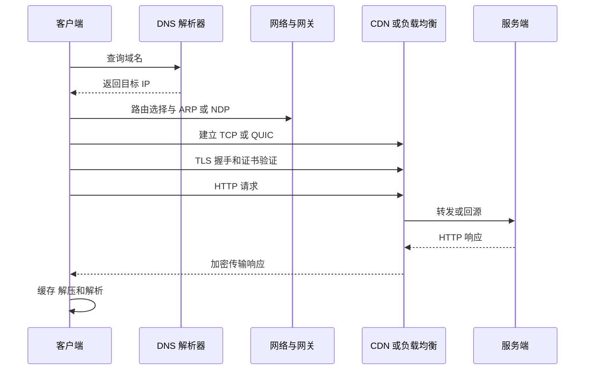

# 计算机网络：一次请求怎样到达服务器

网络把不同主机上的进程连接起来。学习主线不是从协议名词出发，而是追踪一个应用字节怎样跨层封装、转发、确认并还原。


## 课程地图

1. [分层、以太网、MAC 与 ARP](./01-layers-link/index.html)
2. [IP、子网、路由、ICMP 与 NAT](./02-ip-routing/index.html)
3. [UDP、TCP 与可靠传输](./03-transport-tcp/index.html)
4. [DNS、HTTP、缓存与连接演进](./04-dns-http/index.html)
5. [TLS、完整请求链路与网络排障](./05-tls-debugging/index.html)

## 一次 HTTPS 请求的阶段



每一步都可能产生独立延迟和故障。

## 分层的价值

- 应用不必关心每种网卡如何发信号。
- TCP 可以运行在多种 IP 链路之上。
- IP 可以承载 TCP、UDP、ICMP 等上层协议。
- 每层只承诺自己的职责，便于演进和替换。

分层是模型，不代表系统实现严格按教科书函数一层层复制数据；卸载、内核合并和硬件加速会优化实际路径。

## 面试中的关键连接

- DNS 使用 UDP 还是 TCP？
- TCP 可靠，为什么应用仍可能重复处理请求？
- 流量控制和拥塞控制分别保护谁？
- HTTP/2 多路复用为什么仍受 TCP 丢包影响？
- HTTPS 加密后代理和 CDN 怎样工作？
- ping 通为什么不代表端口可访问？
- connect 慢要怎样区分路由、丢包、队列和服务端问题？

---

## 零基础预备：网络在连接什么

计算机网络让不同主机上的进程交换字节。

最小模型：

```text
进程 A
  -> 操作系统 Socket
  -> 网卡与链路
  -> 交换机/路由器
  -> 对端网卡
  -> 对端操作系统 Socket
  -> 进程 B
```

### Host

**直译**：主机。

运行应用并拥有网络接口的计算机、虚拟机、容器节点或设备。

### Interface

**直译**：接口。

主机连接网络的逻辑/物理端点，例如以太网卡、Wi-Fi、回环、虚拟网卡。

### Link

**直译**：链路。

连接相邻节点的介质或逻辑通道。

### Switch

**直译**：交换机。

主要在二层按 MAC 转发同一局域网络中的帧。

### Router

**直译**：路由器。

主要在三层按 IP 前缀把包从一个网络转发到另一个网络。

### Protocol

**直译**：协议。

通信双方对格式、顺序、错误处理和状态变化的约定。

---

## 五层最小词汇

| 层 | 解决的问题 | 数据单位 | 关键标识 |
|---|---|---|---|
| 应用层 | 业务消息语义 | message | 域名、URL、方法 |
| 传输层 | 进程间通信 | segment/datagram | 端口、序列号 |
| 网络层 | 跨网络转发 | packet | IP、前缀、TTL |
| 链路层 | 相邻节点交付 | frame | MAC、VLAN |
| 物理层 | 传输信号 | bit | 电、光、无线 |

每层头部不是“多余浪费”，而是携带该层完成职责所需的信息。

---

## 五章依赖关系

```text
第 1 章：分层与链路
  -> 帧怎样到下一跳
  -> MAC、交换机、ARP、VLAN

第 2 章：IP 与路由
  -> 包怎样跨多个网络
  -> 子网、路由表、ICMP、NAT

第 3 章：UDP 与 TCP
  -> 数据怎样交给目标进程
  -> 端口、可靠性、流控、拥塞

第 4 章：DNS 与 HTTP
  -> 域名怎样定位服务
  -> 业务请求、缓存、HTTP 版本

第 5 章：TLS 与排障
  -> 怎样加密和认证
  -> 怎样定位整条请求链路
```

不要直接从“三次握手”开始死背。TCP 之下仍需要 IP 路由、下一跳 MAC 和链路传输。

---

## 一次 HTTPS 请求的参与者

客户端侧：

- 浏览器/应用。
- DNS stub。
- Socket。
- 本机路由表。
- 网卡。

网络中：

- 交换机。
- 默认网关。
- NAT/防火墙。
- 运营商路由器。
- CDN/负载均衡。

服务端：

- 网卡与内核网络栈。
- TLS 终止点。
- 反向代理。
- 应用进程。
- 缓存、数据库和下游。

### 完整主线

```text
解析 URL
  -> DNS 得到 A/AAAA
  -> 选择目标地址
  -> 查路由得到下一跳
  -> ARP/NDP 得到链路地址
  -> Ethernet/Wi-Fi 发帧
  -> 路由器逐跳转发 IP 包
  -> 建立 TCP 或 QUIC
  -> TLS 验证证书和协商密钥
  -> 发送 HTTP 请求
  -> CDN/网关/服务端处理
  -> 响应按反向路径返回
  -> 客户端解密、缓存和解析
```

---

## 地址为什么有好几种

### MAC

- 当前二层链路交付。
- 每跳会变化。

### IP

- 网络层端到端寻址。
- 路由器按前缀转发。
- NAT 可能改写。

### Port

- 传输层区分主机上的通信端点。

### Domain Name

- 应用可读名称。
- DNS 映射到地址或其他记录。

### URL

- 指定协议、主机、端口、路径和查询等资源位置。

一条远端请求中可同时出现：

```text
目标域名 = api.example.com
目标 IP = 203.0.113.20
目标 TCP 端口 = 443
当前帧目标 MAC = 本地网关 MAC
```

它们不互相替代。

---

## 初学者最常混淆

| 概念 A | 概念 B | 区别 |
|---|---|---|
| MAC | IP | 当前链路交付 vs 跨网络寻址 |
| 交换机 | 路由器 | 二层帧转发 vs 三层包转发 |
| 帧 | 包 | 链路层数据单位 vs 网络层数据单位 |
| MTU | MSS | IP 包上限直觉 vs TCP payload 上限 |
| IP | 端口 | 找主机 vs 找通信端点 |
| UDP | TCP | 数据报尽简服务 vs 可靠有序字节流 |
| TCP 连接 | HTTP 请求 | 传输状态 vs 应用消息 |
| 域名 | URL | 名称 vs 完整资源定位 |
| DNS TTL | HTTP Cache-Control | 名称记录缓存 vs 响应缓存 |
| SNI | Host | TLS 选证书 vs HTTP 虚拟主机 |
| 流量控制 | 拥塞控制 | 保护接收方 vs 保护网络 |
| ping | 端口探测 | ICMP 路径 vs 具体服务 |

---

## 每章怎样学习

### 先画参与者

例如 ARP：

```text
主机 -> 交换机 -> 同广播域节点
```

### 再标地址

每一跳写：

- 源/目标 MAC。
- 源/目标 IP。
- 源/目标端口。

### 再画时间顺序

例如 TCP：

```text
SYN -> SYN+ACK -> ACK
```

解释每步状态，而不是只背箭头。

### 再明确保证边界

- IP 不保证送达。
- UDP 不保证可靠。
- TCP 不保证业务完成。
- TLS 不保证服务无漏洞。
- HTTP 2xx 不保证下游所有副作用永久成功。

### 最后用工具验证

- `ip`：地址、链路、路由。
- `dig`：DNS。
- `ss`：Socket/TCP 状态。
- `curl`：HTTP/TLS 与阶段耗时。
- `tcpdump`：线上包和时序。

---

## 分层排障口诀

不从“网络有问题”这种模糊结论开始，逐层问：

```text
DNS：名称解析到哪里？
路由：内核选择哪条路径？
链路：下一跳能否解析和发送？
传输：握手、重传、窗口是否正常？
TLS：版本、证书、SNI 是否通过？
HTTP：状态码由哪一层返回？
应用：排队、处理和下游耗时多少？
```

每层都要有证据。

---

## 学完本门后的验收

你应能解释：

1. 为什么需要网络分层。
2. 封装与解封装每层添加什么。
3. 交换机怎样学习和泛洪。
4. 访问远端为何 ARP 网关而非服务器。
5. VLAN 与子网为何不是同一概念。
6. CIDR 怎样手算网络地址。
7. 最长前缀匹配为何选择更具体路由。
8. TTL、ICMP 与 traceroute 如何配合。
9. NAT/PAT 怎样维护连接映射。
10. IPv6 为什么不用 ARP 和广播。
11. Socket、端口与 TCP 四元组。
12. UDP 不可靠的准确含义。
13. TCP 字节流为什么必须应用 framing。
14. 三次握手和四次挥手每一步目的。
15. RTT、RTO、ACK、SACK 与重传。
16. rwnd 与 cwnd 分别保护谁。
17. DNS 递归、迭代和缓存。
18. HTTP 方法幂等和状态码。
19. HTTP 缓存与 Cookie/Session。
20. HTTP/1.1、2、3 的核心演进。
21. TLS 如何组合证书、签名、密钥交换和对称加密。
22. 怎样按 DNS/TCP/TLS/HTTP 拆解延迟。

---

## 导学自测

完成后不看资料画出：

```text
Browser
  -> DNS Resolver
  -> ARP/NDP + Gateway
  -> Routers + NAT
  -> TCP/QUIC
  -> TLS
  -> HTTP
  -> CDN/LB
  -> Server Process
```

并在每条箭头上写出：

- 关键地址。
- 协议。
- 可能等待。
- 失败时使用的工具。

---

[返回系统课总览](../index.html) | [第一课：分层与链路 →](./01-layers-link/index.html)
