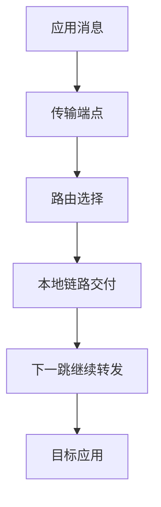

<!-- list-context-v1 -->

# 计算机网络导学

<!-- course-scaffold -->
## 主流程图



## 怎样阅读本节

本节围绕“计算机网络导学”展开。先理解它要解决的系统问题，再跟着数据、控制流和状态变化阅读实现细节；不要把下面的术语表当成需要先背诵的清单。

### 阅读前需要知道

这些内容描述的是同一机制的不同环节：程序会在处理器上执行，并通过操作系统请求内存、文件或网络服务。；一个机制的意义，要结合它要避免的失败、等待或资源冲突来理解。；文中的图展示参与者和顺序，正文解释每一步为什么发生。。
### 本节术语预览

首次出现时会给出英文全称、中文名称、所属层次和解决的问题；本节出现的主要缩写如下：

- **IP**：Internet Protocol，互联网协议
- **TCP**：Transmission Control Protocol，传输控制协议
- **HTTP**：Hypertext Transfer Protocol，超文本传输协议
- **MAC**：Media Access Control，介质访问控制
- **DNS**：Domain Name System，域名系统
- **UDP**：User Datagram Protocol，用户数据报协议
- **QUIC**：Quick UDP Internet Connections，基于 UDP 的快速网络连接协议
- **TLS**：Transport Layer Security，传输层安全协议
- **ARP**：Address Resolution Protocol，地址解析协议
- **ICMP**：Internet Control Message Protocol，互联网控制报文协议
- **NAT**：Network Address Translation，网络地址转换
- **HTTPS**：Hypertext Transfer Protocol Secure，超文本传输安全协议

### 建议的学习顺序

先读每个小节开头的“要解决的问题”，再读流程图和示例，最后用文末的误区、实验或面试表达检查自己能否复述因果链。


网络要解决的问题是：**应用产生的数据，怎样跨越多台机器和多段链路，正确交给目标应用？**

不同协议负责不同范围的工作。`IP（Internet Protocol，互联网协议）`负责跨网络寻址和转发，但它不保证数据一定到达；`TCP（Transmission Control Protocol，传输控制协议）`在此基础上为应用提供有序、可靠的字节流；`HTTP（Hypertext Transfer Protocol，超文本传输协议）`定义应用请求和响应的语义。


<!-- dependency-map-v1 -->
## 本节在课程中的位置

本节属于“计算机网络”主线。学习时先把它放进整条链路：前一阶段提供输入和前置状态，本节解释一个关键机制，后一阶段再使用这些状态处理更复杂的并发、性能或故障场景。

| 阅读关系 | 页面 | 目的 |
|----------|------|------|
| 课程入口 | [导学](../index.html) | 了解本门课的整体问题和术语边界 |
| 建议先读 | [计算机组成原理导学](../computer-organization/index.html) | 准备本节需要的概念和状态 |
| 当前章节 | **计算机网络导学** | 建立本节的机制模型 |
| 后续复习 | [操作系统导学](../operating-system/index.html) | 观察本节机制如何参与更大的系统流程 |

阅读完后，尝试把本节的关键状态接回课程首页的贯穿主线；如果无法说明输入从哪里来、结果交给谁，说明前置概念还需要回看。

## 先区分三种地址


这些内容描述的是同一机制的不同环节：`MAC（Media Access Control，介质访问控制） 地址（Media Access Control address，介质访问控制地址）`：链路上识别网卡接口。；`IP 地址`：在网络层识别主机或接口。；`端口（port）`：在一台主机内把数据交给具体进程。。
一次请求通常还会经过 `DNS（Domain Name System，域名系统）` 把域名解析成 IP 地址，再建立传输层连接，最后由应用层协议交换内容。

## 从 URL 到响应


```text
域名解析
  → 找到下一跳并逐段转发 IP 数据包
  → 建立 TCP 连接（或使用 UDP（User Datagram Protocol，用户数据报协议）/QUIC（Quick UDP Internet Connections，基于 UDP 的快速网络连接协议））
  → 如有需要完成 TLS（Transport Layer Security，传输层安全协议） 加密协商
  → 发送 HTTP 请求
  → 服务端处理并返回响应
```

每一步都可能产生延迟或失败。系统化排障的关键，是先判断问题发生在哪一层，而不是看到“网络慢”就直接调整 TCP 参数。

## 五章的学习路径


| 章节 | 要回答的问题 |
|------|--------------|
| 分层、以太网、MAC 与 ARP（Address Resolution Protocol，地址解析协议） | 同一局域网内，数据怎样找到下一台设备？ |
| IP、子网、路由、ICMP（Internet Control Message Protocol，互联网控制报文协议） 与 NAT（Network Address Translation，网络地址转换） | 数据怎样跨越多个网络到达目标主机？ |
| UDP、TCP 与可靠传输 | 丢包、乱序和速度不匹配怎样处理？ |
| DNS、HTTP、缓存与连接演进 | 域名怎样解析？应用请求怎样表达？ |
| TLS、完整请求链路与网络排障 | 数据怎样加密？如何定位一次请求的延迟？ |

`ARP（Address Resolution Protocol，地址解析协议）`、`NAT（Network Address Translation，网络地址转换）`、`TLS（Transport Layer Security，传输层安全协议）` 等术语在相应章节展开，不要求读者预先背诵。

## 学完后的能力


你应该能画出一次 HTTPS 请求的主要路径，说明每层保存什么状态，解释 TCP 为什么需要确认和重传，并根据 DNS、连接建立、加密协商和服务端处理分别测量延迟。

下一步：[分层、以太网、MAC 与 ARP](./01-layers-link/index.html)

<!-- chapter-closure-v1 -->
## 核心模型

先建立“输入、处理单元、输出和失败路径”的模型，再阅读具体实现。术语只有放进这条因果链，才不会变成孤立的背诵点。

## 常见误区

这些内容描述的是同一机制的不同环节：把名词定义当成机制解释，跳过状态和时间顺序。；把“通常如此”说成“任何平台都如此”，忽略实现和配置差异。；看到性能问题就直接调参数，没有先确认瓶颈位于哪一层。。
## 理解检查

1. 本篇首先解决什么问题？
2. 核心状态由谁保存，什么时候更新？
3. 设计的主要代价和边界条件是什么？

## 可观察实验

选一个最小可运行例子，记录输入、关键状态和输出，再把异常结果与文中的失败路径逐项对照。

<!-- term-cards-v1 -->
## 术语卡片

下表只收录本篇实际使用的主要缩写。阅读正文时先理解它在流程中的角色，复习时再用这张表回查全称和定义。

| 缩写 | 英文全称 | 中文名称 | 在本篇中的定义或作用 |
|------|----------|----------|----------------------|
| **IP** | Internet Protocol | 互联网协议 | 网络层，负责跨网络寻址和转发数据包 |
| **TCP** | Transmission Control Protocol | 传输控制协议 | 传输层，为应用提供有序可靠的字节流 |
| **HTTP** | Hypertext Transfer Protocol | 超文本传输协议 | 应用层，定义请求和响应的消息语义 |
| **MAC** | Media Access Control | 介质访问控制 | 链路层，标识网络接口 |
| **DNS** | Domain Name System | 域名系统 | 应用层，把域名解析为 IP 地址 |
| **UDP** | User Datagram Protocol | 用户数据报协议 | 传输层，提供无连接的数据报传输 |
| **QUIC** | Quick UDP Internet Connections | 基于 UDP 的快速网络连接协议 | 在 UDP 之上实现可靠、安全和多路复用传输 |
| **TLS** | Transport Layer Security | 传输层安全协议 | 安全协议，提供身份认证、机密性和完整性 |
| **ARP** | Address Resolution Protocol | 地址解析协议 | 链路与网络层之间，把 IP 地址解析为 MAC 地址 |
| **ICMP** | Internet Control Message Protocol | 互联网控制报文协议 | 网络层，用于差错报告和诊断 |
| **NAT** | Network Address Translation | 网络地址转换 | 网络设备，将地址或端口映射到另一组地址 |
