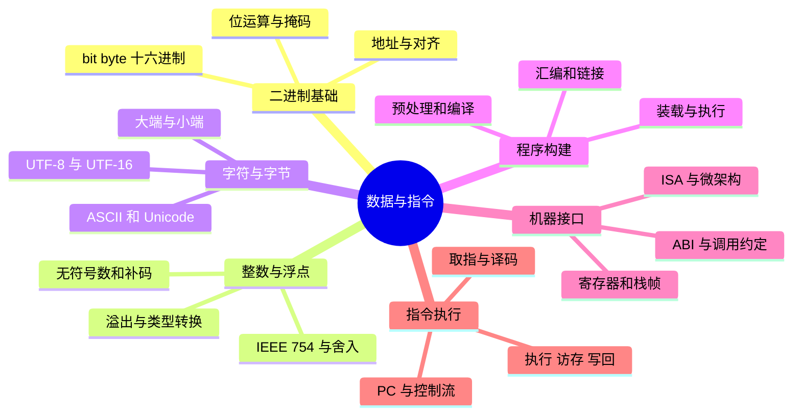

# 数据表示、指令与程序执行

## 本节知识地图



## 为什么计算机使用二进制

硬件需要稳定区分状态。用高/低电平表示 1/0，比精确区分十种电平更可靠。二进制也能用布尔代数构造加法器、比较器和控制逻辑。

### 位、字节与十六进制

- 1 bit 表示一个 0 或 1。
- 1 byte 通常是 8 bit。
- 十六进制一位对应 4 bit，适合紧凑表示地址和字节。

```text
二进制  1010 1100
十六进制  A    C
```

Python 可用于验证：

```python
bin(172)          # '0b10101100'
hex(172)          # '0xac'
int("ac", 16)     # 172
```

## 无符号整数与补码

n 位无符号整数范围是 `0` 到 `2^n - 1`。

有符号整数普遍使用补码。8 位示例：

```text
+5  = 0000 0101
-5  = 1111 1011   （按位取反再加 1）
```

补码让同一套加法器处理正数与负数，并只有一种零。

8 位补码范围是不对称的：

```text
-128 到 127
```

因为最高位组合的一半表示负数，零占用非负范围中的一个编码。

## 整数溢出

固定宽度整数运算只保留低 n 位：

```text
8 位有符号：
127 + 1
0111 1111
+0000 0001
=1000 0000  -> 按补码解释为 -128
```

Python 整数会自动扩展，不代表 Java、C/C++、数据库字段或协议字段也不会溢出。

面试追问应区分：

- 数学结果。
- 机器位宽下的结果。
- 语言对溢出的规定。

## 浮点数为什么有误差

浮点数近似科学计数法：

```text
符号 × 有效数字 × 2^指数
```

IEEE 754 把位分为符号、指数和尾数。许多十进制小数在二进制中无限循环：

```python
0.1 + 0.2 == 0.3    # False
```

因此：

- 浮点比较使用误差范围。
- 金额常转成整数最小单位。
- NaN 与任何值比较都不相等，包括自身。
- 正负无穷用于表示超出范围或算法初值。

## 字符、编码与字节

字符是抽象符号，编码规定字符如何变成字节。

```python
text = "中"
encoded = text.encode("utf-8")
len(text)             # 1 个字符
len(encoded)          # 3 个字节
encoded.decode("utf-8")
```

需要区分：

- 字符数量。
- 编码后的字节数量。
- 内存中语言运行时的内部表示。

网络和文件传输处理的是字节，边界处必须约定编码。

## 大端与小端

多字节整数在内存中有字节顺序。

数值 `0x12345678`：

```text
低地址 -> 高地址
大端：12 34 56 78
小端：78 56 34 12
```

大端把最高有效字节放低地址，小端相反。网络协议传统上使用网络字节序（大端）。

字节序只改变字节排列，不改变一个字节内部 bit 的书写含义。

## 从源码到可执行程序

以编译型语言为例：


解释型/JIT 语言的路径不同，但最终仍要让 CPU 执行机器指令。

## ISA 是软硬件接口

指令集架构（ISA）规定软件可见的机器模型，例如：

- 有哪些指令。
- 有哪些寄存器。
- 数据类型和寻址方式。
- 中断与特权级接口。

微架构是某款 CPU 怎样实现 ISA，例如流水线深度、Cache 大小、执行单元数量。

同一 ISA 可以有不同性能与功耗的实现。

## CPU 执行一条指令

简化的指令周期：


核心状态包括：

- PC：下一条指令地址。
- 通用寄存器：保存操作数和中间结果。
- 状态寄存器：保存条件码、特权级等。
- 指令寄存器：保存当前指令。

ALU 负责算术和逻辑操作，控制单元根据指令协调数据流。

## 函数调用在机器层发生什么

典型过程包括：

1. 参数放进约定的寄存器或栈。
2. 保存返回地址。
3. 跳转到函数入口。
4. 保存需要保护的寄存器。
5. 为局部变量调整栈指针。
6. 执行函数。
7. 恢复现场并跳回返回地址。

具体规则由调用约定和 ISA/ABI 决定。

## 动手观察

在实验之前，先用下面的系统化内容补齐从“一个 bit”到“函数真正执行”的完整链路。

---

## 深入一：信息为什么都能变成 0 和 1

### 1. bit 是什么

**bit = binary digit，二进制位。**

一个 bit 只有两个逻辑状态：

```text
0
1
```

它们可以由物理系统中的两种稳定状态表示，例如：

- 高电平与低电平。
- 电容有电与无电。
- 磁性方向不同。
- 光脉冲有与无。

计算机使用二进制，不是因为自然界只有两种状态，而是因为：

- 两种状态容易区分。
- 对噪声有更大容忍空间。
- 布尔代数可直接描述逻辑电路。
- 存储、传输和恢复都相对可靠。

### 2. byte、word 与地址

**byte = 字节。**

现代通用计算机中通常：

```text
1 byte = 8 bit
```

内存通常按字节编址：

- 每个字节有一个地址。
- 地址可理解为该字节在内存空间中的编号。
- 一个多字节对象会占据一段连续地址。

**word = 字、机器字。**

机器字通常指处理器最自然处理的数据宽度，例如 32 位或 64 位。它不是永远固定为 16 位，也不一定等于编程语言某个具体类型。

### 3. 为什么使用十六进制

一位十六进制正好表示四个二进制位：

| 二进制 | 十六进制 |
|---|---|
| `0000` | `0` |
| `0001` | `1` |
| `0010` | `2` |
| `1001` | `9` |
| `1010` | `A` |
| `1111` | `F` |

例如：

```text
二进制：1101 0110 0011 1010
十六进制： D    6    3    A
```

十六进制常用于：

- 内存地址。
- 机器指令字节。
- 位掩码。
- 网络协议字段。
- 颜色值。

它只是更紧凑的书写方式，不改变底层二进制内容。

### 4. 二进制转十进制

每一位代表一个 2 的幂：

```text
101101₂
= 1×2⁵ + 0×2⁴ + 1×2³ + 1×2² + 0×2¹ + 1×2⁰
= 32 + 8 + 4 + 1
= 45
```

从右向左，权值依次是：

```text
1, 2, 4, 8, 16, 32, 64, ...
```

### 5. 十进制整数转二进制

可以不断除以 2，记录余数：

```text
13 / 2 = 6 余 1
 6 / 2 = 3 余 0
 3 / 2 = 1 余 1
 1 / 2 = 0 余 1
```

从下往上读：

```text
13₁₀ = 1101₂
```

更直观的拆幂方法：

```text
13 = 8 + 4 + 1
   = 2³ + 2² + 2⁰
   = 1101₂
```

### 6. 位运算

#### AND 与

只有两位都为 1，结果才为 1：

```text
1010
1100
----
1000
```

用途：

- 用掩码取出某些位。
- 判断权限位。
- 判断奇偶。

#### OR 或

只要一位为 1，结果就是 1：

```text
1010
1100
----
1110
```

用途：

- 设置某些标志位。
- 合并权限或能力。

#### XOR 异或

两位不同为 1，相同为 0：

```text
1010
1100
----
0110
```

性质：

```text
x XOR x = 0
x XOR 0 = x
```

#### NOT 非

每一位翻转：

```text
NOT 1010 = 0101
```

结果必须结合固定位宽理解，否则“前面有多少个 1”没有边界。

### 7. 左移与右移

无溢出时，左移一位类似乘 2：

```text
0011 << 1 = 0110
3 × 2 = 6
```

无符号逻辑右移一位类似除 2：

```text
1100 >> 1 = 0110
12 / 2 = 6
```

有符号右移可能执行算术右移，用符号位填充高位。不同语言对负数右移和溢出有具体规则，不能只按数学直觉推断。

### 8. 位掩码示例

假设低四位表示权限：

```text
bit 0：读
bit 1：写
bit 2：执行
bit 3：管理
```

设置写权限：

```text
flags = flags OR 0010
```

清除写权限：

```text
flags = flags AND 1101
```

判断执行权限：

```text
(flags AND 0100) != 0
```

这就是操作系统权限位、CPU 状态位和协议标志位常用位运算的原因。

---

## 深入二：整数、补码与溢出

### 1. n 位无符号整数

n 位共有：

```text
2^n
```

种编码，因此范围是：

```text
0 到 2^n - 1
```

常见范围：

| 位数 | 最小值 | 最大值 |
|---|---:|---:|
| 8 位 | 0 | 255 |
| 16 位 | 0 | 65,535 |
| 32 位 | 0 | 4,294,967,295 |

### 2. 为什么需要表示负数

仅有无符号整数无法直接表达温度、余额变化和相对偏移等负值。可以约定最高位表示符号，但简单原码存在两个问题：

- `+0` 和 `-0` 有两种零。
- 加法器还要单独判断符号并做加减转换。

补码解决了这些问题。

### 3. 补码怎样解释

n 位补码的最高位权值为负：

```text
-2^(n-1)
```

其余位权值保持为正。

8 位 `1111 1011`：

```text
-128 + 64 + 32 + 16 + 8 + 0 + 2 + 1
= -5
```

这是一种比“取反加一”更本质的解释。

### 4. 怎样求负数补码

求 `-5` 的 8 位补码：

```text
+5       0000 0101
按位取反 1111 1010
加 1     1111 1011
```

反向恢复：

```text
1111 1011
减 1     1111 1010
按位取反 0000 0101
所以是 -5
```

### 5. 补码范围为什么不对称

n 位补码范围：

```text
-2^(n-1) 到 2^(n-1)-1
```

8 位：

```text
-128 到 127
```

编码一共 256 个：

- 128 个负数。
- 127 个正数。
- 1 个零。

最小负数取相反数可能溢出，因为正数范围中没有对应的 `+128`。

### 6. 为什么补码可共用加法器

在固定 n 位下，计算结果按模 `2^n` 保留：

```text
5 + (-5)
0000 0101
1111 1011
---------
1 0000 0000
```

只保留低 8 位得到 0。最高进位被丢弃，硬件不需要为普通加法另造一套负数规则。

### 7. 无符号溢出

8 位无符号：

```text
255 + 1 = 0
```

因为结果按模 256 回绕：

```text
1111 1111
+0000 0001
=1 0000 0000
```

只保留低 8 位。

### 8. 有符号溢出

两个正数相加得到负数，或两个负数相加得到非负数，说明补码有符号结果溢出。

```text
127 + 1
0111 1111
0000 0001
---------
1000 0000  -> -128
```

不能只看最高位进位判断有符号溢出。

### 9. Carry 与 Overflow

- **Carry Flag** 主要帮助判断无符号运算是否产生进位/借位。
- **Overflow Flag** 主要帮助判断有符号结果是否超出可表示范围。

同一组比特可以按有符号或无符号解释，所以两种标志回答不同问题。

### 10. 不同语言的溢出语义

- Python 整数通常自动扩展精度。
- Java 固定宽度整数按补码回绕。
- C/C++ 无符号溢出按模运算。
- C/C++ 有符号溢出通常属于未定义行为。
- Rust 的调试与发布构建策略可能不同，也提供显式 checked/wrapping API。

面试回答要区分：

1. 数学整数结果。
2. 硬件位宽结果。
3. 编程语言规定。
4. 编译器允许的优化。

### 11. 类型转换陷阱

把较宽整数转为较窄整数时，高位可能丢失。

把无符号数与有符号数混合比较时，隐式转换可能让负数变成很大的无符号数。

协议解析必须先检查：

- 字段宽度。
- 是否有符号。
- 字节序。
- 加减乘法是否溢出。
- 长度计算是否越界。

整数溢出不仅是结果错误，也可能引发缓冲区大小计算错误和安全漏洞。

---

## 深入三：浮点数为什么只能近似

### 1. 浮点数的目标

固定数量的 bit 无法精确表示所有实数。浮点数在有限位宽下，优先覆盖非常大和非常小的数量级。

形式类似科学计数法：

```text
符号 × 有效数字 × 基数^指数
```

二进制浮点使用基数 2。

### 2. IEEE 754 基本字段

常见单精度 32 位：

```text
1 位符号 + 8 位指数 + 23 位 fraction
```

常见双精度 64 位：

```text
1 位符号 + 11 位指数 + 52 位 fraction
```

正规数通常按类似形式解释：

```text
(-1)^sign × 1.fraction × 2^(exponent-bias)
```

### 3. 为什么 0.1 不能精确表示

十进制 `0.1` 转成二进制小数会无限循环，类似十进制中 `1/3 = 0.333...`。

位数有限，只能舍入到附近可表示值。因此：

```python
0.1 + 0.2 == 0.3
```

可能为假。

不是 CPU “算错了”，而是输入本身已经是近似值，运算后又发生舍入。

### 4. 浮点数不是均匀分布

数值越大，相邻可表示数之间的间隔通常越大。

因此：

- 很大的浮点数加很小的数，结果可能不变。
- 整数超过某个范围后，不能保证每个相邻整数都精确表示。
- 相对误差常比固定绝对误差更适合判断。

### 5. 舍入

IEEE 754 定义多种舍入模式，常见默认是“舍入到最近，遇到中点取偶数”。

每次运算可能产生无法装入尾数字段的额外位，必须舍入。多步运算中：

- 改变计算顺序可能改变舍入结果。
- 并行归约可能与串行求和略有不同。
- 编译器优化和硬件融合指令可能改变最后几位。

### 6. 特殊值

#### 正零与负零

浮点有 `+0` 和 `-0`。它们比较时通常相等，但某些运算结果和符号信息可能不同。

#### Infinity

正无穷和负无穷可表示溢出或某些除零结果。

#### NaN

**NaN = Not a Number。**

用于表示无有效数值结果，例如某些非法浮点运算。

特点：

```text
NaN != NaN
```

判断 NaN 应使用专用接口，而不是与自身或某个常量直接判等。

#### Subnormal

非正规数用于逐渐逼近零，减少最小正规数附近突然断层，但精度更低，部分硬件处理也可能更慢。

### 7. 浮点比较

不应机械写固定 epsilon：

```text
abs(a - b) < epsilon
```

还要考虑数据量级。常见策略组合：

- 绝对误差。
- 相对误差。
- ULP 距离。
- 业务定义的容差。

### 8. 金额为什么不用普通二进制浮点

金融金额通常要求明确的十进制舍入规则。常见做法：

- 使用整数保存最小货币单位。
- 使用十进制定点/高精度 Decimal。
- 明确币种和小数位。
- 每个结算边界规定舍入方式。

“都用整数分”也不是全部答案，因为汇率、利率和不同币种小数位仍需要清晰的精度模型。

---

## 深入四：字符、Unicode 与编码

### 1. 字符不是字节

**字符 Character** 是抽象符号。

**字符集 Character Set** 定义有哪些字符。

**编码 Encoding** 定义字符如何转换为字节序列。

文件和网络传输的是字节，显示给人的才是字符。

### 2. ASCII

ASCII 用较少位表示英文字母、数字、标点和控制字符。

例如：

```text
'A' -> 十进制 65 -> 十六进制 0x41
```

ASCII 无法覆盖世界上所有文字。

### 3. Unicode

Unicode 为字符分配抽象码点：

```text
U+0041
U+4E2D
```

码点不是最终文件字节。UTF-8、UTF-16、UTF-32 是把码点编码为字节/代码单元的不同方式。

### 4. UTF-8

UTF-8 是变长编码：

- ASCII 范围通常占 1 字节。
- 其他字符可能占 2、3 或 4 字节。
- 与 ASCII 向后兼容。
- 字节序列有可识别边界规则。

```python
len("A")                 # 1 个 Python 字符
len("A".encode("utf-8")) # 1 个字节
len("中")                # 1 个 Python 字符
len("中".encode("utf-8"))# 3 个字节
```

### 5. UTF-16 与代理对

UTF-16 以 16 位代码单元为基础：

- 基本多文种平面中的许多字符使用一个代码单元。
- 其他字符可能使用代理对，即两个代码单元。

所以在一些语言中：

- 字符串长度可能统计代码单元。
- 一个用户看到的字符可能占两个代码单元。

### 6. 码点也不一定等于用户看到的字符

一个“字形簇”可能由多个码点组成，例如：

- 基础字母加组合附加符号。
- Emoji 加肤色修饰符。
- 多个 Emoji 通过连接符组合。

因此必须区分：

- 字节数。
- 代码单元数。
- Unicode 码点数。
- 用户感知字符数。

### 7. 乱码怎样产生

典型链路：

```text
发送方按 UTF-8 编码
  -> 得到字节
  -> 接收方错误地按另一编码解码
  -> 显示乱码或报错
```

编码问题本质是“同一组字节按不同规则解释”。

系统边界应明确：

- 文件编码。
- HTTP Content-Type charset。
- 数据库连接和字段编码。
- 日志采集编码。
- 解码失败策略。

---

## 深入五：字节序与内存解释

### 1. Endianness

**直译**：字节序、端序。

一个字节内部的 bit 顺序通常不是这里讨论的问题。端序描述多字节值在连续地址中的字节排列。

数值 `0x12345678`：

```text
地址：  1000 1001 1002 1003
大端：    12   34   56   78
小端：    78   56   34   12
```

### 2. Big Endian

最高有效字节放在最低地址。

人从左到右书写十六进制数时，顺序与内存转储更接近。

### 3. Little Endian

最低有效字节放在最低地址。

x86 等常见平台采用小端。不能由此推导所有处理器永远小端。

### 4. 网络字节序

传统网络协议规定多字节整数使用大端，即 network byte order。

程序使用：

- host-to-network 转换。
- network-to-host 转换。

不能把本机整数的内存字节直接当成跨平台协议格式。

### 5. 端序何时可见

如果只做高级语言整数加法，通常不需要关心端序。

端序在以下场景变得重要：

- 读取二进制文件。
- 解析网络协议。
- 序列化。
- 访问硬件寄存器。
- 查看内存转储。
- 跨架构共享数据。

### 6. 对齐 Alignment

多字节对象常要求或偏好放在特定地址边界：

- 4 字节整数可能按 4 字节边界对齐。
- 8 字节对象可能按 8 字节边界对齐。

原因可能包括：

- 硬件一次访问更高效。
- 某些架构不允许未对齐访问。
- 原子操作对地址有对齐要求。

### 7. 结构体填充

编译器可能在字段之间插入 padding：

```c
struct Example {
    char a;
    int b;
};
```

逻辑字段大小之和可能小于结构体实际大小。

影响：

- 内存占用。
- Cache 布局。
- 二进制协议兼容。
- FFI。

不要直接把原生结构体内存当稳定网络协议发送，除非明确规定字节序、对齐和字段宽度。

---

## 深入六：源码如何成为可执行程序

### 1. 预处理

以 C/C++ 为例，预处理器处理：

- 头文件包含。
- 宏展开。
- 条件编译。

输出仍接近源代码文本。

### 2. 编译

编译器：

- 解析语法。
- 检查类型。
- 构建中间表示。
- 执行优化。
- 生成目标架构汇编或机器码。

一行源码可能：

- 对应多条机器指令。
- 被合并到其他代码。
- 被内联。
- 被完全优化掉。

### 3. 汇编

汇编器把汇编文本转换成目标文件中的机器码和重定位信息。

目标文件通常还不是可直接运行的完整程序，因为：

- 外部符号地址尚未确定。
- 多个目标文件尚未合并。
- 库函数尚未解析。

### 4. 链接

链接器主要处理：

- 合并代码与数据段。
- 解析符号引用。
- 执行重定位。
- 连接静态库或记录动态依赖。
- 确定程序入口和文件布局。

### 5. 静态链接与动态链接

**静态链接：**

- 所需库代码更多地进入最终文件。
- 部署依赖较少。
- 文件通常更大。
- 多进程间库代码更新和共享方式不同。

**动态链接：**

- 可执行文件记录共享库依赖。
- 装载时由动态链接器映射和解析。
- 多进程可共享只读库代码页。
- 需要处理库版本和部署兼容性。

### 6. 装载

操作系统执行程序时：

1. 识别可执行文件格式。
2. 创建或替换进程地址空间。
3. 建立代码、数据、栈等虚拟内存映射。
4. 映射动态链接器和共享库。
5. 准备参数、环境变量和辅助信息。
6. 设置初始寄存器与栈。
7. 把程序计数器指向入口。

装载不等于立刻把整个可执行文件读入物理内存。按需分页允许访问某页时再调入。

### 7. 解释执行与 JIT

解释型语言并没有绕过机器指令：

```text
源代码/字节码
  -> 解释器程序读取
  -> 解释器执行自身机器指令
  -> 完成源程序语义
```

JIT：

- 运行时识别热点。
- 把热点字节码编译为本机机器码。
- 后续直接执行优化后的机器码。

### 8. 编译错误、链接错误、运行错误

| 阶段 | 典型问题 |
|---|---|
| 编译 | 语法错误、类型错误 |
| 链接 | 未定义符号、重复符号 |
| 装载 | 缺共享库、格式或架构不兼容 |
| 运行 | 非法内存访问、除零、逻辑错误 |

能准确说出错误在哪一阶段，比笼统说“程序编译失败”更专业。

---

## 深入七：ISA、ABI 与微架构

### 1. ISA

**ISA = Instruction Set Architecture，指令集架构。**

它是软件可见的机器合同，通常规定：

- 指令编码和语义。
- 通用与特殊寄存器。
- 数据类型。
- 寻址方式。
- 内存访问规则。
- 异常、中断与特权级接口。
- 原子操作和内存模型的部分要求。

常见 ISA 家族包括 x86-64、Arm、RISC-V。

### 2. 微架构

微架构说明某款处理器怎样实现 ISA：

- 流水线多深。
- 每周期能译码多少指令。
- 有多少执行单元。
- Cache 多大、几路组相联。
- 分支预测器怎样设计。
- 重排序缓冲区多大。

不同 CPU 可以实现同一 ISA，却有不同性能、功耗和价格。

### 3. ISA 与高级语言

高级语言并不直接等于某个 ISA：

```text
C / Rust / Go
  -> 编译器后端
  -> x86-64 或 Arm 等机器码
```

Java/Python 等也最终通过虚拟机、解释器或 JIT 在具体 ISA 上执行。

### 4. ABI

**ABI = Application Binary Interface，应用二进制接口。**

ABI 规定二进制组件怎样协作，例如：

- 参数放哪些寄存器。
- 返回值放哪里。
- 哪些寄存器由调用方保存。
- 栈如何对齐。
- 数据类型大小和结构体布局。
- 系统调用约定。
- 目标文件格式和符号规则。

ISA 解决“处理器提供什么指令”，ABI 解决“编译后的程序之间怎样配合”。

### 5. API 与 ABI

- API 是源码级调用约定。
- ABI 是二进制级兼容约定。

API 不变但 ABI 改变时：

- 源码可能仍能重新编译。
- 旧二进制可能不能直接运行。

---

## 深入八：CPU 如何执行一条指令

### 1. CPU 核心部件

- **PC**：程序计数器，指出下一条指令地址。
- **Register File**：寄存器组，保存高速操作数。
- **ALU**：执行整数算术和逻辑。
- **FPU/Vector Unit**：执行浮点和向量操作。
- **Control Unit**：解释指令并协调数据通路。
- **Cache**：缓存近期指令和数据。

### 2. Fetch 取指

CPU 使用 PC 指定的地址取得指令字节。

指令可能来自：

- L1 指令 Cache。
- 更低级 Cache。
- 主存。

取指也可能受分支预测影响，CPU 会猜测下一条 PC。

### 3. Decode 译码

译码器识别：

- 操作类型。
- 源寄存器。
- 目标寄存器。
- 立即数。
- 寻址方式。

复杂 ISA 指令可能被拆成更小的内部操作。

### 4. Read Operands

操作数可能来自：

- 寄存器。
- 指令内立即数。
- 内存地址计算结果。

寄存器比主存快得多，所以编译器会尽量让热点值留在寄存器。

### 5. Execute

执行单元完成：

- 加减乘除。
- 比较。
- 位运算。
- 地址计算。
- 分支条件判断。

### 6. Memory

加载/存储指令访问数据 Cache。若 Cache miss，可能等待更低层存储。

并非每条指令都访问数据内存。例如寄存器加法只需要寄存器和 ALU。

### 7. Write Back

结果写回目标寄存器，供后续指令使用。

现代乱序 CPU 内部会更复杂，但最终提交结果时必须保持 ISA 规定的软件可见行为。

### 8. 更新 PC

普通顺序指令：

```text
PC = 下一条连续指令地址
```

跳转、调用、返回和异常会用其他目标更新 PC。

---

## 深入九：函数调用、调用约定与栈帧

### 1. 为什么函数调用需要规则

调用方与被调用方必须约定：

- 参数放哪里。
- 返回值放哪里。
- 返回地址怎样保存。
- 哪些寄存器谁负责保护。
- 栈在调用前后应是什么状态。

这套规则属于调用约定，是 ABI 的一部分。

### 2. 一个典型调用过程

```text
调用方准备参数
  -> 保存必要的调用方寄存器
  -> call 保存返回地址并跳转
  -> 被调用方建立栈帧
  -> 保存必须保护的寄存器
  -> 为局部变量留空间
  -> 执行函数体
  -> 设置返回值
  -> 恢复寄存器与栈指针
  -> ret 跳回返回地址
```

优化编译器可能省略部分步骤。

### 3. 参数为何优先放寄存器

现代 ABI 常让前若干参数通过寄存器传递：

- 避免不必要的内存访问。
- 减少栈操作。
- 提高常见函数调用效率。

参数过多、对象过大或特殊类型时仍可能使用栈或传地址。

### 4. Caller-saved 与 Callee-saved

**Caller-saved：**

- 调用方若希望调用后保留其值，调用前自己保存。

**Callee-saved：**

- 被调用函数若要修改，必须先保存并在返回前恢复。

这让编译器能在不同函数之间协调寄存器使用。

### 5. 栈帧里可能有什么

- 返回地址。
- 保存的寄存器。
- 局部变量。
- 溢出到内存的临时值。
- 额外函数参数。
- 对齐填充。

具体内容取决于 ABI、优化级别和函数复杂度。

### 6. 递归为什么消耗栈

每层递归通常需要新的调用现场：

```text
f(3)
  -> f(2)
       -> f(1)
            -> f(0)
```

递归过深可能耗尽线程栈，产生 stack overflow。

尾调用在满足条件时可能被优化为跳转，避免增长栈，但不能假设所有语言和编译器都会执行尾调用优化。

### 7. 栈回溯如何工作

调试器和异常系统根据：

- 返回地址。
- 栈指针/帧指针。
- 编译器生成的展开信息。

重建函数调用链。高度优化、符号缺失或栈损坏会让回溯更困难。

### 8. 调用函数一定比内联慢吗

函数调用存在参数准备、跳转和返回等成本，但：

- 现代 CPU 能预测常见调用和返回。
- 编译器可内联热点小函数。
- 真实成本常小于函数内部工作。

过度内联也会增加代码体积，导致指令 Cache 压力。仍应以编译器和性能测量为准。

---

## 深入十：从一行代码串起整章

示例：

```c
int add(int a, int b) {
    return a + b;
}
```

从源码到执行：

1. 字符 `i`、`n`、`t` 等按源文件编码保存为字节。
2. 编译器按语言规则解析函数。
3. 中间表示表达整数加法。
4. 后端为目标 ISA 选择加法和返回相关指令。
5. 汇编器生成机器指令字节。
6. 链接器把符号和代码合并进可执行文件。
7. 操作系统装载程序并建立地址空间。
8. 调用方按 ABI 把参数放进寄存器。
9. CPU 根据 PC 取指和译码。
10. ALU 对固定宽度整数执行加法。
11. 结果按语言与位宽规则处理溢出。
12. 返回值放进 ABI 约定位置。
13. CPU 跳回返回地址。

同一行 `a + b` 背后同时涉及：

- 源码编码。
- 类型和位宽。
- 补码。
- 编译与链接。
- ISA 与 ABI。
- 寄存器。
- 指令周期。
- 函数调用。

---

## 补充面试题：直接背诵

### Q1：为什么计算机使用二进制

> 数字电路更容易稳定地区分两种电平，二进制对噪声容忍度更高，并且能直接使用布尔代数构建存储、算术和控制电路。它不是唯一可能表示方式，但在可靠性、成本和逻辑实现之间最实用。

### Q2：补码为什么只有一个零

> n 位补码本质上按模 2^n 运算，零只对应全 0 编码。负数编码可理解为 2^n 减去其绝对值，因此正负运算能复用同一套加法器，同时避免原码的正零和负零。

### Q3：如何判断有符号溢出

> 同号数相加结果变号时发生有符号溢出：两个正数得到负数，或两个负数得到非负数。无符号进位和有符号溢出是不同判断，分别对应 Carry 和 Overflow 等状态。

### Q4：浮点数为什么不能直接判等

> 有限二进制位无法精确表示许多十进制小数，输入和每次运算都可能舍入，所以数学上相等的表达式在机器中可能相差少量误差。比较时应根据业务量级使用绝对误差、相对误差或专用数值方法。

### Q5：Unicode 与 UTF-8 有什么区别

> Unicode 定义字符及其码点，UTF-8 定义怎样把码点编码为字节。一个字符、一个码点、一个代码单元和用户看到的一个字形并不总是一一对应，网络和文件边界必须明确编码。

### Q6：ISA 和微架构有什么区别

> ISA 是软件可见的机器合同，规定指令、寄存器和异常等；微架构是某款 CPU 实现这套合同的内部方式，例如流水线、Cache 和执行单元。同一 ISA 可以有性能和功耗完全不同的多个微架构实现。

### Q7：ABI 解决什么问题

> ABI 规定二进制组件怎样协作，包括参数与返回值位置、寄存器保存责任、栈对齐、数据布局、系统调用和目标文件规则。ISA 规定处理器能做什么，ABI 规定编译后的软件怎样彼此调用。

### Q8：一条指令有哪些阶段

> 教材可概括为取指、译码、读操作数、执行、访存、写回和更新 PC。现代 CPU 会流水化、乱序和并行处理多个阶段，但最终必须保持 ISA 规定的软件可见结果。

### Q9：为什么函数调用需要栈

> 栈保存嵌套调用所需的返回地址、保存寄存器、局部状态和溢出参数，使每一层调用都能在子函数返回后恢复现场。具体布局由 ABI 和编译器决定，优化后部分函数也可能不建立传统栈帧。

### Q10：大端和小端影响什么

> 端序决定多字节值在连续内存地址中的字节排列，不改变数值本身，也不讨论一个字节内部 bit 的书写顺序。读取二进制文件、解析网络协议、序列化和跨架构共享数据时必须明确端序。

---

## 补充理解检查

### 判断题

1. 十六进制是与二进制不同的底层存储方式。
2. 8 位无符号整数最大值是 255。
3. 8 位补码的正负范围完全对称。
4. Carry 与 Overflow 永远表示同一件事。
5. Python 整数不回绕，所以网络协议长度字段也不会溢出。
6. Unicode 码点就是 UTF-8 字节。
7. 一个用户看到的字符一定只有一个 Unicode 码点。
8. 大端和小端改变一个整数的数学值。
9. 编译成功说明链接一定成功。
10. ISA 相同的 CPU 性能必然相同。
11. 所有函数都必须把全部参数放到栈。
12. 现代 CPU 内部乱序执行可以随意改变程序最终语义。

答案：1 错，2 对，3 错，4 错，5 错，6 错，7 错，8 错，9 错，10 错，11 错，12 错。

### 计算题

1. 把 `0b11010110` 转成十六进制和无符号十进制。
2. 分别按无符号数和 8 位补码解释 `1111 1011`。
3. 计算 8 位补码 `100 + 60` 的位级结果，并判断是否溢出。
4. 写出掩码：设置 bit 3、清除 bit 2、测试 bit 0。
5. 数值 `0x01020304` 在大端和小端机器的四个连续地址中怎样排列。

### 讲解题

1. 不使用“计算机只认识 0 和 1”这句口号，解释为什么采用二进制。
2. 用模运算解释补码加法。
3. 解释为什么金额系统需要明确十进制舍入规则。
4. 区分字节、代码单元、码点和用户感知字符。
5. 画出源码到 CPU 执行的完整路径。
6. 用自己的话区分 ISA、ABI 和微架构。
7. 画出一次函数调用中 PC、寄存器和栈的变化。

在 Linux/macOS 有编译器时，可查看简单函数的汇编：

```bash
cc -O2 -S example.c -o example.s
```

对比 `-O0` 和 `-O2`，观察编译器是否消除变量、内联函数或改变循环。

实验目的不是背汇编，而是确认“一行源码可能对应多条指令，优化后甚至可能消失”。

## 常见误区

- 二进制只是表示方法，不等于数据一定是整数。
- Python 不溢出，不代表底层协议和其他语言没有位宽。
- 字符串长度不一定等于字节长度。
- ISA 与 CPU 具体实现不是同一层。
- 编译成功不等于程序已经装入内存运行。

## 面试表达

**30 秒回答：程序怎样被 CPU 执行？**

> 源码经过编译或运行时转换为目标 ISA 的机器指令，操作系统把程序和依赖映射到进程地址空间并设置入口。CPU 根据 PC 取指、译码、读取操作数、执行、访存和写回，再更新 PC。实际处理器会用流水线、乱序和缓存并行这些步骤，但对软件保持 ISA 规定的行为。

**追问链**

1. ISA 和微架构有什么区别？
2. 为什么补码只有一个零？
3. 浮点数为什么不能直接判等？
4. 大小端影响网络协议的什么部分？
5. 函数调用为什么需要栈？

## 理解检查

1. 写出 8 位无符号和补码整数范围。
2. 解释 UTF-8 字符数和字节数为什么可能不同。
3. 说明 PC、寄存器和内存分别保存什么。
4. 画出源码到执行的主要阶段。

---

[返回组成原理导学](../index.html) | [下一课：CPU、流水线与性能 →](../02-cpu-pipeline-performance/index.html)
