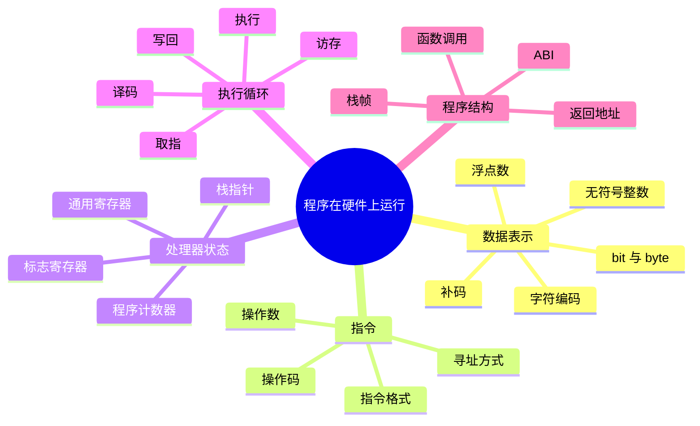
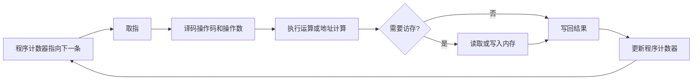

# 数据表示、指令与程序执行

处理器不会直接理解“整数”“字符串”或“变量”这些高级概念。它看到的是位模式，并根据当前指令把这些位解释为数值、地址、字符或下一条操作。理解数据表示和指令执行，是后续缓存、流水线、操作系统和网络序列化的共同前提。

## 本章知识地图



## 一、位、字节和地址

bit（binary digit，二进制位）只有 0 和 1 两种状态。byte（字节）通常由 8 个 bit 组成，可以表示 256 种不同模式。多个字节可以编码更大的整数、字符、指令或内存地址。

地址是定位存储单元或设备位置的编号。地址本身也是位模式，处理器按架构规定的宽度和对齐方式解释它。一个地址指向哪里，取决于当前地址空间和访问权限；同一个数字在不同进程中不一定指向同一个物理位置。

## 二、整数怎样表示

无符号整数把每一位当作二的幂相加。n 位可以表示 0 到 `2^n - 1`。溢出时高位被丢弃，结果相当于对 `2^n` 取模。

有符号整数常使用补码。n 位补码的最高位表示负数范围的一部分，取值范围通常是 `-2^(n-1)` 到 `2^(n-1)-1`。负数取反加一可以得到补码表示；硬件用同一套加法电路处理正负数，但最小负数的相反数可能超出可表示范围。

```text
8 位无符号：0 … 255
8 位补码：-128 … 127
127 + 1 在 8 位补码中变成 -128
```

有符号溢出和无符号回绕的语言规则可能不同。阅读代码时要先确定变量类型和提升规则，不能只看底层位模式推断业务结果。

## 三、浮点数表达近似值

浮点数通常由符号、指数和有效数三部分组成。它能覆盖很大的数量级，但许多十进制小数无法被二进制有限位精确表示。因此 `0.1 + 0.2` 可能不等于精确的 `0.3`。

浮点运算还会遇到舍入、溢出、下溢、非规格化数和 NaN（Not a Number，非数值）等特殊情况。金融金额、比较相等和累计求和不能默认使用二进制浮点；应根据误差和范围选择定点、整数最小单位或高精度类型。

## 四、字符和字节不是同一个概念

字符是抽象符号，编码把字符映射成一个或多个字节。ASCII 覆盖有限的英文字符；UTF-8（Unicode Transformation Format-8，Unicode 的变长编码）可以用 1 到 4 个字节表示 Unicode 字符。

字符串长度可能按字节、代码点或用户感知字符计算。网络协议和文件格式通常规定字节编码，应用层再解释字符。乱码往往不是“字符丢了”，而是读写双方使用了不同编码或错误的边界。

## 五、指令由操作码和操作数组成

指令告诉处理器做什么，以及从哪里取输入、把结果放在哪里。操作码表示加法、加载、跳转等操作；操作数可以来自寄存器、内存或指令中的立即数。指令格式和可用寄存器由指令集架构（Instruction Set Architecture，ISA）规定。

加载一条指令时，处理器需要知道指令长度和下一条位置。程序计数器（program counter，PC）保存下一条指令的地址；通用寄存器保存临时数据、地址和函数参数；状态寄存器记录比较、进位等结果。

寻址方式决定操作数如何定位：立即数直接写在指令中，寄存器寻址从寄存器取值，基址加偏移常用于数组和结构体，间接寻址则先读取一个地址再访问目标。寻址方式影响指令编码、执行阶段和可能的内存访问。

## 六、取指、译码和执行

处理器反复执行取指—译码—执行循环。取指从程序计数器指向的位置读取机器指令；译码识别操作码、寄存器和立即数；执行阶段进行算术、比较或地址计算；访存指令随后访问内存；最后把结果写回寄存器或内存。



这不是每条指令都严格串行完成的时间表，流水线会让不同指令同时处于不同阶段。但每条指令都必须产生规定的状态变化，异常和中断也要保存足够现场以便恢复或转入处理程序。

## 七、函数调用怎样保存现场

函数调用需要传递参数、保存返回地址、分配局部变量并在返回时恢复调用者状态。ABI（Application Binary Interface，应用二进制接口）规定哪些参数放寄存器、哪些参数放栈、哪些寄存器由调用者保存，以及返回值放在哪里。

栈指针指向当前栈顶，函数建立栈帧后可在其中保存返回地址、旧帧指针和局部变量。递归会为每次调用建立新的栈帧；递归过深可能耗尽栈空间。编译器优化可能省略帧指针或进行尾调用，因此调试信息和实际机器指令不一定一一对应源代码行。

## 八、内存访问和字节序

多字节整数在内存中的排列有大端和小端两种常见方式。网络协议通常规定网络字节序，主机内部可能使用另一种顺序，序列化和解析时必须显式转换。直接把结构体内存当作跨平台协议可能还会受到对齐、填充和指针大小影响。

未对齐访问在某些架构上会变慢或直接异常。编译器为结构体字段插入填充以满足对齐要求，所以 `sizeof(struct)` 可能大于各字段大小之和。设计二进制格式时应明确字段宽度、字节序、对齐和版本。

## 常见误区

位模式相同不代表语义相同：`0xFFFFFFFF` 可以是无符号 4294967295，也可以是补码 -1。字符串长度也不一定等于字节数。

程序计数器指向下一条指令不等于代码只按一条一条执行；流水线和乱序执行会改变内部并行方式，但仍需维护架构规定的可见结果。

函数调用不只是跳转指令，还涉及 ABI、栈帧、寄存器保存和返回值约定。把所有局部变量都想象成“必在栈上”也不准确，优化器可能把它们放入寄存器或消除。

## 面试表达

先说明硬件只处理位模式，数据类型由编码和解释规则赋予意义。整数常用补码，浮点数是近似表示，字符需要编码。指令由操作码和操作数组成，处理器通过取指、译码、执行、访存和写回改变寄存器、内存和程序计数器状态。函数调用再通过 ABI 和栈帧传递参数、保存现场和返回。

## 理解检查

1. 为什么 n 位无符号整数的加法会回绕？
2. 补码如何让正负数共用加法电路？
3. 为什么 UTF-8 字符数和字节数可能不同？
4. 程序计数器、通用寄存器和栈指针分别保存什么？
5. 为什么结构体不能直接当作跨平台二进制协议？

## 可观察实验

使用编译器把一个简单加法、数组访问和函数调用分别生成汇编，标出寄存器、栈帧和内存地址；再用不同字节序编码同一整数，观察十六进制输出。实验时同时查看优化级别，比较优化前后的指令差异。

## 术语卡片

| 缩写 | 英文全称 | 中文名称 | 本章作用 |
|------|----------|----------|----------|
| ISA | Instruction Set Architecture | 指令集架构 | 规定指令和可见状态 |
| ABI | Application Binary Interface | 应用二进制接口 | 规定调用和二进制协作约定 |
| PC | Program Counter | 程序计数器 | 指向下一条指令 |
| UTF-8 | Unicode Transformation Format-8 | Unicode 变长编码 | 编码 Unicode 字符 |
| NaN | Not a Number | 非数值 | 表示特殊浮点结果 |
