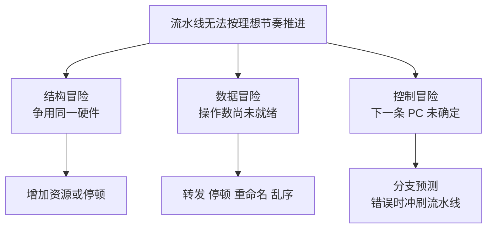

# CPU、流水线与性能

## 性能不只看主频

简化 CPU 时间公式：

```text
CPU 时间 = 指令数 × 平均 CPI × 时钟周期
         = 指令数 × 平均 CPI / 主频
```

- 指令数受算法、编译器和 ISA 影响。
- CPI 表示平均每条指令需要多少周期。
- 主频表示每秒时钟周期数。

主频更高，但指令更多、CPI 更高或内存等待更久，程序仍可能更慢。

## 延迟与吞吐

- **延迟**：完成一个任务需要多久。
- **吞吐**：单位时间完成多少任务。

流水线主要提高吞吐，不一定缩短单条指令从开始到结束的时间。

洗衣流水线类比：

```text
任务 A：洗 -> 烘 -> 叠
任务 B：     洗 -> 烘 -> 叠
任务 C：          洗 -> 烘 -> 叠
```

不同任务占用不同阶段，整体完成速率提高。

## 经典五级流水线


理想情况下，流水线填满后每周期完成一条指令，CPI 接近 1。

## 三类流水线冒险



### 结构冒险

多条指令同时争用同一硬件资源。解决方式包括增加资源、分时或停顿。

### 数据冒险

后一条指令依赖前一条尚未写回的结果：

```text
R1 = R2 + R3
R4 = R1 + R5
```

解决方式：

- Forwarding：结果直接转发给后续执行单元。
- Stall：插入气泡等待。
- 编译器调整指令顺序。
- 乱序执行在依赖允许时先执行其他指令。

### 控制冒险

分支结果未确定时，不知道下一条取哪条路径。

解决方式是分支预测。预测正确继续执行；预测错误需要清空错误路径上的指令并恢复正确 PC。

流水线越深，错误预测代价通常越高。

## 分支预测为什么有用

程序分支具有模式，例如循环多数轮“继续”，最后一轮“退出”。处理器根据历史预测方向和目标地址。

代码层面的影响：

- 不可预测的数据相关分支可能降低流水线效率。
- 但不要为了“无分支”写难懂代码，先测量热点。
- 排序后的数据有时让分支更可预测，但排序本身也有成本。

## 超标量与多执行单元

超标量处理器每周期可以发射多条互不依赖的指令。CPU 内可能有多个整数、浮点、加载/存储执行单元。

限制因素包括：

- 指令之间的数据依赖。
- 可用执行单元。
- 取指与译码宽度。
- Cache miss。
- 分支预测错误。

因此 IPC（每周期完成指令数）可能大于 1，也可能远低于 1。

## 乱序执行

CPU 可以在不破坏软件可见结果的前提下，让已准备好的后续指令先执行。

```text
A：等待内存数据
B：依赖 A，不能执行
C：与 A 无关，可以先执行
```

常见组件概念：

- 重命名寄存器减少假依赖。
- 保留站等待操作数。
- 重排序缓冲区按程序顺序提交结果。

乱序执行改变内部完成顺序，但单线程通常看到符合 ISA 的顺序语义。

## 多核与单核并行不同

- 流水线、超标量、乱序：一个核心内部的指令级并行。
- SIMD/向量指令：一条指令处理多个数据。
- 多核：多个核心执行多个线程。

线程数增加不一定线性加速，可能受串行部分、锁、内存带宽和调度影响。

## Amdahl 定律的直觉

若程序 20% 必须串行，即使并行部分无限快，总加速比最多：

```text
1 / 0.2 = 5
```

优化前先找真正瓶颈，而不是只增加线程。

## CPU 密集与内存密集

- CPU 密集：主要时间在计算，算术/执行单元接近饱和。
- 内存密集：CPU 经常等待数据，Cache miss 和内存带宽更关键。

同样的 CPU 使用率不能单独说明程序高效；需要结合 IPC、Cache miss、上下文切换和实际吞吐。

## 动手观察

下面先把性能指标和现代 CPU 内部机制完整展开，再做测量。

---

## 深入一：从“CPU 很快”到可量化模型

### 1. Clock

**直译**：时钟。

CPU 中大量电路按时钟节拍协调工作。主频表示每秒大约有多少时钟周期：

```text
3 GHz = 每秒 30 亿个时钟周期
```

但一个周期不等于一条指令：

- 一条复杂指令可能拆成多个内部操作。
- 一条指令可能跨越多个流水级。
- 处理器每周期也可能完成多条指令。
- Cache miss 可能让相关指令等待很多周期。

### 2. Clock Cycle

**直译**：时钟周期。

主频与周期时间互为倒数：

```text
时钟周期 = 1 / 主频
```

主频 2 GHz：

```text
1 / 2,000,000,000 秒
= 0.5 ns
```

这只表示一个时钟节拍长度，不表示程序每 0.5 ns 完成一个高级语言操作。

### 3. Instruction Count

**直译**：指令数。

执行同一任务需要多少机器指令，受以下因素影响：

- 算法复杂度。
- 数据结构。
- 源语言。
- 编译器和优化级别。
- 目标 ISA。
- 输入数据和分支路径。

更高主频的机器若执行指令更多，也可能更慢。

### 4. CPI

**CPI = Cycles Per Instruction，每条指令平均周期数。**

```text
CPI = 总周期数 / 完成指令数
```

CPI 是平均值：

- 某些指令快。
- 某些指令慢。
- Cache miss 和分支错误会显著拉高平均值。
- 多发射 CPU 的平均 CPI 甚至可以小于 1。

### 5. IPC

**IPC = Instructions Per Cycle，每周期完成指令数。**

```text
IPC = 完成指令数 / 总周期数
IPC ≈ 1 / CPI
```

这里的 IPC 与网络中的 Inter-Process Communication 同名，必须结合上下文区分。

### 6. CPU 时间公式

```text
CPU 时间
= 指令数 × CPI × 时钟周期
= 指令数 × CPI / 主频
```

示例：

机器 A：

```text
指令数 = 10 亿
CPI = 1.5
主频 = 3 GHz
CPU 时间 = 0.5 秒
```

机器 B：

```text
指令数 = 10 亿
CPI = 1.0
主频 = 2.5 GHz
CPU 时间 = 0.4 秒
```

B 主频更低，却因 CPI 更低而更快。

### 7. 公式的边界

公式是分析模型，不是说所有程序只有一个固定 CPI：

- CPI 会随输入改变。
- 主频可动态升降。
- 多核程序有并行和等待。
- I/O 等待不一定计入线程 CPU 时间。
- 操作系统调度会让线程暂时不运行。

使用公式时必须明确是在分析单线程 CPU 执行时间，还是整个请求墙钟时间。

---

## 深入二：延迟、吞吐与利用率

### 1. Latency

**直译**：延迟。

完成一个任务从开始到结束所需时间。

例子：

- 一次函数调用耗时。
- 一个请求响应时间。
- 一次内存访问耗时。

### 2. Throughput

**直译**：吞吐量。

单位时间完成多少工作。

例子：

- 每秒处理请求数。
- 每秒执行指令数。
- 每秒传输字节数。

### 3. 延迟低不等于吞吐高

单车道收费站每辆车处理很快，但一次只能处理一辆；多车道每辆车时间可能相同，总吞吐却更高。

CPU 流水线也是类似思想：

- 单条指令完整经过所有阶段仍需要多个周期。
- 流水线填满后可让不同指令占据不同阶段。
- 完成指令的频率提高。

### 4. 吞吐高不等于单请求快

批处理可提升吞吐：

- 固定开销被摊薄。
- 更容易向量化。
- I/O 请求合并。

但请求可能要等待批次凑齐，单个请求延迟反而上升。

### 5. Utilization

**直译**：利用率。

资源处于忙碌状态的比例。

CPU 利用率 100% 只表示核心有任务运行，不表示：

- 所有执行单元都被充分使用。
- 没有等待内存。
- IPC 很高。
- 业务吞吐达到最佳。

一个反复 Cache miss 的线程也能让 CPU 统计为忙。

### 6. 平均值与尾延迟

平均延迟可能掩盖少量慢请求。工程中常看：

- p50：一半请求不超过该值。
- p95：95% 请求不超过该值。
- p99：99% 请求不超过该值。

CPU 抢占、缺页、锁竞争和分支/缓存行为都可能增加尾延迟。

---

## 深入三：没有流水线会怎样

### 1. 单周期思路

假设每条指令必须在一个超长周期内完成：

```text
取指 -> 译码 -> 执行 -> 访存 -> 写回
```

时钟周期必须足够长，以容纳最慢指令的完整路径。

问题：

- 简单指令也被迫等待慢指令所需时间。
- 大部分硬件阶段在某些时刻闲置。
- 时钟频率难以提高。

### 2. 多周期思路

把指令拆成多个阶段，每个阶段占一个或多个周期：

- 不同指令只走需要的阶段。
- 可复用某些硬件。
- 单条指令仍按阶段顺序完成。

若仍一次只处理一条指令，硬件并行度没有充分利用。

### 3. 流水线思路

让不同指令同时位于不同阶段：

```text
周期 1：I1-IF
周期 2：I1-ID  I2-IF
周期 3：I1-EX  I2-ID  I3-IF
周期 4：I1-MEM I2-EX  I3-ID I4-IF
周期 5：I1-WB  I2-MEM I3-EX I4-ID I5-IF
```

流水线填满后，理想情况下每周期可完成一条指令。

### 4. 流水线寄存器

相邻阶段之间需要寄存器保存中间结果：

- 当前指令信息。
- 操作数。
- 控制信号。
- 地址和计算结果。

这些寄存器自身有面积、功耗和时序开销，所以流水线不能无限切细。

### 5. 最慢阶段限制主频

一个流水级必须在一个周期内完成。周期长度至少要覆盖：

- 最慢阶段组合逻辑延迟。
- 流水寄存器建立/保持等开销。
- 时钟偏差和设计裕量。

阶段不均衡会让较快阶段等待最慢阶段的周期预算。

### 6. 流水线加速上限

如果一条指令分成 k 个阶段：

- 理想吞吐可接近每周期一条。
- 单条指令延迟通常仍约为 k 个周期。
- 实际存在填充、排空、停顿和冲刷。

所以不能简单说“5 级流水线让所有程序快 5 倍”。

---

## 深入四：三类冒险逐步推演

### 1. Hazard

**直译**：冒险、冲突。

流水线按理想节奏推进时，某条指令缺少正确执行条件，就发生冒险。

### 2. 结构冒险

两条指令同时需要同一硬件资源。

例子：

- 取指和数据访问共用单端口存储器。
- 两条乘法指令争用一个乘法单元。
- 写回端口数量不足。

处理方式：

- 增加资源副本。
- 增加端口。
- 分时使用。
- 让其中一条指令停顿。

资源越多，面积和功耗越高，所以硬件要权衡。

### 3. RAW 数据冒险

**RAW = Read After Write，写后读。**

后一条指令要读取前一条尚未产生或写回的结果：

```text
I1: R1 = R2 + R3
I2: R4 = R1 + R5
```

这是真数据依赖，不能靠重命名消除。

#### Forwarding

前一条指令的结果已经在执行单元产生，但尚未写回寄存器文件时，可直接转发给下一条指令。

```text
I1 EX 结果 -> I2 EX 输入
```

#### Stall

若结果仍未产生，例如 load 的数据尚未从 Cache 返回，后续依赖指令必须等待，流水线插入 bubble。

### 4. WAR 数据冒险

**WAR = Write After Read，读后写。**

后一条指令写某个名字，不能早于前一条对该名字的读取。

```text
I1: R4 = R1 + R2   // 读 R1
I2: R1 = R3 + R5   // 写 R1
```

顺序流水线通常天然避免，但乱序执行中需要处理。

### 5. WAW 数据冒险

**WAW = Write After Write，写后写。**

两条指令写同一名字，最终必须让程序顺序更后的写生效。

```text
I1: R1 = ...
I2: R1 = ...
```

WAR 和 WAW 是名字依赖，可通过寄存器重命名消除。

### 6. 控制冒险

分支指令结果未确定时，不知道下一条 PC：

```text
if condition:
    path A
else:
    path B
```

若 CPU 等分支完全算完再取下一条，取指前端会频繁空闲。因此现代 CPU 预测：

- 分支是否跳转。
- 跳到哪个目标。

### 7. 冲刷 Flush

预测错误时：

1. 错误路径指令已进入流水线。
2. 这些指令不能提交为程序结果。
3. CPU 丢弃错误路径工作。
4. 恢复正确 PC。
5. 从正确路径重新取指。

流水线越深、每周期投机执行越多，误预测浪费通常越大。

---

## 深入五：分支预测

### 1. 静态预测

不依赖运行历史：

- 总预测不跳。
- 向后分支预测跳转。
- 编译器给出提示。

硬件简单，但适应性有限。

### 2. 动态预测

根据过去行为预测未来：

- 记录某分支最近是否跳转。
- 使用饱和计数器避免一次反常立即翻转判断。
- 结合局部或全局分支历史。
- 预测目标地址。

### 3. 循环为何容易预测

典型循环：

```text
前 N-1 次继续
最后一次退出
```

大部分迭代方向相同，预测器容易学习。循环退出时可能出现一次错误预测。

### 4. 间接分支

目标地址不是指令中固定常量，例如：

- 虚函数调用。
- 函数指针。
- 大型 switch 跳转表。
- 解释器分派。

CPU 还需要预测目标，而不只是“跳不跳”。

### 5. Return Address Stack

函数返回目标随调用位置变化。处理器可使用返回地址栈预测 `ret` 应跳回哪里。

调用与返回不匹配、深度过大或特殊控制流可能影响预测。

### 6. 数据排序与可预测性

数据分布有规律时，条件分支更容易预测。但为了预测而排序需要额外成本：

```text
总收益 = 后续分支节省 - 排序成本 - 额外内存成本
```

只在热点和真实输入上测量，不要把“无分支代码”当绝对优化规则。

---

## 深入六：超标量与乱序执行

### 1. Superscalar

**直译**：超标量。

处理器每周期可以取出、译码、发射或完成多条互不冲突的内部操作。

需要多个资源：

- 多个执行端口。
- 多个整数/浮点/加载存储单元。
- 更宽的取指与译码前端。
- 更大的调度窗口。

### 2. 指令级并行 ILP

**ILP = Instruction-Level Parallelism，指令级并行。**

```text
A = B + C
D = E + F
G = A + D
```

前两条互不依赖，可并行执行；第三条必须等待二者结果。

代码中的独立操作越多，CPU 越有机会利用多个执行单元。

### 3. 为什么需要乱序

严格顺序执行：

```text
I1 等内存
I2 依赖 I1
I3 与 I1 无关
```

若 I3 也跟着等待，执行单元会空闲。

乱序执行允许：

- I1 等待。
- I2 保持等待。
- I3 操作数就绪后先执行。

### 4. 寄存器重命名

架构寄存器名字数量有限，不同指令可能只是碰巧使用同一名字。

重命名把架构寄存器映射到更多物理寄存器：

- 消除 WAR。
- 消除 WAW。
- 保留真正 RAW 依赖。

### 5. 保留站/调度队列

内部操作等待：

- 源操作数是否就绪。
- 对应执行单元是否可用。

条件满足即可发射执行，不必严格等前面所有指令完成。

### 6. ROB

**ROB = Reorder Buffer，重排序缓冲区。**

它帮助处理器：

- 记录按程序顺序排列的未提交指令。
- 保存执行状态和结果。
- 按程序顺序提交。
- 发生异常或预测错误时回滚年轻指令。

### 7. 精确异常

即使内部乱序执行，CPU 通常要让软件看到好像指令按顺序执行到异常点：

- 异常之前的指令已生效。
- 异常指令及之后尚未提交。
- 操作系统能准确恢复或终止。

这就是重排序缓冲区的重要价值之一。

### 8. 乱序不等于多线程

乱序执行：

- 一个核心内部。
- 针对单个指令流。
- 利用指令级并行。

多线程：

- 多个软件执行流。
- 可在同核交替或多核并行。
- 需要同步共享状态。

---

## 深入七：SIMD、SMT 与多核

### 1. SIMD

**SIMD = Single Instruction, Multiple Data。**

一条向量指令对多个数据元素执行同类运算：

```text
[a0 a1 a2 a3] + [b0 b1 b2 b3]
```

适合：

- 图像和音视频。
- 科学计算。
- 矩阵运算。
- 批量解析和搜索。

限制：

- 数据布局必须适合。
- 分支分歧降低效率。
- 内存带宽可能成为瓶颈。

### 2. SMT

**SMT = Simultaneous Multithreading，同时多线程。**

一个物理核心暴露多个逻辑 CPU，让多个硬件线程共享核心资源。

目的：

- 某个线程等待时，另一个线程利用空闲执行资源。
- 提高核心吞吐。

它不等于增加一个完整物理核心：

- 执行单元、Cache 和带宽会共享。
- 加速取决于两个线程的资源互补程度。

### 3. 多核

多个物理核心可以真正同时执行多条线程。

多核带来新问题：

- 任务划分。
- 锁竞争。
- Cache 一致性。
- 线程调度和迁移。
- NUMA。
- 内存带宽共享。

### 4. 三种并行层次

| 层次 | 机制 | 面向对象 |
|---|---|---|
| 指令级 | 流水线、超标量、乱序 | 单线程中的多条指令 |
| 数据级 | SIMD/向量 | 多个数据元素 |
| 线程级 | SMT、多核 | 多条软件线程 |

回答“CPU 怎样并行”时应按这三层展开。

---

## 深入八：Amdahl 定律

### 1. 公式

若程序可并行比例为 `P`，使用 `N` 个并行单元：

```text
Speedup = 1 / ((1-P) + P/N)
```

其中：

- `1-P` 是串行部分。
- `P/N` 是并行部分被 N 份资源加速后的时间。

### 2. 示例

80% 可并行，20% 串行，使用 4 核：

```text
Speedup = 1 / (0.2 + 0.8/4)
        = 1 / 0.4
        = 2.5
```

不是 4 倍。

### 3. 无限核心上限

当 `N` 趋近无穷：

```text
P/N -> 0
Speedup -> 1/(1-P)
```

若串行部分 20%，理论最大加速就是 5 倍。

### 4. 串行部分包括什么

- 必须顺序执行的算法阶段。
- 锁保护临界区。
- 单线程协调。
- 任务拆分和合并。
- 串行 I/O。
- 负载不均衡导致的等待。

### 5. 并行开销

Amdahl 简化公式还没有直接体现：

- 创建和调度线程。
- 同步。
- Cache 一致性流量。
- 数据复制。
- 跨 NUMA 访问。

真实加速可能比公式上限更低。

---

## 深入九：CPU-bound 与 Memory-bound

### 1. CPU-bound

执行单元和计算吞吐是主要限制：

- 算术密集。
- 数据大多命中 Cache。
- 提高向量化、IPC 或核心数可能有帮助。

### 2. Memory-bound

内存访问是主要限制：

- Cache miss 多。
- 大量随机访问。
- 指针追逐。
- 内存带宽饱和。

CPU 利用率仍可能很高，但有效指令吞吐不理想。

### 3. Frontend-bound

取指和译码前端供应不足：

- 指令 Cache miss。
- 分支预测错误。
- 代码体积过大。
- 译码带宽限制。

### 4. Backend-bound

后端执行受限：

- 执行端口竞争。
- 数据依赖。
- Cache/内存等待。
- 存储缓冲区压力。

### 5. 为什么只看 CPU 百分比不够

同样 100% CPU：

- 程序 A 可能高 IPC 做大量有效计算。
- 程序 B 可能低 IPC，频繁等待内存。
- 程序 C 可能在自旋锁上空转。

必须结合实际吞吐、延迟和硬件计数器。

---

## 深入十：性能测量方法

### 1. Wall-clock Time

从用户角度看到的真实经过时间，包括：

- CPU 执行。
- 调度等待。
- I/O 等待。
- 锁等待。
- 缺页。

### 2. User Time 与 System Time

- User time：线程在用户态执行的 CPU 时间。
- System time：线程在内核态执行的 CPU 时间。
- 二者都不等于完整墙钟时间。

多线程程序的累计 CPU 时间还可能大于墙钟时间，因为多个核心同时消耗 CPU。

### 3. Benchmark 基本原则

- 使用真实或具有代表性的输入。
- 固定功能正确性。
- 预热运行时和 Cache。
- 多次运行。
- 报告分布而不只报最好值。
- 避免把数据生成、日志和启动时间误计入核心路径。
- 比较时只改变一个关键因素。

### 4. 编译优化

对 C/C++ 等编译型程序比较：

- `-O0` 便于调试但不代表生产性能。
- `-O2`/`-O3` 会做内联、向量化、循环优化等。
- 编译器可能删除没有可观察结果的测试代码。

基准必须确保结果被使用，避免优化器把核心计算整个消除。

### 5. 噪声来源

- 动态升频和降频。
- 其他进程竞争。
- CPU 迁移。
- NUMA。
- 温度和功耗限制。
- 首次缺页。
- JIT 与垃圾回收。
- 文件系统缓存。

### 6. 先做算法级优化

优化顺序通常是：

1. 确认需求和正确性。
2. 找瓶颈。
3. 改善算法复杂度。
4. 改善数据结构和局部性。
5. 减少不必要工作。
6. 最后再做底层微优化。

把 O(n²) 改为 O(n log n) 往往比调整一条分支更重要。

---

## 补充面试题：直接背诵

### Q1：为什么主频更高不一定更快

> CPU 时间由指令数、平均 CPI 和时钟周期共同决定。更高主频缩短周期，但算法、编译器、分支预测、Cache miss 和内存等待都会改变指令数与 CPI，功耗限制还可能导致降频。因此要在具体负载上比较延迟、吞吐和硬件计数器。

### Q2：CPI 和 IPC 是什么

> CPI 是平均每条指令消耗的周期数，IPC 是平均每周期完成的指令数，两者在同一统计口径下近似互为倒数。超标量 CPU 的 IPC 可以大于 1，Cache miss 或依赖严重时 IPC 也可能远小于 1。

### Q3：流水线提高延迟还是吞吐

> 流水线主要提高吞吐，让多条指令同时处于不同阶段；单条指令仍要经过多个阶段，延迟不一定下降，甚至会增加流水寄存器开销。停顿、分支冲刷和资源冲突使实际吞吐低于理想值。

### Q4：三类流水线冒险是什么

> 结构冒险是多条指令争用同一硬件；数据冒险是指令间存在数据依赖；控制冒险是分支结果未确定导致下一条 PC 不明确。硬件可用增加资源、转发、停顿、寄存器重命名、乱序和分支预测处理。

### Q5：分支预测失败会怎样

> CPU 丢弃错误路径上尚未提交的投机指令，恢复正确架构状态和 PC，再从正确路径取指。损失取决于流水线深度、前端宽度和错误路径已执行的工作量。

### Q6：乱序执行会破坏程序顺序吗

> CPU 内部可以让操作数就绪的后续指令先执行，但通常通过寄存器重命名、重排序缓冲区和按序提交维持 ISA 规定的单线程可见结果及精确异常。多线程可见顺序还受内存模型约束，不能仅凭源码顺序推断。

### Q7：超标量、SIMD 和多核有何区别

> 超标量利用一个线程中多条独立指令，SIMD 用一条指令处理多个数据元素，多核让多条软件线程在多个核心并行。它们分别利用指令级、数据级和线程级并行。

### Q8：CPU 100% 为什么还可能很慢

> 利用率只表示 CPU 有任务执行，不表示高效。程序可能低 IPC 等内存、分支错误很多、在自旋锁空转或受执行端口限制。应结合业务吞吐、延迟、IPC、Cache miss、分支错误和锁等待判断。

### Q9：Amdahl 定律说明什么

> 总加速受串行部分限制。即使并行部分无限快，串行比例 S 仍让最大加速不超过 1/S。线程创建、同步、通信和负载不均衡还会让真实加速更低。

### Q10：怎样做可信性能测试

> 使用代表性输入，先验证结果正确，区分墙钟与 CPU 时间，预热运行时，多次执行并报告分布，控制其他负载和编译选项，同时结合性能计数器解释差异。不能只取最好一次，也不能只看单一 CPU 百分比。

---

## 补充理解检查

### 判断题

1. 3 GHz 表示 CPU 每秒必然完成 30 亿条机器指令。
2. 多发射 CPU 的平均 CPI 可能小于 1。
3. 流水线必然缩短单条指令延迟。
4. RAW 是真数据依赖。
5. WAR 与 WAW 可以通过寄存器重命名消除。
6. 分支预测错误会改变程序最终正确结果。
7. 乱序执行就是操作系统切换线程。
8. SMT 逻辑 CPU 等价于同数量完整物理核心。
9. CPU 利用率 100% 足以证明程序已经最优。
10. 四核程序一定能获得四倍加速。

答案：1 错，2 对，3 错，4 对，5 对，6 错，7 错，8 错，9 错，10 错。

### 计算题

1. 某程序执行 20 亿条指令，CPI 为 1.5，主频 3 GHz，CPU 时间是多少。
2. 某 CPU 完成 40 亿条指令消耗 20 亿周期，IPC 和 CPI 分别是多少。
3. 程序 90% 可并行，使用 8 核时按 Amdahl 公式理论加速多少。
4. 程序串行比例 10%，无限核心下最大加速是多少。
5. 比较主频 4 GHz、CPI 2 与主频 3 GHz、CPI 1.2 的两个实现。

### 讲解题

1. 用洗衣流水线类比解释延迟与吞吐，并指出类比边界。
2. 为一组 load 后立即使用的数据依赖画出停顿。
3. 解释为什么分支预测对深流水线尤其重要。
4. 用 RAW、WAR、WAW 解释哪些依赖是真依赖。
5. 画出寄存器重命名、乱序执行与按序提交的关系。
6. 分别给出指令级、数据级和线程级并行例子。
7. 设计一个能够避免编译器消除核心计算的基准实验。

Linux 上可用：

```bash
perf stat ./your_program
```

关注：

- cycles
- instructions
- instructions per cycle
- branches / branch-misses
- cache-references / cache-misses

比较两个实现时使用相同输入，多次运行，并同时看耗时与计数器。

## 常见误区

- GHz 更高不代表所有程序更快。
- 流水线提高吞吐，不等于每条指令延迟下降。
- CPU 使用率 100% 不代表执行单元没有等待内存。
- 多线程不等于多核并行，也不保证线性加速。
- 分支预测失败不是普通 if 的逻辑错误，而是内部性能损失。

## 面试表达

**为什么主频高不一定快？**

> 程序时间取决于指令数、平均 CPI 和主频。架构、编译器、缓存命中、分支预测和内存等待都会改变前两项。更高主频还可能受功耗和降频影响，因此应比较具体负载的延迟、吞吐和硬件计数器。

**追问链**

1. 流水线为什么会停顿？
2. 分支预测失败发生什么？
3. 乱序执行会不会破坏程序顺序？
4. IPC 为什么可能小于 1 或大于 1？
5. 多核加速为什么有上限？

## 理解检查

1. 使用 CPU 时间公式解释两台机器性能差异。
2. 为 RAW 数据依赖画出流水线等待。
3. 区分延迟、吞吐、CPI 和 IPC。
4. 解释 CPU 密集和内存密集的观测差异。

---

[上一课：数据与指令](../01-data-and-instructions/index.html) | [下一课：存储层次与 Cache →](../03-memory-cache/index.html)
