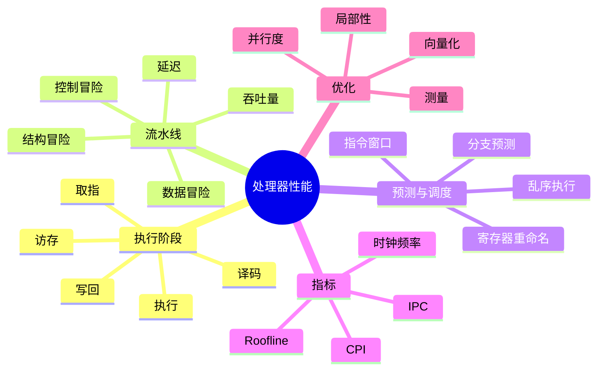

# CPU、流水线与性能

处理器的执行能力不是一个单独的“频率”数字。每条指令要经过取指、译码、执行、访存和写回等阶段；程序还会遇到分支、数据依赖、缓存未命中和资源竞争。流水线和乱序执行提高的是整体吞吐，但必须维持程序规定的可见结果。

## 本章知识地图



## 一、流水线把不同指令重叠起来

如果一条指令完成取指、译码和执行后才开始下一条，很多硬件阶段会空闲。流水线让指令 A 在执行时，指令 B 可以译码，指令 C 可以取指。理想情况下，流水线填满后每个时钟周期都能完成一条或多条指令。

流水线提高吞吐量，不会把单条指令的所有阶段压缩成一个周期。第一条指令仍需经过完整路径才产生结果；分支错误、数据依赖和等待内存会让阶段停顿。

## 二、三类流水线冒险

数据冒险来自指令之间的依赖。后一条指令需要前一条尚未写回的结果时，处理器可以等待、从内部路径转发结果，或重新安排无依赖指令。控制冒险来自分支，处理器在不知道分支结果时无法确定下一条路径。结构冒险则是多个阶段同时争用同一硬件资源。

```text
add r1, r2, r3
sub r4, r1, r5   # 读取上一条刚产生的 r1
```

转发能减少等待，但不能消除所有依赖；例如加载指令之后立即使用数据，数据可能仍未从缓存返回。优化代码时应减少真正的依赖链，而不是只盯着指令数量。

## 三、分支预测减少控制等待

处理器根据历史行为预测条件分支的方向和目标地址，并提前取指、译码甚至执行预测路径。预测正确时流水线保持工作；预测错误时，错误路径上的工作被丢弃，处理器从正确目标重新填充。

规律明显的循环分支通常容易预测，输入随机的条件分支更难。分支预测不是程序语义保证，程序不能依赖预测结果；它只是性能优化。测量时应使用真实输入分布，因为不同数据会改变预测命中率。

## 四、乱序执行仍需保持架构顺序

现代 CPU 可以把互不依赖的指令提前执行，让执行单元不因某条慢指令而全部空闲。寄存器重命名消除部分假依赖，指令窗口保存等待中的操作，提交阶段再按程序顺序让结果对架构状态可见。

乱序执行不等于任意重排。异常、分支和内存访问必须满足指令集架构规定的可见行为；多线程之间的内存顺序还受到处理器内存模型和同步指令约束。

## 五、性能指标怎样解释

CPI（Cycles Per Instruction，每条指令周期数）表示平均执行一条指令需要多少时钟周期；IPC（Instructions Per Cycle，每周期指令数）是相反方向的吞吐指标。两者都必须说明统计范围和工作负载，不能脱离程序直接比较。

粗略执行时间可以写成：

```text
执行时间 ≈ 指令数 × CPI ÷ 时钟频率
```

提高频率、减少指令数或降低 CPI 都可能加速程序，但一个改变可能让另一个指标变差。缓存未命中带来的等待往往远大于简单算术，因而“更高频率”不一定解决内存瓶颈。

## 六、向量化和并行度

如果同一操作独立作用于多个数据元素，SIMD（Single Instruction, Multiple Data，单指令多数据）指令可以一次处理一组值。向量化受数据对齐、分支、依赖和剩余元素影响；编译器是否自动向量化，需要查看生成代码或性能计数器，而不能只看源代码循环。

多核心并行进一步复制执行资源，但共享缓存、内存带宽和同步成本会限制扩展。线程数增加到一定程度后，程序可能从计算受限变成内存或锁受限。

## 七、从瓶颈而不是直觉开始优化

先建立可重复基线，记录输入、编译选项、CPU 型号和缓存状态，再用采样和硬件计数器定位热点。若时间主要消耗在缓存未命中，应优化数据布局和访问顺序；若主要消耗在分支和依赖，应考虑算法或数据组织；若核心都在等待锁，则应减少共享或缩短临界区。

`perf stat` 可以观察周期、指令、分支和缓存事件，`perf record` 可采样调用栈。计数器存在平台差异，事件名称和含义要以当前处理器文档为准。

## 常见误区

流水线提高吞吐不等于每条指令一个周期完成。IPC 大于 1 也不表示程序一定快，还要看内存、分支和整体工作量。

乱序执行不代表程序员可以忽略同步。处理器会维护架构约束，跨线程可见性仍需使用正确的原子和同步原语。

CPU 利用率高不代表所有时间都在做有用计算；自旋、错误预测和缓存等待也可能消耗周期。优化前应先测量热点。

## 面试表达

先说明一条指令要经过多个阶段，流水线通过重叠阶段提高吞吐。数据、控制和结构冒险会造成停顿，转发、分支预测和乱序执行减少等待，但必须保持架构可见结果。性能可用“指令数 × CPI ÷ 频率”理解，再结合缓存、分支、内存带宽和并行度定位瓶颈。

## 理解检查

1. 流水线为什么提高吞吐却不必然降低单条指令延迟？
2. 数据冒险和控制冒险分别如何产生？
3. 分支预测错误时为什么需要清空部分流水线？
4. CPI 和 IPC 为什么不能脱离工作负载比较？
5. 多核心数量增加后，为什么程序可能不再加速？

## 可观察实验

编写顺序数组遍历、随机访问和带规律/随机分支的三个程序，用 `perf stat` 比较 cycles、instructions、branches、branch-misses 和 cache-misses。保持编译选项和输入规模固定，把每个指标变化连接回本章的执行模型。

## 术语卡片

| 缩写 | 英文全称 | 中文名称 | 本章作用 |
|------|----------|----------|----------|
| CPU | Central Processing Unit | 中央处理器 | 执行指令 |
| CPI | Cycles Per Instruction | 每条指令周期数 | 衡量平均执行代价 |
| IPC | Instructions Per Cycle | 每周期指令数 | 衡量指令吞吐 |
| SIMD | Single Instruction, Multiple Data | 单指令多数据 | 并行处理数据元素 |
| ISA | Instruction Set Architecture | 指令集架构 | 规定可见执行行为 |
