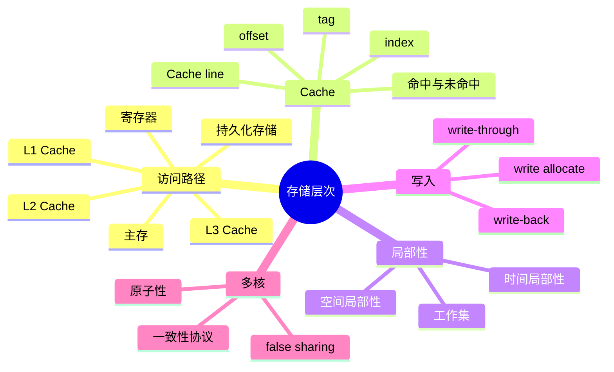

# 存储层次、Cache 与局部性

CPU 的算术速度和主存延迟相差很大。处理器如果每次都等待主存，执行单元会频繁空闲。存储层次用容量、速度和成本不同的多级存储保存数据：寄存器最快但最少，Cache（高速缓存）较小且快速，主存容量更大但延迟更高，磁盘和远端存储则更慢。

## 本章知识地图



## 一、缓存保存的是 Cache line

Cache 不通常按单个字节搬运，而是按固定大小的 Cache line（缓存行）从更低层加载。一次访问未命中时，相邻字节也会被带入更快的存储层，希望后续访问能复用这条缓存行。

缓存行包含数据、标签（tag）和有效位等元数据。地址的一部分选择集合或位置（index），另一部分与标签比较，最后的 offset 选择缓存行内的字节。不同架构的行大小、组数和替换策略不同，不能把某个平台的数字当作通用常量。

## 二、局部性让缓存有效

时间局部性表示最近访问的数据很可能再次访问；空间局部性表示相邻地址的数据可能很快被访问。顺序遍历数组同时利用两者，而随机指针追踪常常破坏空间局部性。

工作集是程序在一段时间内反复使用的数据集合。工作集适合缓存时命中率高；超过缓存容量后，数据不断被逐出和重新加载，出现抖动。算法复杂度相同的实现，因数据布局和访问顺序不同，运行时间可能相差很大。

```text
for i in range(n):
    sum += a[i]       # 连续访问，容易利用一条缓存行
```

二维数组按内存连续方向遍历通常更友好。结构体数组和数组结构体的选择，也会改变一次缓存行加载带来的有效字段数量。

## 三、命中和未命中的代价

L1、L2、L3 Cache 通常依次容量更大、延迟更高。某一级未命中时，处理器继续查询下一层；直到主存仍未命中，流水线可能停顿数十到数百个周期。乱序执行能隐藏部分等待，但真正依赖该数据的指令仍必须等待。

平均访存时间可以按层次概率粗略估计：

```text
平均时间 ≈ L1 延迟 + L1 未命中率 × L2 额外代价 + …
```

这个公式用于建立模型，具体数值要以处理器和工作负载测量为准。预取器可能提前加载数据，错误预取则占用带宽并污染缓存。

## 四、映射和替换

直接映射让每条内存块只能进入一个位置，查找简单但冲突可能多；全相联允许放在任意位置，查找和硬件成本更高；组相联在两者之间折中。发生冲突时，替换策略选择要逐出的缓存行，常用近似 LRU（Least Recently Used，最近最少使用）。

两个频繁访问的地址若映射到同一组，可能即使工作集很小也相互驱逐，这叫冲突未命中。调整数据对齐或布局有时能减少冲突，但需要结合地址映射和测量验证。

## 五、写入策略

write-through（直写）把写入同时更新缓存和下一层，状态简单但流量更大；write-back（回写）只先更新缓存行，逐出时再写回下一层，需要脏位记录。write allocate（写分配）在写未命中时先加载缓存行再修改；no-write-allocate 则直接写低层。

写策略影响带宽、延迟、一致性和持久化。Cache 中的数据被更新，不代表已经写入磁盘；内存可见性和持久化是不同层次的问题。

## 六、多核缓存一致性

多个核心可能各自缓存同一内存位置。缓存一致性协议通过状态和消息让核心知道其他核心的写入何时需要失效或获取新副本。它保证的是缓存副本之间的协议约束，不等于高层程序已经正确同步。

原子操作和内存屏障规定特定读写的不可分割性与顺序。没有锁或原子规则时，即使硬件最终传播了写入，程序仍可能出现竞态。

false sharing（伪共享）发生在两个线程修改不同变量，但变量恰好位于同一 Cache line。一个核心写入会使另一个核心的缓存行失效，导致无谓通信。按线程分离数据、填充对齐或改变批处理方式可能缓解它。

## 七、从源码到缓存行为

编译器可能把变量放进寄存器、重排独立访问或进行向量化，导致源代码中的一次访问不一定对应一次内存加载。分析缓存问题时要结合生成汇编、数据布局、访问模式和硬件计数器。

```sh
perf stat -e cycles,instructions,cache-references,cache-misses ./program
```

计数器名称和统计精度依赖平台。缓存未命中高可能来自随机访问、工作集过大、冲突、预取失败或多核失效，不能只凭一个数字决定优化方向。

## 常见误区

Cache 命中率高不等于程序一定快，命中层次和依赖链仍然重要；命中率低也不自动说明算法错误，顺序大数据扫描可能是合理行为。

缓存一致性不等于线程安全。它让副本按协议收敛，锁和原子操作才表达共享状态的访问顺序。

Cache line 不是应用消息、对象或页。false sharing 也不是两个线程访问同一个变量，而是访问不同变量却共享一条缓存行。

## 面试表达

先说明存储层次用更快、更小的存储减少 CPU 等待，缓存以 Cache line 为单位搬运数据，局部性决定命中率。再解释映射、替换和写策略，最后说明多核一致性、原子性和 false sharing 的区别。性能结论要结合工作集、访问顺序和计数器测量。

## 理解检查

1. 为什么缓存以 Cache line 而不是单字节搬运？
2. 顺序遍历为什么通常比随机访问快？
3. write-back 为什么需要脏位？
4. 缓存一致性为什么不能替代锁？
5. false sharing 为什么会让不同变量互相影响？

## 可观察实验

比较连续数组遍历、跨步访问和随机访问，使用 `perf stat` 记录 cache-misses 和运行时间；再让两个线程分别更新同一缓存行内和不同缓存行内的数据，观察 false sharing 对吞吐的影响。保持数据规模、线程绑定和编译选项一致。

## 术语卡片

| 缩写 | 英文全称 | 中文名称 | 本章作用 |
|------|----------|----------|----------|
| Cache | Cache Memory | 高速缓存 | 保存近期数据和指令 |
| LRU | Least Recently Used | 最近最少使用 | 一种替换策略 |
| CPU | Central Processing Unit | 中央处理器 | 执行访存和计算 |
