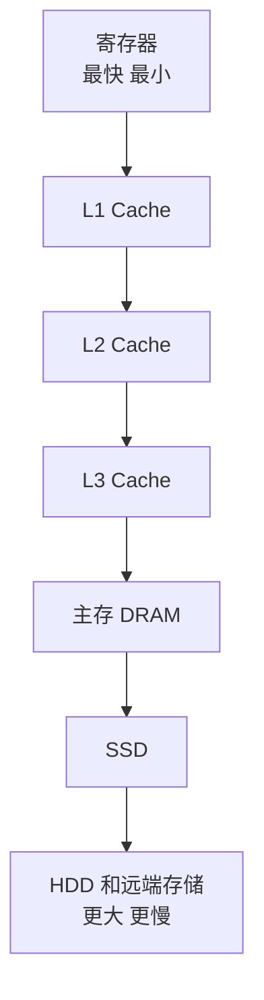
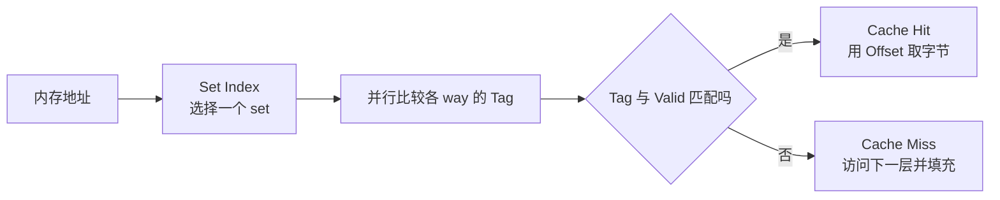

# 存储层次、Cache 与局部性

## 为什么需要层次结构

理想存储器希望同时做到：

- 容量大。
- 延迟低。
- 带宽高。
- 成本低。
- 断电不丢失。

现实中无法全部满足，于是形成层次：



上层缓存下层近期可能使用的数据。

## 局部性原理

### 时间局部性

最近访问的数据可能很快再次访问，例如循环计数器、热点对象。

### 空间局部性

访问某地址后，附近地址可能很快被访问，例如顺序遍历数组。

### 为什么数组通常比链表缓存友好

数组元素连续，加载一个缓存行会带来多个后续元素。链表节点可能分散，next 还形成必须等待前一步结果的指针依赖。

复杂度同为 O(n)，实际常数可能差很多。

## Cache 以缓存行为单位

CPU 不是只加载一个 int，而是加载一整条 cache line，常见大小如 64 byte。

若 int 为 4 byte，一条 64-byte 缓存行可容纳 16 个连续 int。

这解释了：

- 顺序扫描为什么快。
- 矩阵按行或按列遍历为何可能不同。
- false sharing 为什么发生在不同变量上。

具体缓存行大小由平台决定，不应写死为所有机器都相同。

## 地址怎样查 Cache

可把地址概念上分成：

```text
Tag | Set Index | Block Offset
```



- Offset：定位缓存行内的字节。
- Set Index：选择哪一组。
- Tag：判断这一行是不是目标内存块。

### 三种映射

| 映射 | 一个内存块能放哪里 | 特点 |
|------|-------------------|------|
| 直接映射 | 固定一个位置 | 简单，但冲突多 |
| 全相联 | 任意位置 | 冲突少，硬件查找复杂 |
| 组相联 | 固定组内任意路 | 常见折中 |

现代 CPU Cache 多使用组相联。

## Cache 命中与未命中

- Hit：目标缓存行在当前层，直接读取。
- Miss：当前层没有，要访问下一层并填充。

常见 miss 原因：

1. Compulsory：第一次访问。
2. Capacity：工作集超过容量。
3. Conflict：多个块竞争同一组。

多核还可能因一致性失效产生额外 miss。

## 平均访存时间

简化公式：

```text
AMAT = 命中时间 + miss rate × miss penalty
```

示例：

- L1 命中 1 ns。
- miss rate 5%。
- miss 额外代价 50 ns。

```text
AMAT = 1 + 0.05 × 50 = 3.5 ns
```

很小的 miss rate 也可能显著影响平均时间。

## 替换策略

一组满后需要选择淘汰项。理论上常讨论：

- LRU：淘汰最久未使用。
- FIFO：淘汰最早进入。
- Random：随机淘汰。
- 近似 LRU：用较少硬件状态逼近。

真实硬件往往使用近似策略，不能简单等同软件 LRU Cache。

## 写策略

### Write-through

写 Cache 时同时写下一层。逻辑简单，但写流量较大。

### Write-back

只修改 Cache 并标记 dirty，淘汰时才写回。减少写流量，但状态更复杂。

### Write-allocate

写 miss 时先把缓存行读入 Cache 再修改。

### No-write-allocate

写 miss 直接写下一层，不填充 Cache。

常见组合与工作负载和层级设计有关。

## 矩阵遍历示例

行优先存储语言中：

```python
for row in range(rows):
    for col in range(cols):
        total += matrix[row][col]
```

通常比交换循环顺序更符合空间局部性。Python 列表的内存模型与 C 连续二维数组不同，但“顺序访问、减少随机跳转”的原则仍成立。

## Cache 与 TLB 不一样

- Cache 缓存内存中的数据或指令。
- TLB 缓存虚拟页到物理页的地址翻译。

一次内存访问可能同时经历：

```text
虚拟地址
  -> TLB 查地址翻译
  -> 得到物理地址
  -> Cache 查数据
```

TLB miss 可能通过页表遍历得到有效映射；Page Fault 表示当前页表状态无法完成访问，需要操作系统处理。两者不能等同。

虚拟内存会在操作系统课程展开。

## 预取

硬件预取器尝试识别顺序或固定步长访问，提前加载缓存行。软件也可在部分平台给出预取提示。

预取过多会：

- 占用带宽。
- 污染 Cache。
- 加载不会使用的数据。

## 动手实验

做实验前，先从速度差距、地址拆分和真实访问模式三条线把缓存机制展开。

---

## 深入一：为什么一层存储器解决不了所有问题

### 1. 存储器的五个目标

理想存储器希望同时具备：

- 容量大。
- 延迟低。
- 带宽高。
- 单位容量成本低。
- 断电后数据不丢失。

现实器件无法同时做到，因此使用层次结构。

### 2. 从上到下看层次

```text
              更快、更小、更贵
                    寄存器
                   L1 Cache
                   L2 Cache
                   L3 Cache
                  主存 DRAM
                     SSD
                     HDD
                 远端对象存储
              更慢、更大、更便宜
```

每一层的基本思想：

- 上层保存下层数据的一个子集。
- 近期常用数据尽量停留在更快层。
- 未命中时向更慢层查找。
- 把取回的数据按块填入上层。

### 3. Latency 与 Bandwidth

**Latency 直译**：延迟。

一次访问从发起到得到首个结果所需时间。

**Bandwidth 直译**：带宽。

单位时间能够传输多少数据。

高带宽不能消除首次访问延迟：

- 顺序传输大文件更容易用满带宽。
- 指针追逐每一步依赖上一步地址，更受延迟影响。

### 4. 为什么 CPU 与 DRAM 差距重要

CPU 每个周期可以发射和执行多条操作，但主存访问可能跨越很多周期。没有 Cache 时：

- 执行单元频繁空等。
- 提高主频的收益被内存延迟吞掉。
- 程序性能更多由数据访问决定。

Cache 的作用是让大多数访问命中更快的小容量存储。

### 5. Cache 是猜测未来

Cache 无法知道未来，只能利用程序过去和附近的访问规律：

- 最近用过的，可能再用。
- 访问一个地址后，附近地址可能也会用。

如果工作负载完全随机、工作集巨大且没有复用，Cache 效果会明显下降。

---

## 深入二：局部性原理

### 1. Temporal Locality

**直译**：时间局部性。

最近访问过的数据很快再次访问。

例子：

```python
total = 0
for value in values:
    total += value
```

`total` 和循环状态反复使用，容易留在寄存器或 Cache。

### 2. Spatial Locality

**直译**：空间局部性。

访问一个地址后，很快访问附近地址。

例子：

- 顺序遍历数组。
- 顺序执行机器指令。
- 扫描连续字符串。

CPU 取一个缓存行时，把附近多个字节一起带入。

### 3. Sequential Locality

顺序局部性常被看作空间局部性的具体形式：

```text
地址 A
地址 A + 1
地址 A + 2
...
```

硬件预取器特别容易识别顺序或固定步长模式。

### 4. 局部性来自哪里

- 循环反复执行同一段代码。
- 数据结构把相关对象放在一起。
- 算法分块重复使用小数据集。
- 编译器重新安排代码和数据。
- 业务热点天然集中。

### 5. 局部性不是永久属性

同一数据结构在不同访问模式下表现不同：

- 数组顺序遍历局部性好。
- 数组完全随机访问可能局部性差。
- 链表节点若由内存池连续分配，可能比完全分散好。
- 小链表若全部留在 Cache，也未必慢。

不能只凭类型名称断言性能。

---

## 深入三：Cache Line

### 1. 缓存为什么按块传输

若每次只取 1 字节：

- 标签和管理开销比例很大。
- 无法利用空间局部性。
- 总线传输效率低。

所以 Cache 按固定大小块搬运，常称：

- Cache line。
- Cache block。

### 2. 64 字节示例

若缓存行为 64 字节，4 字节整数数组：

```text
一条缓存行可容纳 16 个 int
```

访问第一个元素时，后续 15 个连续元素也可能一起进入 Cache。

### 3. 行内偏移

64 字节 = `2^6` 字节，因此地址最低 6 位可表示行内位置：

```text
offset bits = log2(64) = 6
```

地址最低 6 位变化时，仍在同一缓存行。

### 4. 对齐为什么影响跨行

一个 16 字节对象若从缓存行最后 8 字节开始，会跨两条缓存行：

```text
line A: [......前 8 字节]
line B: [后 8 字节......]
```

一次逻辑访问可能需要两次行访问，某些原子操作还受更严格限制。

### 5. 缓存行不是所有机器都 64 字节

64 字节很常见，但不是体系结构定义的宇宙常数。工程代码若依赖具体大小，应：

- 查询平台信息。
- 使用语言/运行库提供的对齐工具。
- 明确支持的平台。
- 通过性能测量验证。

---

## 深入四：地址怎样命中 Cache

### 1. 地址三部分

概念上可拆为：

```text
Tag | Set Index | Block Offset
```

- Offset：缓存行内哪个字节。
- Set Index：应查哪一组。
- Tag：组内哪一路是否就是目标内存块。

### 2. 直接映射

每个内存块只能放入一个固定 Cache 位置：

```text
set = block_number mod number_of_sets
```

优点：

- 硬件简单。
- 查找快。
- 面积较小。

缺点：

- 两个频繁访问块映射到同一位置时反复互相淘汰。

### 3. 全相联

一个内存块可以放到 Cache 任意位置。

优点：

- 几乎没有映射位置冲突。

缺点：

- 需要同时比较大量标签。
- 硬件成本和功耗高。
- 大容量高速 Cache 不易实现。

### 4. 组相联

Cache 分成多个 set，每个 set 有若干 way：

```text
set 0: way0 way1 way2 way3
set 1: way0 way1 way2 way3
...
```

内存块只能进入指定 set，但可放在该 set 任一路。

它在：

- 直接映射的简单。
- 全相联的低冲突。

之间折中。

### 5. 容量公式

```text
Cache 数据容量
= set 数 × 每组 way 数 × cache line 大小
```

示例：

```text
64 sets × 8 ways × 64 bytes
= 32 KiB
```

### 6. 地址位数计算

假设：

- 32 位地址。
- Cache 为 32 KiB。
- 64-byte line。
- 8-way set associative。

计算：

```text
sets = 32 KiB / (64 B × 8)
     = 64
```

所以：

```text
offset = log2(64) = 6 位
index  = log2(64) = 6 位
tag    = 32 - 6 - 6 = 20 位
```

### 7. 一次查找

1. 用 index 选择一个 set。
2. 并行比较该 set 各 way 的 tag。
3. 同时检查 valid 和权限/状态。
4. 匹配时用 offset 选择目标字节。
5. 无匹配则发生 miss。

---

## 深入五：Hit、Miss 与 3C 模型

### 1. Cache Hit

目标行已在当前层并且有效：

- 直接读取数据。
- 延迟较低。
- 不需要访问下一层。

### 2. Cache Miss

当前层没有目标行：

1. 向下一层发起请求。
2. 必要时选择牺牲行。
3. 若牺牲行是 dirty，可能先写回。
4. 从下一层取回目标块。
5. 更新 tag 和状态。
6. 完成原访问。

### 3. Compulsory Miss

**直译**：强制未命中、冷启动未命中。

第一次访问某块时，上层从未缓存过它。

常用改善：

- 预取。
- 顺序访问。
- 复用已加载数据。

### 4. Capacity Miss

**直译**：容量未命中。

活跃工作集超过 Cache 容量，数据在再次使用前已被挤出。

改善：

- 减小工作集。
- 分块。
- 压缩数据。
- 避免同时维护不必要的数据。

### 5. Conflict Miss

**直译**：冲突未命中。

Cache 总容量看似够，但多个热点块映射到同一 set，反复互相淘汰。

改善可能包括：

- 提高相联度。
- 改变数据布局或步长。
- 添加适当偏移或 padding。

### 6. Coherence Miss

多核系统中，其他核心写同一缓存行会让本核心副本失效。随后再读就需要重新获取。

它与 false sharing 密切相关。

### 7. 工作集 Working Set

**直译**：工作集。

程序在一段时间内活跃访问的数据集合。

当工作集：

- 小于 L1：大部分访问很快。
- 超过 L1 但小于 L2/L3：平均延迟上升。
- 超过 LLC：更多访问主存。
- 超过物理内存：可能发生严重换页。

工作集不是程序总数据大小，而是当前时间窗口中反复使用的部分。

---

## 深入六：多级 Cache 与 AMAT

### 1. 为什么有 L1/L2/L3

单层 Cache 仍难兼顾速度和容量：

- L1 极快但很小。
- L2 较大稍慢。
- L3 更大，常在多个核心间共享。

具体层次、共享方式和包含关系因 CPU 而异。

### 2. Instruction Cache 与 Data Cache

L1 常分为：

- L1I：指令 Cache。
- L1D：数据 Cache。

好处：

- 取指和数据访问可并行。
- 各自针对不同访问模式优化。
- 减少结构冲突。

### 3. Inclusive、Exclusive、Non-inclusive

不同层之间可能：

- Inclusive：上层内容也保证在下层。
- Exclusive：尽量不重复，层级共同提供容量。
- Non-inclusive/non-exclusive：没有严格包含约束。

不能断言所有 CPU 都“L1 一定完全包含在 L2，L2 一定在 L3”。

### 4. 单层 AMAT

```text
AMAT = hit time + miss rate × miss penalty
```

若：

```text
hit time = 1 ns
miss rate = 5%
miss penalty = 50 ns
```

则：

```text
AMAT = 1 + 0.05 × 50
     = 3.5 ns
```

### 5. 多层 AMAT

简化两级：

```text
AMAT
= L1 hit time
 + L1 miss rate ×
   (L2 hit time + L2 miss rate × memory penalty)
```

必须确认 miss rate 是：

- Local miss rate：在进入该层的访问中未命中比例。
- Global miss rate：相对于所有原始访问的比例。

混用口径会算错。

### 6. Miss Penalty

未命中代价不仅是下一层固有延迟，还可能包括：

- 队列等待。
- 一致性请求。
- 脏行写回。
- 内存控制器调度。
- DRAM 行命中/未命中。
- NUMA 远端访问。

### 7. Memory-Level Parallelism

现代 CPU 可同时发出多个独立 miss，从而重叠部分等待。

因此：

- 单次内存延迟很高。
- 实际吞吐仍可能通过并行请求改善。
- 指针追逐因下一地址依赖当前数据，难以产生足够并行度。

---

## 深入七：替换与写策略

### 1. Replacement

组内所有 way 都占用时，新行需要选择牺牲者。

理想目标：

- 淘汰未来最久不用的数据。

但未来不可知，只能根据历史近似。

### 2. LRU

**Least Recently Used，最近最少使用。**

淘汰最长时间未访问的项。

问题：

- 高相联度下精确记录顺序成本高。
- 扫描型工作负载可能把热点挤出。
- 硬件常使用近似算法。

### 3. FIFO 与 Random

**FIFO：**

- 淘汰最早进入者。
- 简单，但不考虑近期复用。

**Random：**

- 随机选择。
- 状态成本低。
- 某些工作负载下可避免固定冲突模式。

### 4. Write Hit 策略

#### Write-through

写 Cache 同时写下一层。

优点：

- 下层更及时更新。
- 脏状态管理相对简单。

缺点：

- 写流量大。
- 常需写缓冲吸收延迟。

#### Write-back

只更新当前 Cache，并标记 dirty；淘汰时再写回下一层。

优点：

- 多次写同一行可合并。
- 减少下层流量。

缺点：

- 状态和一致性更复杂。
- 淘汰脏行会增加 miss 路径延迟。

### 5. Write Miss 策略

#### Write-allocate

写 miss 时先把整行取入 Cache，再修改。

适合后续还会继续访问该行。

#### No-write-allocate

写 miss 直接写向下层，不把行填入当前 Cache。

适合流式写入且近期不读。

### 6. Write Buffer

写操作可先进入写缓冲区，让 CPU 不必等待更慢层立即完成。

但缓冲区可能：

- 被写满。
- 需要合并写。
- 与后续读形成依赖。
- 影响内存可见顺序。

---

## 深入八：数组、链表与矩阵

### 1. 数组顺序扫描

连续布局带来：

- 一条缓存行包含多个元素。
- 硬件预取容易识别。
- 地址计算简单。
- 较少 TLB miss。

### 2. 链表指针追逐

链表节点可能分散：

```text
node1 -> node2 -> node3
```

每个 next 地址必须等当前节点读取后才能知道：

- 空间局部性弱。
- 预取困难。
- 内存级并行不足。
- 每个节点还有指针和分配器元数据成本。

### 3. 大 O 为什么不够

数组遍历和链表遍历都是 O(n)，但大 O 忽略：

- Cache line 利用率。
- TLB。
- 分支预测。
- 指令数。
- 内存分配布局。
- 预取。

复杂度先决定增长趋势，硬件成本决定真实常数。

### 4. 行优先矩阵

C 风格连续二维数组通常按行优先：

```text
a[0][0], a[0][1], a[0][2], ...
```

按行遍历：

```text
for i
    for j
        use a[i][j]
```

地址连续，空间局部性好。

按列遍历：

```text
for j
    for i
        use a[i][j]
```

步长可能很大，每次触碰新缓存行。

### 5. Loop Tiling

**直译**：循环分块。

矩阵乘法中不一次扫完整行列，而把数据划分成能留在 Cache 的小块：

```text
大矩阵
  -> 划成多个 tile
  -> 在小 tile 内重复计算
  -> 提高数据复用
```

核心是让短时间工作集适配 Cache。

### 6. AoS 与 SoA

**Array of Structures：**

```text
[x,y,z][x,y,z][x,y,z]
```

**Structure of Arrays：**

```text
[x,x,x][y,y,y][z,z,z]
```

如果算法只读取所有 x：

- SoA 可让每条缓存行更多字节是有效数据。
- 更容易向量化。

如果总是一起访问一个对象的全部字段，AoS 可能更自然。布局应匹配访问模式。

---

## 深入九：预取

### 1. Hardware Prefetcher

硬件观察访问模式：

- 连续地址。
- 固定步长。
- 某些重复序列。

然后在真正访问前请求后续缓存行。

### 2. 预取为何能隐藏延迟

如果数据在使用前已经到达 Cache，需求访问就表现为命中。预取没有消除内存访问，只是把等待与前面的计算重叠。

### 3. 预取失败的代价

- 消耗内存带宽。
- 占用 miss 处理资源。
- 污染 Cache。
- 挤出真正热点。
- 增加能耗。

### 4. Software Prefetch

编译器或程序可给出预取提示，但要正确估计提前距离：

- 太早：数据在使用前被淘汰。
- 太晚：仍来不及隐藏延迟。
- 错误路径：浪费带宽。

只有热点测量证明需要时才考虑。

---

## 深入十：TLB 与 Cache 的配合

### 1. TLB

**TLB = Translation Lookaside Buffer，地址转换后备缓冲。**

它缓存：

```text
虚拟页号 -> 物理页框号与权限
```

Cache 缓存：

```text
内存中的指令或数据块
```

二者解决不同问题。

### 2. 一次加载的概念路径

```text
CPU 产生虚拟地址
  -> TLB 查询地址翻译
  -> 获得物理地址
  -> Cache 查询数据
  -> 命中则返回
  -> 未命中则访问更低层
```

真实 CPU 可并行处理部分步骤，取决于 Cache 索引和标签设计。

### 3. 四种组合

| TLB | Cache | 结果 |
|---|---|---|
| hit | hit | 翻译和数据都快速获得 |
| hit | miss | 地址已知，数据需去更低层 |
| miss | hit | 需先完成页表遍历，数据可能已在 Cache |
| miss | miss | 翻译与数据都产生额外工作 |

### 4. TLB Miss

TLB 没有缓存对应翻译：

- 硬件或软件执行页表遍历。
- 若页表项有效，填充 TLB 后继续。
- 不必进入缺页分配或磁盘 I/O。

### 5. Page Fault

页表状态无法完成当前访问，需要操作系统处理：

- 按需分配。
- COW。
- 从文件读取。
- 从 Swap 调入。
- 非法访问则终止或发信号。

所以：

```text
TLB miss != Page Fault
Cache miss != Page Fault
```

### 6. 大页与 TLB Reach

**TLB Reach**：TLB 当前能够覆盖的虚拟内存总范围。

```text
TLB 条目数 × 页大小
```

更大页面可让相同条目覆盖更多内存，减少 TLB miss，但也可能：

- 增加内部碎片。
- 让分配和回收更困难。
- 放大 COW 或迁移粒度。

---

## 深入十一：多核与缓存行

### 1. 私有与共享 Cache

常见结构：

- 每核私有 L1。
- 每核或小集群私有 L2。
- 多核共享 LLC/L3。

具体实现不同，不能写成所有 CPU 的固定拓扑。

### 2. Cache Coherence

多个核心缓存同一物理地址时，需要保证对同一缓存行的写入传播和副本失效。

核心 A 要写：

1. 获得该缓存行的写权限。
2. 让其他核心相关副本失效。
3. 完成本地写入。
4. 其他核心再访问时获取新版本。

### 3. False Sharing

两个线程写不同变量，但变量在同一缓存行：

```text
[A 的计数器][B 的计数器]
```

每次写仍会争夺整条缓存行的独占权，导致行在核心间反复移动。

逻辑上没有共享同一变量，硬件粒度上却共享同一缓存行。

### 4. 解决思路

- 每线程局部累积，最后合并。
- 分离高频写字段。
- 使用合适的对齐或 padding。
- 降低共享写频率。
- 按分片所有权分配数据。

Padding 不是无条件正确：

- 增加内存占用。
- 可能降低整体 Cache 利用率。
- 缓存行大小和对象布局依平台变化。

---

## 深入十二：缓存优化方法论

### 1. 先减少数据量

- 选择更紧凑类型。
- 删除不用字段。
- 压缩稀疏结构。
- 避免重复对象。

更小工作集通常能同时改善 Cache 和 TLB。

### 2. 匹配访问顺序

- 连续访问。
- 批量处理。
- 按存储布局遍历矩阵。
- 避免随机跳转。

### 3. 提高复用

- 在数据离开 Cache 前完成相关操作。
- 循环分块。
- 合并对同一对象的多次遍历。

### 4. 减少共享写

- 使用每线程计数器。
- 分片。
- 批量合并。
- 避免伪共享。

### 5. 不盲目手工优化

优化必须满足：

1. 有性能目标。
2. 有可复现基准。
3. 能用指标确认瓶颈。
4. 修改后功能正确。
5. 在目标平台和输入上有稳定收益。

---

## 补充面试题：直接背诵

### Q1：为什么需要多级 Cache

> 存储器无法同时做到容量大、延迟低、带宽高和成本低，因此用层次结构折中。L1 小而快，L2/L3 更大但更慢，主存容量更大。程序的时间和空间局部性让大多数访问有机会命中上层，从而获得接近高速存储的平均访问时间。

### Q2：Cache line 是什么

> Cache 与下一层通常按固定大小块交换数据，这个块叫缓存行。一次访问会把附近字节一起带入，从而利用空间局部性；但一致性也以缓存行为粒度，所以不同变量位于同一行时可能产生 false sharing。

### Q3：直接映射、全相联和组相联有什么区别

> 直接映射让每个内存块只能放一个位置，简单但冲突多；全相联可放任意位置，冲突少但标签比较昂贵；组相联让块映射到固定组、组内可放任意一路，是现代 Cache 常见折中。

### Q4：三种 Cache miss 是什么

> Compulsory miss 是首次访问，capacity miss 是工作集超过容量，conflict miss 是多个块映射到有限位置相互淘汰。多核还可能因一致性失效产生 coherence miss。不同原因要用预取、分块、调整布局或减少共享写等不同方法处理。

### Q5：write-through 与 write-back

> Write-through 在写 Cache 时同步更新下一层，状态简单但写流量大；write-back 只改 Cache 并标脏，淘汰时再写回，能合并多次写但状态和未命中路径更复杂。它们还要与 write-allocate 或 no-write-allocate 的写 miss 策略区分。

### Q6：数组为什么通常比链表快

> 数组连续，缓存行利用率高，硬件容易预取，地址计算独立；链表节点可能分散，每一步需要先读取 next 才知道下一地址，容易产生 Cache/TLB miss 和串行内存等待。两者遍历都是 O(n)，但微架构成本不同。

### Q7：TLB 和 Cache 有什么区别

> TLB 缓存虚拟页到物理页的地址翻译，Cache 缓存指令或数据。一条加载可能先需要 TLB 翻译，再查 Cache。TLB miss 可以通过页表遍历得到有效映射，不等于 Page Fault；Cache miss 也不等于 Page Fault。

### Q8：为什么很低的 miss rate 也可能很贵

> 未命中代价可能是命中延迟的几十到几百倍。AMAT 等于命中时间加 miss rate 乘 miss penalty，因此即使 miss rate 只有几个百分点，也可能显著拉高平均时间；尾延迟和依赖链还可能受影响更大。

### Q9：什么是工作集

> 工作集是程序在一段时间窗口内活跃访问的数据集合，不等于进程总内存。工作集能放进上层 Cache 时复用好，超过 Cache 后容量未命中增加，超过物理内存还可能引发换页和 thrashing。

### Q10：怎样优化缓存行为

> 先通过测量确认瓶颈，再减少数据体积、使用连续布局、按存储顺序访问、循环分块、提高加载后的复用、减少共享写和伪共享。不能只凭理论改代码，必须在代表性输入和目标硬件上验证吞吐与延迟。

---

## 补充理解检查

### 判断题

1. Cache line 在所有处理器上都固定为 64 字节。
2. 数组任何访问方式都比链表快。
3. Cache 容量足够就绝不会发生 conflict miss。
4. 全相联查找的硬件成本通常高于直接映射。
5. Write-back 每次写都会同步写到下一层。
6. TLB miss 一定触发 Page Fault。
7. Cache miss 一定访问磁盘。
8. L1、L2、L3 在所有 CPU 上都严格包含。
9. 工作集等于程序申请过的全部内存。
10. 两个线程写不同变量就不会发生缓存行争用。

答案：1 错，2 错，3 错，4 对，5 错，6 错，7 错，8 错，9 错，10 错。

### 计算题

1. 64-byte line 需要多少个 offset bit。
2. 32 KiB、64-byte line、8-way Cache 有多少个 set。
3. 32 位地址在上述 Cache 中 tag/index/offset 各多少位。
4. 命中时间 1 ns、miss rate 2%、miss penalty 80 ns，AMAT 是多少。
5. 64 项 TLB 配 4 KiB 页时 TLB reach 是多少；换成 2 MiB 页又是多少。

### 讲解题

1. 从局部性解释为什么 Cache 能工作。
2. 画出一次 Cache miss 可能包含的替换、写回和填充步骤。
3. 比较数组、链表和哈希表的典型缓存行为。
4. 用行优先矩阵说明循环顺序的影响。
5. 解释预取怎样隐藏延迟，以及为什么可能适得其反。
6. 区分 TLB miss、Cache miss 和 Page Fault。
7. 设计一个验证 false sharing 的实验。

可比较顺序访问和随机访问大数组：

1. 创建超过 L3 容量的数据。
2. 顺序求和并计时。
3. 打乱下标后按随机顺序求和。
4. 使用 `perf stat` 比较 cache-misses。

应多次运行、预热，并避免把随机数生成时间算入遍历。

## 常见误区

- Cache 不是 Python/Redis 那种业务缓存，但共享“以额外空间换访问速度”的思想。
- L1/L2/L3 不保证每层严格包含上一层，具体看架构。
- Cache miss 不等于 Page Fault。
- 大 O 相同不代表缓存行为相同。
- 缓存行带来空间局部性，也可能带来 false sharing。

## 面试表达

**为什么数组遍历通常比链表快？**

> 数组连续，顺序访问能充分利用缓存行、硬件预取和较少的地址依赖；链表节点可能分散，每一步要先取到 next 才知道下一地址，容易产生 Cache/TLB miss 和串行等待。两者遍历复杂度都是 O(n)，但微架构成本不同。

**追问链**

1. Cache line 是什么？
2. 直接映射和组相联有什么差异？
3. write-through 与 write-back 如何权衡？
4. TLB 和 Cache 分别缓存什么？
5. 工作集超过 Cache 后会发生什么？

## 理解检查

1. 解释时间与空间局部性。
2. 使用 AMAT 计算一个两层简化例子。
3. 解释 tag、set 和 offset。
4. 说明 TLB miss 与 Cache miss 可以怎样同时发生。

---

[上一课：CPU 与流水线](../02-cpu-pipeline-performance/index.html) | [下一课：I/O 与多核 →](../04-io-multicore/index.html)
