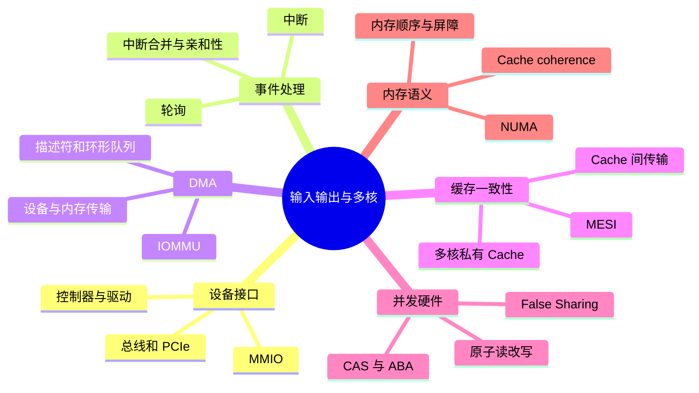
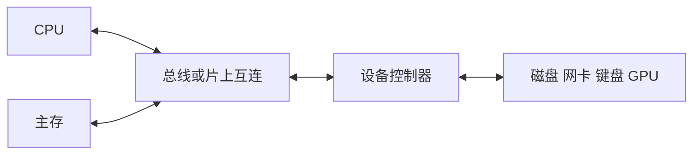
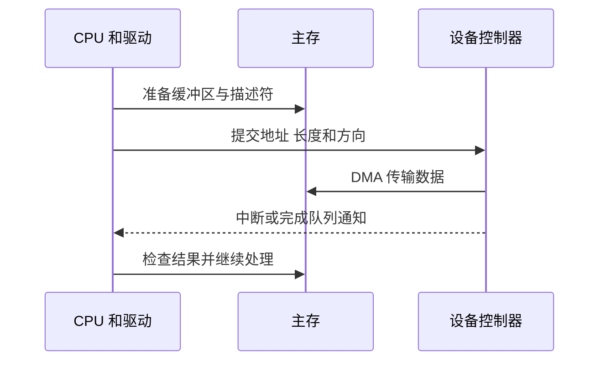
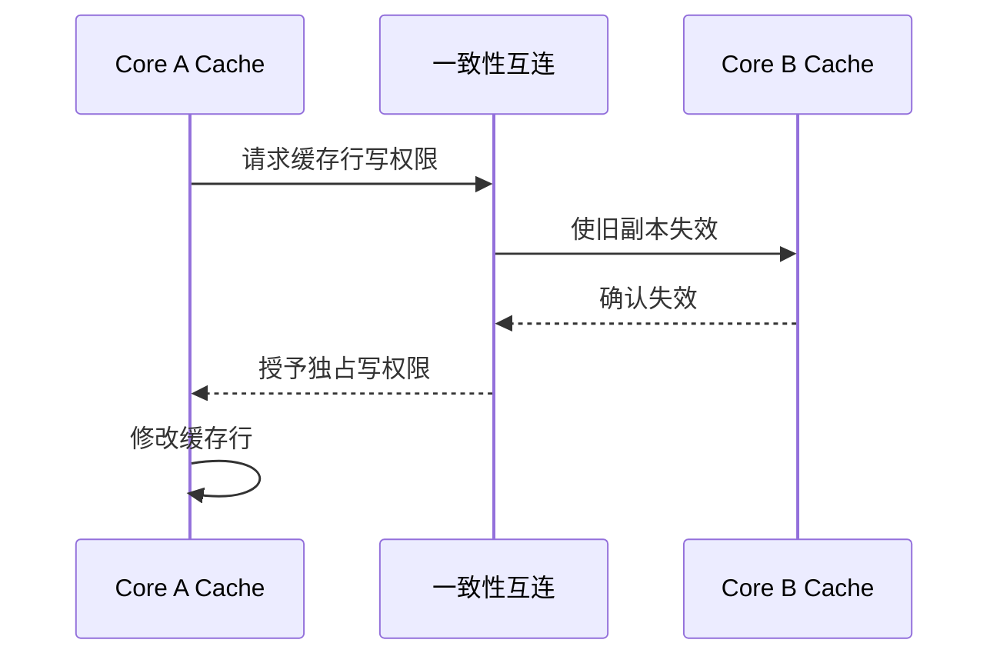

# 中断、DMA、多核与缓存一致性

## 本节知识地图



## CPU 怎样与设备通信

设备速度和行为差异巨大。CPU 通常通过设备控制器和寄存器与设备交互，而不是理解每种设备内部细节。



设备寄存器可通过专用 I/O 指令或内存映射 I/O（MMIO）访问。

## 轮询

CPU 不断读取设备状态：

```text
while 设备未完成:
    继续检查
```

优点是简单、响应可控；缺点是等待期间消耗 CPU。极短等待或高性能驱动中仍可能使用有限轮询。

## 中断

设备完成后主动通知 CPU：

```text
设备产生中断
  -> 中断控制器仲裁
  -> CPU 在指令边界响应
  -> 保存必要现场
  -> 切换到中断处理入口
  -> 驱动确认设备并处理事件
  -> 恢复现场继续执行
```

中断让 CPU 不必持续轮询，但每次中断也有保存现场、执行处理程序和缓存扰动成本。

高包速网络可能采用中断合并或轮询，减少每个数据包一次中断的开销。

## 中断、异常和系统调用

| 事件 | 来源 | 是否与当前指令同步 | 示例 |
|------|------|--------------------|------|
| 外部中断 | CPU 外部设备 | 通常异步 | 网卡收包、定时器 |
| 异常 | 当前指令执行 | 同步 | 除零、缺页 |
| 系统调用 | 程序主动执行陷入指令 | 同步 | read、write |

三者都会让 CPU 进入高特权级处理代码，但原因和返回语义不同。

## DMA

若 CPU 逐字节在设备与内存间搬运大块数据，会浪费执行能力。

DMA 流程：

1. CPU/驱动设置源、目标、长度和方向。
2. DMA 控制器在设备与内存间传输。
3. 完成后通过中断或队列通知 CPU。



DMA 减少 CPU 搬运，不代表 CPU 完全不参与：

- CPU 仍负责提交请求。
- 驱动管理描述符和缓冲区。
- 需要处理完成事件和错误。
- 还要考虑缓存一致性与内存映射。

## 总线、带宽与延迟

- 延迟：一次操作从发起到完成的时间。
- 带宽：单位时间能传输的数据量。

批量传输可以摊薄固定延迟，提高吞吐；小请求可能更关注延迟。

设备共享 PCIe、内存控制器或互连时会争用带宽。

## 多核为什么需要缓存一致性

每个核心可能有私有 Cache：

```text
Core A Cache: x = 1
Core B Cache: x = 1
Memory:       x = 1
```

若 A 修改 x，B 的旧副本必须失效或更新，否则不同核心看到不一致的值。



缓存一致性协议维护“同一缓存行副本”的状态。MESI 是经典状态模型：

- Modified：本核心已修改，内存可能旧。
- Exclusive：仅本核心有，内容与内存一致。
- Shared：多个核心可有，只读副本。
- Invalid：当前副本无效。

真实协议和实现可能更复杂，不需要背所有状态转移，但要理解“写入前获得独占权，其他副本失效”。

## False Sharing

两个线程修改不同变量，但变量恰好位于同一缓存行：

```text
同一 64-byte 缓存行
[thread A counter][thread B counter]
```

A、B 轮流写会导致缓存行在核心之间反复转移，虽然逻辑上没有共享同一个变量。

解决思路：

- 让热点写变量分散到不同缓存行。
- 每线程局部累积，最后合并。
- 减少共享写频率。

填充大小必须根据平台和运行时谨慎处理，不能盲目硬编码。

## 原子操作

`count += 1` 在机器层可能是：

```text
读取 count
加 1
写回 count
```

多线程交错会丢失更新。原子读改写指令让这组动作对其他核心表现为不可分割。

CAS（Compare-And-Swap）概念：

```text
如果内存值仍等于 expected:
    写入 new
并返回是否成功
```

CAS 可构建自旋锁和无锁结构，但会遇到：

- 高竞争下反复失败。
- ABA 问题。
- 活锁或饥饿。
- 内存顺序问题。

## 内存顺序

编译器和 CPU 可以重排不影响单线程结果的操作。多线程若没有同步，就不能仅凭源码顺序推断另一个核心的观察顺序。

内存模型和 acquire/release、屏障等机制规定：

- 哪些操作不能跨越重排。
- 写入何时对其他线程可见。
- 原子变量与普通变量如何组合。

“有缓存一致性”不等于“所有线程自动按源码顺序看到所有写入”。

操作系统课程会从锁、条件变量和信号量角度继续展开。

## 动手观察 False Sharing

实验前，先把设备、DMA 和多核一致性的完整机制串起来。

---

## 深入一：设备为什么不能像普通变量一样理解

### 1. 设备的差异

CPU 面对的设备包括：

- 键盘和鼠标。
- 磁盘和 SSD。
- 网卡。
- GPU。
- USB 控制器。
- 定时器。

它们的：

- 速度不同。
- 数据单位不同。
- 错误模式不同。
- 并发能力不同。
- 控制协议不同。

CPU 不会直接理解每种设备内部实现，而通过控制器和驱动使用标准化接口。

### 2. Device Controller

**直译**：设备控制器。

控制器通常提供：

- 命令寄存器。
- 状态寄存器。
- 数据或队列寄存器。
- DMA 能力。
- 中断能力。

驱动把操作系统的通用请求转换为控制器能理解的命令。

### 3. Driver

**直译**：驱动程序。

驱动负责：

- 初始化设备。
- 配置寄存器和队列。
- 提交 I/O。
- 处理中断和完成事件。
- 报告错误。
- 向内核上层提供统一接口。

驱动通常运行在高权限环境，错误可能影响整个系统。

### 4. Port-Mapped I/O

某些架构提供独立 I/O 地址空间和专用指令：

```text
CPU 使用专用 I/O 指令访问设备端口
```

普通内存地址与设备端口地址分开。

### 5. MMIO

**MMIO = Memory-Mapped I/O，内存映射 I/O。**

设备寄存器被映射到处理器地址空间：

```text
某个地址范围 -> 设备控制器寄存器
```

CPU 使用类似内存加载/存储的指令访问设备。

但 MMIO 不等于普通 RAM：

- 读取可能具有副作用。
- 写入可能触发设备命令。
- 访问顺序可能有严格要求。
- 不能随意被编译器删除或合并。
- Cache 属性通常需要特殊配置。

### 6. 为什么需要内存屏障和 volatile 类机制

驱动与设备交互时必须确保：

- 描述符内容先写好。
- 然后再通知设备。
- 设备完成状态读取不能被错误重排。

语言 `volatile`、编译器屏障和 CPU 内存屏障各解决不同层面的问题，不能把某一个当成全部答案。

---

## 深入二：Programmed I/O 与轮询

### 1. Programmed I/O

**直译**：程序控制 I/O。

CPU 通过指令直接读写设备状态和数据。

最简单流程：

```text
CPU 发命令
  -> 反复读状态
  -> 设备就绪
  -> CPU 读/写数据
```

### 2. Busy Waiting

**直译**：忙等待。

线程持续检查状态而不睡眠：

```text
while not ready:
    check_again()
```

优点：

- 没有睡眠和唤醒延迟。
- 对极短等待响应快。
- 控制流程简单。

缺点：

- 持续消耗 CPU 周期。
- 增加功耗。
- 与其他任务争用核心。
- 长等待非常浪费。

### 3. 轮询为什么没有被中断完全淘汰

在极高 I/O 速率下：

- 每个事件一次中断成本高。
- 中断可能持续打断当前执行。
- 批量轮询可以一次处理多个完成项。
- 专用核心忙轮询可换取更稳定低延迟。

常见折中：

- 低负载时中断。
- 高负载时轮询。
- 先短暂自旋，仍未完成再睡眠。
- 中断通知有工作，再批量轮询队列。

### 4. 选择依据

| 条件 | 更适合轮询 | 更适合中断/睡眠 |
|---|---|---|
| 等待时间 | 极短 | 较长或不可预测 |
| 事件速率 | 很高 | 较低 |
| CPU 是否专用 | 可以专用 | 需要共享 |
| 延迟目标 | 极低且稳定 | 更重视资源效率 |
| 功耗 | 可接受较高 | 要节能 |

---

## 深入三：中断完整链路

### 1. Interrupt

**直译**：中断。

外部设备通过中断向 CPU 表示“有事件需要处理”，让 CPU 不必一直轮询。

### 2. 从设备到 CPU

```text
设备产生事件
  -> 设备/控制器发出中断请求
  -> 中断控制器记录并仲裁
  -> 选定 CPU 接收
  -> CPU 在允许的边界响应
  -> 保存必要现场
  -> 根据中断向量进入处理入口
  -> 驱动确认来源并处理
  -> 恢复之前执行
```

### 3. Interrupt Vector

**直译**：中断向量。

它帮助 CPU/内核找到对应处理入口。不同设备或事件可映射到不同向量，内核再分派到相应驱动。

### 4. 中断上半部与延后处理

中断处理应尽量短：

- 确认设备。
- 记录必要状态。
- 暂存或调度后续工作。

较重工作可延后到更合适上下文批量处理。

原因：

- 中断上下文能力受限。
- 长时间占用会推迟其他中断和任务。
- 批量处理更高效。

不同操作系统和内核版本有具体机制，面试理解“快速响应 + 延迟重活”即可。

### 5. 中断合并

设备可累计一定事件或等待短时间后再通知 CPU：

- 减少中断次数。
- 一次处理多个数据包/完成项。
- 提高吞吐。

代价：

- 单个事件通知变晚。
- 增加少量延迟。

这是吞吐与延迟的典型权衡。

### 6. Interrupt Storm

**直译**：中断风暴。

中断速率过高时：

- CPU 大量时间用于处理中断。
- 用户线程得到的 CPU 减少。
- Cache 工作集频繁扰动。
- 整体吞吐和延迟恶化。

可通过中断合并、批处理、队列扩展、亲和性和轮询等方式缓解。

### 7. 中断亲和性

中断可路由到特定 CPU：

- 保持网卡队列与处理线程的缓存局部性。
- 分散中断负载。
- 避免单核过载。

配置错误也可能：

- 所有中断集中一个核心。
- 数据随后又由其他核心处理。
- 增加跨核缓存迁移。

---

## 深入四：中断、异常、陷阱和系统调用

### 1. 外部中断

- 来源在 CPU 外部。
- 与当前指令通常异步。
- 例如网卡到包、定时器、磁盘完成。

### 2. 异常

- 由当前指令同步产生。
- 例如缺页、除零、非法指令。
- 有的可修复后重试，有的导致进程终止。

### 3. 系统调用

- 由程序主动执行规定指令。
- 同步进入内核。
- 请求文件、网络、内存、进程等服务。

### 4. 共同点

- 保存必要现场。
- 进入预设高特权入口。
- 内核判断原因并处理。
- 最终返回、重试、调度或终止。

### 5. 不同点

| 类型 | 发起者 | 是否主动 | 是否与当前指令同步 |
|---|---|---|---|
| 中断 | 外部设备 | 否 | 否 |
| 异常 | 当前指令结果 | 否 | 是 |
| 系统调用 | 当前程序 | 是 | 是 |

---

## 深入五：DMA 完整机制

### 1. DMA 的动机

如果 CPU 为 1 MiB 数据逐字节执行：

```text
读设备寄存器
写内存
读设备寄存器
写内存
...
```

大量执行周期只用于搬运，无法做其他计算。

### 2. DMA

**DMA = Direct Memory Access，直接内存访问。**

设备或 DMA 引擎在配置后，能在设备与内存之间搬运数据，不要求 CPU 为每个字节执行显式复制指令。

### 3. 一次接收路径

以网卡接收为简化例子：

1. 驱动分配可供设备写入的内存缓冲区。
2. 驱动建立描述符，记录地址、长度等。
3. 驱动把描述符放入接收环形队列。
4. 驱动通过寄存器通知网卡。
5. 网卡收到数据包。
6. 网卡 DMA 把数据写入内存缓冲区。
7. 网卡更新完成状态。
8. 网卡中断 CPU 或等待驱动轮询。
9. 驱动读取完成描述符。
10. 内核网络栈继续处理数据。

### 4. Descriptor

**直译**：描述符。

DMA 描述符可能包含：

- 缓冲区地址。
- 长度。
- 方向。
- 所有权或有效标志。
- 分段信息。
- 完成状态。

多个描述符常组成队列或环。

### 5. Ring Buffer

环形队列适合生产者和消费者持续推进：

```text
驱动提交位置 -> [描述符][描述符][描述符] -> 设备消费位置
```

需要协调：

- 哪些条目属于驱动。
- 哪些条目属于设备。
- 写入描述符与更新尾指针的顺序。
- 队列满和空。

### 6. DMA 不等于 CPU 完全不参与

CPU 仍然负责：

- 分配和映射缓冲区。
- 构建描述符。
- 提交请求。
- 处理中断或轮询。
- 解析完成状态。
- 错误处理和超时。
- 上层协议和数据处理。

DMA 减少的是逐字节搬运工作。

### 7. DMA 与地址

设备使用的 DMA 地址不必简单等于用户程序虚拟地址：

- 用户虚拟地址需经过进程页表。
- 设备可能使用总线地址。
- IOMMU 可为设备提供受控地址翻译和隔离。

### 8. IOMMU

**IOMMU = Input-Output Memory Management Unit。**

作用类似面向设备的地址翻译与保护：

- 把设备 DMA 地址映射到物理内存。
- 限制设备只能访问授权区域。
- 支持虚拟化和设备直通。
- 处理不连续物理页映射。

没有正确隔离的 DMA 设备具有很高权限，可能读写任意物理内存。

### 9. DMA 与 Cache 一致性

设备直接修改内存时，CPU Cache 中可能仍有旧副本。

平台可能提供：

- 硬件一致性 DMA。
- 驱动显式刷新或失效 Cache。
- 特殊内存映射属性。

驱动必须遵循平台 DMA API，不能假设所有硬件自动一致。

---

## 深入六：总线、互连与 PCIe

### 1. Bus/Interconnect

**直译**：总线、互连。

它连接：

- CPU 核心。
- Cache。
- 内存控制器。
- I/O 控制器。
- 外部设备。

现代系统内部未必是一根所有组件共享的传统总线，常使用分层、点对点或片上网络，但“互连负责传输请求和数据”的模型仍适用。

### 2. 带宽共享

多个组件可能争用：

- 内存控制器带宽。
- PCIe 链路。
- 片上互连。
- LLC 容量和带宽。

因此设备标称带宽不等于应用可持续吞吐。

### 3. PCIe 基本直觉

PCIe 使用点对点串行链路，并可组合多个 lane：

- 代际影响每 lane 速率。
- lane 数影响总带宽。
- 编码和协议存在开销。
- 双向能力与拓扑影响实际吞吐。

面试通常不需背具体代际数字，但要知道：

- 链路宽度有上限。
- 多设备可能共享上游带宽。
- 小请求受延迟和协议开销影响更大。

### 4. 批量为何提升吞吐

每次 I/O 可能有固定成本：

- 描述符。
- 门铃寄存器。
- 中断。
- 锁和队列。

批量提交和完成处理可摊薄固定成本，但可能增加单个请求等待。

---

## 深入七：多核缓存一致性

### 1. 问题从哪里来

每个核心有私有 Cache：

```text
Core A Cache: x = 1
Core B Cache: x = 1
Memory:       x = 1
```

A 把 x 改为 2 后，如果 B 永远读旧副本，程序无法正确通信。

### 2. Coherence

**直译**：一致性、连贯性。

缓存一致性协议解决同一内存位置的多个缓存副本怎样保持一致。

直觉规则：

- 一个核心写某行前要取得写权限。
- 其他核心的该行副本需要失效或更新。
- 对同一位置的写最终形成可理解的顺序。

### 3. MESI 四状态

#### Modified

- 当前核心独占。
- 内容已修改。
- 内存中的副本可能较旧。
- 淘汰时需要写回。

#### Exclusive

- 当前核心独占。
- 内容与内存一致。
- 可在本地直接转为 Modified 后写。

#### Shared

- 多个核心可能有只读副本。
- 内容与内存一致。
- 写前必须取得独占权并让其他副本失效。

#### Invalid

- 当前缓存行副本不可使用。
- 再访问需要重新获取。

### 4. 读取共享行

A 与 B 都只读 x：

- 可以各自持有 Shared 副本。
- 不需要每次都从内存重新读取。
- 多读通常扩展性较好。

### 5. 写共享行

A 要写 x：

1. 请求该行的独占/修改权限。
2. B 的 Shared 副本失效。
3. A 修改本地行。
4. B 再读时必须重新获得最新内容。

写共享是缓存一致性流量的主要来源。

### 6. Cache-to-Cache Transfer

最新数据可能在另一个核心的 Modified 行中，而不是主存。系统可让数据在缓存间转移或由拥有者响应。

所以“Cache miss 一定直接去 DRAM”也不准确。

### 7. 一致性粒度

协议通常按缓存行工作，而不是按高级语言变量。这直接产生 false sharing。

---

## 深入八：False Sharing

### 1. 现象

```text
同一 cache line
+----------------+----------------+
| Core A 写的 a  | Core B 写的 b  |
+----------------+----------------+
```

a 和 b 是不同变量，但协议只知道整行。

### 2. 为什么变慢

A 写 a：

- 获取整行写权限。
- B 的该行失效。

B 写 b：

- 又获取整行写权限。
- A 的该行失效。

缓存行在核心间 ping-pong。

### 3. 为什么代码看不出共享

源码只显示不同字段：

```text
thread A -> counters[0]
thread B -> counters[1]
```

但对象布局可能让二者落在同一行。性能问题发生在硬件粒度。

### 4. 解决方式

- 每线程局部累积，最后合并。
- 按核心分片。
- 分离高频写字段。
- 使用平台提供的缓存行对齐。
- 降低写频率。

### 5. Padding 的代价

- 增加对象大小。
- 降低 Cache 容量利用率。
- 可能增加 TLB 压力。
- 不同平台缓存行大小不同。

必须测量，而不是对所有字段盲目填充。

---

## 深入九：原子操作

### 1. Atomic

**直译**：原子的、不可分割的。

一个原子操作对其他并发执行者表现为不可在中间观察或插入。

### 2. 为什么普通自增不是原子

```text
load count
add 1
store count
```

两个线程交错：

```text
A load 0
B load 0
A store 1
B store 1
```

一次更新丢失。

### 3. 原子读改写

CPU 提供对特定宽度、对齐和内存类型的原子指令：

- atomic exchange。
- fetch-add。
- compare-and-swap。
- load-linked/store-conditional。

不同 ISA 实现不同。

### 4. CAS

**CAS = Compare-And-Swap。**

```text
如果 memory == expected:
    memory = desired
    success
否则:
    返回当前值或失败
```

CAS 可用于：

- 自旋锁。
- 原子状态机。
- 无锁栈和队列。
- 引用计数。

### 5. CAS 循环

```text
do:
    old = load
    new = transform(old)
while CAS(old, new) 失败
```

高竞争时：

- 多线程反复失败重试。
- 消耗 CPU。
- 缓存行持续争夺。
- 系统吞吐可能下降。

“无锁”不等于“无竞争”或“必然更快”。

### 6. ABA 问题

线程 A 看到值 A，暂停。

线程 B：

```text
A -> B -> A
```

线程 A 恢复后 CAS 只看到值仍为 A，误以为中间没有变化。

常见处理：

- 值加版本号。
- 使用更宽 CAS 同时比较指针和计数。
- 使用安全内存回收方案。

### 7. 原子性不等于业务事务

单个余额原子减 1，不能自动保证：

- 订单记录创建成功。
- 库存与余额一起一致。
- 跨服务操作全部完成。

跨多个变量和外部系统的不变量仍需锁、事务或协议。

---

## 深入十：缓存一致性与内存一致性不是一回事

### 1. Cache Coherence

关注：

- 同一个内存位置。
- 多个 Cache 副本。
- 写入怎样传播或使旧副本失效。

### 2. Memory Consistency Model

关注：

- 多个内存操作。
- 其他核心允许按什么顺序观察。
- 编译器和 CPU 可做哪些重排。

### 3. 经典消息传递例子

初始：

```text
data = 0
ready = false
```

线程 A：

```text
data = 42
ready = true
```

线程 B：

```text
if ready:
    print(data)
```

没有正确同步时，不能只凭源码顺序保证 B 看到 `ready == true` 时也看到新 data。

### 4. 重排来自哪里

- 编译器优化。
- CPU 乱序执行。
- Store buffer。
- Cache 和互连传播时间。

单线程结果不变，不代表多线程观察顺序自然符合源码。

### 5. Acquire 与 Release

简化直觉：

**Release：**

- 发布某个同步状态前，之前相关写不能跑到发布之后。

**Acquire：**

- 观察同步状态后，之后相关读不能跑到获取之前。

二者配对可建立 happens-before 关系。

### 6. Sequential Consistency

**直译**：顺序一致性。

可把所有线程原子操作理解为存在一个全局交错顺序，同时每个线程内部顺序保持。

它容易理解，但可能比更弱内存序限制更多优化。

### 7. Memory Barrier

**直译**：内存屏障。

用于约束某些内存操作的重排与可见性。

屏障不是：

- 自动给所有数据加锁。
- 自动使复合操作原子。
- 自动建立业务事务。

高级语言应优先使用其原子和同步库，让编译器生成正确平台指令。

### 8. volatile 为什么通常不等于线程同步

不同语言中的 `volatile` 语义不同。以 C/C++ 的典型语境：

- 主要防止某些编译器省略或合并对对象的访问。
- 常用于设备寄存器、信号等特定场景。
- 不自动使 `count++` 原子。
- 不提供完整线程间 happens-before。

Java `volatile` 有更强的内存模型语义，但复合自增仍不原子。回答时必须说明语言。

---

## 深入十一：NUMA

### 1. UMA 与 NUMA

**UMA**：各 CPU 访问内存延迟大致统一的抽象。

**NUMA = Non-Uniform Memory Access。**

不同 CPU 节点访问不同内存区域成本不同：

```text
CPU 节点 0 -> 本地内存：较快
CPU 节点 0 -> 节点 1 内存：跨互连，较慢
```

### 2. NUMA 为什么出现

多路系统若所有 CPU 共享单一内存控制器：

- 带宽难扩展。
- 争用严重。
- 距离和电气限制增加。

每个节点配本地内存控制器，可扩展容量和带宽，但访问成本变得不均匀。

### 3. First Touch

许多系统按首次实际写入页面的位置决定物理页放在哪个 NUMA 节点。

如果：

- 主线程先初始化全部数据。
- 后续其他节点线程并行处理。

数据可能全在主线程节点，产生远程访问。

### 4. 优化思路

- 让工作线程并行初始化各自数据。
- 绑定线程和内存策略。
- 按 NUMA 节点分片。
- 减少跨节点共享写。
- 结合真实拓扑与指标验证。

### 5. 容器与 NUMA

容器 CPU 配额和亲和性若与内存分配位置不匹配，也可能出现远程内存成本。云原生性能调优不能只看容器逻辑 CPU 数。

---

## 深入十二：从网卡收包串起全章

```text
网线上的比特到达网卡
  -> 网卡控制器解析物理/链路信号
  -> 查找驱动准备的接收描述符
  -> DMA 把数据写入内存
  -> 更新完成队列
  -> 触发中断，或等待内核轮询
  -> CPU 进入内核处理完成事件
  -> 驱动和网络栈读取数据
  -> 必要时唤醒等待 Socket 的线程
  -> 用户线程被调度
  -> 系统调用把数据交给应用
```

这条路径涉及：

- 设备控制器。
- MMIO。
- 描述符与环形队列。
- DMA。
- 中断或轮询。
- Cache 和内存。
- 多核亲和性。
- 操作系统调度。

它也是组成原理连接操作系统和网络课程的关键桥梁。

---

## 补充面试题：直接背诵

### Q1：轮询和中断怎样选择

> 轮询持续检查设备，极短等待和高事件率下可避免频繁睡眠与中断，延迟稳定但消耗 CPU；中断让设备有事再通知，低负载更节能，但每次通知有现场和缓存成本。高性能系统常按负载在中断、合并和批量轮询之间折中。

### Q2：中断发生了什么

> 设备通过中断控制器发出请求，CPU 在允许的边界保存必要现场，根据中断向量进入内核处理入口。驱动确认来源、处理或登记完成事件，再恢复原执行或触发调度。较重工作通常延后或批量处理，避免长时间占用中断上下文。

### Q3：DMA 为什么能降低 CPU 开销

> 驱动先配置缓冲区、地址、长度和描述符，设备或 DMA 引擎直接在设备与内存间搬运大块数据，完成后通过中断或队列通知 CPU。它省去 CPU 逐字节复制，但请求提交、内存映射、完成处理和协议逻辑仍由 CPU 负责。

### Q4：IOMMU 解决什么问题

> IOMMU 为设备 DMA 提供地址翻译和访问控制，使设备只能访问被授权的物理页，并支持不连续内存、虚拟化和设备直通。它类似面向设备的 MMU，减少设备错误或攻击任意读写物理内存的风险。

### Q5：MESI 解决什么问题

> 多核私有 Cache 可能保存同一缓存行副本，MESI 等协议维护这些副本的有效性和写权限。核心写之前获取独占权并使其他副本失效，从而让对同一地址的读写最终保持一致。它不自动解决高级语言竞态和操作顺序问题。

### Q6：什么是 false sharing

> 两个线程修改不同变量，但变量落在同一缓存行。一致性协议按整行管理，两个核心写入时会反复争夺该行的独占权，造成失效和跨核传输。可用每线程局部累积、分片和适当对齐缓解。

### Q7：CAS 有什么问题

> CAS 能原子比较并更新单个状态，可构建锁和无锁结构；但高竞争下会反复失败自旋，还可能遇到 ABA、公平性、内存回收和内存顺序问题。原子操作也不能自动维持跨多个变量的业务不变量。

### Q8：缓存一致性和内存模型区别

> 缓存一致性主要保证同一地址多个缓存副本的写入传播与失效；内存模型规定多个地址上的操作能以什么顺序被其他线程观察。即使硬件保持 Cache coherence，没有同步时，编译器和 CPU 重排仍可能让线程看到意外顺序。

### Q9：NUMA 为什么会影响性能

> NUMA 系统中，CPU 访问本节点内存通常比跨节点访问快。线程迁移、集中初始化或数据分片不当会产生大量远程访问，增加延迟并占用互连带宽。优化需要同时考虑线程亲和性和物理页放置。

### Q10：DMA 和零拷贝是什么关系

> DMA 描述设备与内存之间由硬件搬运数据；零拷贝描述数据路径尽量减少 CPU 参与的内存复制。零拷贝方案常利用 DMA，但还涉及页缓存、缓冲区映射、描述符和协议处理，二者不是同义词。

---

## 补充理解检查

### 判断题

1. MMIO 地址中的内容可以像普通 RAM 一样任意缓存和重排。
2. 中断在所有负载下都一定优于轮询。
3. DMA 表示 CPU 完全不参与 I/O。
4. DMA 使用的地址必然等于进程虚拟地址。
5. Cache miss 一定从 DRAM 读取。
6. MESI 自动保证 `count++` 线程安全。
7. 两个不同变量不会产生 false sharing。
8. CAS 循环在高竞争下也一定很快。
9. Cache coherence 与 memory consistency 是同一概念。
10. NUMA 中所有 CPU 访问所有内存延迟相同。

答案：1 错，2 错，3 错，4 错，5 错，6 错，7 错，8 错，9 错，10 错。

### 讲解题

1. 画出 CPU、控制器、设备和驱动的关系。
2. 对比忙轮询、中断和混合模式的适用条件。
3. 画出网卡 DMA 收包的十步流程。
4. 解释为什么 DMA 需要 IOMMU 或其他访问限制。
5. 用 MESI 直觉说明核心 A 写共享行后核心 B 会怎样。
6. 设计一个验证 false sharing 的双线程实验。
7. 用 `data + ready` 例子解释为什么还需要内存顺序。
8. 解释 C/C++ volatile 与原子同步为何不同。
9. 画出 NUMA 本地访问与远程访问路径。

实验思路：

1. 两个线程分别高频更新两个计数器。
2. 先让两个计数器相邻。
3. 再改成每线程局部计数或分离存储。
4. 比较吞吐和 cache miss/coherence 相关指标。

实验需固定线程到不同核心并多次运行，否则调度噪声可能淹没结果。

## 常见误区

- DMA 减少 CPU 搬运，不等于完全没有 CPU 和内核工作。
- 中断不是免费通知，高频中断可能成为瓶颈。
- 缓存一致性解决副本一致，不自动解决竞态条件。
- 原子操作不等于一整段业务逻辑线程安全。
- 两线程修改不同字段，也可能因为 false sharing 互相影响。

## 面试表达

**中断和 DMA 怎样配合？**

> CPU/驱动先配置 DMA 描述符和缓冲区，DMA 控制器负责设备与内存间的大块传输，完成后设备通常通过中断或完成队列通知 CPU。这样减少 CPU 逐字节搬运，但请求提交、内存管理、完成处理和错误恢复仍由 CPU 与驱动负责。

**追问链**

1. 中断与异常有什么区别？
2. 为什么高性能网络有时从中断切换到轮询？
3. DMA 与零拷贝是什么关系？
4. MESI 解决了什么问题？
5. false sharing 为什么没有共享变量也会慢？
6. CAS 为什么不能自动解决所有并发问题？

## 理解检查

1. 画出一次 DMA 读完成的参与者与顺序。
2. 区分轮询、中断和系统调用。
3. 用缓存行解释 false sharing。
4. 说明缓存一致性与内存顺序的区别。

---

[上一课：存储层次](../03-memory-cache/index.html) | [下一门：操作系统 →](../../operating-system/index.html)
