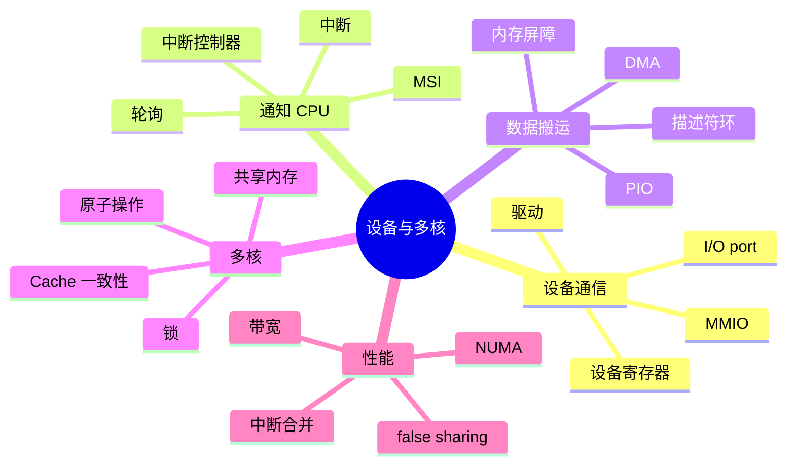
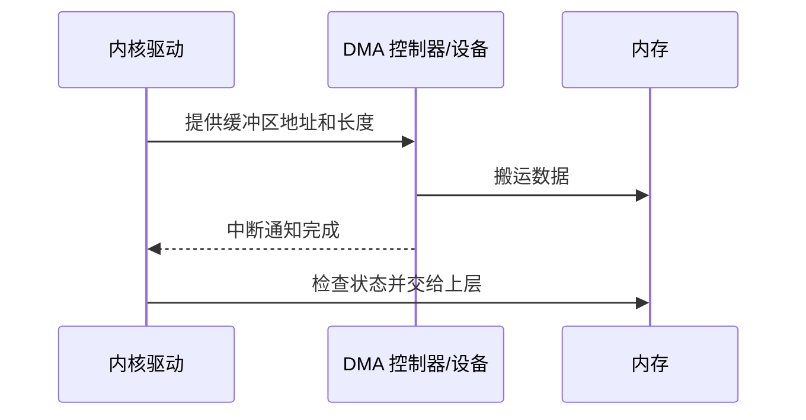

# 中断、DMA、多核与缓存一致性

设备的速度和时序由设备决定，CPU 却需要继续运行程序。操作系统必须设计一种方式，让设备在事件发生时通知 CPU，并尽量减少 CPU 参与数据搬运的成本。多核系统还要让不同核心对共享内存形成一致观察，同时控制通信和同步开销。

## 本章知识地图



## 一、CPU 怎样知道设备状态

设备通过寄存器暴露状态、控制和数据缓冲。CPU 可以轮询寄存器，反复读取直到设备完成；轮询简单且在极低延迟场景有优势，但设备长时间不完成时会浪费 CPU。

中断让设备在事件发生时通知 CPU。中断控制器记录来源并选择处理器，内核保存当前现场、运行中断处理程序、读取设备状态并安排后续工作。中断处理程序应尽快完成，耗时工作通常推迟到线程或软中断上下文。

中断不是“设备直接调用了某个用户函数”。它先进入内核，内核确认来源、清除状态并把数据交给驱动和更高层。中断频率过高会消耗 CPU 和调度时间，因此网卡常使用中断合并、批处理或轮询混合策略。

## 二、DMA 减少 CPU 搬运

PIO（Programmed I/O，程序控制输入输出）由 CPU 逐次从设备寄存器读写数据，流程清楚但每字节成本高。DMA（Direct Memory Access，直接内存访问）允许设备控制器按照描述符把数据写入内存或从内存读取，CPU 只需配置缓冲区、启动传输并在完成时处理通知。



DMA 并不意味着 CPU 完全不参与。内核需要管理缓冲区所有权、地址映射、缓存一致性和错误状态。设备仍可能通过 PCIe 等互连访问内存，带宽和队列深度会成为瓶颈。

## 三、设备缓冲区和内存顺序

驱动通常维护描述符环：一端由软件填入缓冲区地址和控制位，另一端由设备消费并写回完成状态。软件必须先写好数据和描述符，再发布“可用”状态；设备完成后，软件必须先读取状态，再读取数据。内存屏障保证这些写读顺序不会被处理器或编译器错误重排。

缓存一致性系统可能让设备 DMA 与 CPU 缓存存在同步要求。平台提供一致性 DMA 或显式刷新/失效接口，驱动必须遵循架构和操作系统规定，不能假设“内存地址相同就一定马上看到同样内容”。

## 四、多核共享内存的观察规则

多个核心可以同时执行指令，并通过共享内存交换数据。一个核心写入后，另一个核心何时看到该值，取决于缓存一致性协议、内存模型和同步操作。原子操作保证某个读改写不可分割，锁进一步保护多个字段组成的不变量。

缓存一致性协议会让写入一个核心的数据在其他核心副本中失效或更新。它解决的是缓存副本之间的协议问题，不自动解决业务竞态。没有 happens-before（先行发生关系）时，程序不能仅凭“最终会同步”推断安全顺序。

## 五、原子性、可见性和有序性

原子性表示操作不可被观察为中间状态；可见性表示其他核心能够看到写入；有序性表示多个访问遵守规定的先后。三者相关但不同。一个原子变量可能没有保护周围普通变量，单纯刷新缓存也不能让复合操作原子。

CAS（Compare-And-Swap，比较并交换）在内存值仍等于期望值时更新新值，失败时调用者需要重试或走其他路径。锁通常用原子指令实现竞争，再结合等待队列降低长时间占用 CPU 的成本。

## 六、NUMA 和多核性能

NUMA（Non-Uniform Memory Access，非统一内存访问）系统中，不同核心访问不同内存节点的延迟和带宽可能不同。线程迁移、数据首次触碰和内存分配策略会改变实际访问路径。性能优化需要考虑线程与数据的亲和性，而不是只统计总内存容量。

false sharing（伪共享）发生在不同线程修改不同变量，但这些变量位于同一 Cache line。一个核心写入会让另一个核心的缓存副本失效，产生无谓通信。对齐、填充、分区和批量合并可以缓解，但也会增加空间或合并成本。

## 七、设备中断和多核调度的排障

中断集中在一个核心时，该核心可能饱和而其他核心空闲；中断合并过度则增加单次处理延迟。Linux 上可以查看 `/proc/interrupts`、`/proc/softirqs` 和网卡队列，再结合 CPU 亲和性判断是否需要调整。

```sh
cat /proc/interrupts
cat /proc/softirqs
cat /sys/class/net/eth0/queues/
```

这些路径和字段依赖内核、驱动和设备。看到中断次数高不等于设备异常，必须结合吞吐、丢包、软中断时间和应用延迟分析。

## 常见误区

中断不是免费通知，频率过高会消耗 CPU；轮询也不是一定浪费，低延迟批处理可能更适合轮询。DMA 减少 CPU 搬运，但仍需要驱动管理缓冲区和完成状态。

缓存一致性不等于线程安全。原子性、可见性和有序性要由正确的内存模型和同步原语共同保证。

NUMA 不是“内存更快”，而是访问延迟具有位置差异。false sharing 也不是两个线程读写同一个变量，而是不同变量共享一条缓存行。

## 面试表达

设备可以被 CPU 轮询，也可以通过中断通知；DMA 让设备批量访问内存，CPU 处理配置和完成事件。多核共享内存依赖缓存一致性、原子操作和内存顺序，但一致性不等于业务同步。性能还要考虑中断频率、队列、NUMA 和 false sharing。

## 理解检查

1. 为什么中断处理程序通常不能承担全部耗时工作？
2. DMA 减少了哪一类 CPU 成本，又留下了哪些驱动责任？
3. 为什么设备描述符需要内存顺序保证？
4. 缓存一致性和线程安全分别解决什么问题？
5. false sharing 为什么会影响不同变量的线程？

## 可观察实验

比较轮询和中断两种方式处理一个可控本地事件，记录 CPU 占用和响应延迟；再用两个线程分别更新同一缓存行内和不同缓存行内的数据，观察吞吐变化。实验时固定 CPU 亲和性、编译选项和数据规模。

## 术语卡片

| 缩写 | 英文全称 | 中文名称 | 本章作用 |
|------|----------|----------|----------|
| DMA | Direct Memory Access | 直接内存访问 | 设备与内存批量搬运 |
| PIO | Programmed I/O | 程序控制输入输出 | CPU 直接参与设备读写 |
| MMIO | Memory-Mapped I/O | 内存映射输入输出 | 用地址访问设备寄存器 |
| CAS | Compare-And-Swap | 比较并交换 | 实现条件式原子更新 |
| NUMA | Non-Uniform Memory Access | 非统一内存访问 | 描述节点间访问差异 |
| CPU | Central Processing Unit | 中央处理器 | 执行驱动和应用代码 |
