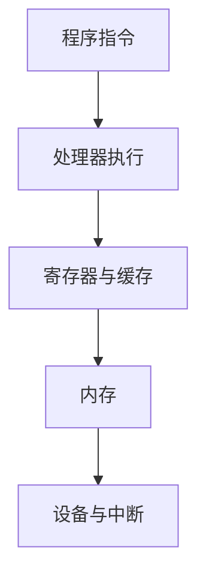

<!-- list-context-v1 -->

# 计算机组成原理导学

<!-- course-scaffold -->
## 主流程图



## 怎样阅读本节

本节围绕“计算机组成原理导学”展开。先理解它要解决的系统问题，再跟着数据、控制流和状态变化阅读实现细节；不要把下面的术语表当成需要先背诵的清单。

### 阅读前需要知道

这些内容描述的是同一机制的不同环节：程序会在处理器上执行，并通过操作系统请求内存、文件或网络服务。；一个机制的意义，要结合它要避免的失败、等待或资源冲突来理解。；文中的图展示参与者和顺序，正文解释每一步为什么发生。。
### 本节术语预览

首次出现时会给出英文全称、中文名称、所属层次和解决的问题；本节出现的主要缩写如下：

- **CPU**：Central Processing Unit，中央处理器
- **RAM**：Random Access Memory，随机存取存储器
- **Cache**：高速缓存
- **DMA**：Direct Memory Access，直接内存访问

### 建议的学习顺序

先读每个小节开头的“要解决的问题”，再读流程图和示例，最后用文末的误区、实验或面试表达检查自己能否复述因果链。


这门课回答一个问题：**程序写下的一行代码，怎样变成硬件真正执行的动作？**

读者不需要先会汇编，也不需要背电路图。只要理解变量、函数和循环，就可以从“数据存在哪里”开始，逐步建立程序、指令、处理器和存储设备之间的关系。


<!-- dependency-map-v1 -->
## 本节在课程中的位置

本节属于“计算机组成原理”主线。学习时先把它放进整条链路：前一阶段提供输入和前置状态，本节解释一个关键机制，后一阶段再使用这些状态处理更复杂的并发、性能或故障场景。

| 阅读关系 | 页面 | 目的 |
|----------|------|------|
| 课程入口 | [导学](../index.html) | 了解本门课的整体问题和术语边界 |
| 建议先读 | [计算机网络导学](../computer-network/index.html) | 准备本节需要的概念和状态 |
| 当前章节 | **计算机组成原理导学** | 建立本节的机制模型 |
| 后续复习 | [操作系统导学](../operating-system/index.html) | 观察本节机制如何参与更大的系统流程 |

阅读完后，尝试把本节的关键状态接回课程首页的贯穿主线；如果无法说明输入从哪里来、结果交给谁，说明前置概念还需要回看。

## 先建立一条主线


一个程序运行时，大致经历这样的链路：

```text
源代码
  → 编译器或解释器生成指令
  → CPU（Central Processing Unit，中央处理器） 取指、解码并执行
  → 指令访问寄存器、缓存和内存
  → 需要输入输出时，通过操作系统请求设备
```

这里的 `CPU（Central Processing Unit，中央处理器）` 负责执行指令；`RAM（Random Access Memory，随机存取存储器）` 保存正在使用的数据；`Cache（高速缓存）` 用更小但更快的存储空间，减少 CPU 等待内存的时间。

## 每章解决什么问题


| 章节 | 要回答的问题 |
|------|--------------|
| 数据表示、指令与程序执行 | 数字、字符和对象怎样表示？CPU 怎样执行一条指令？ |
| CPU、流水线与性能 | 为什么 CPU 不能每个时钟周期都完成任意指令？流水线怎样提高吞吐？ |
| 存储层次、Cache 与局部性 | 为什么同一份数据放在不同位置，访问速度会差很多？ |
| 中断、DMA（Direct Memory Access，直接内存访问）、多核与缓存一致性 | 设备怎样通知 CPU？多个核心怎样安全地看到共享数据？ |

## 贯穿示例：计算数组总和


```python
s = 0
for x in values:
    s += x
```

这段代码至少涉及四个层次：`values` 中的数据位于某个内存地址；CPU 把循环和加法转换成机器指令；频繁访问的数组元素可能暂存在缓存中；如果数据不在缓存，CPU 必须等待更慢的内存。后续章节会反复回到这个例子，解释正确性和性能分别从哪里来。

## 学习方法


每章先回答“没有这个机制会怎样”，再看组件、状态和执行顺序。遇到性能问题时，沿着数据移动的路径定位等待点：寄存器、缓存、内存、总线，还是设备。

学完本导学后，你应该能解释：程序和进程有什么区别、CPU 执行指令需要哪些状态、缓存为什么有效，以及为什么多核程序会遇到可见性和一致性问题。

下一步：[数据表示、指令与程序执行](./01-data-and-instructions/index.html)

<!-- chapter-closure-v1 -->
## 核心模型

先建立“输入、处理单元、输出和失败路径”的模型，再阅读具体实现。术语只有放进这条因果链，才不会变成孤立的背诵点。

## 常见误区

这些内容描述的是同一机制的不同环节：把名词定义当成机制解释，跳过状态和时间顺序。；把“通常如此”说成“任何平台都如此”，忽略实现和配置差异。；看到性能问题就直接调参数，没有先确认瓶颈位于哪一层。。
## 理解检查

1. 本篇首先解决什么问题？
2. 核心状态由谁保存，什么时候更新？
3. 设计的主要代价和边界条件是什么？

## 可观察实验

选一个最小可运行例子，记录输入、关键状态和输出，再把异常结果与文中的失败路径逐项对照。

<!-- term-cards-v1 -->
## 术语卡片

下表只收录本篇实际使用的主要缩写。阅读正文时先理解它在流程中的角色，复习时再用这张表回查全称和定义。

| 缩写 | 英文全称 | 中文名称 | 在本篇中的定义或作用 |
|------|----------|----------|----------------------|
| **CPU** | Central Processing Unit | 中央处理器 | 执行机器指令并协调计算的处理器核心 |
| **RAM** | Random Access Memory | 随机存取存储器 | 供处理器读写正在使用的数据的主存 |
| **DMA** | Direct Memory Access | 直接内存访问 | 允许设备在内存与设备间搬运数据，减少 CPU 逐字节参与 |
