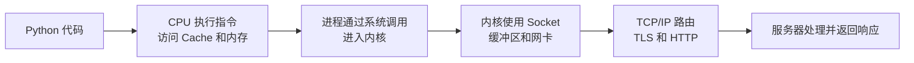

# 计算机基础系统课

> 目标不是背完 408，而是建立一套能解释程序运行、系统性能和网络请求的知识模型，能够应对面试连续追问。

## 为什么需要系统课

八股题库擅长告诉你“面试会问什么”，但不能代替知识依赖：

```text
为什么需要虚拟内存？
  -> 虚拟地址怎样转换？
  -> TLB 在哪里？
  -> TLB miss 为什么不等于缺页？
  -> 缺页时 CPU 和内核分别做什么？
  -> malloc 成功是否已经占用物理内存？
```

如果只记住第一层定义，追问一变就容易失去逻辑。本课程先解释机制，再训练表达。

## 一条主线串起三门课

假设一个 Python 程序向 HTTPS 服务发送请求：



三门课分别回答：

| 课程 | 核心问题 |
|------|----------|
| 计算机组成原理 | 指令怎样执行，数据怎样在寄存器、Cache、内存和设备间移动 |
| 操作系统 | 多个程序怎样安全共享 CPU、内存、文件和 I/O 设备 |
| 计算机网络 | 数据怎样跨主机可靠传输并变成一次 HTTP 请求 |

## 推荐学习顺序

### 第一阶段：计算机组成原理

1. [导学：程序如何在硬件上运行](./computer-organization/index.html)
2. [数据表示、指令与程序执行](./computer-organization/01-data-and-instructions/index.html)
3. [CPU、流水线与性能](./computer-organization/02-cpu-pipeline-performance/index.html)
4. [存储层次、Cache 与局部性](./computer-organization/03-memory-cache/index.html)
5. [中断、DMA、多核与缓存一致性](./computer-organization/04-io-multicore/index.html)

### 第二阶段：操作系统

1. [导学：操作系统怎样管理程序](./operating-system/index.html)
2. [内核、系统调用、进程与线程](./operating-system/01-kernel-process-thread/index.html)
3. [调度、同步、锁与死锁](./operating-system/02-scheduling-concurrency/index.html)
4. [地址空间、分页、TLB 与缺页](./operating-system/03-virtual-memory/index.html)
5. [文件系统、I/O、epoll 与零拷贝](./operating-system/04-filesystem-io/index.html)
6. [Linux 观测与故障定位](./operating-system/05-linux-observability/index.html)

### 第三阶段：计算机网络

1. [导学：一次请求怎样到达服务器](./computer-network/index.html)
2. [分层、以太网、MAC 与 ARP](./computer-network/01-layers-link/index.html)
3. [IP、子网、路由、ICMP 与 NAT](./computer-network/02-ip-routing/index.html)
4. [UDP、TCP 与可靠传输](./computer-network/03-transport-tcp/index.html)
5. [DNS、HTTP、缓存与连接演进](./computer-network/04-dns-http/index.html)
6. [TLS、完整请求链路与网络排障](./computer-network/05-tls-debugging/index.html)

## 每篇课怎样学

所有章节尽量按同一结构组织：

1. **问题**：为什么需要这项机制。
2. **模型**：先画组件和数据流，不急着背术语。
3. **过程**：按时间顺序解释每一步。
4. **量化**：用地址、时延、吞吐或容量做一个计算。
5. **实验**：用系统工具看到真实现象。
6. **误区**：区分容易混淆的概念。
7. **面试表达**：30 秒结论和 2 分钟展开。
8. **追问树**：从定义追到实现与权衡。

## 三层掌握标准

### 第一层：能复述

知道名词定义和基本流程。例如能说出 TCP 三次握手。

### 第二层：能解释

知道为什么这样设计、替代方案有什么问题。例如能解释为什么两次握手不足。

### 第三层：能诊断

能把原理用于场景。例如连接建立慢时，知道区分 DNS、TCP、TLS、服务端排队和丢包重传。

面试追问通常在第二、第三层。

## 学习记录模板

每学一节，用自己的话填写：

| 项目 | 内容 |
|------|------|
| 它解决的问题 | 没有它会发生什么 |
| 核心状态 | 哪些表、队列、寄存器或字段在变化 |
| 主流程 | 按时间顺序写 5–8 步 |
| 关键权衡 | 时间、空间、吞吐、延迟、隔离或可靠性 |
| 可观察证据 | 什么命令、指标或抓包能看到 |
| 高频追问 | 面试官会从哪里继续问 |

## 不需要先学什么

这是面试向系统课，不要求先掌握：

- 卡诺图和复杂数字电路化简。
- 某一种汇编语言的完整语法。
- 408 考研中的大量公式型计算。
- Linux 内核全部源码实现。
- 网络协议每个字段的机械记忆。

但会讲清支撑操作系统、并发、性能和网络 I/O 的必要硬件与协议机制。

## 学完后的综合问题

你应该能沿一条因果链回答：

1. 程序从源码到进程经历什么。
2. 一次内存访问可能经过哪些缓存和地址转换。
3. 系统调用为什么需要进入内核，但不一定切换进程。
4. 页面为什么会缺页，TLB miss 为什么不是缺页。
5. 多线程为什么需要锁，锁最终依赖什么硬件能力。
6. Socket 写入的数据怎样到达网卡。
7. TCP 怎样同时处理可靠性、接收方速度和网络拥塞。
8. 输入 URL 后 DNS、TCP、TLS、HTTP 分别做什么。

## 系统课与题库的关系

学习顺序建议：

```text
系统课章节
  -> 文末理解检查
  -> 操作系统 / 网络速查题库
  -> 公司岗位八股
  -> 真实面经追问复盘
```

题库用于检验和复习，不再承担第一次讲清概念的职责。

---

## 给从未学过三门课的读者

这套课不默认你已经知道：

- CPU 和内存的区别。
- 地址是什么。
- 进程为什么能隔离。
- Socket 是什么。
- TCP/IP 分几层。

只需要具备：

- 能阅读简单 Python/Java/Go/C 代码中的一种。
- 知道变量、函数和循环。
- 愿意画图和执行命令。

### 学习目标不是背缩写

面对新术语时，不先背英文，而先回答：

```text
没有它会发生什么问题？
它由谁维护？
它保存什么状态？
一次操作按什么顺序发生？
失败时能观察到什么？
```

英文用于精确沟通，不应替代机制理解。

---

## 最小基础词汇

### bit

一个二进制位，取值 0 或 1。

### byte

字节，现代通用系统中通常为 8 bit。

### instruction

CPU 能直接执行的机器指令。

### address

用于定位内存、设备或网络端点的标识。不同层的地址含义不同。

### state

系统为了之后正确继续工作而保存的信息。

### buffer

临时保存数据、协调生产与消费速度差异的一段存储。

### queue

等待被处理的对象集合。排队通常直接影响延迟。

### cache

把近期可能使用的数据放在更快位置，以额外空间换时间。

### context

执行恢复所需的环境，例如寄存器、栈和相关系统状态。

### protocol

通信双方对消息格式、顺序与错误处理的约定。

### latency

完成一个任务需要多久。

### throughput

单位时间完成多少任务或传输多少数据。

### concurrency

多个任务在一段时间内共同推进。

### parallelism

多个任务在同一时刻真正执行。

---

## 三门课的依赖关系

```text
计算机组成原理
  解释硬件有什么能力
        |
        v
操作系统
  用硬件能力提供抽象、隔离和资源管理
        |
        v
计算机网络
  让不同主机上的进程按协议交换数据
```

### 为什么先学组成原理

操作系统中的：

- 页表。
- TLB。
- 中断。
- DMA。
- 原子操作。

都依赖硬件概念。

### 为什么再学操作系统

网络应用中的：

- 进程和线程。
- Socket fd。
- 系统调用。
- 缓冲区。
- epoll。

都由操作系统提供。

### 为什么网络放最后

网络把前两门课串起来：

- CPU 执行协议代码。
- 内核维护 Socket 和 TCP 状态。
- DMA 在网卡与内存间搬数据。
- 应用最终解析 HTTP。

---

## 第一阶段：组成原理学习路线

### 第 1 章目标

掌握：

- 二进制与十六进制。
- 位运算。
- 无符号数与补码。
- 溢出。
- 浮点近似。
- Unicode/UTF-8。
- 大小端。
- 编译、链接、装载。
- ISA、ABI、寄存器和栈帧。

### 第 2 章目标

掌握：

- 主频、周期、CPI、IPC。
- 延迟与吞吐。
- 流水线。
- 结构、数据和控制冒险。
- 分支预测。
- 超标量、乱序、SIMD、SMT。
- Amdahl 定律。

### 第 3 章目标

掌握：

- 存储层次。
- 时间/空间局部性。
- Cache line。
- tag/index/offset。
- 三类 miss。
- AMAT。
- 写策略。
- TLB 与 Cache。
- 工作集和 false sharing。

### 第 4 章目标

掌握：

- 控制器与 MMIO。
- 轮询和中断。
- DMA、描述符和环形队列。
- IOMMU。
- MESI。
- 原子操作、CAS 和 ABA。
- 内存顺序。
- NUMA。

### 阶段验收

能从一行整数加法讲到：

```text
源码
  -> 编译
  -> ISA 指令
  -> PC 取指
  -> 流水线
  -> 寄存器和 ALU
  -> TLB/Cache/内存
  -> 结果写回
```

---

## 第二阶段：操作系统学习路线

### 第 1 章目标

掌握：

- 内核、用户态、内核态。
- 系统调用、中断、异常。
- 进程与线程。
- PCB/task。
- 状态转换。
- fork/exec/wait。
- IPC、协程和容器进程模型。

### 第 2 章目标

掌握：

- 调度指标和经典算法。
- 时间片与抢占。
- 竞态、原子性、可见性。
- mutex/futex。
- 条件变量和信号量。
- 读写锁。
- 死锁、活锁、饥饿和优先级反转。

### 第 3 章目标

掌握：

- 虚拟/物理地址。
- 页与页表。
- 多级页表。
- TLB。
- minor/major fault。
- 按需分页。
- malloc、COW、mmap。
- 回收、Swap、OOM 和大页。

### 第 4 章目标

掌握：

- VFS、dentry、inode。
- fd 与打开文件对象。
- 链接和删除。
- page cache。
- write/fsync。
- 阻塞、非阻塞、同步、异步。
- select/poll/epoll。
- LT/ET 和零拷贝。

### 第 5 章目标

掌握：

- USE/RED。
- CPU、load 和上下文切换。
- 内存、RSS、fault、PSI。
- 磁盘和 fd。
- strace/perf。
- 容器 Cgroup 指标。
- 从症状到证据的排障报告。

### 阶段验收

能从一次 `read()` 讲到：

```text
用户态系统调用
  -> fd/open file/inode
  -> page cache
  -> 缺页或设备 I/O
  -> 线程阻塞
  -> 调度其他线程
  -> DMA + 中断
  -> 原线程就绪
  -> 返回用户态
```

---

## 第三阶段：网络学习路线

### 第 1 章目标

掌握：

- 五层模型。
- 封装和解封装。
- 以太网帧。
- MAC 与交换机。
- ARP。
- VLAN、DHCP。
- MTU 与 MSS。

### 第 2 章目标

掌握：

- IPv4/CIDR 子网计算。
- 路由表和最长前缀匹配。
- TTL、ICMP、traceroute。
- NAT/PAT。
- IPv6/NDP。
- 分片和 PMTUD。

### 第 3 章目标

掌握：

- 端口和 Socket。
- UDP 数据报。
- TCP 字节流。
- 三次握手。
- seq/ACK/SACK/RTO。
- rwnd/cwnd。
- BDP。
- 四次挥手和状态。
- 业务幂等边界。

### 第 4 章目标

掌握：

- DNS 层次、递归、迭代与缓存。
- A/AAAA/CNAME/NS。
- CDN。
- URL 和 HTTP 消息。
- 方法、状态码。
- HTTP 缓存。
- Cookie/Session。
- HTTP/1.1、2、3。

### 第 5 章目标

掌握：

- TLS 安全目标。
- 对称、非对称、哈希、HMAC 和签名。
- 证书链。
- TLS 1.3。
- SNI、ALPN。
- 恢复与 0-RTT。
- HTTPS 全链路。
- DNS/TCP/TLS/HTTP 分层排障。

### 阶段验收

能从 URL 讲到：

```text
DNS
  -> IP 与路由
  -> ARP/NDP
  -> TCP/QUIC
  -> TLS
  -> HTTP
  -> CDN/LB
  -> 应用进程
```

---

## 推荐学习节奏

### 方案 A：四周集中学习

第一周：

- 组成原理四章。
- 每天一章。
- 第五天复习和实验。

第二周：

- 操作系统前三章。
- 重点画状态机和地址翻译。

第三周：

- 操作系统后两章。
- 网络前两章。

第四周：

- 网络后三章。
- 综合链路与面试表达。

### 方案 B：八周稳步学习

每周两到三章：

- 第一天读机制。
- 第二天做计算和判断题。
- 第三天执行实验。
- 第四天口述面试答案。
- 周末串联前后章。

### 每次学习 60 分钟模板

```text
10 分钟：读速览和术语
20 分钟：画机制流程
10 分钟：手算/判断题
10 分钟：执行实验
10 分钟：不看资料口述
```

---

## 实验环境

### 首选 Linux

许多命令和 `/proc` 内容基于 Linux：

- `ps/top`。
- `strace`。
- `perf`。
- `ip/ss`。
- `vmstat/iostat`。

### macOS

可完成：

- 编译和查看汇编。
- DNS/HTTP/TLS。
- 基础进程与网络观察。

但：

- 没有 Linux `/proc`。
- 命令参数和内核机制不同。
- 不能把输出机械套用。

### Windows

概念仍适用，但工具和 API 不同。可使用：

- WSL 练习 Linux 用户空间。
- 系统自带性能和网络工具。
- 虚拟机或容器实验环境。

WSL 与原生 Linux 在内核/网络部署细节上仍可能不同。

### 实验安全

- 不在生产环境无评估运行重型跟踪。
- 抓包注意隐私和凭据。
- 故障实验使用本地或隔离环境。
- 不随意修改系统级内核参数。

---

## 统一知识卡模板

每个概念写一张卡：

```text
术语：
直译：
解决的问题：
核心对象：
输入：
状态变化：
输出：
时间/空间代价：
失败模式：
观察工具：
常见误区：
30 秒回答：
```

示例，TLB：

```text
术语：Translation Lookaside Buffer
直译：地址转换后备缓冲
问题：多级页表遍历太慢
状态：缓存 VPN -> PPN 与权限
命中：直接得到翻译
未命中：page walk
误区：TLB miss 不等于 Page Fault
工具：perf 等硬件计数器
```

---

## 画图模板

### 数据流图

```text
来源 -> 缓冲 -> 处理者 -> 下一层
```

适合：

- DMA。
- read/write。
- 网络封装。

### 状态机

```text
状态 A --事件--> 状态 B
```

适合：

- 进程状态。
- TCP 状态。
- Cache coherence。

### 分层图

```text
应用
传输
网络
链路
硬件
```

适合网络和系统调用。

### 地址拆分

```text
tag | index | offset
VPN | page offset
```

适合 Cache 和虚拟内存。

---

## 怎样从“会背”升级到“会解释”

### 只会背

> 线程比进程轻。

### 会解释

> 同进程线程共享地址空间，切换通常不需要更换页表和地址空间身份，TLB 与 Cache 工作集更容易保留；但仍需保存寄存器和经过调度器。

### 会追问

> 现代 CPU 有 ASID/PCID，所以跨进程也不必每次完整清空 TLB；真实成本还包括 Cache 工作集和跨核迁移。

### 会诊断

> 上下文切换高时先区分主动和非主动，再结合线程数、运行队列、I/O、锁与吞吐判断，不能只凭一个 cs 指标。

每个知识点都按这四层训练。

---

## 怎样做计算题

### 先写单位

例如：

```text
100 Mbps × 0.1 s = 10 Mb = 1.25 MB
```

bit 与 byte 要换算。

### 先画时间线

调度题和 TCP 时序题不要只在脑中算：

```text
0---P1---2---P2---4
```

### 先拆字段

地址题：

```text
VPN | offset
tag | set | offset
```

### 明确模型假设

- 页大小。
- Cache 行大小。
- 调度是否抢占。
- RTT 是否固定。
- 单位是十进制还是二进制前缀。

---

## 怎样练面试

### 30 秒

先给：

- 定义。
- 核心区别。
- 一句机制。

### 2 分钟

补：

- 流程。
- 状态。
- 权衡。
- 例子。

### 继续追问

主动给边界：

- 不是必然。
- 具体依平台。
- 哪个条件成立时。
- 什么指标能验证。

### 不要用绝对化句式

谨慎对待：

- 一定。
- 永远。
- 完全。
- 零开销。
- 绝对安全。

系统机制常有硬件、内核、语言和部署条件。

---

## 跨课程综合链路：程序请求一个 HTTPS API

### 1. 源码

字符串和 URL 按字符编码存在。

### 2. 执行

解释器/JIT/编译代码成为 CPU 指令，经过流水线执行。

### 3. 内存

指令和数据访问经过 TLB 与 Cache，缺页时进入内核。

### 4. 线程

应用线程运行，调用 Socket API。

### 5. 系统调用

CPU 从用户态进入内核，内核校验 fd 与缓冲区。

### 6. DNS

域名通过缓存、递归器和权威系统得到 IP。

### 7. 路由

内核选择源地址、出接口和下一跳。

### 8. 链路

ARP/NDP 得到下一跳地址，以太网/Wi-Fi 发送帧。

### 9. 设备

驱动准备描述符，网卡 DMA 读取内存并发送。

### 10. 传输

TCP/QUIC 建立状态，处理可靠性、流控和拥塞。

### 11. 安全

TLS 验证证书、协商密钥并加密数据。

### 12. 应用

HTTP 请求经 CDN、代理和服务端处理。

### 13. 返回

响应沿协议栈返回，网卡 DMA 数据到内存，中断/轮询通知内核，线程唤醒读取。

### 14. 观测

故障时用：

- CPU/Cache/fault 指标。
- 进程线程和系统调用。
- DNS/路由/Socket。
- TLS/HTTP 阶段时间。
- 应用 trace 与日志。

---

## 三门课共同的核心思想

### 抽象

- ISA 抽象处理器能力。
- 进程抽象运行实例。
- 文件抽象持久字节。
- Socket 抽象网络端点。

### 分层

- Cache 层次。
- 内核与用户态。
- 网络协议栈。

### 缓存

- CPU Cache。
- TLB。
- page cache。
- DNS 缓存。
- HTTP/CDN 缓存。

缓存共同问题：

- 命中。
- 失效。
- 一致性。
- 容量。
- 淘汰。

### 排队

- CPU 运行队列。
- 锁等待队列。
- 磁盘队列。
- 网卡队列。
- TCP 监听队列。
- 服务线程池和连接池。

负载接近容量时，排队会放大延迟。

### 状态机

- 进程状态。
- Cache coherence。
- TCP 连接。
- TLS 握手。

### 权衡

- 时间换空间。
- 延迟换吞吐。
- 隔离换通信成本。
- 一致性换并发度。
- 可靠性换协议开销。

---

## 最终毕业验收

### 组成原理

1. 手算补码和溢出。
2. 解释浮点近似和 Unicode。
3. 画 CPU 指令周期与流水线。
4. 手算 CPI、AMAT 和 Amdahl。
5. 拆 Cache 地址。
6. 解释 DMA、MESI、CAS 和内存顺序。

### 操作系统

1. 区分特权级切换和上下文切换。
2. 画进程状态机。
3. 解释线程共享/私有资源。
4. 手算调度题。
5. 写条件变量伪代码。
6. 推演死锁。
7. 画 TLB/Page Fault 路径。
8. 解释 fd/inode/page cache。
9. 比较 epoll LT/ET。
10. 建立 Linux 故障证据链。

### 计算机网络

1. 画五层封装。
2. 推演 ARP 到网关。
3. 手算 CIDR。
4. 做最长前缀匹配。
5. 画 TCP 握手、重传和挥手。
6. 区分 rwnd/cwnd。
7. 画 DNS 递归查询。
8. 设计 HTTP 幂等和缓存。
9. 画 TLS 1.3 握手。
10. 分解 HTTPS 请求延迟。

### 综合口述

不看资料，用 15 分钟完整回答：

> 一个程序从磁盘启动为进程，创建线程，访问内存和文件，再向远端 HTTPS API 发请求，期间 CPU、操作系统和网络分别做了什么？如果 p99 突然升高，你怎样逐层定位？

能够按状态、顺序和证据回答，而不是堆缩写，才算真正学完。

---

[返回面试备战](../../index.html) | [开始学习：计算机组成原理 →](./computer-organization/index.html)
