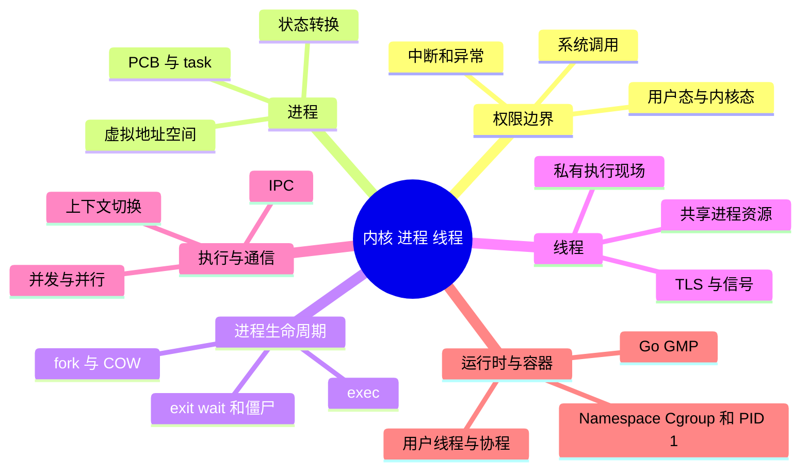
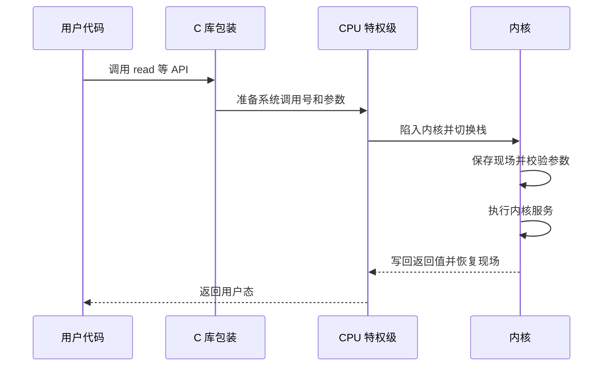
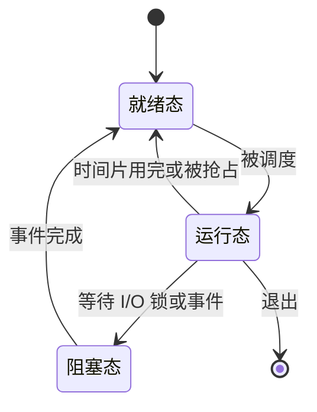

# 内核、系统调用、进程与线程（面试背诵版）

> **术语模式：单词直译 + 一句话结论 + 深层原理。**
>
> 先背结论，再沿着“内核保存什么、状态怎样变化、性能代价来自哪里”回答 408、Linux 和云原生面试追问。

## 本节知识地图



## 为什么应用不能直接操作硬件

若普通程序能修改页表、关闭中断或任意访问设备，一个错误就可能破坏整个系统。CPU 提供特权级，操作系统内核运行在高特权级，应用运行在受限用户态。

### 内核态不是一个进程

用户线程执行系统调用时，同一个线程可以暂时进入内核执行服务，再返回用户态。进入内核不等于切换到“内核进程”，也不一定发生进程上下文切换。

## 进入内核的三类原因

| 原因 | 谁触发 | 示例 |
|------|--------|------|
| 系统调用 | 应用主动 | read、write、open、socket |
| 异常 | 当前指令 | 缺页、除零、非法访问 |
| 外部中断 | 设备或定时器 | 网卡、磁盘完成、时钟 |

共同点是 CPU 转到内核入口并获得高特权；原因、处理流程和返回点不同。

## 系统调用流程

简化过程：



系统调用比普通函数调用多权限切换和内核处理，但不应机械背固定耗时。

## 什么是进程

进程是正在运行程序的资源与执行上下文集合，通常包含：

- 独立虚拟地址空间。
- 代码、数据、堆、栈映射。
- 打开的文件描述符。
- 权限、环境变量、当前目录。
- 一个或多个线程。
- 内核记录的调度和统计信息。

程序是磁盘上的静态文件，进程是运行中的实例。同一程序可以启动多个进程。

## 进程地址空间

概念布局：

```text
高地址
内核保留区域
线程栈（通常向下增长）
内存映射区：共享库、mmap
堆（通常向上增长）
BSS：未显式初始化全局变量
Data：已初始化全局变量
Text：代码和只读数据
低地址
```

实际布局会受 ASLR、平台、链接方式和运行时影响。

## 进程状态

常见抽象状态：

- Running：正在 CPU 上执行。
- Ready/Runnable：可以执行，等待 CPU。
- Blocked/Sleeping：等待 I/O、锁、定时器或事件。
- Stopped：被暂停。
- Zombie：已经退出，但父进程尚未回收退出状态。

“进程慢”可能是没有 CPU，也可能是在等待 I/O 或锁。

## 什么是线程

线程是调度执行流。一个进程内线程通常共享：

- 虚拟地址空间。
- 代码、全局变量和堆。
- 打开的文件。
- 进程级权限。

线程各自拥有：

- 程序计数器和寄存器现场。
- 用户栈和内核栈。
- 调度状态、线程局部存储。

共享让通信方便，也带来数据竞争。

## 进程与线程对比

| 维度 | 进程 | 同进程线程 |
|------|------|------------|
| 地址空间 | 默认隔离 | 共享 |
| 通信 | 管道、共享内存、Socket 等 | 可直接共享变量 |
| 故障影响 | 通常隔离更强 | 一个线程崩溃可能终止进程 |
| 创建与切换 | 通常更重 | 通常更轻，但不是零成本 |
| 同步 | IPC 协议 | 锁、原子、条件变量等 |

“线程切换一定不刷新 TLB、进程切换一定刷新”过于绝对，现代硬件有地址空间标识等优化。

## 上下文切换

调度器切换线程时，需要保存和恢复：

- 通用寄存器。
- 程序计数器和栈指针。
- 调度状态。
- 必要的地址空间与浮点/向量状态。

间接成本往往更大：

- Cache 和 TLB 工作集被扰动。
- 分支预测历史变化。
- 迁移到另一个核心导致缓存重新预热。

## fork 与 exec

Unix 中常见：

- fork：创建当前进程的子进程视图。
- exec：用新程序替换当前进程地址空间。

fork 通常结合 Copy-On-Write，不会立即复制全部物理内存；父子写入共享页时才复制。

```text
shell
  -> fork 子进程
  -> 子进程 exec 目标程序
  -> 父进程 wait 等待或继续
```

## 僵尸与孤儿

- 子进程退出后，内核保留少量退出信息，父进程未 wait 时是 zombie。
- 父进程先退出，子进程会被合适的 subreaper 或所在 PID Namespace 的 PID 1 接管，称 orphan。

僵尸不再执行，也不占完整地址空间，但会占进程表项。

## 协程与线程

协程通常由语言运行时或库在用户态调度，多个协程可复用少量内核线程。

优势：

- 创建和切换通常更轻。
- 适合大量 I/O 并发。

限制：

- 阻塞系统调用可能阻塞承载它的内核线程，除非运行时做非阻塞封装或线程池。
- CPU 密集仍需真实并行资源。
- 调度、公平和栈由运行时管理。

## 进程间通信

| 方式 | 特点 |
|------|------|
| 管道/FIFO | 字节流，常用于亲缘进程或命名通道 |
| 消息队列 | 消息边界明确，由内核维护 |
| 共享内存 | 数据复制少，但必须自己同步 |
| 信号 | 传递有限事件，不适合大量数据 |
| Socket | 可跨主机，也可本机通信 |

共享内存“快”不代表简单；一致性、生命周期和同步成本仍存在。

---

## 深入第一层：先建立完整知识地图

上面是快速复习版。下面按“定义 -> 内核对象 -> 状态变化 -> 性能代价 -> 工程场景”的顺序展开。

### 必须先背的 10 句话

1. **内核 Kernel** 是操作系统中拥有最高权限、统一管理硬件资源的核心软件。
2. **内核态 Kernel Mode** 是 CPU 的高特权状态，不是一个叫“内核”的进程。
3. **系统调用 System Call** 是用户程序主动请求内核服务的受控入口。
4. **进程 Process** 是程序的一次运行实例，是资源隔离和分配的基本单位。
5. **线程 Thread** 是进程内的执行流，是 CPU 调度的基本单位。
6. 同进程线程共享地址空间、堆和文件，独占寄存器、程序计数器、栈与 TLS。
7. 系统调用只保证进入内核，不保证发生线程上下文切换。
8. 线程切换通常比进程切换轻，但二者都不是零成本。
9. 并发是多个任务在一段时间内推进，并行是多个任务在同一时刻执行。
10. 容器内运行的仍是 Linux 进程和线程，只是资源视图与用量受到隔离和限制。

### 一条贯穿全章的主线

以线程执行 `read(fd, buf, 4096)` 为例：

```text
线程在用户态运行
  -> 调用 C 库 read 包装函数
  -> 执行系统调用陷入指令
  -> CPU 切到内核态
  -> 内核根据 fd 找到打开文件对象
  -> 数据在页缓存：复制数据并直接返回
  -> 数据不在：提交 I/O，线程进入阻塞状态
  -> 调度器切换到其他可运行线程
  -> 设备完成 I/O，通过中断通知内核
  -> 原线程从阻塞变为就绪
  -> 调度器再次选择原线程
  -> 系统调用返回，线程回到用户态
```

这条链路同时包含：

- 用户态与内核态。
- 系统调用。
- 线程状态转换。
- 上下文切换。
- 中断和 I/O。
- 调度与等待队列。

如果能不跳步地解释这条链路，本章核心就真正串起来了。

---

## 深入第二层：特权级、异常与系统调用

### 1. User Mode 与 Kernel Mode

**User Mode 直译**：用户模式、用户态。

**Kernel Mode 直译**：内核模式、内核态。

| 对比项 | 用户态 User Mode | 内核态 Kernel Mode |
|---|---|---|
| 执行代码 | 普通应用、部分语言运行时与库 | 内核、驱动、系统调用处理代码 |
| 权限 | 受限 | 高特权 |
| 特权指令 | 不能执行 | 可以执行 |
| 硬件访问 | 不能任意直接操作 | 可通过内核和驱动受控操作 |
| 地址访问 | 受当前进程页表与权限限制 | 可访问内核映射，并受控访问用户内存 |
| 故障范围 | 通常限制在当前进程 | 严重内核错误可能影响整个系统 |

CPU 提供特权级的根本目的不是“让内核跑得更快”，而是建立保护边界。

普通应用不能直接：

- 修改页表基址。
- 任意读写设备寄存器。
- 关闭全局中断。
- 改变其他进程的调度和内存。
- 访问任意物理地址。

### 2. 为什么内核态不是一个进程

这两个概念属于不同维度：

- 用户态/内核态：CPU 当前以什么权限执行。
- 进程/线程：当前是谁在执行，资源属于谁。

同一条线程可以经历：

```text
用户态执行应用代码
  -> 系统调用
  -> 内核态执行该线程的内核路径
  -> 系统调用返回
  -> 用户态继续执行
```

执行主体没有变，权限发生了变化。

Linux 也存在内核线程，但它表示由内核创建、主要执行内核工作的调度实体，不是“每次系统调用都切换到内核线程”。

### 3. Trap、Exception、Interrupt

不同教材对 trap 的用法略有差异，面试时先说本质：

- **System Call**：应用主动执行专用指令，请求内核服务。
- **Exception**：当前指令同步产生的事件。
- **Interrupt**：外部设备或定时器异步产生的事件。

| 事件 | 与当前指令是否同步 | 典型例子 | 能否继续原指令 |
|---|---|---|---|
| 系统调用 | 是，程序主动发起 | `read`、`write` | 服务完成后继续下一条 |
| 可恢复异常 | 是 | 合法缺页 | 处理后可重试原指令 |
| 不可恢复异常 | 是 | 非法地址、非法指令 | 通常转为信号并终止 |
| 外部中断 | 否 | 网卡、时钟 | 处理后恢复被打断位置 |

### 4. 缺页异常为什么不一定是错误

进程访问一个尚未建立物理页映射的合法虚拟地址时：

1. MMU 查页表发现映射不存在或权限不满足。
2. CPU 进入内核缺页处理程序。
3. 内核检查该地址是否属于合法内存区域。
4. 合法时分配零页、执行 COW，或从文件/Swap 调页。
5. 内核更新页表。
6. CPU 重试原访存指令。

只有地址不合法或权限不可修复时，进程才通常收到 `SIGSEGV`。

### 5. API、库函数和系统调用的区别

| 概念 | 含义 | 是否必然进入内核 |
|---|---|---|
| API | 给调用方使用的接口约定 | 否 |
| 库函数 | 用户态库提供的函数实现 | 否 |
| 系统调用 | 内核暴露的受控服务入口 | 是 |

典型例子：

- `strlen()` 通常只扫描用户态内存。
- `printf()` 先在用户态完成格式化和缓冲，必要时才调用 `write()`。
- `malloc()` 常先使用分配器已有内存，需要扩展地址空间时才调用 `brk()` 或 `mmap()`。
- `memcpy()` 通常不进入内核，即使复制的数据量很大。

### 6. 系统调用参数怎样传递

典型过程：

1. 用户代码调用库包装函数。
2. 包装函数按 ABI 把系统调用号和参数放到约定寄存器。
3. 执行体系结构规定的陷入指令。
4. CPU 切到内核入口和高特权级。
5. 内核从寄存器或用户内存读取参数。
6. 内核严格校验用户指针、长度、权限和对象状态。

不能信任用户指针，因为：

- 地址可能根本没有映射。
- 地址可能没有读写权限。
- 长度可能溢出。
- 另一个线程可能并发修改相关用户内存。
- 恶意程序可能故意构造参数攻击内核。

### 7. 系统调用为什么可能阻塞

内核无法立即满足请求时，当前线程可以等待：

- `read` 等待数据到达。
- `accept` 等待新连接。
- `futex` 等待锁状态变化。
- `wait` 等待子进程退出。
- `nanosleep` 等待定时器到期。

线程阻塞后不会继续占着 CPU 空转。内核把它从运行队列移到相应等待队列，再调度其他可运行线程。

### 8. 系统调用为什么不是固定成本

相同的 `read()` 可能走完全不同的路径：

```text
页缓存命中
  -> 较短内核路径

页缓存未命中
  -> 文件系统
  -> 块层
  -> 设备 I/O
  -> 阻塞与唤醒
  -> 一次或多次调度
```

耗时还受以下因素影响：

- CPU 架构与频率。
- 内核版本和安全缓解措施。
- 数据量与复制次数。
- 是否发生缺页。
- 锁竞争。
- 设备和网络延迟。
- 当前系统负载。

因此面试不要背“系统调用固定几百纳秒”之类绝对数字。

### 9. 高频问答：系统调用一定会切换进程吗

> 不一定。系统调用首先发生的是 CPU 特权级从用户态到内核态的转换，当前执行主体仍可能是原线程。如果服务能立即完成，内核可直接返回；只有线程阻塞、时间片耗尽、被抢占或调度器选择其他任务时，才会发生线程上下文切换。

---

## 深入第三层：进程究竟是什么

### 1. 术语、考试定义与工程定义

**Process 直译**：过程、进程。

**408 定义**：进程是程序的一次执行过程，是系统进行资源分配和保护的基本单位。

**工程定义**：进程是一个资源容器，包含地址空间、文件、权限、信号处理配置以及一条或多条线程。

“进程是资源分配的最小单位”适合考试，但工程上要知道资源粒度并不完全一致：

- CPU 时间直接调度给线程。
- 打开文件对象可以由父子进程共享。
- 物理页可以由共享内存映射给多个进程。
- 凭据、文件表等资源也可按系统接口选择共享。

### 2. 程序与进程

| 对比项 | 程序 Program | 进程 Process |
|---|---|---|
| 性质 | 静态指令和数据集合 | 动态运行实例 |
| 位置 | 磁盘或镜像文件系统 | 内存与内核对象 |
| 身份 | 路径、版本、哈希 | PID、父子关系、运行状态 |
| 状态 | 没有运行/阻塞状态 | 有创建、就绪、运行、阻塞、退出 |
| 数量 | 一个可执行文件 | 可有多个运行实例 |

一个程序可以启动多个进程。例如启动三个 Nginx Worker，它们可执行相同程序文件，但 PID、地址空间和运行状态不同。

### 3. PCB：Process Control Block

**直译**：进程控制块。

PCB 是教材对内核进程元数据的总称，典型信息包括：

- PID、父 PID、进程组和会话。
- 运行状态、优先级、CPU 时间。
- 地址空间和页表关联。
- 文件描述符与文件系统上下文。
- 用户身份、组身份和权限。
- 信号处置和待处理信号。
- 资源限制、统计与退出状态。

PCB 为什么存在：

1. 进程会被随时暂停。
2. CPU 之后还要恢复它。
3. 内核还要在进程不运行时管理其资源。
4. 所以这些状态必须保存在受保护的内核数据结构中。

### 4. Linux 中的 task_struct

Linux 以内核任务作为调度对象，常用 `task_struct` 描述。

理解要点：

- 单线程进程有一个主要任务。
- 多线程进程包含多个可调度任务。
- 这些任务可共享同一个内存描述、文件表和信号处理对象。
- Linux 用户工具通常用 TGID 表示进程视角的 PID，用 TID 区分线程。

因此“Linux 内核只调度进程”不准确；现代 Linux 调度的是任务，用户态看到的线程有各自可调度身份。

### 5. 进程拥有什么

进程级资源通常包括：

- 虚拟地址空间。
- 代码、全局数据和堆。
- 内存映射区域。
- 文件描述符表。
- 当前工作目录和根目录。
- 环境变量。
- 用户与组身份。
- 进程级信号处置。
- 定时器和资源限制。
- 一条或多条线程。

### 6. 进程隔离不是绝对互不影响

“一个进程崩溃一般不直接破坏另一个进程地址空间”是正确的。

“一个进程崩溃绝不影响其他进程”是错误的，因为：

- 它可能是其他进程依赖的服务。
- 它可能持有共享文件锁。
- 它可能写坏共享内存或数据库。
- 它可能占满宿主机 CPU 或内存。
- OOM、内核错误或设备故障可能影响多个进程。

准确说法：

> 进程提供默认地址空间和权限隔离，所以故障隔离通常强于同进程线程；但共享资源、依赖关系和宿主机资源竞争仍会传播影响。

### 7. PID、PPID、进程组与会话

- **PID**：进程标识。
- **PPID**：父进程标识。
- **Process Group**：进程组，Shell 用它管理一条管道中的作业。
- **Session**：会话，可包含多个进程组。

终端发送 `Ctrl+C` 时，通常不是只给某一个进程发信号，而是向前台进程组发送 `SIGINT`。这也是进程组存在的重要工程场景。

---

## 深入第四层：虚拟地址空间

### 1. 概念布局

```text
高地址
+--------------------------------+
| 内核保留区域                   | 用户态不可直接访问
+--------------------------------+
| 线程栈                         | 通常向低地址增长
+--------------------------------+
| mmap 区域 / 动态库 / 映射文件  |
+--------------------------------+
| 堆 Heap                        | 通常向高地址增长
+--------------------------------+
| BSS：未显式初始化的全局数据    |
+--------------------------------+
| Data：已初始化的全局数据       |
+--------------------------------+
| Text：机器指令和只读数据        |
+--------------------------------+
低地址
```

这只是概念图，实际布局受以下因素影响：

- CPU 架构和地址宽度。
- ASLR。
- 静态或动态链接。
- PIE。
- 线程数量与栈大小。
- 语言运行时和垃圾回收器。
- `mmap` 分配策略。

### 2. Text、Data、BSS

**Text：**

- 主要保存机器指令和只读常量。
- 通常可执行、不可写。
- 同一程序的多个进程可共享只读物理页。

**Data：**

- 保存已显式初始化的全局变量和静态变量。
- 例如 `int count = 10;`。

**BSS：**

- 保存未显式初始化或初始化为零的全局/静态变量。
- 可执行文件只需记录大小，不必存储大量零字节。

### 3. Heap 与 Stack

**Heap：**

- 用于动态分配对象。
- `malloc/new` 常从堆或匿名映射中取得内存。
- 同进程线程共享堆。
- 共享堆对象可能需要同步。

**Stack：**

- 保存函数调用帧、返回地址和部分局部变量。
- 每条线程有自己的用户栈。
- 每条线程进入内核时也需要相应内核栈。
- 栈逻辑上线程私有，但物理访问仍受同一进程页表控制。

### 4. 虚拟地址如何隔离

不同进程的相同虚拟地址可指向不同物理页：

```text
进程 A：虚拟地址 0x1000 -> 物理页 X
进程 B：虚拟地址 0x1000 -> 物理页 Y
```

显式共享时，不同虚拟地址也可指向同一物理页：

```text
进程 A：虚拟地址 0x3000 -> 物理页 Z
进程 B：虚拟地址 0x9000 -> 物理页 Z
```

因此：

- 虚拟地址相同不代表物理内存相同。
- 虚拟地址不同也不代表物理内存一定不同。
- 页表映射和权限才决定实际访问关系。

### 5. 独立地址空间不等于物理页全部独占

可能共享物理页的场景：

- 共享库只读代码。
- `fork` 后尚未修改的 COW 页。
- POSIX/System V 共享内存。
- 映射同一文件的共享页。
- 内核对相同只读页的去重。

进程隔离的关键是不能越权修改，而不是物理页永远不能复用。

### 6. 分配虚拟内存不等于立刻分配物理内存

按需分页的典型步骤：

1. 分配器或内核先保留虚拟地址范围。
2. 第一次访问某页时产生缺页异常。
3. 内核检查访问是否合法。
4. 合法时分配零页，或从文件/Swap 调入。
5. 更新页表并重试指令。

所以进程的虚拟内存大小、常驻物理内存和实际活跃工作集是三个不同概念。

---

## 深入第五层：进程状态机

### 1. 408 三状态模型

| 状态 | 英文 | 核心判断 |
|---|---|---|
| 运行态 | Running | 正在某个 CPU 上执行 |
| 就绪态 | Ready | 什么都不缺，只等 CPU |
| 阻塞态 | Blocked / Waiting | 还在等 I/O、锁或事件 |



### 2. 四条核心转换

**就绪 -> 运行：**

调度器从运行队列选择任务并分配 CPU。

**运行 -> 就绪：**

- 时间片用完。
- 更高优先级任务就绪。
- 当前任务主动让出 CPU。
- 负载均衡导致迁移。

**运行 -> 阻塞：**

- 等待磁盘或网络。
- 等待锁和条件变量。
- 等待子进程。
- 等待定时器。

**阻塞 -> 就绪：**

事件完成后重新获得运行资格，进入运行队列等待 CPU。

### 3. 为什么阻塞不能直接变运行

事件完成只解决了“等待条件”，没有保证 CPU 正空闲，也没有绕过调度规则。

例如磁盘中断唤醒 20 个线程：

- 20 个线程都可以变为就绪。
- CPU 核数可能只有 4 个。
- 调度器仍必须选择其中哪些先运行。

### 4. 五状态模型

在三状态上增加：

- **New 创建态**：正在建立进程和资源。
- **Terminated 终止态**：执行结束，系统正在完成退出处理。

### 5. 七状态模型

再增加：

- **Ready Suspended 就绪挂起**：具备运行条件，但主体被换出。
- **Blocked Suspended 阻塞挂起**：既等待事件，又被换出。

阻塞挂起进程的事件完成后可变为就绪挂起；它仍需换入，才能进入普通就绪态。

七状态模型适合 408 推演。现代 Linux 常以页面为粒度回收内存，不要机械理解成每次都把完整进程搬到磁盘。

### 6. Linux 常见状态

| 状态码 | 名称 | 含义 |
|---|---|---|
| `R` | Running/Runnable | 正在运行或处在运行队列 |
| `S` | Interruptible Sleep | 可被信号唤醒的睡眠 |
| `D` | Uninterruptible Sleep | 某段不可中断内核等待 |
| `T`/`t` | Stopped/Traced | 停止或被调试 |
| `Z` | Zombie | 已退出但尚未回收 |

### 7. R 不等于此刻一定占用 CPU

Linux 的 `R` 把 running 和 runnable 放在一起：

- 可能正运行在某个 CPU 上。
- 也可能只是在运行队列等 CPU。

所以看到很多 `R` 且 CPU 饱和时，应进一步看：

- 运行队列长度。
- CPU 核数与配额。
- 每线程 CPU 占用。
- 是否受 Cgroup CPU throttling。

### 8. D 状态不等于磁盘一定坏了

`D` 表示任务位于不可中断睡眠，常见于必须把某段内核操作完成到安全点再响应普通信号。

排查信息：

- `/proc/<pid>/wchan` 看等待位置。
- 内核栈看调用路径。
- `iostat` 看块设备。
- 网络文件系统指标。
- `dmesg` 或内核日志看驱动错误。

---

## 深入第六层：fork、exec、exit、wait

### 1. fork：分叉

调用 `fork()` 成功后：

- 父子进程都从调用点后继续。
- 父进程得到子进程 PID。
- 子进程得到 0。
- 两者调度先后没有固定保证。

```c
pid_t pid = fork();

if (pid == 0) {
    // child
} else if (pid > 0) {
    // parent
} else {
    // error
}
```

### 2. fork 后相同与不同

父子最初看到近似相同的：

- 内存内容。
- 环境变量。
- 当前目录。
- 信号处理配置。
- 文件描述符。

它们不同的是：

- PID。
- 父子身份。
- 返回值。
- 地址空间逻辑身份。
- 后续普通内存修改。
- CPU 调度时序。

### 3. Copy-On-Write

**COW 直译**：写时复制。

```text
fork 刚完成：
父页表 ----\
            >---- 物理页 A
子页表 ----/

子进程写入：
父页表 --------- 物理页 A
子页表 --------- 物理页 B（复制页）
```

执行步骤：

1. 父子暂时共享物理页。
2. 页表把相关页标记为 COW。
3. 只读访问继续共享。
4. 某一方写入时触发保护性缺页。
5. 内核复制目标页。
6. 写入方改为映射新页。
7. 原指令重试并完成写入。

### 4. fork 为什么仍可能较重

COW 延迟的是数据页复制，不代表没有成本：

- 创建任务结构。
- 分配 PID 和调度状态。
- 建立页表元数据。
- 复制或引用文件、信号等资源描述。
- 大进程的页表处理本身可能昂贵。
- 后续大量写入会产生 COW 复制。

### 5. fork 后文件描述符

父子拥有各自的描述符表视图，但对应项通常引用相同内核打开文件对象。

因此可能共享：

- 当前文件偏移。
- 某些状态标志。
- 底层 Socket 或管道端点。

父子关闭各自描述符会减少引用计数；通常所有引用都关闭后，内核对象才真正释放。

### 6. 多线程程序 fork 的陷阱

多线程进程中调用 `fork()`：

- 子进程通常只保留调用 `fork` 的线程。
- 其他线程不会在子进程继续运行。
- 但其他线程在 `fork` 前可能持有用户态锁。
- 子进程可能继承“已加锁”的内存状态，却没有原持有线程解锁。

因此子进程在 `fork` 后、`exec` 前可安全调用的接口受到严格限制。工程中应优先使用运行时或系统提供的安全进程创建方式。

### 7. exec：执行并替换

`exec` 的核心不是创建，而是替换：

- 新程序替换当前进程的代码、数据、堆和栈。
- PID 通常保持不变。
- 允许继承的文件描述符继续存在。
- 标记 `close-on-exec` 的描述符被关闭。
- 成功后不会回到原调用点。

### 8. 为什么 Shell 使用 fork + exec

Shell 必须保留自己继续接收命令，同时让子进程运行目标程序：

```text
Shell 解析命令
  -> fork
  -> 子进程连接管道、设置重定向
  -> 子进程 exec
  -> 父进程 wait 或继续后台作业
```

### 9. exit 的资源处理

进程退出时：

1. 结束执行线程。
2. 释放地址空间。
3. 关闭文件描述符并减少内核对象引用。
4. 保存退出码、终止信号和少量统计。
5. 通知父进程。
6. 等待父进程回收退出状态。

用户态库函数 `exit()` 还可能刷新标准 I/O 缓冲区；底层立即退出接口的行为不同。面试重点是“大部分资源先释放，退出状态暂时保留”。

### 10. wait 为什么必要

父进程通过 `wait()`/`waitpid()`：

- 得知哪个子进程退出。
- 获取退出码或终止信号。
- 回收残留进程表项。
- 控制是否阻塞等待。

没有 wait，父进程无法可靠得知子任务结果，内核也不能立刻丢弃所有退出信息。

### 11. 一条完整命令的生命周期

```text
用户输入命令
  -> Shell 解析参数、管道和重定向
  -> fork 子进程
  -> 子进程调整文件描述符
  -> exec 目标程序
  -> 程序运行并退出
  -> 内核保留退出状态
  -> Shell wait 回收
  -> Shell 获得退出码并显示提示符
```

---

## 深入第七层：僵尸、孤儿与守护进程

### 1. Zombie Process

**直译**：僵尸进程。

子进程已经退出，父进程尚未读取退出状态：

- 不再执行任何用户代码。
- 普通地址空间已释放。
- 打开的文件通常已关闭。
- 仍保留 PID、退出原因和统计信息。
- `ps` 中通常显示 `Z`。

### 2. 为什么僵尸不能再 kill

僵尸已经死亡，没有代码可以响应信号。发送 `SIGKILL` 不能让内核跳过父进程的状态读取职责。

处理思路：

1. 找到父进程。
2. 检查父进程是否正确处理 `SIGCHLD`。
3. 让父进程执行 wait。
4. 修复父进程回收逻辑。
5. 必要时终止或重启父进程，让子进程被其他收割者接管。

### 3. 僵尸到底占什么

僵尸不占完整用户内存，但仍占：

- 一个 PID。
- 进程表中的少量记录。
- 退出状态和资源统计。

短暂几个僵尸通常不造成明显内存压力；长期大量僵尸可能耗尽 PID 或任务数量限制，使新进程/线程创建失败。

### 4. Orphan Process

**直译**：孤儿进程。

父进程先退出，子进程仍活着。Linux 会把它重新指定给合适的 subreaper；没有中间 subreaper 时，通常最终由当前 PID Namespace 的 PID 1 接管。

孤儿仍会被调度，也仍占用普通资源。它和僵尸的状态完全不同。

### 5. Daemon Process

**直译**：守护进程、后台服务进程。

传统 daemon 通常：

- 长期运行。
- 不依赖交互终端。
- 创建新会话。
- 设置工作目录和权限掩码。
- 重定向标准输入输出。

现代服务常由 systemd 或容器运行时在前台托管，不必再执行传统双重 fork。守护进程是运行方式，孤儿是父子关系状态，二者不能画等号。

### 6. 三者对比

| 概念 | 是否仍运行 | 关键原因 | 谁负责处理 |
|---|---|---|---|
| 僵尸 | 否 | 父进程未 wait | 父进程或后续收割者 |
| 孤儿 | 是 | 父进程先退出 | subreaper / PID 1 接管 |
| 守护进程 | 是 | 设计为后台长期服务 | 服务管理器或自身 |

---

## 深入第八层：线程的共享与私有边界

### 1. Thread 的准确含义

**Thread 直译**：线程、线索。

**408 定义**：线程是进程内的一个执行单元，是 CPU 调度的基本单位。

**工程定义**：线程是一组可以独立调度的执行现场，它依附进程资源运行。

进程与线程的核心关系：

```text
一个进程
  ├── 一份地址空间
  ├── 一组文件描述符
  ├── 一组权限和信号配置
  ├── 线程 1：PC + 寄存器 + 栈
  ├── 线程 2：PC + 寄存器 + 栈
  └── 线程 3：PC + 寄存器 + 栈
```

一个进程至少要有一条线程，因为代码必须有程序计数器、寄存器和栈才能真正执行。

### 2. 共享资源完整表

同一进程的线程通常共享：

| 资源 | 共享原因 | 直接后果 |
|---|---|---|
| 虚拟地址空间 | 属于进程内存视图 | 可用普通指针访问同一对象 |
| 代码段 | 运行同一程序 | 多线程可执行同一函数 |
| 全局/静态变量 | 位于 Data/BSS | 并发写需要同步 |
| 堆 | 位于共享地址空间 | 对象传递方便，但会竞态 |
| mmap 映射 | 属于进程地址空间 | 共享库和映射文件都可见 |
| 文件描述符表 | 通常是进程级资源 | close、偏移和 Socket 状态可能互相影响 |
| 当前目录与根目录 | 文件系统上下文共享 | 一个线程修改可能影响其他线程 |
| 进程级凭据 | 同属一个进程 | 权限边界通常一致 |
| 信号处置方式 | POSIX 动作通常进程级 | 同一信号处理函数对全进程生效 |

### 3. 私有执行现场完整表

每条线程通常独立拥有：

| 资源 | 为什么必须独立 |
|---|---|
| 程序计数器 PC | 每条线程执行位置不同 |
| 通用寄存器 | 当前计算中间值不同 |
| 栈指针 SP | 各自调用栈位置不同 |
| 用户栈 | 各自函数调用帧不同 |
| 内核栈 | 各自在内核中的调用现场不同 |
| 调度状态 | 每条线程独立运行、阻塞和唤醒 |
| 优先级/亲和性等属性 | 调度器可区别对待线程 |
| TLS | 每线程变量副本 |
| 信号屏蔽字 | 每条线程可屏蔽不同信号 |
| 线程定向待处理信号 | 某些信号指定线程接收 |

### 4. 栈“私有”为什么不是内存隔离

线程 A 和线程 B 使用同一套页表。所谓每线程栈私有，是调用约定和运行时管理意义上的私有：

- A 的 SP 指向 A 的栈。
- B 的 SP 指向 B 的栈。
- 正常函数调用各自压入自己的栈。

但如果 A 获得 B 某个局部变量的地址，A 通常仍能访问。线程栈之间没有进程页表级硬隔离。

所以错误指针可能：

- 覆盖另一个线程的局部变量。
- 破坏另一个线程返回地址。
- 导致整个进程稍后在不相关位置崩溃。

### 5. 函数局部变量一定线程安全吗

不一定。

通常安全的情况：

- 变量只存在当前线程栈上。
- 地址没有逃逸给其他线程。
- 变量引用的对象也不共享。

可能不安全的情况：

- 把局部变量地址传给其他线程。
- 局部变量是指向共享堆对象的指针。
- 闭包捕获变量并被多个线程执行。
- 使用静态局部变量。
- 调用的函数内部访问共享状态。

判断标准不是“变量写在哪里”，而是“同一份可变状态是否被多个执行流并发访问”。

### 6. TLS：Thread-Local Storage

**直译**：线程局部存储。

同一个 TLS 变量在每条线程上有独立副本，常用于：

- 线程专属错误码。
- 线程本地缓存。
- 日志追踪上下文。
- 语言运行时线程状态。

优点：

- 访问当前线程数据方便。
- 避免简单状态的共享锁。

代价：

- 线程越多，副本总内存越大。
- 数据汇总更复杂。
- 生命周期管理不当可能泄漏资源。
- 任务在不同线程迁移时，线程本地数据未必等于任务本地数据。

### 7. 文件描述符共享为何危险

同进程线程共享描述符表，因此：

- 线程 A `close(fd)` 后，线程 B 使用该 fd 可能失败。
- fd 编号可被快速复用，B 可能误操作新打开的对象。
- 多线程读取同一打开文件对象时可能共享文件偏移。
- 一个线程关闭或半关闭 Socket 会影响其他线程。

常用工程策略：

- 明确描述符所有权。
- 使用引用计数或统一连接管理层。
- 避免“一个线程随时 close，其他线程随便用”。
- 需要独立偏移时使用合适接口或独立打开文件。

### 8. 线程生命周期

创建线程通常需要：

- 分配线程控制结构。
- 准备用户栈和内核栈。
- 初始化 TLS。
- 创建或登记内核调度实体。
- 把新线程加入可运行队列。

线程可能经历：

```text
创建 -> 就绪 -> 运行 -> 等待 -> 就绪 -> 退出
```

状态模型与进程相似，因为现代内核真正调度的是线程级任务。

### 9. join 与 detach

**join：**

- 等待目标线程结束。
- 获取线程返回结果。
- 回收与该线程退出相关的资源。

**detach：**

- 线程退出后由实现自动回收线程资源。
- 其他线程不再 join 它。

Joinable/detached 描述资源回收方式，不表示线程是不是“后台线程”。

### 10. 线程退出与进程退出

| 操作或事件 | 常见结果 |
|---|---|
| 线程函数返回 | 当前线程结束 |
| `pthread_exit()` | 当前线程结束 |
| 主线程调用 `pthread_exit()` | 其他线程可继续 |
| 任意线程调用进程级 `exit()` | 整个进程结束 |
| `main` 返回 | 通常触发进程级退出 |
| 默认终止动作的致命信号 | 通常整个线程组结束 |

### 11. 一个线程崩溃为什么常拖垮进程

以非法访存为例：

```text
某线程访问非法地址
  -> CPU 产生同步异常
  -> 内核无法修复
  -> 向故障线程递送 SIGSEGV
  -> 查询进程共享的信号处置
  -> 默认动作终止整个线程组
  -> 进程退出
```

不能说“任何线程异常都必然杀进程”：

- 普通语言异常可能被捕获。
- 线程正常返回只结束自身。
- 某些信号可注册处理器。
- 不同语言运行时对未捕获异常处理不同。

即使捕获严重内存错误，继续运行通常也不可靠，因为共享堆可能已经损坏。

### 12. 线程模型

| 模型 | 映射关系 | 优势 | 局限 |
|---|---|---|---|
| N:1 | 多个用户线程映射一个内核线程 | 用户态切换轻 | 一个阻塞可能拖住全部，不能多核并行 |
| 1:1 | 一个用户线程对应一个内核线程 | 可并行，内核直接调度 | 内核对象和栈开销较多 |
| M:N | M 个用户执行单元复用 N 个内核线程 | 兼顾规模和并行 | 运行时调度复杂 |

现代 Linux POSIX 线程通常按 1:1 模型实现。goroutine 等轻量执行单元通常采用 M:N 思路。

---

## 深入第九层：上下文切换到底保存什么

### 1. Context 的含义

**Context 直译**：上下文、环境。

线程被暂停后还要从原位置继续，因此必须保留：

- 程序计数器。
- 栈指针。
- 通用寄存器。
- 必要的浮点/向量寄存器。
- CPU 标志和架构相关状态。
- 调度状态。
- 恢复内核执行所需的信息。

### 2. 不会每次复制全部内存和文件

常见错误说法：

> 进程切换时要把整个进程的内存、文件和页表保存起来。

正确理解：

- 地址空间和内存映射本来就由内核对象持续描述。
- 打开文件也由文件表和内核对象持续保存。
- 切换时不复制全部内存，不重新写一份所有文件状态。
- 调度器主要保存 CPU 执行现场。
- 跨进程时还要切换当前地址空间关联。

### 3. 同进程线程切换

```text
线程 A 运行
  -> 保存 A 的 PC、SP、寄存器等
  -> 调度器选择线程 B
  -> 恢复 B 的 PC、SP、寄存器等
  -> 继续使用同一地址空间
```

因为 A 和 B 共享页表，通常不需更换地址空间身份。

### 4. 跨进程线程切换

```text
进程 A 的线程运行
  -> 保存线程现场
  -> 调度器选择进程 B 的线程
  -> 切换地址空间关联
  -> 恢复 B 线程现场
  -> 执行 B
```

除了直接切换动作，还可能带来：

- TLB 工作集变化。
- L1/L2/L3 Cache 工作集变化。
- 分支预测历史变化。
- NUMA 访问位置变化。

### 5. TLB 是否一定全部刷新

旧式简化答案是“换页表就刷新 TLB”。

现代 CPU 常提供：

- **ASID**：Address Space Identifier。
- **PCID**：Process-Context Identifier。

TLB 项带地址空间标签后，不同进程的翻译可以同时保留。因此进程切换不必每次清空整个 TLB。

正确面试表达：

> 跨进程切换通常需要更换地址空间，并带来更多 TLB 和 Cache 扰动；现代 ASID/PCID 能减少完整刷新，但不能消除工作集变化的成本。

### 6. 直接成本

- 进入调度器。
- 更新任务状态和运行队列。
- 保存旧线程寄存器。
- 恢复新线程寄存器。
- 必要时切换地址空间。
- 处理调度统计和安全状态。

### 7. 间接成本

- 新线程热点数据不在 Cache。
- 原线程数据被其他任务挤出。
- TLB 命中率下降。
- 分支预测器需要重新适应。
- 跨核迁移导致私有缓存重新预热。

实际场景中，间接成本常比“保存几个寄存器”更值得关注。

### 8. 主动与非主动上下文切换

**Voluntary context switch：**

- 当前线程主动等待。
- 例如等待 I/O、锁、条件变量或定时器。

**Nonvoluntary context switch：**

- 当前线程被调度器抢占。
- 例如时间片用完，或更高优先级任务运行。

Linux 可从 `/proc/<pid>/status` 观察相关累计值。

### 9. 上下文切换多一定有问题吗

不一定：

- I/O 并发服务自然会频繁睡眠和唤醒。
- 线程池执行许多短任务也会产生切换。
- 低延迟系统对切换更敏感。
- CPU 密集程序切换很多可能说明线程过量。

判断时必须结合：

- 吞吐和尾延迟。
- CPU 利用率。
- 运行队列长度。
- 每核负载。
- 锁等待和 I/O 等待。
- Cgroup CPU 配额和节流。

### 10. 背诵答案

> 线程和进程切换都要保存、恢复寄存器、程序计数器和栈指针等执行现场。同一进程线程共享虚拟地址空间，通常不用切换页表和地址空间身份，TLB 与 Cache 工作集更容易保留。跨进程切换还涉及地址空间变化和更大缓存扰动，所以通常更重；但现代 CPU 有 ASID/PCID，不能说每次都完整清空 TLB。

---

## 深入第十层：并发、并行与任务类型

### 1. Concurrency

**直译**：并发、共同发生。

多个任务在一段时间窗口内都取得进展。单核通过快速交替也能并发：

```text
时间 ------>
单核：A A | B | A | B B | A
```

### 2. Parallelism

**直译**：并行、平行执行。

多个任务在同一时刻分别占用不同核心：

```text
时间 ------>
核心 0：A A A A
核心 1：B B B B
```

### 3. 多线程不保证并行

要真正并行，需要同时满足：

- 至少两个可用逻辑 CPU。
- 至少两条可运行线程。
- 工作本身可以拆分。
- 没有被同一把锁完全串行化。
- 语言运行时允许相应代码并行。
- 容器 CPU 配额没有把有效并行度压到很低。

### 4. CPU 密集

特征：

- 大部分时间执行计算。
- 很少等待外部 I/O。
- 性能受 CPU 核、指令效率、缓存和内存带宽约束。

优化方向：

- 拆分可并行工作。
- 控制工作线程数接近有效 CPU 并行度。
- 降低锁竞争和共享写。
- 改善数据局部性。
- 避免过量线程造成调度开销。

### 5. I/O 密集

特征：

- 大量时间等待网络、磁盘、数据库。
- 单个任务 CPU 使用不高。
- 同时处理更多请求可掩盖等待时间。

可选模型：

- 每连接/请求一个线程。
- 固定线程池。
- 非阻塞 I/O + 事件循环。
- 协程 + 运行时网络轮询。

模型选择取决于语言生态、连接数、业务逻辑和可维护性，不是“协程永远优于线程”。

### 6. 同步/异步与阻塞/非阻塞

这是两组不同维度：

**同步/异步：**

- 关注结果由谁、以何种方式交付。
- 同步调用通常沿当前调用链取得结果。
- 异步调用可通过回调、Future、事件等通知完成。

**阻塞/非阻塞：**

- 关注调用不能立刻完成时，当前线程是否停下等待。
- 阻塞调用会让当前线程等待。
- 非阻塞调用立即返回当前可得结果或未就绪状态。

不要建立错误等式：

```text
异步 != 多线程
异步 != 并行
非阻塞 != 一定更快
并发 != 并行
```

### 7. 多线程的优势

- 共享数据直接，适合同进程协作。
- 同进程切换通常较轻。
- I/O 等待时其他线程可以推进。
- 多核上可执行 CPU 并行。
- 可复用进程级缓存和连接。

### 8. 多线程的代价

- 竞态条件。
- 内存可见性和顺序问题。
- 锁竞争与死锁。
- 伪共享与缓存行争用。
- 线程栈内存。
- 调度和跨核迁移。
- 故障隔离弱。

### 9. 多进程的优势

- 地址空间隔离。
- 可独立重启和升级。
- 资源限制边界清楚。
- 可隔离不可信任务。
- 适合 Worker 和多副本服务。

### 10. 多进程的代价

- IPC 接口更复杂。
- 可能需要序列化和复制。
- 独立运行时与缓存重复占用内存。
- 创建和跨进程切换通常更重。
- 跨进程一致性仍需协议保证。

### 11. 场景选择

| 场景 | 常见选择 | 主要理由 |
|---|---|---|
| 高隔离插件执行 | 多进程/沙箱 | 限制故障和权限 |
| Web 请求处理 | 线程池、协程、事件循环或混合 | 大量 I/O 等待 |
| CPU 批处理 | 有界线程池/多进程 | 利用多核，限制过量并发 |
| 浏览器标签页/渲染器 | 多进程为主 | 安全和故障隔离 |
| 共享巨大内存索引 | 多线程或共享内存进程 | 避免重复数据 |
| Nginx Worker | 多进程 + 事件驱动 | 隔离与高 I/O 并发 |

---

## 深入第十一层：IPC 逐项拆解

### 1. IPC 为什么存在

进程地址空间默认隔离：

```text
进程 A 的普通指针
  X 不能直接指向进程 B 的普通堆对象
```

要交换数据，必须：

- 让内核在两者间搬运或转发数据。
- 或让内核建立双方都能访问的共享映射。

### 2. 匿名管道 Pipe

**直译**：管道。

特点：

- 内核维护的字节流缓冲区。
- 通常单向使用。
- 没有天然消息边界。
- 常通过 `fork` 继承端点。
- Shell 的 `a | b` 是经典场景。

```text
进程 A stdout -> 管道写端 -> 内核缓冲区 -> 管道读端 -> 进程 B stdin
```

需要注意：

- 读端不按写入调用次数自动分消息。
- 管道容量有限，写满可能阻塞。
- 所有写端关闭后，读端才读到 EOF。
- 不用的端点若未关闭，可能导致读者一直等不到 EOF。

### 3. 命名管道 FIFO

FIFO 在文件系统中有名字：

- 无亲缘关系进程也可按路径打开。
- 数据仍经过管道机制，不是普通磁盘文件内容。
- 仍是字节流。
- 打开读写端的时机需要协调。

### 4. 消息队列

消息队列保留消息边界，适合：

- 按消息发送命令或事件。
- 生产者与消费者解耦。
- 需要类型或优先级的本机消息。

代价与风险：

- 内核队列容量有限。
- 可能发生用户态/内核态复制。
- 必须定义满队列策略。
- 进程崩溃后的消息生命周期要明确。

### 5. 共享内存

多个进程把同一物理页映射进各自地址空间：

```text
进程 A 虚拟地址 ----\
                     >---- 同一物理页
进程 B 虚拟地址 ----/
```

优势：

- 建立后可直接读写。
- 大数据交换可减少反复复制。
- 数据结构可留在共享区域。

难点：

- 必须同步。
- 指针和地址布局要谨慎。
- 要处理进程崩溃时的锁与状态恢复。
- 要定义初始化、版本和销毁协议。
- CPU 缓存一致不等于高级数据结构自动线程安全。

### 6. 为什么共享内存常被称为最快 IPC

常见传输路径中，它避免了每次消息都通过内核缓冲区中转复制。但这只是数据路径优势。

总成本还包括：

- 建立映射。
- 同步。
- Cache line 争用。
- 内存屏障。
- 序列化布局。
- 错误恢复。

小消息或低频通信时，复杂共享内存不一定比 Socket 更值得。

### 7. 信号量 Semaphore

**直译**：信号量。

它维护计数，用于表示可用资源数量：

- P/wait：尝试减少计数，不可用时等待。
- V/post：增加计数，并可能唤醒等待者。

典型用途：

- 二值信号量表达互斥。
- 计数信号量限制并发资源数。
- 共享内存读写双方同步。

408 常把信号量列为 IPC 机制。严格说它主要传递同步状态，不适合承载普通业务数据。

### 8. Signal

**直译**：信号。

适合传递有限控制事件：

- `SIGTERM` 请求优雅终止。
- `SIGKILL` 强制终止，不能捕获或忽略。
- `SIGHUP` 常用于重新加载配置。
- `SIGCHLD` 通知子进程状态变化。
- `SIGINT` 常来自终端 `Ctrl+C`。

信号不适合传输大量业务数据。普通信号还可能合并，不能把每次发送都当可靠消息计数。

### 9. Socket

Socket 可以：

- 同机进程通信。
- 跨主机通信。
- 使用字节流或数据报语义。
- 与事件驱动 I/O 结合。

**Unix Domain Socket：**

- 只在本机。
- 不经过完整 IP 网络路径。
- 可传递凭据和文件描述符。

**TCP Socket：**

- 面向连接的可靠字节流。
- 没有业务消息边界。
- 应用必须自己设计 framing。

**UDP Socket：**

- 数据报语义。
- 不保证可靠、顺序和唯一到达。
- 应用按需求处理丢包、乱序和重复。

### 10. 文件与 mmap

进程也可以通过普通文件交换数据：

- 简单、可持久化。
- 适合批处理。
- 需要处理锁、原子替换和并发写。

映射文件允许多个进程通过内存访问文件页，但可见性、刷盘和一致性语义仍要按接口规则处理。

### 11. IPC 选择表

| 需求 | 优先考虑 | 原因 |
|---|---|---|
| Shell 串联命令 | Pipe | 字节流和 fd 继承自然 |
| 无亲缘本机简单流 | FIFO / Unix Socket | 可按名字连接 |
| 本机大块高频数据 | 共享内存 | 减少重复复制 |
| 本机双向请求响应 | Unix Domain Socket | 接口通用、边界清楚 |
| 跨机器通信 | TCP/UDP Socket | 网络可达 |
| 发送控制事件 | Signal | 轻量通知 |
| 共享资源计数 | Semaphore | 同步语义 |

### 12. IPC 背诵答案

> 常见 IPC 有匿名管道、命名管道、消息队列、共享内存、Socket、信号和文件映射。共享内存适合本机大量数据交换，建立映射后减少反复内核复制，但必须额外同步；Socket 接口通用且可以跨主机；信号适合控制事件，不适合大数据；信号量主要负责同步和资源计数。

---

## 深入第十二层：信号与多线程

### 1. 信号的两层状态

多线程进程中要区分：

- 信号处理动作通常是进程共享的。
- 每条线程有自己的信号屏蔽字。
- 信号可能面向整个进程。
- 信号也可能定向到特定线程。

所以“信号完全属于进程”过于粗略，“信号完全属于线程”也不对。

### 2. 同步信号

由当前线程执行引起：

- `SIGSEGV`：非法内存访问。
- `SIGFPE`：某些算术异常。
- `SIGILL`：非法指令。
- `SIGBUS`：某些总线或映射错误。

同步信号通常递送给造成问题的线程。

### 3. 异步信号

来自外部事件：

- 其他进程调用 `kill`。
- 终端发送 `SIGINT`。
- 子进程状态变化产生 `SIGCHLD`。
- 定时器到期。

面向进程的异步信号可由满足条件的某条线程接收，具体选择受信号屏蔽和实现规则影响。

### 4. 信号处理函数为什么受限

信号可能在程序执行任意位置打断当前线程。处理函数中调用非异步信号安全函数可能：

- 再次进入已经持锁的库函数。
- 破坏全局状态。
- 导致死锁或未定义行为。

常见工程做法是让处理函数只记录标志或写入安全通知通道，再由正常控制流完成复杂处理。

### 5. 容器停止与信号

容器编排系统停止工作负载时通常先请求优雅终止，随后在宽限期结束后强制终止。

应用应做到：

- PID 1 能收到停止信号。
- 将信号传给真正业务进程。
- 停止接收新请求。
- 等待在途请求和后台线程退出。
- 在超时前主动退出。

Shell 包装脚本若不使用 `exec` 或不转发信号，会让业务进程收不到预期终止通知。

---

## 深入第十三层：协程与 Go GMP

### 1. Kernel Thread 的两种语境

“内核线程”可能表示：

1. 由内核直接识别和调度的线程。
2. 只执行内核工作的 Linux kthread。

讨论“用户线程 vs 内核线程”时通常指第一种。面试中遇到歧义，应先说明语境。

### 2. User-Level Thread

**直译**：用户级线程。

由用户态库或语言运行时管理：

- 内核未必看到每一个用户执行单元。
- 用户态调度可以很轻。
- 最终仍映射到底层内核线程。

### 3. Coroutine

**直译**：协程、协同例程。

核心能力：

- 在某个点挂起执行。
- 保存少量执行现场。
- 之后恢复继续。
- 多个协程复用一个或多个内核线程。

协程切换通常由运行时完成，但不是所有过程都永不进入内核：

- 网络轮询依赖内核接口。
- 定时器依赖内核时间机制。
- 缺页和中断仍由内核处理。
- 阻塞系统调用可能使底层线程阻塞。
- 运行时抢占可能依赖信号或系统机制。

### 4. N:1、1:1、M:N

| 模型 | 含义 | 多核并行 | 阻塞影响 |
|---|---|---|---|
| N:1 | 多个用户线程对应一个内核线程 | 不可真正并行 | 一个阻塞可能拖住全部 |
| 1:1 | 一个用户线程对应一个内核线程 | 可以 | 通常只阻塞自身 |
| M:N | M 个用户任务复用 N 个内核线程 | 可以 | 取决于运行时处理 |

### 5. Go 的 GMP 各是什么

**G = Goroutine：**

- 一个 Go 执行任务。
- 保存栈、指令位置和调度信息。
- 数量可以远多于内核线程。

**M = Machine：**

- 一个操作系统线程。
- 最终由内核调度到 CPU。
- 执行 Go 代码时通常需要关联 P。

**P = Processor：**

- Go 运行时的逻辑处理器。
- 持有本地可运行 G 队列等调度资源。
- 决定可同时执行 Go 代码的大致并行度。

```text
许多 G
  -> 全局/本地运行队列
  -> 若干 P
  -> 若干 M
  -> 操作系统调度
  -> CPU 核心
```

### 6. GOMAXPROCS 是什么

`GOMAXPROCS` 主要控制可同时执行 Go 代码的 P 数量。

它不等于：

- goroutine 总数上限。
- 操作系统线程总数上限。
- 进程可打开连接数。
- 容器实际永远可用的 CPU 核数。

运行时仍可能创建额外 M 来处理阻塞或运行时工作。

### 7. Goroutine 遇到网络 I/O

简化过程：

1. G 发起网络操作。
2. 操作未就绪时，运行时把等待注册到网络轮询器。
3. 当前 P 可继续运行其他 G。
4. 内核通知网络事件就绪。
5. 运行时把原 G 重新变为可运行。

这避免为每个网络等待都独占一个内核线程。

### 8. Goroutine 遇到阻塞系统调用

底层 M 可能阻塞在内核。Go 运行时可把 P 与该 M 分离，并安排其他 M 继续执行可运行 G。

但这不表示阻塞没有成本：

- 可能增加内核线程数量。
- 仍发生系统调用和调度。
- cgo 或无法被运行时良好管理的阻塞会更复杂。

### 9. Work Stealing

P 通常有本地可运行队列。某个 P 没有工作时，可以从其他 P 获取部分任务：

- 减少所有调度都争用全局队列。
- 改善负载均衡。
- 提高多核利用率。

工作窃取是调度策略，不保证任意程序自动线性加速。

### 10. 协程优势

- 初始栈通常较小，可按需增长。
- 用户态调度操作通常较轻。
- 适合大量 I/O 并发。
- 编程模型比手写回调更接近顺序代码。

### 11. 协程局限

- 数量巨大仍消耗栈和堆。
- 每个协程持有连接、定时器也会耗资源。
- CPU 密集任务仍占满真实核心。
- 阻塞调用处理不当会拖住内核线程。
- 调度公平、取消、超时和泄漏仍需设计。
- 共享内存竞态并不会因使用协程自动消失。

### 12. 背诵答案

> 内核线程由操作系统直接调度，可以在多核上并行；协程通常由语言运行时在用户态调度，多个协程复用较少的内核线程，创建和切换通常更轻。协程最终仍由内核线程承载，系统调用和 I/O 仍会进入内核，CPU 密集任务也仍受真实核心与 Cgroup 配额限制。Go 用 G 表示 goroutine、M 表示内核线程、P 表示执行 Go 代码所需的逻辑处理器。

---

## 深入第十四层：云原生中的进程模型

### 1. 容器的本质

**背诵结论：容器是一组受到隔离和资源限制的普通 Linux 进程。**

容器不是一个新 CPU 概念，也不是一种特殊线程。

常见机制：

| 机制 | 主要作用 |
|---|---|
| Namespace | 隔离进程看到的资源视图 |
| Cgroup | 统计与限制资源使用 |
| Capability | 拆分 root 特权 |
| Seccomp | 限制可调用的系统调用 |
| LSM | 提供额外安全策略 |
| 镜像/联合文件系统 | 提供根文件系统和程序文件 |

### 2. Namespace 隔离什么

常见 Namespace：

- PID：进程编号和可见进程树。
- Network：网卡、地址、路由、端口空间。
- Mount：挂载点视图。
- UTS：主机名等。
- IPC：System V IPC、POSIX 消息队列等视图。
- User：用户和组 ID 映射。
- Cgroup：Cgroup 视图。
- Time：部分系统时间视图。

Namespace 主要隔离“看见什么”，不负责资源用量上限。

### 3. Cgroup 限制什么

Cgroup 常用于：

- CPU 权重和配额。
- 内存上限与记账。
- I/O 权重或限制。
- 可创建任务数量。
- 资源事件统计。

Cgroup 主要回答“能用多少”，Namespace 主要回答“能看见什么”。

### 4. 容器与虚拟机

| 对比项 | 容器 | 虚拟机 |
|---|---|---|
| 内核 | 通常共享宿主机内核 | 通常有独立 Guest OS 内核 |
| 隔离基础 | Namespace、Cgroup、安全策略 | 虚拟硬件与 Hypervisor |
| 启动 | 通常更轻 | 通常更重 |
| 安全边界 | 共享内核是重要边界 | 虚拟机边界通常更强 |
| 进程观察 | 宿主机内核仍管理这些进程 | Guest 内核管理 VM 内进程 |

“容器是轻量虚拟机”只可作为入门类比，不能作为机制答案。

### 5. 容器 PID 1

容器初始进程在自己的 PID Namespace 中通常看到 PID 1。

它承担：

- 容器生命周期锚点。
- 接收停止信号。
- 处理或转发信号。
- 回收被重新托管的子进程。

该进程退出后：

- 容器运行任务通常结束。
- 运行时清理剩余任务。
- 编排系统按重启策略决定后续动作。

### 6. PID 1 为什么容易积累僵尸

业务进程可能再创建子进程：

```text
容器 PID 1
  -> 子进程
      -> 孙进程
```

若中间父进程退出，孙进程可能被 PID 1 接管。PID 1 不调用 wait，就会在这些进程结束后留下僵尸。

解决方式：

- 应用正确处理 `SIGCHLD` 并 wait。
- 使用具备信号转发和回收能力的轻量 init。
- 避免无意义的 Shell 包装层。

### 7. Shell 包装脚本与 exec

错误形态：

```sh
#!/bin/sh
my-server
```

Shell 成为 PID 1，业务进程是子进程。若 Shell 不正确转发信号，业务无法及时优雅退出。

更合理的末尾形式：

```sh
exec my-server
```

`exec` 用业务程序替换 Shell，业务进程继承 PID 1 身份并直接接收信号。

### 8. Pod 是什么

Pod 是 Kubernetes 的最小调度单元，不是：

- 一个进程。
- 一条线程。
- 一台完整虚拟机。

Pod 中多个容器：

- 运行各自的进程。
- 被共同调度到同一节点。
- 共享 Pod 网络命名空间和 Pod IP。
- 可通过 `localhost` 与不同端口通信。
- 可挂载共享 Volume。
- 各自仍有容器级文件系统视图和生命周期。

### 9. Pod 是否共享 PID Namespace

不能默认说所有 Pod 容器互相可见进程。

- 默认情况下，容器通常有各自进程视图。
- 启用 `shareProcessNamespace` 后，Pod 内容器可看到彼此进程。
- 即使共享 PID Namespace，它们仍是不同进程，不会变成同进程线程。

### 10. Sidecar 是线程吗

不是。

Sidecar：

- 是同一 Pod 中另一个容器。
- 内部运行独立进程。
- 常共享网络和 Volume。
- 可独立崩溃、重启并消耗资源。
- 与主容器通过 IPC、Socket 或文件协作。

### 11. 容器内外 PID 为什么不同

PID Namespace 提供嵌套视图：

```text
容器内看到：PID 1
宿主机看到：PID 28431
```

这是同一个内核任务在不同 Namespace 中的编号，不是两份进程。

排障时必须确认：

- 你使用的是容器内 PID 还是宿主机 PID。
- 观测工具位于哪个 Namespace。
- `/proc` 挂载反映哪个进程视图。

### 12. CPU quota 与多线程

容器程序创建 16 个线程，不等于获得 16 个核心。

Cgroup CPU quota 可能导致：

- 多条线程短时间并行消耗配额。
- 配额周期内预算耗尽。
- 剩余时间被 throttled。
- 应用看到 CPU 延迟尖刺。

线程数调优要看有效 CPU 配额，不只看宿主机逻辑 CPU 数。

### 13. 内存限制与 OOM

容器内存达到限制时：

- 分配可能失败。
- 内核可能触发 Cgroup 范围的 OOM 处理。
- 某个进程被杀死后，容器主进程是否仍在决定容器表象。
- Kubernetes 最终状态还取决于容器退出与重启策略。

“一个线程 OOM”也不能简单理解为只结束该线程。语言运行时、内核分配路径和 OOM 选择会影响结果。

### 14. PIDs 限制

线程在 Linux 中也是可调度任务，会计入相关任务/PID 限制。

线程泄漏可能导致：

- 无法创建新线程。
- 无法 fork 新进程。
- 请求处理失败。
- 即使 CPU 和内存尚有余量，服务也不可用。

### 15. 云原生背诵答案

> Linux 容器本质上是一组普通进程。Namespace 隔离 PID、网络、挂载点等资源视图，Cgroup 统计并限制 CPU、内存、I/O 和任务数量，Capability、Seccomp 等进一步限制权限。容器初始进程通常是容器内 PID 1，它退出后容器生命周期结束，并且需要正确处理信号和回收子进程。Pod 中多个容器仍是不同进程，它们共享 Pod 网络和部分资源，不是同一进程的多线程。

---

## Linux 动手观察

命令不是为了背参数，而是把抽象概念对应到真实内核状态。

### 实验一：区分 PID 与 TID

```bash
# 显示进程与线程
ps -eLo pid,tid,ppid,stat,psr,pcpu,comm

# 只展开某个进程的线程
ps -L -p <pid> -o pid,tid,stat,psr,pcpu,comm

# 交互查看线程
top -H -p <pid>
```

观察：

- 同一多线程进程通常在 `PID` 列相同。
- 每条线程的 `TID` 不同。
- 不同线程可有不同 `STAT`、CPU 占用和最近运行 CPU。
- `PSR` 是最近或当前 CPU 编号，不表示永久绑定。

### 实验二：从 procfs 看线程

```bash
ls /proc/<pid>/task
cat /proc/<pid>/status
cat /proc/<pid>/task/<tid>/status
```

重点字段：

- `Pid`：当前任务 ID。
- `Tgid`：线程组 ID，通常对应用户看到的进程 PID。
- `PPid`：父进程 ID。
- `State`：任务状态。
- `Threads`：进程线程数。
- `voluntary_ctxt_switches`：主动等待导致的上下文切换。
- `nonvoluntary_ctxt_switches`：被抢占导致的上下文切换。

### 实验三：看地址空间

```bash
cat /proc/<pid>/maps
cat /proc/<pid>/smaps
cat /proc/<pid>/status
```

在 `maps` 中寻找：

- 可执行文件代码映射。
- 动态链接库。
- `[heap]`。
- `[stack]`。
- 匿名映射。
- 映射文件及其权限。

在 `status` 中对比：

- `VmSize`：虚拟地址空间相关统计。
- `VmRSS`：当前常驻物理内存相关统计。
- `Threads`：线程数量。

不要把 `VmSize` 当成进程当前真实独占物理内存。

### 实验四：看文件描述符

```bash
ls -l /proc/<pid>/fd
cat /proc/<pid>/limits
```

可观察：

- 标准输入、输出、错误通常是 fd 0、1、2。
- 普通文件、管道、Socket 都可以表现为 fd。
- `limits` 中的打开文件数、栈和进程/任务相关限制。

看到很多 fd 时还要区分：

- 正常连接规模。
- fd 泄漏。
- 长连接。
- 管道或临时文件未关闭。

### 实验五：统计系统调用

```bash
# 启动并汇总系统调用
strace -c ./your_program

# 跟踪已有进程及其线程，生产环境谨慎
strace -f -p <pid>
```

可回答：

- 程序主要调用哪些系统调用。
- 哪些调用次数多。
- 哪些调用累计耗时明显。
- 创建的子进程/线程是否也被跟踪。

注意 `strace` 会增加开销并改变时序，高负载生产环境不能无评估地长时间附加。

### 实验六：观察上下文切换

```bash
# 系统整体，每秒刷新
vmstat 1

# 指定进程累计值
grep -E 'voluntary|nonvoluntary' /proc/<pid>/status

# 若系统安装了 sysstat
pidstat -w -p <pid> 1
```

分析方式：

- 主动切换多：可能有大量 I/O、锁、条件变量或定时等待。
- 非主动切换多：可能线程过多、CPU 竞争或频繁抢占。
- 必须结合吞吐、延迟、运行队列和 CPU 利用率判断。

### 实验七：找僵尸

```bash
ps -eo pid,ppid,stat,comm,args
ps -eo pid,ppid,stat,comm | awk '$3 ~ /^Z/'
pstree -ap
```

排查顺序：

1. 确认状态确实是 `Z`。
2. 找出 `PPID`。
3. 检查父进程是否持续存活。
4. 检查父进程是否处理 `SIGCHLD` 和 wait。
5. 修复父进程，而不是反复 kill 僵尸 PID。

### 实验八：判断任务在等什么

```bash
cat /proc/<pid>/wchan
cat /proc/<pid>/stack
```

权限允许时：

- `wchan` 给出内核等待位置的简要名称。
- `stack` 给出内核调用栈线索。

单个符号不能直接证明根因，要结合进程状态、I/O 指标、锁信息和日志。

### 实验九：容器中的 PID

在具备容器环境时，对比：

```bash
# 容器内
ps -eo pid,ppid,stat,comm
cat /proc/1/status

# 宿主机上再查对应容器进程
ps -eLo pid,tid,ppid,stat,comm
```

观察：

- 容器内 PID 1 在宿主机通常是另一个 PID。
- 容器内外看到的是同一内核任务的不同 PID Namespace 视图。
- 业务主进程是否直接为 PID 1。
- PID 1 是否存在大量未回收子进程。

### 实验十：一条完整验证链

写一个小程序：

1. 主线程打印 PID 和自身线程 ID。
2. 创建两个线程。
3. 一个线程睡眠，另一个线程持续计算。
4. 程序打开一个文件并读取。
5. 用 `ps -L` 观察线程状态。
6. 用 `/proc/<pid>/task` 核对线程数。
7. 用 `strace -f` 观察创建、睡眠和文件系统调用。
8. 用 `vmstat` 或 `pidstat` 观察切换。

这个实验能把进程、线程、阻塞、系统调用和调度串在一起。

---

## 常见误区总表

| 错误说法 | 正确理解 |
|---|---|
| 内核态是一个特殊进程 | 内核态是 CPU 特权级，当前线程可进入内核执行 |
| 系统调用必然切换进程 | 系统调用会进入内核，但不一定换线程 |
| 异常就是程序报错 | 缺页、断点等异常可以正常处理后继续 |
| 进程就是磁盘上的程序 | 程序是静态文件，进程是动态运行实例 |
| 进程切换要保存全部内存 | 内存由页表和内核对象持续描述，不会整份复制保存 |
| 进程切换必然清空全部 TLB | ASID/PCID 可保留带地址空间标签的条目 |
| 线程只保存三个寄存器 | 还可能涉及浮点/向量、标志和架构相关状态 |
| 线程栈有硬件级隔离 | 同进程线程仍共享页表，栈只是逻辑上各自使用 |
| 函数局部变量一定线程安全 | 地址逃逸或引用共享对象后仍可发生竞态 |
| 一个线程退出，进程一定退出 | 正常线程退出只结束自身；致命信号默认常终止进程 |
| 多线程一定比多进程快 | 锁、缓存、任务模型和隔离需求共同决定 |
| 线程越多，并行度越高 | 并行度受核心、配额、锁和任务可拆分性限制 |
| 共享内存不需要内核 | 建立与管理映射需要内核，只是稳定传输少复制 |
| 信号量用于传输业务数据 | 它主要用于同步和资源计数 |
| TCP 一次 write 对应一次 read | TCP 是字节流，没有业务消息边界 |
| 协程不需要线程 | 协程最终由一个或多个内核线程承载 |
| 协程切换永远不进内核 | 纯用户态调度可不进，但 I/O、定时器和抢占仍可能涉及内核 |
| Go 调度模型叫 MPG | 正确简称是 GMP |
| `GOMAXPROCS` 是 goroutine 上限 | 它主要控制同时执行 Go 代码的 P 数量 |
| 容器是轻量虚拟机 | 容器通常共享宿主内核，本质仍是进程 |
| Namespace 负责限制 CPU | Namespace 隔离视图，Cgroup 负责资源统计和限制 |
| Pod 是一个大进程 | Pod 是调度单元，其中容器运行各自进程 |
| 同 Pod 容器默认互相看到进程 | 是否共享进程视图取决于 PID Namespace 配置 |
| 僵尸还在后台执行 | 它已经退出，只留下退出记录 |
| 僵尸可以直接用 SIGKILL 清理 | 它已死亡，应由父进程 wait 回收 |
| 孤儿一定会变僵尸 | 孤儿仍运行，之后由新父进程负责回收 |

---

## 面试表达：高频题直接背诵版

### Q1：进程和线程有什么区别

> 进程是程序的一次运行实例，是资源隔离和分配的基本单位；线程是进程内的执行流，是 CPU 调度的基本单位。同一进程线程共享地址空间、代码、堆和文件描述符，各自拥有程序计数器、寄存器、用户栈、内核栈和 TLS。多进程故障隔离更强，但 IPC 和切换通常更重；多线程共享数据方便，但必须处理竞态、锁和较弱的故障隔离。

### Q2：为什么线程切换通常比进程切换快

> 两者都要保存和恢复寄存器、程序计数器与栈指针等执行现场。同进程线程共享地址空间，通常不用切换页表和地址空间身份，TLB 与 Cache 工作集也更容易保留。跨进程切换还涉及地址空间变化和更明显的缓存扰动，所以通常更重；不过现代 CPU 有 ASID/PCID，不能说每次进程切换都完整清空 TLB。

### Q3：系统调用和上下文切换有什么区别

> 系统调用让当前线程从用户态进入内核态，请求特权服务，改变的是 CPU 权限状态；上下文切换让 CPU 改为执行另一条线程，改变的是执行主体。系统调用若立即完成，可以不发生上下文切换；若线程等待 I/O、被抢占或时间片耗尽，才可能切换到其他线程。

### Q4：进程有哪些状态

> 408 三状态模型包括运行、就绪和阻塞。运行态正在使用 CPU；就绪态具备运行条件，只缺 CPU；阻塞态还在等待 I/O、锁或事件。运行任务被抢占后回到就绪，等待事件时进入阻塞，事件完成后先进入就绪再等待调度。五状态增加创建和终止，七状态再增加就绪挂起与阻塞挂起。

### Q5：fork 为什么不立即复制全部内存

> 现代系统通常使用写时复制。fork 后父子页表先指向相同物理页，并把相关页标记为 COW；只读时继续共享，任一方首次写入时触发缺页异常，内核才复制目标页并更新映射。这样避免子进程很快 exec 时做无用的完整内存复制。

### Q6：fork 和 exec 有什么区别

> fork 创建子进程，父子从同一调用点继续，地址空间逻辑独立并常用 COW；exec 不创建进程，而是用新程序替换当前进程地址空间，PID 通常不变。Shell 常先 fork，子进程设置重定向后 exec，父进程再 wait。

### Q7：什么是僵尸与孤儿

> 僵尸是子进程已经退出、父进程尚未 wait，因此 PID 和退出状态仍保留；孤儿是父进程先退出、子进程仍在运行，它会被合适的 subreaper 或 PID Namespace 中 PID 1 接管。僵尸已经死亡，孤儿仍然活着。

### Q8：为什么一个线程崩溃常导致整个进程退出

> 线程共享进程地址空间与进程级信号处置。某线程非法访存时，Linux 通常向故障线程递送 SIGSEGV，默认动作会终止整个线程组。所以线程的故障隔离弱。不过线程正常返回、pthread_exit 或被语言运行时捕获的普通异常，不等于进程必然崩溃。

### Q9：IPC 有哪些

> 常见 IPC 有管道、FIFO、消息队列、共享内存、Socket、信号和文件映射。共享内存适合本机大数据交换，但必须额外同步；Socket 通用且可跨机器；信号适合控制通知，不适合大量数据；信号量主要传递同步状态。

### Q10：共享内存为什么快

> 多个进程把同一物理页映射到各自地址空间，建立映射后可以直接访问，避免每次通信都在用户缓冲区和内核缓冲区之间反复复制。但共享内存不提供自动同步，还要处理锁、内存顺序、缓存争用、生命周期和崩溃恢复。

### Q11：并发和并行有什么区别

> 并发是多个任务在一段时间内都取得进展，单核通过交替执行也能做到；并行是多个任务在同一时刻占用不同核心真正执行。多线程能表达并发，多核和可拆分工作使它有机会形成并行。

### Q12：协程与内核线程有什么区别

> 内核线程由操作系统直接调度，可以在多核上并行；协程通常由语言运行时在用户态调度，多个协程复用较少的内核线程，创建和切换通常更轻。协程最终仍由内核线程承载，系统调用、I/O 和 CPU 密集任务仍受内核与硬件约束。

### Q13：Go GMP 模型是什么

> G 是 goroutine，保存 Go 任务的栈和调度信息；M 是操作系统线程，最终由内核调度；P 是执行 Go 代码所需的逻辑处理器，持有本地运行队列等资源。很多 G 通过若干 P 复用若干 M。GOMAXPROCS 主要控制 P 的数量，不是 goroutine 或内核线程的数量上限。

### Q14：容器本质是什么

> 容器本质上是一组受隔离和资源限制的 Linux 进程。Namespace 隔离 PID、网络、挂载点等资源视图；Cgroup 统计并限制 CPU、内存、I/O 和任务数量；Capability、Seccomp 等进一步收缩权限。容器与宿主共享内核，不是完整虚拟机。

### Q15：容器 PID 1 为什么特殊

> 它是容器生命周期锚点，退出后容器通常结束；它还需要正确接收或转发停止信号，并回收被重新托管的子进程。若 Shell 包装脚本占据 PID 1 却不转发信号、不执行 wait，应用可能无法优雅退出并积累僵尸。

### Q16：Pod 中多个容器是什么关系

> Pod 是 Kubernetes 的最小调度单元，不是进程。多个容器仍运行各自的进程，共享 Pod 网络命名空间和 Pod IP，可通过 localhost 通信，也可挂载共享 Volume。是否共享进程视图取决于 shareProcessNamespace 等配置；即使共享 PID Namespace，它们也不会变成同进程线程。

---

## 追问链

### 从系统调用一路追到调度

```text
为什么需要系统调用
  -> CPU 如何进入内核
  -> 系统调用一定切换线程吗
  -> read 什么时候阻塞
  -> 阻塞线程进入哪个队列
  -> I/O 完成后为什么先就绪
  -> 调度后怎样恢复现场
```

### 从进程一路追到虚拟内存

```text
进程为什么能隔离
  -> 虚拟地址如何翻译
  -> 相同虚拟地址是否同一物理页
  -> 共享内存怎样打破默认隔离
  -> fork 怎样共享 COW 页
  -> 写入为何触发缺页
```

### 从线程一路追到并发正确性

```text
线程共享什么
  -> count += 1 为什么会竞态
  -> 原子性、可见性、顺序性是什么
  -> 什么时候用锁
  -> 锁竞争为何导致阻塞
  -> 死锁需要哪些条件
```

同步与死锁的完整内容见下一课。

### 从 Linux 进程一路追到 Kubernetes

```text
Linux 如何表示任务
  -> PID Namespace 如何改变视图
  -> Cgroup 如何限制资源
  -> 容器 PID 1 为什么要收割子进程
  -> Pod 容器共享什么
  -> Sidecar 为什么仍是独立进程
```

---

## 408 判断题自测

1. 用户态切换到内核态时，必然切换到另一个进程。
2. 就绪态进程已具备运行条件，只等待 CPU。
3. 阻塞进程等待事件完成后可直接绕过调度进入运行态。
4. 同一进程线程共享虚拟地址空间。
5. 同一进程线程共享程序计数器和栈指针。
6. `fork()` 必须立即复制父进程的全部物理页。
7. `exec()` 成功后会回到原程序继续执行。
8. 僵尸进程仍占用完整用户地址空间。
9. 孤儿进程已经退出。
10. 共享内存不需要任何同步。
11. 单核 CPU 无法实现并发。
12. 多线程程序一定能在多核上并行加速。
13. 协程可以脱离内核线程执行。
14. 容器中的进程不受宿主机内核调度。
15. 同 Pod 容器一定共享 PID Namespace。

### 判断题答案

| 题号 | 答案 | 理由 |
|---|---|---|
| 1 | 错 | 特权级改变不等于执行主体改变 |
| 2 | 对 | Ready 只缺 CPU |
| 3 | 错 | 事件完成后先进入就绪队列 |
| 4 | 对 | 地址空间是进程级共享资源 |
| 5 | 错 | PC 和 SP 是线程执行现场 |
| 6 | 错 | 通常使用 COW 延迟复制 |
| 7 | 错 | exec 成功后原程序已被替换 |
| 8 | 错 | 地址空间等大部分资源已释放 |
| 9 | 错 | 孤儿仍在运行，只是父进程退出 |
| 10 | 错 | 共享数据通常仍需同步 |
| 11 | 错 | 单核可交替推进多个任务 |
| 12 | 错 | 还受任务可拆分性、锁、运行时和配额限制 |
| 13 | 错 | 最终必须由内核线程和 CPU 执行 |
| 14 | 错 | 容器进程仍由同一个宿主机内核调度 |
| 15 | 错 | 是否共享进程视图取决于配置 |

---

## 理解检查：简答题自测

1. 画出三状态模型，标明每条状态转换的触发事件。
2. 从 CPU 权限和执行主体两个维度区分系统调用与上下文切换。
3. 列出至少六项同进程线程共享资源和六项线程私有状态。
4. 解释线程栈为什么“逻辑私有但物理可访问”。
5. 从直接成本和间接成本解释上下文切换。
6. 解释 ASID/PCID 为什么让“进程切换必然清空 TLB”不再准确。
7. 用 COW 解释 `fork` 后父子首次写同一页会发生什么。
8. 说明 `fork + exec + wait` 如何完成 Shell 启动命令。
9. 解释僵尸为什么存在、占什么、应该修复谁。
10. 比较 Pipe、共享内存、Unix Socket 的数据语义与适用场景。
11. 解释信号处理动作、线程信号屏蔽字和线程定向信号的关系。
12. 说明 N:1、1:1、M:N 线程模型的优缺点。
13. 解释 Go 的 G、M、P 分别是什么。
14. 说明 Namespace 与 Cgroup 分别解决什么问题。
15. 解释 Pod 中 Sidecar 与主容器为什么不是线程关系。

---

## 最终背诵模板

> 进程是程序的一次运行实例，是资源隔离和分配的基本单位；线程是进程内的执行流，是 CPU 调度的基本单位。同一进程线程共享虚拟地址空间、代码、堆和文件描述符，各自拥有寄存器、程序计数器、用户栈、内核栈和 TLS。线程切换通常比进程切换轻，因为同进程线程不必切换地址空间，但两者都会产生寄存器保存、调度以及 Cache/TLB 扰动。多线程通信方便但存在竞态和较弱的故障隔离，多进程隔离更强但 IPC 通常更复杂。系统调用只是当前线程受控进入内核请求服务，不一定触发上下文切换。协程最终仍由内核线程承载；容器中的工作负载也仍是 Linux 进程和线程，只是被 Namespace 隔离资源视图、被 Cgroup 限制资源。

### 30 秒版

> 进程是资源容器，线程是执行流。线程共享进程的地址空间、堆和文件，各自保存 PC、寄存器、栈和 TLS。同进程线程切换通常更轻，但共享状态需要同步，故障隔离也更弱。系统调用是进入内核请求服务，不等于必然切换进程。协程和容器没有创造新的 CPU 执行实体：协程仍跑在线程上，容器里仍是被 Namespace 与 Cgroup 约束的 Linux 进程。

---

[返回操作系统导学](../index.html) | [下一课：调度与并发 →](../02-scheduling-concurrency/index.html)
