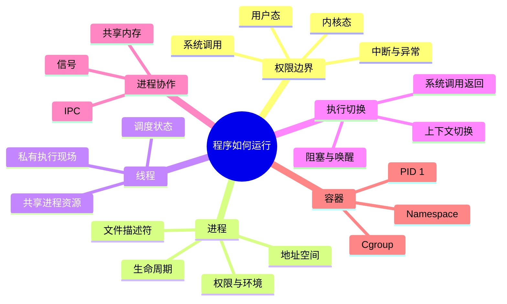
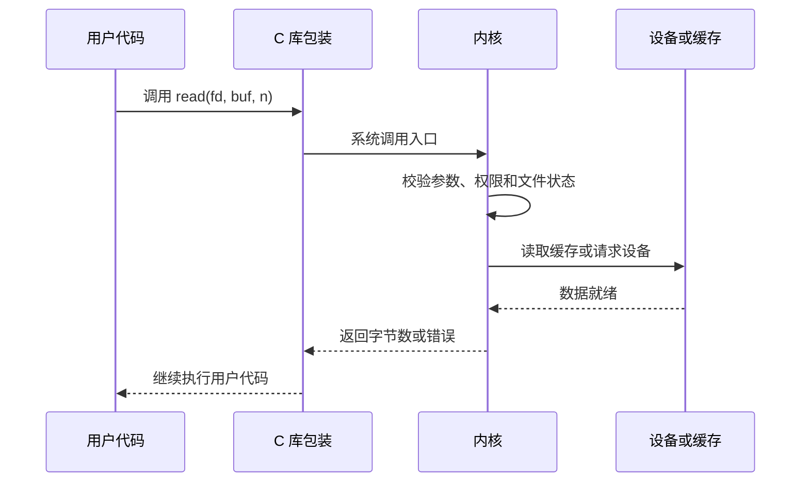

# 内核、系统调用、进程与线程

操作系统的任务不是“替程序执行所有代码”，而是管理多个程序共享的处理器、内存、文件和设备，并把它们彼此隔离。理解这一篇，可以把后续调度、虚拟内存、文件系统和 Linux 排障放到同一个执行模型里。

## 本章知识地图

## 一、程序、进程和线程不是同一个东西

程序是磁盘上的静态文件，包含代码、常量和初始数据。进程是程序的一次运行实例，拥有自己的虚拟地址空间、打开的文件、权限和内核记录。一个程序可以同时启动多个相互隔离的进程。

线程是进程内的一条执行路径。线程共享进程的代码、全局变量、堆和打开文件，但各自拥有程序计数器、寄存器现场、用户栈、内核栈和调度状态。共享让线程之间传递数据很快，也意味着一个线程写入共享变量可能影响其他线程。

这一区分解释了常见现象：进程通常提供更强的故障隔离，线程创建和通信通常更轻；但线程崩溃可能终止整个进程，进程间共享数据则需要显式的 IPC（Inter-Process Communication，进程间通信）机制。

## 二、为什么应用不能直接操作硬件

如果普通程序能随意修改页表、关闭中断或访问磁盘控制器，一个错误就可能破坏所有程序。CPU 提供不同权限级别，应用运行在受限的用户态，内核运行在能管理资源的内核态。

用户态和内核态是执行权限的边界，不是两个进程。线程执行系统调用时，CPU 切换到内核入口，内核使用自己的栈和权限处理请求，完成后返回原线程的用户代码。进入内核不必然导致进程切换；若请求立即完成，仍可能由同一线程继续执行。

硬件中断和异常也会进入内核，但触发者不同：系统调用由应用主动请求，异常由当前指令引起，例如缺页或除零，中断通常来自网卡、磁盘或定时器。三者都跨越权限边界，却有不同的保存现场和返回原因。

## 三、系统调用是受控的服务入口

应用通常通过库函数调用文件、网络和内存 API（Application Programming Interface，应用程序编程接口）。库函数准备系统调用号和参数，再执行特殊指令进入内核；内核检查指针、长度、权限和对象状态，执行服务后返回结果或错误码。

以 `read` 为例，应用提供文件描述符、用户缓冲区和长度。内核先确认文件描述符确实指向可读对象，再尝试从页缓存或设备取得数据，最后把允许返回的字节复制或映射到用户缓冲区。如果数据尚未准备好，线程可能进入等待队列，调度器运行其他线程。

系统调用比普通函数调用多出权限切换、参数校验和内核处理，但具体耗时取决于缓存命中、设备等待和数据复制。不要把“进入内核”直接等同于“慢”或“切换进程”。

## 四、进程保存了哪些资源

进程的核心是一个受内核管理的资源和执行上下文集合。内核为它记录进程标识、父子关系、调度信息、信号状态、权限、当前目录、环境变量和地址空间。Linux 中常见的 PID（Process Identifier，进程标识符）只是查找进程的编号，不是进程本身。

地址空间通常包含代码段、只读数据、已初始化数据、未初始化数据、堆、内存映射区和线程栈。实际布局会受 ASLR（Address Space Layout Randomization，地址空间布局随机化）、链接方式和运行时影响。进程看到的是虚拟地址，硬件和内核再把它映射到物理内存。

打开文件由文件描述符（file descriptor，FD）引用。FD 是进程内的整数索引，指向内核打开文件对象；两个进程可以通过继承或传递共享底层对象。关闭一个描述符不一定让文件对象立刻消失，还要看是否存在其他引用。

## 五、进程生命周期

创建进程后，它可能处于可运行、运行、阻塞、停止或僵尸等状态。可运行表示等待 CPU，阻塞表示等待 I/O、锁、定时器或其他事件，僵尸表示进程已经结束但父进程还未读取退出状态。状态名称在不同工具中略有差异，解释时应结合等待对象。

Unix 常把创建和加载新程序分成 `fork` 与 `exec`。fork 创建子进程的地址空间视图，通常使用 COW（Copy-On-Write，写时复制），父子先共享物理页；任一方写入时，内核才复制被修改页面。exec 用新程序替换当前进程的代码、数据和地址映射，但 PID 通常保持不变。

进程退出后，内核保留少量退出状态供父进程 `wait` 回收。父进程若长期不回收，系统中会积累僵尸；父进程先退出时，孤儿进程会被重新收养，由系统中的专门进程负责回收。

## 六、线程共享什么、隔离什么

同一进程的线程共享虚拟地址空间、堆、全局变量、打开文件和大部分权限，因此可以直接通过内存传递数据。每个线程仍有独立的寄存器现场、程序计数器、用户栈和内核栈，调度器可以把它们分别放入运行队列。

共享变量带来数据竞争。一次 `count += 1` 包含读取、计算和写回，多线程交错时可能丢失更新。锁、原子操作和条件变量规定访问顺序；它们解决的是同步和可见性，不能替代合理的数据所有权设计。

线程局部存储 TLS（Thread-Local Storage，线程局部存储）为每个线程提供独立变量副本。线程池长期存活时，局部变量若持有大对象或外部资源，也会延长资源生命周期，仍需显式清理。

## 七、上下文切换的真实成本

调度器切换执行线程时，需要保存和恢复寄存器、程序计数器、栈指针、调度状态以及必要的浮点或向量状态。若切换到另一个进程，还可能改变地址空间相关状态。

直接保存现场只是成本的一部分。新线程的代码和数据可能不在 CPU（Central Processing Unit，中央处理器）缓存中，分支预测历史也可能失效；跨核心迁移还可能失去原核心上的缓存工作集。因此，“线程切换比进程切换轻”是通常趋势，不是零成本或固定倍数。

阻塞 I/O 时主动让出 CPU 通常比忙等更有效，但过多线程会增加调度和内存开销。选择线程数要结合 CPU 核心数、I/O 等待、任务粒度和队列长度，而不是只追求更高并发数字。

## 八、IPC：进程怎样交换数据

管道适合单向字节流，Unix domain Socket 适合本机端点通信，共享内存适合高吞吐数据交换，消息队列适合按消息组织和排队，信号适合通知有限事件。不同 IPC 的差别不只在速度，还包括数据边界、阻塞方式、权限和故障影响。

共享内存减少复制，却把同步责任交给应用；消息传递隔离更清晰，却需要序列化和内核或运行时队列。设计时先确定所有权、背压和失败重试，再选择机制。把所有本机通信都称为“Socket”会隐藏这些重要差异。

## 九、容器里的进程仍然是普通内核任务

容器不是虚拟出一台完整机器，而是利用 Namespace（命名空间）隔离进程看到的 PID、网络、挂载点和用户等视图，并用 Cgroup（Control Group，控制组）限制 CPU、内存和 I/O 等资源。容器中的 PID 1 仍然需要处理信号、回收子进程和报告退出状态。

因此，容器内看到的进程号可能与宿主机不同，但它们最终仍由同一个内核调度。容器“内存不足”可能来自 cgroup 限额，即使宿主机还有空闲内存；排障时要同时查看容器视图和宿主机资源。

## 常见误区

系统调用进入内核不等于发生进程切换；进程切换也不一定由每次系统调用直接触发。是否阻塞、是否被调度器换出，取决于请求状态和调度决策。

线程共享地址空间不等于共享所有状态。栈和寄存器通常私有，但共享堆上的对象仍需同步。进程隔离也不是绝对安全边界，权限、内核漏洞和共享资源仍然重要。

fork 不会立即复制全部物理内存，COW 只推迟复制；父子大量写入时仍会产生实际内存成本。exec 替换的是地址空间中的程序内容，不是创建一个新的 PID。

## 面试表达

先区分程序、进程和线程，再解释权限边界。进程由内核提供地址空间、文件和权限等资源，线程是其中被调度的执行流。应用通过系统调用请求内核服务；请求可能立即返回，也可能阻塞并触发调度。线程共享进程资源所以通信方便，但共享数据需要锁或原子操作。最后结合 fork、exec、COW、IPC 和容器 Namespace 说明生命周期和隔离边界。

## 理解检查

1. 为什么系统调用不必然导致进程切换？
2. fork 和 exec 分别改变了什么？
3. 线程共享地址空间会带来哪一种新风险？
4. 大量 CLOSE_WAIT 更可能与哪个资源生命周期有关？
5. 容器内存不足为什么不一定说明宿主机内存耗尽？

## 可观察实验

用 `strace -f -e trace=process,read,write` 观察进程创建和系统调用，用 `ps -eLf` 查看进程与线程关系，用 `/proc/<pid>/status` 和 `/proc/<pid>/fd` 检查资源，再结合 `pstree` 观察父子生命周期。实验输出取决于当前系统和程序，不应脱离时间窗口解释。

## 术语卡片

| 缩写 | 英文全称 | 中文名称 | 本章作用 |
|------|----------|----------|----------|
| IPC | Inter-Process Communication | 进程间通信 | 进程交换数据和同步状态 |
| API | Application Programming Interface | 应用程序编程接口 | 应用调用系统或库服务的接口 |
| PID | Process Identifier | 进程标识符 | 区分和查找进程 |
| FD | File Descriptor | 文件描述符 | 引用进程打开的资源 |
| COW | Copy-On-Write | 写时复制 | 延迟父子进程页面复制 |
| ASLR | Address Space Layout Randomization | 地址空间布局随机化 | 随机化地址空间布局 |
| TLS | Thread-Local Storage | 线程局部存储 | 为每个线程提供独立变量 |
