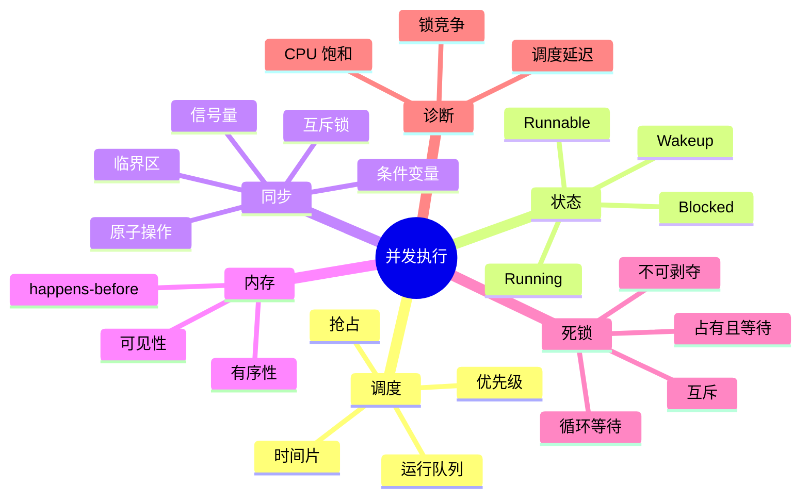

# 调度、同步、锁与死锁

多个线程同时存在时，操作系统要决定谁使用 CPU；多个线程访问同一状态时，程序还要规定访问顺序。调度解决“谁现在运行”，同步解决“运行时能否看到一致状态”。把两者混在一起，容易把锁等待误判为 CPU 不足，也容易把并发错误归咎于调度器。

## 本章知识地图



## 一、并发、并行和调度

并发表示多个任务在一段时间内都取得进展，并不要求它们同时执行；并行表示多个任务在不同 CPU 核心上同一时刻执行。单核机器也能通过快速切换产生并发，多核机器则可能同时并行。

调度器把可运行线程放入运行队列，从中选择线程执行。线程等待磁盘、网络、锁或定时器时进入阻塞状态，让出处理器；等待事件发生后重新变为可运行。状态变化由事件驱动，不是固定每隔某个时间就轮换。

## 二、调度器在权衡什么

调度策略通常同时考虑公平性、响应时间、吞吐量、优先级和能耗。时间片轮转让交互任务获得机会，优先级让重要任务更快响应，批处理任务则更关注总吞吐。任何策略都有代价：过短时间片增加切换，过长时间片让交互任务等待。

抢占允许定时器或更高优先级任务打断当前线程。抢占点可能发生在用户态或内核态的安全位置，具体行为由操作系统实现决定。上下文切换不仅保存寄存器，还会扰动 CPU（Central Processing Unit，中央处理器）缓存、分支预测和地址转换缓存。

线程数并非越多越好。CPU 密集任务超过核心数后主要增加排队和切换；I/O 密集任务可以利用等待时间，但线程过多仍会消耗栈内存并增加锁竞争。应结合运行队列长度、阻塞时间和任务粒度选择并发度。

## 三、临界区与竞态条件

临界区是访问共享状态且必须保持不可分割的一段代码。以 `count += 1` 为例，它至少包含读取、计算和写回三个动作。两个线程交错执行时，后写入的结果可能覆盖先写入的更新，这就是竞态条件。

互斥锁把临界区的进入变成排他操作：一个线程持有锁时，其他线程必须等待。锁保护的是不变量，例如“队列的头尾指针始终匹配”或“余额不能为负”，而不是某个变量名本身。设计时要把所有读写该不变量的路径纳入同一同步规则。

锁有直接成本和间接成本。竞争时线程可能自旋消耗 CPU，或睡眠并在之后被唤醒；临界区过大降低并行度，临界区过小又可能无法覆盖完整状态更新。锁的数量、顺序和持有时间都属于设计的一部分。

## 四、原子操作与内存可见性

原子操作把某个读改写动作作为不可分割步骤完成，例如 CAS（Compare-And-Swap，比较并交换）只有在内存值仍等于期望值时才更新。原子性解决的是某个操作不会被拆开，但不自动保护多个字段组成的不变量。

多核处理器和编译器可能重排独立操作。内存模型规定一个线程何时能看到另一个线程的写入，以及哪些操作建立 happens-before（先行发生关系）。锁的解锁与后续加锁、条件变量通知与等待返回等通常提供相应的可见性保证。

“加了 volatile 就线程安全”是常见误解。volatile 适合表达某些单变量可见性和禁止特定重排，不能让 `count++` 变成复合原子操作，也不能保护多个变量之间的逻辑关系。

## 五、条件变量表达等待条件

线程需要等待的通常不是“某把锁空闲”，而是“队列非空”“缓冲区有空间”或“任务已经完成”。条件变量把这种条件等待表达出来：线程先持有关联锁，检查条件；条件不满足时原子地释放锁并睡眠；被通知唤醒后重新获得锁，再次检查条件。

必须使用循环检查条件，而不是用一次 `if` 判断后直接继续。因为其他线程可能先消费了资源，也可能发生虚假唤醒。通知表示“条件可能变化”，不是承诺“被唤醒线程一定能继续”。

```text
while queue.is_empty():
    condition.wait(lock)
item = queue.pop()
```

生产者加入任务后通知消费者，消费者取走任务后通知生产者。锁保护队列不变量，条件变量只负责睡眠和唤醒，两者职责不同。

## 六、信号量和读写锁

信号量维护一个计数，表示可用资源或允许进入的名额。获取操作在计数为零时等待，释放操作增加计数并唤醒等待者。它适合连接生产者和消费者、限制并发连接数等场景，但若把同一个信号量同时当作互斥锁和资源计数，代码意图会变得难以维护。

读写锁允许多个读者同时进入，但写者需要排他访问。读多写少时可能有收益，写者频繁或临界区很短时，锁升级、调度和饥饿问题可能抵消收益。选择读写锁前先测量读写比例和临界区成本。

## 七、死锁如何形成

死锁是线程彼此等待而永远无法推进。经典的四个必要条件是：资源互斥、线程占有资源并等待另一个资源、资源不能被强制剥夺、等待关系形成环。只破坏其中一个条件，就能避免经典死锁。

最常见的工程做法是建立全局锁顺序：所有线程都按相同顺序获取锁。也可以使用一次性获取全部资源、带超时的尝试、无锁数据结构或让一个组件负责资源所有权。超时能让系统恢复，但还需要处理已经完成一半的业务状态。


活锁中线程不断让步和重试，却没有实际进展；饥饿中某线程长期得不到资源。它们不一定形成环，但同样需要公平策略、退避和可观测指标。

## 八、从现象定位并发问题

CPU 使用率高可能是忙等、自旋或真正的计算；CPU 使用率低但延迟高可能是锁、I/O、调度或上游依赖等待。先观察线程状态、运行队列、锁等待时间和上下文切换，再决定是否扩大线程池。

Linux 上可以结合 `top -H`、`pidstat -w`、`perf sched` 和语言运行时的锁分析工具。采样需要覆盖问题发生的时间窗口；一次瞬时堆栈只能说明当时在哪里，不能单独证明长期根因。

## 常见误区

并发不等于并行，线程多也不等于吞吐高。锁只保护它覆盖的状态，不会自动保护通过其他路径访问的同一数据。

条件变量通知不是资源转移保证，醒来后必须重新检查条件。原子变量也不是任意复合逻辑的替代品。

死锁、活锁和饥饿的症状都可能是“请求不返回”，但等待关系不同。排障时要记录谁在等待谁，而不是只看线程数量。

## 面试表达

先区分调度和同步：调度器安排可运行线程使用 CPU，锁和条件变量维护共享状态的顺序和可见性。再用计数器说明竞态，用条件变量说明等待条件，最后用四个必要条件解释死锁和全局锁顺序的预防方法。

## 理解检查

1. 单核机器为什么仍然存在并发？
2. 为什么 `count++` 不是原子操作？
3. 条件变量为什么要用 `while` 而不是 `if`？
4. 如何破坏死锁的四个必要条件之一？
5. CPU 利用率低但延迟高时，为什么要看锁和阻塞状态？

## 可观察实验

实现两个线程竞争更新计数器的最小程序，分别使用无同步、互斥锁和原子操作运行多次，对比结果与耗时。再让两个线程以相反顺序获取两把锁，用超时和线程栈观察等待环；实验结束后确保释放资源。

## 术语卡片

| 缩写 | 英文全称 | 中文名称 | 本章作用 |
|------|----------|----------|----------|
| CPU | Central Processing Unit | 中央处理器 | 执行线程和调度任务 |
| CAS | Compare-And-Swap | 比较并交换 | 提供条件式原子更新 |
| IPC | Inter-Process Communication | 进程间通信 | 进程协作机制 |
| TLS | Thread-Local Storage | 线程局部存储 | 保存线程私有变量 |
