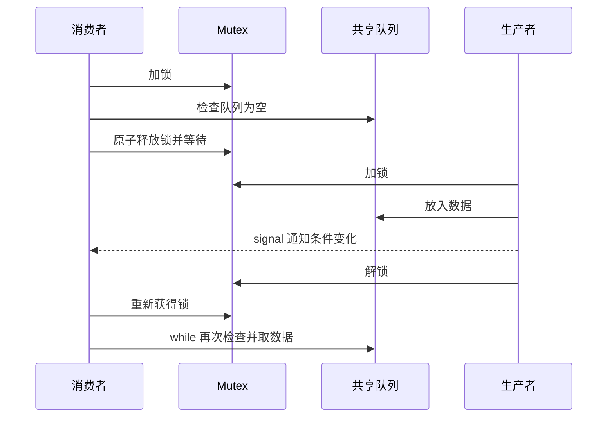
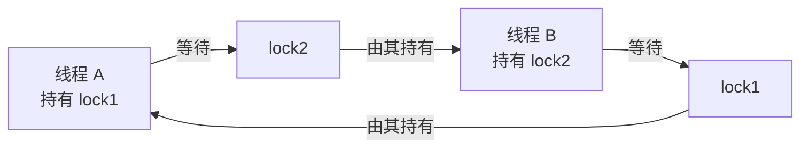

# 调度、同步、锁与死锁

## 调度解决什么问题

可运行线程多于 CPU 核心时，内核必须选择谁运行以及运行多久。

目标可能冲突：

- 提高 CPU 利用率和吞吐。
- 降低平均等待与周转时间。
- 降低交互任务响应时间。
- 保证公平和优先级。
- 满足实时期限。

不存在所有工作负载都最优的单一策略。

## 调度指标

- 到达时间：任务进入系统时间。
- 服务时间：实际需要 CPU 的时间。
- 完成时间：任务结束时间。
- 周转时间：完成时间 - 到达时间。
- 等待时间：周转时间 - 实际运行时间。
- 响应时间：首次得到 CPU - 到达时间。

交互系统更关注响应时间，批处理更关注吞吐和周转。

## 经典调度思想

| 算法 | 思想 | 风险 |
|------|------|------|
| FCFS | 先到先服务 | 长任务阻塞短任务 |
| SJF/SRTF | 短任务优先 | 难预测时长，长任务饥饿 |
| Round Robin | 每个任务用时间片 | 时间片选择影响响应和切换开销 |
| Priority | 高优先级先运行 | 低优先级饥饿 |
| MLFQ | 根据行为动态调整队列 | 参数和实现复杂 |

现代通用系统调度器比这些模型复杂，但经典模型帮助理解权衡。

## 抢占与时间片

抢占式调度允许内核通过时钟中断等事件暂停当前线程，把 CPU 给其他线程。

时间片太长：

- 交互响应差。
- 接近 FCFS。

时间片太短：

- 上下文切换频繁。
- Cache 工作集难保持。

## 竞态条件

两个线程执行 `count += 1`：

```text
线程 A 读 count = 0
线程 B 读 count = 0
线程 A 写 1
线程 B 写 1
最终是 1，不是 2
```

结果取决于不可控交错，就是竞态。

## 临界区与互斥

临界区访问共享可变状态，同一时刻只允许一个执行流进入。

互斥锁基本语义：

```text
lock()
  读取/修改共享状态
unlock()
```

正确性要求：

- 所有访问者遵循同一把锁。
- 任何退出路径都释放锁。
- 临界区尽量短。
- 不在持锁时执行不可控慢操作。

## 自旋与阻塞

- 自旋：不断尝试获取锁，消耗 CPU，适合等待极短。
- 阻塞：线程睡眠，稍后被唤醒，避免空转但有调度成本。

实际锁可能先短暂自旋，竞争持续时进入内核阻塞。

选择取决于临界区长度、竞争程度、核心数和调度环境。

## 条件变量

互斥锁保护共享状态；条件变量让线程等待“状态满足”。

生产者消费者伪代码：

```text
消费者：
lock
while 队列为空:
    condition.wait(lock)
取出元素
unlock

生产者：
lock
加入元素
condition.signal()
unlock
```

必须用 while 重新检查条件，因为：

- 可能虚假唤醒。
- 唤醒到真正获得锁之间，条件可能又变化。
- 多个等待者可能竞争同一资源。



## 信号量

信号量维护计数：

- wait/P：计数可用时减一，否则等待。
- signal/V：计数加一并可能唤醒等待者。

用途：

- 二值信号量可表达互斥。
- 计数信号量限制并发资源数，如连接池。

信号量不自带“谁持有”的所有权语义，错误使用更难排查。

## 原子操作与锁

原子操作适合单个状态的简单更新。锁可以保护跨多个变量的不变量：

```text
余额减少
转账记录增加
两个动作必须整体一致
```

“无锁”不等于“无同步”，无锁结构仍依赖原子操作、内存顺序和复杂正确性证明。

## 死锁

死锁四个必要条件：

1. 互斥。
2. 持有并等待。
3. 不可剥夺。
4. 循环等待。

两个线程：



### 处理思路

- 预防：破坏必要条件，例如统一加锁顺序。
- 避免：分配前判断是否进入不安全状态。
- 检测与恢复：检测等待图，终止或回滚。
- 超时与 try-lock：避免无限等待，但业务仍需处理失败。

工程中最常用原则之一是全局锁顺序。

## 活锁、饥饿与死锁不同

- 死锁：线程不再推进。
- 活锁：线程持续响应彼此，但没有有效进展。
- 饥饿：某线程长期得不到资源。

公平锁能降低饥饿，但可能牺牲吞吐。

## 读写锁

允许多个读者并发，写者独占。只有读远多于写、临界区足够大时才可能受益。

风险：

- 读者或写者饥饿。
- 升级锁复杂。
- 管理开销可能超过普通互斥锁。

## 动手实验

下面先把调度计算和并发同步补成完整体系，再进入实验。

---

## 深入一：调度器在管理什么

### 1. Scheduler

**直译**：调度器。

当可运行线程数多于可用 CPU 时，调度器决定：

- 下一条运行谁。
- 在哪个 CPU 上运行。
- 可以运行多久。
- 何时抢占。
- 睡眠线程醒来后放到哪里。

### 2. 调度对象

现代操作系统通常直接调度线程级任务：

```text
进程 A
  ├── 线程 A1
  └── 线程 A2

进程 B
  └── 线程 B1

调度器看到三个可调度执行流
```

教材常说“进程调度”，计算模型仍适用，但工程语境要知道实际占用 CPU 的是线程。

### 3. CPU Burst 与 I/O Burst

任务常在两类阶段间交替：

```text
CPU burst -> 等 I/O -> CPU burst -> 等 I/O
```

- CPU 密集任务的 CPU burst 较长。
- 交互/I/O 密集任务常短暂计算后等待。

调度器需要同时照顾吞吐和交互响应。

### 4. Ready Queue

**直译**：就绪队列、运行队列。

可运行任务在队列中等待 CPU。多核系统可能：

- 每个 CPU 有自己的运行队列。
- 定期做负载均衡。
- 尽量保持任务在原 CPU 以利用 Cache。

### 5. Dispatch

**直译**：分派。

调度器选定任务后，分派过程恢复它的寄存器、栈和地址空间等执行状态，让它真正运行。

### 6. 调度目标为什么冲突

| 目标 | 希望怎样 | 可能牺牲什么 |
|---|---|---|
| 高吞吐 | 减少切换、批量执行 | 交互响应 |
| 低响应时间 | 新任务尽快运行 | Cache 局部性、吞吐 |
| 公平 | 每个任务获得机会 | 高优先级任务延迟 |
| 实时性 | 截止期优先 | 普通任务吞吐 |
| 能耗 | 合并任务、让核心休眠 | 即时响应 |

不存在对所有负载都最优的调度算法。

---

## 深入二：六个调度指标

假设任务：

```text
到达时间 Arrival = A
实际 CPU 服务时间 Burst = B
首次运行时间 First = F
完成时间 Completion = C
```

### 1. Arrival Time

任务进入就绪系统的时间。

### 2. Burst/Service Time

任务实际需要的 CPU 时间。

它不包含：

- 在就绪队列等待的时间。
- 阻塞等待 I/O 的时间。

教材题常假设事先知道，真实系统通常无法精确知道未来服务时间。

### 3. Completion Time

任务完成的时刻。

### 4. Turnaround Time

**直译**：周转时间。

```text
周转时间 = 完成时间 - 到达时间
T = C - A
```

表示任务从进入到完成总共经历多久。

### 5. Waiting Time

**直译**：等待时间。

仅含 CPU burst 的简化模型：

```text
等待时间 = 周转时间 - 服务时间
W = T - B
```

如果模型还包含 I/O 阻塞，应明确等待时间口径，不要直接乱套公式。

### 6. Response Time

**直译**：响应时间。

```text
响应时间 = 首次运行时间 - 到达时间
R = F - A
```

响应时间关注多久第一次得到 CPU，不要求任务完成。

### 7. Weighted Turnaround Time

**直译**：带权周转时间。

```text
带权周转 = 周转时间 / 服务时间
```

它表示任务经历时间相对于自身工作量的放大。

### 8. 指标场景

- 交互应用重视响应时间和尾延迟。
- 批处理重视吞吐和平均周转。
- 实时系统重视是否在截止期前完成。
- 后台任务可能更重视公平与资源份额。

---

## 深入三：FCFS

### 1. First-Come, First-Served

**直译**：先来先服务。

按到达顺序运行，通常是非抢占式。

### 2. 示例

三个任务同时到达：

| 任务 | 服务时间 |
|---|---:|
| P1 | 8 |
| P2 | 4 |
| P3 | 1 |

甘特图：

```text
0        8    12 13
|---P1---|--P2-|P3|
```

等待时间：

```text
P1 = 0
P2 = 8
P3 = 12
平均 = 20/3
```

### 3. Convoy Effect

**直译**：护航效应。

一个长任务在前面，许多短任务被迫排队：

```text
长任务 -> 短 -> 短 -> 短
```

平均等待和交互响应可能很差。

### 4. 优缺点

优点：

- 简单。
- 按到达顺序直观公平。
- 切换较少。

缺点：

- 护航效应。
- 对短交互任务不友好。
- 非抢占时长任务会长期占 CPU。

---

## 深入四：SJF 与 SRTF

### 1. Shortest Job First

**直译**：最短作业优先。

从已到达任务中选择预计服务时间最短者，通常按非抢占版本理解。

### 2. 为什么平均等待时间低

让短任务先完成，减少大量短任务在长任务后等待的总和。在已知服务时间的理想模型中，SJF 能优化平均等待。

### 3. 最大问题

真实系统不知道任务未来还要运行多久，只能：

- 根据历史 CPU burst 估计。
- 根据任务类型分类。
- 使用动态反馈近似。

### 4. SRTF

**Shortest Remaining Time First，最短剩余时间优先。**

它是抢占式版本：

- 新任务到达。
- 若其预计剩余时间更短。
- 抢占当前任务。

### 5. 饥饿

若短任务不断到来，长任务可能长期得不到 CPU。

可用 aging 等机制逐步提高等待任务优先级。

---

## 深入五：Round Robin

### 1. 时间片轮转

就绪任务排队，每个最多运行一个 quantum：

```text
P1 -> P2 -> P3 -> P1 -> P2 -> ...
```

未完成任务被放回队尾。

### 2. 时间片太大

- 接近 FCFS。
- 交互任务等待较久。
- 上下文切换少。

### 3. 时间片太小

- 响应机会多。
- 上下文切换频繁。
- Cache 工作集难保持。
- 调度开销占比高。

### 4. 示例

任务服务时间：

```text
P1 = 5
P2 = 3
P3 = 1
quantum = 2
```

时间线：

```text
0-2 P1
2-4 P2
4-5 P3 完成
5-7 P1
7-8 P2 完成
8-9 P1 完成
```

计算题应按每段运行累计：

- 首次运行时间。
- 完成时间。
- 周转时间。
- 等待时间。

---

## 深入六：优先级与 MLFQ

### 1. Priority Scheduling

**直译**：优先级调度。

高优先级任务先运行，可以是抢占式或非抢占式。

### 2. 优先级来源

- 用户或管理员设置。
- 任务类别。
- 实时需求。
- 交互行为。
- 等待时长。
- 资源使用历史。

### 3. Starvation

**直译**：饥饿。

高优先级任务持续到来时，低优先级任务可能无限期等待。

### 4. Aging

**直译**：老化。

任务等待越久，逐步提高其优先级，降低永久饥饿风险。

### 5. MLFQ

**Multi-Level Feedback Queue，多级反馈队列。**

核心直觉：

- 多个不同优先级队列。
- 高优先级使用较短时间片，强调响应。
- 用完时间片的 CPU 密集任务逐步降级。
- 经常主动阻塞的交互任务更容易保持高优先级。
- 定期提升所有任务避免饥饿。

### 6. MLFQ 想近似什么

系统不知道未来服务时间。MLFQ 用任务过去行为猜测：

- 短 CPU burst 可能是交互任务。
- 长时间持续运行可能是 CPU 密集任务。

它是在未知服务时间下近似兼顾 SJF 与响应性的思想。

### 7. 可能被利用

任务若总在时间片结束前主动让出，可能保持高优先级。实际调度器需要更复杂的记账和防作弊策略。

---

## 深入七：抢占、多核与亲和性

### 1. Preemption

**直译**：抢占。

内核可以暂停当前线程，让另一条线程运行。

触发原因：

- 时间片或公平份额。
- 更高优先级任务唤醒。
- 实时任务需要运行。
- CPU 负载均衡。

### 2. 抢占需要什么

- 时钟或其他调度事件。
- 保存当前线程现场。
- 调度器选择任务。
- 恢复新线程现场。

### 3. CPU Affinity

**直译**：CPU 亲和性。

限制或倾向某线程在哪些 CPU 上运行。

好处：

- 保留 Cache 热点。
- 配合 NUMA 内存位置。
- 隔离实时或高性能任务。

风险：

- 绑定不当导致部分 CPU 过载。
- 失去调度器负载均衡能力。
- 容器配额与宿主拓扑不匹配。

### 4. Load Balancing

多核运行队列负载不均时，调度器迁移任务：

- 提高整体利用率。
- 但迁移会丢失部分 Cache 局部性。

这是负载均衡与缓存亲和性的权衡。

### 5. 实时调度

实时系统主要关注：

- 截止期。
- 最坏响应时间。
- 可预测性。

“实时”不等于平均速度最快，而是关键任务能在规定时间内得到服务。

---

## 深入八：竞态、原子性和临界区

### 1. Race Condition

**直译**：竞态条件。

程序结果依赖多个执行流不可控的相对时序。

### 2. Data Race

不同语言对 data race 有严格定义，常见直觉是：

- 多线程并发访问同一内存位置。
- 至少一个是写。
- 缺少规定同步。

Data race 和广义 race condition 不完全同义，但面试入门先理解“时序依赖导致错误”。

### 3. 原子性

一个操作对并发观察者不可被分割。

`count += 1` 可能包含：

```text
load
add
store
```

源码一行不代表原子。

### 4. 可见性

线程 A 写入后，线程 B 何时、通过什么同步规则保证看到新值。

Cache coherence 只是硬件基础，语言内存模型仍要求正确同步。

### 5. 有序性

编译器和 CPU 可以重排不影响单线程结果的操作。跨线程需要锁、原子 acquire/release 等建立顺序关系。

### 6. Critical Section

**直译**：临界区。

访问共享可变状态、必须满足某个不变量的一段代码。

正确临界区必须：

- 所有访问者遵守同一同步协议。
- 保护完整不变量。
- 所有退出路径都释放资源。
- 尽量短小。

---

## 深入九：互斥锁怎样工作

### 1. Mutex

**直译**：互斥。

同一时刻最多一个线程持有锁进入临界区。

```text
lock
  检查并修改共享状态
unlock
```

### 2. Fast Path

无竞争时：

- 原子地把锁从未占用改为占用。
- 不必让线程睡眠。
- 用户态即可完成常见路径。

### 3. Contended Path

竞争时可能：

1. 尝试短暂自旋。
2. 仍拿不到锁。
3. 通过内核等待机制睡眠。
4. 持有者释放锁并唤醒等待者。
5. 等待者重新竞争并获得锁。

### 4. Futex

**Futex = Fast Userspace Mutex，快速用户态互斥机制。**

核心思想：

- 无竞争状态主要在用户态用原子操作处理。
- 只有需要睡眠和唤醒时才进入内核。

Futex 是底层构件，不等于一个完整高级锁 API。

### 5. 锁保护的是不变量

例子：

```text
account.balance 减少
ledger 新增记录
```

必须让其他线程看不到“余额已减但记录未写”的中间状态。锁保护的是两者之间的一致关系，不只是单个变量。

### 6. 锁粒度

**粗粒度：**

- 锁少，正确性容易。
- 并发度低。

**细粒度：**

- 不相关操作可并行。
- 锁数量和顺序复杂。
- 死锁和维护成本更高。

### 7. 持锁期间不要做什么

避免：

- 不受控网络调用。
- 慢磁盘 I/O。
- 长时间计算。
- 调用未知回调。
- 获取顺序不明确的其他锁。

否则会放大等待并增加死锁风险。

---

## 深入十：自旋与阻塞

### 1. Spinlock

**直译**：自旋锁。

等待者反复尝试：

```text
while !try_lock:
    cpu_relax
```

适合：

- 临界区极短。
- 多核环境。
- 持有者很快运行并释放。
- 不能睡眠的低层上下文。

### 2. Blocking Lock

拿不到锁时让线程睡眠：

- 不继续消耗 CPU。
- 需要内核调度和唤醒。
- 适合等待较长。

### 3. 单核自旋的问题

如果锁持有者没有运行，而等待者占着唯一 CPU 自旋：

- 持有者得不到执行。
- 锁无法释放。
- 直到等待者被抢占。

所以普通用户线程在单核或严重超售环境中长自旋通常不合理。

### 4. Adaptive Spinning

实际锁可根据历史和当前状态：

- 先自旋短时间。
- 推测持有者正在其他核心运行。
- 竞争持续再睡眠。

它试图兼顾短等待延迟与长等待 CPU 效率。

---

## 深入十一：条件变量

### 1. Condition Variable

**直译**：条件变量。

它让线程等待“共享状态满足某个条件”，不直接保存业务条件本身。

### 2. 为什么还要互斥锁

共享条件的检查与进入等待必须原子衔接，否则会丢失唤醒：

```text
消费者检查队列为空
生产者放入数据并通知
消费者此时才进入等待
消费者可能永远等不到下一次通知
```

条件变量的 wait 会以规定方式：

1. 在持锁时检查条件。
2. 原子地释放锁并进入等待。
3. 被唤醒后重新获得锁。
4. 返回调用方。

### 3. 为什么必须 while

```text
lock
while condition 不满足:
    wait
使用共享资源
unlock
```

原因：

- 可能虚假唤醒。
- 多个消费者被唤醒后只有一个拿到资源。
- 从通知到重新拿锁之间，条件可能变化。
- 通知表示“可能变化”，不是资源直接交付。

### 4. signal 与 broadcast

- `signal`：唤醒一个等待者。
- `broadcast`：唤醒全部等待者。

广播过多可能形成惊群；只唤醒一个又可能不满足复杂条件下的正确性。选择取决于条件和等待者关系。

### 5. 生产者消费者

消费者：

```text
lock
while queue empty:
    not_empty.wait(lock)
item = queue.pop()
not_full.signal()
unlock
```

生产者：

```text
lock
while queue full:
    not_full.wait(lock)
queue.push(item)
not_empty.signal()
unlock
```

这里至少有两个业务条件：

- 非空。
- 未满。

---

## 深入十二：信号量、读写锁与屏障

### 1. Semaphore

**直译**：信号量。

维护非负资源计数：

- wait/P：有资源则减 1，否则等待。
- post/V：加 1，并可能唤醒等待者。

### 2. Binary Semaphore

计数只有 0/1，可表达类似互斥，但不一定有 mutex 的所有权语义。

### 3. Counting Semaphore

适合限制并发资源数：

```text
数据库连接池大小 = 20
信号量初值 = 20
```

每个请求：

```text
wait
使用连接
post
```

### 4. Mutex 与 Semaphore

| 对比 | Mutex | Semaphore |
|---|---|---|
| 核心语义 | 所有权与互斥 | 计数与资源配额 |
| 谁释放 | 通常持有者 | 可由另一个执行者 post |
| 典型用途 | 保护临界区 | 资源数、事件配合 |

### 5. Read-Write Lock

- 多个读者可同时持有读锁。
- 写者需要独占。

适合：

- 读远多于写。
- 临界区工作足够大。
- 读操作确实可并行。

不一定更快：

- 锁状态更复杂。
- 读写公平策略有开销。
- 写者可能饥饿。
- 短临界区管理成本可能超过收益。

### 6. Barrier

**直译**：屏障。

多个线程都到达某阶段后才一起继续：

```text
线程 A 完成阶段 1 --\
线程 B 完成阶段 1 ----> barrier -> 阶段 2
线程 C 完成阶段 1 --/
```

它用于阶段同步，不等于内存屏障指令，二者不要混淆。

---

## 深入十三：死锁

### 1. Deadlock

**直译**：死锁。

一组执行流互相等待对方持有的资源，导致都无法继续。

### 2. Coffman 四条件

#### Mutual Exclusion

资源同一时刻只能由一个执行者占用。

#### Hold and Wait

已持有资源，同时等待其他资源。

#### No Preemption

资源不能被系统强制剥夺，只能由持有者主动释放。

#### Circular Wait

存在循环等待链：

```text
A 等 B
B 等 C
C 等 A
```

四者是经典必要条件，破坏任一个即可从模型上避免死锁。

### 3. 两锁死锁

线程 A：

```text
lock(L1)
lock(L2)
```

线程 B：

```text
lock(L2)
lock(L1)
```

可能形成：

```text
A 持 L1 等 L2
B 持 L2 等 L1
```

### 4. 预防

- 统一全局锁顺序。
- 一次申请全部资源。
- 不满足时释放已有资源。
- 减少嵌套锁。
- 使用可剥夺或可回滚资源模型。

### 5. 避免

分配前判断是否仍处于安全状态。教材典型是银行家算法：

- 知道任务最大资源需求。
- 试分配后检查是否存在安全完成序列。

通用业务系统通常难以预先知道所有最大需求。

### 6. 检测

构建等待图：

```text
线程 -> 等待资源 -> 持有线程
```

发现环说明可能存在死锁。

### 7. 恢复

- 终止某个任务。
- 回滚事务。
- 强制释放可恢复资源。
- 重启进程。

恢复必须考虑状态一致性，不能只“杀一个线程”。

### 8. 超时不是完整死锁解决

超时只保证不无限等待：

- 业务操作可能已完成一半。
- 重试可能造成重复副作用。
- 资源可能仍未释放。
- 需要幂等、回滚或补偿。

---

## 深入十四：活锁、饥饿和优先级反转

### 1. Livelock

**直译**：活锁。

线程持续改变状态并响应对方，但没有有效进展。

例如双方都过度礼让：

```text
A 发现冲突后退
B 发现冲突后退
A 再尝试
B 同时再尝试
循环
```

可用随机退避、优先级或集中仲裁打破同步节奏。

### 2. Starvation

**直译**：饥饿。

某线程长期得不到 CPU、锁或资源，但系统其他部分仍在推进。

原因：

- 不公平锁。
- 高优先级任务持续占用。
- 读者或写者偏好策略。
- 工作队列分配不均。

### 3. Priority Inversion

**直译**：优先级反转。

```text
低优先级 L 持有锁
高优先级 H 等待该锁
中优先级 M 不断抢占 L
H 间接被 M 延迟
```

虽然 H 优先级最高，却因 L 得不到 CPU 而等待。

### 4. Priority Inheritance

锁持有者 L 临时继承等待者 H 的高优先级：

- L 尽快运行。
- 释放锁。
- 恢复原优先级。

### 5. Priority Ceiling

资源预先关联优先级上限，持有时提升线程优先级，用于更严格实时系统分析。

### 6. 对比

| 问题 | 是否有状态活动 | 是否整体停住 | 核心特征 |
|---|---|---|---|
| 死锁 | 通常无有效活动 | 相关线程停住 | 循环等待 |
| 活锁 | 有活动 | 无有效进展 | 反复响应 |
| 饥饿 | 其他任务推进 | 单个任务长期不推进 | 分配不公平 |
| 优先级反转 | 系统仍运行 | 高优先级被间接延迟 | 锁与优先级交互 |

---

## 深入十五：并发设计原则

### 1. 优先减少共享

- 不可变数据。
- 消息传递。
- 按线程/分片所有权。
- 复制小状态。
- 最后批量合并。

没有共享可变状态，就不需要为它加锁。

### 2. 明确所有权

每个资源回答：

- 谁创建。
- 谁能读写。
- 谁负责关闭。
- 所有权何时转移。
- 失败时谁清理。

### 3. 写下不变量

锁不是围住“看起来危险”的几行，而是保护明确关系：

```text
队列长度 == 实际元素数
余额变化 == 对应流水变化
对象只可能处于规定状态之一
```

### 4. 固定锁顺序

给锁定义全局顺序：

```text
L1 < L2 < L3
```

所有代码只按升序获取，破坏循环等待。

### 5. 缩短临界区

可在锁外完成：

- 参数解析。
- 无共享的计算。
- 数据预构建。
- 慢 I/O。

在锁内只执行必须原子观察/修改的部分。

### 6. 线程池要有界

无界创建任务或线程会：

- 耗尽内存和 PID。
- 增加上下文切换。
- 放大下游压力。
- 让超时任务继续堆积。

有界队列和背压是并发系统稳定性的基础。

### 7. 超时、取消与幂等

并发任务应明确：

- 谁能取消。
- 超时后底层工作是否停止。
- 重试是否幂等。
- 部分完成如何回滚。
- 资源在所有异常路径是否释放。

---

## 补充面试题：直接背诵

### Q1：调度为什么没有唯一最优算法

> 吞吐、平均周转、交互响应、公平、实时性和能耗目标相互冲突。长时间片减少切换但响应差，短任务优先降低平均等待却可能饿死长任务。因此调度器必须针对负载和目标折中。

### Q2：就绪与阻塞有什么区别

> 就绪线程已经具备执行条件，只缺 CPU；阻塞线程还在等待 I/O、锁或事件，即使立即给 CPU 也不能继续。阻塞条件满足后先进入就绪队列，再由调度器选择运行。

### Q3：SJF 为什么难以直接实现

> SJF 假设知道任务未来服务时间，但真实系统通常不知道。调度器只能用过去 CPU burst、任务行为和反馈队列近似预测；持续短任务还可能让长任务饥饿。

### Q4：时间片越小越好吗

> 时间片小能缩短等待下一次运行的时间，但会增加上下文切换、Cache 扰动和调度开销。时间片过大又接近 FCFS、交互响应差，必须结合负载和目标折中。

### Q5：互斥与同步有什么区别

> 互斥保证临界区同一时刻只有一个执行者，保护共享状态；同步强调多个执行流按条件或阶段协作。互斥锁解决排他访问，条件变量、信号量和 barrier 可表达等待与通知。

### Q6：条件变量为什么用 while

> 唤醒只表示条件可能变化，线程重新获得锁前状态还可能再次改变，并且可能发生虚假唤醒或多个等待者竞争同一资源。因此 wait 返回后必须在锁内用 while 重新检查业务条件。

### Q7：自旋锁和互斥锁怎样选择

> 自旋等待消耗 CPU，但避免睡眠唤醒成本，适合多核上临界区极短且持有者正在运行；阻塞锁让线程睡眠，适合等待较长或 CPU 资源紧张。实际实现常先短暂自旋，竞争持续再进入内核等待。

### Q8：原子操作为什么不能替代所有锁

> 原子操作适合单个状态的简单读改写，但跨多个变量的不变量、复杂条件和资源生命周期通常需要更高层同步。无锁结构也依赖内存顺序、安全回收和进度证明，不等于没有同步成本。

### Q9：死锁四条件

> 互斥、持有并等待、不可剥夺、循环等待。四者是经典必要条件，破坏任意一个可预防死锁。工程中常用全局锁顺序破坏循环等待，并用超时和检测作为补充。

### Q10：死锁、活锁与饥饿

> 死锁是执行流相互等待而停止推进；活锁是持续响应和改变状态但没有有效进展；饥饿是某个任务长期得不到资源而其他任务仍推进。三者的检测和处理方式不同。

---

## 补充理解检查

### 调度计算

1. 给定到达与服务时间，画 FCFS 甘特图。
2. 计算每个任务完成、周转、等待与响应时间。
3. 对同一任务集分别使用 SJF 与 SRTF。
4. 用 quantum=2 画 Round Robin 时间线。
5. 比较四种算法的平均等待和响应。

### 判断题

1. 等待时间与响应时间永远相同。
2. SJF 在真实系统中总能知道准确服务时间。
3. 时间片越小，系统性能必然越好。
4. `count += 1` 写成一行就必然原子。
5. 条件变量通知等于把资源直接交给等待者。
6. 信号量一定只能取 0 或 1。
7. 读写锁一定比互斥锁快。
8. 设置超时就彻底解决了死锁和一致性。
9. 活锁中的线程可能持续执行指令。
10. 无锁结构不需要原子操作和内存顺序。

答案：1 错，2 错，3 错，4 错，5 错，6 错，7 错，8 错，9 对，10 错。

### 讲解题

1. 用 CPU burst 和 I/O burst 解释交互任务。
2. 解释 MLFQ 怎样近似兼顾短任务和响应。
3. 画出无竞争 mutex fast path 和竞争慢路径。
4. 用“丢失唤醒”解释条件变量为什么与锁组合。
5. 为有界队列写生产者消费者伪代码。
6. 用等待图画出三线程死锁。
7. 解释优先级继承如何缓解优先级反转。
8. 为一个业务不变量设计锁范围和锁顺序。

1. 写两个线程对共享计数器自增。
2. 分别不加锁、加互斥锁、使用原子计数。
3. 增加线程数并测量正确结果与吞吐。
4. 用线程分析工具或日志观察竞争。

不要用 print 作为同步手段，I/O 和内部锁会改变线程交错。

## 常见误区

- 有 GIL 的语言不代表所有共享状态和 I/O 逻辑天然安全。
- volatile/可见性不等于复合操作原子。
- 锁不是越细越好，过细会增加协调复杂度。
- 条件变量 signal 不是把锁直接交给等待者。
- 避免死锁不只是“设置超时”，还要维护资源一致性。

## 面试表达

**同步与互斥有什么区别？**

> 互斥要求临界区同一时刻只有一个执行流进入，保护共享状态；同步强调多个执行流按条件和先后关系协作。互斥锁主要解决排他访问，条件变量和信号量可表达等待与通知。实践中条件变量通常与互斥锁组合，先保护条件状态，再等待状态变化。

**追问链**

1. 条件变量为什么用 while？
2. 自旋锁什么时候比阻塞锁合适？
3. 原子操作为什么不能替代所有锁？
4. 怎样通过锁顺序避免死锁？
5. 死锁、活锁、饥饿怎样区分？

## 理解检查

1. 计算一组 FCFS 任务的等待和周转时间。
2. 写出生产者消费者的状态与同步条件。
3. 画出两锁死锁的等待图。
4. 给一个需要锁保护多个变量不变量的例子。

---

[上一课：内核与进程](../01-kernel-process-thread/index.html) | [下一课：虚拟内存 →](../03-virtual-memory/index.html)
