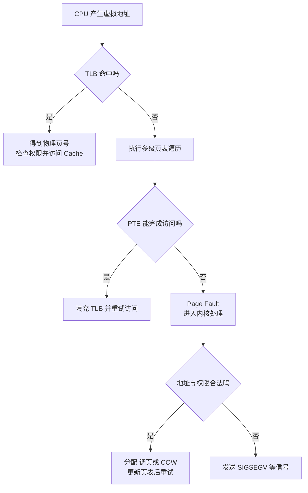
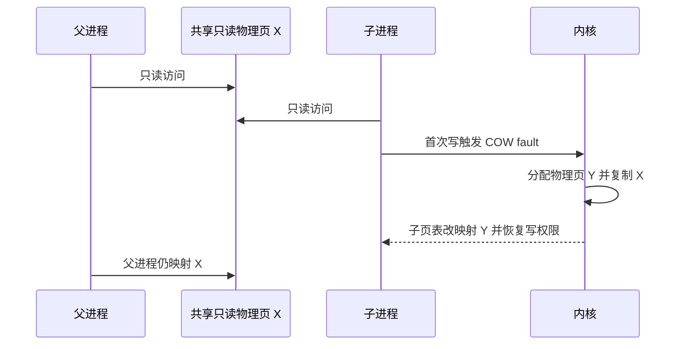

# 地址空间、分页、TLB 与缺页

## 本节知识地图


## 虚拟内存解决什么问题

虚拟内存不只是“内存不够时用磁盘”。它提供：

- 每个进程独立地址空间。
- 地址连续的抽象。
- 页级权限和隔离。
- 按需分配。
- 文件映射与共享内存。
- Copy-On-Write。

Swap 只是可能的后备机制之一。

## 虚拟地址与物理地址

应用使用虚拟地址，MMU 根据页表转换为物理地址：

```text
虚拟地址 = 虚拟页号 VPN + 页内偏移
                       |
                    页表映射
                       v
物理地址 = 物理页号 PPN + 同一个页内偏移
```

页和页框大小相同，常见基础页大小是 4 KiB，但平台也支持其他大小和大页。

## 页表项保存什么

概念上可能包含：

- 物理页号。
- present/valid。
- 读、写、执行权限。
- 用户/内核权限。
- accessed/reference。
- dirty。
- Copy-On-Write 等软件状态。

具体位布局由架构和操作系统决定。

## 为什么使用多级页表

若虚拟地址空间很大，单级页表会为大量未使用区域浪费内存。

多级页表按需创建下级表：

```text
虚拟地址索引
  -> 顶级页表
  -> 中间页表
  -> 末级页表
  -> 物理页
```

代价是 TLB miss 时可能需要多次内存访问完成 page walk。

## TLB

TLB 缓存近期虚拟页到物理页的翻译。



关键结论：

> TLB miss 不等于 Page Fault。

TLB miss 是地址翻译缓存没命中；缺页异常是页表状态或权限无法完成访问。

## Page Fault 发生什么

CPU 检测到无法完成访问，陷入内核。内核判断：

### 合法缺页

- 匿名页首次访问。
- 文件 mmap 首次访问。
- 页面已换出。
- Copy-On-Write 写入。

内核准备物理页、必要时读取数据或复制、更新页表，然后通常重新执行原指令。

### 非法访问

- 地址没有合法映射。
- 权限错误。
- 访问越界。

内核可能向进程发送 SIGSEGV 等信号。

## Minor 与 Major Fault

- Minor fault：不需要从慢速存储读取，例如分配零页、COW 或页已在 page cache。
- Major fault：需要磁盘/存储 I/O，延迟通常大得多。

分类细节依操作系统而异，但核心区别是是否需要昂贵 I/O。

## 按需分页

程序映射很大区域不代表所有页立即占用物理内存。首次访问时才分配/调入，能：

- 缩短启动。
- 只为实际访问部分付费。
- 允许稀疏地址空间。

也会带来首次访问缺页延迟。

## malloc 成功意味着什么

通常只能说明用户态分配器或内核为进程提供了可用虚拟地址范围，不保证：

- 每一页已有独立物理页。
- 数据已驻留内存。
- 未来在内存压力下不会失败或被 OOM 处理。

小对象可能来自分配器已有 arena；释放也不一定立即归还操作系统。

## Copy-On-Write

fork 后父子页最初可共享并设为只读：



COW 把复制成本推迟到真正写入时。

## mmap

mmap 把文件或匿名对象映射到虚拟地址空间。访问映射地址时由缺页机制按需建立页面。

用途：

- 文件随机访问。
- 共享内存。
- 动态库装载。
- 大文件按需映射。

mmap 不保证文件瞬间全部进入内存，也不天然比 read 更快；取决于访问模式、缺页和拷贝路径。

## 页面置换

物理内存紧张时，系统需要回收页面：

- 干净文件页可丢弃，之后从文件重新读。
- 脏页要先写回。
- 匿名页可能换出到 Swap。

教材算法：

- FIFO。
- LRU。
- Clock/Second Chance。

精确 LRU 成本高，实际系统使用近似与活跃/非活跃队列等机制。

## Thrashing

工作集远大于可用物理内存时，系统反复换入换出，CPU 大量等待缺页 I/O，吞吐骤降。

解决不只是“增加 Swap”：

- 降低并发或工作集。
- 优化数据结构。
- 增加物理内存。
- 调整缓存和内存限制。
- 定位内存泄漏或异常访问模式。

## 大页

大页减少页表项和 TLB 压力，适合大而连续的工作集；代价包括内部碎片、分配困难和回收灵活性下降。

是否使用要测量 TLB miss 与工作负载。

## 动手观察

下面从“地址是什么”开始，把翻译、缺页、分配和回收完整展开。

---

## 深入一：为什么程序不能直接使用物理地址

### 1. 直接物理寻址的问题

假设程序中的地址就是物理内存位置：

- 两个程序可能使用同一地址并互相覆盖。
- 程序必须知道自己被装到哪里。
- 内存碎片让连续大区域难分配。
- 程序无法方便迁移。
- 权限隔离困难。
- 共享与写时复制难实现。

### 2. Virtual Address

**直译**：虚拟地址。

CPU 执行用户程序时，指令中的普通地址通常是虚拟地址：

```text
进程 A 看到 0x1000
进程 B 也看到 0x1000
```

它们可以映射到不同物理页，所以不会仅因地址数值相同而访问同一数据。

### 3. Physical Address

**直译**：物理地址。

用于定位真实主存资源。普通用户程序通常不直接决定物理地址。

### 4. MMU

**MMU = Memory Management Unit，内存管理单元。**

它根据当前地址空间页表，把虚拟地址翻译为物理地址，并检查权限。

```text
CPU 虚拟地址
  -> MMU / TLB / 页表
  -> 物理地址
  -> Cache / 主存
```

### 5. 每进程地址空间

进程切换时，内核切换当前地址空间关联：

```text
进程 A 页表：VPN 1 -> PPN 20
进程 B 页表：VPN 1 -> PPN 93
```

相同虚拟页号因此可对应不同物理页框。

### 6. 虚拟内存的六个价值

1. 地址空间隔离。
2. 页级读/写/执行权限。
3. 为程序提供连续地址抽象。
4. 按需分配物理页。
5. 共享库、共享内存和文件映射。
6. COW、Swap 和页面回收。

Swap 只是其中一个机制，不是虚拟内存的定义。

---

## 深入二：分页基础

### 1. Page 与 Page Frame

**Page 直译**：页，虚拟地址空间的固定大小块。

**Page Frame 直译**：页框，物理内存的同尺寸块。

```text
虚拟页 VPN -> 物理页框 PPN
```

页与页框大小相同，页内偏移可原样保留。

### 2. 为什么使用固定大小页

优点：

- 分配和回收单位统一。
- 不要求进程物理连续。
- 页表映射简单。
- 权限按页设置。
- 文件映射和共享方便。

代价：

- 页表占内存。
- 页内可能浪费。
- TLB 容量有限。
- 页粒度影响缺页和 COW 成本。

### 3. 页内偏移

4 KiB 页：

```text
4 KiB = 4096 byte = 2^12 byte
```

所以虚拟地址最低 12 位是页内偏移。

### 4. 地址拆分

假设虚拟地址：

```text
VA = 0x12345
page size = 4 KiB
```

则：

```text
VPN = VA / 4096 = 0x12
offset = VA mod 4096 = 0x345
```

页表只翻译 VPN，offset 不变。

### 5. 物理地址组合

若：

```text
VPN 0x12 -> PPN 0xAB
```

那么：

```text
PA = PPN × 4096 + offset
   = 0xAB345
```

### 6. 内部碎片

申请对象大小不是页大小整数倍时，最后一页可能只有部分字节有效。

固定页越大：

- 页表和 TLB 压力可能越小。
- 内部碎片和粗粒度成本可能越大。

---

## 深入三：页表与页表项

### 1. Page Table

**直译**：页表。

页表记录虚拟页到物理页框的映射和访问状态。

### 2. PTE

**PTE = Page Table Entry，页表项。**

概念字段：

- Physical Page Number。
- Present/Valid。
- Read/Write/Execute。
- User/Supervisor。
- Accessed/Referenced。
- Dirty。
- 缓存属性。
- 操作系统使用的软件标志，例如 COW。

实际字段随 ISA 和 OS 变化。

### 3. Present

Present/valid 通常说明当前页表项能否直接提供有效映射。

不 present 可能表示：

- 尚未按需分配。
- 已换出。
- 文件页尚未装入。
- 地址根本无效。

具体含义要结合操作系统元数据判断。

### 4. 权限位

页级权限常包括：

- 可读。
- 可写。
- 可执行。
- 用户态是否可访问。

用途：

- 代码页可执行但通常不可写。
- 只读数据禁止写。
- 用户态不能直接访问内核页。
- COW 页暂时只读以捕获第一次写入。

### 5. NX

**NX = No Execute。**

数据页可标记不可执行：

- 堆和普通栈通常无需执行代码。
- 降低把数据直接当指令执行的攻击面。

它是防护的一层，不等于消除所有代码执行攻击。

### 6. Accessed 与 Dirty

**Accessed：**

- 页面近期是否被访问。
- 可帮助近似页面活跃度。

**Dirty：**

- 页面内容是否被修改。
- 回收脏文件页前需要写回。

具体由硬件设置还是软件维护取决于平台。

---

## 深入四：为什么需要多级页表

### 1. 单级页表的问题

假设虚拟地址空间巨大，每个可能虚拟页都预留一个 PTE：

- 大量地址区域从未使用。
- 页表仍要为它们占空间。
- 每个进程都产生很大固定开销。

### 2. 多级思想

把页表本身做成树：

```text
顶级索引
  -> 中间页表
      -> 末级页表
          -> 物理页
```

只有实际使用某个虚拟地址范围时，才创建对应下级页表。

### 3. 地址字段

概念上：

```text
L1 index | L2 index | L3 index | ... | page offset
```

每一级 index 选择下一张表中的一个条目。

### 4. 节省空间的条件

多级页表适合稀疏地址空间：

- 代码在低地址一段。
- 堆在某一段。
- 共享库和 mmap 在另一段。
- 栈靠近高地址。
- 中间大片未映射。

未使用区域不需要完整末级页表。

### 5. Page Walk

TLB miss 后，需要读取多级页表项：

```text
读顶级 PTE
  -> 读下一级 PTE
  -> ...
  -> 读末级 PTE
  -> 得到物理页
```

页表项本身也在内存中，因此一次地址翻译可能需要多次内存访问。

### 6. 页表缓存

现代处理器可能缓存页表遍历的中间结果，页表项也可能命中普通 Cache，所以 page walk 成本并非固定。

---

## 深入五：TLB

### 1. Translation Lookaside Buffer

**直译**：地址转换后备缓冲、快表。

TLB 缓存近期使用的：

```text
VPN -> PPN + 权限
```

### 2. TLB Hit

1. CPU 产生虚拟地址。
2. TLB 找到 VPN。
3. 检查权限。
4. 与 offset 组合得到物理地址。
5. 继续访问 Cache/内存。

### 3. TLB Miss

1. TLB 没有对应翻译。
2. 硬件或内核执行页表遍历。
3. 若 PTE 有效，填充 TLB。
4. 原访问继续。

这不要求分配新物理页，因此不一定产生 Page Fault。

### 4. TLB 与 Cache

- TLB 缓存地址翻译。
- Cache 缓存指令和数据。

可能同时出现：

- TLB hit + Cache hit。
- TLB hit + Cache miss。
- TLB miss + Cache hit。
- TLB miss + Cache miss。

### 5. ASID/PCID

TLB 条目可带地址空间标识：

- 多个进程的翻译可以共存。
- 进程切换不必无条件清空整个 TLB。
- 权限或映射变化时仍需按规则失效相关条目。

### 6. TLB Shootdown

多核上修改页表后，其他核心可能缓存旧翻译。内核需要通知相关核心失效对应 TLB 项：

```text
核心 A 修改映射
  -> 发送跨核通知
  -> 核心 B/C 失效旧 TLB 条目
  -> 确认完成
```

频繁映射变化会产生跨核协调成本。

### 7. TLB Reach

```text
TLB reach = 条目数 × 页大小
```

它表示 TLB 不重复遍历页表时大约可覆盖的地址范围。

---

## 深入六：Page Fault

### 1. Page Fault 不是一个单一结果

CPU 发现当前页表和权限不能直接完成访问，于是进入内核。内核还要判断这是：

- 正常的按需分页。
- COW 写入。
- 文件映射首次访问。
- 已换出页面。
- 非法地址。
- 权限违规。

### 2. 合法匿名页首次访问

```text
程序获得虚拟地址
  -> 首次读取/写入
  -> PTE 尚无普通物理页
  -> Page Fault
  -> 内核分配或映射零页
  -> 更新 PTE
  -> 重试原指令
```

### 3. 文件映射首次访问

```text
访问 mmap 地址
  -> 页尚未装入
  -> Page Fault
  -> 查 page cache
  -> 命中：建立映射
  -> 未命中：从存储读取
  -> 更新页表并重试
```

### 4. COW Fault

页存在，但写权限被故意撤销：

1. 写入触发保护异常。
2. 内核识别这是 COW 映射。
3. 分配新物理页。
4. 复制旧内容。
5. 修改写入方 PTE。
6. 恢复写权限。
7. 重试写指令。

### 5. 非法访问

例如：

- 解引用空指针附近地址。
- 访问未映射区域。
- 向只读代码页写入。
- 在 NX 页面执行指令。

内核无法合法修复时，通常向进程发送 `SIGSEGV` 等信号。

### 6. Fault 处理后为何重试

触发 fault 的指令尚未完成。内核修复映射后恢复到该指令，让 CPU 再次执行。这要求异常状态足够精确。

---

## 深入七：Minor 与 Major Fault

### 1. Minor Fault

不需要从慢速存储读取目标页面：

- 分配零页。
- COW 复制。
- 页面已在 page cache。
- 只需建立页表映射。

Minor 不等于免费：

- 要进入内核。
- 可能分配和清零页面。
- 可能复制 4 KiB 或更大页面。
- 要修改页表和 TLB。

### 2. Major Fault

需要从磁盘或其他较慢存储获取页面：

- 文件页不在 page cache。
- 匿名页已在 Swap。

通常会：

- 提交 I/O。
- 阻塞当前线程。
- 调度其他任务。
- I/O 完成后重新就绪。

### 3. 延迟差异

Minor fault 常为内存和内核路径成本；major fault 还包含存储 I/O，通常慢得多。

不要背固定耗时，设备、负载和文件系统差异很大。

### 4. 预读

顺序访问文件时，内核可能提前读后续页：

- 单次 major fault 带回多页。
- 后续页访问变成 minor 或直接已有映射。

因此 fault 次数与实际物理 I/O 次数不一定一一对应。

---

## 深入八：按需分页与零页

### 1. Demand Paging

**直译**：请求分页、按需分页。

只在页面真正被访问时才准备物理内容。

好处：

- 程序启动更快。
- 未使用代码和数据不占物理页。
- 可创建稀疏大地址空间。
- 多进程可共享只读页。

### 2. Zero Page

多个只读零初始化虚拟页可先映射同一只读零页：

- 读到的都是 0。
- 首次写时再分配独立页。

这进一步推迟物理内存分配。

### 3. First Touch

页面首次实际写入时才决定物理页：

- 会产生首次缺页成本。
- 在 NUMA 系统中可能影响页放置节点。

基准测试若不预触碰内存，可能把首次 fault 混进核心耗时。

### 4. 稀疏映射

进程可保留很大虚拟范围，却只触碰少量页面：

```text
虚拟空间很大
实际 RSS 较小
```

这在大数组预留、内存分配器和稀疏数据结构中很常见。

---

## 深入九：malloc、分配器与 overcommit

### 1. malloc 是库函数

常见路径：

```text
应用 malloc
  -> 用户态分配器检查空闲块
  -> 有可用块：直接返回
  -> 不够：通过 brk/mmap 等向内核扩展虚拟区域
```

不是每次 malloc 都执行系统调用。

### 2. malloc 返回什么

成功通常说明获得一段按语言/库约定可使用的虚拟地址：

- 不保证每页都有独立物理页。
- 不保证已驻留。
- 不保证未来内存压力下绝无失败。
- 不保证释放后立即归还内核。

### 3. Arena 与空闲块

分配器为减少系统调用，会：

- 批量向内核申请大区域。
- 在用户态切分小对象。
- 缓存释放块供后续复用。
- 多线程使用多个 arena 减少锁竞争。

副作用：

- 内部碎片。
- RSS 释放不及时。
- 多 arena 增加内存。

### 4. free 后 RSS 为什么不降

可能因为：

- 页面中还有其他活对象。
- 分配器保留页面复用。
- 堆顶条件不满足。
- 内核统计更新和回收有延迟。

`free` 表示对象空间归还分配器，不等于物理页立刻归还操作系统。

### 5. Overcommit

系统可允许承诺的虚拟内存超过当前物理内存与 Swap：

- 很多映射不会全部触碰。
- fork 的 COW 页未必全部复制。
- 大量保留空间可能稀疏使用。

风险：

- 后续真实触碰量超过能力。
- 分配/缺页失败或触发 OOM。

### 6. OOM

**OOM = Out Of Memory。**

系统或 Cgroup 无法满足关键内存需求时，可能选择终止某些进程以恢复。

要区分：

- 宿主机全局 OOM。
- Cgroup/容器内存限制 OOM。
- 语言运行时自己的堆上限。
- 单次分配接口返回失败。

---

## 深入十：Copy-On-Write

### 1. fork 场景

父子创建时先共享页面：

```text
父进程 PTE --\
              -> 物理页 X
子进程 PTE --/
```

映射设为只读/COW。

### 2. 写入场景

子进程写：

```text
写保护 fault
  -> 分配物理页 Y
  -> X 内容复制到 Y
  -> 子 PTE 指向 Y 并可写
  -> 父仍指向 X
```

### 3. COW 的收益

- fork 后立刻 exec 时避免无用复制。
- 父子只读数据长期共享。
- 快照和版本化可延迟复制。

### 4. COW 的成本

- 首次写入 fault。
- 页面分配和复制。
- 页表与 TLB 更新。
- 大页场景复制粒度可能更大。
- 大进程 fork 后大量写会造成内存峰值。

### 5. COW 与共享内存

- COW 写后分离，目标是逻辑独立。
- 共享内存写后仍对其他映射者可见，目标是共同访问。

二者都可能初始映射同一物理页，但写入语义相反。

---

## 深入十一：mmap

### 1. Memory Mapping

**直译**：内存映射。

把文件或匿名内存对象映射到虚拟地址范围，程序通过普通内存访问指令操作。

### 2. 文件映射

```text
文件偏移
  <-> page cache 页
  <-> 进程虚拟页
```

访问尚未就绪页面时通过缺页机制装入。

### 3. 匿名映射

不对应普通文件内容，常用于：

- 大块堆内存。
- 线程栈。
- 进程私有匿名区域。
- 共享匿名内存。

### 4. Private Mapping

对映射的写入通常使用 COW：

- 当前进程看到修改。
- 不把普通写入直接反馈为共享文件内容。

### 5. Shared Mapping

修改可反映到共享映射页，并可能写回文件：

- 多进程可看见共同修改。
- 仍需同步访问。
- 可见与持久化是不同问题。

### 6. mmap 不一定更快

优势：

- 随机访问接口自然。
- 按需装页。
- 少一次显式用户缓冲复制的机会。

成本：

- 缺页。
- 映射管理。
- 地址空间占用。
- 截断文件时的错误风险。
- 随机大工作集造成 fault 和 TLB 压力。

### 7. mmap 不是零 I/O

数据不在内存时仍需从存储读取；脏文件页也需写回。它只是通过内存访问和缺页机制驱动 I/O。

---

## 深入十二：页面回收

### 1. 为什么需要回收

物理内存有限，而需求来自：

- 进程匿名页。
- 文件 page cache。
- 内核对象。
- 网络缓冲。
- 页表。

可用页不足时，内核必须选择页面回收。

### 2. 干净文件页

内容与磁盘文件一致：

- 可直接丢弃映射。
- 以后需要时重新读取。

回收相对容易，但再次访问仍可能产生 I/O。

### 3. 脏文件页

已修改、尚未写回：

- 回收前通常需要写回存储。
- 写回会消耗 I/O 带宽。
- 存储慢时可能阻塞回收进度。

### 4. 匿名页

堆、栈等没有普通文件后备：

- 可保留在内存。
- 可压缩或交换到 Swap，取决于系统配置。
- 不能像干净文件页一样直接丢弃后重读。

### 5. LRU 为什么只能近似

精确记录每次访问的全局顺序成本太高。实际系统利用：

- accessed/reference 信息。
- 活跃/非活跃队列。
- 多代或其他近似算法。
- 后台与直接回收。

### 6. Clock/Second Chance

教材直觉：

1. 环形扫描页面。
2. 引用位为 1：清零并暂不淘汰。
3. 引用位为 0：作为候选。

它用较低成本近似近期使用情况。

---

## 深入十三：Swap、Thrashing 与 OOM

### 1. Swap

**直译**：交换区。

为匿名内存提供磁盘或其他后备空间：

- 冷匿名页可移出 DRAM。
- 腾出物理页给活跃工作集。
- 后续访问再换入。

### 2. Swap 不是扩容等价物

存储延迟远高于内存：

- 少量冷页换出可能有益。
- 活跃页频繁换入换出会严重变慢。

### 3. Thrashing

**直译**：抖动、颠簸。

工作集远超可用物理内存：

```text
访问 A -> 换入 A、淘汰 B
访问 B -> 换入 B、淘汰 C
访问 C -> 换入 C、淘汰 A
循环
```

系统大量时间用于 fault 和 I/O，实际业务进展很少。

### 4. 现象

- major fault 增多。
- swap in/out 持续。
- 存储 I/O 高。
- CPU user 计算可能下降。
- 请求延迟和 load 上升。
- 吞吐骤降。

### 5. 处理

- 降低并发。
- 限制或缩小缓存。
- 修复泄漏。
- 改善数据结构。
- 增加内存。
- 合理设置容器限制。
- 分散工作负载。

仅增加 Swap 可能延迟 OOM，但不能让活跃工作集像 DRAM 一样快。

---

## 深入十四：大页

### 1. Huge Page

**直译**：大页、巨页。

使用比基础页更大的映射单位。

### 2. 优势

- 相同内存需要更少 PTE。
- 页表更小。
- TLB reach 更大。
- 某些大连续工作集 TLB miss 更少。

### 3. 代价

- 内部碎片。
- 大块连续物理页更难分配。
- 回收和迁移粒度变粗。
- COW 可能更昂贵。
- 并非所有负载都收益。

### 4. Transparent Huge Pages

操作系统可自动尝试合并或使用大页：

- 使用方便。
- 但整理、分配或回退可能带来延迟波动。

低延迟应用和数据库常需要结合实测调整。

---

## 深入十五：内存指标怎样解释

### 1. VSZ/VIRT

进程虚拟地址空间规模：

- 包含未驻留映射。
- 包含共享库。
- 可包含很大稀疏区域。

不能直接当物理内存占用。

### 2. RSS

**Resident Set Size，常驻集大小。**

当前驻留物理内存的页面统计。

注意：

- 可能包含共享页。
- 每进程 RSS 相加可能重复计算共享部分。
- 不等于进程独占内存。

### 3. PSS

**Proportional Set Size，比例集大小。**

共享页按共享者数量分摊，适合估计多进程总归属。

### 4. USS

**Unique Set Size，独占集大小。**

只统计当前进程独占、终止后可真正释放的驻留页。

工具和统计口径可能不同，使用时应确认定义。

### 5. available 与 free

Linux 会利用空闲内存做 page cache：

- free 很低不代表立即内存不足。
- available 估计无需严重换页时可供新应用使用的内存。
- 还要结合回收、Swap、fault 和 PSI 等压力指标。

---

## 补充面试题：直接背诵

### Q1：为什么需要虚拟内存

> 虚拟内存通过页表把每个进程的虚拟地址映射到物理页，提供地址隔离、页级权限、连续地址抽象、按需分配、共享、文件映射和 COW。Swap 只是内存压力下匿名页的可能后备，不是虚拟内存的全部。

### Q2：地址怎样翻译

> 虚拟地址拆成虚拟页号和页内偏移。MMU 先查 TLB，命中后得到物理页号并保留同一 offset；未命中则执行多级页表遍历。PTE 有效就填充 TLB，PTE 无法完成访问时才产生 Page Fault。

### Q3：多级页表为什么省空间

> 大虚拟地址空间通常很稀疏，单级页表要为所有虚拟页预留条目。多级页表只为实际使用的地址范围创建下级表，节省内存；代价是 TLB miss 时 page walk 可能读取多级页表。

### Q4：TLB miss 与 Page Fault 区别

> TLB miss 只是地址翻译缓存中没有目标，页表遍历若找到有效 PTE 就可继续；Page Fault 是页表状态或权限无法直接完成访问，需要内核分配、调页、COW 或判定非法。TLB miss 不等于 Page Fault。

### Q5：minor 与 major fault

> Minor fault 不需要从慢速存储读取，例如零页分配、COW 或页面已在 page cache；major fault 需要存储 I/O，例如文件页不在缓存或匿名页在 Swap。Minor 也有陷入、分配和页表更新成本，并非免费。

### Q6：malloc 成功说明什么

> 通常只说明分配器提供了一段可用虚拟地址，可能来自已有 arena，也可能扩展映射。它不保证所有页面已有独立物理页，不保证已驻留，也不保证未来在内存限制和 overcommit 下绝不会失败。

### Q7：free 后 RSS 为什么不降

> free 通常先把对象归还用户态分配器。页面可能还有其他活对象，分配器也可能保留空闲块复用，所以不立即归还内核。RSS 是否下降取决于页是否整体可回收、分配器策略和内核回收。

### Q8：mmap 一定比 read 快吗

> 不一定。mmap 让程序通过内存访问并按需缺页，适合随机访问和共享；read 接口明确、顺序流式处理常更简单。mmap 仍有缺页、映射管理和 TLB 成本，文件不在缓存时仍要 I/O，应按访问模式和测量选择。

### Q9：什么是 thrashing

> 活跃工作集远大于可用物理内存时，系统不断换入当前页并淘汰很快又要访问的页，大量时间耗在 major fault 和存储 I/O，业务吞吐骤降。处理应缩小工作集、降低并发、修复泄漏或增加内存。

### Q10：大页有什么权衡

> 大页减少 PTE 数并扩大 TLB reach，适合大而连续的工作集；但增加内部碎片，分配、回收、迁移和 COW 粒度更粗。是否启用要根据 TLB miss、内存碎片和延迟实测。

---

## 补充理解检查

### 计算题

1. 4 KiB 页需要多少位 offset。
2. 把虚拟地址 `0x12345` 拆成 VPN 和 offset。
3. 已知 VPN 映射到 PPN `0xAB`，计算物理地址。
4. 512 项 TLB、4 KiB 页的 TLB reach 是多少。
5. 换成 2 MiB 页后 reach 是多少。

### 判断题

1. 虚拟内存就是磁盘上的 Swap。
2. 相同虚拟地址在不同进程中必然指向同一物理页。
3. TLB miss 必然进入磁盘 I/O。
4. Page Fault 必然是程序错误。
5. minor fault 完全没有成本。
6. malloc 每次都调用 mmap。
7. free 必然使 RSS 立即下降。
8. COW 页第一次写入可能触发 fault。
9. mmap 后文件全部立即进入物理内存。
10. RSS 是进程独占物理内存。

答案：1 错，2 错，3 错，4 错，5 错，6 错，7 错，8 对，9 错，10 错。

### 讲解题

1. 画出 TLB hit、TLB miss 和 Page Fault 三条路径。
2. 解释页表项中的 present、权限、accessed 和 dirty。
3. 用稀疏地址空间说明多级页表为何省内存。
4. 画出多核 TLB shootdown。
5. 解释匿名页、文件页和 page cache 的关系。
6. 推演 fork 后父子分别写同一页。
7. 比较 private mmap 和 shared mmap。
8. 用 major fault 与 Swap 指标解释 thrashing。

Linux：

```bash
cat /proc/<pid>/maps
cat /proc/<pid>/smaps
ps -o pid,vsz,rss,min_flt,maj_flt,cmd -p <pid>
vmstat 1
```

观察：

- VSZ 与 RSS 不同。
- 映射区域权限。
- minor/major faults。
- Swap in/out。

## 常见误区

- 虚拟内存不等于 Swap。
- TLB miss 不等于缺页。
- 缺页不一定访问磁盘。
- malloc 成功不等于物理页全部兑现。
- RSS 不等于进程独占物理内存，共享页会影响解释。
- mmap 不等于零缺页或零拷贝。

## 面试表达

**为什么需要虚拟内存？**

> 虚拟内存通过页表把每个进程的独立虚拟地址空间映射到物理页，提供隔离、权限、连续地址抽象、按需分配、共享和文件映射。Swap 只是内存压力下的一种后备。CPU 用 TLB 缓存翻译；TLB miss 可通过页表遍历解决，只有页表状态无法完成访问时才触发缺页异常。

**追问链**

1. 多级页表为什么节省空间？
2. TLB miss 与 Page Fault 的路径有什么区别？
3. minor 与 major fault 怎样区分？
4. fork 为什么使用 COW？
5. malloc 与 RSS 为什么不同时增长？
6. mmap 与 read 怎样选择？

## 理解检查

1. 把虚拟地址拆成 VPN 和 offset。
2. 画出 TLB hit、TLB miss、Page Fault 三条路径。
3. 解释 COW 第一次写入发生什么。
4. 说明工作集过大为什么导致 thrashing。

---

[上一课：调度与并发](../02-scheduling-concurrency/index.html) | [下一课：文件系统与 I/O →](../04-filesystem-io/index.html)
