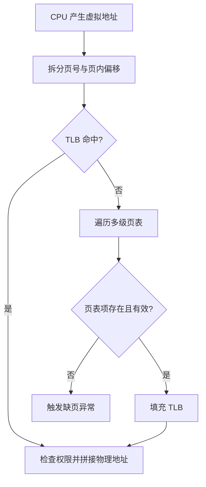

# 地址空间、分页、TLB 与缺页

应用需要一种稳定的地址来引用变量和代码，但物理内存会被许多进程共享，容量也可能暂时不足。虚拟内存让每个进程看到自己的地址空间，硬件和内核再决定这些地址当前映射到哪些物理页。

## 本章知识地图


## 一、为什么不能让程序直接使用物理地址

如果两个进程都能读写同一个物理地址，一个程序的指针错误就可能破坏另一个程序。操作系统为每个进程提供独立虚拟地址空间：相同的虚拟地址在不同进程中可以映射到不同物理页，进程也不能访问没有权限的区域。

虚拟地址通常分为虚拟页号和页内偏移。页表把虚拟页号映射到物理页框，页内偏移保持不变。分页避免了要求一整段连续物理内存，但页表本身也需要占用内存。

进程的代码、全局数据、堆、内存映射区和线程栈都只是地址空间中的不同映射。地址空间范围大于实际物理内存，并不表示所有页面都已经分配或驻留。

## 二、一次地址转换经过什么路径

CPU（Central Processing Unit，中央处理器）产生虚拟地址后，MMU（Memory Management Unit，内存管理单元）先把它拆成页号和偏移，查询 TLB（Translation Lookaside Buffer，地址转换旁路缓冲）。TLB 是页表映射的硬件缓存，命中时可以快速得到物理页框；未命中时需要遍历多级页表，再把结果填回 TLB。



TLB miss 不等于 Page Fault（缺页异常）：TLB miss 只是“转换缓存没有命中”，并不等于页面不存在；页表可能存在有效映射。把 TLB miss 不等同于 Page Fault（缺页异常）是理解性能和故障的关键。

页表项还保存读写执行权限、用户态可访问标志、脏页和访问位等信息。地址转换成功但权限不允许，也会触发异常，只是原因与页面尚未驻留不同。

## 三、缺页异常发生时内核做什么

进程第一次访问尚未建立物理映射的地址时，CPU 进入内核并报告缺页异常。内核先判断访问是否合法：地址是否属于进程的有效区域，访问类型是否符合权限。如果访问非法，进程可能收到段错误；如果访问合法但页面尚未准备好，内核才继续分配或换入页面。

匿名页可能需要分配并清零物理页，文件映射页可能从文件或页缓存读取，被换出的页面则需要从交换区恢复。内核建立页表映射、更新权限和 TLB 后，重新执行导致异常的指令。对应用来说，正常的按需分配缺页通常是透明的，但第一次访问会产生额外延迟。

页面被换出不一定表示系统立刻 OOM（Out Of Memory，内存不足）。OOM 表示在当前约束下无法满足分配请求，可能与物理内存、交换空间、cgroup 限额或内核保留策略有关。

## 四、malloc 成功不等于占用物理内存

用户态分配器可以先从进程地址空间划出范围，内核再在首次写入时分配实际物理页。这样既避免立即清零大量不用的页面，也允许进程预留比当前驻留量更大的地址空间。

`mmap` 可以建立文件映射或匿名映射。文件映射页可由多个进程共享，写入时根据权限和映射方式决定是否产生私有副本。共享库通常利用映射进入多个进程地址空间，但每个进程仍有自己的页表和权限。

观察内存时要区分虚拟大小、常驻集、共享页、脏页和匿名页。只看进程显示的“虚拟内存”不能判断它真正占用了多少物理内存。

## 五、fork 与写时复制

fork 创建子进程后，父子通常暂时共享相同物理页，页表标记为只读。双方都只读时无需复制；任一方尝试写入时，CPU 触发权限相关的缺页处理，内核分配新页、复制旧内容，并只把新页映射给写入方。这就是 COW（Copy-On-Write，写时复制）。

COW 把复制成本推迟到真正写入的时刻，适合 fork 后立即 exec 的场景。若父子进程都大量修改共享页，最终仍会产生接近完整复制的物理内存成本。写入热点、页粒度和内存回收会影响实际性能。

## 六、页面回收与缓存

内核会维护页缓存和匿名页的回收状态。干净的文件缓存可以直接丢弃，需要时重新从文件读取；脏页必须先回写；匿名页没有文件来源，可能需要交换出去。回收策略试图在降低内存压力与避免频繁换入换出之间取得平衡。

频繁缺页和交换会让系统出现抖动：CPU 运行队列可能不高，但请求延迟持续升高。应用看到的“内存还有很多”也不代表某个容器或进程一定能继续分配，因为限制可能来自 cgroup 或不可回收内存。

## 七、地址空间安全边界

页表权限可以阻止用户态执行内核页、写只读代码或访问其他进程页面。ASLR（Address Space Layout Randomization，地址空间布局随机化）改变代码、库和栈的位置，增加攻击者预测地址的难度；它是缓解措施，不是权限隔离本身。

内核地址通常在用户态不可访问。系统调用、共享内存和文件映射是受控地跨越边界的方式，内核必须校验用户提供的地址和长度，不能直接信任应用指针。

## 八、排障：区分转换慢、缺页多和内存不足

TLB miss 可能来自工作集大、地址访问随机或页表层级多；缺页可能来自首次触碰、文件访问或换入；OOM 则表示分配在限制下无法满足。三者都可能表现为延迟，但观测指标不同。

Linux 上可以组合观察：

```sh
free -h
vmstat 1
cat /proc/<pid>/maps
cat /proc/<pid>/smaps_rollup
cat /proc/<pid>/status
```

`vmstat` 中的换入换出、运行队列和内存回收需要结合时间窗口解释。`/proc` 展示的是内核当前视图，不同内核版本和容器权限可能导致字段不同。

## 常见误区

TLB miss 不等于缺页；前者是转换缓存未命中，后者是页表映射或页面驻留不满足访问。malloc 返回地址也不代表所有页面已经在物理内存中。

虚拟内存“比物理内存大”不表示系统可以无限使用内存。真实消耗受物理页、交换、文件回写、内核结构和资源限额共同约束。

fork 使用 COW 不等于父子永远共享同一份可写数据。首次写入会产生私有副本，写入量和页粒度决定复制成本。

## 面试表达

先说明虚拟地址提供隔离和连续视图，页表负责映射，MMU 和 TLB 加速转换。TLB miss 需要查页表，但只有映射缺失或访问不合法才进入缺页处理。合法缺页由内核分配、换入或建立映射后重试；fork 用 COW 延迟复制。最后区分虚拟大小、常驻内存、缓存回收和 OOM。

## 理解检查

1. 为什么不同进程可以使用相同的虚拟地址？
2. TLB miss 为什么不一定是缺页？
3. 页面尚未驻留时，缺页处理如何回到原指令？
4. fork 后父子何时真正复制页面？
5. 为什么容器 OOM 时宿主机可能仍有空闲内存？

## 可观察实验

写一个逐步触碰大数组的程序，分别记录虚拟大小和常驻集变化；再用 fork 后父子分别写入不同区域，观察物理内存增长。实验时控制数组大小和运行时间，并结合 `vmstat` 区分首次缺页与持续换页。

## 术语卡片

| 缩写 | 英文全称 | 中文名称 | 本章作用 |
|------|----------|----------|----------|
| MMU | Memory Management Unit | 内存管理单元 | 执行地址转换和权限检查 |
| TLB | Translation Lookaside Buffer | 地址转换旁路缓冲 | 缓存页表映射 |
| COW | Copy-On-Write | 写时复制 | 延迟共享页复制 |
| ASLR | Address Space Layout Randomization | 地址空间布局随机化 | 随机化地址布局 |
| OOM | Out Of Memory | 内存不足 | 表示分配无法满足 |
