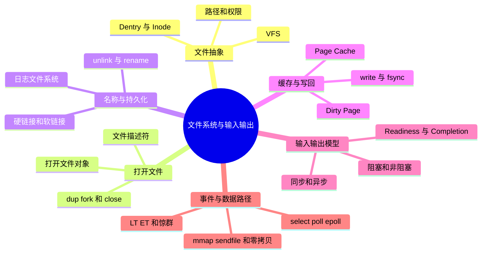
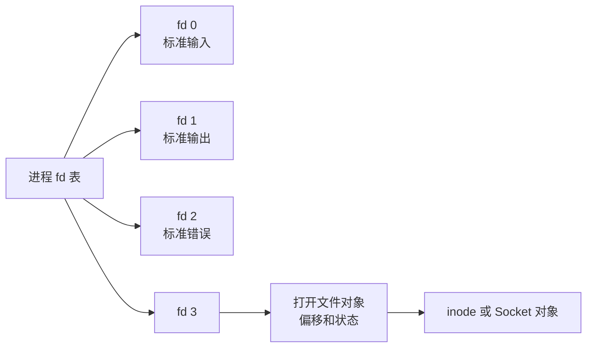
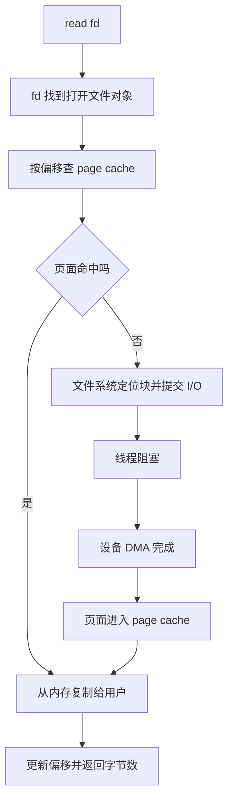

# 文件系统、I/O、epoll 与零拷贝

## 本节知识地图



## 一切皆文件的边界

Unix 用文件描述符统一表示很多内核对象：

- 普通文件。
- 目录。
- 管道。
- Socket。
- 设备。
- epoll 实例。

这不表示它们内部实现完全相同，而是共享 read/write/close 等接口抽象。

## 文件描述符

文件描述符是进程内的小整数索引。



多个 fd 可以指向同一个打开文件对象，并可能共享文件偏移；fork、dup 的语义需要具体分析。

## 路径解析与 inode

简化路径：

```text
/home/user/data.txt
  -> 从根目录开始查目录项
  -> 找到 home inode
  -> 找到 user inode
  -> 找到 data.txt inode
  -> 检查权限并创建打开文件对象
```

- 目录项把名称映射到 inode。
- inode 保存文件类型、权限、大小、时间和数据块位置等元数据。
- 文件名主要存在目录项中，不是 inode 的唯一名称。

## 硬链接与软链接

### 硬链接

另一个目录项指向同一 inode。删除一个名称，只减少链接计数；还有链接或打开引用时数据不一定立即释放。

### 软链接

独立文件，内容是另一个路径。目标删除后可能成为悬空链接，可以跨文件系统。

## page cache

普通文件 read 通常先经过 page cache：



page cache：

- 加速重复读。
- 合并和延迟写。
- 让文件 I/O 与虚拟内存共享页面机制。

应用缓存、数据库 buffer pool 与 page cache 可能形成双重缓存，需要结合访问和持久化语义设计。

## write 不等于已经落盘

write 成功通常表示数据已进入内核可管理缓冲/缓存，不保证介质已经持久化。

可能涉及：

- 脏页延迟写回。
- 文件系统日志。
- 设备写缓存。
- fsync/fdatasync。
- 存储设备自己的持久化保证。

数据库 WAL 的正确性依赖明确理解刷盘和顺序约束。

## 日志文件系统

崩溃可能发生在多步元数据更新之间。日志先记录事务意图或变更，恢复时重放或回滚，避免结构处于任意半完成状态。

日志不自动保证每个应用数据都已按业务期望持久化，仍需正确使用 fsync、原子重命名等协议。

## 阻塞与非阻塞

- 阻塞：操作不能立即完成时，调用线程睡眠等待。
- 非阻塞：不能立即完成就返回 EAGAIN/EWOULDBLOCK。

非阻塞不等于异步。调用者可能仍需要循环等待事件并主动再次 read/write。

## 同步与异步

常用区分：

- 同步 I/O：调用方参与等待或再次发起完成操作。
- 异步 I/O：提交请求后，完成由系统通过回调、完成队列等通知。

术语在不同 API/语境可能略有差异，回答时明确“等待数据就绪”和“数据复制完成”由谁负责。

## select、poll、epoll

### select

- 用位图传递关注 fd。
- fd 数量有实现限制。
- 每次调用复制和扫描集合。

### poll

- 使用 fd 数组，取消位图上限问题。
- 仍需每次传递并线性扫描。

### epoll

- interest list 保存在内核。
- 注册关注事件，等待时主要返回 ready 事件。
- 避免每次把全部 fd 集合传入并扫描。

epoll 的优势在“大量连接、少量活跃”场景明显；如果所有连接都活跃，仍要处理所有事件。

## Level Trigger 与 Edge Trigger

- LT：只要仍满足条件，后续 wait 还会报告。
- ET：状态从未就绪变为就绪时通知，通常要把数据读到 EAGAIN。

ET 不是必然更快；实现错误容易漏处理。LT 更容易写正确。

## 惊群

多个线程/进程等待同一事件时，全部被唤醒但只有一个获得工作，会造成无效调度和竞争。

内核和服务器框架通过 exclusive wakeup、reuseport、任务分发等方式缓解，具体取决于模型。

## 零拷贝

传统文件发送概念路径：


sendfile 等机制可避免数据往返用户空间：


“零拷贝”通常表示减少 CPU 参与的内存复制和上下文切换，不代表：

- 没有任何数据移动。
- 不需要 DMA。
- 没有系统调用。
- 适合所有需要应用修改数据的场景。

## mmap、sendfile 与 read/write

| 方式 | 适合 |
|------|------|
| read/write | 应用需要解析或修改数据，接口通用 |
| mmap | 随机访问、共享、按需映射 |
| sendfile | 文件内容直接发送到 Socket |

选择要看数据是否需要进入用户逻辑、访问模式、文件大小和平台实现。

## Direct I/O

部分场景绕过 page cache，让应用自己管理缓存与对齐。数据库可能使用，但会增加：

- 对齐要求。
- 缓存管理复杂度。
- 小 I/O 成本。

不是“绕过一层一定更快”。

## 动手观察

下面从“文件名如何找到数据”开始，完整展开文件、缓存、持久化和事件 I/O。

---

## 深入一：文件系统提供了什么抽象

### 1. File

**直译**：文件。

普通文件给应用一个持久字节序列抽象：

- 可以按偏移读取。
- 可以写入和截断。
- 有权限和时间等元数据。
- 名称通过目录组织。

底层数据可能分布在多个磁盘块，并不要求物理连续。

### 2. Directory

**直译**：目录。

目录不是“装文件内容的盒子”，本质上维护名称到文件对象标识的映射：

```text
"report.txt" -> inode number
```

它让人使用层级路径组织文件。

### 3. Metadata

**直译**：元数据。

描述文件而不是业务内容本身：

- 类型。
- 权限。
- 所有者。
- 大小。
- 时间戳。
- 链接计数。
- 数据块位置。

### 4. 文件系统的职责

- 名称空间。
- 数据块分配。
- 空闲空间管理。
- 元数据管理。
- 权限检查。
- 缓存与写回。
- 崩溃恢复。

### 5. “一切皆文件”的准确理解

Unix 让很多对象共享文件描述符接口：

- 普通文件。
- 目录。
- 管道。
- Socket。
- 设备。
- eventfd/timerfd。
- epoll 实例。

统一接口方便组合，但对象语义不同：

- 普通文件可 seek，管道通常不可。
- Socket 有连接和网络错误。
- 目录读取有专用语义。
- 设备操作可能通过 ioctl。

---

## 深入二：VFS、目录项与 inode

### 1. VFS

**VFS = Virtual File System，虚拟文件系统。**

它在不同具体文件系统上提供统一内核接口：

```text
应用 open/read/write
  -> VFS
  -> ext4 / XFS / tmpfs / NFS / ...
```

应用不需要为每种文件系统调用完全不同的 read。

### 2. Dentry

**直译**：目录项。

表示路径中的一个名称与对应 inode 的关联。

```text
目录 inode
  + 名称 "data.txt"
  -> 目标 inode
```

路径查找频繁，内核会缓存目录项和 inode 信息。

### 3. Inode

**直译**：索引节点。

inode 通常保存：

- 文件类型。
- 权限模式。
- UID/GID。
- 大小。
- 时间戳。
- 链接计数。
- 数据块映射。

文件名主要属于目录项，因此同一 inode 可以有多个硬链接名称。

### 4. 路径解析

打开：

```text
/home/alice/report.txt
```

简化步骤：

1. 从根目录开始。
2. 查找名称 `home`。
3. 得到 home 目录 inode。
4. 在其中查找 `alice`。
5. 继续查 `report.txt`。
6. 处理符号链接和挂载点。
7. 每一步检查搜索/执行权限。
8. 得到目标 inode。
9. 创建打开文件对象。
10. 在进程 fd 表中分配编号。

### 5. 相对路径

```text
docs/report.txt
```

从进程当前工作目录开始解析。

线程通常共享进程文件系统上下文，所以一个线程改变当前目录可能影响其他线程。

### 6. `.` 与 `..`

- `.` 表示当前目录。
- `..` 表示父目录语义。

跨挂载点、根目录和容器根视图时，实际解析受 VFS 和 Namespace 约束。

### 7. Mount

**直译**：挂载。

把一个文件系统的根连接到现有目录树某个挂载点：

```text
统一目录树
  -> /data 位置接入另一文件系统
```

用户看到一棵树，底层可跨多个设备和文件系统。

---

## 深入三：fd、打开文件对象与 inode

### 1. File Descriptor

**直译**：文件描述符。

它是进程 fd 表中的整数索引：

```text
fd 3 -> 表项 -> 打开文件对象
```

fd 只在对应进程/共享 fd 表语境中有意义。

### 2. 三层关系

```text
进程 fd 表
  fd 3 ----\
            -> 打开文件对象 -> inode -> 数据
  fd 4 ----/
```

### 3. 打开文件对象保存什么

通常包括：

- 当前文件偏移。
- 打开状态标志。
- 对 inode/具体对象的引用。
- 操作方法。

因此 fd 不等于 inode。

### 4. 多个 fd 指向同一打开文件对象

通过 `dup`：

- 新 fd 指向同一打开文件对象。
- 通常共享文件偏移。
- 关闭一个 fd 只减少引用。

### 5. 两次独立 open

同一路径打开两次：

- 可得到两个 fd。
- 通常有两个打开文件对象。
- 各自文件偏移可独立。
- 最终指向同一 inode。

### 6. fork 后

父子 fd 表项通常引用相同打开文件对象：

- 文件偏移可能共享。
- 状态标志可能互相影响。
- 每个进程可独立关闭自己的描述符引用。

### 7. close 后 fd 复用

关闭 fd 3 后，后续 open 很可能再次得到 3。

并发程序中若一条线程 close，另一条仍保存旧编号，可能误操作后来复用的新对象。这是 fd 生命周期竞态。

### 8. 标准描述符

按约定：

- 0：stdin。
- 1：stdout。
- 2：stderr。

Shell 重定向和管道就是在 exec 前调整这些 fd 指向。

---

## 深入四：硬链接、软链接与删除

### 1. Hard Link

**直译**：硬链接。

新增一个目录项指向同一 inode：

```text
name A --\
          -> inode X -> data
name B --/
```

### 2. 硬链接特点

- 两个名称地位平等。
- 修改任一名称访问到的内容，另一名称也看到。
- 删除一个只减少链接计数。
- 通常不能跨文件系统。
- 对目录建立硬链接通常受严格限制。

### 3. Symbolic Link

**直译**：符号链接、软链接。

它是独立 inode，内容保存目标路径：

```text
link inode -> 字符串 "../target"
```

### 4. 软链接特点

- 可跨文件系统。
- 可指向目录。
- 目标删除后成为悬空链接。
- 相对链接按软链接所在路径语境解析。

### 5. unlink

**直译**：解除链接。

删除名称通常执行 unlink：

- 从目录移除名称。
- inode 链接计数减少。
- 不等于数据立刻消失。

### 6. 删除后已打开文件为什么还能读

```text
目录项已删除
但打开文件对象仍引用 inode
```

只要仍有打开引用：

- inode 和数据块可继续存在。
- 已打开进程可继续读写。
- 最后引用关闭后才真正释放。

这也解释了日志文件被删除后磁盘空间仍未释放的常见问题。

### 7. 原子重命名

在同一文件系统等满足条件的场景，rename 可用于原子替换名称：

1. 写临时文件。
2. 对文件内容执行所需持久化。
3. rename 替换目标。
4. 按持久化要求同步目录。

“名称替换原子”与“掉电后一定持久”是不同保证。

---

## 深入五：权限与打开

### 1. rwx

普通文件：

- r：读取内容。
- w：修改内容。
- x：作为程序执行。

目录：

- r：列出名称。
- w：增删目录项。
- x：搜索/穿过目录。

目录权限语义与普通文件不同。

### 2. Owner、Group、Other

权限通常分：

- 所有者。
- 所属组。
- 其他用户。

内核结合进程凭据和权限位进行检查。

### 3. Open Flags

打开时可指定：

- 只读/只写/读写。
- 创建。
- 截断。
- 追加。
- 非阻塞。
- close-on-exec。

不同标志改变语义和竞态风险。

### 4. TOCTOU

**Time Of Check To Time Of Use。**

先检查路径再打开，二者之间目录内容可能被其他进程修改：

```text
check(path)
  -> 攻击者替换路径
open(path)
```

安全代码应优先使用能把检查与操作绑定到同一内核动作或目录 fd 的接口。

---

## 深入六：read 的数据路径

### 1. Page Cache Hit

```text
应用 read
  -> 系统调用
  -> fd 找到打开文件对象
  -> 文件偏移找到目标页
  -> page cache 命中
  -> 复制到用户缓冲区
  -> 更新文件偏移
  -> 返回字节数
```

### 2. Page Cache Miss

```text
read
  -> 查 page cache 未命中
  -> 文件系统定位磁盘块
  -> 块层提交 I/O
  -> 线程可能阻塞
  -> 设备 DMA 数据到内存
  -> 完成中断/轮询
  -> 页面进入 page cache
  -> 线程唤醒
  -> 数据复制给用户
```

### 3. 短读

`read(buf, 4096)` 返回值可能小于 4096：

- 到达 EOF。
- 管道/Socket 当前只有部分数据。
- 被信号等情况影响。
- 设备语义不同。

调用方必须按返回字节数处理，不能假设一次读满。

### 4. EOF

普通文件读到末尾常返回 0。

管道/Socket 的 EOF 通常要求对端所有相关写引用都关闭。仍有某个写端未关闭时，读者可能继续等待。

### 5. Readahead

内核识别顺序读取后，可提前读取后续页：

- 降低后续等待。
- 提高设备顺序吞吐。

随机访问或错误预读会浪费带宽和缓存。

---

## 深入七：write、脏页与持久化

### 1. Buffered Write

普通 write 常见路径：

```text
用户缓冲
  -> 系统调用
  -> 数据复制/写入 page cache
  -> 页面标记 dirty
  -> write 返回
```

此时数据可能尚未到持久介质。

### 2. Dirty Page

**直译**：脏页。

内存中内容比磁盘新，需要后续写回。

内核可：

- 后台定期写回。
- 脏页过多时限制写入。
- 内存回收时触发写回。
- 应用显式同步时写回。

### 3. fsync

`fsync(fd)` 请求把与文件相关的必要数据和元数据推进到持久存储语义要求的位置。

仍要考虑：

- 文件系统实现。
- 存储设备缓存是否正确报告完成。
- 控制器断电保护。
- 目录项是否也需要同步。

### 4. fdatasync

通常更侧重文件数据及读取数据所必要的元数据，可能避免同步不必要元数据。精确语义依系统接口。

### 5. 写入顺序

数据库常要求：

```text
WAL 先持久
  -> 数据页后写
```

仅按源码先后调用 write 不一定保证物理持久顺序。需要正确使用同步和文件系统/设备提供的顺序语义。

### 6. partial write

write 也可能只写部分数据：

- Socket 缓冲区空间有限。
- 非阻塞 fd。
- 信号或资源限制。
- 设备特殊语义。

调用方应循环处理剩余数据。

### 7. O_APPEND

追加模式让每次写入前的偏移定位与写操作按接口语义结合，减少多个写者竞争文件末尾偏移的风险。

但多次系统调用组成的一条业务记录不一定整体不可穿插。

---

## 深入八：日志文件系统与崩溃一致性

### 1. 崩溃中间态

创建文件可能包含多步更新：

- 分配 inode。
- 分配数据块。
- 更新目录项。
- 更新空闲空间位图。
- 更新元数据。

掉电发生在任意一步，会留下不一致风险。

### 2. Journal

**直译**：日志。

文件系统先把一组更新的日志记录写入稳定位置，再更新正式结构。恢复时根据完整日志事务重放或放弃。

### 3. 日志模式

文件系统可选择：

- 主要记录元数据。
- 同时记录数据和元数据。
- 对数据写入与元数据提交规定顺序。

不同模式在性能与保证间权衡。

### 4. 文件系统一致性不等于应用事务

日志可防止目录和分配表任意损坏，但不自动保证：

- 一条业务记录要么全有要么全无。
- 多个文件同步提交。
- 数据库约束正确。

应用仍需 WAL、事务、原子 rename 和 fsync 协议。

### 5. 崩溃一致性问题清单

设计写文件流程时问：

1. 数据先写还是元数据先写。
2. 哪个 fd 需要 fsync。
3. rename 后目录是否需同步。
4. 重启后如何识别临时文件。
5. 重试是否幂等。

---

## 深入九：阻塞、非阻塞、同步、异步

### 1. Blocking

**直译**：阻塞。

操作暂时不能完成时，当前线程睡眠等待。

### 2. Non-blocking

**直译**：非阻塞。

操作不能立即完成时直接返回：

```text
EAGAIN / EWOULDBLOCK
```

调用方之后再尝试。

### 3. Synchronous

常用工程语境中，调用方沿当前控制流完成或确认操作结果。

### 4. Asynchronous

提交请求后先返回，完成通过：

- 回调。
- Future/Promise。
- 完成队列。
- 信号/事件。

通知调用方。

### 5. 四种组合不要乱等同

- 阻塞同步：普通阻塞 read。
- 非阻塞同步：read 立即返回 EAGAIN，应用稍后重试。
- 异步：提交后由系统完成并通知。
- 事件就绪通知：epoll 告诉应用“现在可能可读”，实际 read 仍由应用调用。

### 6. readiness 与 completion

**Readiness model：**

```text
系统通知 fd 已可读
应用再调用 read
```

**Completion model：**

```text
应用提交读取请求
系统完成数据传输
完成队列返回结果
```

epoll 主要是 readiness 模型，不是所有意义下的异步 I/O 完成接口。

---

## 深入十：select 与 poll

### 1. select

应用每次调用传入关心的 fd 位图集合：

- 内核检查哪些就绪。
- 修改或返回集合。
- 应用扫描找到就绪 fd。

局限：

- fd 编号/集合大小受实现限制。
- 每次要准备和复制集合。
- 应用和内核都可能线性扫描。

### 2. poll

使用 fd 结构数组：

- 避免 select 位图编号上限形式。
- 可表达每个 fd 关注事件。
- 每次仍传入整个数组。
- 返回后仍要线性扫描。

### 3. 复杂度不能只背 O(n)

真实性能还取决于：

- fd 总数。
- 活跃比例。
- 调用频率。
- 数据结构和内核实现。
- 业务处理成本。

在 fd 很少时，select/poll 可能已经足够简单有效。

---

## 深入十一：epoll

### 1. epoll 的两个阶段

**注册：**

```text
epoll_ctl
  -> 添加/修改/删除关注 fd 与事件
```

**等待：**

```text
epoll_wait
  -> 返回当前已就绪事件
```

关注集合持久保存在内核，不必每次完整传入。

### 2. Interest List

记录应用关心：

- 哪个 fd。
- 可读/可写/错误等事件。
- LT/ET 等模式。
- 用户关联数据。

### 3. Ready List

当被监控对象状态变化并满足关注条件时，相关项进入就绪集合。`epoll_wait` 主要取回这些就绪项。

### 4. 为什么适合大量低活跃连接

假设：

```text
100,000 个连接
只有 100 个当前有数据
```

epoll 等待主要返回 100 个就绪项，避免应用每轮扫描全部 100,000 个 fd。

### 5. 所有连接都活跃时

如果 100,000 个都就绪：

- 内核仍要报告大量事件。
- 应用仍要处理大量数据。
- epoll 不能消除真实工作。

### 6. epoll 不让业务逻辑自动变快

它优化的是等待和发现就绪 fd：

- JSON 解析仍需 CPU。
- 数据库查询仍可能慢。
- 锁竞争仍存在。
- 每连接状态仍占内存。

### 7. epoll_wait 阻塞

没有就绪事件时：

- 调用线程可以在内核睡眠。
- fd 状态变化时被唤醒。
- 超时到期也可返回。

事件循环并不等于一直忙轮询。

### 8. Writable 事件

Socket 发送缓冲有空间时通常可写。若一直注册可写事件：

- 大部分时间都可能就绪。
- 事件循环反复醒来。

常见做法是在有待发送数据且之前写满时才关注可写事件。

---

## 深入十二：LT 与 ET

### 1. Level Trigger

**直译**：水平触发。

只要就绪条件仍成立，后续 wait 仍可报告。

优点：

- 容错更好。
- 一次没读完，下次还能收到。
- 编程更直观。

### 2. Edge Trigger

**直译**：边缘触发。

重点通知状态从未就绪变为就绪的变化。

典型处理：

```text
收到可读事件
  -> 循环 read
  -> 直到返回 EAGAIN
```

### 3. 为什么 ET 要配非阻塞

如果循环排空时使用阻塞 fd：

- 最后一轮数据读完。
- 再 read 可能阻塞。
- 整个事件循环卡住。

非阻塞 read 在暂时无数据时返回 EAGAIN，事件循环可以处理其他连接。

### 4. ET 常见 bug

- 一次事件只读一次。
- 没读到 EAGAIN。
- 错误处理后未更新关注状态。
- 写半包后忘记注册可写。
- 连接关闭与业务状态竞态。

### 5. ET 不必然更快

- LT 已能满足大量服务。
- ET 可能减少重复通知。
- ET 状态机更复杂。
- 错误导致连接永久卡住。

正确性优先，再根据测量选择。

---

## 深入十三：惊群与服务端 accept

### 1. Thundering Herd

**直译**：惊群。

多个等待者被同一事件全部唤醒，但只有少数能取得工作：

```text
一个连接到达
  -> 唤醒多个 Worker
  -> 一个 accept 成功
  -> 其他无功而返
```

### 2. 代价

- 无效唤醒。
- 上下文切换。
- 锁和队列竞争。
- Cache 扰动。

### 3. 缓解

- 独占唤醒。
- 单 acceptor 分发。
- `SO_REUSEPORT` 分散监听。
- 每 Worker 独立队列。
- 运行时/内核提供的协调机制。

### 4. 选择取决于模型

单线程事件循环、多线程共享 epoll、多进程 Worker 的最佳策略不同，不能背一个开关解决所有惊群。

---

## 深入十四：零拷贝

### 1. Copy 的成本

复制大数据需要：

- CPU 执行加载/存储。
- 占用内存带宽。
- 污染 Cache。
- 增加用户态/内核态数据路径。

### 2. 传统文件发送

概念路径：

```text
磁盘 --DMA--> page cache
page cache --CPU copy--> 用户缓冲区
用户缓冲区 --CPU copy--> Socket 内核缓冲/描述
Socket --DMA--> 网卡
```

### 3. sendfile

内核知道源文件和目标 Socket：

```text
文件 page cache
  -> 内核 Socket/网卡发送路径
```

避免数据为了发送而先进入用户缓冲区，再复制回内核。

### 4. 零拷贝不是真的零移动

仍可能存在：

- 磁盘到内存 DMA。
- 内存到网卡 DMA。
- 描述符处理。
- 协议头构造。
- 必要内核内部复制。

“零”通常指减少 CPU 参与的大块内存复制。

### 5. mmap 路径

文件页映射到用户地址空间：

- 应用可直接读 page cache 对应页。
- 减少显式 read 复制。
- 仍有缺页与映射管理。
- 发送到 Socket 时仍需具体数据路径。

### 6. splice 等机制

某些系统提供在内核对象之间移动/连接数据的接口，减少往返用户空间。具体支持和限制依平台、文件类型与设备而异。

### 7. 何时不适合零拷贝

应用需要：

- 解密。
- 压缩。
- 解析并修改。
- 转码。
- 拼装复杂业务内容。

数据必须进入用户逻辑时，read/write 可能更直接。

---

## 深入十五：Direct I/O

### 1. Direct I/O 的目标

部分接口允许尽量绕过普通 page cache：

- 应用或数据库自己管理缓存。
- 避免双重缓存。
- 控制 I/O 调度和持久化。

### 2. 对齐要求

常要求：

- 缓冲区地址对齐。
- 文件偏移对齐。
- 长度按块大小对齐。

不满足时可能失败或回退，依系统语义而定。

### 3. 代价

- 小 I/O 成本高。
- 应用缓存逻辑复杂。
- 失去通用 page cache 预读和复用。
- 仍需要 DMA 与设备完成处理。

### 4. Buffered I/O vs Direct I/O

| 场景 | Buffered I/O | Direct I/O |
|---|---|---|
| 普通文件与工具 | 简单且缓存有效 | 复杂 |
| 多进程共享文件热页 | page cache 可共享 | 应用各自管理 |
| 数据库已有 buffer pool | 可能双重缓存 | 可获得更多控制 |
| 小随机 I/O | 内核可合并缓存 | 对齐和提交成本明显 |

选择必须用目标负载测量。

---

## 深入十六：I/O 模型选择

### 少量连接、逻辑简单

- 阻塞 I/O。
- 每请求或线程池处理。
- 代码容易维护。

### 大量连接、少量活跃

- 非阻塞 fd。
- epoll 等 readiness API。
- 事件循环或协程运行时。

### 高吞吐文件发送

- page cache。
- sendfile/内核转发路径。
- 批量和连接复用。

### 数据库

- 自有 buffer pool。
- WAL 与严格持久化顺序。
- 可能使用 Direct I/O 或异步完成接口。

### 选择清单

1. 数据是否需要用户态修改。
2. 连接总数和活跃比例。
3. 每请求 CPU 工作量。
4. 是否需要顺序或随机文件访问。
5. 持久化保证。
6. 平台支持和团队维护能力。

---

## 补充面试题：直接背诵

### Q1：fd、打开文件对象和 inode 什么关系

> fd 是进程文件描述符表中的整数索引，指向内核打开文件对象；打开文件对象保存当前偏移和状态并引用 inode；inode 保存文件元数据和数据块映射。dup 或 fork 后多个 fd 可共享同一打开文件对象，两次独立 open 则通常有独立偏移。

### Q2：文件名存在哪里

> 文件名主要存在目录项中，目录项把名称映射到 inode。inode 保存类型、权限、大小和数据块等，不只有唯一文件名，因此多个硬链接可以指向同一 inode。

### Q3：删除打开文件为何还能读

> unlink 主要删除目录项并减少 inode 链接计数。已打开文件对象仍引用 inode 和数据，只要链接或打开引用未归零，内核不会释放实际数据块，所以进程可继续通过已有 fd 访问。

### Q4：write 成功等于落盘吗

> 通常不等于。普通 write 可能只把数据写入 page cache 并标记脏页，之后再异步写回。需要持久化时要按文件系统和设备语义正确使用 fsync/fdatasync、目录同步和写入顺序；设备缓存是否正确报告完成也很重要。

### Q5：非阻塞和异步区别

> 非阻塞表示操作暂时不能完成就立即返回，由调用方稍后重试；异步表示请求提交后，系统在完成时通过回调或完成队列通知结果。epoll 主要报告 readiness，通知可读后应用仍要调用 read，不等同于完成式异步 I/O。

### Q6：epoll 为什么适合大量连接

> epoll 把关注集合持久保存在内核，等待时主要返回当前就绪项，避免每次传入并线性扫描所有 fd。在连接很多但活跃很少时能减少无效工作；若所有连接都活跃，应用仍要处理所有事件。

### Q7：LT 与 ET 如何选择

> LT 在条件仍满足时可重复通知，容易写正确；ET 重点通知状态变化，通常配合非阻塞 fd 并循环处理到 EAGAIN，否则可能漏事件。ET 不保证必然更快，应先保证状态机正确，再根据重复通知成本实测选择。

### Q8：什么是惊群

> 多个线程或进程等待同一事件时被全部唤醒，但只有一个或少数获得工作，其余产生无效调度、锁竞争和缓存扰动。可通过独占唤醒、单 acceptor、SO_REUSEPORT 或任务分发缓解。

### Q9：零拷贝是什么

> 零拷贝通常指减少 CPU 在用户态和内核态之间复制大块数据，例如 sendfile 让文件 page cache 直接进入 Socket 发送路径。数据仍会通过 DMA 在磁盘、内存和网卡间移动，也仍需系统调用和协议处理。

### Q10：page cache 与数据库 buffer pool 为什么可能冲突

> 数据库已经在用户态缓存和管理页面，普通 buffered I/O 又让内核 page cache 保存一份，可能形成双重缓存、内存挤压和不可控写回。数据库可能使用 Direct I/O 获得控制，但要自己处理对齐、缓存、预读和提交复杂度。

---

## 补充理解检查

### 判断题

1. fd 就是 inode 编号。
2. 文件名是 inode 中唯一不可变字段。
3. 两次独立 open 同一路径必然共享文件偏移。
4. unlink 后数据一定立即释放。
5. write 返回成功表示断电后数据必然存在。
6. 文件系统日志自动提供应用数据库事务。
7. 非阻塞 I/O 就是异步 I/O。
8. epoll 会加速 JSON 解析。
9. ET 模式通常要读到 EAGAIN。
10. 零拷贝表示数据完全不移动。

答案：1 错，2 错，3 错，4 错，5 错，6 错，7 错，8 错，9 对，10 错。

### 讲解题

1. 画出路径、目录项、inode、打开文件对象和 fd。
2. 对比硬链接与软链接。
3. 画出 page cache hit 与 miss 的 read 路径。
4. 解释 dirty page、writeback 与 fsync。
5. 用一个文件替换流程说明原子性与持久化区别。
6. 对比 select、poll 和 epoll 的集合管理。
7. 写出 ET 非阻塞读取循环的状态机。
8. 画出传统文件发送与 sendfile 路径。

```bash
lsof -p <pid>
ls -l /proc/<pid>/fd
strace -e trace=openat,read,write,fsync ./program
cat /proc/meminfo
```

网络服务还可观察：

```bash
strace -e trace=epoll_wait,accept,recvfrom,sendto -p <pid>
```

## 常见误区

- fd 是进程内索引，不是 inode。
- write 返回不等于数据已持久化。
- 非阻塞不等于异步。
- epoll 不会让业务处理本身变快。
- ET 必须正确排空数据，不能只读一次。
- 零拷贝不是零数据移动。

## 面试表达

**epoll 为什么适合大量连接？**

> epoll 把关注集合保存在内核，注册和等待分离，wait 主要返回已就绪事件，避免 select/poll 每次复制并线性扫描全部 fd。在大量连接但少量活跃时能显著减少无效工作；如果所有连接都活跃，应用仍要处理全部事件。

**追问链**

1. fd、打开文件对象和 inode 什么关系？
2. write 与 fsync 的语义差异是什么？
3. LT 与 ET 怎样选择？
4. 非阻塞和异步 I/O 有什么区别？
5. sendfile 减少了哪些复制？
6. page cache 与数据库 buffer pool 为什么可能冲突？

## 理解检查

1. 画出 open 到 inode 的简化路径。
2. 解释硬链接删除后文件为何可能仍存在。
3. 对比 select、poll、epoll 的集合管理方式。
4. 画出传统发送和 sendfile 数据路径。

---

[上一课：虚拟内存](../03-virtual-memory/index.html) | [下一课：Linux 故障定位 →](../05-linux-observability/index.html)
