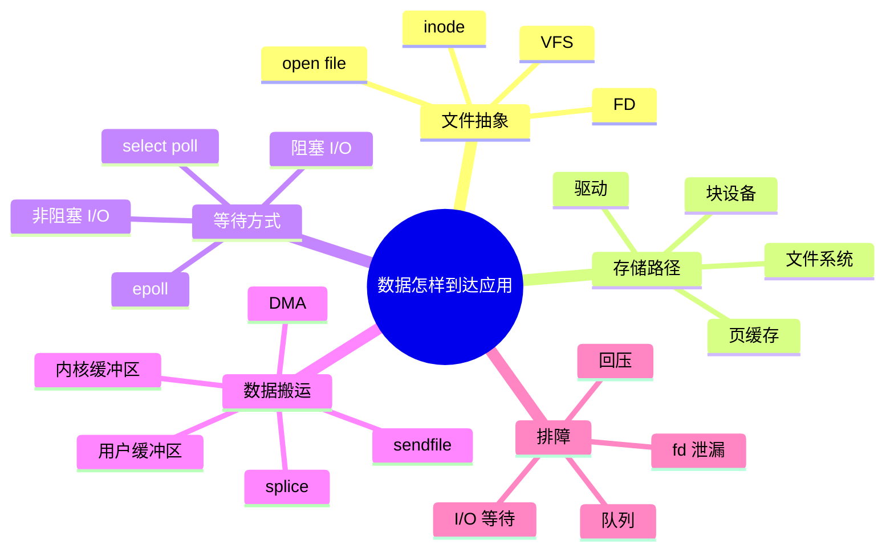
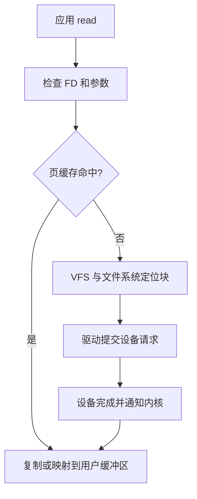

# 文件系统、I/O、epoll 与零拷贝

应用读写文件或网络时，面对的是统一的文件描述符（file descriptor，FD）接口，底层却可能是磁盘、管道、终端或 Socket。操作系统负责把这些抽象对象连接到驱动和设备，并决定线程是否等待、数据是否经过缓存以及何时通知应用。

## 本章知识地图



## 一、文件描述符是进程引用资源的句柄

进程通过 `open`、`socket`、`pipe` 等操作获得一个小整数。这个整数是文件描述符，只在当前进程的描述符表中有意义；内核再通过它找到打开文件状态、访问位置、权限和底层对象。

同一打开文件状态可能被 `dup`、fork 或多个描述符共享，因此两个描述符可能共享文件偏移量；重新 `open` 同一路径则通常得到独立的打开状态。关闭一个 FD 只减少一次引用，底层对象是否释放要看是否还有其他引用。

VFS（Virtual File System，虚拟文件系统）为不同文件系统提供统一操作接口。路径解析得到 inode（文件元数据对象）和目录项，读写再交给具体文件系统和块设备。“一切皆文件”表示许多对象可以使用相似的 FD 接口，不代表它们都支持相同语义。

## 二、一次文件读取经过哪些层

应用调用 `read(fd, buf, n)` 后，内核先检查 FD 和用户缓冲区，再查询页缓存。命中时，内核可以把数据复制到用户缓冲区并返回；未命中时，文件系统把逻辑文件位置转换为块设备请求，驱动和设备完成读取后唤醒等待线程。



页缓存降低重复读取的设备访问，但脏数据需要按策略回写。`write` 返回通常只表示数据已被内核接受，不一定表示已经持久化到介质；需要特定同步语义时，应使用 `fsync` 等接口并理解文件系统和设备的保证。

## 三、阻塞和非阻塞描述等待行为

阻塞 I/O 在数据暂时不可用时让当前线程睡眠，数据准备好后再唤醒；非阻塞 I/O 立即返回“当前不能完成”的结果，应用稍后重试或等待事件。非阻塞不会让磁盘或网络变快，它只是把等待控制权交给应用。

阻塞调用简单，但一个线程若负责多个慢设备，可能被其中一个请求拖住。非阻塞配合事件循环可以让少量线程管理大量连接，不过应用必须处理部分读写、错误、关闭和回压。

## 四、select、poll 和 epoll

I/O 多路复用让线程一次等待多个 FD 的就绪事件。`select` 传递并扫描 FD 集合，并受描述符数量限制；`poll` 使用数组描述集合，仍可能扫描大量无关 FD。epoll（event polling，事件轮询机制）由内核维护关注集合和就绪队列，应用等待时主要取得已经就绪的对象。

```text
注册：epoll_ctl(ADD, fd)
等待：epoll_wait()
处理：只读取返回的就绪 fd
修改或删除：epoll_ctl(MOD/DEL, fd)
```

水平触发表示只要仍有未处理数据就持续通知；边缘触发表示从未就绪变为就绪时通知一次，应用必须循环读到 `EAGAIN`，否则可能错过后续处理。一次 `epoll_wait` 返回就绪并不保证下一次 `read` 一定成功，状态可能已被其他线程消耗。

epoll 减少的是等待大量无关 FD 的扫描开销，不会消除设备等待、数据复制、锁竞争和业务处理时间。事件循环仍需要公平性和背压策略，避免一个活跃连接长期占满处理时间。

## 五、Socket 读写与回压

Socket 接收缓冲保存已到达但应用尚未读取的数据，发送缓冲保存应用已经提交但内核尚未发送完成的数据。缓冲满时，发送方可能阻塞、返回短写或收到可重试错误；接收方处理太慢还会让对端看到更小的接收窗口。

应用必须把 `write` 当作可能只完成一部分的操作，并记录未发送的剩余数据。读取也可能只得到部分消息，应用协议需要自行处理边界。无限增大缓冲不能解决生产速度长期高于消费速度的问题，最终仍需要限速、排队或拒绝。

## 六、零拷贝优化数据路径

普通的文件到网络发送可能经历设备 DMA（Direct Memory Access，直接内存访问）到内核页缓存、内核复制到用户缓冲区、用户再复制回内核发送缓冲、网卡再次读取。每次复制都消耗内存带宽和 CPU 缓存。

`sendfile`、`splice` 等机制可以减少用户态参与和复制次数，让数据更直接地从页缓存进入网络发送路径。零拷贝不是完全没有拷贝，也不是所有小文件、加密或压缩场景都更快；评估应测量 CPU、内存带宽、系统调用次数、吞吐和尾延迟。

## 七、文件持久化

应用写入经历用户缓冲、内核页缓存、文件系统日志或元数据更新、块设备缓存和介质落盘等阶段。应用看到 `write` 成功，可能只代表数据进入内核；`fsync` 等调用请求更强的持久化，但具体保证仍受文件系统、设备和错误处理影响。

崩溃一致性关注重启后文件内容和目录结构是否满足约束。数据库常用 WAL（Write-Ahead Logging，预写日志）先记录恢复信息，再更新数据。不要用“已经写入内存”回答“断电后是否一定存在”。

## 八、排障

I/O 变慢时，先确认是应用等待、内核排队、设备延迟还是上游回压。`lsof -p <pid>` 查看进程打开的 FD，`strace -T` 观察系统调用耗时，`iostat -x` 观察设备队列，`ss -tin` 查看 Socket 状态。

```sh
lsof -p <pid>
strace -T -p <pid>
iostat -xz 1
ss -s
```

FD 数量增加可能是泄漏，也可能是连接池扩张；设备利用率高不一定说明 CPU 不足；发送队列增长通常提示对端、网络或应用消费速度形成回压。每个判断都应结合基线和时间窗口。

## 常见误区

文件描述符只是句柄，不等于文件内容，也不保证每次读写都访问物理磁盘。非阻塞 I/O 不会消除等待，epoll 也不会自动处理消息边界。零拷贝减少数据搬运，不代表没有内核、设备或加密处理。“写成功”不等于断电后一定存在。

## 面试表达

先说明 FD 把进程连接到内核对象，再沿文件读取路径区分页缓存、文件系统、驱动和设备。阻塞与非阻塞描述线程等待方式，多路复用让一个线程等待多个 FD，epoll 主要利用就绪队列减少无效扫描。零拷贝通过 sendfile 等机制减少用户态往返和复制，但仍需结合设备、加密和回压测量。

## 理解检查

1. 两个 FD 为什么可能共享同一个文件偏移量？
2. 页缓存命中时，为什么仍可能有用户态复制？
3. epoll 的边缘触发为什么要求循环读到 EAGAIN？
4. 发送缓冲增长说明了哪一类回压？
5. 为什么 `write` 成功不等于数据已经持久化？

## 可观察实验

用一个小型 TCP 服务分别采用阻塞线程模型和非阻塞 epoll 模型，观察连接数、线程数和系统调用；再用 `sendfile` 与用户态读写传输同一文件，比较 CPU 使用、吞吐和尾延迟。实验时控制文件大小、缓存状态和并发连接。

## 术语卡片

| 缩写 | 英文全称 | 中文名称 | 本章作用 |
|------|----------|----------|----------|
| FD | File Descriptor | 文件描述符 | 进程引用内核资源的句柄 |
| VFS | Virtual File System | 虚拟文件系统 | 统一文件系统接口 |
| I/O | Input/Output | 输入输出 | 应用与设备交换数据 |
| DMA | Direct Memory Access | 直接内存访问 | 设备和内存间搬运数据 |
| WAL | Write-Ahead Logging | 预写日志 | 在数据更新前记录恢复信息 |
