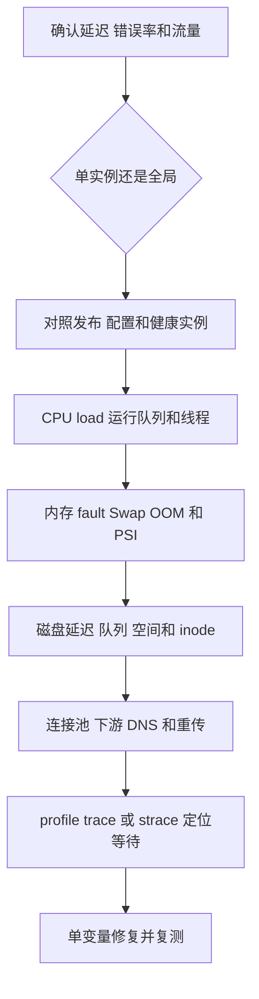

# Linux 观测与故障定位

系统知识最终要能解释真实现象。排障不是背命令，而是根据症状建立假设，再用证据排除。

## 从四个问题开始

1. **影响是什么**：延迟、吞吐、错误率还是资源耗尽？
2. **范围多大**：单请求、单进程、单机、某机房还是全局？
3. **何时开始**：与发布、流量、配置、依赖变化是否相关？
4. **瓶颈在哪层**：CPU、内存、磁盘、网络、锁、下游还是业务逻辑？

先保留现场和时间线，再做可能改变现象的操作。

## USE 方法

对每种资源检查：

- Utilization：利用率。
- Saturation：是否有排队或等待。
- Errors：错误。

例如 CPU 不能只看使用率，还要看运行队列、steal、上下文切换和硬件错误。

## CPU

### 快速观察

```bash
uptime
top
mpstat -P ALL 1
pidstat -u -p <pid> 1
```

关注：

- user/system/iowait/steal。
- 每核是否均衡。
- load average 与可运行/不可中断任务。
- 进程和线程 CPU。

load average 不是纯 CPU 使用率，它通常包含可运行和不可中断等待任务。

### 找热点

```bash
perf top
perf record -g -p <pid> -- sleep 30
perf report
```

高 CPU 可能来自：

- 正常计算热点。
- 无限循环。
- 锁自旋。
- 频繁系统调用。
- GC。
- 序列化或压缩。

## 上下文切换与调度

```bash
vmstat 1
pidstat -w -p <pid> 1
ps -eLo pid,tid,psr,stat,pcpu,comm
```

线程太多可能增加：

- 上下文切换。
- 运行队列。
- 栈内存。
- 锁竞争。
- Cache 扰动。

不要只因为“CPU 没满”就继续加线程。

## 内存

```bash
free -h
vmstat 1
cat /proc/meminfo
pmap -x <pid>
cat /proc/<pid>/smaps
```

需要区分：

- 虚拟地址空间 VSZ。
- 驻留物理页 RSS。
- 匿名内存。
- 文件映射和共享页。
- page cache。
- Swap 与换入换出。

Linux 的 free 很小不一定内存不足，available 和可回收缓存更有意义。

### 内存问题模式

- RSS 持续增长：泄漏、缓存无界、工作集增长。
- major fault 增多：频繁从存储调页。
- swap in/out 持续：内存压力和抖动。
- OOM kill：查看内核日志和 cgroup 限制。

容器内存限制与宿主机总内存是不同边界。

## 磁盘与文件 I/O

```bash
iostat -xz 1
pidstat -d -p <pid> 1
iotop
lsof -p <pid>
df -h
df -i
```

关注：

- 吞吐和 IOPS。
- 平均/尾延迟。
- 队列深度。
- 设备利用率。
- 文件系统空间与 inode。

高 iowait 表示 CPU 有时间在等待 I/O 的任务，但解释需结合运行队列和设备指标。

## 系统调用

```bash
strace -c -p <pid>
strace -ttT -f -p <pid>
```

- `-c` 汇总次数和耗时。
- `-T` 显示单次调用时间。
- `-f` 跟踪线程/子进程。

strace 有开销，生产环境需控制时间和范围。

典型发现：

- 小块 read/write 过多。
- 重复 open/stat。
- 锁等待 futex。
- DNS 或网络 connect 超时。
- epoll_wait 与业务处理比例异常。

## 文件描述符

```bash
ls /proc/<pid>/fd | wc -l
cat /proc/<pid>/limits
lsof -p <pid>
```

fd 持续增长可能是文件、Socket、pipe 或 eventfd 泄漏。达到上限会出现 too many open files。

## 网络相关系统视角

```bash
ss -s
ss -tanp
ip -s link
ethtool -S <interface>
```

关注连接状态、listen/accept 队列、重传、丢包和网卡错误。完整网络排障在网络课程展开。

## 日志和时间线

```bash
journalctl --since "10 minutes ago"
dmesg -T
```

检查：

- OOM。
- 磁盘/文件系统错误。
- 网卡 link reset。
- 进程崩溃。
- 内核限流或 cgroup 事件。

所有节点时钟需要同步，否则跨服务时间线会误导。

## 一个“接口突然变慢”的排查顺序



1. 看监控确认延迟分位数、错误率、流量变化。
2. 判断单实例还是全局，是否与发布重合。
3. 看 CPU、load、运行队列、GC 和线程。
4. 看内存、fault、Swap、OOM。
5. 看磁盘延迟、队列和空间。
6. 看连接池、下游依赖、DNS、重传。
7. 用 profile、trace 或 strace 定位具体等待。
8. 做单变量对照实验验证假设。

不要一上来重启；重启可能清除最有价值的现场。

## 观测的边界

- 平均值会掩盖尾延迟。
- 高相关不等于因果。
- 工具本身有采样和探针开销。
- 容器指标、进程指标、宿主机指标口径不同。
- 单次快照无法解释趋势。

## 常见误区

- load average 高不等于 CPU 一定已满。
- free 很少不等于可用内存已经耗尽，应结合 available 和回收能力。
- iowait 高只能说明存在等待 I/O 的 CPU 时间，不能单独定位具体设备或进程。
- 单个时间点的 top 截图不能代替趋势和对照实验。
- 看到相关指标同时变化不能直接认定因果关系。
- 重启可能暂时恢复服务，也可能清除泄漏、队列和锁竞争等关键现场。

## 面试表达

**Linux 服务 CPU 很高怎样排查？**

> 先确认影响范围、流量和发布时间，再区分 user、system、iowait、steal 以及是否单核热点；用 pidstat/top 找进程线程，用 perf/profile 定位热点函数，同时看上下文切换、锁竞争、GC 和系统调用。最后用相同负载复现并验证优化，不能只凭 top 直接下结论。

**追问链**

1. load 很高但 CPU 不高可能是什么？
2. free 很少为什么不一定内存不足？
3. RSS 与 VSZ 有什么区别？
4. iowait 高说明什么，不能说明什么？
5. strace 和 perf 分别观察什么？
6. fd 泄漏怎样确认？

## 实战练习

在练习前，先建立一套可以迁移到不同工具和环境的排障方法。

---

## 深入一：观测、监控、诊断与修复

### 1. Monitoring

**直译**：监控。

持续收集和展示系统状态：

- 指标。
- 日志。
- Trace。
- 事件。
- 告警。

### 2. Observability

**直译**：可观测性。

根据系统外部输出推断内部状态的能力。工程上不只是“装了监控”，而是能否回答：

- 哪一层慢。
- 从什么时候开始。
- 影响哪些请求。
- 什么资源或依赖发生变化。
- 哪条证据支持根因。

### 3. Diagnosis

**直译**：诊断。

从症状提出多个可能原因，再用证据逐步排除。

### 4. Mitigation

**直译**：缓解。

先降低用户影响，例如：

- 限流。
- 扩容。
- 熔断下游。
- 回滚发布。
- 切走故障节点。

缓解不等于根因修复。

### 5. Root Cause

**直译**：根因。

根因不是最后看到的一个异常指标，而是能够解释：

- 为什么故障发生。
- 为什么在那个时间发生。
- 为什么只影响特定范围。
- 修复后为什么不会以同样机制复发。

### 6. 不要从工具开始

错误路径：

```text
接口慢
  -> 随便执行 top
  -> 看到一个高值
  -> 直接认定根因
```

正确路径：

```text
定义症状和范围
  -> 建立假设
  -> 选择能区分假设的证据
  -> 采集同一时间窗口
  -> 验证或排除
  -> 单变量修复
  -> 再验证
```

---

## 深入二：先定义问题

### 1. 影响指标

明确是：

- 延迟上升。
- 吞吐下降。
- 错误率上升。
- 部分请求超时。
- 进程崩溃。
- 资源耗尽。
- 数据错误。

不同症状指向不同证据。

### 2. 时间范围

记录：

- 首次发生时间。
- 持续还是周期性。
- 是否每天同一时刻。
- 是否与发布、扩容、备份、批任务相关。
- 故障前多久已有先兆。

### 3. 空间范围

逐级缩小：

```text
所有用户？
某地区？
某 API？
某版本？
某 Pod？
某节点？
某 CPU 核？
某线程？
```

范围本身就是重要线索。

### 4. 对照组

找健康对照：

- 同服务其他实例。
- 同节点其他进程。
- 发布前版本。
- 相同请求不同地区。
- 同一程序不同时间窗口。

没有对照，很难判断一个值是异常还是正常基线。

### 5. 最近变化

检查：

- 代码发布。
- 配置改变。
- 流量结构。
- 数据量。
- 依赖版本。
- 节点迁移。
- 内核或运行时升级。
- Cgroup 限制。

相关变化是线索，不自动等于根因。

---

## 深入三：USE、RED 与四个黄金信号

### 1. USE

对每个资源检查：

- **Utilization**：使用比例。
- **Saturation**：是否排队或等待。
- **Errors**：错误。

资源包括：

- CPU。
- 内存。
- 磁盘。
- 网络链路。
- 线程池。
- 连接池。

### 2. 为什么 utilization 不够

CPU 80% 可能已经有单核 100%。

磁盘利用率不高可能仍有少数高尾延迟。

连接池使用率 100% 时，真正问题是请求排队和超时。

所以必须同时看 saturation。

### 3. RED

面向请求服务：

- **Rate**：请求速率。
- **Errors**：错误数/率。
- **Duration**：请求耗时分布。

### 4. 四个黄金信号

常见 SRE 视角：

- 延迟。
- 流量。
- 错误。
- 饱和度。

### 5. USE 与 RED 怎样组合

```text
RED 先确认用户症状
  -> 哪个请求慢、错、量变
USE 再检查支撑资源
  -> CPU、内存、磁盘、网络、池
```

不要只看资源健康而忽略用户请求，也不要只看请求慢而不知道底层资源。

---

## 深入四：基线、趋势与分位数

### 1. Baseline

**直译**：基线。

同一指标在正常条件下的典型范围：

- 工作日白天。
- 夜间批处理。
- 周末。
- 不同流量档位。

没有基线就很难判断“load 10”是否异常，因为 64 核机器与 2 核容器含义完全不同。

### 2. Trend

**直译**：趋势。

单点快照无法区分：

- 瞬时尖峰。
- 持续增长。
- 周期波动。
- 故障后的恢复。

### 3. Average 的陷阱

100 个请求：

- 99 个 10 ms。
- 1 个 10 s。

平均约 110 ms，看不出最慢用户经历 10 秒。

### 4. Percentile

- p50：中位体验。
- p95：较慢 5% 边界。
- p99：较慢 1% 边界。
- max：容易受单样本影响。

尾延迟常受：

- GC。
- 缺页。
- 锁等待。
- 重传。
- 队列。
- 调度抖动。

### 5. 直方图

分位数应从合理直方图或原始分布计算。不同实例已经聚合的分位数不能简单再平均得到全局分位数。

---

## 深入五：CPU 指标

### 1. user

CPU 执行用户态代码的时间比例：

- 业务计算。
- 序列化。
- 压缩。
- GC 用户态工作。
- 用户态自旋。

### 2. system

CPU 执行内核态工作的时间：

- 系统调用。
- 网络栈。
- 文件系统。
- 调度。
- 内核内存管理。

system 高需要继续找具体系统调用和内核路径。

### 3. idle

CPU 没有可运行工作时的空闲比例。

### 4. iowait

常见统计中，CPU 空闲且系统存在未完成 I/O 时计为 iowait。

它不能单独说明：

- 哪个进程在等。
- 哪个设备慢。
- 所有 CPU 都被 I/O 限制。
- 设备已 100% 饱和。

必须结合设备、任务状态和队列。

### 5. steal

虚拟化环境中，vCPU 想运行但物理 CPU 被 Hypervisor 用于其他工作的一部分时间。

steal 高可能指向宿主资源争用。

### 6. irq/softirq

处理中断和延后中断工作的 CPU 时间：

- 网络包速率很高。
- 设备中断集中。
- 中断风暴。

应结合网卡队列、丢包和 CPU 分布。

### 7. 每核视角

总 CPU 25% 在 4 核机器上可能表示：

```text
一个核心 100%
其他三个核心空闲
```

单线程热点、亲和性或锁串行化都可能出现这种情况。

---

## 深入六：load average

### 1. load 不是 CPU 百分比

Linux load average 通常统计：

- 可运行任务。
- 某些不可中断等待任务。

它表示任务需求/队列的时间平均，不是纯 CPU 利用率。

### 2. 三个数字

`uptime` 常显示：

```text
1 分钟、5 分钟、15 分钟 load average
```

它们是指数移动平均意义上的负载趋势，不是过去窗口简单算术平均。

### 3. 怎样结合 CPU 数

粗略直觉：

- 1 个 CPU 上 load 1 表示接近一个任务需求。
- 8 个 CPU 上 load 8 才是类似规模。

但 Cgroup 配额、不可中断等待和任务类型会改变解释。

### 4. load 高、CPU 高

可能：

- CPU 饱和。
- 运行队列很长。
- 线程过量。
- 忙循环。

### 5. load 高、CPU 不高

可能：

- 大量 `D` 状态任务。
- 存储或网络文件系统等待。
- 某些内核资源等待。
- 容器视角和宿主指标口径不一致。

### 6. load 低、接口仍慢

可能：

- 下游网络等待。
- 单线程/单核瓶颈。
- 锁或连接池排队。
- 超时配置。
- 请求量很低但每次都慢。

---

## 深入七：CPU 排查流程

### 1. 第一步：确认用户影响

- 请求 rate 是否变化。
- p95/p99 是否升高。
- 错误是否增加。
- 是所有实例还是个别实例。

### 2. 第二步：拆 CPU 状态

```bash
mpstat -P ALL 1
```

看：

- user。
- system。
- iowait。
- steal。
- 每核是否均衡。

### 3. 第三步：找进程与线程

```bash
pidstat -u -p ALL 1
top -H -p <pid>
ps -eLo pid,tid,psr,stat,pcpu,comm
```

### 4. 第四步：找代码热点

```bash
perf top
perf record -g -p <pid> -- sleep 30
perf report
```

### 5. 第五步：判断等待或自旋

- user 高且热点在业务函数：计算。
- user 高且热点在锁循环：自旋。
- system 高且频繁 syscall：内核路径。
- CPU 不高但线程阻塞：看锁、I/O 和下游。

### 6. 第六步：验证

- 用相同负载复现。
- 单独修改热点。
- 比较吞吐、延迟和 CPU/请求。
- 确认没有把成本转移到其他资源。

---

## 深入八：调度与线程

### 1. 运行队列

可运行线程多于 CPU：

- 等待时间增加。
- 响应延迟上升。
- 上下文切换增加。

### 2. cs

`vmstat` 中上下文切换计数提供系统总体线索，但不说明：

- 哪个进程导致。
- 主动还是被抢占。
- 是否真的异常。

### 3. voluntary

线程主动等待：

- I/O。
- 锁。
- 条件变量。
- 定时器。

### 4. nonvoluntary

线程被抢占：

- 时间片结束。
- 更高优先级任务。
- CPU 竞争。

### 5. 线程多的成本

- 每线程栈。
- 调度对象。
- 运行队列。
- 锁竞争。
- Cache/TLB 扰动。
- PID Cgroup 限制。

### 6. CPU 没满为什么也不该盲目加线程

瓶颈可能是：

- 串行锁。
- 数据库连接池。
- 下游限流。
- 内存带宽。
- 单核事件循环。

增加线程只会增加排队或竞争。

---

## 深入九：内存指标

### 1. total/free/available

- total：系统可管理内存总量相关统计。
- free：完全未使用页面。
- available：估计无需严重换页可供新应用使用的内存。

Linux 会用空闲内存做缓存，所以 free 小很常见。

### 2. Buffers 与 Cached

不同工具和内核版本口径不同。核心是：

- 文件 page cache 可按需回收。
- 不是所有缓存都等价于“浪费”。
- 回收速度和脏页比例很重要。

### 3. VSZ

虚拟地址空间大小：

- 包含未驻留映射。
- 共享库。
- 稀疏区域。

### 4. RSS

常驻物理页：

- 包含匿名与文件页。
- 可能包含共享页。
- 不等于独占内存。

### 5. PSS 与 USS

- PSS：共享页按比例分摊。
- USS：进程独占驻留页。

比简单相加 RSS 更适合某些归属分析。

### 6. Anonymous 与 File-backed

- 匿名内存：堆、栈等，无普通文件后备。
- 文件映射：可来自可执行文件、共享库和 mmap。

回收策略和可重新读取能力不同。

### 7. Active/Inactive

内核通过活跃度近似决定页面回收候选。名称和算法不应机械等同精确 LRU。

---

## 深入十：内存故障模式

### 1. 内存泄漏

进程持续保留已经不再需要的对象：

- RSS 或堆使用随负载持续上升。
- GC 后基线不回落。
- 最终触发 OOM 或频繁 GC。

### 2. 无界缓存

缓存有业务用途，但没有：

- 容量上限。
- TTL。
- 淘汰策略。
- 按内存压力收缩。

它表现得像泄漏，但对象仍可由业务路径引用。

### 3. 碎片

总空闲空间存在，但难以满足所需布局或无法整页归还：

- 分配器内部碎片。
- 外部碎片。
- 大页分配困难。

### 4. major fault

目标页需要存储 I/O：

- 文件冷页。
- Swap 中匿名页。

持续增多且延迟上升可能说明工作集不适配内存。

### 5. swap in/out

短暂 swap 使用不一定故障；持续换入换出和吞吐下降才更像 thrashing。

### 6. OOM

查看：

- 内核日志。
- Cgroup memory events。
- 容器状态和退出码。
- 哪个进程被选择。
- 触发前 RSS、page cache 和 working set。

### 7. 内存涨不等于泄漏

可能是：

- 正常业务缓存预热。
- 流量或数据量增加。
- JIT/运行时初始化。
- page cache 增长。
- 分配器保留空闲页。

必须看增长是否有界、能否回落以及对象/映射构成。

---

## 深入十一：PSI

### 1. Pressure Stall Information

**直译**：压力停顿信息。

PSI 关注任务因资源不足而停顿的时间：

- CPU。
- memory。
- I/O。

### 2. some 与 full

概念上：

- some：至少部分任务因资源压力停顿。
- full：所有非空闲相关任务都在该资源上停顿。

具体可用字段依资源类型和内核接口。

### 3. PSI 的价值

利用率只显示资源忙不忙，PSI 更接近：

- 资源压力是否实际阻碍任务推进。
- 停顿是否持续。
- 是否适合触发扩容或保护。

### 4. PSI 不是根因

Memory pressure 高还要继续区分：

- 谁占内存。
- 是否回收。
- 是否 Swap。
- Cgroup 限制。
- 工作集或泄漏。

---

## 深入十二：磁盘与文件系统

### 1. IOPS

**Input/Output Operations Per Second。**

每秒 I/O 操作次数。

小随机 I/O 常受 IOPS 限制。

### 2. Throughput

每秒传输数据量。大顺序 I/O 更容易接近带宽上限。

### 3. Latency

单个 I/O 从提交到完成时间，需关注平均和尾延迟。

### 4. Queue Depth

设备或软件栈中同时排队的请求数：

- 一定并行度可提高吞吐。
- 过长队列会增加等待和尾延迟。

### 5. Utilization

设备利用率接近高值不自动说明故障：

- 可能高效满负荷。
- 多队列设备的统计解释更复杂。
- 最终看是否排队、延迟升高和业务受影响。

### 6. `df -h` 与 `df -i`

- `df -h`：数据块空间。
- `df -i`：inode 数量。

大量小文件可先耗尽 inode，即使容量仍有剩余。

### 7. 已删除文件仍占空间

进程仍持有打开 fd：

- 目录名已经删除。
- inode 和数据仍被引用。
- `df` 空间不释放。

可通过 lsof 查找 deleted 但仍打开的文件。

### 8. I/O 排查链

```text
业务延迟
  -> 是否 I/O wait/PSI
  -> 哪个进程读写
  -> 哪个设备
  -> 延迟、队列、吞吐
  -> 顺序还是随机
  -> page cache 命中
  -> 文件系统/设备错误
```

---

## 深入十三：系统调用与 strace

### 1. strace 观察什么

系统调用边界：

- 调用了什么。
- 参数和返回值。
- 错误码。
- 调用耗时。
- 阻塞在哪里。

### 2. 常见线索

#### 小 I/O 过多

大量小 `read/write`：

- 系统调用次数高。
- 固定开销大。
- 可考虑缓冲或批量。

#### 重复元数据查询

大量 `openat/stat/access`：

- 路径解析频繁。
- 可能缺缓存或有轮询。

#### Futex

长时间或大量 `futex`：

- 可能锁等待。
- 也可能是正常条件变量和运行时行为。

需要结合线程栈和业务吞吐。

#### connect

慢 `connect`：

- 网络不可达。
- SYN 重传。
- 防火墙丢包。
- 目标 backlog/负载。

#### epoll_wait

长时间 `epoll_wait`：

- 服务可能只是没有事件，属于正常空闲。
- 若请求明明到达却没被处理，再看网络、fd 注册和事件循环。

### 3. strace 的扰动

- 每次系统调用跟踪有开销。
- 高频程序输出量巨大。
- 可能改变时序问题。
- 敏感参数可能被记录。

生产环境应限制：

- 目标进程。
- 跟踪系统调用类型。
- 持续时间。
- 输出位置。

### 4. strace 看不到什么

- 纯用户态热点内部细节。
- CPU 指令级瓶颈。
- 业务函数调用关系。

这些更适合 profiler/perf。

---

## 深入十四：perf 与火焰图思维

### 1. Sampling

**直译**：采样。

定期记录程序当时在哪个指令/调用栈：

- 样本越多的位置通常消耗 CPU 越多。
- 不必记录每次函数调用。
- 开销相对可控。

### 2. perf stat

适合整体计数：

- cycles。
- instructions。
- IPC。
- branches。
- branch-misses。
- cache-misses。
- context-switches。

### 3. perf record/report

适合找到：

- 热点函数。
- 调用路径。
- 用户态与内核态热点。

### 4. Off-CPU

CPU profile 只看到正在运行的代码。请求慢可能大部分时间：

- 等锁。
- 等 I/O。
- 等调度。
- 等下游。

需要 off-CPU、trace 或等待事件视角。

### 5. 火焰图怎样读

- 宽度表示样本占比，不是时间轴。
- 纵向表示调用栈深度。
- 宽的平台表示常见调用路径。
- 不能只看函数名字，要看上下文和采样类型。

---

## 深入十五：文件描述符与任务限制

### 1. fd 泄漏

表现：

- `/proc/<pid>/fd` 数量持续增长。
- 最终 `EMFILE`。
- 新文件、Socket 或 pipe 创建失败。

### 2. 找类型

`lsof` 或 fd 符号链接可区分：

- 普通文件。
- Socket。
- pipe。
- eventfd。
- 匿名 inode。

### 3. soft 与 hard limit

- soft limit：进程当前受限值，可在允许范围调整。
- hard limit：普通进程提高 soft 的上限。

提高上限只能缓解容量，不会修复泄漏。

### 4. 线程/PID 限制

Linux 线程也是任务：

- 线程泄漏可耗尽任务数。
- Cgroup pids limit 可先于系统总 PID 用尽。
- 新线程创建失败时不只检查内存。

---

## 深入十六：网络的系统视角

### 1. Socket 状态

`ss` 可看：

- LISTEN。
- ESTABLISHED。
- SYN-SENT/SYN-RECV。
- TIME-WAIT。
- CLOSE-WAIT。

状态分布能提示连接建立、关闭和应用生命周期问题。

### 2. Listen/accept 队列

服务端连接建立后仍需应用 accept：

- 队列满可能丢弃或拒绝新连接。
- 应用线程慢、CPU 饱和或锁竞争都可能导致 accept 不及时。

### 3. Retransmission

TCP 重传增加：

- 丢包。
- 路径拥塞。
- 网卡/队列问题。
- 对端处理或 ACK 延迟。

要结合网络课程和抓包进一步分析。

### 4. 网卡错误

`ip -s link`、`ethtool -S` 等可看：

- drop。
- error。
- queue 统计。
- 驱动/硬件计数。

字段依驱动不同，名称不能跨设备机械比较。

### 5. 端口耗尽

大量主动短连接可能消耗临时端口：

- TIME_WAIT 多。
- 连接创建失败。
- NAT/负载均衡设备也可能有端口状态限制。

根治通常是连接复用、池化和合理架构，不是随意缩短协议安全时间。

---

## 深入十七：日志与时间线

### 1. 日志必须包含什么

- 时间戳和时区。
- 请求/Trace ID。
- 服务、实例和版本。
- 错误类型。
- 关键上下文。

### 2. 时钟同步

跨机器时间不同会导致：

- 因果顺序错乱。
- Trace 跨度异常。
- 发布与故障时间对不上。

### 3. 内核日志

可发现：

- OOM kill。
- 文件系统错误。
- 块设备超时。
- 网卡重置。
- 驱动问题。

### 4. 日志本身也可能造成故障

- 同步写日志阻塞请求。
- 日志量暴增打满磁盘。
- 格式化消耗 CPU。
- 高基数字段导致存储爆炸。

### 5. 保留现场

变更前记录：

- 时间窗口。
- 进程 PID 和启动时间。
- 配置与版本。
- 指标截图/导出。
- 线程栈和 profile。
- 内核日志。

重启会清掉部分关键现场。

---

## 深入十八：容器与 Cgroup

### 1. 容器 CPU

要同时看：

- 容器使用量。
- CPU request/limit。
- Cgroup quota。
- throttling 时间/次数。
- 宿主机每核负载。

CPU 使用看似没到宿主总量，也可能已经触碰容器配额。

### 2. CPU throttling

容器在配额周期内用完预算后：

- 可运行线程仍有工作。
- 但必须等待下个周期。
- 请求尾延迟可能出现周期性尖刺。

### 3. 容器内存

要区分：

- 工作集。
- 匿名内存。
- 文件缓存。
- Cgroup limit。
- memory events。
- 宿主机整体压力。

### 4. 容器 OOM

Pod 显示 OOMKilled 时检查：

- 限制是否合理。
- 峰值还是持续增长。
- 哪个容器。
- 应用堆上限是否感知容器限制。
- page cache 和非堆内存。

### 5. 容器与宿主指标口径

容器内命令可能看到：

- Namespace 过滤后的对象。
- 与宿主不同的 CPU 数视图。
- Cgroup 限制。

不同运行时与内核版本暴露方式不同，排障要明确观测位置。

### 6. Pod 级范围

同一 Pod 的 sidecar 也会：

- 消耗 CPU/内存。
- 写磁盘。
- 建立网络连接。
- 影响共享网络 Namespace。

不能只看主容器。

---

## 深入十九：四类完整案例

### 案例一：CPU 突然升高

```text
确认请求率和延迟
  -> user/system/steal 哪项升高
  -> 每核是否均衡
  -> 找进程和线程
  -> profile 热点
  -> 看锁、GC、系统调用
  -> 对照发布和输入
  -> 修复后复测 CPU/请求
```

可能根因：

- 新算法退化。
- 序列化热点。
- 日志暴增。
- 锁自旋。
- 重试风暴。
- 流量上升。

### 案例二：RSS 持续增长

```text
确认 VSZ/RSS/PSS
  -> 匿名还是文件映射
  -> 堆、线程栈、mmap、page cache
  -> GC 后是否回落
  -> 对象/分配 profile
  -> 与流量、缓存键数量对照
  -> 看 Cgroup limit 和 OOM 事件
```

可能根因：

- 对象泄漏。
- 无界缓存。
- 线程泄漏。
- 分配器碎片。
- 映射未释放。
- 正常工作集增长。

### 案例三：磁盘延迟升高

```text
业务慢是否与 I/O 同时
  -> 哪个进程读写
  -> 哪个设备
  -> IOPS、带宽、队列、延迟
  -> 顺序/随机、读/写
  -> 脏页和写回
  -> 文件系统空间/inode
  -> 内核与设备错误
```

可能根因：

- 批任务争用。
- 大量 fsync。
- 随机小 I/O。
- 设备故障。
- page cache 抖动。
- 文件系统空间或 inode 耗尽。

### 案例四：接口 p99 变慢但 CPU 不高

```text
按 Trace 拆服务时间
  -> 连接池/线程池排队
  -> 下游调用
  -> DNS/TCP/TLS
  -> 锁等待
  -> major fault / I/O
  -> Cgroup throttling
  -> 单核热点
```

可能根因：

- 下游尾延迟。
- 连接池耗尽。
- 少量锁长持有。
- 网络重传。
- 周期性 GC。
- CPU quota 节流。

---

## 深入二十：排障报告怎样写

### 1. 现象

写清：

- 起止时间。
- 影响范围。
- 用户指标。
- 错误特征。

### 2. 证据

每条结论给：

- 指标或日志。
- 时间对齐。
- 健康对照。
- 排除项。

### 3. 根因链

例如：

```text
新版本引入无界缓存
  -> RSS 持续增长
  -> 触碰 Cgroup limit
  -> 内存回收和 major fault 增加
  -> 请求 p99 上升
  -> 最终 OOMKilled
```

### 4. 缓解与修复

区分：

- 临时扩容/回滚。
- 代码根治。
- 监控告警补充。
- 容量和压测改进。

### 5. 验证

- 相同负载复现。
- 指标恢复。
- 不再触发原链路。
- 没有新回归。

---

## 补充面试题：直接背诵

### Q1：服务慢怎样开始排查

> 先定义影响指标、范围和开始时间，对照流量、发布与健康实例；再用 RED 判断请求的速率、错误和耗时，用 USE 检查 CPU、内存、磁盘、网络和池的利用率、饱和度与错误。形成多个假设后选择能区分它们的证据，不从单个 top 值直接下结论。

### Q2：load 高但 CPU 不高可能是什么

> Linux load 通常包含可运行任务和部分不可中断等待任务，不是 CPU 百分比。CPU 不高而 load 高可能有大量 D 状态任务等待存储、网络文件系统或内核路径，也可能有容器与宿主指标口径差异，应结合任务状态、wchan、I/O 和 PSI。

### Q3：free 很小为什么不一定内存不足

> Linux 会把暂时空闲内存用于 page cache，这些缓存许多可以按需回收。应看 available、匿名内存、工作集、回收、fault、Swap 和 PSI；free 小本身不能证明内存已经耗尽。

### Q4：RSS 持续增长一定是泄漏吗

> 不一定。可能是缓存预热、流量或数据增长、JIT、线程栈、page cache、mmap 或分配器保留。要拆匿名与文件映射，观察 GC 后和低负载时是否回落，结合对象/分配 profile 及 Cgroup 限制确认。

### Q5：iowait 高说明什么

> 它说明统计周期中 CPU 处于特定空闲且系统存在未完成 I/O 的状态，是 I/O 等待线索；不能单独指出哪个进程或设备，也不能独自证明设备饱和。还要看每设备延迟、队列、吞吐、任务状态和业务时间线。

### Q6：strace 与 perf 的区别

> strace 观察系统调用、返回值、错误和阻塞时间，适合找 I/O、futex、connect 等内核边界问题；perf 可用采样和硬件计数器找用户态/内核态 CPU 热点、IPC、分支和 Cache 行为。纯用户态热点通常不会被 strace 展开。

### Q7：上下文切换高怎么分析

> 先区分主动等待和非主动抢占，再看线程数、运行队列、I/O、锁和吞吐。I/O 服务切换多可能正常，CPU 密集程序线程过量则可能浪费。不能仅凭 cs 数值优化，要结合基线和每请求成本。

### Q8：fd 泄漏怎样确认

> 观察 `/proc/<pid>/fd` 数量是否随时间单调增长并接近 limit，再用 lsof 或 fd 链接分类普通文件、Socket、pipe 等，结合应用创建/关闭路径定位。提高 limit 只能暂缓耗尽，不能修复泄漏。

### Q9：容器 CPU 不高为什么仍可能被限速

> Cgroup quota 按周期限制 CPU。多线程可在周期前段快速耗尽预算，随后被 throttled，平均使用率看起来未占满宿主机，p99 却升高。应看容器配额、throttling 指标和宿主每核负载。

### Q10：为什么不要一上来重启

> 重启可能暂时清除队列、锁、缓存和泄漏，但也会销毁最有价值的现场，使根因无法验证。应先在不扩大用户影响的前提下保存时间线、指标、日志、线程栈和 profile；若必须缓解，也要明确重启只是缓解并继续复盘。

---

## 补充实战练习

### 练习一：CPU 证据链

1. 启动一个计算循环。
2. 用 `mpstat` 看每核。
3. 用 `pidstat` 找进程。
4. 用 `top -H` 找线程。
5. 用 `perf` 找函数。
6. 记录吞吐与 CPU/请求。

### 练习二：首次缺页

1. 映射或申请大块内存。
2. 先不触碰。
3. 观察 VSZ 与 RSS。
4. 顺序写每页一个字节。
5. 观察 RSS 与 minor fault。
6. 解释 first touch。

### 练习三：fd 泄漏

1. 编写循环打开但不关闭文件的程序。
2. 观察 `/proc/<pid>/fd`。
3. 查看 limits。
4. 捕获最终错误。
5. 修复后确认数量稳定。

### 练习四：已删除文件占空间

1. 打开并持续写大文件。
2. 另一个终端 unlink。
3. 对比 `ls`、`df` 和 `lsof`。
4. 关闭持有进程。
5. 观察空间释放。

### 练习五：形成报告

对任一实验写：

- 现象。
- 假设。
- 命令和证据。
- 排除项。
- 根因。
- 修复。
- 修复后验证。

1. 启动一个 CPU 密集程序，用 top、pidstat、perf 建立证据链。
2. 分配并触碰大块内存，观察 VSZ、RSS 和 page fault。
3. 创建大量小文件读写，观察 iostat 与系统调用。
4. 打开大量 Socket 后观察 fd 与 ss。

---

[上一课：文件系统与 I/O](../04-filesystem-io/index.html) | [下一门：计算机网络 →](../../computer-network/index.html)
