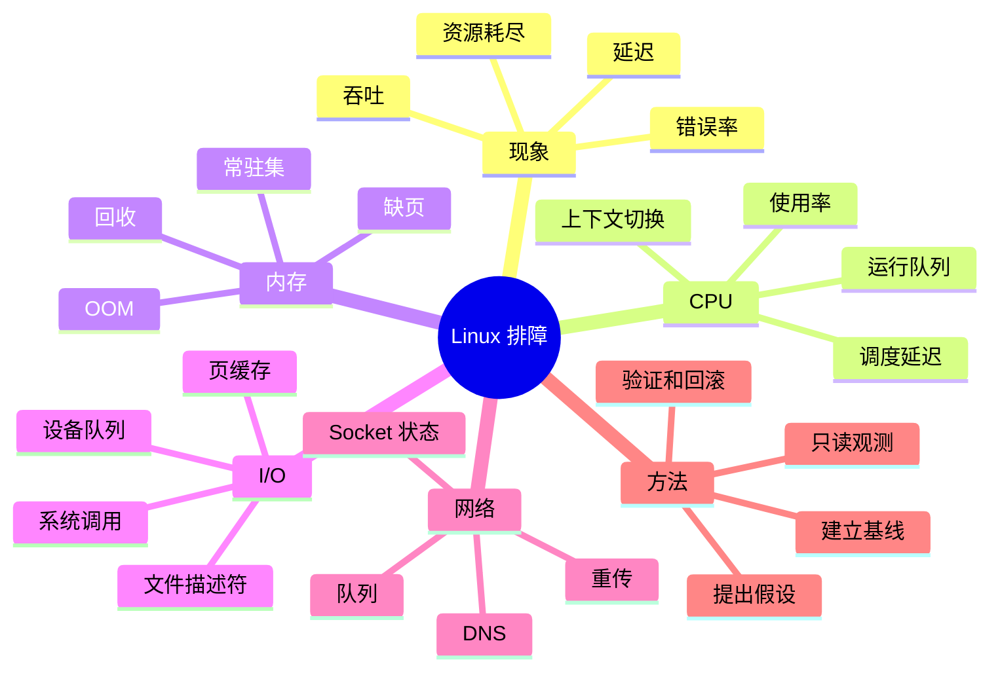

# Linux 观测与故障定位

“接口变慢”只是现象，不是根因。一次请求可能在用户代码、锁、CPU、内存回收、磁盘、网络或上游服务处等待。排障的目标，是把总延迟拆成可观察的部分，用证据逐步排除假设。

## 本章知识地图



## 一、先描述问题再运行命令

记录影响范围、开始时间、请求类型、基线和变化幅度。平均延迟可能正常而 P99（第 99 百分位延迟）严重恶化；整机 CPU 可能空闲，但某个 cgroup 或单核已经饱和。没有时间窗口和对照组，单个命令输出很难说明因果。

建议把排障写成循环：观察现象，提出一个可证伪假设，选择能区分假设的指标，执行低风险观测，更新判断，再决定下一步。不要先运行一长串命令，最后从噪声中挑一个看起来相关的数字。

## 二、CPU：忙在哪里比使用率更重要

CPU 使用率高可能来自真正的计算、忙等、锁自旋、GC 或内核处理；使用率低但延迟高可能是线程在等待 I/O、锁、调度或上游。运行队列显示可运行任务是否超过核心供给，单个进程的线程视图能发现一个热点线程掩盖在全局平均值中。

```sh
top -H -p <pid>
pidstat -u -w -p <pid> 1
vmstat 1
```

上下文切换过多可能来自线程数量、频繁阻塞唤醒或锁竞争。`perf top` 和 `perf record` 可用于采样 CPU 栈；采样本身有开销，生产环境应控制频率和权限。

## 三、内存：区分容量、驻留和回收

进程的虚拟地址空间、常驻集和共享内存表达不同含义。`free` 中的缓存通常可回收，不能简单相加为“已被业务占用”；容器受 cgroup 限制时，宿主机剩余内存也不能保证容器继续分配。

```sh
free -h
cat /proc/<pid>/status
cat /proc/<pid>/smaps_rollup
vmstat 1
```

持续缺页、交换和回收会增加尾延迟。OOM（Out Of Memory，内存不足）发生前，系统可能已经因回收抖动变慢；发生 OOM 后还要查看是哪个 cgroup、进程或分配路径触发，而不是只记录“机器内存满了”。

## 四、I/O：找到等待发生在哪一层

文件请求可能命中页缓存，也可能排队到文件系统、块设备和驱动。`iostat -x` 能看到设备利用率、队列和等待，但设备忙不一定说明所有应用都在等待该设备；还要把进程系统调用与设备时间对应起来。

```sh
iostat -xz 1
pidstat -d -p <pid> 1
strace -T -f -p <pid>
lsof -p <pid>
```

`strace` 的单次系统调用耗时可以显示阻塞位置，但跟踪会改变时序。FD 数量持续增加可能是泄漏，也可能是流量或连接池变化；应比较打开对象类型、创建速率和关闭速率。

## 五、网络：按阶段拆延迟

网络请求的等待可分为 DNS、连接建立、TLS 握手、服务端排队、首字节和响应下载。Socket 状态、重传、发送队列和接收窗口只能说明传输层一部分，不能直接替代服务端应用日志。

```sh
ss -s
ss -tin
curl -sS -o /dev/null -w 'dns=%{time_namelookup} connect=%{time_connect} tls=%{time_appconnect} first=%{time_starttransfer} total=%{time_total}\n' https://example.com/
```

连接数增加可能来自正常流量，也可能是连接泄漏；TIME_WAIT 多与主动关闭模式有关，CLOSE_WAIT 多通常与应用没有及时关闭有关。抓包应选择能观察问题阶段的位置，并注意代理、负载均衡和 NAT 的影响。

## 六、系统调用和火焰图

系统调用追踪适合回答“线程在调用什么、等待多久”，性能采样适合回答“CPU 时间主要消耗在哪里”。火焰图展示采样栈的聚合宽度，不是精确的调用次数或单次延迟；窄栈也可能隐藏阻塞，因为阻塞线程未必消耗 CPU。

先用低开销工具确定方向，再缩小到进程、线程和调用路径。生产环境的观测必须考虑权限、敏感参数和额外开销，避免为排障制造新的拥塞。

## 七、从现象到结论的例子

假设 P99 从 80ms 升到 800ms。第一步确认只有某个接口和某个时间段受影响；第二步比较 CPU、运行队列、内存回收和设备等待；第三步用请求阶段时间判断延迟是否集中在连接、首字节或下载。如果 CPU 低、运行队列短，但线程堆栈显示等待数据库，就不应先扩容 CPU；如果发送队列增长且对端读取慢，应检查回压和响应大小。

每次调整都记录前后指标和回滚方式。提高线程数、增大缓冲区或修改内核参数可能缓解一个瓶颈，却把压力传给下游；没有验证就持续调参，会让系统状态越来越难解释。

## 常见误区

全局 CPU 低不代表服务没有 CPU 瓶颈；单核、单线程或 cgroup 都可能局部饱和。设备利用率高也不自动证明应用等待该设备。

`strace` 和 `perf` 的输出都带有观测偏差。跟踪会改变调度和时序，采样只能近似代表运行期间的热点。

内存缓存不是泄漏，FD 多也不一定是泄漏。要看对象类型、变化趋势、生命周期和是否超过设计上限。

排障命令不是结论。每个指标都应对应一个假设，并通过时间窗口、基线和另一类证据交叉验证。

## 面试表达

先把“慢”拆成 CPU、锁、内存、I/O、网络和上游等待，再按低风险只读观测建立基线。CPU 用 `top`、`pidstat` 和 `perf`，内存看 `/proc`、`vmstat` 和 cgroup，I/O 看 `iostat`、`strace`，网络看 `ss`、请求分段和抓包。每一步都说明假设、指标、结论和回滚方案。

## 理解检查

1. 为什么平均延迟正常而 P99 可能恶化？
2. CPU 利用率低时，哪些等待仍可能让请求变慢？
3. 如何区分缓存、驻留集和 cgroup 内存限制？
4. CLOSE_WAIT 和 TIME_WAIT 分别提示什么生命周期问题？
5. 为什么排障要先建立基线再运行命令？

## 可观察实验

用一个可控的本地服务人为加入 CPU 计算、锁等待、磁盘读取和上游延迟，分别用 `top`、`vmstat`、`iostat`、`strace` 和 `ss` 观察。每次只改变一个因素，记录预期指标和实际指标，验证工具输出能否区分不同等待。

## 术语卡片

| 缩写 | 英文全称 | 中文名称 | 本章作用 |
|------|----------|----------|----------|
| P99 | 99th percentile | 第 99 百分位 | 描述尾部延迟 |
| OOM | Out Of Memory | 内存不足 | 表示分配无法满足 |
| FD | File Descriptor | 文件描述符 | 引用文件或 Socket |
| CPU | Central Processing Unit | 中央处理器 | 执行任务并产生计算时间 |
| I/O | Input/Output | 输入输出 | 与设备或网络交换数据 |
