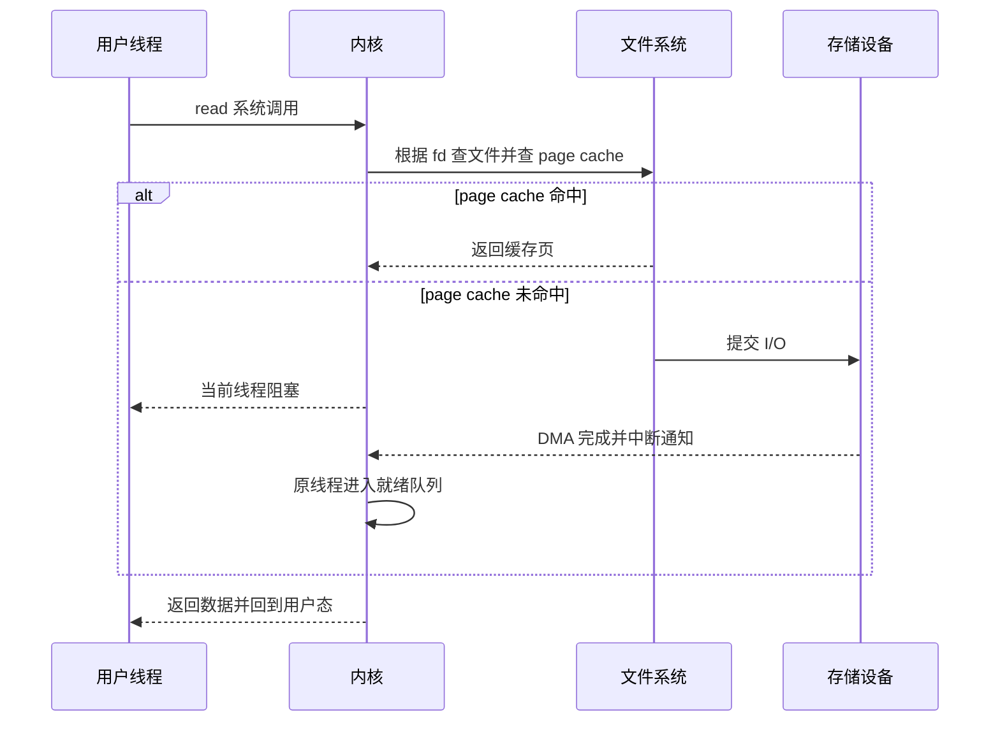

# 操作系统：让多个程序安全共享硬件

组成原理解释硬件有什么能力，操作系统利用这些能力提供抽象、隔离和资源管理。

```text
应用程序看到：
进程、线程、虚拟内存、文件、Socket

内核管理：
CPU、物理内存、磁盘、网卡、权限和设备
```

## 操作系统的三个角色

### 抽象

- 把 CPU 时间抽象成线程可以持续执行。
- 把物理内存抽象成独立虚拟地址空间。
- 把磁盘块和设备抽象成文件与文件描述符。

### 隔离

一个进程默认不能随意读取另一个进程内存，也不能直接执行特权指令。

### 仲裁

多个程序竞争 CPU、内存和 I/O 时，内核决定谁先用、用多少、何时回收。

## 课程地图

1. [内核、系统调用、进程与线程](./01-kernel-process-thread/index.html)
2. [调度、同步、锁与死锁](./02-scheduling-concurrency/index.html)
3. [地址空间、分页、TLB 与缺页](./03-virtual-memory/index.html)
4. [文件系统、I/O、epoll 与零拷贝](./04-filesystem-io/index.html)
5. [Linux 观测与故障定位](./05-linux-observability/index.html)

## 一条主线

执行 `data = file.read()` 时：



1. 运行时准备参数并发起 read 系统调用。
2. CPU 从用户态进入内核态。
3. 内核根据文件描述符找到打开文件对象。
4. 先检查 page cache。
5. 若数据不在内存，文件系统和块层提交设备 I/O。
6. 设备可通过 DMA 把数据传入内存并触发完成通知。
7. 内核把结果交给进程，返回用户态。

一句代码跨越了语言运行时、系统调用、文件系统、内存和硬件设备。

## 面试中的关键连接

- 系统调用一定会切换进程吗？
- 进程与线程共享和独占什么？
- 锁竞争时线程在用户态还是内核态等待？
- malloc 返回地址后物理页是否已经存在？
- TLB miss、minor fault、major fault 有什么区别？
- read、mmap 和 sendfile 的数据路径怎样不同？
- epoll 为什么避免重复扫描，却不能让业务处理自动变快？

## 学习方式

每个机制都从四个角度理解：

1. 内核维护什么状态。
2. 谁触发状态变化。
3. 线程可能在哪些队列等待。
4. 哪些命令和指标能观察到。

---

## 零基础预备：操作系统为什么存在

**Operating System 直译**：操作系统。

如果没有操作系统，每个程序都要自己处理：

- CPU 何时执行自己。
- 内存放在哪里。
- 怎样读取磁盘。
- 怎样驱动网卡。
- 怎样与其他程序隔离。
- 怎样处理用户和权限。

更严重的是，所有程序都可直接控制硬件，一个错误就可能破坏整个系统。

操作系统把硬件能力包装成安全、稳定的抽象，并在多个程序之间仲裁资源。

### 从应用视角看

应用通常使用：

- 进程。
- 线程。
- 虚拟内存。
- 文件。
- Socket。
- 定时器。
- 信号。

### 从内核视角看

内核管理：

- 可调度线程。
- 物理页和页表。
- 文件对象和 inode。
- 设备请求和中断。
- 网络协议状态。
- 权限和资源限制。

---

## 内核与应用的边界

### 为什么分用户态和内核态

普通程序不应直接：

- 修改页表。
- 任意读写物理内存。
- 关闭中断。
- 控制所有设备。
- 修改其他进程调度状态。

CPU 特权级和页表提供硬件保护。应用需要服务时，通过系统调用受控进入内核。

### 系统调用不是普通函数

普通函数调用只在当前权限中改变控制流。

系统调用：

```text
用户态线程
  -> 陷入指令
  -> 内核态
  -> 参数与权限检查
  -> 内核服务
  -> 返回用户态
```

它不一定切换进程；只有阻塞、抢占等情况下才会调度别的线程。

---

## 操作系统维护的五类核心对象

### 任务

描述进程和线程：

- 身份。
- 运行状态。
- 调度信息。
- 资源引用。

### 地址空间

描述：

- 哪些虚拟地址合法。
- 映射到哪些物理页。
- 读写执行权限。
- 文件和匿名映射。

### 文件对象

描述：

- 打开的文件、Socket、管道等。
- 当前偏移和状态。
- 对 inode 或协议对象的引用。

### 等待队列

线程等：

- I/O。
- 锁。
- 定时器。
- 子进程。
- 网络事件。

条件满足后，线程重新进入就绪队列。

### 设备与网络状态

- 驱动队列。
- DMA 缓冲。
- Socket。
- 路由。
- 协议控制块。

---

## 五章依赖关系

```text
第 1 章：内核、进程、线程
  -> 谁拥有资源，谁被调度

第 2 章：调度、同步、锁
  -> 多个执行流怎样共享 CPU 和数据

第 3 章：虚拟内存
  -> 地址怎样隔离、翻译、分配与回收

第 4 章：文件与 I/O
  -> 名称怎样找到数据，线程怎样等待 I/O

第 5 章：Linux 观测
  -> 怎样用证据定位 CPU、内存和 I/O 问题
```

第 1 章是词汇基础，第 2 到第 4 章分别讲 CPU、内存和持久数据，第 5 章把机制用于真实故障。

---

## 一次 read 串起五章

```text
用户线程调用 read
  -> 系统调用进入内核
  -> fd 找到打开文件对象
  -> 文件偏移定位 page cache 页面
  -> 命中：复制数据并返回
  -> 未命中：文件系统定位块并提交 I/O
  -> 当前线程进入阻塞状态
  -> 调度器运行另一条线程
  -> 设备 DMA 把数据放入内存
  -> 中断通知内核完成
  -> 页面进入 page cache
  -> 原线程进入就绪队列
  -> 被调度后 read 返回
```

对应知识：

| 步骤 | 章节 |
|---|---|
| 用户态进入内核 | 进程线程 |
| 线程阻塞与重新运行 | 调度 |
| 用户缓冲与页面 | 虚拟内存 |
| fd、page cache、设备 I/O | 文件系统 |
| fault、状态、I/O 指标 | Linux 观测 |

---

## 初学者常见混淆

| 概念 A | 概念 B | 区别 |
|---|---|---|
| 内核 | 内核态 | 软件主体 vs CPU 特权状态 |
| 程序 | 进程 | 静态文件 vs 运行实例 |
| 进程 | 线程 | 资源容器 vs 执行流 |
| 并发 | 并行 | 时间段内推进 vs 同时执行 |
| 用户态切换 | 上下文切换 | 权限变化 vs 执行主体变化 |
| 就绪 | 阻塞 | 只等 CPU vs 还等事件 |
| 虚拟地址 | 物理地址 | 程序视图 vs 主存位置 |
| TLB miss | Page Fault | 翻译缓存未命中 vs 页表无法完成访问 |
| fd | inode | 进程索引 vs 文件元数据对象 |
| 非阻塞 | 异步 | 立即返回状态 vs 完成通知模型 |
| write 成功 | 数据持久 | 进入内核路径 vs 掉电后仍存在 |
| 容器 | 虚拟机 | 共享宿主内核的进程 vs 独立 Guest 内核 |

---

## 每章怎样学

### 第一步：先找对象

例如虚拟内存：

- 虚拟地址。
- TLB。
- 页表。
- 物理页。

### 第二步：画状态变化

例如线程：

```text
运行 -> 阻塞 -> 就绪 -> 运行
```

### 第三步：按时间讲流程

每个机制至少讲清：

1. 谁发起。
2. 内核查什么。
3. 哪一步可能等待。
4. 状态保存在哪里。
5. 完成后怎样恢复。

### 第四步：明确边界

避免绝对化：

- 系统调用不一定上下文切换。
- 进程切换不一定完整清 TLB。
- 缺页不一定读磁盘。
- write 不一定已经持久化。
- epoll 不让业务逻辑自动变快。

### 第五步：用 Linux 验证

把课本术语对应到：

- `/proc`。
- `ps/top/pidstat`。
- `strace`。
- `perf`。
- `vmstat/iostat`。
- `ss`。

---

## 学完本门后的验收

你应能解释：

1. 为什么应用不能直接操作硬件。
2. 系统调用、异常、中断有何区别。
3. 进程和线程共享/私有什么。
4. 三状态、五状态和 Linux 状态怎样对应。
5. fork、exec、exit、wait 如何配合。
6. 为什么线程切换通常更轻。
7. FCFS、SJF、RR 和 MLFQ 的权衡。
8. 竞态、临界区、互斥与同步。
9. 条件变量为什么必须 while。
10. 死锁、活锁、饥饿、优先级反转。
11. 虚拟地址怎样通过 TLB 和页表翻译。
12. minor/major fault 有何区别。
13. malloc、COW、mmap 和 RSS 的关系。
14. fd、打开文件对象、inode 的关系。
15. write、脏页、fsync 与持久化。
16. select、poll、epoll 与 LT/ET。
17. 零拷贝减少了什么。
18. 怎样从 CPU、内存、I/O 指标构建排障证据链。
19. Namespace 与 Cgroup 分别做什么。
20. 容器 PID 1 为什么特殊。

---

## 导学自测

完成本门后，用 10 分钟讲通：

```text
程序启动
  -> fork/exec
  -> 进程地址空间
  -> 线程被调度
  -> 系统调用
  -> TLB/页表/缺页
  -> fd/inode/page cache
  -> I/O 阻塞和中断唤醒
  -> 多线程同步
  -> Linux 指标验证
```

---

[返回系统课总览](../index.html) | [第一课：内核、进程与线程 →](./01-kernel-process-thread/index.html)
