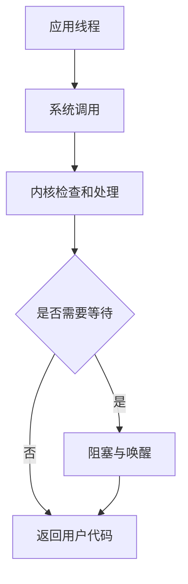

<!-- list-context-v1 -->

# 操作系统导学

<!-- course-scaffold -->
## 主流程图



## 怎样阅读本节

本节围绕“操作系统导学”展开。先理解它要解决的系统问题，再跟着数据、控制流和状态变化阅读实现细节；不要把下面的术语表当成需要先背诵的清单。

### 阅读前需要知道

这些内容描述的是同一机制的不同环节：程序会在处理器上执行，并通过操作系统请求内存、文件或网络服务。；一个机制的意义，要结合它要避免的失败、等待或资源冲突来理解。；文中的图展示参与者和顺序，正文解释每一步为什么发生。。
### 本节术语预览

首次出现时会给出英文全称、中文名称、所属层次和解决的问题；本节出现的主要缩写如下：

- **CPU**：Central Processing Unit，中央处理器
- **TLB**：Translation Lookaside Buffer，地址转换旁路缓冲
- **I/O**：Input/Output，输入输出
- **IPC**：Inter-Process Communication，进程间通信

### 建议的学习顺序

先读每个小节开头的“要解决的问题”，再读流程图和示例，最后用文末的误区、实验或面试表达检查自己能否复述因果链。


操作系统的核心工作是：**让多个程序安全、有效地共享 CPU（Central Processing Unit，中央处理器）、内存、文件和设备。**

程序本身只是磁盘上的指令和数据。它被启动后，操作系统为它建立进程、地址空间、打开文件和线程，并在需要时替它访问硬件。


<!-- dependency-map-v1 -->
## 本节在课程中的位置

本节属于“操作系统”主线。学习时先把它放进整条链路：前一阶段提供输入和前置状态，本节解释一个关键机制，后一阶段再使用这些状态处理更复杂的并发、性能或故障场景。

| 阅读关系 | 页面 | 目的 |
|----------|------|------|
| 课程入口 | [导学](../index.html) | 了解本门课的整体问题和术语边界 |
| 建议先读 | [计算机网络导学](../computer-network/index.html) | 准备本节需要的概念和状态 |
| 当前章节 | **操作系统导学** | 建立本节的机制模型 |
| 后续复习 | [计算机组成原理导学](../computer-organization/index.html) | 观察本节机制如何参与更大的系统流程 |

阅读完后，尝试把本节的关键状态接回课程首页的贯穿主线；如果无法说明输入从哪里来、结果交给谁，说明前置概念还需要回看。

## 先掌握三个边界


这些内容描述的是同一机制的不同环节：`用户态（user mode）`：普通应用运行的受限权限环境。；`内核态（kernel mode）`：操作系统内核运行的高权限环境，可以管理页表、设备和调度。；`系统调用（system call）`：应用请求内核服务的正式入口，例如读文件、创建 Socket 或分配映射。。
用户态和内核态是权限边界，不是两个不同的进程。线程执行系统调用时，可以暂时进入内核处理，然后回到原来的用户代码。

## 一条请求主线


```text
应用线程
  → 调用系统调用
  → 内核检查权限和参数
  → 等待或操作文件、网络、设备
  → 返回结果或错误
```

如果请求暂时无法完成，线程可能阻塞；调度器会把 CPU 交给其他可运行线程。这个过程把“代码正在执行”“代码正在等待”和“代码拥有哪种权限”区分开来。

## 五章的依赖关系


| 章节 | 要回答的问题 |
|------|--------------|
| 内核、系统调用、进程与线程 | 程序怎样成为进程？线程共享什么、隔离什么？ |
| 调度、同步、锁与死锁 | 多个执行流怎样轮流运行并协调共享数据？ |
| 地址空间、分页、TLB（Translation Lookaside Buffer，地址转换旁路缓冲） 与缺页 | 每个进程怎样拥有自己的地址视图？缺页时发生什么？ |
| 文件系统、I/O（Input/Output，输入输出）、epoll 与零拷贝 | 数据怎样从文件或网卡进入应用？等待怎样减少？ |
| Linux 观测与故障定位 | 如何用命令和指标判断 CPU、内存、I/O 或锁是瓶颈？ |

`IPC（Inter-Process Communication，进程间通信）`、`I/O（Input/Output，输入输出）`、`TLB（Translation Lookaside Buffer，地址转换旁路缓冲）` 等缩写会在对应章节首次出现时完整解释。

## 学完后的能力


你应该能沿着一条因果链解释：线程为什么会阻塞、系统调用为什么不必然导致进程切换、虚拟内存为什么需要页表，以及一个服务变慢时怎样区分 CPU、锁、磁盘和网络等待。

下一步：[内核、系统调用、进程与线程](./01-kernel-process-thread/index.html)

<!-- chapter-closure-v1 -->
## 核心模型

先建立“输入、处理单元、输出和失败路径”的模型，再阅读具体实现。术语只有放进这条因果链，才不会变成孤立的背诵点。

## 常见误区

这些内容描述的是同一机制的不同环节：把名词定义当成机制解释，跳过状态和时间顺序。；把“通常如此”说成“任何平台都如此”，忽略实现和配置差异。；看到性能问题就直接调参数，没有先确认瓶颈位于哪一层。。
## 理解检查

1. 本篇首先解决什么问题？
2. 核心状态由谁保存，什么时候更新？
3. 设计的主要代价和边界条件是什么？

## 可观察实验

选一个最小可运行例子，记录输入、关键状态和输出，再把异常结果与文中的失败路径逐项对照。

<!-- term-cards-v1 -->
## 术语卡片

下表只收录本篇实际使用的主要缩写。阅读正文时先理解它在流程中的角色，复习时再用这张表回查全称和定义。

| 缩写 | 英文全称 | 中文名称 | 在本篇中的定义或作用 |
|------|----------|----------|----------------------|
| **CPU** | Central Processing Unit | 中央处理器 | 执行机器指令并协调计算的处理器核心 |
| **TLB** | Translation Lookaside Buffer | 地址转换旁路缓冲 | 缓存虚拟地址到物理地址映射的硬件结构 |
| **I/O** | Input/Output | 输入输出 | 程序与文件、设备或网络交换数据的过程 |
| **IPC** | Inter-Process Communication | 进程间通信 | 进程交换数据和同步状态的机制 |
