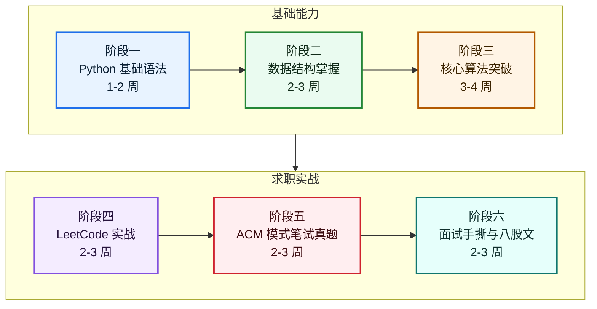

# Zero2Leetcode 🚀

<div align="center">

**从零基础 Python 到企业笔试机试的系统性刷题指南**

[](https://python.org)
[](https://leetcode.cn/studyplan/top-100-liked/)
[](#-ai-编程教练)
[](LICENSE)

[视频介绍](#-视频介绍) • [开始学习](#-学习路线) • [题目列表](#-leetcode-hot-100) • [在线练习场](playground.html) • [ACM 模拟](https://onefly.top/zero2Leetcode/acm-playground.html) • [AI 教练](#-ai-编程教练)

</div>

---

## 📖 项目简介

本项目专为**计算机专业求职者**设计，帮助你从 Python 零基础到能够独立解决 LeetCode 中等难度题目，系统准备企业笔试、机试与技术面试。

### ✨ 核心亮点

- 📚 **系统学习路线** — 6 阶段覆盖 Python 基础、算法刷题、ACM 笔试真题、面试手撕与八股文
- 🖥️ **在线练习场** — 116 道题接入本地测试，支持 Python / Java 17 / Go 核心代码模式
- 🎯 **ACM 模拟 IDE** — 支持 Python / Go / Java 17（Preview）、stdin/stdout、输出对比和 Python 断点调试
- 🤖 **AI 编程教练** — 在练习场诊断题目与代码，也能读取 ACM 代码和样例，把 Python 解法快速转换为 Java 17 / Go
- 📝 **完整题解** — LeetCode Hot 100 全部题解

### 🎯 目标用户

- ✅ Python 语言零基础或仅掌握基础语法
- ✅ 准备校招/社招笔试机试
- ✅ 目标通过 LeetCode Medium 难度

### ⏱️ 学习周期

建议 **12-18 周**，每天投入 2-3 小时

---

## 🎬 视频介绍

> 想先看演示再开刷，可以直接看这条 B 站视频。

**零门槛刷力扣 Hot100！免费在线 OJ + AI 教练，不用登录直接开刷**  
视频地址：[https://www.bilibili.com/video/BV129QmBGE3Q/](https://www.bilibili.com/video/BV129QmBGE3Q/)

这条视频会快速带你了解项目的核心使用方式：

- 浏览器内直接刷 LeetCode Hot 100，不用本地搭环境
- 内置免费在线 OJ，打开页面就能写代码、运行和调试
- AI 教练自动读取当前题目和代码，给出提示、诊断和讲解
- 不用登录，打开即用，适合零基础和面试前集中训练

如果你想先看完整演示，再按仓库里的学习路线系统刷题，建议先看视频，再进入下方的 AI 助手和题单部分。

---

## 🖥️ LeetCode 核心代码练习场

在线练习场使用 LeetCode 核心代码模式：只实现题目函数或类，不需要处理标准输入输出。切换语言或题目时，Python、Java 和 Go 草稿会分别自动保存。

| 语言 | 编辑内容 | 执行方式 |
|------|----------|----------|
| Python 3 | 题目顶层函数 | Pyodide 浏览器内执行 |
| Java 17 | `class Solution` 或题目指定类 | 自动附加 `Main` 测试驱动，通过 Java 17 浏览器运行时编译执行 |
| Go | 题目函数或题目指定类型 | 自动附加 `package main` 与测试驱动，使用 Go Playground 编译执行 |

链表、二叉树、原地修改、集合结果和设计类题目的输入转换与结果校验均由页面测试驱动完成。编辑器中不会出现 ACM 的 stdin/stdout 包装代码。

---

## 🤖 AI 编程教练

> **默认接入 OpenRouter 免费模型** — 无需登录，也可以在设置中换成支持浏览器 CORS 和流式 `/chat/completions` 的 OpenAI 兼容 API

AI 教练同时用于两个编程页面：在 LeetCode 练习场读取当前题目、语言、核心代码模板与草稿，给出当前语言的提示、诊断或实现；在 ACM 模拟 IDE 读取当前语言、代码、stdin、stdout、期望输出和运行状态，并生成完整的 Java 17 或 Go ACM 程序。

仓库题解仍以 Python 为主。Java / Go 核心代码签名与测试驱动由题目元数据生成，AI 返回的具体解法仍需使用页面样例验证。

### 功能预览

<div align="center">

| 练习场 & AI 按钮 | AI 面板 & 快捷操作 | AI 上下文诊断 |
|:---:|:---:|:---:|
|  |  |  |
| 右下角 🤖 浮动按钮 | 常用操作一键触发 | 精准识别「两数之和」并给出思路 |

</div>

### 快捷操作

| 场景 | 按钮 | 功能 |
|------|------|------|
| ACM | 转为 Java 17 | 生成包含 `public class Main` 的完整 Java 17 程序，保留 stdin/stdout |
| ACM | 转为 Go | 生成包含 `package main` 的完整 Go 程序，保留 stdin/stdout |
| 通用 | 检查代码 / 分析报错 | 结合代码、样例和最近输出定位问题 |
| 通用 | 解释思路 | 说明算法、关键变量和复杂度 |
| LeetCode | 给个提示 / 解释题目 / 优化代码 | 按当前题目提供教学式帮助 |
| LeetCode | 给我代码 | 按当前选择的 Python / Java 17 / Go 核心代码模板生成实现 |

### 使用方式

1. 打开 [在线练习场](playground.html) 或 [ACM 模拟 IDE](https://onefly.top/zero2Leetcode/acm-playground.html)
2. 点击「AI 教练」打开对话面板
3. 在 ACM 页面先用 Python 写出解法和样例，再点击「转为 Java 17」或「转为 Go」
4. 继续追问转换结果或语言差异，把返回的完整代码复制到目标语言编辑器后运行验证

> **数据说明：** 只有主动发送消息时，页面才会把当前上下文提交给所配置的 AI 服务。ACM 上下文可能包含代码、stdin、stdout 和期望输出，请勿放入密钥或隐私数据。默认使用 OpenRouter 免费模型；点击齿轮按钮可以更换 API、模型或密钥。

---

## 🎯 ACM 模拟 IDE

> **模拟大厂笔试真实环境** — 直接粘贴真题代码，输入测试数据，一键运行

大厂笔试（阿里、美团、华为等）普遍使用 **ACM 模式**：程序从标准输入读取数据，再把答案写到标准输出，和 LeetCode 的函数式调用完全不同。ACM 模拟 IDE 专为此场景设计。

### 核心功能

| 功能 | 说明 |
|------|------|
| 📥 **stdin/stdout** | Python、Go 与 Java 均可直接读取标准输入并输出结果 |
| 🧩 **语言切换** | Python 浏览器内运行，Go 使用官方 Playground，Java 17（Preview）使用 CheerpJ 4.3 + ECJ 3.42.0 在浏览器内编译运行 |
| 📝 **输入模板** | 三种语言各有 7 种常用模板（单整数、数组、矩阵、多组用例、图等） |
| ✅ **输出对比** | 填入期望输出，自动判定 ACCEPTED / WRONG ANSWER |
| 🤖 **AI 语言转换** | 读取当前代码与样例，把 Python 解法转换为完整 Java 17 / Go ACM 程序，并支持继续追问 |
| 🐛 **断点调试** | Python 可点击行号设置断点，逐行回放并查看变量变化 |
| 💾 **自动保存** | Python / Go / Java 草稿分别保存，切换语言和刷新均不丢失 |

### 使用方式

1. 打开 [ACM 模拟 IDE](https://onefly.top/zero2Leetcode/acm-playground.html)，先用 Python 编写或粘贴解法
2. 在右侧填写输入和期望输出，点击「运行」或按 `Ctrl+Enter` 验证 Python 结果
3. 点击「AI 教练」，选择「转为 Java 17」或「转为 Go」生成完整 ACM 程序
4. 切换到目标语言，把 AI 返回的代码复制到编辑器，再运行并对比样例输出
5. 需要定位 Python 逻辑时，可点击「调试」逐行回放并查看变量状态

### Java 17（Preview）浏览器执行

Java 源码完全在当前浏览器中处理：页面从 Leaning Technologies 官方 CDN 加载 CheerpJ 4.3，由随站点发布的 ECJ 3.42.0 和版本化 runner `assets/vendor/zero2leetcode-java-runner-20260803.jar` 编译 `Main.java`，再在 CheerpJ 的 Java 17 运行时中执行。源码、标准输入和程序输出不会上传到本站或第三方代码执行服务。

这里的“不上传”仅指编译和运行过程。主动使用 AI 教练时，当前代码和输入输出会提交给所配置的 AI 服务，用于生成回复。

runner 使用 JDK 21 的 `lib/ct.sym` 提取 Java 17 API 签名，并把这些 `.sig` 文件和索引一起打包。浏览器运行时通过自定义 `JavaFileManager` 将它们作为 ECJ 的 `PLATFORM_CLASS_PATH`，因此编译阶段不依赖 CheerpJ JRE 提供完整的本地 JDK 文件布局。构建 runner 需要 JDK 21，runner 自身及用户代码的编译、运行目标均为 Java 17。

这条执行链不依赖后端编译服务器，因此没有服务器按次执行费用。个人项目和 FOSS 项目可按 CheerpJ Community License 免费、不计量地使用官方 CDN，页面已保留所要求的可见署名；若项目所有者或使用性质变化，应重新核对官方许可。当前 runner 文件为 **5.69 MiB**（5,963,733 bytes）；CheerpJ 4.3 的 Java 17 `lib/modules` 镜像为 **36.38 MiB**（38,145,733 bytes），但运行时支持 HTTP Range 并按需读取模块片段，不会固定在首次运行时下载整个镜像。加上 CheerpJ loader、WebAssembly 和实际命中的模块片段后，冷启动传输量会随程序、浏览器和缓存状态变化，不能用固定的总量区间表示；若 runner 与整个模块镜像均完整传输，两者合计约 **42.07 MiB**。资源缓存后，后续打开通常无需重复完整下载。首次加载必须能够访问 CheerpJ 官方 CDN。

当前 Java 支持编译运行、stdin/stdout 和样例输出对比，作为 Java 17 Preview 提供；暂不支持逐行调试。逐行回放和变量查看仍仅适用于 Python。第三方组件、版本、校验值与许可证见 [`THIRD_PARTY_NOTICES.md`](THIRD_PARTY_NOTICES.md)。

---

## 🗺️ 学习路线



### 阶段一：Python 基础 (1-2 周) `./00_python_basics/`

| 模块 | 知识点 | 重要程度 |
|------|--------|----------|
| 变量与类型 | int, float, str, bool, None | ⭐⭐⭐⭐⭐ |
| 控制流 | if/elif/else, for, while, break, continue | ⭐⭐⭐⭐⭐ |
| 函数 | def, 参数, 返回值, lambda, 作用域 | ⭐⭐⭐⭐⭐ |
| 集合类型 | list, dict, set, tuple | ⭐⭐⭐⭐⭐ |
| 类与节点 | class, self, `__init__`, ListNode, TreeNode | ⭐⭐⭐⭐⭐ |
| 输入输出 | input, buffer, 多组用例, EOF, ACM solve | ⭐⭐⭐⭐⭐ |

### 阶段二：数据结构 (2-3 周) `./01_data_structures/`

| 数据结构 | 核心操作 | 刷题重点 |
|----------|----------|----------|
| 数组 | 遍历, 双指针, 原地操作 | ⭐⭐⭐⭐⭐ |
| 字符串 | 滑动窗口, 回文判断 | ⭐⭐⭐⭐⭐ |
| 链表 | 指针操作, 虚拟头节点, 反转 | ⭐⭐⭐⭐ |
| 栈/队列 | LIFO/FIFO, 单调栈 | ⭐⭐⭐⭐ |
| 哈希表 | O(1)查找, 去重, 计数 | ⭐⭐⭐⭐⭐ |
| 树 | 前中后序遍历, 层序遍历 | ⭐⭐⭐⭐⭐ |
| 堆 | TopK 问题, 优先队列 | ⭐⭐⭐ |
| 图 | 邻接表, DFS/BFS | ⭐⭐⭐ |
| Trie/并查集 | 前缀查询, 动态连通性 | ⭐⭐⭐ |
| 区间结构 | 前缀和, 树状数组, 线段树 | ⭐⭐⭐ |
| ACM 构造 | 从输入构造链表, 树, 图 | ⭐⭐⭐⭐⭐ |

### 阶段三：核心算法 (3-4 周) `./02_algorithms/`

| 算法 | 核心思想 | 难度 |
|------|----------|------|
| 排序 | 基础排序, 快排, 归并, 堆排, 计数/桶/基数排序 | ⭐⭐ |
| 二分查找 | 边界处理, 变体题 | ⭐⭐⭐ |
| 双指针 | 对撞指针, 快慢指针 | ⭐⭐ |
| 滑动窗口 | 动态维护区间 | ⭐⭐⭐ |
| 递归/回溯 | 状态树, 剪枝 | ⭐⭐⭐⭐ |
| BFS/DFS | 层序/深度搜索 | ⭐⭐⭐ |
| 动态规划 | 状态定义, 转移方程 | ⭐⭐⭐⭐⭐ |
| 贪心 | 局部最优→全局最优 | ⭐⭐⭐ |

### 阶段四：LeetCode 实战 (2-3 周) `./03_leetcode_practice/`

主攻 **LeetCode Hot 100**，覆盖面试高频题

### 阶段五：ACM 模式笔试真题 (2-3 周) `./04_real_interviews/`

进入 [大厂笔试机试真题](./04_real_interviews/)，按公司和岗位限时完成真实题目，并使用 [ACM 模拟 IDE](https://onefly.top/zero2Leetcode/acm-playground.html) 训练标准输入输出、样例验证与现场调试。

### 阶段六：计算机基础系统课、面试手撕与八股文 (3-5 周) `./05_interview/`

进入 [大厂面试备战](./05_interview/)，非科班或转码读者先按组成原理 → 操作系统 → 计算机网络完成系统课，再结合高频手撕、通用题库、岗位八股文和真实面经，训练现场讲解、追问应对与完整面试表达。

---

## 🔥 LeetCode Hot 100

> 点击题号直接跳转 LeetCode 官方练习！

### 哈希表 (5题)

| # | 题目 | 难度 | 本地题解 |
|---|------|------|----------|
| 1 | [两数之和](https://leetcode.cn/problems/two-sum/) | 🟢 Easy | [solution](./03_leetcode_practice/hash/lc_001_two_sum.py) |
| 49 | [字母异位词分组](https://leetcode.cn/problems/group-anagrams/) | 🟡 Medium | [solution](./03_leetcode_practice/hash/lc_049_group_anagrams.py) |
| 128 | [最长连续序列](https://leetcode.cn/problems/longest-consecutive-sequence/) | 🟡 Medium | [solution](./03_leetcode_practice/hash/lc_128_longest_consecutive.py) |

### 双指针 (4题)

| # | 题目 | 难度 | 本地题解 |
|---|------|------|----------|
| 11 | [盛最多水的容器](https://leetcode.cn/problems/container-with-most-water/) | 🟡 Medium | [solution](./03_leetcode_practice/two_pointers/lc_011_container.py) |
| 15 | [三数之和](https://leetcode.cn/problems/3sum/) | 🟡 Medium | [solution](./03_leetcode_practice/two_pointers/lc_015_3sum.py) |
| 42 | [接雨水](https://leetcode.cn/problems/trapping-rain-water/) | 🔴 Hard | [solution](./03_leetcode_practice/two_pointers/lc_042_trapping_rain.py) |

### 滑动窗口 (4题)

| # | 题目 | 难度 | 本地题解 |
|---|------|------|----------|
| 3 | [无重复字符的最长子串](https://leetcode.cn/problems/longest-substring-without-repeating-characters/) | 🟡 Medium | [solution](./03_leetcode_practice/sliding_window/lc_003_longest_substring.py) |
| 76 | [最小覆盖子串](https://leetcode.cn/problems/minimum-window-substring/) | 🔴 Hard | [solution](./03_leetcode_practice/sliding_window/lc_076_min_window.py) |
| 438 | [找到字符串中所有字母异位词](https://leetcode.cn/problems/find-all-anagrams-in-a-string/) | 🟡 Medium | [solution](./03_leetcode_practice/sliding_window/lc_438_find_anagrams.py) |

### 子串/子数组 (6题)

| # | 题目 | 难度 | 本地题解 |
|---|------|------|----------|
| 53 | [最大子数组和](https://leetcode.cn/problems/maximum-subarray/) | 🟡 Medium | [solution](./03_leetcode_practice/subarray/lc_053_max_subarray.py) |
| 56 | [合并区间](https://leetcode.cn/problems/merge-intervals/) | 🟡 Medium | [solution](./03_leetcode_practice/subarray/lc_056_merge_intervals.py) |
| 560 | [和为 K 的子数组](https://leetcode.cn/problems/subarray-sum-equals-k/) | 🟡 Medium | [solution](./03_leetcode_practice/subarray/lc_560_subarray_sum.py) |

### 栈 (6题)

| # | 题目 | 难度 | 本地题解 |
|---|------|------|----------|
| 20 | [有效的括号](https://leetcode.cn/problems/valid-parentheses/) | 🟢 Easy | [solution](./03_leetcode_practice/stack/lc_020_valid_parentheses.py) |
| 155 | [最小栈](https://leetcode.cn/problems/min-stack/) | 🟡 Medium | [solution](./03_leetcode_practice/stack/lc_155_min_stack.py) |
| 394 | [字符串解码](https://leetcode.cn/problems/decode-string/) | 🟡 Medium | [solution](./03_leetcode_practice/stack/lc_394_decode_string.py) |
| 739 | [每日温度](https://leetcode.cn/problems/daily-temperatures/) | 🟡 Medium | [solution](./03_leetcode_practice/stack/lc_739_daily_temperatures.py) |
| 84 | [柱状图中最大的矩形](https://leetcode.cn/problems/largest-rectangle-in-histogram/) | 🔴 Hard | [solution](./03_leetcode_practice/stack/lc_084_largest_rectangle.py) |

### 链表 (9题)

| # | 题目 | 难度 | 本地题解 |
|---|------|------|----------|
| 206 | [反转链表](https://leetcode.cn/problems/reverse-linked-list/) | 🟢 Easy | [solution](./03_leetcode_practice/linked_list/lc_206_reverse_list.py) |
| 21 | [合并两个有序链表](https://leetcode.cn/problems/merge-two-sorted-lists/) | 🟢 Easy | [solution](./03_leetcode_practice/linked_list/lc_021_merge_lists.py) |
| 141 | [环形链表](https://leetcode.cn/problems/linked-list-cycle/) | 🟢 Easy | [solution](./03_leetcode_practice/linked_list/lc_141_has_cycle.py) |
| 142 | [环形链表 II](https://leetcode.cn/problems/linked-list-cycle-ii/) | 🟡 Medium | [solution](./03_leetcode_practice/linked_list/lc_142_detect_cycle.py) |
| 160 | [相交链表](https://leetcode.cn/problems/intersection-of-two-linked-lists/) | 🟢 Easy | [solution](./03_leetcode_practice/linked_list/lc_160_intersection.py) |
| 19 | [删除链表的倒数第 N 个结点](https://leetcode.cn/problems/remove-nth-node-from-end-of-list/) | 🟡 Medium | [solution](./03_leetcode_practice/linked_list/lc_019_remove_nth.py) |
| 24 | [两两交换链表中的节点](https://leetcode.cn/problems/swap-nodes-in-pairs/) | 🟡 Medium | [solution](./03_leetcode_practice/linked_list/lc_024_swap_pairs.py) |
| 25 | [K 个一组翻转链表](https://leetcode.cn/problems/reverse-nodes-in-k-group/) | 🔴 Hard | [solution](./03_leetcode_practice/linked_list/lc_025_reverse_k_group.py) |
| 148 | [排序链表](https://leetcode.cn/problems/sort-list/) | 🟡 Medium | [solution](./03_leetcode_practice/linked_list/lc_148_sort_list.py) |

### 二叉树 (15题)

| # | 题目 | 难度 | 本地题解 |
|---|------|------|----------|
| 94 | [二叉树的中序遍历](https://leetcode.cn/problems/binary-tree-inorder-traversal/) | 🟢 Easy | [solution](./03_leetcode_practice/tree/lc_094_inorder.py) |
| 104 | [二叉树的最大深度](https://leetcode.cn/problems/maximum-depth-of-binary-tree/) | 🟢 Easy | [solution](./03_leetcode_practice/tree/lc_104_max_depth.py) |
| 226 | [翻转二叉树](https://leetcode.cn/problems/invert-binary-tree/) | 🟢 Easy | [solution](./03_leetcode_practice/tree/lc_226_invert_tree.py) |
| 101 | [对称二叉树](https://leetcode.cn/problems/symmetric-tree/) | 🟢 Easy | [solution](./03_leetcode_practice/tree/lc_101_symmetric.py) |
| 543 | [二叉树的直径](https://leetcode.cn/problems/diameter-of-binary-tree/) | 🟢 Easy | [solution](./03_leetcode_practice/tree/lc_543_diameter.py) |
| 102 | [二叉树的层序遍历](https://leetcode.cn/problems/binary-tree-level-order-traversal/) | 🟡 Medium | [solution](./03_leetcode_practice/tree/lc_102_level_order.py) |
| 108 | [将有序数组转换为BST](https://leetcode.cn/problems/convert-sorted-array-to-binary-search-tree/) | 🟢 Easy | [solution](./03_leetcode_practice/tree/lc_108_sorted_array_to_bst.py) |
| 98 | [验证二叉搜索树](https://leetcode.cn/problems/validate-binary-search-tree/) | 🟡 Medium | [solution](./03_leetcode_practice/tree/lc_098_validate_bst.py) |
| 230 | [BST中第K小的元素](https://leetcode.cn/problems/kth-smallest-element-in-a-bst/) | 🟡 Medium | [solution](./03_leetcode_practice/tree/lc_230_kth_smallest.py) |
| 199 | [二叉树的右视图](https://leetcode.cn/problems/binary-tree-right-side-view/) | 🟡 Medium | [solution](./03_leetcode_practice/tree/lc_199_right_side_view.py) |
| 114 | [二叉树展开为链表](https://leetcode.cn/problems/flatten-binary-tree-to-linked-list/) | 🟡 Medium | [solution](./03_leetcode_practice/tree/lc_114_flatten.py) |
| 105 | [从前序与中序遍历序列构造二叉树](https://leetcode.cn/problems/construct-binary-tree-from-preorder-and-inorder-traversal/) | 🟡 Medium | [solution](./03_leetcode_practice/tree/lc_105_build_tree.py) |
| 437 | [路径总和 III](https://leetcode.cn/problems/path-sum-iii/) | 🟡 Medium | [solution](./03_leetcode_practice/tree/lc_437_path_sum.py) |
| 236 | [二叉树的最近公共祖先](https://leetcode.cn/problems/lowest-common-ancestor-of-a-binary-tree/) | 🟡 Medium | [solution](./03_leetcode_practice/tree/lc_236_lca.py) |
| 124 | [二叉树中的最大路径和](https://leetcode.cn/problems/binary-tree-maximum-path-sum/) | 🔴 Hard | [solution](./03_leetcode_practice/tree/lc_124_max_path_sum.py) |

### 图论 (5题)

| # | 题目 | 难度 | 本地题解 |
|---|------|------|----------|
| 200 | [岛屿数量](https://leetcode.cn/problems/number-of-islands/) | 🟡 Medium | [solution](./03_leetcode_practice/graph/lc_200_num_islands.py) |
| 994 | [腐烂的橘子](https://leetcode.cn/problems/rotting-oranges/) | 🟡 Medium | [solution](./03_leetcode_practice/graph/lc_994_rotting_oranges.py) |
| 207 | [课程表](https://leetcode.cn/problems/course-schedule/) | 🟡 Medium | [solution](./03_leetcode_practice/graph/lc_207_course_schedule.py) |
| 208 | [实现 Trie (前缀树)](https://leetcode.cn/problems/implement-trie-prefix-tree/) | 🟡 Medium | [solution](./03_leetcode_practice/graph/lc_208_trie.py) |

### 回溯 (7题)

| # | 题目 | 难度 | 本地题解 |
|---|------|------|----------|
| 46 | [全排列](https://leetcode.cn/problems/permutations/) | 🟡 Medium | [solution](./03_leetcode_practice/backtrack/lc_046_permutations.py) |
| 78 | [子集](https://leetcode.cn/problems/subsets/) | 🟡 Medium | [solution](./03_leetcode_practice/backtrack/lc_078_subsets.py) |
| 17 | [电话号码的字母组合](https://leetcode.cn/problems/letter-combinations-of-a-phone-number/) | 🟡 Medium | [solution](./03_leetcode_practice/backtrack/lc_017_letter_combinations.py) |
| 39 | [组合总和](https://leetcode.cn/problems/combination-sum/) | 🟡 Medium | [solution](./03_leetcode_practice/backtrack/lc_039_combination_sum.py) |
| 22 | [括号生成](https://leetcode.cn/problems/generate-parentheses/) | 🟡 Medium | [solution](./03_leetcode_practice/backtrack/lc_022_generate_parentheses.py) |
| 79 | [单词搜索](https://leetcode.cn/problems/word-search/) | 🟡 Medium | [solution](./03_leetcode_practice/backtrack/lc_079_word_search.py) |
| 131 | [分割回文串](https://leetcode.cn/problems/palindrome-partitioning/) | 🟡 Medium | [solution](./03_leetcode_practice/backtrack/lc_131_palindrome_partition.py) |
| 51 | [N 皇后](https://leetcode.cn/problems/n-queens/) | 🔴 Hard | [solution](./03_leetcode_practice/backtrack/lc_051_n_queens.py) |

### 二分查找 (5题)

| # | 题目 | 难度 | 本地题解 |
|---|------|------|----------|
| 35 | [搜索插入位置](https://leetcode.cn/problems/search-insert-position/) | 🟢 Easy | [solution](./03_leetcode_practice/binary_search/lc_035_search_insert.py) |
| 74 | [搜索二维矩阵](https://leetcode.cn/problems/search-a-2d-matrix/) | 🟡 Medium | [solution](./03_leetcode_practice/binary_search/lc_074_search_matrix.py) |
| 34 | [在排序数组中查找元素的第一个和最后一个位置](https://leetcode.cn/problems/find-first-and-last-position-of-element-in-sorted-array/) | 🟡 Medium | [solution](./03_leetcode_practice/binary_search/lc_034_search_range.py) |
| 33 | [搜索旋转排序数组](https://leetcode.cn/problems/search-in-rotated-sorted-array/) | 🟡 Medium | [solution](./03_leetcode_practice/binary_search/lc_033_search_rotated.py) |
| 153 | [寻找旋转排序数组中的最小值](https://leetcode.cn/problems/find-minimum-in-rotated-sorted-array/) | 🟡 Medium | [solution](./03_leetcode_practice/binary_search/lc_153_find_min.py) |

### 动态规划 (15题)

| # | 题目 | 难度 | 本地题解 |
|---|------|------|----------|
| 70 | [爬楼梯](https://leetcode.cn/problems/climbing-stairs/) | 🟢 Easy | [solution](./03_leetcode_practice/dp/lc_070_climbing_stairs.py) |
| 118 | [杨辉三角](https://leetcode.cn/problems/pascals-triangle/) | 🟢 Easy | [solution](./03_leetcode_practice/dp/lc_118_pascal_triangle.py) |
| 198 | [打家劫舍](https://leetcode.cn/problems/house-robber/) | 🟡 Medium | [solution](./03_leetcode_practice/dp/lc_198_house_robber.py) |
| 279 | [完全平方数](https://leetcode.cn/problems/perfect-squares/) | 🟡 Medium | [solution](./03_leetcode_practice/dp/lc_279_perfect_squares.py) |
| 322 | [零钱兑换](https://leetcode.cn/problems/coin-change/) | 🟡 Medium | [solution](./03_leetcode_practice/dp/lc_322_coin_change.py) |
| 139 | [单词拆分](https://leetcode.cn/problems/word-break/) | 🟡 Medium | [solution](./03_leetcode_practice/dp/lc_139_word_break.py) |
| 300 | [最长递增子序列](https://leetcode.cn/problems/longest-increasing-subsequence/) | 🟡 Medium | [solution](./03_leetcode_practice/dp/lc_300_lis.py) |
| 152 | [乘积最大子数组](https://leetcode.cn/problems/maximum-product-subarray/) | 🟡 Medium | [solution](./03_leetcode_practice/dp/lc_152_max_product.py) |
| 416 | [分割等和子集](https://leetcode.cn/problems/partition-equal-subset-sum/) | 🟡 Medium | [solution](./03_leetcode_practice/dp/lc_416_partition_subset.py) |
| 32 | [最长有效括号](https://leetcode.cn/problems/longest-valid-parentheses/) | 🔴 Hard | [solution](./03_leetcode_practice/dp/lc_032_longest_valid_parentheses.py) |
| 62 | [不同路径](https://leetcode.cn/problems/unique-paths/) | 🟡 Medium | [solution](./03_leetcode_practice/dp/lc_062_unique_paths.py) |
| 64 | [最小路径和](https://leetcode.cn/problems/minimum-path-sum/) | 🟡 Medium | [solution](./03_leetcode_practice/dp/lc_064_min_path_sum.py) |
| 5 | [最长回文子串](https://leetcode.cn/problems/longest-palindromic-substring/) | 🟡 Medium | [solution](./03_leetcode_practice/dp/lc_005_longest_palindrome.py) |
| 1143 | [最长公共子序列](https://leetcode.cn/problems/longest-common-subsequence/) | 🟡 Medium | [solution](./03_leetcode_practice/dp/lc_1143_lcs.py) |
| 72 | [编辑距离](https://leetcode.cn/problems/edit-distance/) | 🟡 Medium | [solution](./03_leetcode_practice/dp/lc_072_edit_distance.py) |

### 贪心/其他 (8题)

| # | 题目 | 难度 | 本地题解 |
|---|------|------|----------|
| 121 | [买卖股票的最佳时机](https://leetcode.cn/problems/best-time-to-buy-and-sell-stock/) | 🟢 Easy | [solution](./03_leetcode_practice/greedy/lc_121_buy_sell_stock.py) |
| 55 | [跳跃游戏](https://leetcode.cn/problems/jump-game/) | 🟡 Medium | [solution](./03_leetcode_practice/greedy/lc_055_jump_game.py) |
| 45 | [跳跃游戏 II](https://leetcode.cn/problems/jump-game-ii/) | 🟡 Medium | [solution](./03_leetcode_practice/greedy/lc_045_jump_game_ii.py) |
| 763 | [划分字母区间](https://leetcode.cn/problems/partition-labels/) | 🟡 Medium | [solution](./03_leetcode_practice/greedy/lc_763_partition_labels.py) |
| 136 | [只出现一次的数字](https://leetcode.cn/problems/single-number/) | 🟢 Easy | [solution](./03_leetcode_practice/other/lc_136_single_number.py) |
| 169 | [多数元素](https://leetcode.cn/problems/majority-element/) | 🟢 Easy | [solution](./03_leetcode_practice/other/lc_169_majority_element.py) |
| 75 | [颜色分类](https://leetcode.cn/problems/sort-colors/) | 🟡 Medium | [solution](./03_leetcode_practice/other/lc_075_sort_colors.py) |
| 31 | [下一个排列](https://leetcode.cn/problems/next-permutation/) | 🟡 Medium | [solution](./03_leetcode_practice/other/lc_031_next_permutation.py) |
| 287 | [寻找重复数](https://leetcode.cn/problems/find-the-duplicate-number/) | 🟡 Medium | [solution](./03_leetcode_practice/other/lc_287_find_duplicate.py) |

### 堆 (4题)

| # | 题目 | 难度 | 本地题解 |
|---|------|------|----------|
| 215 | [数组中的第K个最大元素](https://leetcode.cn/problems/kth-largest-element-in-an-array/) | 🟡 Medium | [solution](./03_leetcode_practice/heap/lc_215_kth_largest.py) |
| 347 | [前 K 个高频元素](https://leetcode.cn/problems/top-k-frequent-elements/) | 🟡 Medium | [solution](./03_leetcode_practice/heap/lc_347_top_k_frequent.py) |
| 295 | [数据流的中位数](https://leetcode.cn/problems/find-median-from-data-stream/) | 🔴 Hard | [solution](./03_leetcode_practice/heap/lc_295_median_finder.py) |

### 矩阵 (4题)

| # | 题目 | 难度 | 本地题解 |
|---|------|------|----------|
| 73 | [矩阵置零](https://leetcode.cn/problems/set-matrix-zeroes/) | 🟡 Medium | [solution](./03_leetcode_practice/matrix/lc_073_set_matrix_zeroes.py) |
| 54 | [螺旋矩阵](https://leetcode.cn/problems/spiral-matrix/) | 🟡 Medium | [solution](./03_leetcode_practice/matrix/lc_054_spiral_matrix.py) |
| 48 | [旋转图像](https://leetcode.cn/problems/rotate-image/) | 🟡 Medium | [solution](./03_leetcode_practice/matrix/lc_048_rotate_image.py) |
| 240 | [搜索二维矩阵 II](https://leetcode.cn/problems/search-a-2d-matrix-ii/) | 🟡 Medium | [solution](./03_leetcode_practice/matrix/lc_240_search_matrix_ii.py) |

---

## 📁 项目结构

```
zero2Leetcode/
├── README.md                    # 项目说明
├── index.html                   # 🌐 前端学习平台入口
├── playground.html              # 🖥️ 在线练习场（含 AI 助手）
├── acm-playground.html          # 🎯 ACM 模拟 IDE（stdin/stdout + 调试）
├── requirements.txt             # Python 依赖
│
├── assets/
│   ├── css/
│   │   ├── style.css            # 全站设计系统
│   │   ├── playground.css       # 练习场 + AI 助手样式
│   │   ├── acm-playground.css   # ACM 模拟 IDE 样式
│   │   └── acm-ai-assistant.css # ACM AI 教练抽屉样式
│   ├── js/
│   │   ├── playground.js        # 练习场核心逻辑
│   │   ├── playground-languages.js # Java / Go 核心模板与测试驱动
│   │   ├── acm-playground.js    # ACM 模拟 IDE 逻辑
│   │   └── ai-assistant.js      # 练习场 / ACM 共用 AI 教练模块
│   └── images/                  # 静态资源
│
├── 00_python_basics/            # Python 基础
├── 01_data_structures/          # 数据结构
├── 02_algorithms/               # 核心算法
└── 03_leetcode_practice/        # LeetCode 实战
    ├── hash/                    # 哈希表
    ├── two_pointers/            # 双指针
    ├── sliding_window/          # 滑动窗口
    ├── stack/                   # 栈
    ├── linked_list/             # 链表
    ├── tree/                    # 树
    ├── graph/                   # 图
    ├── backtrack/               # 回溯
    ├── binary_search/           # 二分查找
    ├── dp/                      # 动态规划
    ├── greedy/                  # 贪心
    ├── heap/                    # 堆
    ├── matrix/                  # 矩阵
    └── other/                   # 其他技巧
```

---

## 🚀 快速开始

### 本地运行

```bash
# 克隆项目
git clone https://github.com/ranxi2001/zero2Leetcode.git
cd zero2Leetcode

# 启动本地服务器
python3 -m http.server 8080
# 在线练习场: http://localhost:8080/playground.html
# ACM 模拟 IDE: http://localhost:8080/acm-playground.html

# 运行 Python 示例
python 00_python_basics/01_variables_types/concepts.py
```

`python -m http.server` 即可验证 Java 浏览器执行，无需本地代理或执行服务器。首次运行 Java 时仍需联网从 CheerpJ 官方 CDN 加载运行时。

### 在线练习

所有题解都链接到 LeetCode 官方，点击表格中的题目名称即可跳转在线练习！

👉 **推荐学习计划**: [LeetCode 力扣 Hot 100 官方题单](https://leetcode.cn/studyplan/top-100-liked/)

---

## 💡 学习建议

1. **循序渐进**: 按阶段学习，不要跳跃
2. **动手为先**: 每道题先自己尝试 15-30 分钟
3. **善用 AI**: 卡住时点 🤖 助手获取提示，而不是直接看答案
4. **理解模板**: 掌握每类题型的解题模板
5. **重复练习**: 做错的题目隔 3-5 天重做
6. **总结归纳**: 建立自己的错题本和模板库

---

## 📝 License

MIT License © 2026

CheerpJ、Eclipse ECJ 等第三方组件采用各自许可证，详见 [`THIRD_PARTY_NOTICES.md`](THIRD_PARTY_NOTICES.md)。

---

<div align="center">

**🌟 如果对你有帮助，请点个 Star！**

</div>
